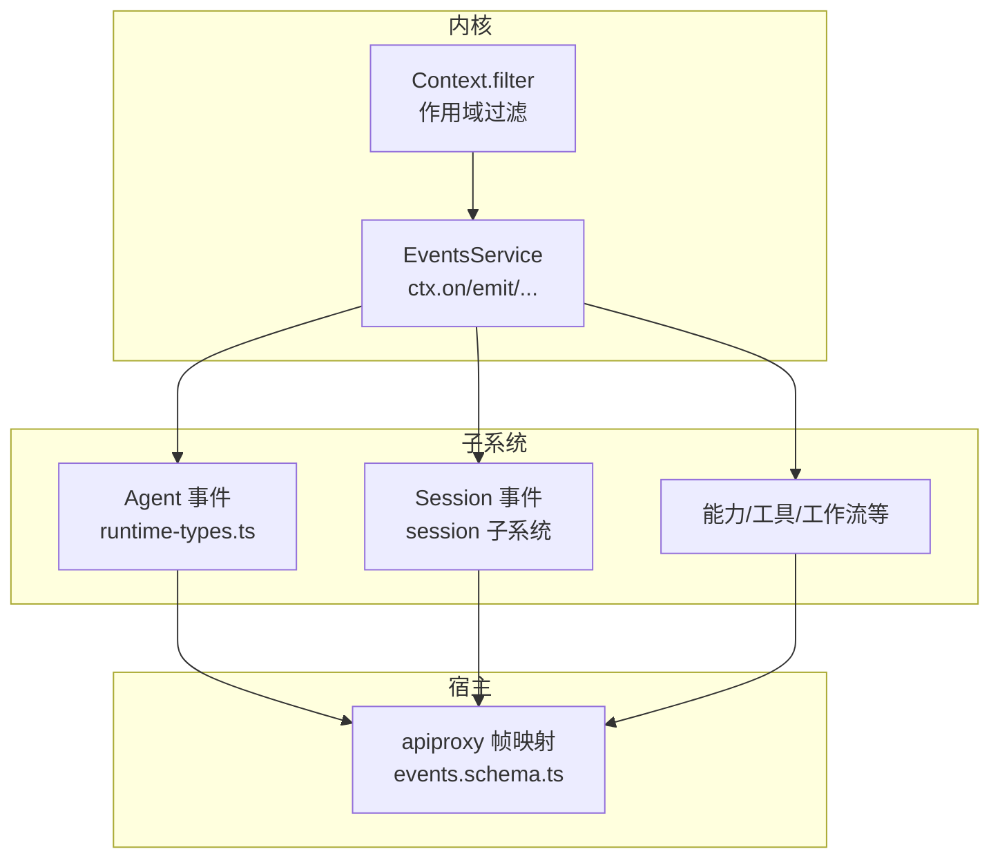
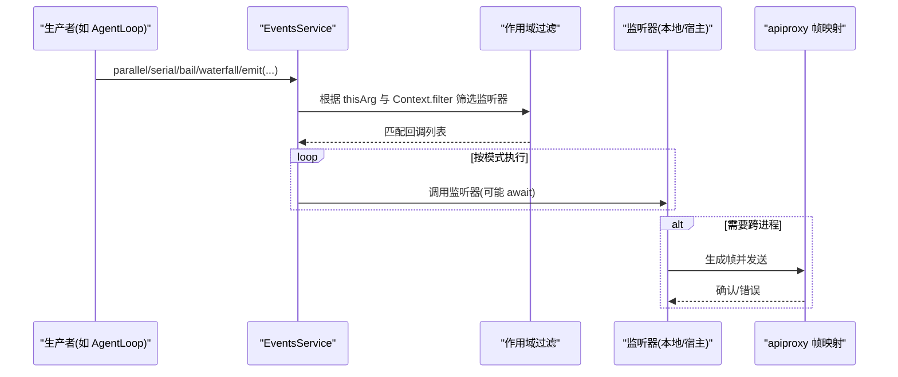
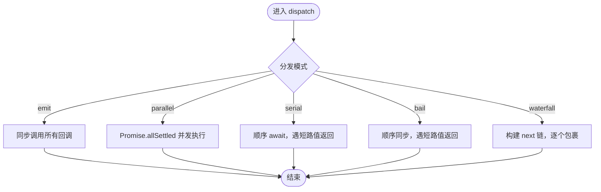
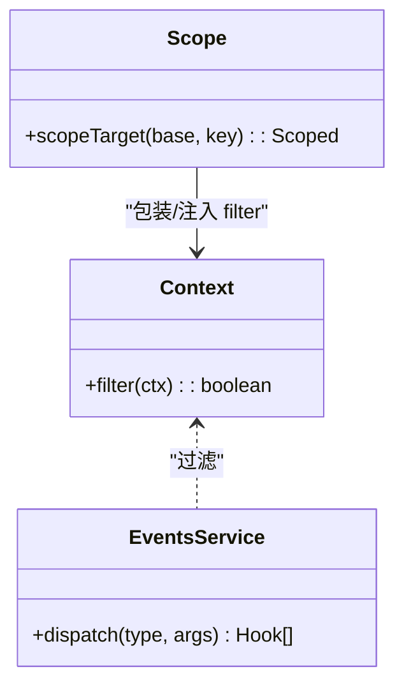
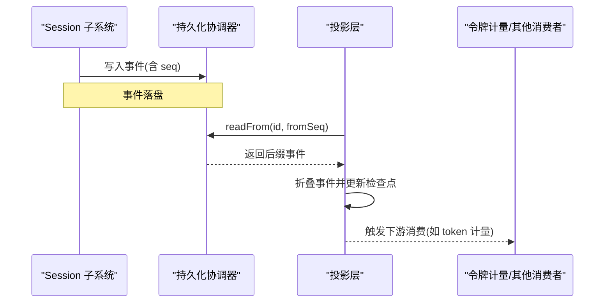
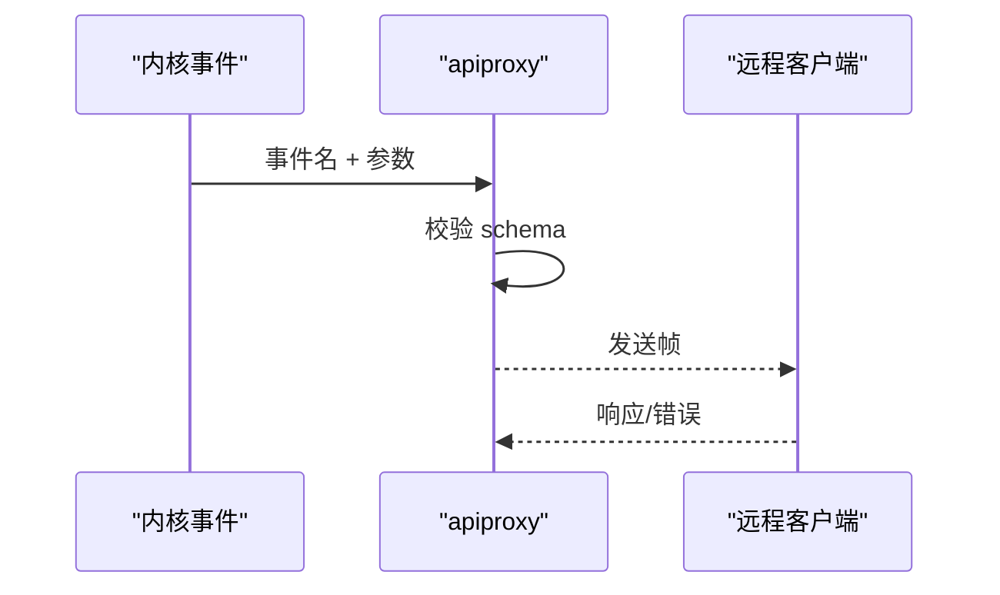
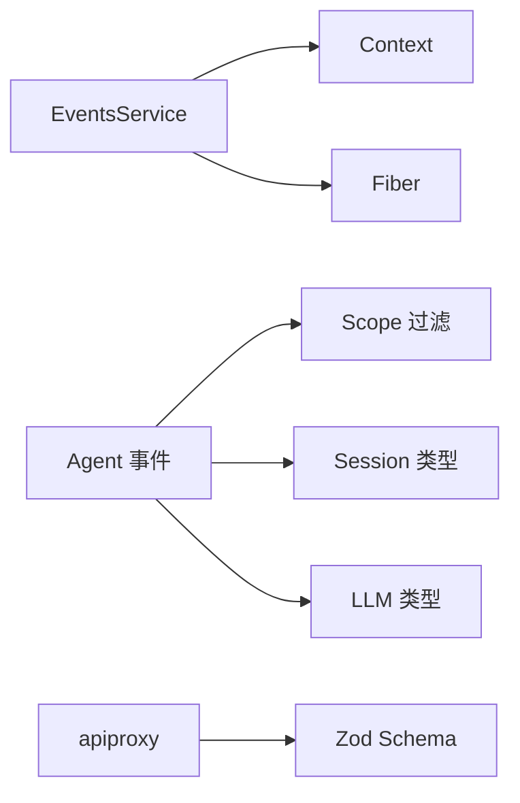

# 事件系统扩展

<cite>
**本文引用的文件**
- [vendor/cordis/src/events.ts](file://vendor/cordis/src/events.ts)
- [docs/cordis-api/events.md](file://docs/cordis-api/events.md)
- [docs/cordis-tutorial/04-events.md](file://docs/cordis-tutorial/04-events.md)
- [docs/event-producer-consumer.md](file://docs/event-producer-consumer.md)
- [packages/core/agent/src/runtime-types.ts](file://packages/core/agent/src/runtime-types.ts)
- [packages/host/apiproxy/src/api/events.schema.ts](file://packages/host/apiproxy/src/api/events.schema.ts)
- [packages/core/scope/src/index.ts](file://packages/core/scope/src/index.ts)
- [packages/session/session-projection/src/index.ts](file://packages/session/session-projection/src/index.ts)
- [packages/session/session-persistence/src/coordinator.ts](file://packages/session/session-persistence/src/coordinator.ts)
- [packages/llm/token-meter/src/index.ts](file://packages/llm/token-meter/src/index.ts)
</cite>

## 目录
1. [简介](#简介)
2. [项目结构](#项目结构)
3. [核心组件](#核心组件)
4. [架构总览](#架构总览)
5. [详细组件分析](#详细组件分析)
6. [依赖关系分析](#依赖关系分析)
7. [性能考虑](#性能考虑)
8. [故障排查指南](#故障排查指南)
9. [结论](#结论)
10. [附录](#附录)

## 简介
本文件面向 Cordis 事件系统的扩展与使用，系统性阐述其设计原理、分发模式、过滤与路由机制、持久化与重放、跨进程通信方案以及性能与内存管理策略。文档同时覆盖三类典型事件的使用场景与最佳实践：会话事件（Session events）、代理事件（Agent events）、能力事件（Capability events）。读者可据此完成事件定义、处理器注册、异步处理、调试与排障，并在分布式环境中安全地扩展事件驱动行为。

## 项目结构
Cordis 事件系统由内核事件总线与各子系统的事件声明/消费组成：
- 内核事件总线位于 vendor/cordis/src/events.ts，提供 ctx.on/emit/parallel/serial/bail/waterfall 等 API 与 EventsService 实现。
- 各子系统通过合并接口 Events 声明事件名称与签名，例如 Agent 事件在 packages/core/agent/src/runtime-types.ts。
- 宿主层通过 apiproxy 将内部事件映射为跨进程帧，见 packages/host/apiproxy/src/api/events.schema.ts。
- 作用域与过滤由 core/scope 提供，支持按 Agent/Scope 路由事件。
- 会话事件持久化与重放由 session 子系统的 persistence 与 projection 协作完成。



图表来源
- [vendor/cordis/src/events.ts:125-319](file://vendor/cordis/src/events.ts#L125-L319)
- [packages/core/agent/src/runtime-types.ts:146-291](file://packages/core/agent/src/runtime-types.ts#L146-L291)
- [packages/host/apiproxy/src/api/events.schema.ts:42-93](file://packages/host/apiproxy/src/api/events.schema.ts#L42-L93)
- [packages/core/scope/src/index.ts:158-185](file://packages/core/scope/src/index.ts#L158-L185)

章节来源
- [vendor/cordis/src/events.ts:125-319](file://vendor/cordis/src/events.ts#L125-L319)
- [docs/cordis-api/events.md:8-123](file://docs/cordis-api/events.md#L8-L123)

## 核心组件
- 事件总线 EventsService：维护监听器集合、分发模式、上下文过滤与生命周期绑定。
- 分发模式：emit（同步广播）、parallel（并发等待）、serial（顺序直到短路）、bail（同步短路）、waterfall（中间件链）。
- 监听器注册：ctx.on/once，支持 prepend 与 global 选项；自动随 Fiber 释放。
- 作用域过滤：基于 Context.filter 的 Scoped 路由，使事件仅投递到匹配的 Agent/Scope 或全局监听器。
- 宿主映射：apiproxy 将内部事件序列化为 MuxFrame/HostFrame 进行跨进程转发。

章节来源
- [vendor/cordis/src/events.ts:125-319](file://vendor/cordis/src/events.ts#L125-L319)
- [docs/cordis-api/events.md:8-123](file://docs/cordis-api/events.md#L8-L123)
- [packages/core/scope/src/index.ts:158-185](file://packages/core/scope/src/index.ts#L158-L185)
- [packages/host/apiproxy/src/api/events.schema.ts:42-93](file://packages/host/apiproxy/src/api/events.schema.ts#L42-L93)

## 架构总览
下图展示一次 Agent 事件的完整链路：生产者（AgentLoop）通过 ctx.events 分发，经作用域过滤后到达订阅者，必要时被宿主层序列化并转发给远端客户端。



图表来源
- [vendor/cordis/src/events.ts:165-243](file://vendor/cordis/src/events.ts#L165-L243)
- [packages/core/scope/src/index.ts:158-185](file://packages/core/scope/src/index.ts#L158-L185)
- [packages/host/apiproxy/src/api/events.schema.ts:42-93](file://packages/host/apiproxy/src/api/events.schema.ts#L42-L93)

## 详细组件分析

### 事件总线与分发模式
- emit：同步广播，不等待返回值或 Promise。
- parallel：并发执行所有监听器，聚合异常为 AggregateError。
- serial：顺序执行，遇到“短路值”（非 null/false/undefined）即停止。
- bail：同步版 serial。
- waterfall：以 next() 串联的中间件链，允许转换或否决后续逻辑。



图表来源
- [vendor/cordis/src/events.ts:177-243](file://vendor/cordis/src/events.ts#L177-L243)
- [docs/cordis-api/events.md:8-123](file://docs/cordis-api/events.md#L8-L123)

章节来源
- [vendor/cordis/src/events.ts:177-243](file://vendor/cordis/src/events.ts#L177-L243)
- [docs/cordis-api/events.md:8-123](file://docs/cordis-api/events.md#L8-L123)

### 作用域与过滤机制
- 每个 Context 可通过 Context.filter 提供过滤函数，决定哪些监听器能接收事件。
- scopeTarget 构造带标签的接收者，使事件沿作用域链向上路由（父作用域可收到子作用域事件），但不会向下传播。
- { global: true } 的监听器会绕过作用域过滤，但仍受注册上下文的生命周期约束。



图表来源
- [packages/core/scope/src/index.ts:158-185](file://packages/core/scope/src/index.ts#L158-L185)
- [vendor/cordis/src/events.ts:165-175](file://vendor/cordis/src/events.ts#L165-L175)

章节来源
- [packages/core/scope/src/index.ts:158-185](file://packages/core/scope/src/index.ts#L158-L185)
- [vendor/cordis/src/events.ts:165-175](file://vendor/cordis/src/events.ts#L165-L175)

### 会话事件（Session events）
- 会话生命周期事件（创建、销毁、flush、event 等）由 session 子系统产生，广泛用于持久化、遥测、标题生成、压缩等。
- 持久化协调器支持从指定 seq 读取后缀，配合投影层做冷启动折叠与增量回放。
- 投影层对存储日志进行折叠，结合检查点行恢复状态，保证幂等与一致性。



图表来源
- [packages/session/session-persistence/src/coordinator.ts:154-176](file://packages/session/session-persistence/src/coordinator.ts#L154-L176)
- [packages/session/session-projection/src/index.ts:333-353](file://packages/session/session-projection/src/index.ts#L333-L353)
- [packages/llm/token-meter/src/index.ts:159-191](file://packages/llm/token-meter/src/index.ts#L159-L191)

章节来源
- [docs/event-producer-consumer.md:41-44](file://docs/event-producer-consumer.md#L41-L44)
- [packages/session/session-persistence/src/coordinator.ts:154-176](file://packages/session/session-persistence/src/coordinator.ts#L154-L176)
- [packages/session/session-projection/src/index.ts:333-353](file://packages/session/session-projection/src/index.ts#L333-L353)
- [packages/llm/token-meter/src/index.ts:159-191](file://packages/llm/token-meter/src/index.ts#L159-L191)

### 代理事件（Agent events）
- 代理生命周期与运行期事件包括 created/disposed/status/inbox/*、pre-step/request/request-error/turn-stopping/error 等。
- 多数事件采用 emit 通知，关键决策点采用 waterfall 或 serial 以支持拦截与短路。
- 事件携带 Scoped<Agent> 作为 this，便于按 Agent 作用域路由。

```mermaid
sequenceDiagram
participant Loop as "AgentLoop"
participant Bus as "EventsService"
participant L1 as "指令/计划/压缩等插件"
participant L2 as "遥测/审批/工具等"
Loop->>Bus : agent/pre-step (waterfall)
Bus->>L1 : 允许/拒绝步骤
L1-->>Bus : 返回决策
Loop->>Bus : agent/request (waterfall)
Bus->>L2 : 替换请求配置/重试策略
L2-->>Bus : 返回新配置
```

图表来源
- [packages/core/agent/src/runtime-types.ts:219-278](file://packages/core/agent/src/runtime-types.ts#L219-L278)
- [docs/event-producer-consumer.md:18-23](file://docs/event-producer-consumer.md#L18-L23)

章节来源
- [packages/core/agent/src/runtime-types.ts:146-291](file://packages/core/agent/src/runtime-types.ts#L146-L291)
- [docs/event-producer-consumer.md:18-23](file://docs/event-producer-consumer.md#L18-L23)

### 能力事件（Capability events）
- 能力相关事件涵盖工具、技能、工作流、设置、凭据、文件系统访问等，通常以 emit 广播变更，或以 waterfall 进行策略拦截。
- 常见用途：权限策略、审计、观测、缓存失效、UI 更新等。

章节来源
- [docs/event-producer-consumer.md:32-65](file://docs/event-producer-consumer.md#L32-L65)

### 跨进程事件通信
- apiproxy 将内部事件封装为 MuxFrame/HostFrame，严格校验字段类型，确保跨进程传输安全。
- 对于无订阅者的事件，网关侧会直接丢弃，避免无效开销。



图表来源
- [packages/host/apiproxy/src/api/events.schema.ts:42-93](file://packages/host/apiproxy/src/api/events.schema.ts#L42-L93)

章节来源
- [packages/host/apiproxy/src/api/events.schema.ts:42-93](file://packages/host/apiproxy/src/api/events.schema.ts#L42-L93)

## 依赖关系分析
- EventsService 依赖 Context、Fiber、反射与工具模块，负责监听器生命周期与分发。
- Agent 事件声明依赖 Session、LLM、Scope 等类型，体现领域耦合。
- 宿主层依赖 schema 校验，确保跨进程数据契约稳定。
- 作用域模块与事件总线解耦，通过 Context.filter 注入过滤逻辑。



图表来源
- [vendor/cordis/src/events.ts:125-319](file://vendor/cordis/src/events.ts#L125-L319)
- [packages/core/agent/src/runtime-types.ts:146-291](file://packages/core/agent/src/runtime-types.ts#L146-L291)
- [packages/host/apiproxy/src/api/events.schema.ts:42-93](file://packages/host/apiproxy/src/api/events.schema.ts#L42-L93)
- [packages/core/scope/src/index.ts:158-185](file://packages/core/scope/src/index.ts#L158-L185)

章节来源
- [vendor/cordis/src/events.ts:125-319](file://vendor/cordis/src/events.ts#L125-L319)
- [packages/core/agent/src/runtime-types.ts:146-291](file://packages/core/agent/src/runtime-types.ts#L146-L291)
- [packages/host/apiproxy/src/api/events.schema.ts:42-93](file://packages/host/apiproxy/src/api/events.schema.ts#L42-L93)
- [packages/core/scope/src/index.ts:158-185](file://packages/core/scope/src/index.ts#L158-L185)

## 性能考虑
- 选择合适分发模式：高频低代价的通知用 emit；需聚合结果用 parallel；需要短路决策用 serial/bail；需要中间件链用 waterfall。
- 避免在并行模式中抛出过多异常，AggregateError 会收集全部失败原因。
- 使用作用域过滤减少无关监听器的调用成本。
- 持久化与重放：利用 seek-capable 后端只读后缀，降低冷启动与回放成本；投影层按序折叠事件，保持幂等。
- 大对象与流式数据：尽量传递引用或分块，避免重复拷贝；对长时任务使用 AbortSignal 控制取消。

[本节为通用指导，无需特定文件来源]

## 故障排查指南
- 监听器未触发：检查是否被作用域过滤排除；确认注册上下文处于激活状态；必要时使用 { global: true } 临时验证。
- 短路行为不符合预期：确认事件模式与短路值约定（null/false/undefined 不短路）。
- 跨进程丢失：核对 apiproxy schema 是否通过；确认远端已订阅对应通道。
- 回放不一致：检查事件幂等性与 seq 连续性；确保投影层 baseSeq 与检查点一致。
- 资源泄漏：确保 ctx.on 注册的监听器随 Fiber 释放；避免手动持有引用导致无法回收。

章节来源
- [vendor/cordis/src/events.ts:165-243](file://vendor/cordis/src/events.ts#L165-L243)
- [packages/host/apiproxy/src/api/events.schema.ts:42-93](file://packages/host/apiproxy/src/api/events.schema.ts#L42-L93)
- [packages/session/session-projection/src/index.ts:333-353](file://packages/session/session-projection/src/index.ts#L333-L353)

## 结论
Cordis 事件系统以统一的事件总线为核心，结合多种分发模式与作用域路由，支撑了会话、代理与能力等多类事件的解耦通信。通过持久化与投影机制，系统实现了可靠的重放与状态恢复；借助 apiproxy 的严格 schema，跨进程通信具备强契约保障。遵循本文的最佳实践，可在保证性能与可维护性的前提下，安全扩展事件驱动功能。

[本节为总结性内容，无需特定文件来源]

## 附录
- 快速上手：参考教程中的事件声明、发射与监听示例，理解五种分发模式的差异与适用场景。
- 事件矩阵：查阅事件生产者/消费者矩阵，了解各子系统间的事件依赖关系。
- 调试技巧：利用 internal/dispatch 等内部事件观察分发路径；结合作用域过滤定位问题范围。

章节来源
- [docs/cordis-tutorial/04-events.md:7-141](file://docs/cordis-tutorial/04-events.md#L7-L141)
- [docs/event-producer-consumer.md:8-75](file://docs/event-producer-consumer.md#L8-L75)
- [vendor/cordis/src/events.ts:321-352](file://vendor/cordis/src/events.ts#L321-L352)