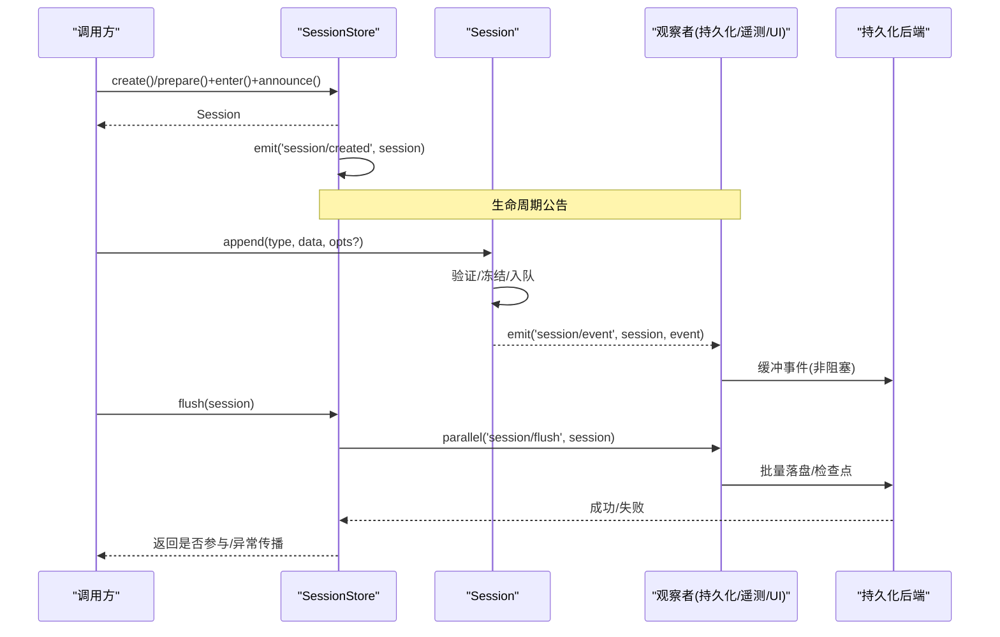
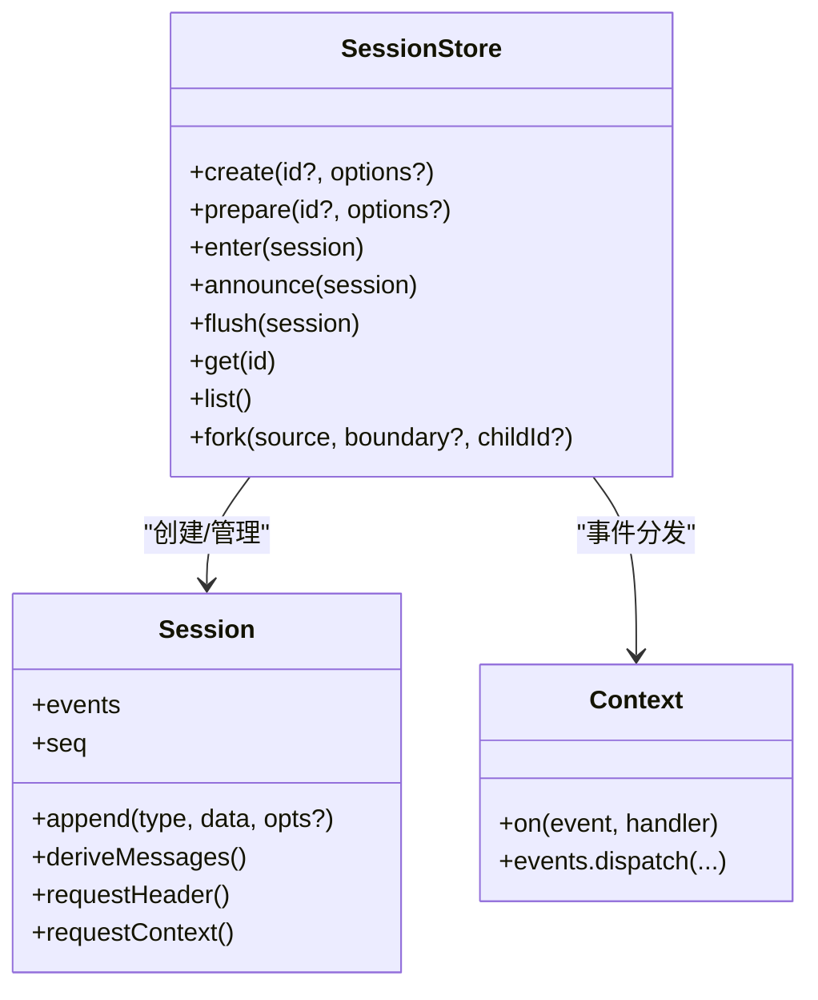

# 会话事件

<cite>
**本文引用的文件**
- [packages/core/session/src/index.ts](file://packages/core/session/src/index.ts)
- [packages/core/session/tests/scoped.spec.ts](file://packages/core/session/tests/scoped.spec.ts)
- [packages/core/session/tests/session.spec.ts](file://packages/core/session/tests/session.spec.ts)
- [docs/subsystems/session.md](file://docs/subsystems/session.md)
- [docs/subsystems/persistence.md](file://docs/subsystems/persistence.md)
- [docs/subsystems/session-telemetry.md](file://docs/subsystems/session-telemetry.md)
- [docs/subsystems/compaction.md](file://docs/subsystems/compaction.md)
</cite>

## 目录
1. [简介](#简介)
2. [项目结构](#项目结构)
3. [核心组件](#核心组件)
4. [架构总览](#架构总览)
5. [详细组件分析](#详细组件分析)
6. [依赖关系分析](#依赖关系分析)
7. [性能考量](#性能考量)
8. [故障排查指南](#故障排查指南)
9. [结论](#结论)
10. [附录](#附录)

## 简介
本文件围绕“会话事件”展开，系统性说明会话生命周期相关的事件类型与处理流程，重点覆盖 session/created、session/disposed、session/event、session/flush 等核心事件。文档解释每个事件的触发时机、数据结构、监听与处理模式，并阐述它们在持久化、遥测、压缩等功能中的作用，同时提供调试技巧与性能优化建议。

## 项目结构
- 会话核心实现在 packages/core/session/src/index.ts，提供 Session 类与会话存储 SessionStore，以及 ctx.sessions API。
- 会话事件在 Context.Events 中声明：session/created、session/disposed、session/event、session/flush。
- 持久化通过订阅 session/event 并在 session/flush 时落盘；遥测通过会话事件捕获并导出；压缩通过扩展 SessionEventMap 的 log-only 事件参与会话历史。

```mermaid
graph TB
A["应用/插件"] --> B["SessionStore<br/>ctx.sessions"]
B --> C["Session.append()<br/>追加事件到日志"]
C --> D["session/event<br/>同步通知观察者"]
B --> E["session/flush<br/>持久化检查点"]
B --> F["session/created / disposed<br/>生命周期公告"]
G["持久化后端"] <- --> E
H["遥测采集器"] <- --> D
I["压缩能力"] <- --> C
```

图表来源
- [packages/core/session/src/index.ts:37-86](file://packages/core/session/src/index.ts#L37-L86)
- [packages/core/session/src/index.ts:604-655](file://packages/core/session/src/index.ts#L604-L655)
- [docs/subsystems/persistence.md:9-19](file://docs/subsystems/persistence.md#L9-L19)
- [docs/subsystems/session-telemetry.md:57-127](file://docs/subsystems/session-telemetry.md#L57-L127)
- [docs/subsystems/compaction.md:9-23](file://docs/subsystems/compaction.md#L9-L23)

章节来源
- [packages/core/session/src/index.ts:37-86](file://packages/core/session/src/index.ts#L37-L86)
- [docs/subsystems/session.md:1-12](file://docs/subsystems/session.md#L1-L12)

## 核心组件
- Session：追加型事件日志，维护有序表面（surface）与派生消息历史，提供 append、deriveMessages、requestHeader/requestContext 等能力。
- SessionStore：内存会话存储，负责创建、进入、公告、分离、flush 等生命周期管理，并发出 session/created、session/disposed、session/event、session/flush 事件。
- 事件系统：基于 Cordis 上下文的事件分发，支持范围过滤（scope），对 session/* 事件进行 emit/parallel/waterfall 等调度模式。

章节来源
- [packages/core/session/src/index.ts:425-758](file://packages/core/session/src/index.ts#L425-L758)
- [packages/core/session/src/index.ts:792-800](file://packages/core/session/src/index.ts#L792-L800)
- [docs/subsystems/session.md:359-519](file://docs/subsystems/session.md#L359-L519)

## 架构总览
会话事件驱动了以下关键路径：
- 事件追加：Session.append 将事件写入日志，随后通过 session/event 通知所有已注册的观察者（持久化、遥测、UI 等）。
- 持久化：持久化插件订阅 session/event 缓冲事件，并在 session/flush 时批量落盘；flush 是顺序与错误观察的检查点。
- 遥测：会话事件被捕获为逻辑记录，经 redact 水线下发至后端；仅首条 assistant/chunk 作为流开始信号发出，其余按策略丢弃。
- 压缩：通过扩展 SessionEventMap 添加 compaction/* 事件，以 log-only 方式记录压缩过程，并通过 surface replace 替换历史片段。



图表来源
- [packages/core/session/src/index.ts:604-655](file://packages/core/session/src/index.ts#L604-L655)
- [packages/core/session/src/index.ts:984-1007](file://packages/core/session/src/index.ts#L984-L1007)
- [docs/subsystems/persistence.md:9-19](file://docs/subsystems/persistence.md#L9-L19)
- [docs/subsystems/session-telemetry.md:57-127](file://docs/subsystems/session-telemetry.md#L57-L127)

## 详细组件分析

### 事件：session/created
- 触发时机：会话进入存储并被公告时，由 SessionStore 发出一次。若公告期间抛出同步异常，会回滚并配对释放；异步拒绝会被记录但不影响后续监听器执行。
- 数据与范围：携带当前会话对象；支持 scope 过滤，只有在该 agent 上下文中进入的会话才会被对应范围的监听器收到。
- 典型用途：初始化资源、注册回调、启动监控或上报。

章节来源
- [packages/core/session/src/index.ts:37-86](file://packages/core/session/src/index.ts#L37-L86)
- [packages/core/session/src/index.ts:984-1007](file://packages/core/session/src/index.ts#L984-L1007)
- [packages/core/session/tests/session.spec.ts:1200-1255](file://packages/core/session/tests/session.spec.ts#L1200-L1255)

### 事件：session/disposed
- 触发时机：会话离开存储时（包括公告回滚），但从未公告过的条目不会收到。
- 数据与范围：携带会话对象；复用所有者 scope。
- 典型用途：清理资源、停止后台任务、释放锁或句柄。

章节来源
- [packages/core/session/src/index.ts:37-86](file://packages/core/session/src/index.ts#L37-L86)
- [packages/core/session/src/index.ts:998-1007](file://packages/core/session/src/index.ts#L998-L1007)
- [packages/core/session/tests/session.spec.ts:1597-1624](file://packages/core/session/tests/session.spec.ts#L1597-L1624)

### 事件：session/event
- 触发时机：每次 Session.append 成功后，立即通知观察者。注意：append 是热路径，不阻塞 I/O；观察者失败被隔离并记录，不影响事件提交。
- 数据：包含会话对象与被追加的事件（含 seq/time/data 及可选 surface metadata）。
- 典型用途：
  - 持久化：收集事件并缓冲，等待 flush 落盘。
  - 遥测：捕获事件并转换为逻辑记录，经 redact 后下发。
  - UI/诊断：实时渲染或统计。

章节来源
- [packages/core/session/src/index.ts:604-655](file://packages/core/session/src/index.ts#L604-L655)
- [packages/core/session/tests/scoped.spec.ts:35-62](file://packages/core/session/tests/scoped.spec.ts#L35-L62)
- [docs/subsystems/session-telemetry.md:57-127](file://docs/subsystems/session-telemetry.md#L57-L127)

### 事件：session/flush
- 触发时机：显式调用 ctx.sessions.flush(session) 时，作为持久化检查点。
- 行为：并行派发给所有监听器，调用方 await 所有监听器完成；首个监听器失败会在全部监听器 settle 后传播。
- 典型用途：持久化后端在此处将缓冲事件写入磁盘；也可用于其他需要“确认已完成”的副作用。

章节来源
- [packages/core/session/tests/scoped.spec.ts:82-161](file://packages/core/session/tests/scoped.spec.ts#L82-L161)
- [docs/subsystems/persistence.md:9-19](file://docs/subsystems/persistence.md#L9-L19)

### 事件：session/end-seed（补充）
- 作用：标记构造种子结束位置，区分“种子历史”和“本次进程新增事件”。对冷启动恢复、回放、遥测采用者非常关键。
- 写入时机：当使用 seed 构造会话且末尾不存在该事件时，append 一个空 payload 的 session/end-seed。

章节来源
- [docs/subsystems/session.md:583-592](file://docs/subsystems/session.md#L583-L592)
- [packages/core/session/src/index.ts:541-547](file://packages/core/session/src/index.ts#L541-L547)

### 事件：compaction/*（压缩扩展，log-only）
- 事件族：compaction/start、compaction/summary、compaction/end。
- 角色：记录压缩锁、摘要、被替换的范围与 token 计数等；不加入模型可见表面，真正的表面变更通过 user/message + surfaceOp replace 实现。
- 使用场景：自动压力/上下文溢出时的历史压缩，减少请求体积。

章节来源
- [docs/subsystems/compaction.md:9-23](file://docs/subsystems/compaction.md#L9-L23)
- [docs/subsystems/compaction.md:25-87](file://docs/subsystems/compaction.md#L25-L87)

## 依赖关系分析
- SessionStore 依赖 Context 的事件分发机制，负责 session/* 事件的发布与范围过滤。
- Session 内部维护 SurfaceManager，确保 surface 一致性；append 前校验 surface metadata。
- 持久化、遥测、压缩均通过订阅 session/event 或显式调用 flush 来协作，彼此解耦。



图表来源
- [packages/core/session/src/index.ts:425-758](file://packages/core/session/src/index.ts#L425-L758)
- [packages/core/session/src/index.ts:792-800](file://packages/core/session/src/index.ts#L792-L800)

章节来源
- [packages/core/session/src/index.ts:425-758](file://packages/core/session/src/index.ts#L425-L758)
- [packages/core/session/src/index.ts:792-800](file://packages/core/session/src/index.ts#L792-L800)

## 性能考量
- 事件追加路径为非阻塞 I/O：Session.append 只做验证、冻结与日志追加，I/O 由观察者异步处理。
- 持久化批处理：首次待写事件开启固定窗口，后续事件加入而不重置截止期；flush 取消等待并排空至稳定状态。
- 遥测首条 chunk 策略：每 (turn, step) 仅发送第一条 assistant/chunk 作为流开始信号，降低带宽与后端压力。
- 范围过滤：session/* 事件支持 scope 过滤，避免无关监听器被唤醒。
- 建议：
  - 将重 I/O 放入 session/flush 监听器，避免在 session/event 中做阻塞操作。
  - 合理设置持久化批大小与超时，平衡延迟与吞吐。
  - 遥测侧实现幂等去重（基于 session.id + event.seq），容忍重复与丢失。

章节来源
- [docs/subsystems/persistence.md:9-19](file://docs/subsystems/persistence.md#L9-L19)
- [docs/subsystems/session-telemetry.md:57-127](file://docs/subsystems/session-telemetry.md#L57-L127)
- [packages/core/session/tests/scoped.spec.ts:82-161](file://packages/core/session/tests/scoped.spec.ts#L82-L161)

## 故障排查指南
- 监听器异常隔离：
  - session/event 与 session/disposed 的监听器抛错会被捕获并记录，不会导致事件提交失败或后续监听器饥饿。
  - session/created 的异步拒绝会被记录，但不能撤销已提交的创建。
- 常见症状与定位：
  - 持久化失败：检查 session/flush 监听器抛出的错误；确认批处理窗口与重试策略。
  - 遥测缺失：确认 session/event 是否被捕获；检查 session-telemetry/record 水线是否拦截。
  - 压缩未生效：检查 compaction/* 事件是否成对出现（start/end），以及 surface replace 是否成功。
- 调试技巧：
  - 在 session/event 中打印事件 type/seq/time，结合持久化序列号核对连续性。
  - 在 session/flush 前后打点，测量批处理耗时与失败率。
  - 使用 scope 过滤缩小监听范围，聚焦特定 agent 的会话。

章节来源
- [packages/core/session/tests/session.spec.ts:1577-1638](file://packages/core/session/tests/session.spec.ts#L1577-L1638)
- [packages/core/session/tests/scoped.spec.ts:82-161](file://packages/core/session/tests/scoped.spec.ts#L82-L161)
- [docs/subsystems/session-telemetry.md:124-195](file://docs/subsystems/session-telemetry.md#L124-L195)

## 结论
会话事件以 session/event 为核心，配合 session/created/disposed 的生命周期公告与 session/flush 的持久化检查点，构成了可扩展、高性能、可观测的会话基础设施。持久化、遥测、压缩等能力通过订阅事件或显式调用 flush 无缝接入，既保持核心简洁，又满足多样化需求。遵循本文的最佳实践与调试建议，可在保证一致性的前提下获得良好的性能与可维护性。

## 附录

### 监听与处理示例（代码片段路径）
- 监听 session/created 与 session/disposed：
  - [packages/core/session/tests/session.spec.ts:1200-1255](file://packages/core/session/tests/session.spec.ts#L1200-L1255)
- 监听 session/event 并按 scope 过滤：
  - [packages/core/session/tests/scoped.spec.ts:35-62](file://packages/core/session/tests/scoped.spec.ts#L35-L62)
- 使用 session/flush 作为持久化检查点：
  - [packages/core/session/tests/scoped.spec.ts:82-161](file://packages/core/session/tests/scoped.spec.ts#L82-L161)
- 遥测记录与 redact 水线：
  - [docs/subsystems/session-telemetry.md:124-195](file://docs/subsystems/session-telemetry.md#L124-L195)
- 压缩事件与表面替换：
  - [docs/subsystems/compaction.md:9-23](file://docs/subsystems/compaction.md#L9-L23)
  - [docs/subsystems/compaction.md:25-87](file://docs/subsystems/compaction.md#L25-L87)