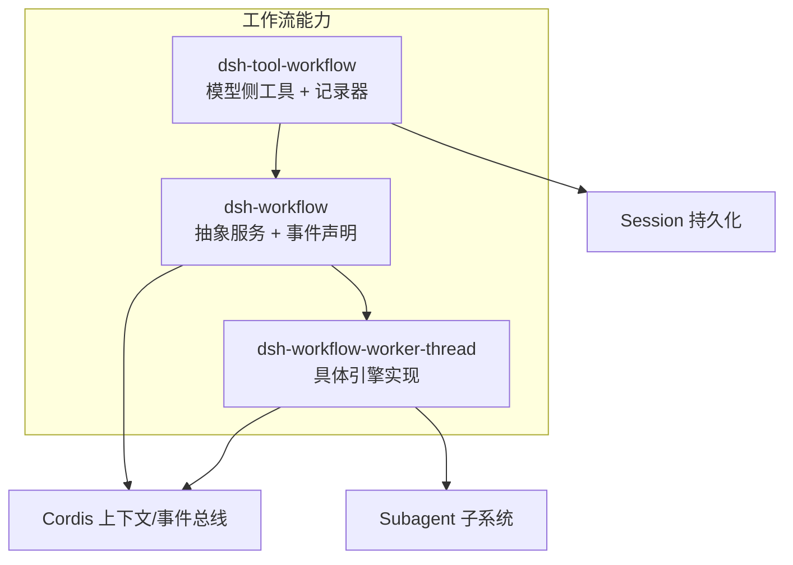
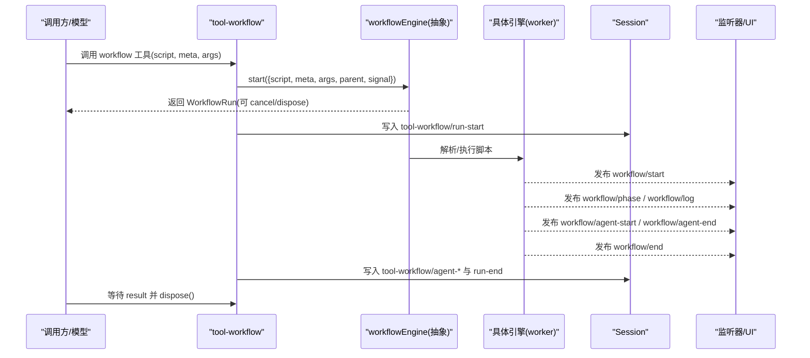
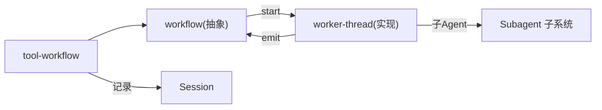

# 工作流事件

<cite>
**本文引用的文件**
- [packages/workflow/workflow/src/index.ts](file://packages/workflow/workflow/src/index.ts)
- [packages/workflow/workflow/src/types.ts](file://packages/workflow/workflow/src/types.ts)
- [packages/workflow/tool-workflow/src/index.ts](file://packages/workflow/tool-workflow/src/index.ts)
- [docs/subsystems/workflow.md](file://docs/subsystems/workflow.md)
- [docs/cordis-api/events.md](file://docs/cordis-api/events.md)
- [packages/workflow/workflow/tests/workflow.spec.ts](file://packages/workflow/workflow/tests/workflow.spec.ts)
</cite>

## 目录
1. [简介](#简介)
2. [项目结构](#项目结构)
3. [核心组件](#核心组件)
4. [架构总览](#架构总览)
5. [详细组件分析](#详细组件分析)
6. [依赖关系分析](#依赖关系分析)
7. [性能与可靠性](#性能与可靠性)
8. [故障排查指南](#故障排查指南)
9. [结论](#结论)
10. [附录：事件清单与监听示例](#附录事件清单与监听示例)

## 简介
本文件系统化梳理工作流（Workflow）事件体系，覆盖工作流生命周期事件、Agent 调用事件、状态管理与进度跟踪机制，以及事件监听实现与调试技巧。同时说明工作流事件与会话（Session）、工具（Tool）、权限等系统的交互模式，帮助读者在扩展或集成时正确消费和产出事件。

## 项目结构
工作流能力由三个关键包协作完成：
- dsh-workflow：定义抽象服务契约、事件类型与事件分发封装（workflowEngine、workflow/* 事件）。
- dsh-tool-workflow：面向模型的“workflow”工具，负责参数校验、运行编排、结果渲染与持久化记录。
- dsh-workflow-worker-thread：具体引擎实现（worker_threads），承载脚本执行、子 Agent 调度与事件发布。

图表来源
- [packages/workflow/workflow/src/index.ts:31-90](file://packages/workflow/workflow/src/index.ts#L31-L90)
- [packages/workflow/tool-workflow/src/index.ts:205-336](file://packages/workflow/tool-workflow/src/index.ts#L205-L336)
- [docs/subsystems/workflow.md:1-10](file://docs/subsystems/workflow.md#L1-L10)

章节来源
- [docs/subsystems/workflow.md:1-10](file://docs/subsystems/workflow.md#L1-L10)

## 核心组件
- WorkflowEngine（抽象服务）：暴露 start(request) 启动一次工作流运行；内部提供 emitWorkflowEvent(name, ...args) 安全地分发 workflow/* 事件，确保每个监听器异常被捕获并记录，不会污染其他监听器。
- 事件类型与数据快照：所有 workflow/* 事件的 payload 以 WorkflowRunInfo（id + meta）开头，不暴露活跃句柄，保证只读观察。
- Tool-workflow 记录器：将 workflow/* 事件投影为 Session 的 tool-workflow/* 记录，用于 UI 展示与审计。

章节来源
- [packages/workflow/workflow/src/index.ts:150-186](file://packages/workflow/workflow/src/index.ts#L150-L186)
- [packages/workflow/workflow/src/types.ts:89-131](file://packages/workflow/workflow/src/types.ts#L89-L131)
- [packages/workflow/tool-workflow/src/index.ts:73-131](file://packages/workflow/tool-workflow/src/index.ts#L73-L131)

## 架构总览
工作流事件贯穿“工具调用 → 引擎执行 → 事件发布 → 记录持久化 → UI 呈现”的全链路。

图表来源
- [packages/workflow/tool-workflow/src/index.ts:272-336](file://packages/workflow/tool-workflow/src/index.ts#L272-L336)
- [packages/workflow/workflow/src/index.ts:170-186](file://packages/workflow/workflow/src/index.ts#L170-L186)
- [docs/subsystems/workflow.md:118-128](file://docs/subsystems/workflow.md#L118-L128)

## 详细组件分析

### 工作流生命周期事件
- workflow/start：元数据校验通过、脚本即将执行。携带 WorkflowRunInfo。
- workflow/phase：进度分组，仅用于观察者/界面分组，无执行语义。
- workflow/log：脚本叙述日志行。
- workflow/end：运行结算（completed/cancelled/error），携带 stopReason、error、agentsStarted，不包含结果值。

这些事件均为“仅观察”的 emit 模式，payload 是快照，监听器无法控制运行。

章节来源
- [packages/workflow/workflow/src/index.ts:36-90](file://packages/workflow/workflow/src/index.ts#L36-L90)
- [docs/subsystems/workflow.md:118-128](file://docs/subsystems/workflow.md#L118-L128)

### Agent 调用事件（workflow/agent-start / workflow/agent-end）
- workflow/agent-start：一次 agent() 调用建立了已发布的子运行。包含 seq、label、phase、childId。
- workflow/agent-end：该 agent() 调用结算（completed/failed/cancelled），与 start 通过 seq 配对，每条启动路径恰好一次结束。

注意：若某次 agent() 未收到 provider 发布的子运行，则这对事件都不会发出。

章节来源
- [packages/workflow/workflow/src/index.ts:59-79](file://packages/workflow/workflow/src/index.ts#L59-L79)
- [packages/workflow/workflow/src/types.ts:97-116](file://packages/workflow/workflow/src/types.ts#L97-L116)

### 状态管理与进度跟踪
- 运行状态：由 WorkflowResult.stopReason 表达 completed/cancelled/error。
- 进度分组：通过 phase(title) 触发 workflow/phase，供 UI 分组显示。
- 日志输出：log(message) 触发 workflow/log，便于追踪。
- 子 Agent 计数：result.agentsStarted 表示运行期间接受的 agent() 调用总数。

章节来源
- [packages/workflow/workflow/src/types.ts:57-87](file://packages/workflow/workflow/src/types.ts#L57-L87)
- [docs/subsystems/workflow.md:39-91](file://docs/subsystems/workflow.md#L39-L91)

### 事件分发与监听器隔离
- 使用 ctx.events.dispatch('emit', ...) 分发，逐个监听器 try/catch 包裹，异步拒绝会被捕获并记录警告。
- 每个监听器收到的是 payload 克隆，修改不会影响其他监听器或引擎。
- 失败不会传播，也不会饿死后续监听器。

章节来源
- [packages/workflow/workflow/src/index.ts:170-186](file://packages/workflow/workflow/src/index.ts#L170-L186)
- [packages/workflow/workflow/tests/workflow.spec.ts:54-106](file://packages/workflow/workflow/tests/workflow.spec.ts#L54-L106)

### 与会话（Session）的交互
- tool-workflow 在运行接受后写入 tool-workflow/run-start，并在 dispose 完成后写入 tool-workflow/run-end。
- 中间通过 workflow/agent-start/agent-end 映射为 tool-workflow/agent-start/agent-end，按 runId + seq 配对。
- 首次 append 失败会禁用该运行的后续写入，保证日志为空或连续前缀。

章节来源
- [packages/workflow/tool-workflow/src/index.ts:73-131](file://packages/workflow/tool-workflow/src/index.ts#L73-L131)
- [docs/subsystems/workflow.md:122-128](file://docs/subsystems/workflow.md#L122-L128)

### 与其他系统（工具、权限、子 Agent）的交互
- 工具层：tool-workflow 负责参数校验、结果渲染、AbortSignal 桥接到 run.cancel。
- 权限/策略：脚本无法观察或替换引擎级 subagentProvider 与 maxTotalAgents，策略由上层注入。
- 子 Agent：通过 Subagent 子系统传递 cwd、谱系、深度等信息；workflow 事件中的 childId 即子 Agent 的 SessionId。

章节来源
- [packages/workflow/tool-workflow/src/index.ts:272-336](file://packages/workflow/tool-workflow/src/index.ts#L272-L336)
- [docs/subsystems/workflow.md:11-13](file://docs/subsystems/workflow.md#L11-L13)

## 依赖关系分析
- dsh-workflow 暴露抽象服务与事件类型，不依赖具体引擎。
- dsh-tool-workflow 依赖 dsh-workflow 的事件与服务，并依赖 Session 进行持久化。
- 具体引擎（worker-thread）实现 WorkflowEngine.start，并发布 workflow/* 事件。

图表来源
- [packages/workflow/tool-workflow/src/index.ts:205-336](file://packages/workflow/tool-workflow/src/index.ts#L205-L336)
- [packages/workflow/workflow/src/index.ts:150-186](file://packages/workflow/workflow/src/index.ts#L150-L186)

章节来源
- [packages/workflow/tool-workflow/src/index.ts:205-336](file://packages/workflow/tool-workflow/src/index.ts#L205-L336)
- [packages/workflow/workflow/src/index.ts:150-186](file://packages/workflow/workflow/src/index.ts#L150-L186)

## 性能与可靠性
- 事件分发采用 emit 模式，监听器异常被隔离，避免阻塞主流程。
- 运行结果从不 reject，取消与释放有界，dispose 会等待子代理清理，防止悬挂。
- 结果值不在 workflow/end 中暴露给监听器，避免可变别名泄露。
- 记录写入失败会降级（禁用后续写入），不影响工具主流程。

章节来源
- [packages/workflow/workflow/src/index.ts:150-186](file://packages/workflow/workflow/src/index.ts#L150-L186)
- [packages/workflow/tool-workflow/src/index.ts:73-131](file://packages/workflow/tool-workflow/src/index.ts#L73-L131)

## 故障排查指南
- 监听器抛出异常：检查日志中的 “listener threw/rejected”，确认监听器健壮性。
- 事件缺失配对：核对 agent.seq 是否一致，确认是否存在未发布的子运行。
- 运行未结束：检查是否有未调用的 dispose，或脚本长时间挂起导致 worker 超时。
- 记录丢失：查看首次 append 失败后的降级行为，确认是否禁用了后续写入。

章节来源
- [packages/workflow/workflow/tests/workflow.spec.ts:72-124](file://packages/workflow/workflow/tests/workflow.spec.ts#L72-L124)
- [packages/workflow/tool-workflow/src/index.ts:73-131](file://packages/workflow/tool-workflow/src/index.ts#L73-L131)

## 结论
工作流事件提供了对脚本执行与子 Agent 调用的细粒度观测能力，结合会话持久化与 UI 折叠，形成完整的可观测性与可追溯性。通过严格的事件隔离与错误处理，确保高可靠性的运行时体验。

## 附录：事件清单与监听示例

### 事件清单
- workflow/start：运行开始（携带 WorkflowRunInfo）。
- workflow/phase：进入阶段（携带 WorkflowRunInfo 与 title）。
- workflow/log：日志行（携带 WorkflowRunInfo 与 message）。
- workflow/agent-start：子 Agent 启动（携带 WorkflowRunInfo 与 agent 信息）。
- workflow/agent-end：子 Agent 结束（携带 WorkflowRunInfo 与 agent 结束信息）。
- workflow/end：运行结束（携带 WorkflowRunInfo 与结果摘要）。

章节来源
- [packages/workflow/workflow/src/index.ts:36-90](file://packages/workflow/workflow/src/index.ts#L36-L90)
- [docs/subsystems/workflow.md:118-128](file://docs/subsystems/workflow.md#L118-L128)

### 监听示例（概念性步骤）
- 注册监听器：使用 ctx.on('workflow/...', handler) 订阅所需事件。
- 处理进度：在 workflow/phase 中更新 UI 分组；在 workflow/log 中追加日志。
- 跟踪子 Agent：用 workflow/agent-start/agent-end 维护活动子任务列表，按 seq 配对。
- 收尾：在 workflow/end 中汇总统计（如 agentsStarted），并关闭相关资源。

章节来源
- [docs/cordis-api/events.md:125-187](file://docs/cordis-api/events.md#L125-L187)
- [packages/workflow/tool-workflow/src/index.ts:95-131](file://packages/workflow/tool-workflow/src/index.ts#L95-L131)