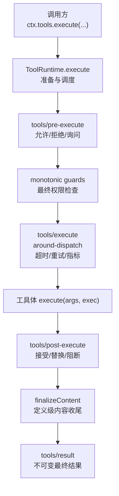
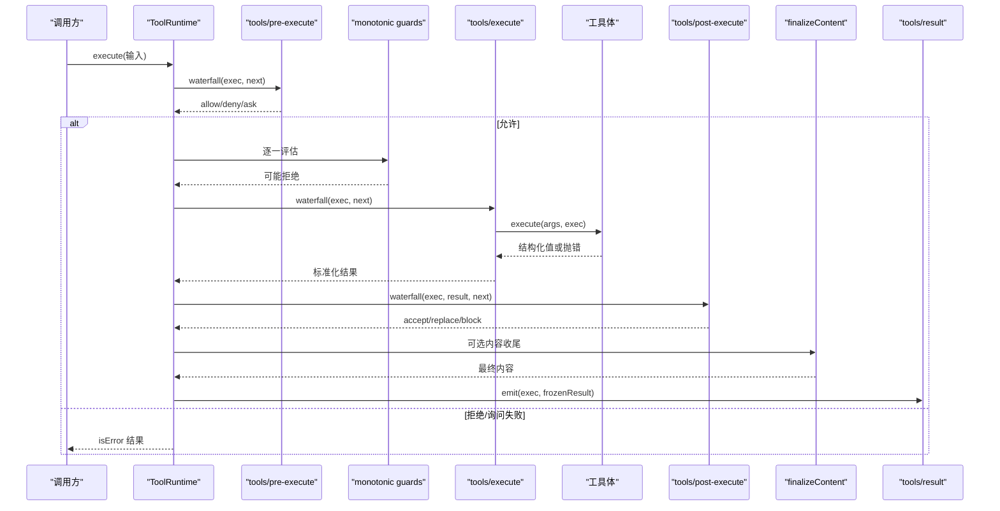
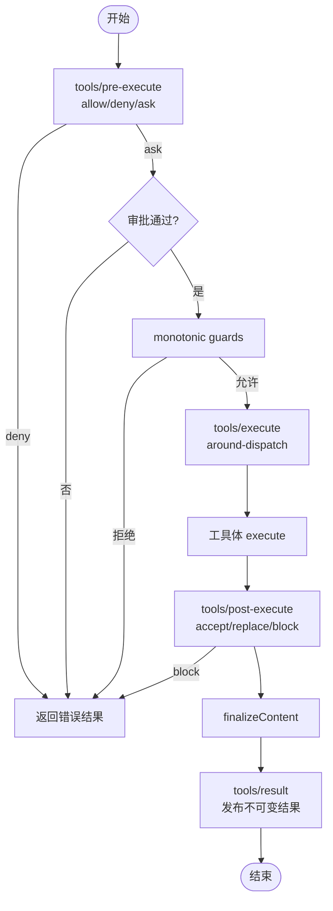
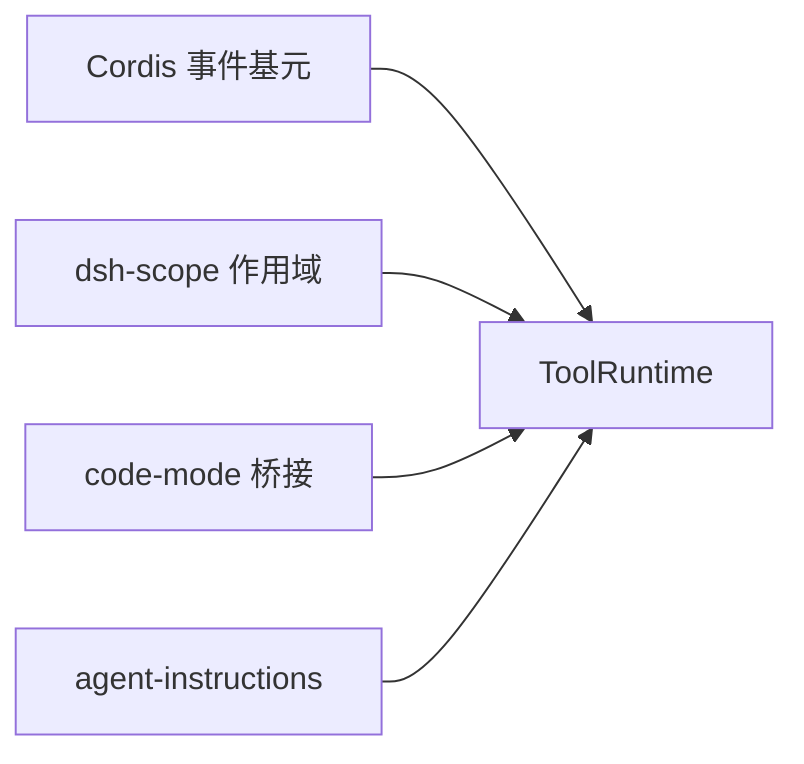

# 工具事件

<cite>
**本文引用的文件**
- [packages/core/tools/src/index.ts](file://packages/core/tools/src/index.ts)
- [packages/core/tools/src/invariant.ts](file://packages/core/tools/src/invariant.ts)
- [packages/core/tools/tests/tools.spec.ts](file://packages/core/tools/tests/tools.spec.ts)
- [packages/core/tools/tests/code-mode.spec.ts](file://packages/core/tools/tests/code-mode.spec.ts)
- [docs/subsystems/tools.md](file://docs/subsystems/tools.md)
- [docs/cordis-api/events.md](file://docs/cordis-api/events.md)
- [packages/context/agent-instructions/src/index.ts](file://packages/context/agent-instructions/src/index.ts)
</cite>

## 目录
1. [简介](#简介)
2. [项目结构](#项目结构)
3. [核心组件](#核心组件)
4. [架构总览](#架构总览)
5. [详细组件分析](#详细组件分析)
6. [依赖关系分析](#依赖关系分析)
7. [性能考量](#性能考量)
8. [故障排查指南](#故障排查指南)
9. [结论](#结论)
10. [附录](#附录)

## 简介
本文聚焦工具执行管道中的关键事件与钩子，系统性说明 tools/pre-execute、tools/execute、tools/post-execute、tools/result 等事件的职责、顺序、决策语义与错误处理策略。同时给出监听器实现模式与最佳实践，并解释工具事件与文件系统、权限控制、工作流等系统的集成方式，以及监控、日志记录与错误处理的落地方法。

## 项目结构
围绕工具事件的核心代码位于 packages/core/tools 包中：
- 事件定义与执行管线入口在 index.ts（注册、调度、水线编排、结果产出）。
- 不变量校验在 invariant.ts（阶段顺序、冻结约束）。
- 行为验证与边界用例在 tests/tools.spec.ts 与 tests/code-mode.spec.ts。
- 子系统文档 docs/subsystems/tools.md 对事件契约进行权威描述。
- Cordis 事件基元在 docs/cordis-api/events.md（waterfall/emit/parallel 等）。
- 实际集成示例见 packages/context/agent-instructions/src/index.ts（监听 tools/result 做上下文增强）。

图表来源
- [packages/core/tools/src/index.ts:1328-1362](file://packages/core/tools/src/index.ts#L1328-L1362)
- [docs/subsystems/tools.md:170-404](file://docs/subsystems/tools.md#L170-L404)

章节来源
- [packages/core/tools/src/index.ts:1328-1362](file://packages/core/tools/src/index.ts#L1328-L1362)
- [docs/subsystems/tools.md:170-404](file://docs/subsystems/tools.md#L170-L404)

## 核心组件
- ToolRuntime：工具注册表与执行管线，负责参数快照、令牌分配、阶段编排、信号融合、结果规范化与持久化投影。
- 事件水线：
  - tools/pre-execute：前置许可/询问/拒绝；支持审批服务“ask”流程。
  - monotonic guards：单调守卫，仅能降级权限，不能恢复允许。
  - tools/execute：环绕调度的中间件，可替换信号、包装超时/重试/指标。
  - tools/post-execute：结果后处理，接受/替换/阻断，支持附加上下文。
  - finalizeContent：定义级内容收尾，确保模型可见内容安全且可回放。
  - tools/result：发布不可变的最终结果，供观测与审计。
- 不变量：保证阶段顺序、冻结对象、结果合法性。

章节来源
- [packages/core/tools/src/index.ts:1328-1362](file://packages/core/tools/src/index.ts#L1328-L1362)
- [packages/core/tools/src/invariant.ts:103-128](file://packages/core/tools/src/invariant.ts#L103-L128)
- [docs/subsystems/tools.md:170-404](file://docs/subsystems/tools.md#L170-L404)

## 架构总览
下图展示一次工具调用的完整生命周期，包括权限检查、执行、后处理与结果发布。

图表来源
- [packages/core/tools/src/index.ts:1328-1362](file://packages/core/tools/src/index.ts#L1328-L1362)
- [docs/subsystems/tools.md:170-404](file://docs/subsystems/tools.md#L170-L404)

## 详细组件分析

### 事件契约与语义
- tools/pre-execute
  - 作用：在执行前进行许可、拒绝或请求审批。
  - 决策：allow 继续；deny 直接返回错误；ask 需等待审批服务返回“允许一次”，否则视为拒绝。
  - 注意：异步门控必须观察 exec.signal；即使挂起也不被放弃。
- monotonic guards
  - 作用：在 pre-execute 之后、工具体之前执行，仅能追加拒绝理由，无法将拒绝改为允许。
- tools/execute
  - 作用：围绕调度的中间件，适合超时、重试、指标、信号替换等。
  - 约束：只能替换 signal，不能移除；调用前会重新融合原始 caller 信号。
- tools/post-execute
  - 作用：对已标准化的结果进行接受、替换、增强或阻断。
  - 决策：accept 接受；accept(value) 重算内容与元数据；block 将反馈转为错误结果。
- finalizeContent
  - 作用：定义级内容收尾，确保模型可见内容安全、可回放，并在失败路径也能运行。
- tools/result
  - 作用：发布不可变、可序列化的最终结果，供观测、审计与持久化。

章节来源
- [docs/subsystems/tools.md:170-404](file://docs/subsystems/tools.md#L170-L404)
- [packages/core/tools/src/index.ts:142-197](file://packages/core/tools/src/index.ts#L142-L197)

### 执行顺序与不变量
- 阶段顺序：pre-execute → guards → execute → post-execute → finalizeContent → result。
- 不变量：
  - 阶段不可重复、不可乱序。
  - 进入 result 时执行对象与结果均被冻结。
  - 结果必须可无损 JSON 序列化。

章节来源
- [packages/core/tools/src/invariant.ts:103-128](file://packages/core/tools/src/invariant.ts#L103-L128)
- [packages/core/tools/tests/invariant.spec.ts:40-70](file://packages/core/tools/tests/invariant.spec.ts#L40-L70)

### 权限检查与审批集成
- pre-execute 支持 ask，缺失审批通道或审批未通过即视为拒绝。
- guards 提供最终兜底拒绝能力，且不可逆。
- 典型集成点：
  - 文件系统访问策略：在 pre-execute 或 guards 中基于路径/操作类型决定允许/拒绝。
  - 工作流准入：结合审批服务，按任务上下文决定是否放行。
  - 沙箱/隔离：在 execute 中注入超时、资源限制与信号传播。

章节来源
- [docs/subsystems/tools.md:170-404](file://docs/subsystems/tools.md#L170-L404)
- [packages/core/tools/src/index.ts:142-197](file://packages/core/tools/src/index.ts#L142-L197)

### 监听器实现模式与最佳实践
- 前置许可（tools/pre-execute）
  - 模式：读取 exec.name/arguments/agent，必要时调用外部审批服务；始终观察 exec.signal。
  - 最佳实践：快速失败；避免阻塞；拒绝时附带人类可读 reason。
- 环绕调度（tools/execute）
  - 模式：计时、重试、指标上报、信号包装；调用 next() 前后恢复状态。
  - 最佳实践：不改变 exec 身份；正确恢复信号；确保可中断与幂等。
- 后置处理（tools/post-execute）
  - 模式：根据结果选择 accept/replace/block；可附加 additionalContexts。
  - 最佳实践：替换 value 会触发内容重算；阻断时使用反馈块；保持结果可序列化。
- 结果观测（tools/result）
  - 模式：只读观测，用于审计、遥测、缓存失效、通知。
  - 最佳实践：异常隔离；避免副作用；使用 scope 过滤减少噪音。

章节来源
- [docs/subsystems/tools.md:170-404](file://docs/subsystems/tools.md#L170-L404)
- [packages/context/agent-instructions/src/index.ts:350-360](file://packages/context/agent-instructions/src/index.ts#L350-L360)

### 与文件系统、权限控制、工作流的集成要点
- 文件系统
  - 在 pre-execute/guards 中依据目标路径、操作类型（读/写/删）实施策略。
  - 在 execute 中注入超时与信号，防止长耗时 IO 阻塞。
- 权限控制
  - 使用 ask 接入审批服务；guards 作为最终防线。
  - 拒绝原因应稳定、可诊断，便于审计与告警。
- 工作流
  - 在 post-execute 附加 additionalContexts，驱动后续步骤。
  - 在 result 中触发工作流事件（如完成、失败、需要人工介入）。

章节来源
- [docs/subsystems/tools.md:170-404](file://docs/subsystems/tools.md#L170-L404)

### 监控、日志与错误处理
- 监控
  - 在 execute 中采集耗时、重试次数、错误码；在 result 中聚合成功/失败率。
- 日志
  - 使用 code-dispatch-log 调整持久化日志副本（例如大文本脱敏/截断），不影响程序实际值。
- 错误处理
  - 所有监听器异常被隔离，不会污染主流程；最终统一为 isError 结果。
  - 非 Error 抛出会被归一化为可读消息。

章节来源
- [packages/core/tools/src/index.ts:600-648](file://packages/core/tools/src/index.ts#L600-L648)
- [docs/subsystems/tools.md:601-626](file://docs/subsystems/tools.md#L601-L626)

### 关键流程图：工具执行管线

图表来源
- [packages/core/tools/src/index.ts:1328-1362](file://packages/core/tools/src/index.ts#L1328-L1362)
- [docs/subsystems/tools.md:170-404](file://docs/subsystems/tools.md#L170-L404)

## 依赖关系分析
- 事件基元：Cordis 的 waterfall/emit/parallel 等分发模式构成水线与事件系统基础。
- 工具运行时：ToolRuntime 依赖 scope 机制实现作用域可见性、注册与限制。
- 代码模式桥接：run_code 子调度通过 tools/code-dispatch-log 定制持久化日志。
- 上下文增强：agent-instructions 通过 tools/result 收集结果以生成指令上下文。

图表来源
- [docs/cordis-api/events.md:97-123](file://docs/cordis-api/events.md#L97-L123)
- [packages/core/tools/src/index.ts:1328-1362](file://packages/core/tools/src/index.ts#L1328-L1362)
- [packages/context/agent-instructions/src/index.ts:350-360](file://packages/context/agent-instructions/src/index.ts#L350-L360)

章节来源
- [docs/cordis-api/events.md:97-123](file://docs/cordis-api/events.md#L97-L123)
- [packages/core/tools/src/index.ts:1328-1362](file://packages/core/tools/src/index.ts#L1328-L1362)
- [packages/context/agent-instructions/src/index.ts:350-360](file://packages/context/agent-instructions/src/index.ts#L350-L360)

## 性能考量
- 并行度：通过 isConcurrencySafe 分类，exclusive 形成屏障，parallel 允许重叠执行。
- 超时与取消：execute 中注入超时策略；signal 在调用前重新融合，确保可中断。
- 结果序列化：materializePresentation 确保结果可无损 JSON 序列化，避免后续持久化失败。
- 日志体积：code-dispatch-log 可对大结果进行预览/定位，降低日志膨胀。

章节来源
- [docs/subsystems/tools.md:243-281](file://docs/subsystems/tools.md#L243-L281)
- [packages/core/tools/src/index.ts:632-648](file://packages/core/tools/src/index.ts#L632-L648)

## 故障排查指南
- 前置钩子抛错
  - 现象：工具未执行，post-execute 不触发，但 settle 事件仍携带错误。
  - 排查：确认 pre-execute 是否抛出；检查审批通道是否存在。
- 后置钩子抛错
  - 现象：返回 isError 结果，错误信息来自钩子。
  - 排查：捕获 post-execute 异常，确保其可序列化且不破坏结果。
- 未知工具
  - 现象：UNKNOWN_TOOL 错误。
  - 排查：确认工具在当前作用域可见；检查 code 模式下是否被折叠。
- 阶段顺序违规
  - 现象：不变量校验失败。
  - 排查：确保 pre → execute → post → result 的顺序，禁止重复/乱序。

章节来源
- [packages/core/tools/tests/tools.spec.ts:1872-1902](file://packages/core/tools/tests/tools.spec.ts#L1872-L1902)
- [packages/core/tools/tests/code-mode.spec.ts:970-999](file://packages/core/tools/tests/code-mode.spec.ts#L970-L999)
- [packages/core/tools/tests/invariant.spec.ts:40-70](file://packages/core/tools/tests/invariant.spec.ts#L40-L70)

## 结论
工具事件体系以 waterfalls 为核心，提供从权限检查、执行包装到结果后处理的完整扩展点。通过单调守卫、审批服务、作用域可见性与不可变结果，实现了安全、可观测、可回放的执行环境。遵循本文的模式与最佳实践，可在文件系统、权限控制与工作流之间建立稳健集成，并以统一的监控与日志策略保障可运维性。

## 附录
- 事件速查
  - tools/pre-execute：前置许可/拒绝/询问
  - tools/execute：超时/重试/指标/信号包装
  - tools/post-execute：结果接受/替换/阻断
  - tools/result：不可变结果发布
  - tools/change：工具集变更通知
  - tools/code-dispatch-log：代码模式子调度日志定制

章节来源
- [docs/subsystems/tools.md:576-720](file://docs/subsystems/tools.md#L576-L720)
- [docs/cordis-api/events.md:97-123](file://docs/cordis-api/events.md#L97-L123)