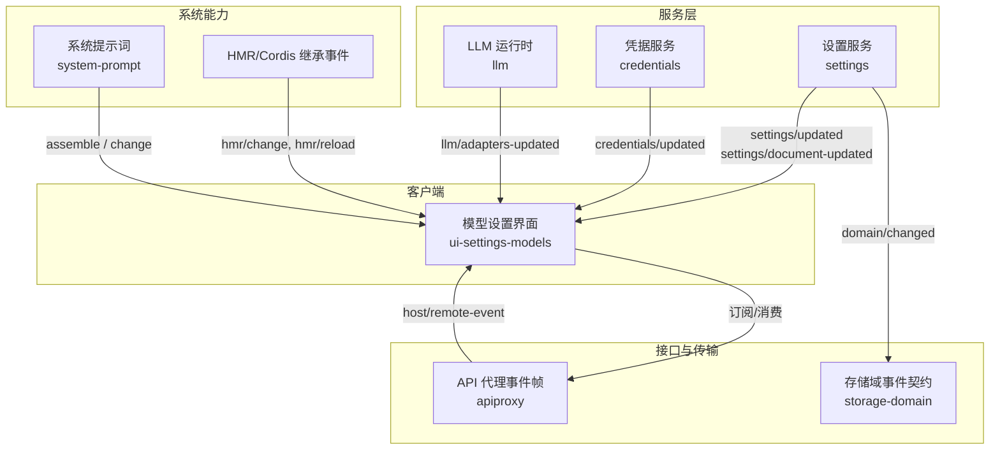
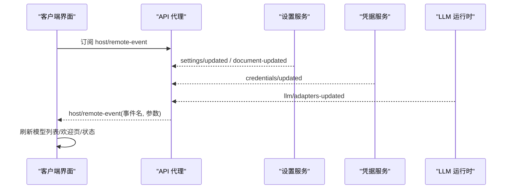
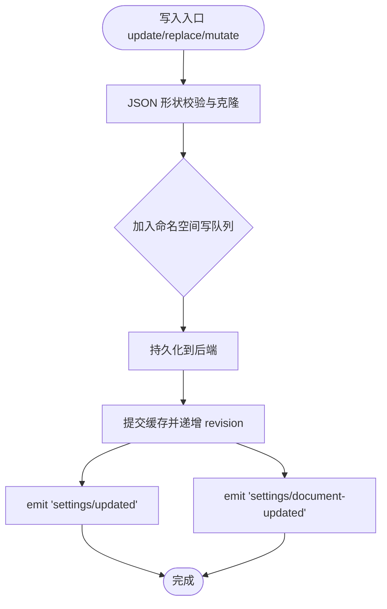
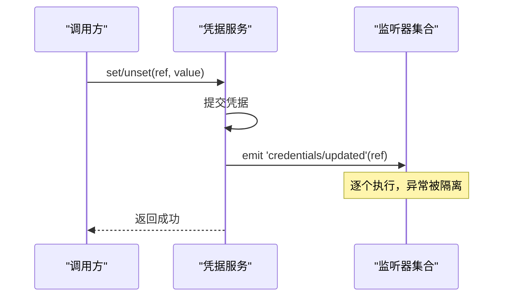
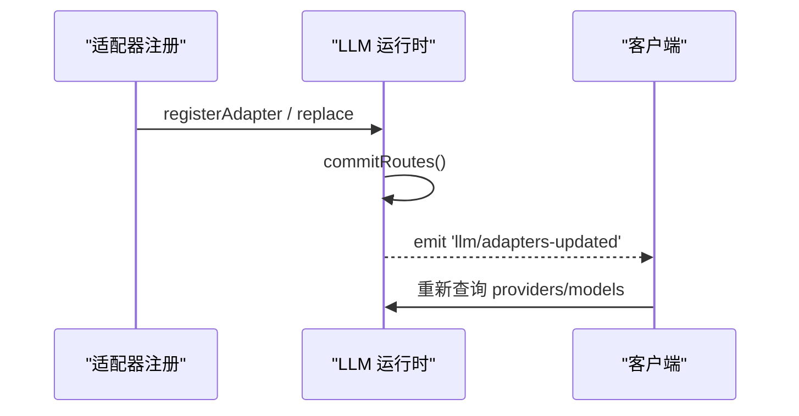
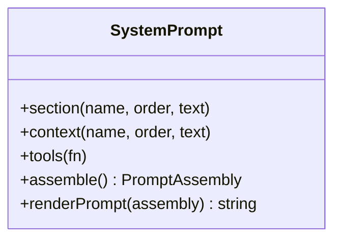
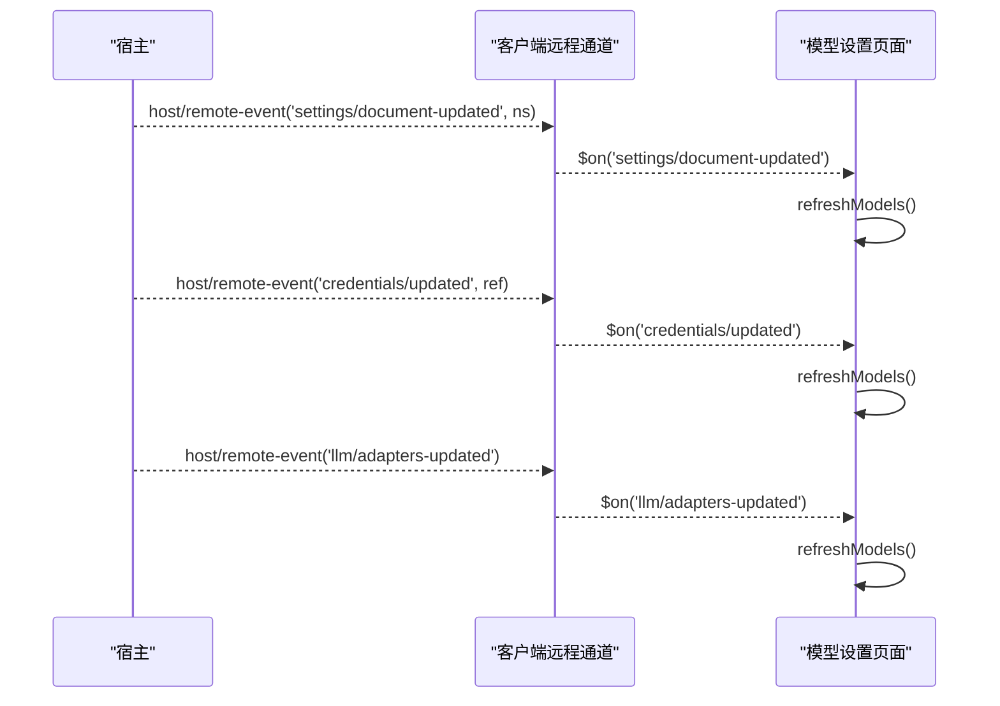
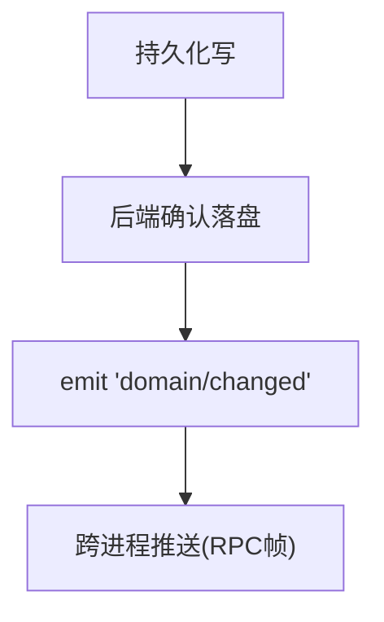
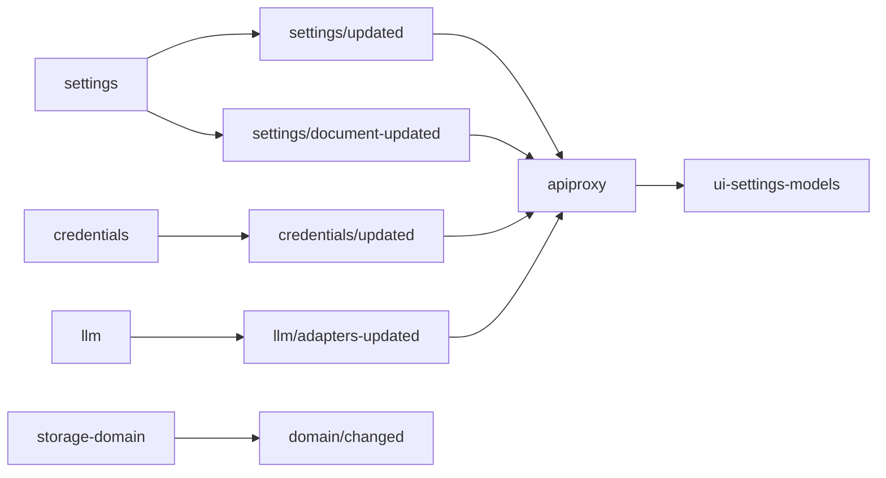

# 系统事件

<cite>
**本文引用的文件**
- [packages/settings/settings/src/index.ts](file://packages/settings/settings/src/index.ts)
- [packages/credentials/credentials/src/index.ts](file://packages/credentials/credentials/src/index.ts)
- [packages/llm/llm/src/index.ts](file://packages/llm/llm/src/index.ts)
- [packages/client/ui-settings-models/src/client/index.ts](file://packages/client/ui-settings-models/src/client/index.ts)
- [packages/host/apiproxy/src/api/events.ts](file://packages/host/apiproxy/src/api/events.ts)
- [packages/storage/storage-domain/src/events.ts](file://packages/storage/storage-domain/src/events.ts)
- [packages/core/system-prompt/src/index.ts](file://packages/core/system-prompt/src/index.ts)
- [docs/cordis-api/inherited.md](file://docs/cordis-api/inherited.md)
- [packages/client/hmr/src/events.ts](file://packages/client/hmr/src/events.ts)
</cite>

## 目录
1. [简介](#简介)
2. [项目结构](#项目结构)
3. [核心组件](#核心组件)
4. [架构总览](#架构总览)
5. [详细组件分析](#详细组件分析)
6. [依赖关系分析](#依赖关系分析)
7. [性能考量](#性能考量)
8. [故障排查指南](#故障排查指南)
9. [结论](#结论)
10. [附录](#附录)

## 简介
本文件系统化梳理 DeepSeek Harness 中的“系统事件”机制，覆盖配置与凭据变更、系统提示词组装与变更、LLM 适配器拓扑更新等关键事件，并给出监听与响应的实现指南。同时说明这些事件在插件动态加载、配置热更新、UI 实时刷新等高级功能中的作用。

## 项目结构
围绕系统事件的关键代码分布在以下模块：
- 设置服务（settings）：负责用户配置文档的注册、写入、发布与变更事件广播。
- 凭据服务（credentials）：负责凭据存储与变更事件广播。
- LLM 运行时（llm）：管理适配器注册表与可配置提供者目录，并在拓扑变化时发出更新事件。
- 客户端 UI（ui-settings-models）：订阅系统事件以触发模型列表等界面的增量刷新。
- API 代理（apiproxy）：定义跨进程事件帧与远端事件转发通道。
- 存储域（storage-domain）：持久化变更的事件契约，用于跨进程推送。
- 系统提示词（system-prompt）：提供提示词组装能力，配合相关事件驱动 UI。
- HMR 与 Cordis 继承事件：开发期与加载期的系统级事件来源。

图表来源
- [packages/settings/settings/src/index.ts:725-799](file://packages/settings/settings/src/index.ts#L725-L799)
- [packages/credentials/credentials/src/index.ts:101-123](file://packages/credentials/credentials/src/index.ts#L101-L123)
- [packages/llm/llm/src/index.ts:296-328](file://packages/llm/llm/src/index.ts#L296-L328)
- [packages/client/ui-settings-models/src/client/index.ts:98-116](file://packages/client/ui-settings-models/src/client/index.ts#L98-L116)
- [packages/host/apiproxy/src/api/events.ts:144-155](file://packages/host/apiproxy/src/api/events.ts#L144-L155)
- [packages/storage/storage-domain/src/events.ts:36-47](file://packages/storage/storage-domain/src/events.ts#L36-L47)
- [packages/core/system-prompt/src/index.ts:185-217](file://packages/core/system-prompt/src/index.ts#L185-L217)
- [docs/cordis-api/inherited.md:23-39](file://docs/cordis-api/inherited.md#L23-L39)

章节来源
- [packages/settings/settings/src/index.ts:725-799](file://packages/settings/settings/src/index.ts#L725-L799)
- [packages/credentials/credentials/src/index.ts:101-123](file://packages/credentials/credentials/src/index.ts#L101-L123)
- [packages/llm/llm/src/index.ts:296-328](file://packages/llm/llm/src/index.ts#L296-L328)
- [packages/client/ui-settings-models/src/client/index.ts:98-116](file://packages/client/ui-settings-models/src/client/index.ts#L98-L116)
- [packages/host/apiproxy/src/api/events.ts:144-155](file://packages/host/apiproxy/src/api/events.ts#L144-L155)
- [packages/storage/storage-domain/src/events.ts:36-47](file://packages/storage/storage-domain/src/events.ts#L36-L47)
- [packages/core/system-prompt/src/index.ts:185-217](file://packages/core/system-prompt/src/index.ts#L185-L217)
- [docs/cordis-api/inherited.md:23-39](file://docs/cordis-api/inherited.md#L23-L39)

## 核心组件
- 设置服务（settings）
  - 事件：settings/updated、settings/document-updated
  - 职责：注册命名空间、合并基础层与用户层、校验、持久化、发布新值、通知观察者与事件总线。
- 凭据服务（credentials）
  - 事件：credentials/updated
  - 职责：读写凭据引用，变更后广播，支持包含式失败隔离（非 INVARIANT 错误不阻断提交）。
- LLM 运行时（llm）
  - 事件：llm/adapters-updated
  - 职责：维护适配器与可配置提供者目录；拓扑变更时广播，供 UI/工具链刷新可用模型与提供者。
- 系统提示词（system-prompt）
  - 能力：assemble 组装提示词；change 事件用于提示词段落或上下文变更时的信号（由上层消费方订阅）。
- API 代理（apiproxy）
  - 事件：host/remote-event（白名单转发）、mux/host 流式帧
  - 职责：将宿主侧事件以统一帧形式推送到客户端，支持重连与一致性收敛。
- 存储域（storage-domain）
  - 事件：domain/changed
  - 职责：持久化写后发出领域变更事件，作为跨进程推送的数据源。
- HMR 与 Cordis 继承事件
  - 事件：hmr/change、hmr/reload、loader/*、internal/*
  - 职责：开发期文件变更、插件重载、加载器配置树更新等。

章节来源
- [packages/settings/settings/src/index.ts:725-799](file://packages/settings/settings/src/index.ts#L725-L799)
- [packages/credentials/credentials/src/index.ts:101-123](file://packages/credentials/credentials/src/index.ts#L101-L123)
- [packages/llm/llm/src/index.ts:296-328](file://packages/llm/llm/src/index.ts#L296-L328)
- [packages/core/system-prompt/src/index.ts:185-217](file://packages/core/system-prompt/src/index.ts#L185-L217)
- [packages/host/apiproxy/src/api/events.ts:144-155](file://packages/host/apiproxy/src/api/events.ts#L144-L155)
- [packages/storage/storage-domain/src/events.ts:36-47](file://packages/storage/storage-domain/src/events.ts#L36-L47)
- [docs/cordis-api/inherited.md:23-39](file://docs/cordis-api/inherited.md#L23-L39)

## 架构总览
下图展示了系统事件在生产环境中的典型流转：设置与凭据变更触发事件，LLM 拓扑变更触发更新，客户端通过远程事件通道接收并刷新界面。

图表来源
- [packages/host/apiproxy/src/api/events.ts:144-155](file://packages/host/apiproxy/src/api/events.ts#L144-L155)
- [packages/settings/settings/src/index.ts:725-799](file://packages/settings/settings/src/index.ts#L725-L799)
- [packages/credentials/credentials/src/index.ts:101-123](file://packages/credentials/credentials/src/index.ts#L101-L123)
- [packages/llm/llm/src/index.ts:296-328](file://packages/llm/llm/src/index.ts#L296-L328)
- [packages/client/ui-settings-models/src/client/index.ts:98-116](file://packages/client/ui-settings-models/src/client/index.ts#L98-L116)

## 详细组件分析

### 设置服务事件：settings/updated 与 settings/document-updated
- settings/updated
  - 触发时机：每次已提交的配置变更（update/replace/mutate/publish），且解析后的值发生变化。
  - 参数：命名空间、新值、旧值、来源（如 provider）。
  - 语义：保证每个监听器独立执行，非 INVARIANT 异常被捕获记录，不会阻塞后续监听器。
- settings/document-updated
  - 触发时机：原始文档发生变动（包括外部编辑或内部写入导致 raw section 改变），即使解析值未变也会递增 revision 并发出。
  - 参数：命名空间、revision。
  - 用途：让配置 UI 感知字段是否从“继承”变为“覆盖”，以及重新读取文档。

图表来源
- [packages/settings/settings/src/index.ts:534-648](file://packages/settings/settings/src/index.ts#L534-L648)
- [packages/settings/settings/src/index.ts:719-746](file://packages/settings/settings/src/index.ts#L719-L746)
- [packages/settings/settings/src/index.ts:748-799](file://packages/settings/settings/src/index.ts#L748-L799)

章节来源
- [packages/settings/settings/src/index.ts:534-648](file://packages/settings/settings/src/index.ts#L534-L648)
- [packages/settings/settings/src/index.ts:719-746](file://packages/settings/settings/src/index.ts#L719-L746)
- [packages/settings/settings/src/index.ts:748-799](file://packages/settings/settings/src/index.ts#L748-L799)

### 凭据服务事件：credentials/updated
- 触发时机：凭据 set/unset 等操作成功提交后。
- 参数：凭据引用（CredentialRef）。
- 行为：所有监听器依次执行，非 INVARIANT 异常被记录且不改变提交结果；INVARIANT 异常在所有监听器执行后抛出。

图表来源
- [packages/credentials/credentials/src/index.ts:101-123](file://packages/credentials/credentials/src/index.ts#L101-L123)

章节来源
- [packages/credentials/credentials/src/index.ts:101-123](file://packages/credentials/credentials/src/index.ts#L101-L123)

### LLM 适配器事件：llm/adapters-updated
- 触发时机：适配器注册/释放、可配置提供者目录条目增删改。
- 参数：无。
- 用途：通知消费者重新读取 listProviders/listModels/listConfigurableProviders，避免轮询。

图表来源
- [packages/llm/llm/src/index.ts:338-413](file://packages/llm/llm/src/index.ts#L338-L413)
- [packages/llm/llm/src/index.ts:431-484](file://packages/llm/llm/src/index.ts#L431-L484)
- [packages/llm/llm/src/index.ts:296-328](file://packages/llm/llm/src/index.ts#L296-L328)

章节来源
- [packages/llm/llm/src/index.ts:296-328](file://packages/llm/llm/src/index.ts#L296-L328)
- [packages/llm/llm/src/index.ts:338-413](file://packages/llm/llm/src/index.ts#L338-L413)
- [packages/llm/llm/src/index.ts:431-484](file://packages/llm/llm/src/index.ts#L431-L484)

### 系统提示词：assemble 与 change
- assemble
  - 作用：按顺序合并身份、部署 persona、规则、cwd 等段落，渲染为最终提示词文本；同时生成上下文快照。
- change
  - 作用：当提示词段落或上下文发生变更时，由上层组件发出，驱动 UI 刷新（例如工具列表、提示词预览）。

图表来源
- [packages/core/system-prompt/src/index.ts:185-217](file://packages/core/system-prompt/src/index.ts#L185-L217)

章节来源
- [packages/core/system-prompt/src/index.ts:185-217](file://packages/core/system-prompt/src/index.ts#L185-L217)

### 客户端监听与响应：ui-settings-models
- 监听 events：
  - settings/document-updated：刷新模型列表；特定命名空间还刷新欢迎页。
  - credentials/updated：刷新模型行状态（密钥点标记）。
  - llm/adapters-updated：刷新模型目录。
- 行为：使用 ctx.remote.$on 订阅宿主转发的事件，触发控制器重新加载数据。

图表来源
- [packages/client/ui-settings-models/src/client/index.ts:98-116](file://packages/client/ui-settings-models/src/client/index.ts#L98-L116)
- [packages/host/apiproxy/src/api/events.ts:144-155](file://packages/host/apiproxy/src/api/events.ts#L144-L155)

章节来源
- [packages/client/ui-settings-models/src/client/index.ts:98-116](file://packages/client/ui-settings-models/src/client/index.ts#L98-L116)
- [packages/host/apiproxy/src/api/events.ts:144-155](file://packages/host/apiproxy/src/api/events.ts#L144-L155)

### 存储域事件：domain/changed
- 触发时机：一次持久化写操作在底层确认落盘后发出。
- 内容：领域名、表名、键、操作类型（put/deleted），put 时携带新快照。
- 用途：作为跨进程推送的数据源，后续阶段通过 RPC 帧下发给其他进程。

图表来源
- [packages/storage/storage-domain/src/events.ts:1-47](file://packages/storage/storage-domain/src/events.ts#L1-L47)

章节来源
- [packages/storage/storage-domain/src/events.ts:1-47](file://packages/storage/storage-domain/src/events.ts#L1-L47)

### HMR 与 Cordis 继承事件
- HMR：hmr/change（受监控文件变更）、hmr/reload（插件重载）。
- Loader：loader/config-update、loader/entry-init、loader/partial-dispose、loader/patch-context。
- Internal：internal/plugin、internal/status、internal/service、internal/update、internal/get、internal/set、internal/listener、internal/dispatch。
- 用途：开发期快速迭代、插件热重载、加载器配置树变更联动。

章节来源
- [docs/cordis-api/inherited.md:23-39](file://docs/cordis-api/inherited.md#L23-L39)
- [packages/client/hmr/src/events.ts:1-17](file://packages/client/hmr/src/events.ts#L1-L17)

## 依赖关系分析
- 事件生产者
  - settings → settings/updated、settings/document-updated
  - credentials → credentials/updated
  - llm → llm/adapters-updated
  - storage-domain → domain/changed
  - cordis/hmr/loader → internal/*、hmr/*、loader/*
- 事件消费者
  - ui-settings-models 订阅 settings/document-updated、credentials/updated、llm/adapters-updated
  - apiproxy 将宿主事件以 host/remote-event 转发至客户端
- 耦合与内聚
  - 各服务通过事件解耦，UI 仅依赖事件名与参数约定，降低对具体实现的耦合。
  - 事件广播采用“逐个监听器隔离异常”的模式，提升鲁棒性。

图表来源
- [packages/settings/settings/src/index.ts:725-799](file://packages/settings/settings/src/index.ts#L725-L799)
- [packages/credentials/credentials/src/index.ts:101-123](file://packages/credentials/credentials/src/index.ts#L101-L123)
- [packages/llm/llm/src/index.ts:296-328](file://packages/llm/llm/src/index.ts#L296-L328)
- [packages/storage/storage-domain/src/events.ts:36-47](file://packages/storage/storage-domain/src/events.ts#L36-L47)
- [packages/host/apiproxy/src/api/events.ts:144-155](file://packages/host/apiproxy/src/api/events.ts#L144-L155)
- [packages/client/ui-settings-models/src/client/index.ts:98-116](file://packages/client/ui-settings-models/src/client/index.ts#L98-L116)

章节来源
- [packages/settings/settings/src/index.ts:725-799](file://packages/settings/settings/src/index.ts#L725-L799)
- [packages/credentials/credentials/src/index.ts:101-123](file://packages/credentials/credentials/src/index.ts#L101-L123)
- [packages/llm/llm/src/index.ts:296-328](file://packages/llm/llm/src/index.ts#L296-L328)
- [packages/storage/storage-domain/src/events.ts:36-47](file://packages/storage/storage-domain/src/events.ts#L36-L47)
- [packages/host/apiproxy/src/api/events.ts:144-155](file://packages/host/apiproxy/src/api/events.ts#L144-L155)
- [packages/client/ui-settings-models/src/client/index.ts:98-116](file://packages/client/ui-settings-models/src/client/index.ts#L98-L116)

## 性能考量
- 事件广播隔离异常：避免单个监听器失败影响整体提交路径，减少级联失败风险。
- 去抖与批处理：HMR 文件变更会合并原子写，避免频繁刷新。
- 只读快照与深冻结：settings 在发布前进行 JSON 形状校验与深冻结，防止共享可变对象导致的竞态。
- 串行化写队列：同一命名空间的写操作串行执行，确保一致性与顺序。

[本节为通用指导，无需列出具体文件]

## 故障排查指南
- 监听器抛错
  - 现象：某监听器抛出非 INVARIANT 异常，但提交仍成功。
  - 原因：事件广播采用“逐个监听器隔离异常”的策略，仅记录日志。
  - 处理：检查监听器实现，确保异步拒绝被捕获；必要时将关键校验改为 INVARIANT 异常以中断流程。
- 文档修订号不一致
  - 现象：设置更新时报冲突错误。
  - 原因：期望 revision 与实际不一致，可能由于并发写或外部编辑。
  - 处理：重新读取描述符获取最新 revision 后再写。
- 凭据不可用
  - 现象：模型调用失败，错误码指示凭据无效。
  - 原因：凭据为空或包含非法字符。
  - 处理：通过凭据编辑器或环境变量设置正确的 API Key；避免在消息中回显敏感信息。
- 适配器未生效
  - 现象：UI 未刷新可用模型。
  - 原因：未订阅 llm/adapters-updated 或上游未发出该事件。
  - 处理：确认注册逻辑与替换逻辑均会触发事件；检查客户端订阅链路。

章节来源
- [packages/settings/settings/src/index.ts:773-799](file://packages/settings/settings/src/index.ts#L773-L799)
- [packages/credentials/credentials/src/index.ts:101-123](file://packages/credentials/credentials/src/index.ts#L101-L123)
- [packages/llm/llm/src/index.ts:296-328](file://packages/llm/llm/src/index.ts#L296-L328)

## 结论
系统事件是 DeepSeek Harness 的核心协调机制，贯穿配置、凭据、LLM 适配器与系统提示词等子系统。通过标准化的事件契约与隔离的广播策略，系统在保持高内聚的同时实现了低耦合的动态扩展能力。结合 HMR 与 Cordis 继承事件，开发者可在开发期获得即时反馈，在生产期则通过事件驱动 UI 与服务间的实时同步。

[本节为总结，无需列出具体文件]

## 附录
- 事件清单速查
  - settings/updated：配置值变更（含来源）
  - settings/document-updated：原始文档变更（含 revision）
  - credentials/updated：凭据变更
  - llm/adapters-updated：LLM 适配器拓扑变更
  - domain/changed：存储域持久化变更
  - host/remote-event：宿主事件转发（白名单控制）
  - hmr/change、hmr/reload：开发期文件变更与插件重载
  - internal/*、loader/*：加载器与生命周期事件

[本节为补充信息，无需列出具体文件]