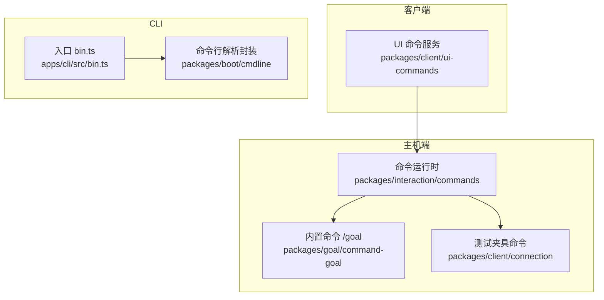
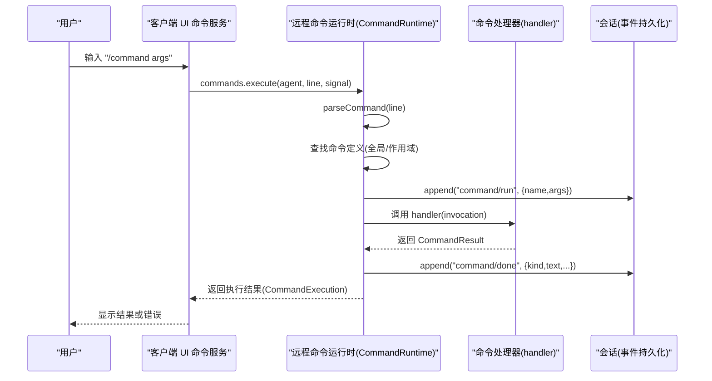
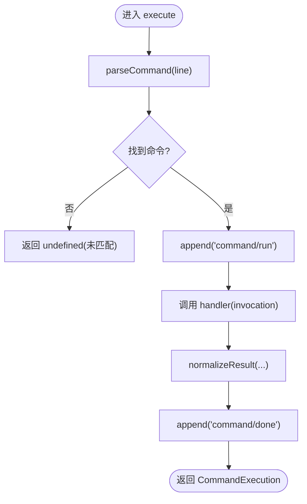
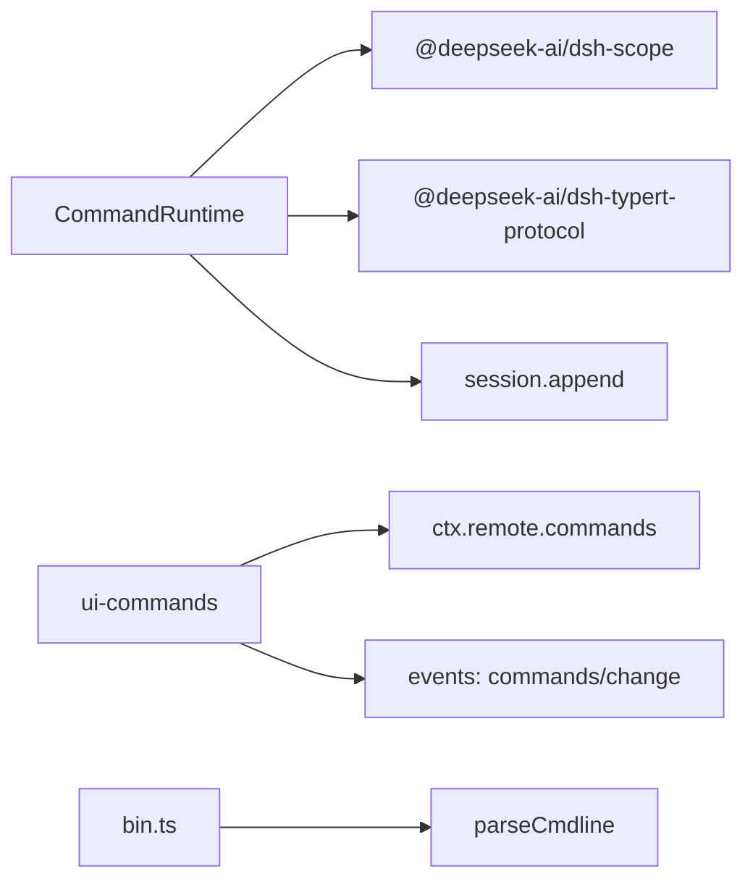

# 命令扩展

<cite>
**本文引用的文件**
- [packages/interaction/commands/src/index.ts](file://packages/interaction/commands/src/index.ts)
- [packages/interaction/commands/src/types.ts](file://packages/interaction/commands/src/types.ts)
- [packages/client/ui-commands/src/client/service.ts](file://packages/client/ui-commands/src/client/service.ts)
- [apps/cli/src/bin.ts](file://apps/cli/src/bin.ts)
- [packages/boot/cmdline/src/index.ts](file://packages/boot/cmdline/src/index.ts)
- [packages/goal/command-goal/src/index.ts](file://packages/goal/command-goal/src/index.ts)
- [packages/client/connection/src/client/fixture.ts](file://packages/client/connection/src/client/fixture.ts)
- [docs/subsystems/commands.md](file://docs/subsystems/commands.md)
- [docs/subsystems/commands.zh.md](file://docs/subsystems/commands.zh.md)
</cite>

## 目录
1. [简介](#简介)
2. [项目结构](#项目结构)
3. [核心组件](#核心组件)
4. [架构总览](#架构总览)
5. [详细组件分析](#详细组件分析)
6. [依赖关系分析](#依赖关系分析)
7. [性能考量](#性能考量)
8. [故障排查指南](#故障排查指南)
9. [结论](#结论)
10. [附录](#附录)

## 简介
本文件面向希望基于 ctx.commands 注册自定义命令（包括 CLI 命令与内部命令）的开发者，系统性说明命令注册、参数解析与校验、权限控制、执行上下文、输出格式化、别名与帮助/自动补全、命令间调用、错误处理机制以及生命周期管理与资源清理策略。文档同时覆盖交互式命令、批量处理与管道集成的实践建议。

## 项目结构
命令系统由“主机端命令运行时”和“客户端 UI 命令服务”组成：
- 主机端：CommandRuntime 提供命令注册、发现、解析与执行，并维护全局与按 Agent 作用域的命名空间。
- 客户端：ui-commands 服务负责将用户输入转换为命令候选、触发执行，并将结果持久化到会话流中。
- CLI：通过命令行入口动态加载不同模式，并在应用层使用 Commander 进行参数解析与帮助/版本输出。
- 内置命令：如 /goal 等以插件形式注册到 ctx.commands。

图表来源
- [packages/client/ui-commands/src/client/service.ts:126-156](file://packages/client/ui-commands/src/client/service.ts#L126-L156)
- [packages/interaction/commands/src/index.ts:225-388](file://packages/interaction/commands/src/index.ts#L225-L388)
- [packages/goal/command-goal/src/index.ts:109-170](file://packages/goal/command-goal/src/index.ts#L109-L170)
- [packages/client/connection/src/client/fixture.ts:1748-1771](file://packages/client/connection/src/client/fixture.ts#L1748-L1771)
- [apps/cli/src/bin.ts:1-54](file://apps/cli/src/bin.ts#L1-L54)
- [packages/boot/cmdline/src/index.ts:80-103](file://packages/boot/cmdline/src/index.ts#L80-L103)

章节来源
- [packages/interaction/commands/src/index.ts:225-388](file://packages/interaction/commands/src/index.ts#L225-L388)
- [packages/client/ui-commands/src/client/service.ts:126-156](file://packages/client/ui-commands/src/client/service.ts#L126-L156)
- [apps/cli/src/bin.ts:1-54](file://apps/cli/src/bin.ts#L1-L54)
- [packages/boot/cmdline/src/index.ts:80-103](file://packages/boot/cmdline/src/index.ts#L80-L103)

## 核心组件
- CommandRuntime（主机端命令运行时）
  - 提供 register/list/find/execute 四个关键能力，支持全局与作用域（Agent）双层命名空间，命令名冲突时给出明确诊断。
  - 执行流程包含：解析命令行、查找定义、记录 command/run、调用 handler、规范化结果、记录 command/done。
  - 通过事件 commands/change 通知注册表变更，供客户端刷新菜单与自动补全。
- 命令类型与事件契约（types.ts）
  - 定义了 CommandDefinition、CommandResult、CommandExecution、CommandDescriptor、SessionEventMap(command/run, command/done) 等类型。
- 客户端命令服务（ui-commands）
  - 订阅 commands/change 并缓存命令目录；将 '/' 输入接入候选生成、选择与执行；对未匹配的命令返回错误提示。
- CLI 命令入口与解析
  - apps/cli/src/bin.ts 根据解析后的模式动态加载子模块；packages/boot/cmdline/src/index.ts 封装 Commander 解析，统一处理 --help/--version/语法错误。
- 内置命令示例
  - /goal 通过 ctx.commands.register 注册，展示目标、创建/编辑/暂停/恢复/清除等子操作。
  - 测试夹具中实现了 /permission 与 /goal 的模拟命令，用于端到端验证。

章节来源
- [packages/interaction/commands/src/index.ts:225-388](file://packages/interaction/commands/src/index.ts#L225-L388)
- [packages/interaction/commands/src/types.ts:1-103](file://packages/interaction/commands/src/types.ts#L1-L103)
- [packages/client/ui-commands/src/client/service.ts:126-156](file://packages/client/ui-commands/src/client/service.ts#L126-L156)
- [packages/goal/command-goal/src/index.ts:109-170](file://packages/goal/command-goal/src/index.ts#L109-L170)
- [packages/client/connection/src/client/fixture.ts:1748-1771](file://packages/client/connection/src/client/fixture.ts#L1748-L1771)
- [apps/cli/src/bin.ts:1-54](file://apps/cli/src/bin.ts#L1-L54)
- [packages/boot/cmdline/src/index.ts:80-103](file://packages/boot/cmdline/src/index.ts#L80-L103)

## 架构总览
命令从用户输入到执行的完整链路如下：

图表来源
- [packages/client/ui-commands/src/client/service.ts:361-379](file://packages/client/ui-commands/src/client/service.ts#L361-L379)
- [packages/interaction/commands/src/index.ts:296-338](file://packages/interaction/commands/src/index.ts#L296-L338)
- [packages/interaction/commands/src/types.ts:76-101](file://packages/interaction/commands/src/types.ts#L76-L101)

## 详细组件分析

### 命令注册与命名空间
- 注册接口
  - 通过 ctx.commands.register({ name, description, input?, recordInput?, handler }) 注册命令。
  - 名称必须匹配小写字母开头及字母数字下划线连字符的正则；描述不能为空；handler 必须为函数；input.hint 若存在需为非空字符串。
- 命名空间与作用域
  - 支持全局注册与按 Agent 作用域注册；后者可“遮蔽”同名全局命令。
  - 重复注册会抛出带上下文的错误，便于定位是全局冲突还是作用域内冲突。
- 变更通知
  - 每次注册/卸载都会触发 commands/change，客户端据此刷新命令目录与自动补全。

章节来源
- [packages/interaction/commands/src/index.ts:150-189](file://packages/interaction/commands/src/index.ts#L150-L189)
- [packages/interaction/commands/src/index.ts:225-275](file://packages/interaction/commands/src/index.ts#L225-L275)
- [packages/interaction/commands/src/index.ts:369-384](file://packages/interaction/commands/src/index.ts#L369-L384)

### 参数解析、验证与处理逻辑
- 解析
  - 使用 parseCommand 对完整命令行进行解析，仅识别形如 “/name” 的令牌，后续内容作为 rawInput 原样传递给 handler。
- 校验
  - 命令元数据在注册阶段被 normalizeDefinition 严格校验；结果在 execute 阶段被 normalizeResult 再次校验，确保安全与一致性。
- 处理
  - handler 接收 CommandInvocation，包含 commandId、agent、rawInput、signal。
  - 支持同步与异步返回；返回值必须为 CommandResult（success/error），且字段受约束。

图表来源
- [packages/interaction/commands/src/index.ts:296-338](file://packages/interaction/commands/src/index.ts#L296-L338)
- [packages/interaction/commands/src/index.ts:150-218](file://packages/interaction/commands/src/index.ts#L150-L218)

章节来源
- [packages/interaction/commands/src/index.ts:96-109](file://packages/interaction/commands/src/index.ts#L96-L109)
- [packages/interaction/commands/src/index.ts:150-218](file://packages/interaction/commands/src/index.ts#L150-L218)
- [packages/interaction/commands/src/index.ts:296-338](file://packages/interaction/commands/src/index.ts#L296-L338)

### 权限控制、执行上下文与输出格式化
- 权限控制
  - 命令本身不直接承载权限检查；权限通常由命令处理器内部调用领域服务（如 goals、permissions）完成。例如 /goal 会检查当前目标状态并拒绝非法操作。
  - 测试夹具中的 /permission 展示了切换权限预设的行为，可作为参考实现。
- 执行上下文
  - handler 通过 invocation.agent 获取精确的目标 Agent；通过 invocation.signal 响应取消；通过 invocation.commandId 关联生命周期事件。
- 输出格式化
  - 命令处理器返回 CommandResult.success{text?} 或 CommandResult.error{text}。成功时可附带 sourceEventSeq 指向更丰富的领域事件，以便客户端渲染更丰富卡片。
  - 客户端 ui-commands 在服务端执行成功后仅返回“已受理”，具体结果由服务端持久化的 command/done 事件驱动渲染。

章节来源
- [packages/goal/command-goal/src/index.ts:109-170](file://packages/goal/command-goal/src/index.ts#L109-L170)
- [packages/client/connection/src/client/fixture.ts:1748-1771](file://packages/client/connection/src/client/fixture.ts#L1748-L1771)
- [packages/interaction/commands/src/types.ts:18-49](file://packages/interaction/commands/src/types.ts#L18-L49)
- [packages/client/ui-commands/src/client/service.ts:361-379](file://packages/client/ui-commands/src/client/service.ts#L361-L379)

### 交互式命令、批量处理与管道集成
- 交互式命令
  - 通过客户端输入触发器 '/' 接入；支持候选列表、空格/回车判定、模糊匹配与输入提示。
- 批量处理
  - 可在单个命令处理器中循环处理多条任务，但应关注长时间运行的取消信号与进度反馈（通过领域事件 + sourceEventSeq）。
- 管道集成
  - 命令可通过工具/工作流/子进程等能力与其他子系统协作；对于长耗时任务，建议使用领域事件驱动的结果呈现而非阻塞式返回。

章节来源
- [packages/client/ui-commands/src/client/service.ts:126-156](file://packages/client/ui-commands/src/client/service.ts#L126-L156)
- [packages/interaction/commands/src/types.ts:76-101](file://packages/interaction/commands/src/types.ts#L76-L101)

### 命令别名、帮助文档与自动补全
- 别名
  - 当前命令系统未提供显式别名机制；如需别名，可在注册多个同名命令并通过作用域遮蔽实现差异化行为，或使用前缀路由在 handler 内分发。
- 帮助文档
  - 命令描述 description 用于发现界面；CLI 的帮助/版本由 Commander 统一处理（--help/--version）。
- 自动补全
  - 客户端监听 commands/change 并拉取命令目录；支持模糊匹配与位置过滤（是否接受参数）。

章节来源
- [packages/interaction/commands/src/index.ts:254-275](file://packages/interaction/commands/src/index.ts#L254-L275)
- [packages/client/ui-commands/src/client/service.ts:126-156](file://packages/client/ui-commands/src/client/service.ts#L126-L156)
- [packages/boot/cmdline/src/index.ts:80-103](file://packages/boot/cmdline/src/index.ts#L80-L103)

### 命令间的调用关系
- 命令可直接调用其他服务或工具；也可通过领域服务间接协作（如 /goal 调用 goals 服务）。
- 测试夹具展示了 /permission 与 /goal 的内部实现，可作为跨命令协作的参考。

章节来源
- [packages/goal/command-goal/src/index.ts:109-170](file://packages/goal/command-goal/src/index.ts#L109-L170)
- [packages/client/connection/src/client/fixture.ts:1748-1771](file://packages/client/connection/src/client/fixture.ts#L1748-L1771)

### 错误处理机制
- 注册期错误
  - 名称/描述/handler/input 不符合规范会立即抛出 TypeError，阻止无效命令进入协议层。
- 执行期错误
  - 处理器抛错或被 AbortSignal 取消会被捕获并记录 command/done(kind:'error')；异常信息会被安全渲染。
  - 非 Error 的拒绝值会被包装为带 cause 的错误，保证日志可读性。
- 传输与适配
  - 客户端在执行失败时返回“未知或格式错误的命令”提示；传输错误会向上抛出。

章节来源
- [packages/interaction/commands/src/index.ts:150-218](file://packages/interaction/commands/src/index.ts#L150-L218)
- [packages/interaction/commands/src/index.ts:296-338](file://packages/interaction/commands/src/index.ts#L296-L338)
- [packages/client/ui-commands/src/client/service.ts:361-379](file://packages/client/ui-commands/src/client/service.ts#L361-L379)

### 生命周期管理与资源清理
- 命令注册的生命周期
  - register 返回一个 effect 处置器，可用于卸载命令；作用域变化时，ScopedLayers 会合并/遮蔽命令视图。
- 执行生命周期
  - 每个命令执行产生 command/run 与 command/done 两个日志事件，通过 commandId 配对；即使持久化追加失败也会被隔离，避免掩盖处理器错误。
- 取消与清理
  - 通过 AbortSignal 在 handler 执行期间支持取消；withAbort 确保 Promise 链在取消时及时终止。

章节来源
- [packages/interaction/commands/src/index.ts:225-275](file://packages/interaction/commands/src/index.ts#L225-L275)
- [packages/interaction/commands/src/index.ts:296-338](file://packages/interaction/commands/src/index.ts#L296-L338)
- [packages/interaction/commands/src/index.ts:111-148](file://packages/interaction/commands/src/index.ts#L111-L148)

## 依赖关系分析
- 命令运行时依赖
  - 作用域管理（ScopedLayers）、命名条目（NamedEntries）、Typert 远程服务、会话事件追加。
- 客户端依赖
  - 命令目录缓存、输入触发器、会话上下文、远程调用。
- CLI 依赖
  - Commander 程序、应用启动上下文（cmdlineArgs/appExit）。

图表来源
- [packages/interaction/commands/src/index.ts:225-388](file://packages/interaction/commands/src/index.ts#L225-L388)
- [packages/client/ui-commands/src/client/service.ts:126-156](file://packages/client/ui-commands/src/client/service.ts#L126-L156)
- [packages/boot/cmdline/src/index.ts:80-103](file://packages/boot/cmdline/src/index.ts#L80-L103)

章节来源
- [packages/interaction/commands/src/index.ts:225-388](file://packages/interaction/commands/src/index.ts#L225-L388)
- [packages/client/ui-commands/src/client/service.ts:126-156](file://packages/client/ui-commands/src/client/service.ts#L126-L156)
- [packages/boot/cmdline/src/index.ts:80-103](file://packages/boot/cmdline/src/index.ts#L80-L103)

## 性能考量
- 命令解析与查找为 O(1) 哈希查找；命令列表排序为 O(n log n)。
- 命令执行路径尽量短，避免在 handler 中进行重型 I/O；长耗时任务应通过领域事件异步推进。
- 客户端命令目录采用缓存与按需刷新，减少网络往返。

[本节为通用指导，无需特定文件引用]

## 故障排查指南
- 注册失败
  - 检查命令名是否符合正则、描述是否为非空字符串、handler 是否为函数、input.hint 是否为非空字符串。
- 执行失败
  - 查看 command/done 事件中的 kind 与 text；确认 handler 是否正确返回 CommandResult。
  - 若出现非 Error 拒绝值，注意包装后的错误消息与 cause。
- 未匹配命令
  - 客户端会返回“未知或格式错误的命令”；确认命令是否已注册且未被作用域遮蔽。
- 取消问题
  - 确认 handler 正确响应 AbortSignal；必要时在长时间操作中主动检测 signal.aborted。

章节来源
- [packages/interaction/commands/src/index.ts:150-218](file://packages/interaction/commands/src/index.ts#L150-L218)
- [packages/interaction/commands/src/index.ts:296-338](file://packages/interaction/commands/src/index.ts#L296-L338)
- [packages/client/ui-commands/src/client/service.ts:361-379](file://packages/client/ui-commands/src/client/service.ts#L361-L379)

## 结论
命令扩展体系围绕 ctx.commands 提供了清晰的注册、发现、解析与执行模型，配合严格的元数据校验与安全的结果规范化，保证了可扩展性与稳定性。通过作用域遮蔽、事件驱动的输出与完善的错误处理，开发者可以构建交互友好、可观测且易维护的命令。结合 CLI 的 Commander 集成与客户端自动补全，形成了完整的命令生态。

[本节为总结，无需特定文件引用]

## 附录

### 快速上手：注册一个自定义命令
- 在插件中调用 ctx.commands.register，提供 name、description、可选 input.hint 与 handler。
- 在 handler 中读取 invocation.rawInput 进行参数解析与业务处理，返回 CommandResult。
- 如需隐藏敏感参数，设置 recordInput: false，避免在 command/run 中记录原始输入。

章节来源
- [packages/interaction/commands/src/index.ts:240-252](file://packages/interaction/commands/src/index.ts#L240-L252)
- [packages/interaction/commands/src/types.ts:40-55](file://packages/interaction/commands/src/types.ts#L40-L55)

### CLI 命令开发要点
- 使用 Commander 声明子命令与选项；通过 parseCmdline 统一处理 --help/--version/语法错误。
- 在 action 中发布服务或执行业务逻辑；遇到非法参数时使用 program.error(...) 提前退出。

章节来源
- [packages/boot/cmdline/src/index.ts:80-103](file://packages/boot/cmdline/src/index.ts#L80-L103)
- [apps/cli/src/bin.ts:1-54](file://apps/cli/src/bin.ts#L1-L54)

### 内置命令参考
- /goal：展示/创建/编辑/暂停/恢复/清除目标，适合长任务场景。
- /permission（测试夹具）：切换权限预设，演示权限相关命令的实现方式。

章节来源
- [packages/goal/command-goal/src/index.ts:109-170](file://packages/goal/command-goal/src/index.ts#L109-L170)
- [packages/client/connection/src/client/fixture.ts:1748-1771](file://packages/client/connection/src/client/fixture.ts#L1748-L1771)

### API 参考（来自文档）
- ctx.commands 的 register/list/find/execute 方法签名与语义，详见子系统文档。

章节来源
- [docs/subsystems/commands.md:107-160](file://docs/subsystems/commands.md#L107-L160)
- [docs/subsystems/commands.zh.md:107-160](file://docs/subsystems/commands.zh.md#L107-L160)