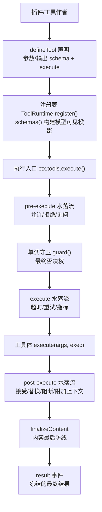
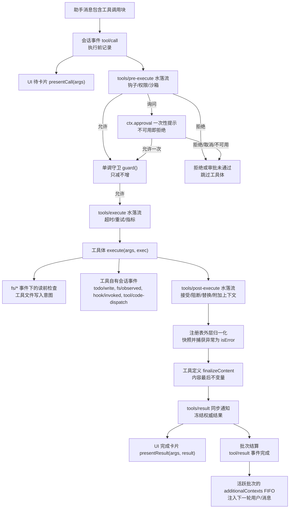
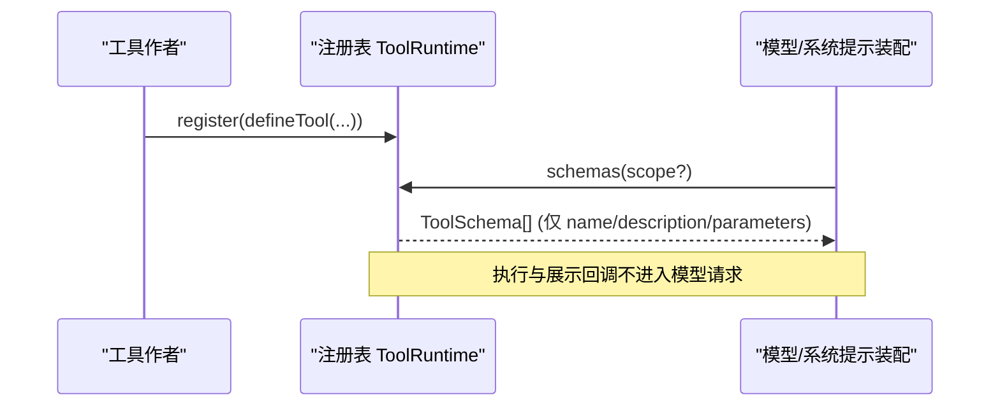
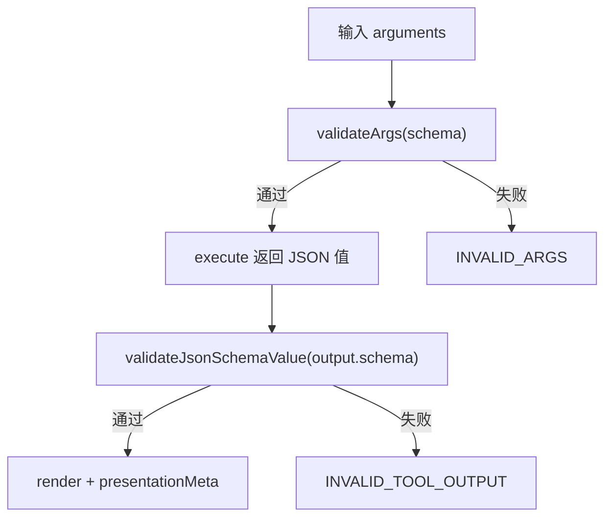
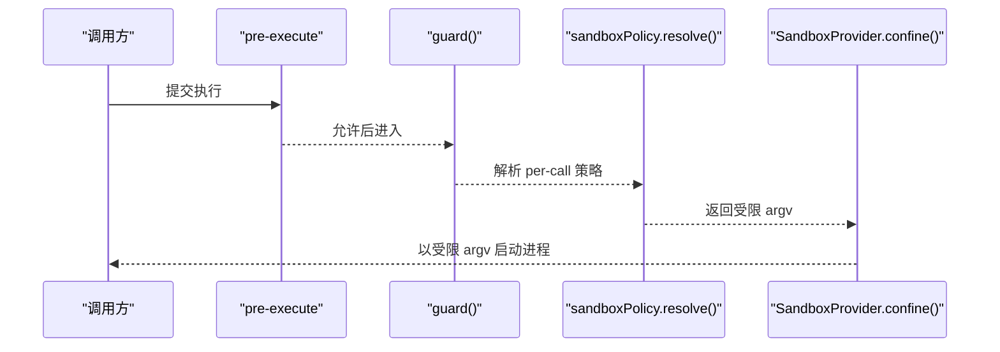
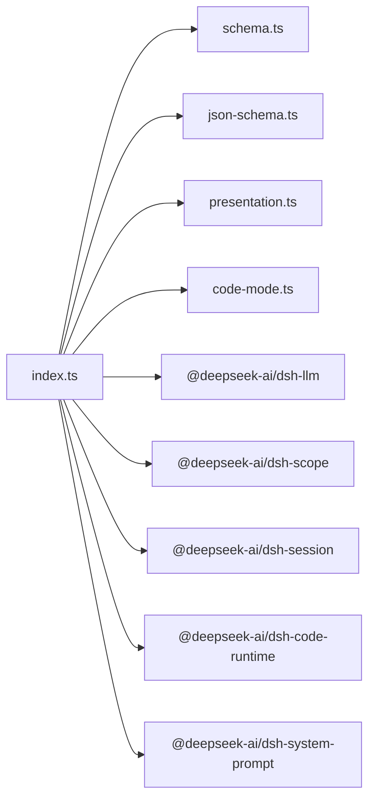

# 工具扩展

<cite>
**本文引用的文件**
- [packages/core/tools/src/index.ts](file://packages/core/tools/src/index.ts)
- [packages/core/tools/src/schema.ts](file://packages/core/tools/src/schema.ts)
- [packages/core/tools/src/presentation.ts](file://packages/core/tools/src/presentation.ts)
- [packages/core/tools/src/json-schema.ts](file://packages/core/tools/src/json-schema.ts)
- [packages/core/tools/src/code-mode.ts](file://packages/core/tools/src/code-mode.ts)
- [docs/subsystems/tools.md](file://docs/subsystems/tools.md)
- [docs/tool-execution-pipeline.md](file://docs/tool-execution-pipeline.md)
- [docs/cookbook/adding-a-tool.md](file://docs/cookbook/adding-a-tool.md)
- [docs/subsystems/sandbox.md](file://docs/subsystems/sandbox.md)
- [docs/subsystems/permission-presets.md](file://docs/subsystems/permission-presets.md)
</cite>

## 目录
1. [简介](#简介)
2. [项目结构](#项目结构)
3. [核心组件](#核心组件)
4. [架构总览](#架构总览)
5. [详细组件分析](#详细组件分析)
6. [依赖关系分析](#依赖关系分析)
7. [性能考虑](#性能考虑)
8. [故障排查指南](#故障排查指南)
9. [结论](#结论)
10. [附录：工具开发指南与示例](#附录工具开发指南与示例)

## 简介
本文件系统性说明 DeepSeek Harness 的工具扩展机制，覆盖工具的注册、发现与执行流程；定义工具接口规范、参数校验、权限控制与沙箱隔离；文档化工具元数据、描述生成与文档自动提取；并提供完整的工具开发指南，包括同步/异步实现、错误处理策略、性能优化技巧以及从简单文件操作到复杂网络请求的丰富示例。

## 项目结构
DeepSeek Harness 的工具能力集中在 core/tools 包中，并通过 Cordis 事件与钩子（waterfall）对外暴露可扩展点。相关文档位于 docs/subsystems 与 docs/cookbook。



图表来源
- [packages/core/tools/src/index.ts:137-200](file://packages/core/tools/src/index.ts#L137-L200)
- [docs/tool-execution-pipeline.md:8-58](file://docs/tool-execution-pipeline.md#L8-L58)

章节来源
- [docs/subsystems/tools.md:9-151](file://docs/subsystems/tools.md#L9-L151)
- [docs/tool-execution-pipeline.md:1-63](file://docs/tool-execution-pipeline.md#L1-L63)

## 核心组件
- 工具定义与注册
  - defineTool：将参数 schema、输出 schema、execute、可选 finalizeContent/presentCall/presentResult 绑定为可注册定义。
  - register：将定义加入注册表；schemas() 仅暴露面向模型的字段（name/description/parameters），不泄露执行回调。
- 参数与输出 Schema DSL
  - ValueSchemaSpec：统一描述任意 JSON 值根的类型、约束与 oneOf 联合。
  - ParameterSchemaSpec：隐式开放对象属性映射，required 标注必填。
  - valueSchemaSpecToJsonSchema / parameterSchemaSpecToJsonSchema：编译为受支持的原始 JSON Schema 子集。
- 执行流水线
  - pre-execute：可重排的水落流，支持 allow/deny/ask。
  - guard：单调守卫，只能减少权限，不能恢复已拒绝的调用。
  - execute：环绕分派，用于超时、重试、指标等。
  - post-execute：接受/替换/阻断结果或附加上下文。
  - finalizeContent：工具自有的内容最后防线。
  - result：不可变、冻结的最终结果通知。
- UI 呈现
  - presentCall/presentResult：返回中性 card 标签视图，供宿主/客户端渲染。

章节来源
- [packages/core/tools/src/index.ts:137-200](file://packages/core/tools/src/index.ts#L137-L200)
- [packages/core/tools/src/schema.ts:1-200](file://packages/core/tools/src/schema.ts#L1-L200)
- [docs/subsystems/tools.md:99-151](file://docs/subsystems/tools.md#L99-L151)
- [docs/subsystems/tools.md:170-405](file://docs/subsystems/tools.md#L170-L405)
- [docs/subsystems/tools.md:459-468](file://docs/subsystems/tools.md#L459-L468)

## 架构总览
下图展示一次工具调用的完整生命周期，包括策略、钩子、沙箱、文件系统守卫、结果重写、最终观察与 UI 渲染。



图表来源
- [docs/tool-execution-pipeline.md:8-58](file://docs/tool-execution-pipeline.md#L8-L58)

章节来源
- [docs/tool-execution-pipeline.md:1-63](file://docs/tool-execution-pipeline.md#L1-L63)

## 详细组件分析

### 工具注册与发现
- 注册
  - 使用 defineTool 声明 name、description、parameters、output、execute 及可选 finalizeContent/presentCall/presentResult/timeoutMs/isConcurrencySafe。
  - 通过 ctx.tools.register 注册；作用域内注册会遮蔽全局同名工具。
- 发现
  - schemas(scope?) 仅暴露模型可见字段（name/description/parameters），确保执行与展示回调不会泄漏到协议。
  - get(name, scope?) 按作用域解析可见定义。
  - executionMode(exec) 根据 isConcurrencySafe 分类调度模式（parallel/exclusive）。



图表来源
- [packages/core/tools/src/index.ts:478-574](file://packages/core/tools/src/index.ts#L478-L574)
- [docs/subsystems/tools.md:9-151](file://docs/subsystems/tools.md#L9-L151)

章节来源
- [packages/core/tools/src/index.ts:478-574](file://packages/core/tools/src/index.ts#L478-L574)
- [docs/subsystems/tools.md:9-151](file://docs/subsystems/tools.md#L9-L151)

### 参数验证与输出契约
- 参数验证
  - defineTool 在运行前将 model 传入的 arguments 与 ParameterSchemaSpec 进行严格校验；类型、必填键、字面量约束、oneOf 分支均被检查。
  - 参数不匹配抛出 INVALID_ARGS；无效输出抛出 INVALID_TOOL_OUTPUT。
- 输出契约
  - output.schema 声明规范返回值；execute 必须返回该类型的 JSON 值。
  - output.render 将 args+value 转为模型可见内容；presentationMeta 提供可回放的结果元数据（如 diff 补丁）。



图表来源
- [packages/core/tools/src/schema.ts:177-200](file://packages/core/tools/src/schema.ts#L177-L200)
- [docs/subsystems/tools.md:99-151](file://docs/subsystems/tools.md#L99-L151)

章节来源
- [packages/core/tools/src/schema.ts:1-200](file://packages/core/tools/src/schema.ts#L1-L200)
- [docs/subsystems/tools.md:99-151](file://docs/subsystems/tools.md#L99-L151)

### 权限控制与沙箱隔离
- 权限控制
  - tools/pre-execute：允许/拒绝/询问（审批服务）。
  - guard：单调守卫，任何匹配项均可拒绝，且后续监听器无法撤销拒绝。
  - permission presets：将 sandbox/mode 与 approval/policy 打包为预设，便于客户端选择。
- 沙箱隔离
  - SandboxMode：read-only、workspace-write、danger-full-access。
  - 每调用解析 SandboxExecutionPolicy，携带 workspaceRoot 与 sessionId。
  - ConfinedArgv：返回受限 argv、enforcement 完整性、denialSignatures、runnerFailureRules。



图表来源
- [docs/subsystems/sandbox.md:9-94](file://docs/subsystems/sandbox.md#L9-L94)
- [docs/subsystems/sandbox.md:152-187](file://docs/subsystems/sandbox.md#L152-L187)
- [docs/subsystems/permission-presets.md:9-68](file://docs/subsystems/permission-presets.md#L9-L68)

章节来源
- [docs/subsystems/sandbox.md:1-219](file://docs/subsystems/sandbox.md#L1-L219)
- [docs/subsystems/permission-presets.md:1-132](file://docs/subsystems/permission-presets.md#L1-L132)

### 执行流水线与事件
- 关键阶段
  - pre-execute：可重排，支持 ask。
  - guard：单调否决。
  - execute：可替换 signal（超时/重试/指标）。
  - post-execute：接受/替换/阻断/附加上下文。
  - finalizeContent：内容最后防线。
  - result：冻结的最终结果。
- 事件
  - tools/change：工具集合变更通知。
  - tools/code-dispatch-log：Code Mode 子调度的日志内容替换。
  - tools/execute、tools/post-execute、tools/pre-execute：水落流。
  - tools/result：最终结果通知。

```mermaid
sequenceDiagram
participant Loop as "Agent 循环"
participant RT as "ToolRuntime"
participant W1 as "pre-execute"
participant W2 as "execute"
participant W3 as "post-execute"
participant Def as "ToolDefinition"
participant Obs as "result 观察者"
Loop->>RT : execute(input)
RT->>W1 : 允许/拒绝/询问
W1-->>RT : 决策
RT->>W2 : next() 包装
W2->>Def : execute(args, exec)
Def-->>W2 : 返回值
W2-->>RT : 标准化结果
RT->>W3 : 接受/替换/阻断
W3-->>RT : 决策
RT->>Def : finalizeContent(可选)
RT->>Obs : result(冻结结果)
```

图表来源
- [packages/core/tools/src/index.ts:137-200](file://packages/core/tools/src/index.ts#L137-L200)
- [docs/subsystems/tools.md:170-405](file://docs/subsystems/tools.md#L170-L405)

章节来源
- [packages/core/tools/src/index.ts:137-200](file://packages/core/tools/src/index.ts#L137-L200)
- [docs/subsystems/tools.md:170-405](file://docs/subsystems/tools.md#L170-L405)

### UI 呈现与文档自动提取
- 呈现
  - presentCall/presentResult 返回中性 card 视图（generic/terminal/diff/search/read/web），由宿主/客户端渲染。
  - 纯函数要求：同时用于实时流与会话回放，禁止副作用。
- 文档自动提取
  - schemas() 仅暴露 name/description/parameters，用于系统提示装配与 SDK 生成。
  - 通过 valueSchemaSpecToJsonSchema/parameterSchemaSpecToJsonSchema 编译为受支持的 JSON Schema 子集，保证一致性与可验证性。

章节来源
- [docs/subsystems/tools.md:459-468](file://docs/subsystems/tools.md#L459-L468)
- [packages/core/tools/src/index.ts:478-574](file://packages/core/tools/src/index.ts#L478-L574)
- [packages/core/tools/src/schema.ts:177-200](file://packages/core/tools/src/schema.ts#L177-L200)

## 依赖关系分析
- 内部依赖
  - index.ts 依赖 schema.ts（DSL/校验）、json-schema.ts（原始 Schema 子集）、presentation.ts（UI 视图）、code-mode.ts（run_code 传输）。
- 外部依赖
  - @deepseek-ai/cordis：上下文与服务。
  - @deepseek-ai/dsh-scope：作用域与分层。
  - @deepseek-ai/dsh-llm：ContentBlock、CallId、错误类型。
  - @deepseek-ai/dsh-session：JsonValue、UserMessage、快照。
  - @deepseek-ai/dsh-code-runtime：代码运行时语言。
  - @deepseek-ai/dsh-system-prompt：工具提示组装。



图表来源
- [packages/core/tools/src/index.ts:1-30](file://packages/core/tools/src/index.ts#L1-L30)

章节来源
- [packages/core/tools/src/index.ts:1-30](file://packages/core/tools/src/index.ts#L1-L30)

## 性能考虑
- 并发与并行
  - isConcurrencySafe 仅当精确返回 true 时启用并行分组；否则默认独占执行。
  - 并发工具不得修改父级状态；共享状态需容忍并发访问。
- 超时与取消
  - timeoutMs 声明协作超时预算；tools/execute 包装器负责强制超时。
  - 工具体必须观察并转发 exec.signal，确保在信号触发后尽快达到静默。
- 结果物化成本
  - 规范值在成功路径上会被快照、验证、冻结；避免返回超大对象。
  - 大文本结果应通过 spill/预览策略限制持久化体积。
- 背景任务
  - 长耗时工作通过 jobs 子系统管理，前台工作仍耦合 exec.signal。

章节来源
- [docs/subsystems/tools.md:54-74](file://docs/subsystems/tools.md#L54-L74)
- [docs/subsystems/tools.md:170-253](file://docs/subsystems/tools.md#L170-L253)
- [docs/cookbook/adding-a-tool.md:51-66](file://docs/cookbook/adding-a-tool.md#L51-L66)

## 故障排查指南
- 常见错误
  - INVALID_ARGS：参数与 schema 不匹配。
  - INVALID_TOOL_OUTPUT：execute 返回值或后置策略产物不符合 output.schema。
  - UNKNOWN_TOOL：工具不可见或未注册。
- 定位步骤
  - 检查 parameters/output 是否一致且合法。
  - 确认工具已通过 ctx.tools.register 注册且在当前作用域可见。
  - 检查 pre-execute/guard 是否拒绝或需要审批但未配置。
  - 查看 tools/result 事件中的 frozen 结果与 content。
- 调试建议
  - 在 tools/execute 中添加指标与计时。
  - 在 tools/post-execute 中替换 content/value 以缩小问题范围。
  - 使用 Code Mode 的 code-dispatch-log 调整子调度日志内容。

章节来源
- [docs/subsystems/tools.md:149-151](file://docs/subsystems/tools.md#L149-L151)
- [docs/subsystems/tools.md:402-405](file://docs/subsystems/tools.md#L402-L405)
- [packages/core/tools/src/index.ts:137-200](file://packages/core/tools/src/index.ts#L137-L200)

## 结论
DeepSeek Harness 的工具扩展机制通过统一的 schema DSL、严格的参数与输出校验、可扩展的执行水落流、单调权限守卫与沙箱隔离，提供了安全、可观测、可组合的工具生态。借助中性 UI 呈现与自动文档提取，工具既能服务于模型也能适配多端界面。遵循并发、超时与取消约定，可实现高性能与高可靠性的工具实现。

## 附录：工具开发指南与示例

### 最小可用工具
- 目标：读取文件并返回字符串内容。
- 要点
  - 使用 defineTool 声明 parameters（path、limit）与 output（string）。
  - execute 中读取文件并返回字符串；遵守 exec.signal。
  - 通过 ctx.tools.register 注册。
- 参考路径
  - [添加工具教程:1-95](file://docs/cookbook/adding-a-tool.md#L1-L95)

章节来源
- [docs/cookbook/adding-a-tool.md:1-95](file://docs/cookbook/adding-a-tool.md#L1-L95)

### 同步与异步工具
- 同步工具
  - 适合 CPU 密集但短时的计算；注意不要阻塞事件循环。
- 异步工具
  - 适合 I/O 密集或长耗时任务；必须观察 exec.signal。
  - 如需后台任务，使用 jobs 子系统，返回结构化句柄（如 jobId）。
- 参考路径
  - [执行契约与规则:40-66](file://docs/cookbook/adding-a-tool.md#L40-L66)

章节来源
- [docs/cookbook/adding-a-tool.md:40-66](file://docs/cookbook/adding-a-tool.md#L40-L66)

### 错误处理策略
- 参数错误：由 defineTool 校验，抛出 INVALID_ARGS。
- 输出错误：返回值不符合 output.schema，抛出 INVALID_TOOL_OUTPUT。
- 基础设施错误：在工具体内抛出，将被捕获为 isError。
- 参考路径
  - [参数与输出校验](file://docs/subsystems/tools.md:149-151)
  - [执行结果与错误](file://docs/subsystems/tools.md:327-368)

章节来源
- [docs/subsystems/tools.md:149-151](file://docs/subsystems/tools.md#L149-L151)
- [docs/subsystems/tools.md:327-368](file://docs/subsystems/tools.md#L327-L368)

### 权限与沙箱实践
- 使用 pre-execute 做细粒度策略（白名单/黑名单/询问）。
- 使用 guard 做最终否决（不可撤销）。
- 使用 sandboxPolicy.resolve 获取 per-call 策略，并以受限 argv 启动进程。
- 参考路径
  - [沙箱模式与策略](file://docs/subsystems/sandbox.md:9-94)
  - [权限预设](file://docs/subsystems/permission-presets.md:9-68)

章节来源
- [docs/subsystems/sandbox.md:9-94](file://docs/subsystems/sandbox.md#L9-L94)
- [docs/subsystems/permission-presets.md:9-68](file://docs/subsystems/permission-presets.md#L9-L68)

### UI 呈现与文档自动提取
- presentCall/presentResult：返回中性 card 视图，保持纯函数。
- schemas()：仅暴露 name/description/parameters，用于系统提示与 SDK 生成。
- 参考路径
  - [UI 呈现词汇](file://docs/subsystems/tools.md:459-468)
  - [Cordis API 工具运行时](file://packages/core/tools/src/index.ts:478-574)

章节来源
- [docs/subsystems/tools.md:459-468](file://docs/subsystems/tools.md#L459-L468)
- [packages/core/tools/src/index.ts:478-574](file://packages/core/tools/src/index.ts#L478-L574)

### 示例：文件操作工具
- 读取文件
  - 参数：path（必填）、limit（可选）。
  - 输出：字符串。
  - 行为：读取文件内容，遵守超时与取消。
  - 参考路径
    - [最小工具示例:1-95](file://docs/cookbook/adding-a-tool.md#L1-L95)

章节来源
- [docs/cookbook/adding-a-tool.md:1-95](file://docs/cookbook/adding-a-tool.md#L1-L95)

### 示例：搜索与浏览工具
- 搜索
  - 输出：结构化匹配列表或路径列表；presentationMeta 携带 truncated/total。
  - 呈现：search 视图，无正文复制，UI 回退到原始内容。
- 网页检索
  - 输出：搜索结果或抓取摘要；web 视图区分 search/fetch。
  - 参考路径
    - [UI 呈现词汇](file://docs/subsystems/tools.md:459-468)

章节来源
- [docs/subsystems/tools.md:459-468](file://docs/subsystems/tools.md#L459-L468)

### 示例：网络请求工具
- 设计要点
  - 参数：URL、方法、头、超时等；输出：结构化响应（status、headers、body 摘要）。
  - 安全：结合 pre-execute/guard 限制域名/协议；使用 sandbox 限制出站。
  - 性能：连接复用、超时与取消、结果裁剪。
- 参考路径
  - [执行水落流与超时](file://docs/subsystems/tools.md:170-253)
  - [沙箱策略](file://docs/subsystems/sandbox.md:9-94)

章节来源
- [docs/subsystems/tools.md:170-253](file://docs/subsystems/tools.md#L170-L253)
- [docs/subsystems/sandbox.md:9-94](file://docs/subsystems/sandbox.md#L9-L94)

### 示例：后台任务工具
- 设计要点
  - 使用 jobs 启动后台任务，返回结构化句柄（kind/jobId）。
  - 前台工作仍耦合 exec.signal；后台任务使用任务级取消信号。
  - 参考路径
    - [长耗时工作](file://docs/cookbook/adding-a-tool.md:51-66)

章节来源
- [docs/cookbook/adding-a-tool.md:51-66](file://docs/cookbook/adding-a-tool.md#L51-L66)