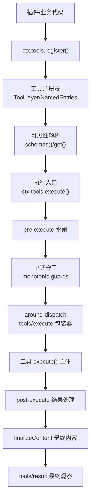
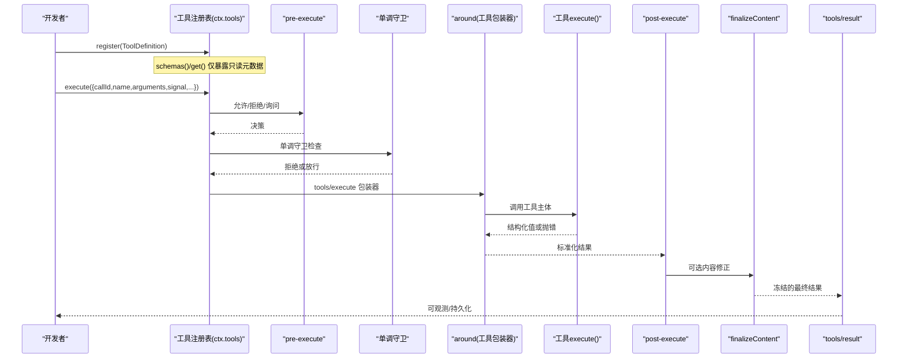
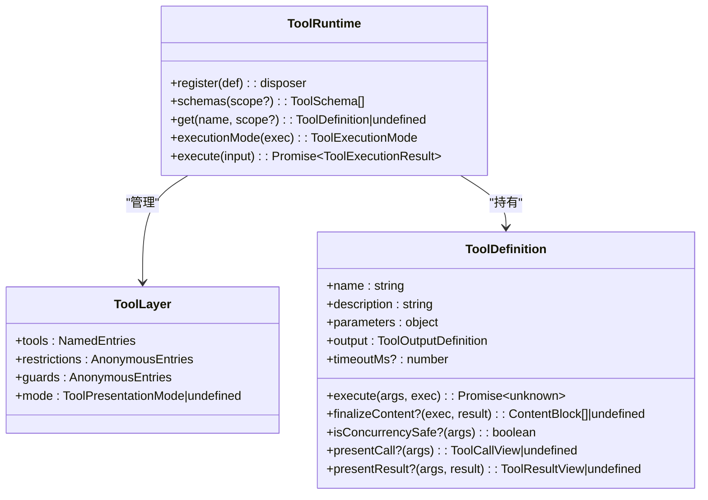

# 工具注册机制

<cite>
**本文引用的文件**
- [packages/core/tools/src/index.ts](file://packages/core/tools/src/index.ts)
- [packages/core/tools/src/schema.ts](file://packages/core/tools/src/schema.ts)
- [packages/core/tools/src/presentation.ts](file://packages/core/tools/src/presentation.ts)
- [packages/core/tools/tests/tools.spec.ts](file://packages/core/tools/tests/tools.spec.ts)
- [packages/core/tools/tests/scoped.spec.ts](file://packages/core/tools/tests/scoped.spec.ts)
- [packages/core/tools/tests/invariant.spec.ts](file://packages/core/tools/tests/invariant.spec.ts)
- [packages/extensions/cordis-host-runner/src/guard.ts](file://packages/extensions/cordis-host-runner/src/guard.ts)
- [docs/subsystems/tools.md](file://docs/subsystems/tools.md)
- [docs/tool-execution-pipeline.md](file://docs/tool-execution-pipeline.md)
- [docs/user/develop/basic/tool.md](file://docs/user/develop/basic/tool.md)
- [scripts/gen-tool-catalog.ts](file://scripts/gen-tool-catalog.ts)
</cite>

## 目录
1. [简介](#简介)
2. [项目结构](#项目结构)
3. [核心组件](#核心组件)
4. [架构总览](#架构总览)
5. [详细组件分析](#详细组件分析)
6. [依赖关系分析](#依赖关系分析)
7. [性能考量](#性能考量)
8. [故障排查指南](#故障排查指南)
9. [结论](#结论)
10. [附录](#附录)

## 简介
本文件系统性阐述工具注册与执行机制，覆盖工具的声明式定义、参数验证、权限控制、执行管道、上下文与依赖注入、资源管理、测试策略、调试技巧与性能优化。重点说明如何通过 ctx.tools 注册新工具（同步/异步），工具元数据（描述、参数 schema、返回值类型等）如何工作，以及工具间调用关系与错误传播。

## 项目结构
工具系统由核心包提供：
- 工具注册表与执行管线：packages/core/tools/src/index.ts
- 参数与输出 schema DSL：packages/core/tools/src/schema.ts
- UI 呈现词汇：packages/core/tools/src/presentation.ts
- 宿主侧沙箱门面（限制暴露能力）：packages/extensions/cordis-host-runner/src/guard.ts
- 文档与示例：docs/subsystems/tools.md、docs/tool-execution-pipeline.md、docs/user/develop/basic/tool.md
- 工具目录生成脚本：scripts/gen-tool-catalog.ts

图表来源
- [packages/core/tools/src/index.ts:137-200](file://packages/core/tools/src/index.ts#L137-L200)
- [packages/core/tools/src/index.ts:703-729](file://packages/core/tools/src/index.ts#L703-L729)
- [docs/tool-execution-pipeline.md:8-58](file://docs/tool-execution-pipeline.md#L8-L58)

章节来源
- [packages/core/tools/src/index.ts:1-200](file://packages/core/tools/src/index.ts#L1-L200)
- [docs/subsystems/tools.md:1-12](file://docs/subsystems/tools.md#L1-L12)

## 核心组件
- ToolDefinition：工具的定义体，包含模型可见的 ToolSchema（name/description/parameters）与宿主侧的执行与呈现能力（output、execute、finalizeContent、timeoutMs、isConcurrencySafe、presentCall/presentResult）。
- ToolRuntime（ctx.tools）：注册、查询、限制、执行与事件总线。
- 执行上下文：ToolExecution/ToolDispatchExecution/ToolRunContext，承载调用身份、信号、代理与 deferContext/concludeTurn。
- 权限与守卫：pre-execute 水闸 + 单调守卫（不可逆拒绝）。
- 结果归一化与观察：post-execute、finalizeContent、tools/result。

章节来源
- [packages/core/tools/src/index.ts:221-394](file://packages/core/tools/src/index.ts#L221-L394)
- [docs/subsystems/tools.md:9-96](file://docs/subsystems/tools.md#L9-L96)
- [docs/subsystems/tools.md:170-311](file://docs/subsystems/tools.md#L170-L311)

## 架构总览
工具从注册到执行的完整生命周期如下：

图表来源
- [packages/core/tools/src/index.ts:137-200](file://packages/core/tools/src/index.ts#L137-L200)
- [packages/core/tools/src/index.ts:703-729](file://packages/core/tools/src/index.ts#L703-L729)
- [docs/tool-execution-pipeline.md:8-58](file://docs/tool-execution-pipeline.md#L8-L58)

## 详细组件分析

### 工具声明与注册
- 通过 defineTool 声明 name、description、parameters、output（schema + render + presentationMeta）、execute，以及可选 finalizeContent、timeoutMs、isConcurrencySafe、presentCall/presentResult。
- 使用 ctx.tools.register(definition) 完成注册；返回一个精确的卸载函数，支持作用域内注册与作用域遮蔽。
- schemas() 仅暴露模型可见字段（白名单过滤），不泄露 execute/render 等回调。
- get(name, scope?) 按作用域视图查找工具定义。

章节来源
- [packages/core/tools/src/index.ts:1031-1062](file://packages/core/tools/src/index.ts#L1031-L1062)
- [packages/core/tools/src/index.ts:478-574](file://packages/core/tools/src/index.ts#L478-L574)
- [packages/extensions/cordis-host-runner/src/guard.ts:639-655](file://packages/extensions/cordis-host-runner/src/guard.ts#L639-L655)
- [docs/subsystems/tools.md:9-96](file://docs/subsystems/tools.md#L9-L96)

### 参数与返回值 Schema
- parameters 采用统一的 JSON Schema 子集 DSL，支持 string/number/integer/boolean/null/array/object/json/oneOf，对象默认 open 且 additionalProperties 可配置。
- output.schema 约束 execute 返回的“规范值”，render 将规范值投影为模型可见内容块，presentationMeta 用于顶层调用的可重放展示元数据。
- 参数校验失败抛出工具参数错误；输出校验失败走工具错误路径。

章节来源
- [packages/core/tools/src/schema.ts:98-151](file://packages/core/tools/src/schema.ts#L98-L151)
- [docs/subsystems/tools.md:98-151](file://docs/subsystems/tools.md#L98-L151)

### 权限控制与守卫
- pre-execute 水闸：允许/拒绝/询问（需审批服务）。
- 单调守卫：在 pre-execute 之后、工具主体之前运行，只能拒绝或弃权，无法撤销之前的拒绝。
- 作用域限制：restrict(filter) 对全局工具进行 allow/deny 交集过滤，不影响当前作用域自身注册的工具。

章节来源
- [packages/core/tools/src/index.ts:137-200](file://packages/core/tools/src/index.ts#L137-L200)
- [packages/core/tools/src/index.ts:703-729](file://packages/core/tools/src/index.ts#L703-L729)
- [packages/core/tools/tests/scoped.spec.ts:161-182](file://packages/core/tools/tests/scoped.spec.ts#L161-L182)
- [docs/subsystems/tools.md:153-172](file://docs/subsystems/tools.md#L153-L172)

### 执行上下文与依赖注入
- ToolExecutionInput → ToolExecution：注册表在政策前一次性物化并冻结参数，分配 token，固定 identity/signal/parent。
- ToolRunContext：工具主体接收 exec 与 deferContext/concludeTurn，用于附加上下文与标记本轮结束。
- 依赖注入：通过 Cordis 的 inject 机制获取 ctx，再使用 ctx.tools 注册/执行工具。

章节来源
- [packages/core/tools/src/index.ts:174-241](file://packages/core/tools/src/index.ts#L174-L241)
- [docs/user/develop/basic/tool.md:1-53](file://docs/user/develop/basic/tool.md#L1-L53)

### 执行管道与事件
- 顺序：pre-execute → 单调守卫 → tools/execute（around）→ 工具主体 → post-execute → finalizeContent → tools/result。
- 事件：
  - tools/pre-execute：允许/拒绝/询问
  - tools/execute：超时、重试、指标等 around 包装
  - tools/post-execute：接受/替换/阻断/附加上下文
  - tools/code-dispatch-log：Code Mode 子调用的日志内容重写
  - tools/result：最终不可变结果观察
  - tools/change：工具集合变更通知

章节来源
- [packages/core/tools/src/index.ts:137-200](file://packages/core/tools/src/index.ts#L137-L200)
- [docs/tool-execution-pipeline.md:8-58](file://docs/tool-execution-pipeline.md#L8-L58)
- [docs/subsystems/tools.md:576-720](file://docs/subsystems/tools.md#L576-L720)

### 并发与调度模式
- isConcurrencySafe(args) 可声明某次调用可与兄弟调用并行；否则默认独占。
- executionMode(exec) 根据可见定义与分类器决定 parallel/exclusive。

章节来源
- [packages/core/tools/src/index.ts:221-241](file://packages/core/tools/src/index.ts#L221-L241)
- [docs/subsystems/tools.md:243-253](file://docs/subsystems/tools.md#L243-L253)

### 错误传播与规范化
- 未知工具、抛错、参数非法、输出非法均被规范化为 isError 的结构化错误，携带 info.name/info.code。
- 取消在调度前中止返回 ABORTED_BEFORE_DISPATCH；已启动的工作会被排空，可能保留工具侧结构化错误。
- finalizeContent 对所有归一化结果（含 pipeline 失败）恰好调用一次，必须幂等且不抛错。

章节来源
- [packages/core/tools/tests/tools.spec.ts:630-664](file://packages/core/tools/tests/tools.spec.ts#L630-L664)
- [packages/core/tools/tests/tools.spec.ts:1614-1632](file://packages/core/tools/tests/tools.spec.ts#L1614-L1632)
- [packages/core/tools/tests/tools.spec.ts:2402-2430](file://packages/core/tools/tests/tools.spec.ts#L2402-L2430)
- [docs/subsystems/tools.md:370-405](file://docs/subsystems/tools.md#L370-L405)

### 工具间调用关系
- 工具可通过 ctx.tools.execute 发起嵌套调用，父调用 token 作为 parent 透传，便于关联与审计。
- Code Mode 的子调用会触发 tools/code-dispatch-log，允许重写持久化日志中的内容副本。

章节来源
- [packages/core/tools/src/index.ts:174-241](file://packages/core/tools/src/index.ts#L174-L241)
- [docs/subsystems/tools.md:255-281](file://docs/subsystems/tools.md#L255-L281)

### 资源管理与作用域
- 注册返回精确的卸载函数，支持 HMR 安全与 fiber 生命周期清理。
- 作用域内注册可遮蔽全局同名工具；restrict 支持多层交集叠加并可独立解除。

章节来源
- [packages/core/tools/tests/tools.spec.ts:1978-2001](file://packages/core/tools/tests/tools.spec.ts#L1978-L2001)
- [packages/core/tools/tests/scoped.spec.ts:87-107](file://packages/core/tools/tests/scoped.spec.ts#L87-L107)
- [packages/core/tools/tests/scoped.spec.ts:161-182](file://packages/core/tools/tests/scoped.spec.ts#L161-L182)

### 开发指南：从零到网络请求
- 简单文件操作：使用 defineTool 声明参数 schema 与 output.render，execute 中调用文件系统服务，注意遵守 fs 意图与审批策略。
- 复杂网络请求：在 execute 中发起 HTTP 请求，遵循超时与取消（监听 exec.signal），并通过 output.render 将响应渲染为模型可见内容；必要时使用 presentCall/presentResult 定制 UI。
- 组合工具：在 execute 中通过 ctx.tools.execute 发起其他工具调用，利用 deferContext 传递上下文，必要时 concludeTurn 标记本轮结束。

章节来源
- [docs/user/develop/basic/tool.md:1-53](file://docs/user/develop/basic/tool.md#L1-L53)
- [docs/subsystems/tools.md:9-96](file://docs/subsystems/tools.md#L9-L96)
- [docs/subsystems/tools.md:170-311](file://docs/subsystems/tools.md#L170-L311)

### 测试策略
- 单元测试：
  - 注册/卸载：验证重复名称、作用域遮蔽、HMR 安全卸载。
  - 参数/输出校验：非法输入与非法输出应进入错误路径。
  - 管道不变量：pre/around/post/result 阶段顺序与冻结语义。
  - 取消与异常：ABORTED_BEFORE_DISPATCH、非 Error 抛错、hostile throw 的规范化。
- 端到端：
  - 外部世界断言（文件系统、网络），避免自我报告。
  - 资源清理：afterEach 确保 dispose。

章节来源
- [packages/core/tools/tests/tools.spec.ts:1966-2022](file://packages/core/tools/tests/tools.spec.ts#L1966-L2022)
- [packages/core/tools/tests/invariant.spec.ts:40-70](file://packages/core/tools/tests/invariant.spec.ts#L40-L70)
- [docs/testing.zh.md:25-29](file://docs/testing.zh.md#L25-L29)

### 调试技巧
- 订阅 tools/result 观察最终不可变结果与执行身份。
- 在 tools/pre-execute/tools/execute/tools/post-execute 打印 exec.name/exec.arguments（已冻结）与 result 状态。
- 使用 schemas()/get() 确认可见工具集与定义投影是否符合预期。

章节来源
- [packages/core/tools/src/index.ts:137-200](file://packages/core/tools/src/index.ts#L137-L200)
- [packages/core/tools/tests/tools.spec.ts:1614-1632](file://packages/core/tools/tests/tools.spec.ts#L1614-L1632)

### 性能优化建议
- 合理声明 isConcurrencySafe，使无副作用的读取类工具可并行执行。
- 使用 timeoutMs 配合 around 包装器实现超时与重试，避免长尾阻塞。
- 最小化 output.render 与 finalizeContent 的计算成本，保持纯函数与可重放。
- 避免在 pre/post 阶段做昂贵 I/O；如需 I/O，务必监听 exec.signal。

章节来源
- [docs/subsystems/tools.md:243-253](file://docs/subsystems/tools.md#L243-L253)
- [docs/subsystems/tools.md:370-405](file://docs/subsystems/tools.md#L370-L405)

## 依赖关系分析
- 工具注册表依赖作用域层（ScopedLayers/NamedEntries）维护工具、限制与守卫。
- 工具定义依赖 schema 编译与校验、JSON Schema 子集约束。
- 执行管线依赖事件水闸（pre/around/post/result）与审批服务（可选）。
- 宿主门面限制对外暴露的能力，防止直接绕过执行管道。

图表来源
- [packages/core/tools/src/index.ts:703-729](file://packages/core/tools/src/index.ts#L703-L729)
- [packages/core/tools/src/index.ts:221-394](file://packages/core/tools/src/index.ts#L221-L394)

章节来源
- [packages/core/tools/src/index.ts:703-729](file://packages/core/tools/src/index.ts#L703-L729)
- [packages/core/tools/src/index.ts:221-394](file://packages/core/tools/src/index.ts#L221-L394)

## 性能考量
- 并行度：通过 isConcurrencySafe 提升吞吐，但需保证线程安全与幂等。
- 超时与取消：统一通过 timeoutMs 与 exec.signal 协作，避免悬挂任务。
- 渲染成本：render/presentationMeta 应为纯函数，避免重复计算。
- 事件开销：post-execute 与 result 观察者应避免阻塞主流程。

[本节为通用指导，不直接分析具体文件]

## 故障排查指南
- 常见错误码与现象：
  - UNKNOWN_TOOL：调用未注册或不可见的工具。
  - INVALID_ARGS：参数不符合 schema。
  - INVALID_TOOL_OUTPUT：execute 返回值不符合 output.schema。
  - ABORTED_BEFORE_DISPATCH：在调度前取消。
- 定位步骤：
  - 检查 schemas()/get() 是否返回期望工具。
  - 在 pre/around/post/result 打点，确认执行阶段与结果形态。
  - 核对 output.render 与 finalizeContent 是否抛出或返回非法值。
  - 审查 restrict 与守卫是否误拒绝。

章节来源
- [packages/core/tools/tests/tools.spec.ts:630-664](file://packages/core/tools/tests/tools.spec.ts#L630-L664)
- [packages/core/tools/tests/tools.spec.ts:1614-1632](file://packages/core/tools/tests/tools.spec.ts#L1614-L1632)
- [packages/core/tools/tests/tools.spec.ts:2402-2430](file://packages/core/tools/tests/tools.spec.ts#L2402-L2430)
- [docs/subsystems/tools.md:370-405](file://docs/subsystems/tools.md#L370-L405)

## 结论
工具注册机制以“声明式定义 + 严格 schema 校验 + 可扩展水闸 + 单调守卫”为核心，提供安全的执行环境、清晰的可见性与作用域隔离、稳定的错误归一化与可观测性。通过 ctx.tools 可便捷地注册与执行工具，并以 minimal 侵入的方式集成权限、超时、重试、UI 呈现与持久化日志。

## 附录
- 快速上手：参考教程创建 greet 工具并运行。
- 工具目录生成：scripts/gen-tool-catalog.ts 用于汇总工具元数据。

章节来源
- [docs/user/develop/basic/tool.md:1-53](file://docs/user/develop/basic/tool.md#L1-L53)
- [scripts/gen-tool-catalog.ts:135-164](file://scripts/gen-tool-catalog.ts#L135-L164)