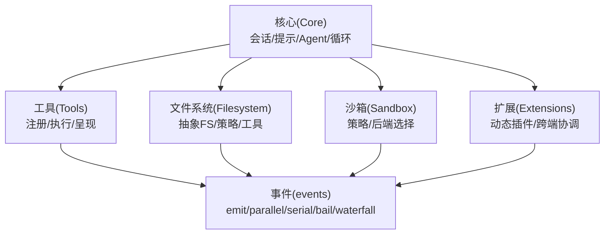
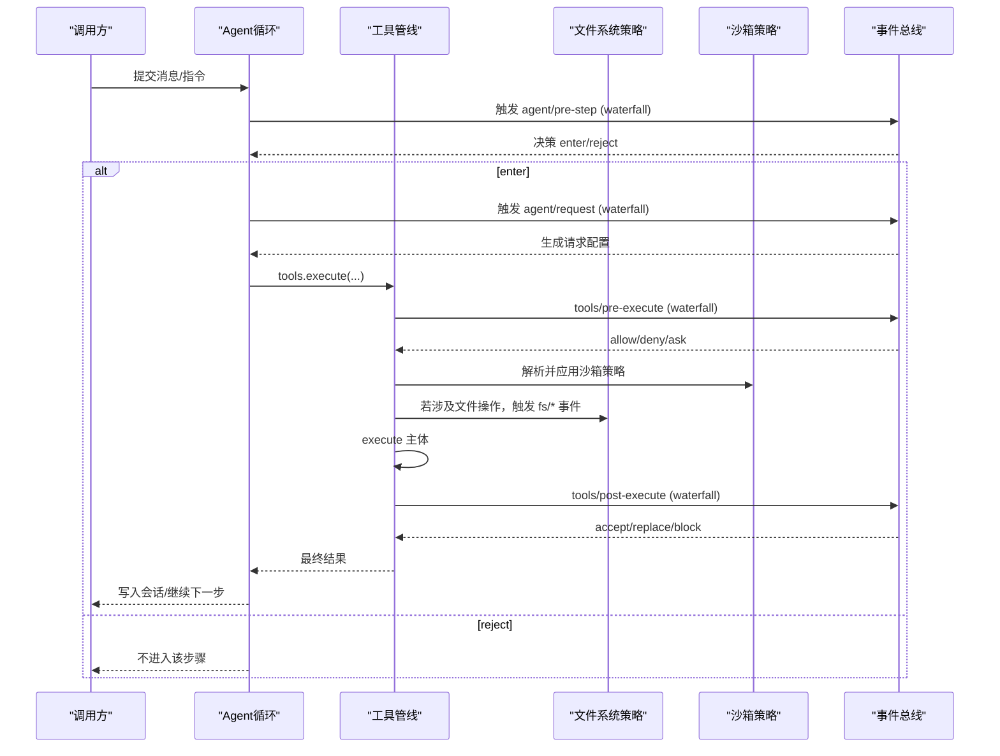
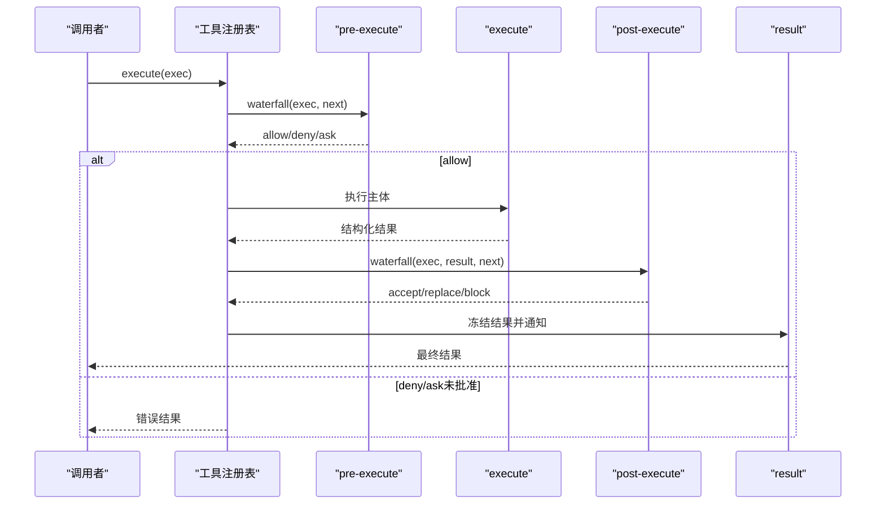
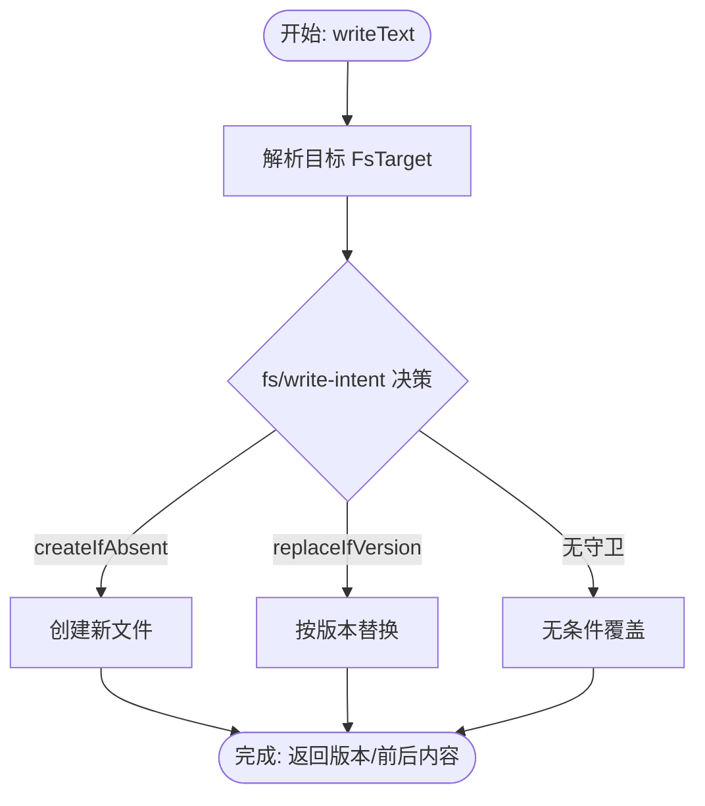
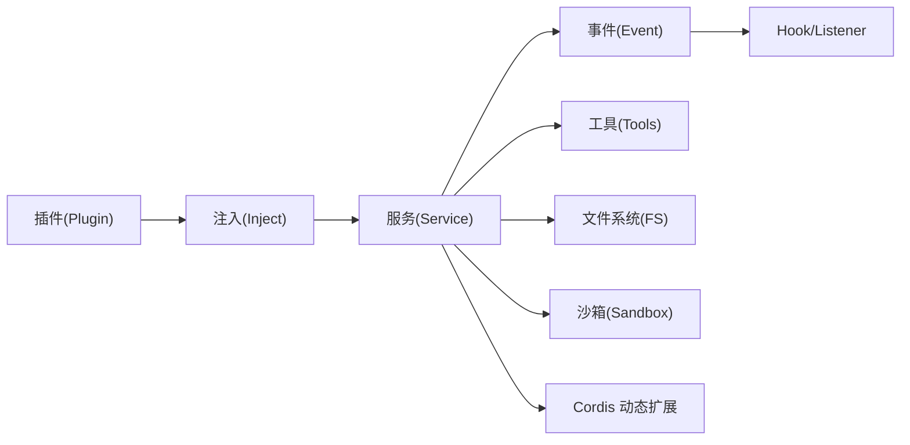

# 扩展点设计

<cite>
**本文引用的文件**
- [core.md](file://docs/subsystems/core.md)
- [tools.md](file://docs/subsystems/tools.md)
- [filesystem.md](file://docs/subsystems/filesystem.md)
- [sandbox.md](file://docs/subsystems/sandbox.md)
- [extensions.md](file://docs/subsystems/extensions.md)
- [events.md](file://docs/cordis-api/events.md)
- [04-events.md](file://docs/cordis-tutorial/04-events.md)
- [07-into-the-harness.md](file://docs/cordis-tutorial/07-into-the-harness.md)
- [registry.md](file://docs/cordis-api/registry.md)
- [loop.spec.ts](file://packages/core/agent-loop/tests/interception.spec.ts)
- [policy.spec.ts](file://packages/sandbox/sandbox-policy/tests/policy.spec.ts)
</cite>

## 目录
1. [简介](#简介)
2. [项目结构](#项目结构)
3. [核心组件](#核心组件)
4. [架构总览](#架构总览)
5. [详细组件分析](#详细组件分析)
6. [依赖关系分析](#依赖关系分析)
7. [性能考虑](#性能考虑)
8. [故障排查指南](#故障排查指南)
9. [结论](#结论)
10. [附录：扩展点分类与示例索引](#附录扩展点分类与示例索引)

## 简介
本文件面向 DeepSeek Harness 的扩展开发者，系统化说明系统的扩展机制与钩子（事件）体系。内容覆盖模型提供商扩展、工具扩展、文件系统访问扩展、沙箱扩展等关键能力边界；并以“事件监听器”为主线，解释如何在 agent/pre-step、agent/request、tools/* 等阶段注入自定义逻辑。文档同时给出最佳实践与常见陷阱，帮助你在不同阶段安全、可观测地扩展系统行为。

## 项目结构
DeepSeek Harness 以子系统为组织单元，每个子系统提供一组可扩展的“能力接缝”（seams），通过服务注册、事件分发和插件生命周期进行组合。核心子系统包括：
- 核心（Core）：会话日志、系统提示组装、工具注册表、Agent 类型与驱动循环
- 工具（Tools）：工具注册与执行流水线、UI 呈现契约
- 文件系统（Filesystem）：抽象 FS 提供者、观察策略、读写编辑工具
- 沙箱（Sandbox）：进程隔离策略与后端选择
- 扩展（Extensions）：动态 Cordis 插件运行与跨端协调

图表来源
- [core.md:1-20](file://docs/subsystems/core.md#L1-L20)
- [tools.md:1-12](file://docs/subsystems/tools.md#L1-L12)
- [filesystem.md:1-10](file://docs/subsystems/filesystem.md#L1-L10)
- [sandbox.md:1-10](file://docs/subsystems/sandbox.md#L1-L10)
- [extensions.md:1-10](file://docs/subsystems/extensions.md#L1-L10)

章节来源
- [core.md:1-20](file://docs/subsystems/core.md#L1-L20)
- [tools.md:1-12](file://docs/subsystems/tools.md#L1-L12)
- [filesystem.md:1-10](file://docs/subsystems/filesystem.md#L1-L10)
- [sandbox.md:1-10](file://docs/subsystems/sandbox.md#L1-L10)
- [extensions.md:1-10](file://docs/subsystems/extensions.md#L1-L10)

## 核心组件
- 事件系统：所有上下文内置 ctx.emit / ctx.parallel / ctx.serial / ctx.bail / ctx.waterfall，支持同步广播、并行等待、串行短路、瀑布拦截等模式。
- 工具管线：注册工具定义、参数与输出校验、pre-execute/execute/post-execute 拦截、结果冻结与持久化。
- 文件系统：抽象 FS 接口 + 观察策略事件（fs/write-intent、fs/edit-intent、fs/observed），读写编辑原子性与版本守卫。
- 沙箱：策略服务解析 per-call 模式与工作区根，后端 confine 返回受限 argv 与完整性报告。
- 动态扩展：Cordis 动态插件定义、运行、撤销、客户端/宿主协调与检查查询。

章节来源
- [events.md:8-123](file://docs/cordis-api/events.md#L8-L123)
- [tools.md:169-405](file://docs/subsystems/tools.md#L169-L405)
- [filesystem.md:181-243](file://docs/subsystems/filesystem.md#L181-L243)
- [sandbox.md:9-95](file://docs/subsystems/sandbox.md#L9-L95)
- [extensions.md:67-257](file://docs/subsystems/extensions.md#L67-L257)

## 架构总览
下图展示一次典型 Agent 调用在 Harness 中的扩展点分布：从 pre-step 到 request，再到工具执行与结果回写，以及文件系统与沙箱的介入点。

图表来源
- [core.md:211-235](file://docs/subsystems/core.md#L211-L235)
- [tools.md:576-720](file://docs/subsystems/tools.md#L576-L720)
- [filesystem.md:432-495](file://docs/subsystems/filesystem.md#L432-L495)
- [sandbox.md:166-217](file://docs/subsystems/sandbox.md#L166-L217)

## 详细组件分析

### 事件系统与拦截模式
- 五种分发模式：
  - emit：同步广播，忽略返回值
  - parallel：全部并发等待
  - serial：顺序等待，首个非空返回值短路
  - bail：同步版 serial
  - waterfall：最后一个参数为 next 的中间件链，可转换或否决
- 使用建议：
  - 仅观察/记录的事件用 emit/parallel
  - 需要短路决策的用 serial/bail
  - 需要包装默认行为的用 waterfall（务必调用 next() 除非有意否决）

章节来源
- [events.md:8-123](file://docs/cordis-api/events.md#L8-L123)
- [04-events.md:80-140](file://docs/cordis-tutorial/04-events.md#L80-L140)

### 工具扩展点（tools/*）
- 注册与执行：
  - 通过 ctx.tools.register 注册工具定义（名称、描述、参数 schema、输出 schema、execute、可选 finalizeContent/presentCall/presentResult）
  - 执行入口 ctx.tools.execute，内部经过 pre-execute → guards → execute → post-execute → finalizeContent → result
- 关键事件：
  - tools/pre-execute：允许/拒绝/询问（ask）
  - tools/execute：around-dispatch，可替换信号、埋点、重试
  - tools/post-execute：接受/替换值或内容/阻断
  - tools/result：只读观察最终冻结结果
  - tools/change：工具集变更通知
  - tools/code-dispatch-log：对 run_code 子调用的日志副本做内容替换
- 最佳实践：
  - 严格遵循参数与输出 schema，避免泄露执行细节到模型可见字段
  - 在 post-execute 中隐藏敏感值时优先 block 或替换 content/value
  - 异步监听必须关注 exec.signal，确保可取消

章节来源
- [tools.md:9-152](file://docs/subsystems/tools.md#L9-L152)
- [tools.md:170-405](file://docs/subsystems/tools.md#L170-L405)
- [tools.md:470-720](file://docs/subsystems/tools.md#L470-L720)
- [07-into-the-harness.md:7-95](file://docs/cordis-tutorial/07-into-the-harness.md#L7-L95)

#### 工具执行时序图

图表来源
- [tools.md:170-405](file://docs/subsystems/tools.md#L170-L405)
- [tools.md:576-720](file://docs/subsystems/tools.md#L576-L720)

### 文件系统扩展点（fs/*）
- 抽象 FS：ctx.fs 提供 resolve/stat/read/listDir/writeText/editText 等原语，目标标识与版本令牌由后端管理。
- 策略事件：
  - fs/write-intent：决定 write 的意图（createIfAbsent 或 replaceIfVersion）
  - fs/edit-intent：决定 edit 的版本守卫
  - fs/observed：记录存在/不存在的事实（同步观察者）
- 安全与一致性：
  - 写/编辑原子性，版本守卫防冲突
  - 错误码稳定（如 FS_STALE_VERSION、FS_NOT_OBSERVED、FS_SANDBOX_DENIED）
- 最佳实践：
  - 始终通过 ctx.fs 访问，不要直接操作底层路径
  - 策略监听器保持纯函数式副作用最小化，避免阻塞
  - 大文件读取使用 streamText 并设置字节上限

章节来源
- [filesystem.md:11-180](file://docs/subsystems/filesystem.md#L11-L180)
- [filesystem.md:181-275](file://docs/subsystems/filesystem.md#L181-L275)
- [filesystem.md:276-495](file://docs/subsystems/filesystem.md#L276-L495)

#### 文件写入决策流程图

图表来源
- [filesystem.md:114-180](file://docs/subsystems/filesystem.md#L114-L180)
- [filesystem.md:476-495](file://docs/subsystems/filesystem.md#L476-L495)

### 沙箱扩展点（ctx.sandbox / ctx.sandboxPolicy）
- 策略服务：
  - resolve(request)：解析 per-call 的 mode（read-only/workspace-write/danger-full-access）与 workspaceRoot
  - overrideOf(session)：读取会话级覆盖
- 后端 confine：
  - 将原始 argv 包裹为受限 argv，返回 enforcement 完整度与诊断规则
  - 禁止静默绕过限制
- 最佳实践：
  - 对受限模式下的失败进行分类（runner failure vs denial）
  - 根据 enforcement 决定是否接受部分约束场景
  - 结合工具与文件系统策略，统一工作区边界

章节来源
- [sandbox.md:9-95](file://docs/subsystems/sandbox.md#L9-L95)
- [sandbox.md:96-157](file://docs/subsystems/sandbox.md#L96-L157)
- [sandbox.md:166-217](file://docs/subsystems/sandbox.md#L166-L217)
- [policy.spec.ts:42-61](file://packages/sandbox/sandbox-policy/tests/policy.spec.ts#L42-L61)

### 动态扩展（Cordis 动态插件）
- 动态插件生命周期：
  - define/run/stop/undefine：宿主侧定义、激活、停止、移除
  - inspect/query：跨端检查与查询
  - 事件：cordis/dynamic-package、cordis/dynamic-retract、cordis/inspect-query、cordis/request-run 等
- 使用建议：
  - 仅在必要时启用客户端代码，注意授权与用户确认
  - 利用 inventory/snapshot 进行运行时自检
  - 通过 resolveClientQuery/settleUserRun 处理异步决策

章节来源
- [extensions.md:15-65](file://docs/subsystems/extensions.md#L15-L65)
- [extensions.md:67-257](file://docs/subsystems/extensions.md#L67-L257)
- [extensions.md:259-365](file://docs/subsystems/extensions.md#L259-L365)

### Agent 生命周期扩展点（agent/pre-step、agent/request）
- agent/pre-step：在进入提议步骤前拦截，可拒绝或携带消息进入；支持注入 steer/inject 暂存
- agent/request：在构造模型请求前拦截，可替换请求配置
- 测试验证：
  - pre-step 每步触发一次，且发生在打开步骤之前
  - 注入/转向在 pre-step 期间被暂存并在进入后生效

章节来源
- [core.md:211-235](file://docs/subsystems/core.md#L211-L235)
- [loop.spec.ts:867-898](file://packages/core/agent-loop/tests/interception.spec.ts#L867-L898)
- [loop.spec.ts:257-456](file://packages/core/agent-loop/tests/interception.spec.ts#L257-L456)

## 依赖关系分析
- 插件加载与依赖注入：
  - ctx.plugin 加载插件，ctx.inject 声明依赖并自动重入
  - 服务变更会卸载并重跑回调，保证依赖最新
- 子系统耦合：
  - 工具管线依赖事件系统；文件系统策略通过事件解耦；沙箱策略被工具/Shell 消费；动态扩展通过事件与跨端通道协作

图表来源
- [registry.md:8-47](file://docs/cordis-api/registry.md#L8-L47)
- [registry.md:123-155](file://docs/cordis-api/registry.md#L123-L155)

章节来源
- [registry.md:8-47](file://docs/cordis-api/registry.md#L8-L47)
- [registry.md:123-155](file://docs/cordis-api/registry.md#L123-L155)

## 性能考虑
- 事件选择：
  - 高频轻量通知用 emit；需聚合等待用 parallel；需短路决策用 serial/bail；需包装默认行为用 waterfall
- 工具执行：
  - 合理设置 timeoutMs 并实现协作取消；避免在 execute 中持有长连接
  - 使用 isConcurrencySafe 谨慎开启并行，避免共享可变状态
- 文件系统：
  - 大文件使用流式读取；设置 maxBytes 防止内存膨胀
  - 策略监听器保持同步、无阻塞
- 沙箱：
  - 区分 runner failure 与 denial，避免误判导致重试风暴
  - 根据 enforcement 级别调整降级策略

[本节为通用指导，无需具体文件引用]

## 故障排查指南
- 工具管线异常：
  - pre-execute 抛出：不会进入 execute，也不会触发 post-execute；查看 tool/code-dispatch 事件获取错误
  - post-execute 抛出：会被包含为 isError 结果，不影响已执行的主体
- 文件系统问题：
  - FS_STALE_VERSION：版本不一致，重新读取后重试
  - FS_NOT_OBSERVED：未观察到目标，先 read/view 再写
  - FS_SANDBOX_DENIED：沙箱策略拒绝，检查 mode 与 workspaceRoot
- 沙箱问题：
  - SANDBOX_UNAVAILABLE：无可用后端，回退或提示用户
  - 部分约束（partial）：根据业务风险决定是否接受
- 动态扩展：
  - 客户端查询未解决：检查 cordis/inspect-query-resolved 与 resolveClientQuery
  - 渲染失败：通过 reportRenderFailure 上报定位

章节来源
- [tools.md:970-999](file://packages/core/tools/tests/invariant.spec.ts#L40-L70)
- [filesystem.md:244-275](file://docs/subsystems/filesystem.md#L244-L275)
- [sandbox.md:152-157](file://docs/subsystems/sandbox.md#L152-L157)
- [extensions.md:297-365](file://docs/subsystems/extensions.md#L297-L365)

## 结论
DeepSeek Harness 通过“服务 + 事件 + 插件”的组合，提供了高度可插拔的扩展能力。围绕 agent/pre-step、agent/request、tools/*、fs/*、sandbox 等扩展点，你可以在不侵入核心代码的前提下，实现权限控制、审计、缓存、重试、内容脱敏、沙箱隔离与动态插件等能力。遵循本文的最佳实践与陷阱提示，可以构建稳定、可观测、易维护的扩展方案。

## 附录：扩展点分类与示例索引
- 模型提供商扩展
  - 接入点：AgentOptions.provider/model；LLM 适配器注册
  - 参考：core.md 中 AgentOptions 与 provider 说明
- 工具扩展
  - 注册：ctx.tools.register(defineTool(...))
  - 拦截：tools/pre-execute、tools/execute、tools/post-execute、tools/result
  - 参考：tools.md、07-into-the-harness.md
- 文件系统扩展
  - 策略：fs/write-intent、fs/edit-intent、fs/observed
  - 参考：filesystem.md
- 沙箱扩展
  - 策略：ctx.sandboxPolicy.resolve、ctx.sandbox.confine
  - 参考：sandbox.md
- 动态扩展（Cordis）
  - 生命周期：define/run/stop/undefine；inspect/query
  - 事件：cordis/dynamic-package、cordis/request-run 等
  - 参考：extensions.md
- 事件系统
  - 模式：emit/parallel/serial/bail/waterfall
  - 参考：events.md、04-events.md

章节来源
- [core.md:157-170](file://docs/subsystems/core.md#L157-L170)
- [tools.md:470-720](file://docs/subsystems/tools.md#L470-L720)
- [filesystem.md:432-495](file://docs/subsystems/filesystem.md#L432-L495)
- [sandbox.md:166-217](file://docs/subsystems/sandbox.md#L166-L217)
- [extensions.md:259-365](file://docs/subsystems/extensions.md#L259-L365)
- [events.md:8-123](file://docs/cordis-api/events.md#L8-L123)
- [04-events.md:80-140](file://docs/cordis-tutorial/04-events.md#L80-L140)
- [07-into-the-harness.md:7-95](file://docs/cordis-tutorial/07-into-the-harness.md#L7-L95)