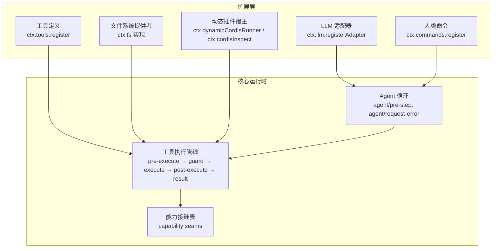
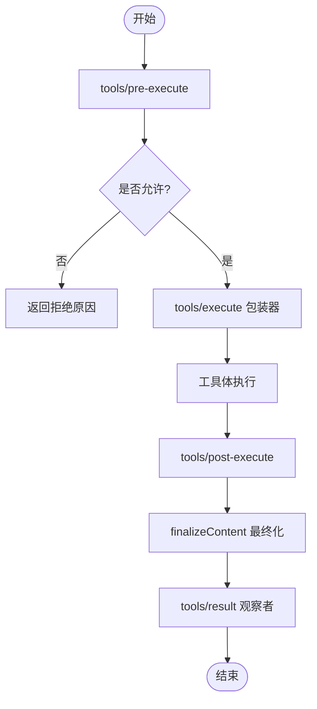
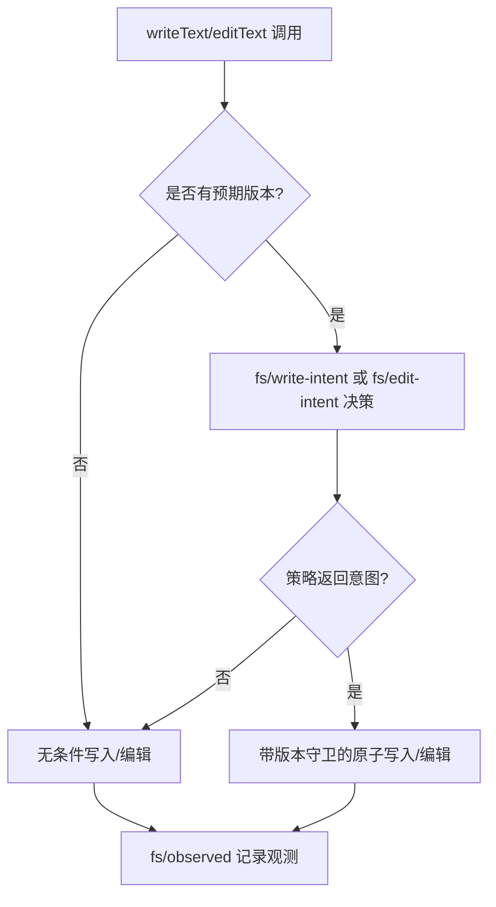
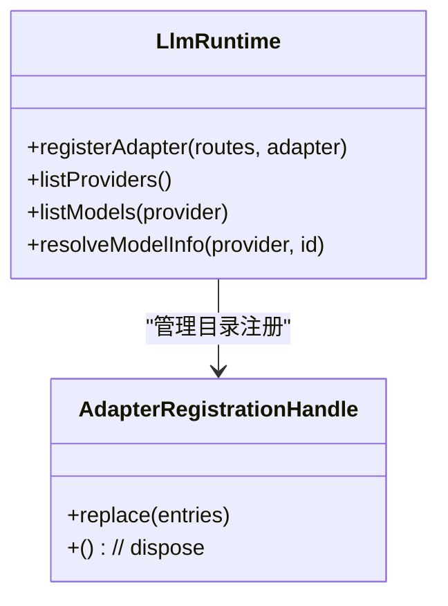
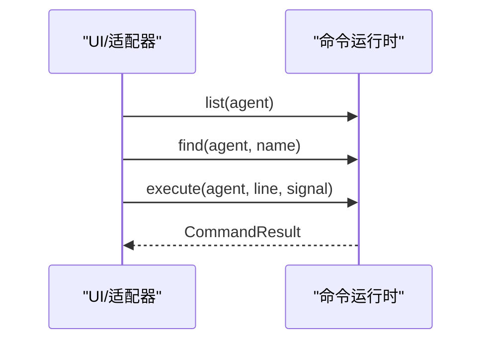
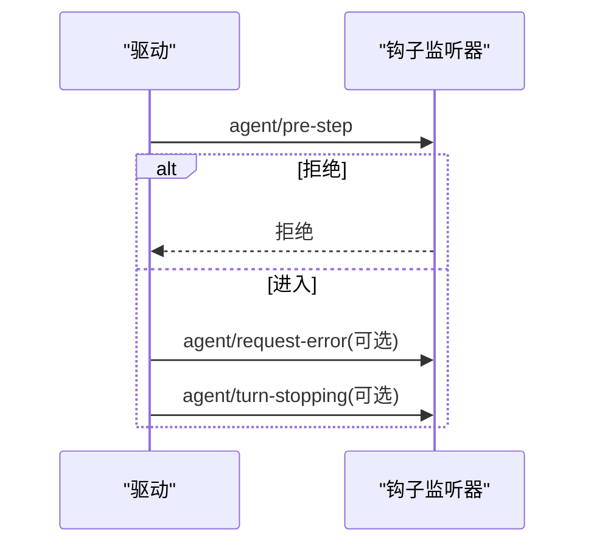
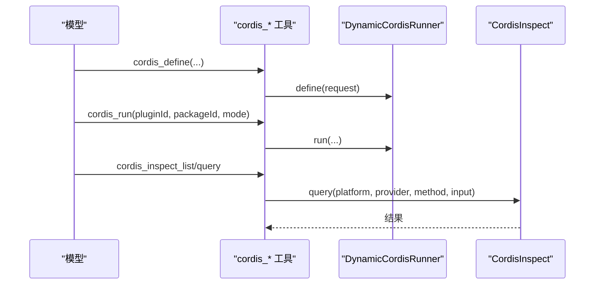
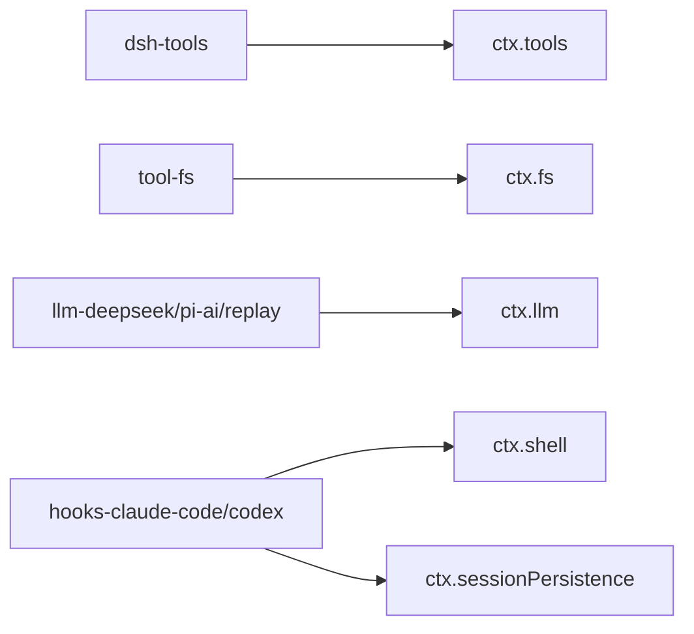

# 扩展点设计

<cite>
**本文引用的文件**
- [packages/core/tools/src/index.ts](file://packages/core/tools/src/index.ts)
- [docs/subsystems/tools.md](file://docs/subsystems/tools.md)
- [docs/subsystems/filesystem.md](file://docs/subsystems/filesystem.md)
- [docs/subsystems/commands.md](file://docs/subsystems/commands.md)
- [docs/capability-seams.md](file://docs/capability-seams.md)
- [docs/agent-lifecycle.md](file://docs/agent-lifecycle.md)
- [docs/tool-catalog.md](file://docs/tool-catalog.md)
- [packages/llm/llm/src/index.ts](file://packages/llm/llm/src/index.ts)
- [packages/extensions/cordis-host-runner/src/guard.ts](file://packages/extensions/cordis-host-runner/src/guard.ts)
- [packages/fs/tool-fs/tests/read-image.spec.ts](file://packages/fs/tool-fs/tests/read-image.spec.ts)
- [packages/hooks/hooks-claude-code/tests/bridge.spec.ts](file://packages/hooks/hooks-claude-code/tests/bridge.spec.ts)
</cite>

## 目录
1. [引言](#引言)
2. [项目结构](#项目结构)
3. [核心组件](#核心组件)
4. [架构总览](#架构总览)
5. [详细组件分析](#详细组件分析)
6. [依赖关系分析](#依赖关系分析)
7. [性能考量](#性能考量)
8. [故障排查指南](#故障排查指南)
9. [结论](#结论)
10. [附录：扩展开发指南与最佳实践](#附录：扩展开发指南与最佳实践)

## 引言
本文件系统性梳理 DeepSeek Harness 的扩展点设计，覆盖 Agent 生命周期钩子、工具注册与执行管线、LLM 适配器集成、文件系统提供者与策略、命令扩展以及动态插件（Cordis）能力。文档面向希望扩展系统能力的开发者，提供从简单工具到复杂系统集成的完整路径，并说明优先级、冲突解决、向后兼容设计与最佳实践。

## 项目结构
- 扩展点以“服务/能力接缝”为中心，通过 ctx.* 暴露统一接口，插件按职责注册实现或监听事件。
- 关键子系统包括：
  - 工具注册与执行管线（ctx.tools）
  - 文件系统抽象与策略（ctx.fs + fs/* 事件门）
  - LLM 适配器注册（ctx.llm）
  - 人类命令注册（ctx.commands）
  - 动态插件宿主（ctx.dynamicCordisRunner / ctx.cordisInspect）
  - Agent 生命周期钩子（agent/pre-step、agent/request-error 等）



图表来源
- [docs/capability-seams.md:1-472](file://docs/capability-seams.md#L1-L472)
- [docs/subsystems/tools.md:1-721](file://docs/subsystems/tools.md#L1-L471)
- [docs/agent-lifecycle.md:1-83](file://docs/agent-lifecycle.md#L1-L83)

章节来源
- [docs/capability-seams.md:1-472](file://docs/capability-seams.md#L1-L472)

## 核心组件
- 工具注册与执行管线：提供 defineTool/register、schemas、executionMode、execute、guard、presentAs/restrict 等能力；支持 pre-execute、tools/execute、post-execute、result 等可插拔水线。
- 文件系统提供者：抽象 FileSystem 接口，配合 fs/* 事件门（write-intent、edit-intent、observed）实现读前写/编辑策略与版本守卫。
- LLM 适配器：通过 registerAdapter 注册路由名与模型发现；支持目录级替换与原子替换，重复注册会拒绝。
- 人类命令：插件可注册命令描述与处理器，UI 直接调用而不经过模型消息。
- 动态插件（Cordis）：定义/运行/停止/撤销插件包，提供 inspect 查询与跨端同步。

章节来源
- [docs/subsystems/tools.md:1-721](file://docs/subsystems/tools.md#L1-L471)
- [docs/subsystems/filesystem.md:1-496](file://docs/subsystems/filesystem.md#L1-L496)
- [packages/llm/llm/src/index.ts:259-294](file://packages/llm/llm/src/index.ts#L259-L294)
- [docs/subsystems/commands.md:1-188](file://docs/subsystems/commands.md#L1-L188)
- [docs/tool-catalog.md:1-800](file://docs/tool-catalog.md#L1-L800)

## 架构总览
下图展示扩展点如何嵌入 Agent 主循环与工具执行管线，并通过能力接缝解耦具体实现。

```mermaid
sequenceDiagram
participant User as "用户"
participant Agent as "Agent"
participant Loop as "Agent 循环"
participant Hooks as "生命周期钩子"
participant Tools as "工具管线"
participant FS as "文件系统"
participant LLM as "LLM 适配器"
User->>Agent : followup(内容)
Agent-->>Loop : 入队工作唤醒驱动
Loop->>Hooks : agent/pre-step (可拦截/改写)
alt 被拒绝或失败
Loop-->>User : 不进入步骤
else 进入步骤
Loop->>LLM : 请求流式响应
LLM-->>Loop : 流式片段
Loop->>Tools : 分类并调度工具调用
Tools->>FS : 读/写/编辑受策略守卫
FS-->>Tools : 结果或错误
Tools-->>Loop : tool/result
end
Loop-->>User : 状态 idle
```

图表来源
- [docs/agent-lifecycle.md:1-83](file://docs/agent-lifecycle.md#L1-L83)
- [docs/subsystems/tools.md:1-721](file://docs/subsystems/tools.md#L1-L471)
- [docs/subsystems/filesystem.md:1-496](file://docs/subsystems/filesystem.md#L1-L496)

## 详细组件分析

### 工具注册与执行管线（ctx.tools）
- 注册与可见性：register 支持全局与作用域注册；restrict/presentAs 控制可见集合；reserved 名称（如 run_code）不可覆盖。
- 执行水线：
  - tools/pre-execute：允许/拒绝/询问（ask），输入已冻结不可改写。
  - 单调守卫（guard）：最终否决权，顺序不可逆。
  - tools/execute：around-dispatch，可替换信号但不可移除。
  - tools/post-execute：接受/替换/阻断结果。
  - tools/result：只读观察最终冻结结果。
- 并发与模式：executionMode 决定 parallel/exclusive；isConcurrencySafe 用于并行分组。
- 输出与呈现：output.schema/render/presentationMeta；finalizeContent 在最终化前裁剪内容。



图表来源
- [docs/subsystems/tools.md:1-721](file://docs/subsystems/tools.md#L1-L471)
- [packages/core/tools/src/index.ts:1031-1062](file://packages/core/tools/src/index.ts#L1031-L1062)

章节来源
- [docs/subsystems/tools.md:1-721](file://docs/subsystems/tools.md#L1-L471)
- [packages/core/tools/src/index.ts:1031-1062](file://packages/core/tools/src/index.ts#L1031-L1062)

### 文件系统提供者与策略（ctx.fs + fs/* 事件门）
- 抽象接口：resolve/stat/lstat/readText/streamText/readBytes/listDir/writeText/editText。
- 策略事件门：
  - fs/write-intent：首次-wins 决策，默认无守卫；策略可注入 createIfAbsent/replaceIfVersion。
  - fs/edit-intent：首次-wins 决策，默认无守卫；策略可注入版本守卫。
  - fs/observed：记录存在/不存在观测，供策略维护“已观测状态”。
- 安全与沙箱：fs-sandbox 基于 sandboxPolicy 限制读写范围；错误码稳定且可路由。



图表来源
- [docs/subsystems/filesystem.md:1-496](file://docs/subsystems/filesystem.md#L1-L496)

章节来源
- [docs/subsystems/filesystem.md:1-496](file://docs/subsystems/filesystem.md#L1-L496)

### LLM 适配器集成（ctx.llm）
- 注册方式：registerAdapter(route, adapter)，支持多路由映射；目录级替换 handle 支持原子替换与校验。
- 冲突处理：重复注册同一路由将抛出 DUPLICATE_ADAPTER；空路由或内部重复会被拒绝。
- 模型发现：listModels/resolver 支持目录提供者与目录句柄 replace。



图表来源
- [packages/llm/llm/src/index.ts:259-294](file://packages/llm/llm/src/index.ts#L259-L294)

章节来源
- [packages/llm/llm/src/index.ts:259-294](file://packages/llm/llm/src/index.ts#L259-L294)

### 人类命令扩展（ctx.commands）
- 注册：CommandDefinition(name, description, input?, recordInput?, handler)。
- 发现与解析：list/find 获取作用域内有效命令；parseCommand 进行语法解析。
- 执行：execute(agent, line, signal) 直接调用处理器，不经过模型消息；记录 command/run 与 command/done。



图表来源
- [docs/subsystems/commands.md:1-188](file://docs/subsystems/commands.md#L1-L188)

章节来源
- [docs/subsystems/commands.md:1-188](file://docs/subsystems/commands.md#L1-L188)

### Agent 生命周期钩子
- 关键钩子：
  - agent/pre-step：在进入步骤前拦截，可拒绝或改写下一步消息。
  - agent/request-error：请求失败时触发，可用于上下文压缩或重试策略。
  - agent/turn-stopping：自然停止时的串行检查点。
- 行为：钩子返回的决策具有权威性；后续 listener 包裹 next() 需保留下游消息除非有意替换。



图表来源
- [docs/agent-lifecycle.md:1-83](file://docs/agent-lifecycle.md#L1-L83)

章节来源
- [docs/agent-lifecycle.md:1-83](file://docs/agent-lifecycle.md#L1-L83)

### 动态插件（Cordis）与 Inspect
- 动态插件宿主：define/run/stop/undefine/inventory/snapshot/inspectPackage 等。
- Inspect 注册：host/client provider 清单同步与查询路由；支持跨端异步查询。
- 安全：sandboxTools 仅暴露 schemas/get 等只读元数据，避免直接调用工具执行绕过管线。



图表来源
- [docs/tool-catalog.md:1-800](file://docs/tool-catalog.md#L264-L500)
- [packages/extensions/cordis-host-runner/src/guard.ts:639-655](file://packages/extensions/cordis-host-runner/src/guard.ts#L639-L655)

章节来源
- [docs/tool-catalog.md:1-800](file://docs/tool-catalog.md#L264-L500)
- [packages/extensions/cordis-host-runner/src/guard.ts:639-655](file://packages/extensions/cordis-host-runner/src/guard.ts#L639-L655)

## 依赖关系分析
- 能力接缝表展示了各包对服务的拥有者、实现者与消费者关系，确保扩展点清晰解耦。
- 典型依赖链：
  - tool-* 消费 ctx.tools、ctx.systemPrompt、ctx.shell/ctx.fs/ctx.web 等。
  - hooks-* 消费 ctx.sessionPersistence、ctx.shell 等。
  - llm-* 注册到 ctx.llm，被 agent-loop 与 compaction 使用。



图表来源
- [docs/capability-seams.md:1-472](file://docs/capability-seams.md#L1-L472)

章节来源
- [docs/capability-seams.md:1-472](file://docs/capability-seams.md#L1-L472)

## 性能考量
- 工具并发：isConcurrencySafe=true 可加入并行组；exclusive 形成排序屏障。
- 超时与取消：timeoutMs 声明为协作式预算；tools/execute 包装器可替换信号但不能移除；fs 操作无 timeoutMs（由底层 syscall 决定）。
- 结果裁剪：finalizeContent 可在最终化前裁剪大结果；spillStore 可将超大文本溢出到定位器。
- 流式 LLM：stream 分段回传，减少内存峰值。

[本节为通用指导，无需特定文件引用]

## 故障排查指南
- 工具注册失败：
  - 重复名称：抛出 already registered；reserved 名称不可覆盖。
  - 无效 schema：assertSupportedJsonSchema 拒绝非法关键字。
- 工具执行失败：
  - UNKNOWN_TOOL：工具不可见或未注册。
  - INVALID_ARGS/INVALID_TOOL_OUTPUT：参数或输出不符合 schema。
  - ABORTED_BEFORE_DISPATCH/ABORTED：取消时机不同导致的结果差异。
- 文件系统错误：
  - FS_STALE_VERSION/FS_NOT_OBSERVED/FS_NOT_FOUND：版本守卫或观测缺失导致。
  - FS_SANDBOX_DENIED：沙箱策略拒绝。
- LLM 适配器：
  - DUPLICATE_ADAPTER：重复注册同一路由。
  - NO_ADAPTER：未找到对应 provider。
- 钩子异常：
  - agent/pre-step 抛错会导致步骤被丢弃；需捕获并降级。

章节来源
- [packages/core/tools/src/index.ts:1031-1062](file://packages/core/tools/src/index.ts#L1031-L1062)
- [docs/subsystems/tools.md:1-721](file://docs/subsystems/tools.md#L1-L471)
- [docs/subsystems/filesystem.md:1-496](file://docs/subsystems/filesystem.md#L1-L496)
- [packages/llm/llm/src/index.ts:259-294](file://packages/llm/llm/src/index.ts#L259-L294)
- [docs/agent-lifecycle.md:1-83](file://docs/agent-lifecycle.md#L1-L83)

## 结论
DeepSeek Harness 通过能力接缝与可扩展水线，将 Agent 生命周期、工具执行、LLM 适配、文件系统策略、命令与动态插件有机整合。扩展点遵循“先声明后实现”的原则，提供严格的校验、幂等与原子替换机制，确保高可靠与向后兼容。推荐优先通过工具注册与 fs/* 事件门进行轻量扩展，再逐步引入 LLM 适配器与动态插件完成系统集成。

[本节为总结，无需特定文件引用]

## 附录：扩展开发指南与最佳实践

### 适用场景与实现方式
- 简单工具添加：
  - 使用 defineTool/register 声明参数与输出 schema，实现 execute 与 render。
  - 如需并行，标记 isConcurrencySafe；如需超时，设置 timeoutMs。
  - 参考路径：[packages/core/tools/src/index.ts:1031-1062](file://packages/core/tools/src/index.ts#L1031-L1062)
- 复杂系统集成：
  - 文件系统：实现 FileSystem 并提供 read/write/edit；通过 fs/* 事件门注入策略。
    - 参考路径：[docs/subsystems/filesystem.md:1-496](file://docs/subsystems/filesystem.md#L1-L496)
  - LLM 适配器：registerAdapter 注册路由与模型发现；使用目录句柄进行原子替换。
    - 参考路径：[packages/llm/llm/src/index.ts:259-294](file://packages/llm/llm/src/index.ts#L259-L294)
  - 命令扩展：注册 CommandDefinition，UI 直接调用，不经过模型。
    - 参考路径：[docs/subsystems/commands.md:1-188](file://docs/subsystems/commands.md#L1-L188)
  - 动态插件：通过 Cordis 工具定义/运行/停止插件包，并使用 inspect 查询能力。
    - 参考路径：[docs/tool-catalog.md:1-800](file://docs/tool-catalog.md#L264-L500)

### 优先级与冲突解决
- 工具注册：
  - 作用域内注册覆盖全局；restrict 交集过滤；reserved 名称不可覆盖。
  - 重复名称在同一层拒绝；HMR 下可通过 disposer 清理。
  - 参考路径：[packages/core/tools/src/index.ts:1031-1062](file://packages/core/tools/src/index.ts#L1031-L1062)
- 文件系统策略：
  - fs/write-intent 与 fs/edit-intent 采用首次-wins；策略插件应优先注册以确保默认行为。
  - 参考路径：[docs/subsystems/filesystem.md:1-496](file://docs/subsystems/filesystem.md#L1-L496)
- LLM 适配器：
  - 重复路由拒绝；目录替换先全量校验再原子交换。
  - 参考路径：[packages/llm/llm/src/index.ts:259-294](file://packages/llm/llm/src/index.ts#L259-L294)

### 向后兼容设计
- 新增字段：保持 JSON Schema 开放属性或显式 additionalProperties 控制；对旧客户端忽略未知字段。
- 工具输出：output.schema 向后兼容；render 可渐进增强；presentationMeta 可选。
- 事件契约：新增事件需标注 emit/waterfall 模式，旧监听器不感知新字段不影响运行。
- 适配器替换：目录句柄 replace 保证原子性与一致性，避免读者观察到中间态。

### 使用模式与最佳实践
- 工具：
  - 明确 isConcurrencySafe 与 timeoutMs；在 finalizeContent 中裁剪大结果。
  - 使用 presentCall/presentResult 提供中性 UI 视图。
  - 参考路径：[docs/subsystems/tools.md:1-721](file://docs/subsystems/tools.md#L1-L471)
- 文件系统：
  - 始终通过 ctx.fs 访问；结合 fs/* 事件门实现读前写/编辑策略。
  - 使用 FsWriteIntent/FsEditRequest 进行版本守卫；关注错误码分支。
  - 参考路径：[docs/subsystems/filesystem.md:1-496](file://docs/subsystems/filesystem.md#L1-L496)
- LLM：
  - 为每个 provider 提供清晰的 model 列表与描述；使用目录句柄热更新。
  - 参考路径：[packages/llm/llm/src/index.ts:259-294](file://packages/llm/llm/src/index.ts#L259-L294)
- 命令：
  - 使用 recordInput=false 避免重复日志；通过 sourceEventSeq 关联领域事件。
  - 参考路径：[docs/subsystems/commands.md:1-188](file://docs/subsystems/commands.md#L1-L188)
- 动态插件：
  - 先 inspect 再 define；run 成功后通过 inspect_self 诊断；必要时 stop/undefine。
  - 参考路径：[docs/tool-catalog.md:1-800](file://docs/tool-catalog.md#L264-L500)

### 示例与参考
- 工具注册与执行：
  - 参考路径：[packages/core/tools/src/index.ts:1031-1062](file://packages/core/tools/src/index.ts#L1031-L1062)
- 文件系统读取图像（依赖 attachments 与 LLM 视觉路由）：
  - 参考路径：[packages/fs/tool-fs/tests/read-image.spec.ts:100-134](file://packages/fs/tool-fs/tests/read-image.spec.ts#L100-L134)
- 钩子加载韧性（缺失配置不崩溃）：
  - 参考路径：[packages/hooks/hooks-claude-code/tests/bridge.spec.ts:353-368](file://packages/hooks/hooks-claude-code/tests/bridge.spec.ts#L353-L368)