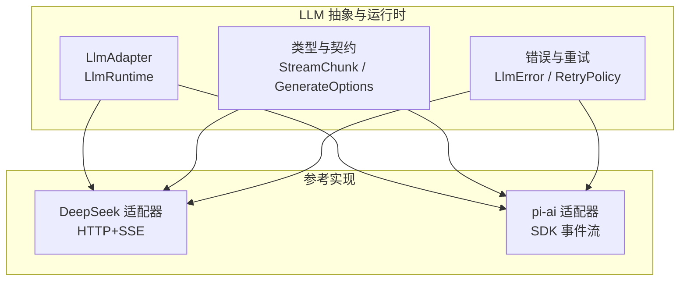
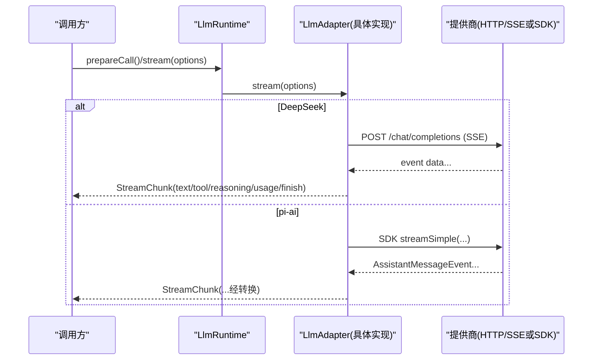
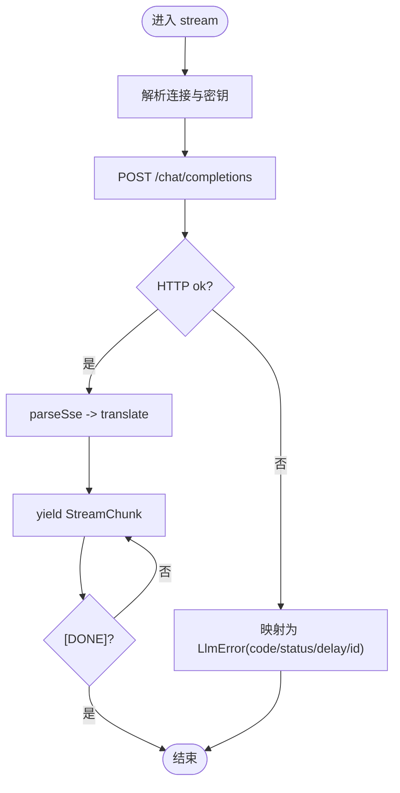
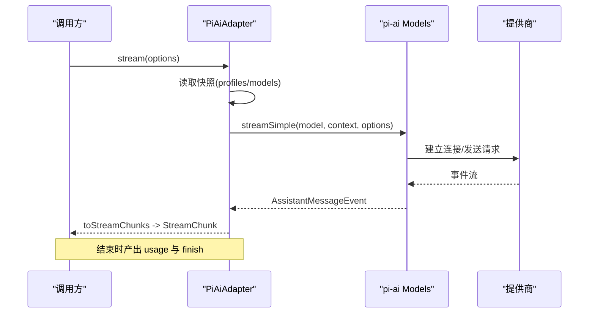
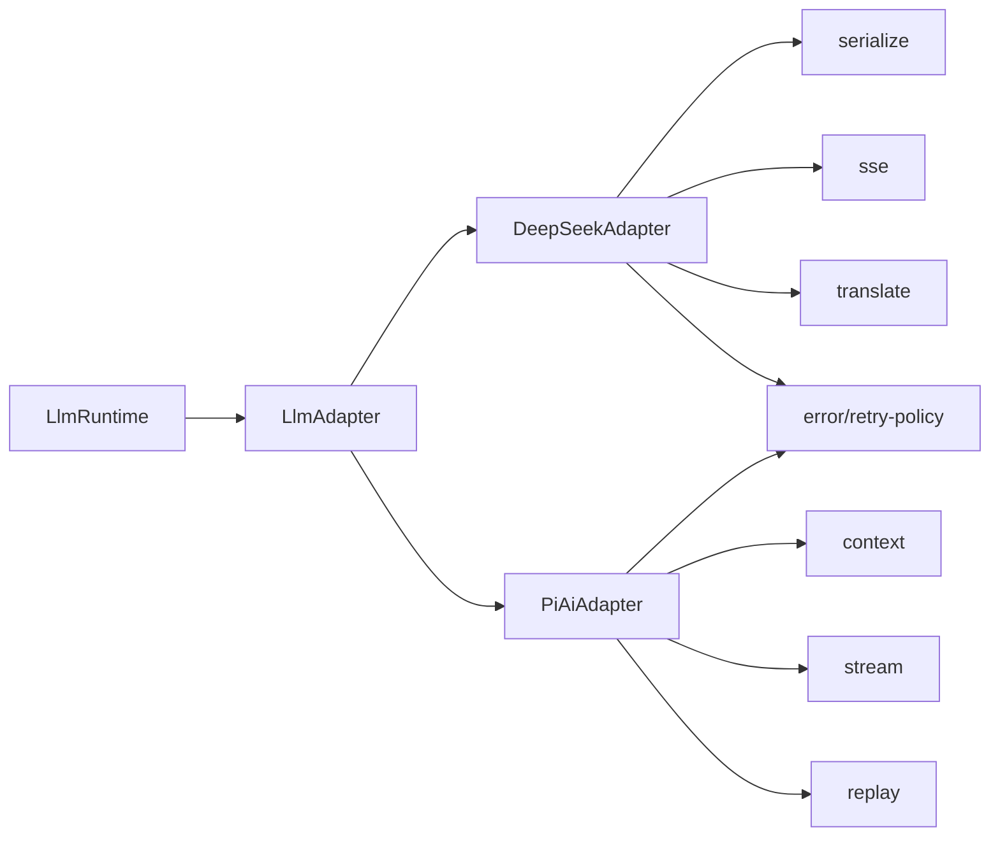
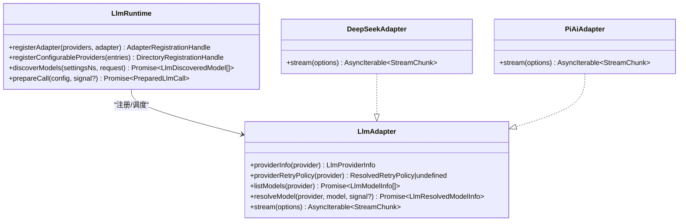

# LLM 提供商适配器

<cite>
**本文引用的文件**
- [packages/llm/llm/src/index.ts](file://packages/llm/llm/src/index.ts)
- [packages/llm/llm/src/types.ts](file://packages/llm/llm/src/types.ts)
- [packages/llm/llm/src/error.ts](file://packages/llm/llm/src/error.ts)
- [packages/llm/llm/src/retry-policy.ts](file://packages/llm/llm/src/retry-policy.ts)
- [packages/llm/llm-deepseek/src/adapter.ts](file://packages/llm/llm-deepseek/src/adapter.ts)
- [packages/llm/llm-deepseek/src/serialize.ts](file://packages/llm/llm-deepseek/src/serialize.ts)
- [packages/llm/llm-deepseek/src/sse.ts](file://packages/llm/llm-deepseek/src/sse.ts)
- [packages/llm/llm-pi-ai/src/adapter.ts](file://packages/llm/llm-pi-ai/src/adapter.ts)
- [packages/llm/llm-pi-ai/src/stream.ts](file://packages/llm/llm-pi-ai/src/stream.ts)
- [docs/cookbook/adding-an-llm-adapter.md](file://docs/cookbook/adding-an-llm-adapter.md)
</cite>

## 目录
1. [简介](#简介)
2. [项目结构](#项目结构)
3. [核心组件](#核心组件)
4. [架构总览](#架构总览)
5. [详细组件分析](#详细组件分析)
6. [依赖关系分析](#依赖关系分析)
7. [性能考量](#性能考量)
8. [故障排查指南](#故障排查指南)
9. [结论](#结论)
10. [附录](#附录)

## 简介
本文件面向希望为 Harness 实现自定义 LLM 提供商适配器的开发者，系统化说明适配器接口规范、连接管理、流式响应处理、错误与重试机制、认证处理、请求构建、响应解析与性能监控等关键实现细节。文档同时提供 OpenAI 兼容（DeepSeek）与多提供商 SDK（pi-ai）两种参考实现的集成要点，并给出配置格式、环境变量与最佳实践建议。

## 项目结构
- 抽象层与运行时：位于 packages/llm/llm，定义适配器抽象、类型契约、错误体系、重试策略与运行时注册能力。
- 参考实现：
  - DeepSeek（OpenAI 兼容直连 HTTP + SSE）：packages/llm/llm-deepseek
  - pi-ai（多提供商 SDK 封装）：packages/llm/llm-pi-ai
- 开发指南：docs/cookbook/adding-an-llm-adapter.md 提供适配器接入步骤与协议约定。

图表来源
- [packages/llm/llm/src/index.ts:175-233](file://packages/llm/llm/src/index.ts#L175-L233)
- [packages/llm/llm/src/types.ts:283-357](file://packages/llm/llm/src/types.ts#L283-L357)
- [packages/llm/llm/src/retry-policy.ts:144-192](file://packages/llm/llm/src/retry-policy.ts#L144-L192)
- [packages/llm/llm-deepseek/src/adapter.ts:158-347](file://packages/llm/llm-deepseek/src/adapter.ts#L158-L347)
- [packages/llm/llm-pi-ai/src/adapter.ts:186-359](file://packages/llm/llm-pi-ai/src/adapter.ts#L186-L359)

章节来源
- [packages/llm/llm/src/index.ts:175-233](file://packages/llm/llm/src/index.ts#L175-L233)
- [packages/llm/llm/src/types.ts:283-357](file://packages/llm/llm/src/types.ts#L283-L357)
- [docs/cookbook/adding-an-llm-adapter.md:1-44](file://docs/cookbook/adding-an-llm-adapter.md#L1-L44)

## 核心组件
- 适配器抽象 LlmAdapter：定义 providerInfo、providerRetryPolicy、listModels、resolveModel、stream 五个方法，其中 stream 是唯一必须实现的方法。
- 运行时 LlmRuntime：负责适配器注册、可配置提供者目录、模型发现、调用准备与拦截（waterfall），以及重试策略的注入点。
- 类型契约 StreamChunk/GenerateOptions：统一消息与流式协议，确保不同提供商输出一致。
- 错误体系 LlmError/HarnessError：稳定 code 分类与 cause 链，便于上层路由与诊断。
- 重试策略：支持 normal/always 两种模式，含指数退避与抖动，默认对空响应、限流、服务端错误、超时、传输错误可重试。

章节来源
- [packages/llm/llm/src/index.ts:175-233](file://packages/llm/llm/src/index.ts#L175-L233)
- [packages/llm/llm/src/index.ts:284-800](file://packages/llm/llm/src/index.ts#L284-L800)
- [packages/llm/llm/src/types.ts:283-357](file://packages/llm/llm/src/types.ts#L283-L357)
- [packages/llm/llm/src/error.ts:1-164](file://packages/llm/llm/src/error.ts#L1-L164)
- [packages/llm/llm/src/retry-policy.ts:144-192](file://packages/llm/llm/src/retry-policy.ts#L144-L192)

## 架构总览
适配器通过 LlmRuntime 注册到 provider 路由；调用时由运行时选择对应适配器执行 stream。DeepSeek 适配器直接发起 fetch 请求并解析 SSE；pi-ai 适配器通过 SDK 的事件流转换为统一的 StreamChunk。两者均遵循相同的协议约束：usage 在 finish 之前发出，finish 之后不再发送任何数据；工具调用参数保持原始 JSON 字符串；block index 按首次出现顺序分配且复用。

图表来源
- [packages/llm/llm/src/index.ts:779-800](file://packages/llm/llm/src/index.ts#L779-L800)
- [packages/llm/llm-deepseek/src/adapter.ts:214-347](file://packages/llm/llm-deepseek/src/adapter.ts#L214-L347)
- [packages/llm/llm-pi-ai/src/adapter.ts:276-359](file://packages/llm/llm-pi-ai/src/adapter.ts#L276-L359)

## 详细组件分析

### 适配器接口与协议约定
- 必须实现 stream(options): AsyncIterable<StreamChunk>
- 可选实现 providerInfo/providerRetryPolicy/listModels/resolveModel
- 协议约束（来自 cookbook）：
  - usage 必须在 finish 之前发出，finish 后不得再发任何块
  - 工具调用 arguments 自始至终为原始 JSON 字符串，增量以 argumentsDelta 形式传递
  - block index 按首次出现顺序分配，同一块的增量复用该 index
  - 错误两条路径：从 stream() 抛出 LlmError（传输/协议失败），或在流末尾 yield finish{kind:'error'|'aborted'}（提供商内联失败）
  - 必须尊重 options.signal
  - 不支持的选项应抛 UNSUPPORTED 而非静默丢弃
  - 如需 replayState，需保证最小无损 JSON 投影并在重建历史时校验

章节来源
- [packages/llm/llm/src/index.ts:175-233](file://packages/llm/llm/src/index.ts#L175-L233)
- [packages/llm/llm/src/types.ts:283-357](file://packages/llm/llm/src/types.ts#L283-L357)
- [docs/cookbook/adding-an-llm-adapter.md:25-39](file://docs/cookbook/adding-an-llm-adapter.md#L25-L39)

### DeepSeek 适配器（OpenAI 兼容直连）
- 连接管理：每请求解析 baseURL、apiKey、userId、默认 thinking/effort、maxTokens、contextWindow、重试策略与空闲超时；使用 AbortController 合并上游取消信号与空闲超时。
- 认证处理：Authorization: Bearer <apiKey>，附加 attributionHeaders 与平台标识头；密钥通过 resolveApiKey 钩子获取，避免硬编码。
- 请求构建：将 harness 消息序列化为 chat-completions 请求体，包含 system、messages、tools、thinking/reasoning_effort、temperature、max_tokens、stop 等字段。
- 流式响应：使用 eventsource-parser 解析 SSE，遇到 [DONE] 结束；translate 模块将 provider 事件映射为 StreamChunk。
- 错误与重试：非 2xx 响应映射为稳定 code（AUTH/RATE_LIMIT/CONTEXT_WINDOW_EXCEEDED/INVALID_REQUEST/SERVER/HTTP_*），携带 status、providerRetryAfterMs、requestId；超时与中止分别映射为 TIMEOUT/ABORTED。

图表来源
- [packages/llm/llm-deepseek/src/adapter.ts:214-347](file://packages/llm/llm-deepseek/src/adapter.ts#L214-L347)
- [packages/llm/llm-deepseek/src/sse.ts:20-41](file://packages/llm/llm-deepseek/src/sse.ts#L20-L41)
- [packages/llm/llm-deepseek/src/serialize.ts:151-188](file://packages/llm/llm-deepseek/src/serialize.ts#L151-L188)

章节来源
- [packages/llm/llm-deepseek/src/adapter.ts:158-347](file://packages/llm/llm-deepseek/src/adapter.ts#L158-L347)
- [packages/llm/llm-deepseek/src/serialize.ts:15-188](file://packages/llm/llm-deepseek/src/serialize.ts#L15-L188)
- [packages/llm/llm-deepseek/src/sse.ts:20-41](file://packages/llm/llm-deepseek/src/sse.ts#L20-L41)

### pi-ai 适配器（多提供商 SDK）
- 连接管理：每次调用捕获不可变快照（profiles + Models），避免跨配置变更的请求污染；支持图片输入时需要 AttachmentStore。
- 认证处理：通过 resolveApiKey(provider, profile) 获取 apiKey，最高优先级覆盖；若未配置则走提供商原生环境发现。
- 请求构建：将 harness 上下文转换为 SDK 上下文，设置 reasoning、thinkingBudgets、cacheRetention、transport、timeout、headers 等。
- 流式响应：通过 models.streamSimple 获取事件流，toStreamChunks 将其转换为 StreamChunk，并在结束时产出 usage 与 finish。
- 错误与重试：将提供商错误文本映射为稳定 code（AUTH/RATE_LIMIT/INVALID_REQUEST/SERVER/TIMEOUT/TRANSPORT），空响应与上下文溢出特殊处理；支持 abort 与 idle timeout。

图表来源
- [packages/llm/llm-pi-ai/src/adapter.ts:276-359](file://packages/llm/llm-pi-ai/src/adapter.ts#L276-L359)
- [packages/llm/llm-pi-ai/src/stream.ts:124-209](file://packages/llm/llm-pi-ai/src/stream.ts#L124-L209)

章节来源
- [packages/llm/llm-pi-ai/src/adapter.ts:186-359](file://packages/llm/llm-pi-ai/src/adapter.ts#L186-L359)
- [packages/llm/llm-pi-ai/src/stream.ts:1-209](file://packages/llm/llm-pi-ai/src/stream.ts#L1-L209)

### 重试策略与错误分类
- 重试策略：
  - normal：仅对指定代码重试（默认包含 EMPTY_RESPONSE、RATE_LIMIT、SERVER、TIMEOUT、TRANSPORT），最多 maxRetries 次，带指数退避与抖动
  - always：对所有失败重试直到成功、取消或释放
- 错误分类：
  - 上下文溢出：isContextWindowExceededError 识别多种表述
  - 配额耗尽：isQuotaExceededError 识别余额/配额耗尽
  - 空响应：EMPTY_RESPONSE_CODE 用于无内容完成
  - 认证失败：AUTH（401/403）
  - 限流：RATE_LIMIT（429 或关键词）
  - 服务端错误：SERVER（5xx）
  - 传输错误：TRANSPORT（网络/连接/中断）

章节来源
- [packages/llm/llm/src/retry-policy.ts:144-192](file://packages/llm/llm/src/retry-policy.ts#L144-L192)
- [packages/llm/llm/src/error.ts:24-100](file://packages/llm/llm/src/error.ts#L24-L100)
- [packages/llm/llm-deepseek/src/adapter.ts:138-149](file://packages/llm/llm-deepseek/src/adapter.ts#L138-L149)
- [packages/llm/llm-pi-ai/src/stream.ts:39-62](file://packages/llm/llm-pi-ai/src/stream.ts#L39-L62)

### 认证与配置
- 认证：
  - DeepSeek：Authorization: Bearer，密钥通过 resolveApiKey(connection) 获取；支持 x-deepseek-harness-user-id、x-deepseek-harness-session-id、x-deepseek-harness-compact 等扩展头
  - pi-ai：通过 resolveApiKey(provider, profile) 传入 apiKey；也可不传以使用提供商原生环境发现
- 配置：
  - 使用 schemastery 进行 schema 校验与默认值填充
  - 环境变量通过 cordis.yml 注入（如 !!js process.env.MY_KEY），避免在代码中硬编码密钥
  - 可配置项包括 thinking/reasoningEffort、maxTokens、contextWindow、retryPolicy、streamIdleTimeoutMs、headers、transport 等

章节来源
- [packages/llm/llm-deepseek/src/adapter.ts:49-86](file://packages/llm/llm-deepseek/src/adapter.ts#L49-L86)
- [packages/llm/llm-deepseek/src/adapter.ts:283-295](file://packages/llm/llm-deepseek/src/adapter.ts#L283-L295)
- [packages/llm/llm-pi-ai/src/adapter.ts:64-79](file://packages/llm/llm-pi-ai/src/adapter.ts#L64-L79)
- [docs/cookbook/adding-an-llm-adapter.md:23-24](file://docs/cookbook/adding-an-llm-adapter.md#L23-L24)

### 流式响应与块组装
- 块索引：按首次出现顺序分配，同块增量复用 index
- 工具调用：arguments 始终为原始 JSON 字符串，增量以 argumentsDelta 传递；结束块提供完整 arguments
- 使用统计：usage 在 finish 之前发出；pi-ai 将 reasoning tokens 折叠进 output，适配器需做相应映射
- 终止：收到 [DONE] 或 SDK done/error 事件后产出 usage 与 finish

章节来源
- [packages/llm/llm/src/types.ts:283-303](file://packages/llm/llm/src/types.ts#L283-L303)
- [packages/llm/llm-deepseek/src/sse.ts:20-41](file://packages/llm/llm-deepseek/src/sse.ts#L20-L41)
- [packages/llm/llm-pi-ai/src/stream.ts:124-209](file://packages/llm/llm-pi-ai/src/stream.ts#L124-L209)

### 性能监控与指标
- 空闲超时：idleWatchdog 检测长时间无数据，抛出 TIMEOUT 并附带 cause
- 请求标识：x-request-id/x-deepseek-request-id 透传到 LlmError.requestId，便于链路追踪
- 用户标识：x-deepseek-harness-user-id 用于遥测与反馈关联
- 会话标识：x-deepseek-harness-session-id 区分会话游标
- 用途标记：purpose=compaction 时添加 compact 头，便于后端优化

章节来源
- [packages/llm/llm-deepseek/src/adapter.ts:127-130](file://packages/llm/llm-deepseek/src/adapter.ts#L127-L130)
- [packages/llm/llm-deepseek/src/adapter.ts:283-295](file://packages/llm/llm-deepseek/src/adapter.ts#L283-L295)
- [packages/llm/llm-deepseek/src/adapter.ts:227-269](file://packages/llm/llm-deepseek/src/adapter.ts#L227-L269)

## 依赖关系分析
- LlmRuntime 依赖 LlmAdapter 抽象与类型契约，协调适配器注册、模型发现与调用准备
- DeepSeek 适配器依赖 serialize（请求构建）、sse（SSE 解析）、translate（事件映射）
- pi-ai 适配器依赖 context（上下文转换）、stream（事件转 StreamChunk）、replay（重放状态）
- 错误与重试策略被两个适配器共同消费，保证一致的失败分类与恢复行为

图表来源
- [packages/llm/llm/src/index.ts:175-233](file://packages/llm/llm/src/index.ts#L175-L233)
- [packages/llm/llm-deepseek/src/adapter.ts:21-27](file://packages/llm/llm-deepseek/src/adapter.ts#L21-L27)
- [packages/llm/llm-pi-ai/src/adapter.ts:51-55](file://packages/llm/llm-pi-ai/src/adapter.ts#L51-L55)

章节来源
- [packages/llm/llm/src/index.ts:175-233](file://packages/llm/llm/src/index.ts#L175-L233)
- [packages/llm/llm-deepseek/src/adapter.ts:21-27](file://packages/llm/llm-deepseek/src/adapter.ts#L21-L27)
- [packages/llm/llm-pi-ai/src/adapter.ts:51-55](file://packages/llm/llm-pi-ai/src/adapter.ts#L51-L55)

## 性能考量
- 流空闲超时：合理设置 streamIdleTimeoutMs，避免长连接占用资源
- 请求去重与缓存：利用 provider 提供的 cacheRead/cacheWrite 指标评估缓存命中
- 头部开销：避免重复或冲突的自定义头；attributionHeaders 优先
- 大消息序列化：DeepSeek 适配器拒绝图片内容，避免不必要的转换成本
- 重试策略：根据业务容忍度选择 normal/always，并调整 backoff 参数

## 故障排查指南
- 认证失败（AUTH）：检查 API Key 是否有效、是否通过正确方式注入；确认 Authorization 头已设置
- 限流（RATE_LIMIT）：降低并发或增加重试间隔；关注 providerRetryAfterMs
- 上下文溢出（CONTEXT_WINDOW_EXCEEDED）：缩短上下文或启用压缩；检查 model.contextWindow
- 空响应（EMPTY_RESPONSE）：检查模型是否返回零内容完成；考虑重试或提示用户
- 传输错误（TRANSPORT）：检查网络连通性、代理、TLS；查看 cause 链定位根因
- 超时（TIMEOUT）：增大 streamIdleTimeoutMs 或优化下游处理；检查上游服务负载

章节来源
- [packages/llm/llm/src/error.ts:24-100](file://packages/llm/llm/src/error.ts#L24-L100)
- [packages/llm/llm-deepseek/src/adapter.ts:138-149](file://packages/llm/llm-deepseek/src/adapter.ts#L138-L149)
- [packages/llm/llm-deepseek/src/adapter.ts:247-269](file://packages/llm/llm-deepseek/src/adapter.ts#L247-L269)
- [packages/llm/llm-pi-ai/src/stream.ts:39-62](file://packages/llm/llm-pi-ai/src/stream.ts#L39-L62)

## 结论
通过统一的 LlmAdapter 抽象与 StreamChunk 协议，Harness 能够以一致的方式对接多种 LLM 提供商。DeepSeek 与 pi-ai 两种参考实现展示了直连 HTTP+SSE 与 SDK 事件流两种典型路径。结合稳定的错误分类、可配置的重试策略与完善的认证/监控机制，开发者可以高效地扩展新的提供商适配器，并确保在生产环境中具备健壮性与可观测性。

## 附录

### 如何创建自定义适配器（步骤概览）
- 继承 LlmAdapter 并实现 stream(options)
- 实现 providerInfo/providerRetryPolicy/listModels/resolveModel（按需）
- 在插件 apply(ctx, config) 中调用 ctx.llm.registerAdapter(['your-provider'], new YourAdapter(...))
- 遵循协议约定：usage 在 finish 前、arguments 为原始 JSON、index 复用、错误两条路径、尊重 signal、不支持选项抛 UNSUPPORTED
- 使用 schemastery Config 与环境变量注入密钥，避免硬编码

章节来源
- [docs/cookbook/adding-an-llm-adapter.md:7-24](file://docs/cookbook/adding-an-llm-adapter.md#L7-L24)
- [docs/cookbook/adding-an-llm-adapter.md:25-39](file://docs/cookbook/adding-an-llm-adapter.md#L25-L39)

### 配置与环境变量示例（概念性）
- 在 cordis.yml 中通过 !!js process.env.MY_KEY 引用环境变量
- 常见配置项：
  - baseURL、apiKeyEnv、defaults.thinking/reasoningEffort、maxTokens、defaultContextWindow、models、streamIdleTimeoutMs、retryPolicy
  - headers、transport、timeoutMs、websocketConnectTimeoutMs（pi-ai）
- 注意：密钥不应出现在代码中，仅通过配置与凭据通道注入

章节来源
- [packages/llm/llm-deepseek/src/adapter.ts:49-86](file://packages/llm/llm-deepseek/src/adapter.ts#L49-L86)
- [packages/llm/llm-pi-ai/src/adapter.ts:64-79](file://packages/llm/llm-pi-ai/src/adapter.ts#L64-L79)
- [docs/cookbook/adding-an-llm-adapter.md:23-24](file://docs/cookbook/adding-an-llm-adapter.md#L23-L24)

### 类图（适配器与运行时）

图表来源
- [packages/llm/llm/src/index.ts:175-233](file://packages/llm/llm/src/index.ts#L175-L233)
- [packages/llm/llm/src/index.ts:284-800](file://packages/llm/llm/src/index.ts#L284-L800)
- [packages/llm/llm-deepseek/src/adapter.ts:158-347](file://packages/llm/llm-deepseek/src/adapter.ts#L158-L347)
- [packages/llm/llm-pi-ai/src/adapter.ts:186-359](file://packages/llm/llm-pi-ai/src/adapter.ts#L186-L359)