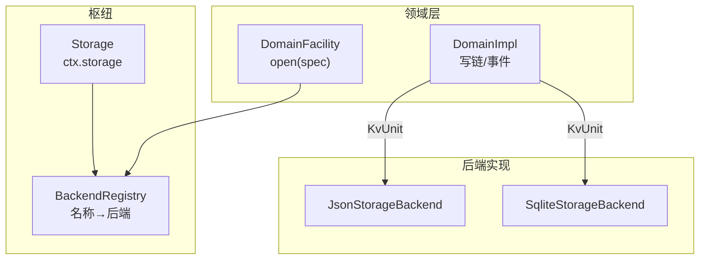
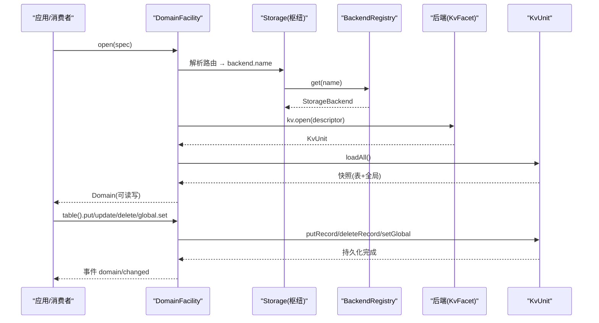
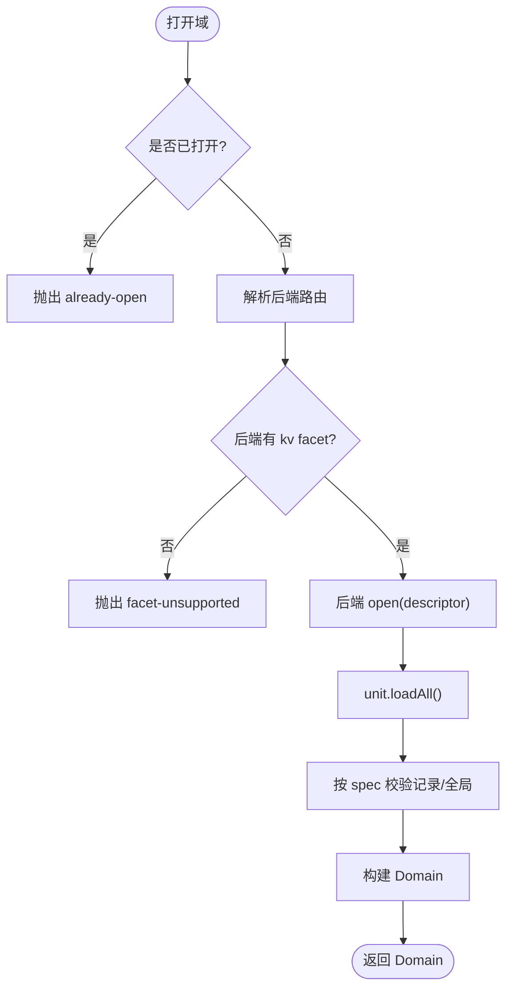
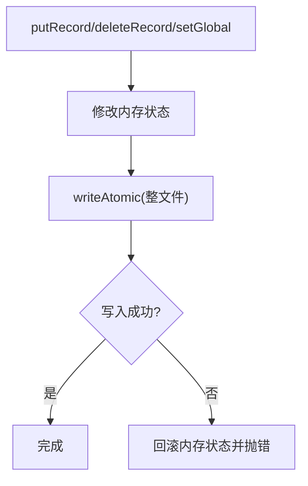
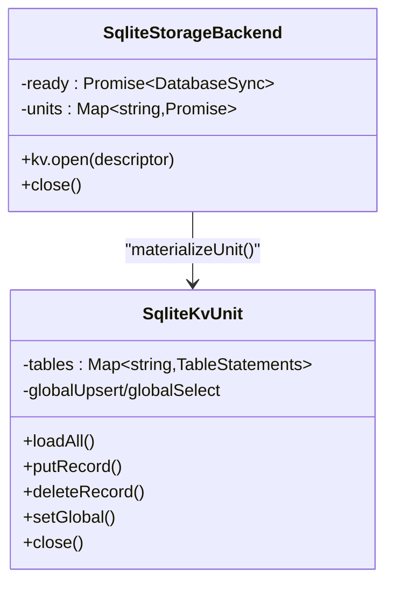
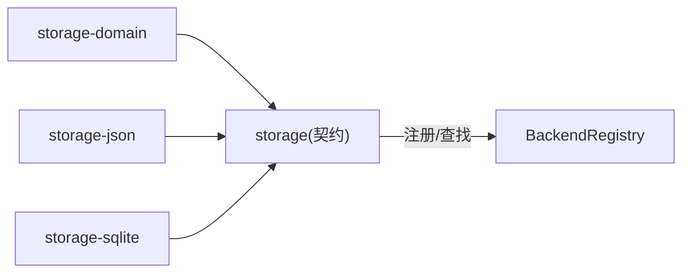

# 存储提供商

<cite>
**本文引用的文件**
- [packages/storage/storage/src/backend.ts](file://packages/storage/storage/src/backend.ts)
- [packages/storage/storage/src/index.ts](file://packages/storage/storage/src/index.ts)
- [packages/storage/storage/src/registry.ts](file://packages/storage/storage/src/registry.ts)
- [packages/storage/storage-domain/src/spec.ts](file://packages/storage/storage-domain/src/spec.ts)
- [packages/storage/storage-domain/src/domain.ts](file://packages/storage/storage-domain/src/domain.ts)
- [packages/storage/storage-domain/src/events.ts](file://packages/storage/storage-domain/src/events.ts)
- [packages/storage/storage-json/src/index.ts](file://packages/storage/storage-json/src/index.ts)
- [packages/storage/storage-json/src/unit.ts](file://packages/storage/storage-json/src/unit.ts)
- [packages/storage/storage-sqlite/src/index.ts](file://packages/storage/storage-sqlite/src/index.ts)
- [packages/storage/storage-sqlite/src/unit.ts](file://packages/storage/storage-sqlite/src/unit.ts)
- [docs/subsystems/storage.md](file://docs/subsystems/storage.md)
</cite>

## 目录
1. [简介](#简介)
2. [项目结构](#项目结构)
3. [核心组件](#核心组件)
4. [架构总览](#架构总览)
5. [详细组件分析](#详细组件分析)
6. [依赖关系分析](#依赖关系分析)
7. [性能与事务特性](#性能与事务特性)
8. [配置与集成示例](#配置与集成示例)
9. [数据迁移、备份与恢复](#数据迁移备份与恢复)
10. [故障转移策略](#故障转移策略)
11. [故障排查指南](#故障排查指南)
12. [结论](#结论)

## 简介
本文件面向希望扩展或实现自定义存储后端的开发者，系统性说明存储子系统的设计与契约：存储接口规范、数据序列化、域模型与事件、以及两种内置后端（JSON 文件与 SQLite）的实现要点。文档同时提供如何基于该契约集成 Redis、PostgreSQL、S3 等外部存储的路线建议，并给出数据迁移、备份恢复与故障转移的实践思路。

## 项目结构
存储子系统由“枢纽 + 领域层 + 后端实现”三层组成：
- 枢纽（storage）：注册后端、挂载数据形式（如 domain），不直接做 IO。
- 领域层（storage-domain）：定义域声明、打开域、写链、变更事件，消费端通过 typed API 操作。
- 后端实现（storage-json、storage-sqlite）：实现 KV 面，负责介质持久化。



图表来源
- [packages/storage/storage/src/index.ts:47-93](file://packages/storage/storage/src/index.ts#L47-L93)
- [packages/storage/storage/src/registry.ts:14-62](file://packages/storage/storage/src/registry.ts#L14-L62)
- [packages/storage/storage-domain/src/domain.ts:140-277](file://packages/storage/storage-domain/src/domain.ts#L140-L277)
- [packages/storage/storage-json/src/index.ts:37-86](file://packages/storage/storage-json/src/index.ts#L37-L86)
- [packages/storage/storage-sqlite/src/index.ts:55-150](file://packages/storage/storage-sqlite/src/index.ts#L55-L150)

章节来源
- [docs/subsystems/storage.md:1-10](file://docs/subsystems/storage.md#L1-L10)
- [packages/storage/storage/src/index.ts:1-99](file://packages/storage/storage/src/index.ts#L1-L99)

## 核心组件
- Storage 枢纽：提供后端注册表与数据形式挂载点；自身不做 IO。
- BackendRegistry：维护 name→backend 映射，支持重复注册保护与未找到错误。
- DomainSpec/defineDomain：声明域的标识、版本、全局槽与表结构，并在模块加载时校验。
- DomainFacility/DomainImpl：打开域、维护单写链、保证“先持久化再改内存再发事件”，并发安全。
- KvFacet/KvUnit：后端契约，抽象 loadAll/putRecord/deleteRecord/setGlobal/close。
- JSON 后端：每单元一个 JSON 文件，原子写入整文件。
- SQLite 后端：单库多单元，按表存储键值对，使用预编译语句。

章节来源
- [packages/storage/storage/src/backend.ts:17-104](file://packages/storage/storage/src/backend.ts#L17-L104)
- [packages/storage/storage/src/registry.ts:14-62](file://packages/storage/storage/src/registry.ts#L14-L62)
- [packages/storage/storage-domain/src/spec.ts:34-112](file://packages/storage/storage-domain/src/spec.ts#L34-L112)
- [packages/storage/storage-domain/src/domain.ts:96-277](file://packages/storage/storage-domain/src/domain.ts#L96-L277)
- [packages/storage/storage-json/src/index.ts:37-115](file://packages/storage/storage-json/src/index.ts#L37-L115)
- [packages/storage/storage-sqlite/src/index.ts:23-169](file://packages/storage/storage-sqlite/src/index.ts#L23-L169)

## 架构总览
存储子系统采用“契约 + 插件”模式：
- 契约在 storage 包中定义，所有后端必须实现 KvFacet。
- 领域层在 storage-domain 中封装业务语义、类型与一致性。
- 具体后端以 Cordis 插件形式注册到枢纽，消费者通过路由选择后端。



图表来源
- [packages/storage/storage-domain/src/domain.ts:140-277](file://packages/storage/storage-domain/src/domain.ts#L140-L277)
- [packages/storage/storage/src/registry.ts:14-62](file://packages/storage/storage/src/registry.ts#L14-L62)
- [packages/storage/storage/src/backend.ts:29-104](file://packages/storage/storage/src/backend.ts#L29-L104)

## 详细组件分析

### 存储后端契约（KvFacet / KvUnit）
- 命名约束：单元名与表名必须符合 UNIT_NAME_RE，既用于文件名也用于 SQL 标识符片段。
- 生命周期：open 返回 KvUnit；close 幂等，关闭后调用任何方法抛出 closed。
- 原子性与持久性：每个调用在介质上原子且已 resolve 即持久；并发写序由调用方保证（领域层为每域维护写链）。
- 全局槽：当 descriptor.hasGlobal 为真时才允许 setGlobal。

```mermaid
classDiagram
class StorageBackend {
+kv? : KvFacet
+close() Promise~void~
}
class KvFacet {
+open(descriptor) Promise~KvUnit~
}
class KvUnitDescriptor {
+name : string
+version : number
+tables : string[]
+hasGlobal : boolean
}
class KvUnit {
+loadAll() Promise~{tables,global}~
+putRecord(table,key,value) Promise~void~
+deleteRecord(table,key) Promise~void~
+setGlobal(value) Promise~void~
+close() Promise~void~
}
StorageBackend --> KvFacet : "可选"
KvFacet --> KvUnit : "open()"
KvFacet --> KvUnitDescriptor : "参数"
```

图表来源
- [packages/storage/storage/src/backend.ts:17-104](file://packages/storage/storage/src/backend.ts#L17-L104)

章节来源
- [packages/storage/storage/src/backend.ts:1-105](file://packages/storage/storage/src/backend.ts#L1-L105)

### 领域层：域声明与打开流程
- defineDomain：在模块加载时校验 name/version/tables/global schema，失败即抛错。
- descriptorOf：将 spec 投影为后端所需的 KvUnitDescriptor。
- DomainFacility.open：严格顺序——拒绝重复打开、解析后端、要求 kv facet、打开 unit、加载并校验记录、构造 Domain。
- DomainImpl：单写链串行化写操作；先持久化成功再更新内存，最后发出 domain/changed 事件；关闭时排空写链再释放 unit。



图表来源
- [packages/storage/storage-domain/src/spec.ts:67-112](file://packages/storage/storage-domain/src/spec.ts#L67-L112)
- [packages/storage/storage-domain/src/domain.ts:140-277](file://packages/storage/storage-domain/src/domain.ts#L140-L277)

章节来源
- [packages/storage/storage-domain/src/spec.ts:1-113](file://packages/storage/storage-domain/src/spec.ts#L1-L113)
- [packages/storage/storage-domain/src/domain.ts:1-358](file://packages/storage/storage-domain/src/domain.ts#L1-L358)

### JSON 后端实现要点
- 每单元一个 JSON 文件，位于配置的 root 下。
- 写入采用原子整文件重写，避免部分写入导致损坏。
- 打开时若文件不存在则视为空单元；首次写入时创建。
- 关闭时等待所有 in-flight 发布完成再释放。



图表来源
- [packages/storage/storage-json/src/unit.ts:69-107](file://packages/storage/storage-json/src/unit.ts#L69-L107)
- [packages/storage/storage-json/src/index.ts:63-86](file://packages/storage/storage-json/src/index.ts#L63-L86)

章节来源
- [packages/storage/storage-json/src/index.ts:1-115](file://packages/storage/storage-json/src/index.ts#L1-L115)
- [packages/storage/storage-json/src/unit.ts:1-142](file://packages/storage/storage-json/src/unit.ts#L1-L142)

### SQLite 后端实现要点
- 单数据库文件承载多个单元；每个单元的记录表独立存在。
- 使用预编译语句进行 upsert/delete/select，减少开销。
- 打开时检查 units 表的 version 戳，不匹配则拒绝。
- journal_mode 可配置，默认 WAL，适用于本地磁盘；网络文件系统可选择回滚日志模式。



图表来源
- [packages/storage/storage-sqlite/src/index.ts:55-150](file://packages/storage/storage-sqlite/src/index.ts#L55-L150)
- [packages/storage/storage-sqlite/src/unit.ts:27-157](file://packages/storage/storage-sqlite/src/unit.ts#L27-L157)

章节来源
- [packages/storage/storage-sqlite/src/index.ts:1-169](file://packages/storage/storage-sqlite/src/index.ts#L1-L169)
- [packages/storage/storage-sqlite/src/unit.ts:1-157](file://packages/storage/storage-sqlite/src/unit.ts#L1-L157)

## 依赖关系分析
- 领域层依赖 storage 契约（KvFacet/KvUnit），但不感知具体后端。
- JSON/SQLite 后端均依赖 storage 契约并通过 Cordis 插件注册到枢纽。
- 消费者通过 DomainFacility 打开域，再经由 KvTable 进行读写。



图表来源
- [packages/storage/storage/src/index.ts:47-93](file://packages/storage/storage/src/index.ts#L47-L93)
- [packages/storage/storage/src/registry.ts:14-62](file://packages/storage/storage/src/registry.ts#L14-L62)

章节来源
- [packages/storage/storage/src/index.ts:1-99](file://packages/storage/storage/src/index.ts#L1-L99)
- [packages/storage/storage/src/registry.ts:1-62](file://packages/storage/storage/src/registry.ts#L1-L62)

## 性能与事务特性
- 写串行化：DomainImpl 为每域维护单写链，确保同一域内写操作的顺序与一致性。
- 持久化优先：写操作先落盘，成功后才更新内存并发送事件，避免内存与介质不一致。
- 事件隔离：domain/changed 为通知型事件，监听器同步异常被捕获并记录，不影响已提交写。
- JSON 后端：整文件原子写入，适合小中型数据集；大并发写场景需评估 I/O 压力。
- SQLite 后端：预编译语句与行级存储，适合频繁更新的场景；WAL 提升并发读性能。

章节来源
- [packages/storage/storage-domain/src/domain.ts:140-277](file://packages/storage/storage-domain/src/domain.ts#L140-L277)
- [packages/storage/storage-json/src/unit.ts:1-142](file://packages/storage/storage-json/src/unit.ts#L1-L142)
- [packages/storage/storage-sqlite/src/index.ts:23-169](file://packages/storage/storage-sqlite/src/index.ts#L23-L169)

## 配置与集成示例

### 内置后端配置
- JSON 后端
  - 插件名：storage-json
  - 注入：storage
  - 配置项：root（必需，单位根目录）
  - 注册键：json
- SQLite 后端
  - 插件名：storage-sqlite
  - 注入：storage
  - 配置项：path（必需）、journalMode（可选，默认 wal）
  - 注册键：sqlite

章节来源
- [packages/storage/storage-json/src/index.ts:21-35](file://packages/storage/storage-json/src/index.ts#L21-L35)
- [packages/storage/storage-json/src/index.ts:99-115](file://packages/storage/storage-json/src/index.ts#L99-L115)
- [packages/storage/storage-sqlite/src/index.ts:23-48](file://packages/storage/storage-sqlite/src/index.ts#L23-L48)
- [packages/storage/storage-sqlite/src/index.ts:152-169](file://packages/storage/storage-sqlite/src/index.ts#L152-L169)

### 自定义后端接入步骤（通用）
- 实现 StorageBackend 接口，至少提供 kv facet。
- 在 apply(ctx, config) 中：
  - 创建后端实例
  - 通过 ctx.storage.backend.register('your-name', backend) 注册
  - 通过 ctx.provide(storageBackendServiceKey('your-name'), backend) 暴露生命周期服务
  - 在 effect  disposer 中先 unregister 再 close 后端
- 遵循 KvUnit 契约：
  - open(descriptor) 校验 name/version/tables/hasGlobal
  - loadAll 返回 tables 与 global
  - putRecord/deleteRecord/setGlobal 保证原子与持久化
  - close 幂等并清理资源

章节来源
- [packages/storage/storage/src/backend.ts:17-104](file://packages/storage/storage/src/backend.ts#L17-L104)
- [packages/storage/storage/src/index.ts:18-28](file://packages/storage/storage/src/index.ts#L18-L28)
- [packages/storage/storage-json/src/index.ts:99-115](file://packages/storage/storage-json/src/index.ts#L99-L115)
- [packages/storage/storage-sqlite/src/index.ts:152-169](file://packages/storage/storage-sqlite/src/index.ts#L152-L169)

### 集成 Redis（概念性方案）
- 设计 KvUnit：
  - loadAll：扫描 key 前缀并按表分组还原 records，读取全局槽。
  - putRecord/deleteRecord/setGlobal：使用 pipeline/事务批量执行，确保原子性。
  - close：断开连接并清理资源。
- 命名与版本：
  - 使用 UNIT_NAME_RE 约束 key 前缀，version 作为元数据 key。
- 事务：
  - 利用 Redis MULTI/EXEC 或 Lua 脚本保证原子性。
- 性能：
  - 高吞吐读/写场景适用；注意 key 空间与过期策略。

[本节为概念性指导，不直接对应仓库特定文件]

### 集成 PostgreSQL（概念性方案）
- 设计 KvUnit：
  - 每个单元一张表，字段 key TEXT PRIMARY KEY, value JSONB。
  - loadAll 查询全表；putRecord 使用 INSERT ... ON CONFLICT UPDATE；deleteRecord 使用 DELETE。
  - setGlobal 使用独立表或 JSONB 列。
- 事务：
  - 使用显式事务包裹多次写入以保证跨行原子性。
- 性能：
  - 适合复杂查询与强一致场景；索引优化 key 访问路径。

[本节为概念性指导，不直接对应仓库特定文件]

### 集成 S3（概念性方案）
- 设计 KvUnit：
  - 将 JSON 后端思想扩展到对象存储：每单元一个对象，putRecord 合并后原子覆盖对象。
  - 使用条件写入（如 If-Match/If-None-Match）或版本控制保障原子性。
- 性能：
  - 适合冷/温数据与跨地域复制；注意请求成本与延迟。

[本节为概念性指导，不直接对应仓库特定文件]

## 数据迁移、备份与恢复
- 版本管理：
  - 通过 DomainSpec.version 与后端介质上的版本戳进行兼容性检查；版本不匹配会拒绝打开。
- 迁移策略：
  - 升级版本时，先以旧版本打开，导出快照，再以新版本重建介质或在线迁移。
  - 对于 JSON 后端：原子替换文件；对于 SQLite：可在事务中迁移表结构并校验。
- 备份与恢复：
  - JSON：直接拷贝 .json 文件；建议在低峰期或锁定期间进行。
  - SQLite：使用 VACUUM 与一致性快照（如 fs 快照或数据库级备份工具）。
- 校验：
  - 恢复后通过 loadAll 与 spec schema 校验，确保数据完整性。

章节来源
- [packages/storage/storage-domain/src/spec.ts:67-112](file://packages/storage/storage-domain/src/spec.ts#L67-L112)
- [packages/storage/storage-json/src/unit.ts:24-45](file://packages/storage/storage-json/src/unit.ts#L24-L45)
- [packages/storage/storage-sqlite/src/index.ts:98-123](file://packages/storage/storage-sqlite/src/index.ts#L98-L123)

## 故障转移策略
- 多后端冗余：
  - 通过路由表将不同域路由到不同后端（例如热数据走 SQLite，归档走 JSON/S3）。
- 快速降级：
  - 主后端不可用时，切换到只读缓存或只读副本；写操作排队或拒绝并告警。
- 一致性：
  - 切换后重新加载快照，确保内存与介质一致；必要时触发增量同步。
- 监控与自愈：
  - 监听 domain/changed 与后端健康检查；自动重试与熔断。

[本节为概念性指导，不直接对应仓库特定文件]

## 故障排查指南
- 常见错误码与含义：
  - duplicate-backend：重复注册后端名。
  - backend-not-found：路由解析不到后端。
  - facet-unsupported：后端缺少 kv facet。
  - version-mismatch：介质版本与描述不符。
  - malformed-medium：介质无法解析为当前单元。
  - closed：后端或单元已关闭。
  - missing-key：update 目标键不存在。
  - invalid-record：记录不符合 spec schema。
- 定位步骤：
  - 检查后端是否已正确注册与注入。
  - 核对 DomainSpec 的 name/version/tables/global 是否与介质一致。
  - 查看 domain/changed 事件序列，确认写链顺序与事件内容。
  - 对 JSON 后端检查文件原子写入是否成功；对 SQLite 后端检查 journal_mode 与权限。

章节来源
- [packages/storage/storage/src/error.ts](file://packages/storage/storage/src/error.ts)
- [packages/storage/storage/src/registry.ts:25-53](file://packages/storage/storage/src/registry.ts#L25-L53)
- [packages/storage/storage-domain/src/domain.ts:231-277](file://packages/storage/storage-domain/src/domain.ts#L231-L277)
- [packages/storage/storage-json/src/unit.ts:119-142](file://packages/storage/storage-json/src/unit.ts#L119-L142)
- [packages/storage/storage-sqlite/src/unit.ts:86-97](file://packages/storage/storage-sqlite/src/unit.ts#L86-L97)

## 结论
存储子系统通过清晰的契约与领域层封装，实现了可插拔的后端能力与强一致的写模型。JSON 与 SQLite 两种内置后端覆盖了从简单到高频更新的典型场景。基于该契约，可平滑扩展至 Redis、PostgreSQL、S3 等外部存储，并通过版本管理、备份恢复与故障转移策略满足生产环境的可靠性需求。