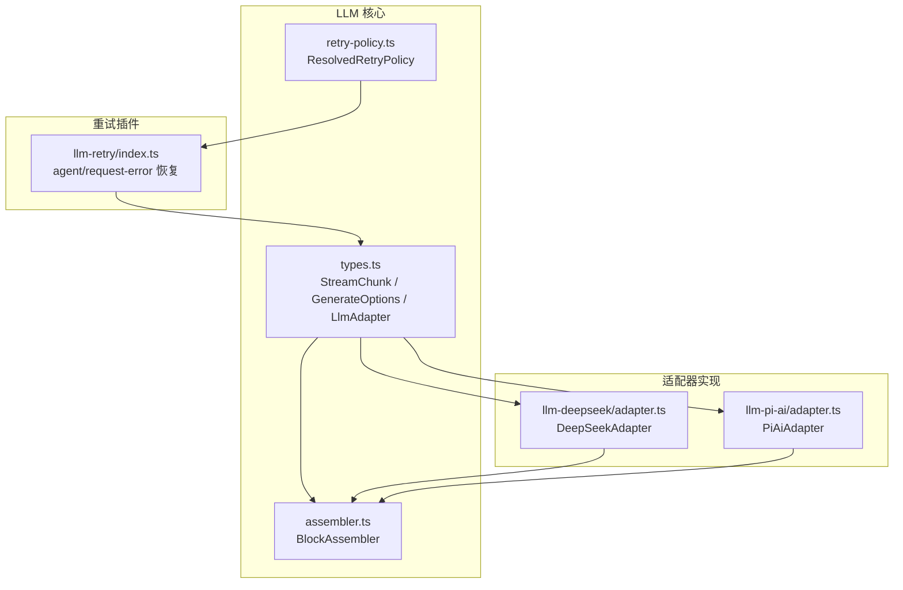
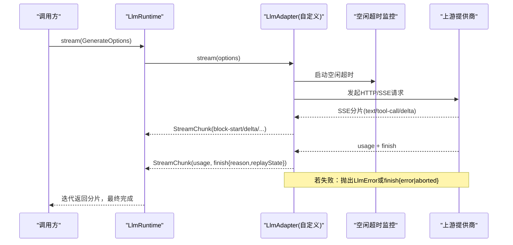
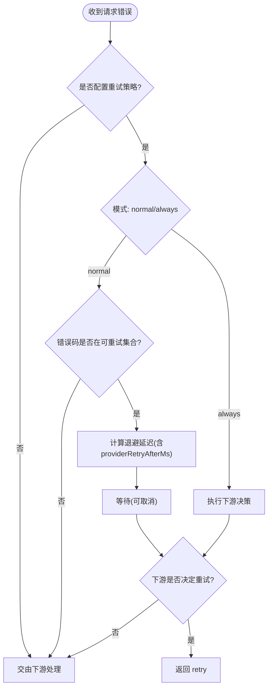
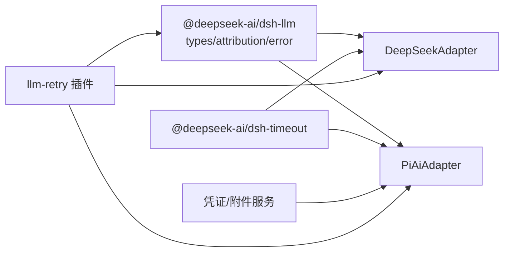

# 提供商扩展

<cite>
**本文引用的文件**
- [packages/llm/llm/src/types.ts](file://packages/llm/llm/src/types.ts)
- [packages/llm/llm/src/assembler.ts](file://packages/llm/llm/src/assembler.ts)
- [packages/llm/llm/src/retry-policy.ts](file://packages/llm/llm/src/retry-policy.ts)
- [packages/llm/llm-deepseek/src/adapter.ts](file://packages/llm/llm-deepseek/src/adapter.ts)
- [packages/llm/llm-pi-ai/src/adapter.ts](file://packages/llm/llm-pi-ai/src/adapter.ts)
- [packages/llm/llm-retry/src/index.ts](file://packages/llm/llm-retry/src/index.ts)
- [docs/cookbook/adding-an-llm-adapter.md](file://docs/cookbook/adding-an-llm-adapter.md)
- [docs/subsystems/llm-streaming.md](file://docs/subsystems/llm-streaming.md)
- [docs/user/guide/providers.md](file://docs/user/guide/providers.md)
</cite>

## 目录
1. [简介](#简介)
2. [项目结构](#项目结构)
3. [核心组件](#核心组件)
4. [架构总览](#架构总览)
5. [详细组件分析](#详细组件分析)
6. [依赖关系分析](#依赖关系分析)
7. [性能考量](#性能考量)
8. [故障排查指南](#故障排查指南)
9. [结论](#结论)
10. [附录：配置与环境变量](#附录：配置与环境变量)

## 简介
本文件面向希望为 DeepSeek Harness 新增 LLM 提供商的开发者，系统性说明如何基于统一的适配器接口实现新的模型提供方。内容涵盖：
- 适配器契约与协议约定（流式块、使用量、结束原因、错误路径）
- 连接管理与超时保护
- 流式响应处理与重试机制
- 提供商配置格式与环境变量
- 开发步骤与最佳实践
- 多个实际示例（DeepSeek/OpenAI 兼容、多提供商聚合、本地网关等）

## 项目结构
围绕 LLM 提供商扩展的核心代码分布在以下位置：
- 抽象类型与协议定义：packages/llm/llm/src/types.ts
- 流式组装器：packages/llm/llm/src/assembler.ts
- 重试策略定义：packages/llm/llm/src/retry-policy.ts
- 参考适配器实现：
  - DeepSeek 直连 HTTP+SSE：packages/llm/llm-deepseek/src/adapter.ts
  - 多提供商聚合（pi-ai SDK）：packages/llm/llm-pi-ai/src/adapter.ts
- 代理层重试插件：packages/llm/llm-retry/src/index.ts
- 用户配置指南：docs/user/guide/providers.md
- 适配器 cookbook：docs/cookbook/adding-an-llm-adapter.md
- 子系统文档（流式协议、适配器契约）：docs/subsystems/llm-streaming.md

图表来源
- [packages/llm/llm/src/types.ts:283-357](file://packages/llm/llm/src/types.ts#L283-L357)
- [packages/llm/llm/src/assembler.ts:266-308](file://packages/llm/llm/src/assembler.ts#L266-L308)
- [packages/llm/llm/src/retry-policy.ts:218-220](file://packages/llm/llm/src/retry-policy.ts#L218-L220)
- [packages/llm/llm-deepseek/src/adapter.ts:158-347](file://packages/llm/llm-deepseek/src/adapter.ts#L158-L347)
- [packages/llm/llm-pi-ai/src/adapter.ts:186-359](file://packages/llm/llm-pi-ai/src/adapter.ts#L186-L359)
- [packages/llm/llm-retry/src/index.ts:99-227](file://packages/llm/llm-retry/src/index.ts#L99-L227)

章节来源
- [docs/cookbook/adding-an-llm-adapter.md:1-44](file://docs/cookbook/adding-an-llm-adapter.md#L1-L44)
- [docs/subsystems/llm-streaming.md:154-316](file://docs/subsystems/llm-streaming.md#L154-L316)

## 核心组件
- 适配器契约 LlmAdapter：提供 providerInfo、listModels、resolveModel、stream 等方法；stream 必须严格遵循 StreamChunk 协议。
- 流式协议 StreamChunk：包含 block-start/text-delta/tool-call-delta/block-end/usage/finish 等事件，要求 usage 在 finish 之前，finish 之后不得再发送任何数据。
- BlockAssembler：将 StreamChunk 流折叠为完整的 ContentBlock、TokenUsage、FinishReason 以及 replayState。
- 重试策略 ResolvedRetryPolicy：normal 模式支持有限重试与可重试码集合；always 模式无上限重试；由具体提供商注册时决定。
- 重试插件 llm-retry：监听 agent/request-error，按策略进行退避与重试，并记录会话事件。

章节来源
- [packages/llm/llm/src/types.ts:283-357](file://packages/llm/llm/src/types.ts#L283-L357)
- [packages/llm/llm/src/assembler.ts:266-308](file://packages/llm/llm/src/assembler.ts#L266-L308)
- [packages/llm/llm/src/retry-policy.ts:218-220](file://packages/llm/llm/src/retry-policy.ts#L218-L220)
- [packages/llm/llm-retry/src/index.ts:99-227](file://packages/llm/llm-retry/src/index.ts#L99-L227)
- [docs/subsystems/llm-streaming.md:154-316](file://docs/subsystems/llm-streaming.md#L154-L316)

## 架构总览
下图展示了从调用方到适配器再到上游提供商的完整请求-响应流程，包括超时保护、流式分片、使用量统计与错误归一化。

图表来源
- [packages/llm/llm-deepseek/src/adapter.ts:214-347](file://packages/llm/llm-deepseek/src/adapter.ts#L214-L347)
- [packages/llm/llm-pi-ai/src/adapter.ts:276-359](file://packages/llm/llm-pi-ai/src/adapter.ts#L276-L359)
- [docs/subsystems/llm-streaming.md:154-316](file://docs/subsystems/llm-streaming.md#L154-L316)

## 详细组件分析

### 适配器契约与协议约定
- 必须实现的 stream 方法：接收 GenerateOptions，返回 AsyncIterable<StreamChunk>。
- 协议约束：
  - usage 必须在 finish 之前发出；finish 后不得再发送任何数据。
  - tool-call 的 arguments 始终为原始 JSON 字符串，增量通过 argumentsDelta 传递。
  - 两个合法错误路径：从 stream() 抛出 LlmError（传输/协议错误），或在流末尾以 finish {kind:'error'|'aborted', failure} 上报（提供商内联错误）。
  - 必须尊重 options.signal，并在不支持的能力上抛出 UNSUPPORTED。
  - 成功 finish 可携带 replayState 用于后续重放。
- 能力与元数据：
  - listModels 提供可选模型目录（仅建议性）。
  - resolveModel 返回精确模型的上下文窗口、默认 maxTokens、推理努力等级等。
  - providerRetryPolicy 返回该提供商的重试策略。

章节来源
- [docs/cookbook/adding-an-llm-adapter.md:25-39](file://docs/cookbook/adding-an-llm-adapter.md#L25-L39)
- [docs/subsystems/llm-streaming.md:154-316](file://docs/subsystems/llm-streaming.md#L154-L316)
- [packages/llm/llm/src/types.ts:283-357](file://packages/llm/llm/src/types.ts#L283-L357)

### 流式响应处理与 BlockAssembler
- BlockAssembler 负责将 StreamChunk 流折叠为：
  - 完整的 ContentBlock[]
  - TokenUsage
  - FinishReason
  - replayState
- 对只发 delta 的协议也具备容错能力，忽略已关闭块的重复 delta，防止内存膨胀。

章节来源
- [packages/llm/llm/src/assembler.ts:266-308](file://packages/llm/llm/src/assembler.ts#L266-L308)
- [docs/subsystems/llm-streaming.md:266-308](file://docs/subsystems/llm-streaming.md#L266-L308)

### 连接管理与超时保护
- 两种参考实现均使用空闲超时 watchdog：
  - DeepSeek 适配器：为每次流读取设置 idleWatchdog，超时映射为 TIMEOUT。
  - pi-ai 适配器：同样以 idleWatchdog 包裹流迭代，超时映射为 TIMEOUT。
- 统一信号管理：合并 caller 的 AbortSignal 与内部控制器信号，确保取消传播。

章节来源
- [packages/llm/llm-deepseek/src/adapter.ts:214-269](file://packages/llm/llm-deepseek/src/adapter.ts#L214-L269)
- [packages/llm/llm-pi-ai/src/adapter.ts:276-359](file://packages/llm/llm-pi-ai/src/adapter.ts#L276-L359)

### 错误重试机制
- 适配器职责：
  - 禁用底层库的自动重试，保证“一次适配器调用 = 一次提供商尝试”。
  - 将错误归一化为 LlmFailure（含稳定 code、status、providerRetryAfterMs、requestId）。
- 重试插件职责：
  - 监听 agent/request-error，根据 ResolvedRetryPolicy 决定是否重试。
  - normal 模式：有限次重试，支持可重试码集合；always 模式：无限重试。
  - 支持 provider 指定的 Retry-After 延迟，结合指数退避与抖动。
  - 记录会话事件 llm/retry、llm/retry-started，便于追踪。

图表来源
- [packages/llm/llm-retry/src/index.ts:99-227](file://packages/llm/llm-retry/src/index.ts#L99-L227)
- [docs/subsystems/llm-streaming.md:218-220](file://docs/subsystems/llm-streaming.md#L218-L220)

章节来源
- [packages/llm/llm-retry/src/index.ts:99-227](file://packages/llm/llm-retry/src/index.ts#L99-L227)
- [docs/subsystems/llm-streaming.md:204-220](file://docs/subsystems/llm-streaming.md#L204-L220)

### 认证处理与请求构建
- 认证：
  - DeepSeek 适配器通过 per-request 解析 apiKey，避免跨请求混用密钥与端点。
  - pi-ai 适配器通过配置快照与 per-call 解析 apiKey，SDK 最高优先级覆盖。
- 请求头：
  - 必须附加 attributionHeaders()（User-Agent 基线）。
  - 可附加 session 标识、用途标记等。
- 请求体：
  - 将 GenerateOptions 序列化为提供商特定格式（如 OpenAI 兼容 chat-completions）。

章节来源
- [packages/llm/llm-deepseek/src/adapter.ts:271-347](file://packages/llm/llm-deepseek/src/adapter.ts#L271-L347)
- [packages/llm/llm-pi-ai/src/adapter.ts:171-179](file://packages/llm/llm-pi-ai/src/adapter.ts#L171-L179)
- [docs/subsystems/llm-streaming.md:222-242](file://docs/subsystems/llm-streaming.md#L222-L242)

### 响应解析与使用量统计
- 流式解析：
  - DeepSeek：SSE 分片 -> translate -> StreamChunk。
  - pi-ai：SDK 事件 -> toStreamChunks -> StreamChunk。
- 使用量：
  - 每个调用产出 TokenUsage，inputTokens/cacheReadTokens/cacheWriteTokens/outputTokens 互斥计数。
  - 某些提供商将缓存命中折叠进 prompt_tokens，需减去以避免重复计费。

章节来源
- [packages/llm/llm-deepseek/src/adapter.ts:321-347](file://packages/llm/llm-deepseek/src/adapter.ts#L321-L347)
- [packages/llm/llm-pi-ai/src/adapter.ts:313-324](file://packages/llm/llm-pi-ai/src/adapter.ts#L313-L324)
- [docs/subsystems/llm-streaming.md:244-264](file://docs/subsystems/llm-streaming.md#L244-L264)

### 性能监控与指标
- 使用量统计：TokenUsage 作为每调用计量基础。
- 超时与中断：idleWatchdog 暴露 TIMEOUT，AbortSignal 暴露 ABORTED。
- 诊断信息：LlmFailure 中的 requestId、status、providerRetryAfterMs 有助于定位问题。
- 会话事件：llm/retry、llm/retry-started 等事件可用于审计与可视化。

章节来源
- [packages/llm/llm-retry/src/index.ts:150-153](file://packages/llm/llm-retry/src/index.ts#L150-L153)
- [packages/llm/llm-deepseek/src/adapter.ts:246-269](file://packages/llm/llm-deepseek/src/adapter.ts#L246-L269)
- [packages/llm/llm-pi-ai/src/adapter.ts:346-359](file://packages/llm/llm-pi-ai/src/adapter.ts#L346-L359)

## 依赖关系分析
- 适配器依赖：
  - 抽象类型与工具：@deepseek-ai/dsh-llm（types、attributionHeaders、LlmError、ReasoningEffortId 等）
  - 超时与信号：@deepseek-ai/dsh-timeout（idleWatchdog、timeoutOf）
  - 凭证与会话：CredentialRef、AnonymousUserId、AttachmentStore（按需）
- 重试插件依赖：
  - Cordis 事件：ctx.on('agent/request-error')
  - 会话事件：session.append('llm/retry*')
  - 重试策略：ResolvedRetryPolicy

图表来源
- [packages/llm/llm-deepseek/src/adapter.ts:11-27](file://packages/llm/llm-deepseek/src/adapter.ts#L11-L27)
- [packages/llm/llm-pi-ai/src/adapter.ts:24-54](file://packages/llm/llm-pi-ai/src/adapter.ts#L24-L54)
- [packages/llm/llm-retry/src/index.ts:8-18](file://packages/llm/llm-retry/src/index.ts#L8-L18)

章节来源
- [packages/llm/llm-deepseek/src/adapter.ts:11-27](file://packages/llm/llm-deepseek/src/adapter.ts#L11-L27)
- [packages/llm/llm-pi-ai/src/adapter.ts:24-54](file://packages/llm/llm-pi-ai/src/adapter.ts#L24-L54)
- [packages/llm/llm-retry/src/index.ts:8-18](file://packages/llm/llm-retry/src/index.ts#L8-L18)

## 性能考量
- 流式处理优先：尽量以增量方式消费 StreamChunk，减少内存占用。
- 超时保护：合理设置 streamIdleTimeoutMs，避免长连接挂起。
- 重试策略：
  - normal 模式适合大多数场景，限制最大重试次数。
  - always 模式适用于幂等且可恢复的请求，但需谨慎使用。
- 使用量统计：准确拆分 inputTokens 与缓存命中，避免重复计费。
- 头部与元数据：最小化请求头体积，避免敏感信息泄露。

[本节为通用指导，不直接分析具体文件]

## 故障排查指南
- 常见错误码与含义：
  - AUTH/INVALID_REQUEST/RATE_LIMIT/SERVER：HTTP 状态映射的稳定错误码。
  - CONTEXT_WINDOW_EXCEEDED：上下文溢出，消费者应路由处理。
  - EMPTY_RESPONSE：空完成视为可重试错误。
  - TRANSPORT/TIMEOUT/ABORTED：传输失败、空闲超时、调用方中止。
- 排查步骤：
  - 检查 providerRetryAfterMs 与 Retry-After 头，确认退避时间。
  - 查看 requestId 与 status，定位上游提供商侧问题。
  - 确认 attributionHeaders 是否正确附加。
  - 验证模型能力（如图像输入）与配置一致性。
- 日志与事件：
  - 关注 llm/retry、llm/retry-started 事件，确认重试行为。
  - 使用 BlockAssembler 输出 assembled message 与 usage，核对结果。

章节来源
- [packages/llm/llm-deepseek/src/adapter.ts:138-149](file://packages/llm/llm-deepseek/src/adapter.ts#L138-L149)
- [docs/subsystems/llm-streaming.md:204-220](file://docs/subsystems/llm-streaming.md#L204-L220)
- [packages/llm/llm-retry/src/index.ts:150-153](file://packages/llm/llm-retry/src/index.ts#L150-L153)

## 结论
通过统一的 LlmAdapter 契约与 StreamChunk 协议，DeepSeek Harness 提供了可扩展、可观测、可重试的 LLM 提供商接入机制。参考实现（DeepSeek 直连与 pi-ai 聚合）展示了不同集成方式的共性要点：严格的协议遵守、健壮的错误归一化、合理的超时与重试策略、以及完善的元数据与使用量统计。按照本文档的步骤与规范，开发者可以高效地接入新的 LLM 提供商，并确保在生产环境中的稳定性与可维护性。

[本节为总结，不直接分析具体文件]

## 附录：配置与环境变量
- 提供商配置入口：
  - Web UI 设置 → 模型页面，添加提供商与模型。
  - 自定义提供商表单：Provider ID、显示名、baseURL、API 协议、凭据、模型列表。
- 环境变量与凭据：
  - API Key 存储于凭据文件，settings.yaml 中仅保留引用。
  - 可通过环境变量注入密钥（如 GATEWAY_API_KEY）。
- 模型能力声明：
  - 自定义提供商可为模型声明 input: [text, image] 以启用图像输入。
  - 未声明的模型默认文本-only。
- 高级配置：
  - 参考插件配置目录获取所有支持字段与默认值。
  - 推理努力等级、超时、WebSocket 连接超时等可按提供商配置。

章节来源
- [docs/user/guide/providers.md:1-99](file://docs/user/guide/providers.md#L1-L99)