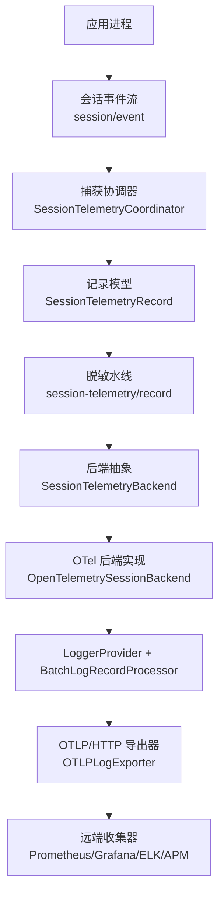
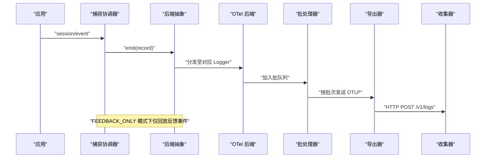
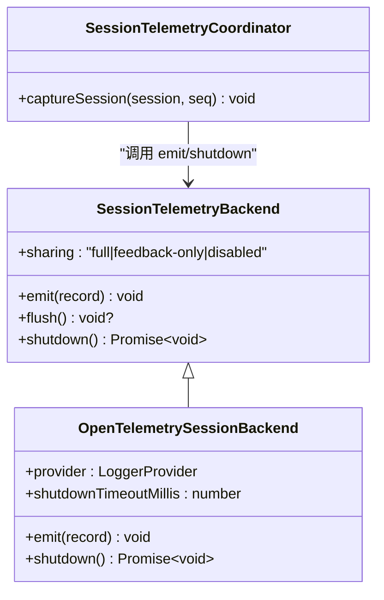
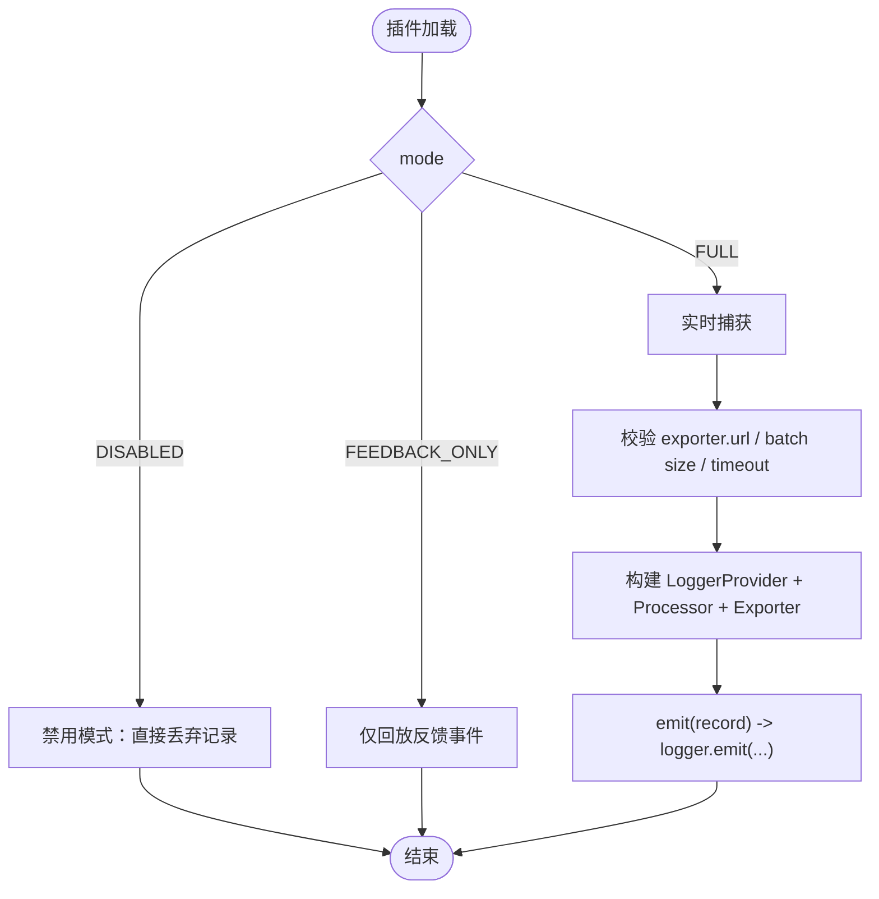
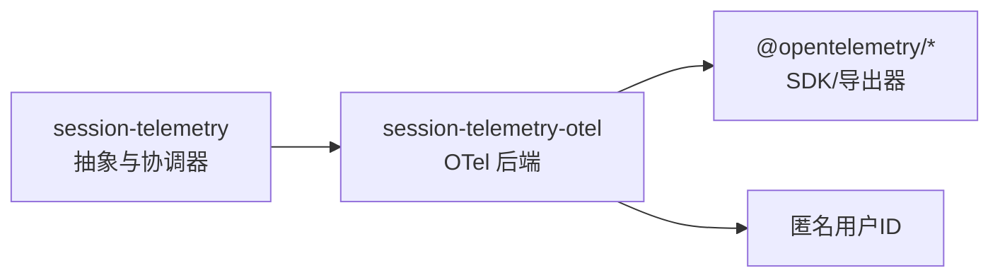

# 监控提供商

<cite>
**本文引用的文件**
- [packages/session/session-telemetry/src/index.ts](file://packages/session/session-telemetry/src/index.ts)
- [packages/session/session-telemetry-otel/src/index.ts](file://packages/session/session-telemetry-otel/src/index.ts)
- [docs/subsystems/session-telemetry.md](file://docs/subsystems/session-telemetry.md)
- [apps/web/tests/assembled-boot.ts](file://apps/web/tests/assembled-boot.ts)
- [examples/headless-agent/tests/fixtures/session-telemetry-otel.cordis.yml](file://examples/headless-agent/tests/fixtures/session-telemetry-otel.cordis.yml)
- [packages/session/session-telemetry-otel/tests/otel.spec.ts](file://packages/session/session-telemetry-otel/tests/otel.spec.ts)
</cite>

## 目录
1. [简介](#简介)
2. [项目结构](#项目结构)
3. [核心组件](#核心组件)
4. [架构总览](#架构总览)
5. [详细组件分析](#详细组件分析)
6. [依赖关系分析](#依赖关系分析)
7. [性能考量](#性能考量)
8. [故障排查指南](#故障排查指南)
9. [结论](#结论)
10. [附录](#附录)

## 简介
本文件面向“监控提供商扩展”的完整实现与集成，聚焦于会话级遥测能力：如何以可插拔的后端方式接入第三方监控系统（如基于 OpenTelemetry 的 OTLP 日志导出），并支持指标采集、日志记录、性能追踪与告警机制。文档同时覆盖数据采样策略、隐私保护与性能影响分析，并提供在 Harness 中启用和配置遥测后端的示例路径。

## 项目结构
遥测能力由“服务定义（捕获侧）+ 服务提供者（上报侧）”组成：
- 服务定义位于 session-telemetry 包，负责捕获点、记录模型、重放游标、脱敏水线以及后端最小契约。
- 服务提供者位于 session-telemetry-otel 包，基于 OpenTelemetry JS SDK 将记录通过 OTLP/HTTP 导出到远端收集器。
- 文档子系统对契约、共享披露与事件进行说明。
- 测试与示例展示了如何在 Web 启动流程或 Headless 配置中挂载 OTel 后端。

图表来源
- [packages/session/session-telemetry/src/index.ts:148-176](file://packages/session/session-telemetry/src/index.ts#L148-L176)
- [packages/session/session-telemetry-otel/src/index.ts:147-253](file://packages/session/session-telemetry-otel/src/index.ts#L147-L253)
- [docs/subsystems/session-telemetry.md:1-122](file://docs/subsystems/session-telemetry.md#L1-L122)

章节来源
- [packages/session/session-telemetry/src/index.ts:1-179](file://packages/session/session-telemetry/src/index.ts#L1-L179)
- [packages/session/session-telemetry-otel/src/index.ts:1-302](file://packages/session/session-telemetry-otel/src/index.ts#L1-L302)
- [docs/subsystems/session-telemetry.md:1-195](file://docs/subsystems/session-telemetry.md#L1-L195)

## 核心组件
- 会话遥测记录模型
  - channel：区分“账本（ledger）”与“运维信号（ops）”。
  - time：Unix 毫秒时间戳。
  - severity：info/warn/error，已在捕获阶段预映射，便于零配置告警。
  - attributes：最小化身份属性（如 session.id、event.type、event.seq 等）。
  - body：完整的负载副本，不修改。
- 后端契约
  - emit：非阻塞入队，禁止阻塞热路径。
  - flush：可选提示，多数后端交由 SDK 批处理节奏控制。
  - shutdown：等待管道静默，超时保护。
- 共享披露
  - sharing：full / feedback-only / disabled，用于向用户界面披露当前策略。
- 脱敏水线
  - session-telemetry/record：在记录到达后端前进行转换/过滤，默认无规则即透传；抛出则丢弃该条记录（fail-closed）。

章节来源
- [packages/session/session-telemetry/src/index.ts:47-131](file://packages/session/session-telemetry/src/index.ts#L47-L131)
- [docs/subsystems/session-telemetry.md:9-122](file://docs/subsystems/session-telemetry.md#L9-L122)

## 架构总览
下图展示从会话事件到远端收集器的端到端流程，包括模式选择、资源标识、批处理与导出。

图表来源
- [packages/session/session-telemetry-otel/src/index.ts:147-253](file://packages/session/session-telemetry-otel/src/index.ts#L147-L253)
- [docs/subsystems/session-telemetry.md:57-122](file://docs/subsystems/session-telemetry.md#L57-L122)

## 详细组件分析

### 后端抽象与会话协调器
- 职责边界
  - 捕获侧（session-telemetry）：决定“捕获什么、何时捕获、如何投影”，不包含批处理/重试/丢失策略。
  - 上报侧（session-telemetry-otel）：使用 OTel SDK 完成批处理、重试、队列与丢失策略。
- 关键行为
  - 首次采用时根据会话构造边界进行回放，避免重复计费与重复计数。
  - 对 ops 记录（如 agent-error、shutdown）不携带 seq 类身份，允许重复。
  - 提供 session-telemetry/record 水线用于脱敏/改写。

图表来源
- [packages/session/session-telemetry/src/index.ts:148-176](file://packages/session/session-telemetry/src/index.ts#L148-L176)
- [packages/session/session-telemetry-otel/src/index.ts:147-253](file://packages/session/session-telemetry-otel/src/index.ts#L147-L253)

章节来源
- [packages/session/session-telemetry/src/index.ts:1-179](file://packages/session/session-telemetry/src/index.ts#L1-L179)
- [docs/subsystems/session-telemetry.md:1-195](file://docs/subsystems/session-telemetry.md#L1-L195)

### OTel 后端实现
- 模式与共享披露
  - FULL：全量实时捕获。
  - FEEDBACK_ONLY：仅回放反馈事件（需用户同意）。
  - DISABLED：本地保留，不上传。
- 配置校验
  - exporter.url 必填且为 http(s)。
  - processor.maxExportBatchSize 必须为正整数。
  - shutdownTimeoutMillis 必须为有限正数且不超 Node 定时器上限。
- 资源与标识
  - service.name/version 来自应用标识。
  - user.id 使用匿名用户 ID，随资源批量携带。
- 导出管线
  - LoggerProvider + BatchLogRecordProcessor + OTLPLogExporter。
  - 两个 scope：业务日志与运维日志分离。
- 关闭流程
  - 外层 deadline 保护 provider.shutdown，避免网络挂起导致 hang。

图表来源
- [packages/session/session-telemetry-otel/src/index.ts:57-128](file://packages/session/session-telemetry-otel/src/index.ts#L57-L128)
- [packages/session/session-telemetry-otel/src/index.ts:156-253](file://packages/session/session-telemetry-otel/src/index.ts#L156-L253)
- [packages/session/session-telemetry-otel/src/index.ts:283-298](file://packages/session/session-telemetry-otel/src/index.ts#L283-L298)

章节来源
- [packages/session/session-telemetry-otel/src/index.ts:1-302](file://packages/session/session-telemetry-otel/src/index.ts#L1-L302)

### 集成示例与启用方式
- Web 测试装配中注入 OTel 后端
  - 通过 Context 插件机制挂载 OpenTelemetrySessionBackend，并传入 mode 与 exporter.url。
- Headless 配置示例
  - 在 cordis 配置中指定 exporter.url 等参数，以便在无头环境中启用遥测。
- 测试验证
  - 使用内存 HTTP 服务器模拟 OTLP 接收端，断言记录结构与字段。

章节来源
- [apps/web/tests/assembled-boot.ts:46-46](file://apps/web/tests/assembled-boot.ts#L46-L46)
- [examples/headless-agent/tests/fixtures/session-telemetry-otel.cordis.yml:30-30](file://examples/headless-agent/tests/fixtures/session-telemetry-otel.cordis.yml#L30-L30)
- [packages/session/session-telemetry-otel/tests/otel.spec.ts:68-119](file://packages/session/session-telemetry-otel/tests/otel.spec.ts#L68-L119)

### 支持的监控系统与集成方式
- 通过 OTLP/HTTP 日志导出，可对接任意支持 OTLP 的收集器与下游系统：
  - Prometheus + Grafana：可通过 OTLP 接收器将日志/指标导入，再在 Grafana 中可视化。
  - ELK Stack：Elasticsearch 配合 OTLP 接收器或 Logstash/Beats 消费 OTLP 日志。
  - APM 工具：如 Jaeger、OpenSearch、Datadog、New Relic 等支持 OTLP 的平台。
- 集成要点
  - 确保 exporter.url 指向正确的 OTLP 端点。
  - 合理设置 processor 参数（批大小、延迟）以平衡吞吐与延迟。
  - 利用资源属性（service.name/version/user.id）做维度聚合与权限隔离。

[本节为概念性说明，不直接分析具体文件]

### 指标采集、日志记录、性能追踪与告警
- 日志记录
  - 所有会话事件镜像为日志记录，channel=ledger；agent-error、shutdown 等为 ops 记录。
  - 通过 severity 预映射，可在下游零配置告警。
- 指标采集
  - 可将会话事件转换为指标（例如请求数、错误率、耗时分布），由下游平台完成聚合。
- 性能追踪
  - 借助 OTLP 的 trace/span 能力（若后端启用），结合 session.id、turn、step 等属性关联链路。
- 告警机制
  - 基于 error 级别与关键字段（如 agent-error）触发告警；也可基于自定义属性阈值。

章节来源
- [docs/subsystems/session-telemetry.md:9-57](file://docs/subsystems/session-telemetry.md#L9-L57)
- [packages/session/session-telemetry/src/index.ts:47-87](file://packages/session/session-telemetry/src/index.ts#L47-L87)

### 数据采样、隐私保护与性能影响
- 数据采样
  - 捕获阶段仅传输每个 turn/step 的首个 assistant/chunk，其余在捕获层丢弃，减少带宽与存储压力。
  - 对于其他事件类型，完整透传。
- 隐私保护
  - 使用匿名 user.id 作为资源属性，避免直接暴露用户身份。
  - 提供 session-telemetry/record 水线，部署方可按需脱敏或丢弃敏感字段。
- 性能影响
  - emit 必须非阻塞；批处理与导出由 SDK 管理。
  - 关闭流程带超时保护，防止网络异常导致进程挂起。
  - 建议根据负载调整 maxExportBatchSize 与 scheduledDelayMillis。

章节来源
- [docs/subsystems/session-telemetry.md:57-122](file://docs/subsystems/session-telemetry.md#L57-L122)
- [packages/session/session-telemetry-otel/src/index.ts:197-218](file://packages/session/session-telemetry-otel/src/index.ts#L197-L218)
- [packages/session/session-telemetry-otel/src/index.ts:283-298](file://packages/session/session-telemetry-otel/src/index.ts#L283-L298)

## 依赖关系分析
- 内部依赖
  - OTel 后端依赖 session-telemetry 提供的抽象与服务注册键。
  - 协调器依赖上下文事件总线订阅 session/event。
- 外部依赖
  - OpenTelemetry SDK（日志、资源、导出器）。
  - 可选匿名用户 ID 模块用于资源标识。
- 耦合与内聚
  - 捕获与上报解耦，便于替换后端或关闭遥测。
  - 配置项集中在 OTel 后端，保持契约稳定。

图表来源
- [packages/session/session-telemetry/src/index.ts:148-176](file://packages/session/session-telemetry/src/index.ts#L148-L176)
- [packages/session/session-telemetry-otel/src/index.ts:147-253](file://packages/session/session-telemetry-otel/src/index.ts#L147-L253)

章节来源
- [packages/session/session-telemetry/src/index.ts:1-179](file://packages/session/session-telemetry/src/index.ts#L1-L179)
- [packages/session/session-telemetry-otel/src/index.ts:1-302](file://packages/session/session-telemetry-otel/src/index.ts#L1-L302)

## 性能考量
- 批处理与延迟
  - 通过 processor 参数控制批大小与调度延迟，平衡吞吐与延迟。
- 关闭超时
  - shutdownTimeoutMillis 限制 provider 完全关闭的时间，避免长时间阻塞。
- 热路径安全
  - emit 为非阻塞入队；任何异常被协调器包裹，不影响主循环。
- 网络与重试
  - 由 OTel SDK 负责重试与丢包策略；部署侧关注导出端点可用性与限流。

[本节提供通用指导，不直接分析具体文件]

## 故障排查指南
- 常见配置问题
  - exporter.url 缺失或协议非法：会在插件加载时报错。
  - maxExportBatchSize 非正整数：加载期拒绝。
  - shutdownTimeoutMillis 非法：加载期拒绝。
- 运行时问题
  - 网络不可达：导出失败由 SDK 重试；检查代理/防火墙。
  - 进程退出卡住：确认未超过 shutdownTimeoutMillis；必要时调大超时。
- 数据问题
  - 记录丢失：最佳努力交付，可能因崩溃/重载丢失；下游需去重。
  - 重复记录：SDK 重试可能导致重复；下游需去重。
- 隐私与合规
  - 如需进一步脱敏，挂载 session-telemetry/record 监听器进行改写或丢弃。

章节来源
- [packages/session/session-telemetry-otel/src/index.ts:170-195](file://packages/session/session-telemetry-otel/src/index.ts#L170-L195)
- [packages/session/session-telemetry-otel/src/index.ts:283-298](file://packages/session/session-telemetry-otel/src/index.ts#L283-L298)
- [docs/subsystems/session-telemetry.md:124-195](file://docs/subsystems/session-telemetry.md#L124-L195)

## 结论
Harness 的会话遥测通过清晰的“捕获-上报”分层设计，提供了可插拔的监控提供商能力。基于 OpenTelemetry 的 OTel 后端实现了标准化的 OTLP/HTTP 导出，能够无缝对接 Prometheus/Grafana、ELK 及各类 APM 平台。通过数据采样、匿名化与脱敏水线，兼顾了隐私与性能。部署方只需正确配置 exporter 与 processor 参数，即可快速获得高质量的会话级观测能力。

[本节为总结性内容，不直接分析具体文件]

## 附录
- 快速启用清单
  - 在应用启动时挂载 OpenTelemetrySessionBackend。
  - 配置 exporter.url 为有效的 OTLP 端点。
  - 根据需要调整 processor 参数与 shutdownTimeoutMillis。
  - 如需更细粒度脱敏，挂载 session-telemetry/record 监听器。
- 参考路径
  - Web 装配示例：[apps/web/tests/assembled-boot.ts](file://apps/web/tests/assembled-boot.ts)
  - Headless 配置示例：[examples/headless-agent/tests/fixtures/session-telemetry-otel.cordis.yml](file://examples/headless-agent/tests/fixtures/session-telemetry-otel.cordis.yml)
  - 单元测试验证：[packages/session/session-telemetry-otel/tests/otel.spec.ts](file://packages/session/session-telemetry-otel/tests/otel.spec.ts)

[本节为补充信息，不直接分析具体文件]