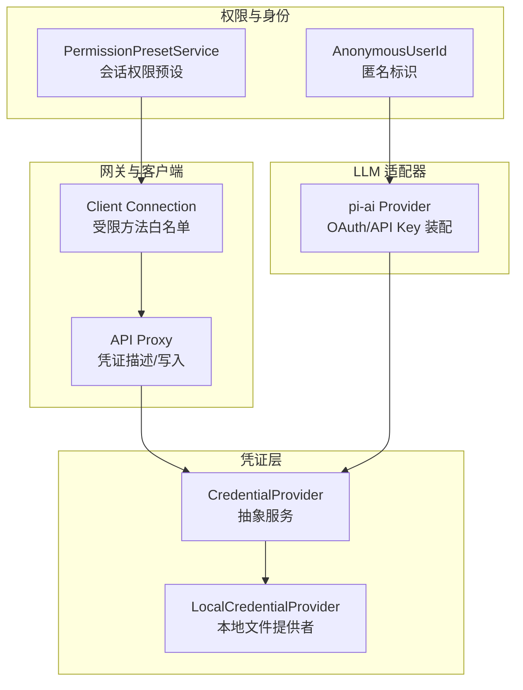
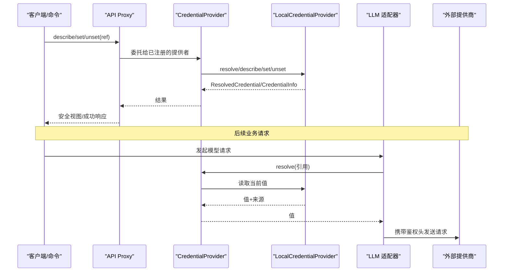
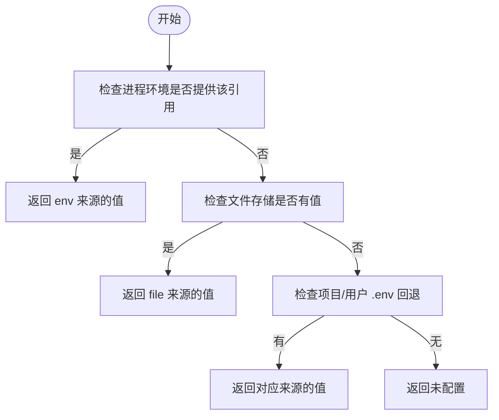
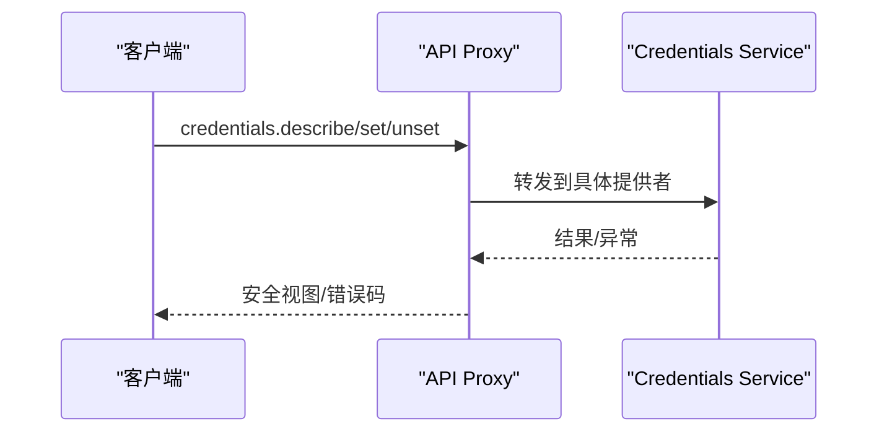
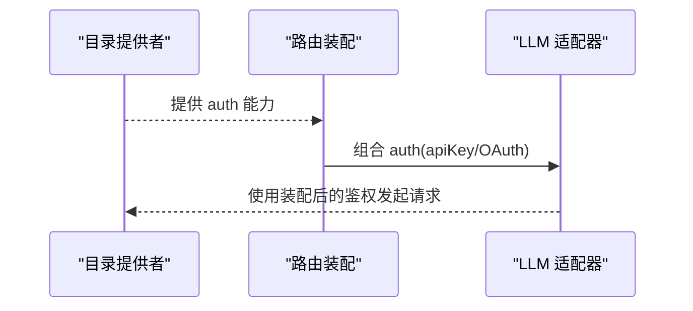
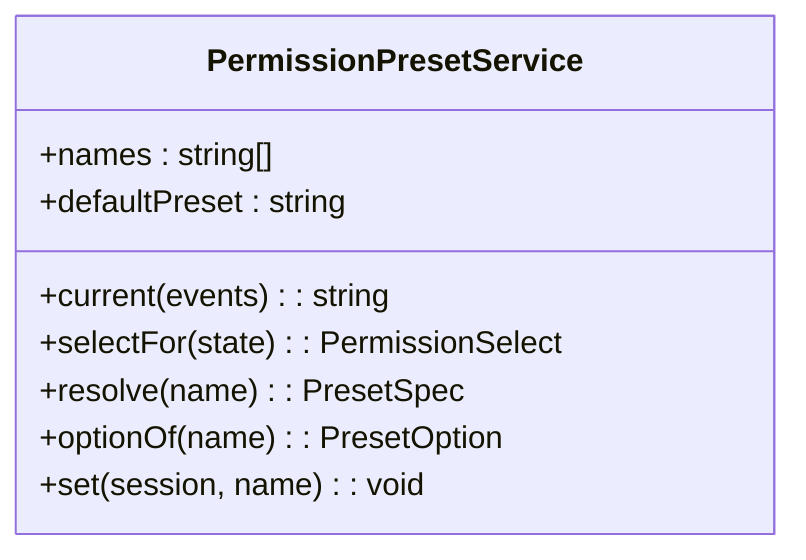
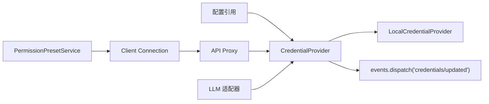

# 认证提供商

<cite>
**本文引用的文件**
- [packages/credentials/credentials/src/index.ts](file://packages/credentials/credentials/src/index.ts)
- [packages/credentials/credentials-local/src/index.ts](file://packages/credentials/credentials-local/src/index.ts)
- [docs/subsystems/credentials.md](file://docs/subsystems/credentials.md)
- [packages/host/apiproxy/src/api-proxy.ts](file://packages/host/apiproxy/src/api-proxy.ts)
- [packages/client/connection/src/index.ts](file://packages/client/connection/src/index.ts)
- [packages/web/AGENTS.md](file://packages/web/AGENTS.md)
- [packages/llm/llm-pi-ai/src/provider.ts](file://packages/llm/llm-pi-ai/src/provider.ts)
- [packages/identity/anonymous-user-id/src/index.ts](file://packages/identity/anonymous-user-id/src/index.ts)
- [packages/interaction/permission-presets/src/index.ts](file://packages/interaction/permission-presets/src/index.ts)
</cite>

## 目录
1. [简介](#简介)
2. [项目结构](#项目结构)
3. [核心组件](#核心组件)
4. [架构总览](#架构总览)
5. [详细组件分析](#详细组件分析)
6. [依赖关系分析](#依赖关系分析)
7. [性能考虑](#性能考虑)
8. [故障排查指南](#故障排查指南)
9. [结论](#结论)
10. [附录](#附录)

## 简介
本文件面向希望扩展或集成认证能力的开发者，围绕“认证接口规范、令牌管理、会话处理与权限控制”提供系统化说明。仓库采用“能力缝（seam）+ 提供者实现”的解耦设计：配置仅携带引用而非密钥，消费端在每次操作边界解析引用；本地文件提供者负责热更新与持久化；Web 网关暴露安全的只读视图与写入通道；权限系统通过预设将沙箱模式与审批策略绑定到会话。

基于仓库现有实现，支持的认证方式包括：
- API Key：通过凭证缝以环境变量名引用，按请求解析并注入到 HTTP 头。
- OAuth：由 LLM 适配器侧声明支持，并在路由层为无 API Key 的提供者补充适配方法。
- JWT/LDAP：仓库未内置专用提供者；可通过自定义凭证提供者或外部身份网关桥接实现。

## 项目结构
与认证相关的关键位置如下：
- 凭证抽象与事件：packages/credentials/credentials/src/index.ts
- 本地文件凭证提供者（热更新、层级覆盖、安全校验）：packages/credentials/credentials-local/src/index.ts
- 子系统文档（语义与契约）：docs/subsystems/credentials.md
- Web 网关对凭证的只读描述与写入封装：packages/host/apiproxy/src/api-proxy.ts
- 客户端连接面（受限方法白名单）：packages/client/connection/src/index.ts
- Web 安全策略（禁止重定向）：packages/web/AGENTS.md
- LLM 适配器中 OAuth/API Key 的路由级鉴权装配：packages/llm/llm-pi-ai/src/provider.ts
- 匿名用户标识（遥测/反馈关联）：packages/identity/anonymous-user-id/src/index.ts
- 权限预设与服务（会话级权限与审批）：packages/interaction/permission-presets/src/index.ts

图表来源
- [packages/credentials/credentials/src/index.ts:60-146](file://packages/credentials/credentials/src/index.ts#L60-L146)
- [packages/credentials/credentials-local/src/index.ts:207-497](file://packages/credentials/credentials-local/src/index.ts#L207-L497)
- [packages/host/apiproxy/src/api-proxy.ts:3321-3368](file://packages/host/apiproxy/src/api-proxy.ts#L3321-L3368)
- [packages/client/connection/src/index.ts:69-91](file://packages/client/connection/src/index.ts#L69-L91)
- [packages/llm/llm-pi-ai/src/provider.ts:109-135](file://packages/llm/llm-pi-ai/src/provider.ts#L109-L135)
- [packages/interaction/permission-presets/src/index.ts:159-434](file://packages/interaction/permission-presets/src/index.ts#L159-L434)
- [packages/identity/anonymous-user-id/src/index.ts:1-101](file://packages/identity/anonymous-user-id/src/index.ts#L1-L101)

章节来源
- [packages/credentials/credentials/src/index.ts:60-146](file://packages/credentials/credentials/src/index.ts#L60-L146)
- [packages/credentials/credentials-local/src/index.ts:207-497](file://packages/credentials/credentials-local/src/index.ts#L207-L497)
- [docs/subsystems/credentials.md:1-134](file://docs/subsystems/credentials.md#L1-L134)

## 核心组件
- 凭证抽象（CredentialProvider）
  - 职责：定义 resolve/describe/set/unset 四个操作，统一“空值即未配置”的语义；提供 credentials/updated 事件广播。
  - 关键点：每次调用 resolve 都重新解析，避免跨操作缓存导致密钥过期问题。
- 本地文件凭证提供者（LocalCredentialProvider）
  - 职责：以 $DSH_HOME/.credentials.yaml 为主存储，叠加进程环境、项目 .env、用户 .env 等只读层；支持文件监听热更新、原子写入、权限校验。
  - 关键点：继承环境最高优先级且不可写；文件层可写且保留注释格式；对外部编辑进行增量通知。
- API 代理（API Proxy）
  - 职责：将 ctx.credentials 暴露为受控 RPC（describe/set/unset），屏蔽内部实现细节，返回 UI 安全信息。
- 客户端连接面（Client Connection）
  - 职责：限制敏感方法仅在回环/可信主机可用，防止匿名调用者探测配置与凭据状态。
- LLM 适配器（pi-ai Provider）
  - 职责：为目录中的提供者装配鉴权；当提供者仅支持 OAuth 时，为其补充 API Key 适配方法以兼容显式 key 覆盖。
- 权限预设（PermissionPresetService）
  - 职责：将沙箱模式与审批策略打包为“预设”，写入会话事件，形成可投影的权限视图。
- 匿名用户标识（AnonymousUserId）
  - 职责：生成并持久化每 harness home 的匿名 UUID，用于遥测与反馈关联。

章节来源
- [packages/credentials/credentials/src/index.ts:60-146](file://packages/credentials/credentials/src/index.ts#L60-L146)
- [packages/credentials/credentials-local/src/index.ts:207-497](file://packages/credentials/credentials-local/src/index.ts#L207-L497)
- [packages/host/apiproxy/src/api-proxy.ts:3321-3368](file://packages/host/apiproxy/src/api-proxy.ts#L3321-L3368)
- [packages/client/connection/src/index.ts:69-91](file://packages/client/connection/src/index.ts#L69-L91)
- [packages/llm/llm-pi-ai/src/provider.ts:109-135](file://packages/llm/llm-pi-ai/src/provider.ts#L109-L135)
- [packages/interaction/permission-presets/src/index.ts:159-434](file://packages/interaction/permission-presets/src/index.ts#L159-L434)
- [packages/identity/anonymous-user-id/src/index.ts:1-101](file://packages/identity/anonymous-user-id/src/index.ts#L1-L101)

## 架构总览
下图展示从配置引用到请求鉴权的完整链路：配置仅包含环境变量名；运行时由凭证提供者解析；LLM 适配器在发起请求前组装鉴权头；Web 网关提供安全的凭证描述与写入入口；权限预设影响会话执行上下文。

图表来源
- [packages/host/apiproxy/src/api-proxy.ts:3321-3368](file://packages/host/apiproxy/src/api-proxy.ts#L3321-L3368)
- [packages/credentials/credentials/src/index.ts:60-146](file://packages/credentials/credentials/src/index.ts#L60-L146)
- [packages/credentials/credentials-local/src/index.ts:309-342](file://packages/credentials/credentials-local/src/index.ts#L309-L342)
- [packages/llm/llm-pi-ai/src/provider.ts:109-135](file://packages/llm/llm-pi-ai/src/provider.ts#L109-L135)

## 详细组件分析

### 凭证抽象与本地提供者
- 抽象类 CredentialProvider
  - 方法：resolve、describe、set、unset；事件：credentials/updated。
  - 约束：空值视为未配置；消费者不得跨操作缓存。
- 本地提供者 LocalCredentialProvider
  - 层级：进程环境（只读、最高优先）> 文件（可写、主存储）> 项目/用户 .env（只读）。
  - 特性：文件监听热更新、原子写入、权限位检查（仅所有者可读）、错误容忍（重载失败保留上次快照）。
  - 关键流程：队列化写操作、冲突检测（被环境覆盖则拒绝写入）、变更通知。

图表来源
- [packages/credentials/credentials-local/src/index.ts:309-342](file://packages/credentials/credentials-local/src/index.ts#L309-L342)

章节来源
- [packages/credentials/credentials/src/index.ts:60-146](file://packages/credentials/credentials/src/index.ts#L60-L146)
- [packages/credentials/credentials-local/src/index.ts:207-497](file://packages/credentials/credentials-local/src/index.ts#L207-L497)
- [docs/subsystems/credentials.md:1-134](file://docs/subsystems/credentials.md#L1-L134)

### API 代理与客户端连接面
- API Proxy
  - 暴露 credentials.describe/set/unset，屏蔽内部实现，返回 UI 安全信息（configured/source/writable）。
  - 错误映射：将底层异常包装为 credential-rejected。
- 客户端连接面
  - 将 settings/credentials 等敏感方法限制在回环/可信主机，防止匿名探测。

图表来源
- [packages/host/apiproxy/src/api-proxy.ts:3321-3368](file://packages/host/apiproxy/src/api-proxy.ts#L3321-L3368)
- [packages/client/connection/src/index.ts:69-91](file://packages/client/connection/src/index.ts#L69-L91)

章节来源
- [packages/host/apiproxy/src/api-proxy.ts:3321-3368](file://packages/host/apiproxy/src/api-proxy.ts#L3321-L3368)
- [packages/client/connection/src/index.ts:69-91](file://packages/client/connection/src/index.ts#L69-L91)

### LLM 适配器鉴权装配（OAuth 与 API Key）
- pi-ai Provider
  - 为目录中的提供者装配鉴权；若提供者仅支持 OAuth，则为其补充 API Key 适配方法以兼容显式 key 覆盖。
  - 保证“无配置时诚实拒绝”，不伪造已配置状态。

图表来源
- [packages/llm/llm-pi-ai/src/provider.ts:109-135](file://packages/llm/llm-pi-ai/src/provider.ts#L109-L135)

章节来源
- [packages/llm/llm-pi-ai/src/provider.ts:109-135](file://packages/llm/llm-pi-ai/src/provider.ts#L109-L135)

### 权限预设与会话控制
- PermissionPresetService
  - 将 sandbox 模式与 approval 策略打包为预设；写入会话事件，形成可投影的权限视图。
  - 新会话创建时补齐缺失的权限事实；/permission 命令作为唯一写入路径。

图表来源
- [packages/interaction/permission-presets/src/index.ts:159-434](file://packages/interaction/permission-presets/src/index.ts#L159-L434)

章节来源
- [packages/interaction/permission-presets/src/index.ts:159-434](file://packages/interaction/permission-presets/src/index.ts#L159-L434)

### 匿名用户标识
- AnonymousUserId
  - 生成并持久化每 harness home 的随机 UUID，用于遥测与反馈关联；删除后下次启动重置。

章节来源
- [packages/identity/anonymous-user-id/src/index.ts:1-101](file://packages/identity/anonymous-user-id/src/index.ts#L1-L101)

## 依赖关系分析
- 松耦合：配置仅持有引用，消费端按需解析；提供者可替换（如未来增加数据库/密钥管理服务）。
- 事件驱动：凭证变更后通过 events 通知，UI 可刷新“已配置”状态。
- 安全边界：客户端连接面限制敏感方法；Web 层禁止重定向以避免凭证泄露。

图表来源
- [packages/credentials/credentials/src/index.ts:104-142](file://packages/credentials/credentials/src/index.ts#L104-L142)
- [packages/host/apiproxy/src/api-proxy.ts:3321-3368](file://packages/host/apiproxy/src/api-proxy.ts#L3321-L3368)
- [packages/client/connection/src/index.ts:69-91](file://packages/client/connection/src/index.ts#L69-L91)
- [packages/llm/llm-pi-ai/src/provider.ts:109-135](file://packages/llm/llm-pi-ai/src/provider.ts#L109-L135)
- [packages/interaction/permission-presets/src/index.ts:159-434](file://packages/interaction/permission-presets/src/index.ts#L159-L434)

章节来源
- [packages/credentials/credentials/src/index.ts:104-142](file://packages/credentials/credentials/src/index.ts#L104-L142)
- [packages/host/apiproxy/src/api-proxy.ts:3321-3368](file://packages/host/apiproxy/src/api-proxy.ts#L3321-L3368)
- [packages/client/connection/src/index.ts:69-91](file://packages/client/connection/src/index.ts#L69-L91)
- [packages/llm/llm-pi-ai/src/provider.ts:109-135](file://packages/llm/llm-pi-ai/src/provider.ts#L109-L135)
- [packages/interaction/permission-presets/src/index.ts:159-434](file://packages/interaction/permission-presets/src/index.ts#L159-L434)

## 性能考虑
- 凭证解析：按操作解析，避免缓存导致的过期问题；本地提供者维护内存快照，减少磁盘 IO。
- 文件监听：chokidar 监听文件变化，去抖合并写入，避免频繁重载。
- 原子写入：使用原子写与文件锁，确保并发安全与一致性。
- 权限投影：会话事件折叠为轻量状态，查询高效。

[本节为通用指导，无需特定文件来源]

## 故障排查指南
- 凭证未生效
  - 检查进程环境是否覆盖了文件存储（继承环境只读且最高优先）。
  - 确认文件权限位正确（仅所有者可读），否则会被拒绝加载。
- 写入被拒绝
  - 若引用由进程环境提供，set/unset 将被拒绝；需修改启动环境。
- 热更新无效
  - 检查文件监听是否正常；重载失败会保留上次快照并记录警告。
- 客户端无法访问
  - 确认调用来自回环或可信主机；敏感方法在白名单内。
- 重定向风险
  - Web 层禁止跟随重定向，避免凭证泄露；确保 HTTP 客户端配置符合策略。

章节来源
- [packages/credentials/credentials-local/src/index.ts:103-122](file://packages/credentials/credentials-local/src/index.ts#L103-L122)
- [packages/credentials/credentials-local/src/index.ts:405-417](file://packages/credentials/credentials-local/src/index.ts#L405-L417)
- [packages/credentials/credentials-local/src/index.ts:447-456](file://packages/credentials/credentials-local/src/index.ts#L447-L456)
- [packages/client/connection/src/index.ts:69-91](file://packages/client/connection/src/index.ts#L69-L91)
- [packages/web/AGENTS.md:1-6](file://packages/web/AGENTS.md#L1-L6)

## 结论
本仓库通过“凭证缝 + 本地提供者 + 网关封装 + 权限预设”的组合，提供了可扩展、安全、可观测的认证与授权基础能力。API Key 与 OAuth 已在 LLM 适配器层得到良好支持；JWT/LDAP 可通过自定义凭证提供者或外部网关桥接实现。建议在生产环境中严格遵循最小权限原则、启用热更新与审计日志，并结合权限预设控制会话行为。

[本节为总结性内容，无需特定文件来源]

## 附录

### 支持的认证方式与配置要点
- API Key
  - 在配置中以环境变量名引用；运行时由凭证提供者解析并注入到请求头。
  - 参考路径：凭证抽象与本地提供者实现。
- OAuth
  - 由 LLM 适配器声明支持；当提供者仅支持 OAuth 时，路由层会补充 API Key 适配方法以兼容显式 key。
  - 参考路径：pi-ai Provider 的鉴权装配逻辑。
- JWT/LDAP
  - 仓库未内置专用提供者；可通过自定义凭证提供者对接企业 LDAP 或 JWT 签发服务，并在 LLM 适配器中按协议注入令牌。
  - 建议结合权限预设与审批策略，限制敏感操作范围。

章节来源
- [packages/credentials/credentials/src/index.ts:60-146](file://packages/credentials/credentials/src/index.ts#L60-L146)
- [packages/credentials/credentials-local/src/index.ts:207-497](file://packages/credentials/credentials-local/src/index.ts#L207-L497)
- [packages/llm/llm-pi-ai/src/provider.ts:109-135](file://packages/llm/llm-pi-ai/src/provider.ts#L109-L135)

### 安全最佳实践
- 始终按操作解析凭证，避免跨操作缓存。
- 文件存储保持最小权限（仅所有者可读），并使用原子写入。
- 客户端连接面限制敏感方法至回环/可信主机。
- Web 层禁止重定向，防止凭证泄露。
- 使用权限预设限制执行上下文，必要时启用审批策略。

章节来源
- [packages/credentials/credentials-local/src/index.ts:103-122](file://packages/credentials/credentials-local/src/index.ts#L103-L122)
- [packages/client/connection/src/index.ts:69-91](file://packages/client/connection/src/index.ts#L69-L91)
- [packages/web/AGENTS.md:1-6](file://packages/web/AGENTS.md#L1-L6)
- [packages/interaction/permission-presets/src/index.ts:159-434](file://packages/interaction/permission-presets/src/index.ts#L159-L434)

### 令牌刷新与用户状态同步
- 令牌刷新
  - 通过凭证提供者热更新实现：修改文件后，监听器触发重载，下一次请求即可获取新值。
  - 对于外部 OAuth/JWT，可在适配器层实现刷新逻辑，并将新令牌写回凭证提供者。
- 用户状态同步
  - 使用权限预设将沙箱模式与审批策略写入会话事件，形成可投影的状态；UI 可实时反映当前选择。
  - 匿名用户标识可用于跨系统关联，但不代表已认证账户。

章节来源
- [packages/credentials/credentials-local/src/index.ts:265-307](file://packages/credentials/credentials-local/src/index.ts#L265-L307)
- [packages/llm/llm-pi-ai/src/provider.ts:109-135](file://packages/llm/llm-pi-ai/src/provider.ts#L109-L135)
- [packages/interaction/permission-presets/src/index.ts:220-277](file://packages/interaction/permission-presets/src/index.ts#L220-L277)
- [packages/identity/anonymous-user-id/src/index.ts:1-101](file://packages/identity/anonymous-user-id/src/index.ts#L1-L101)