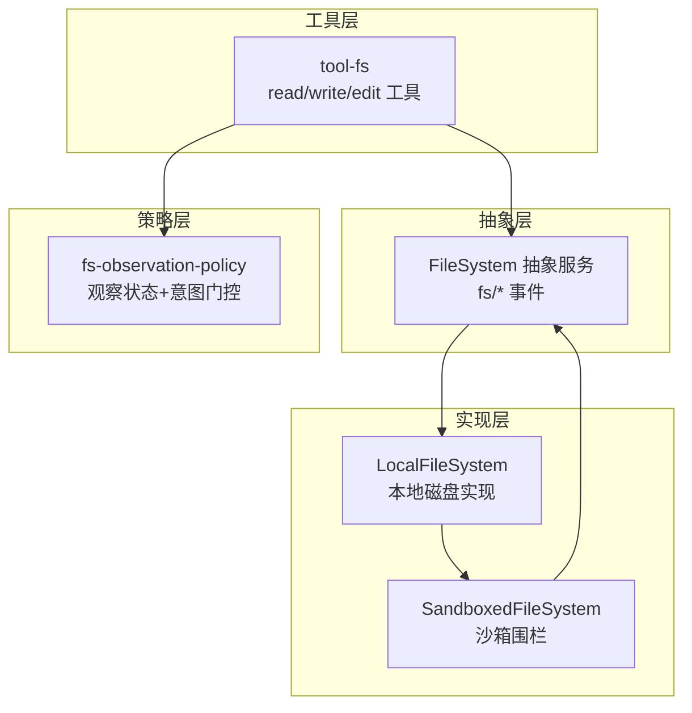
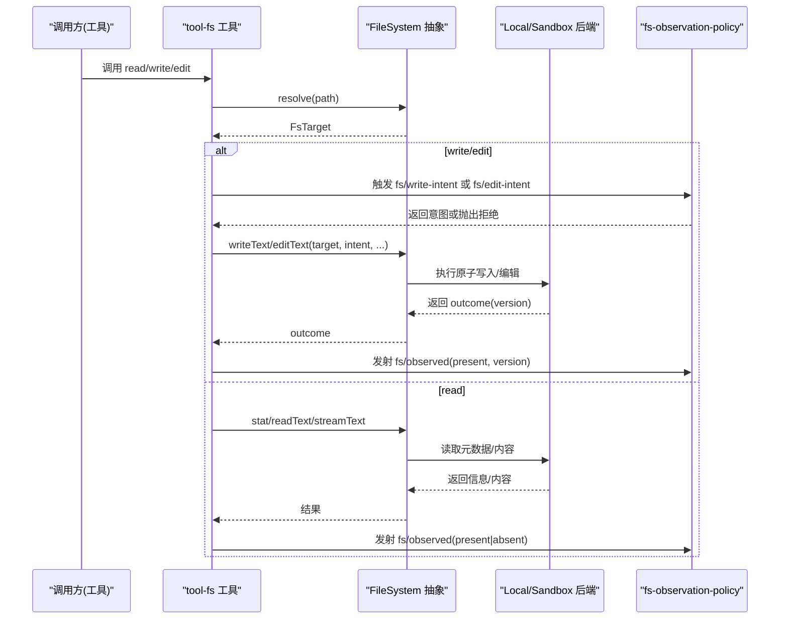
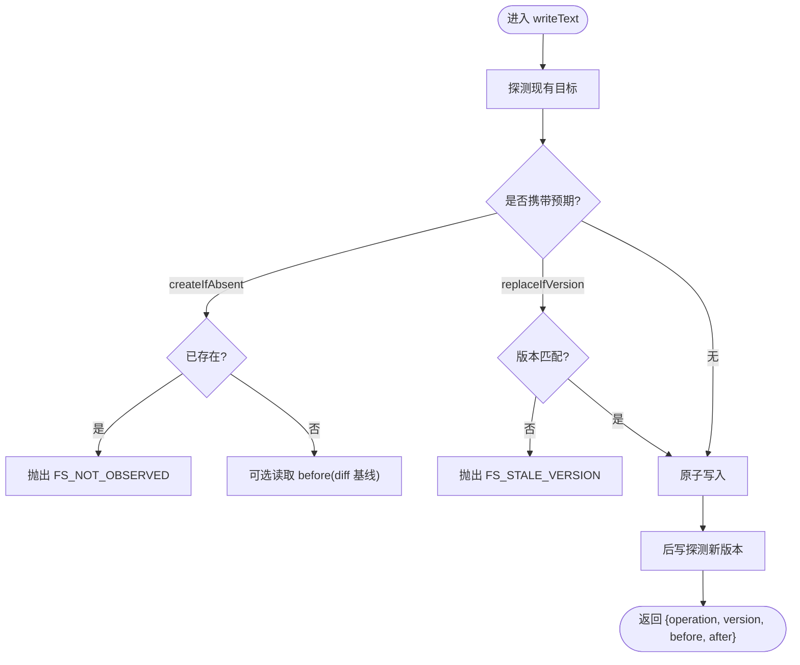
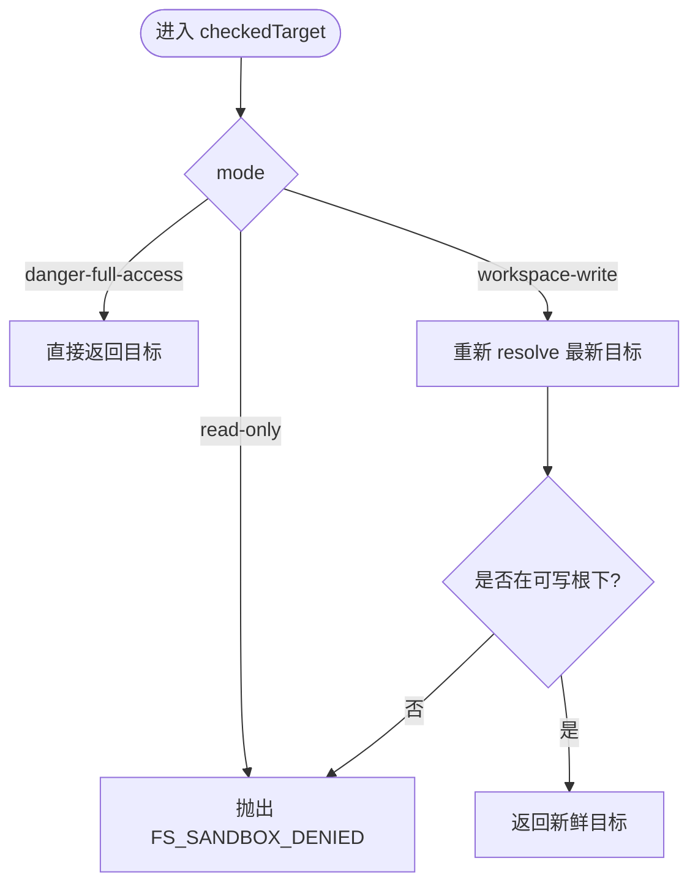
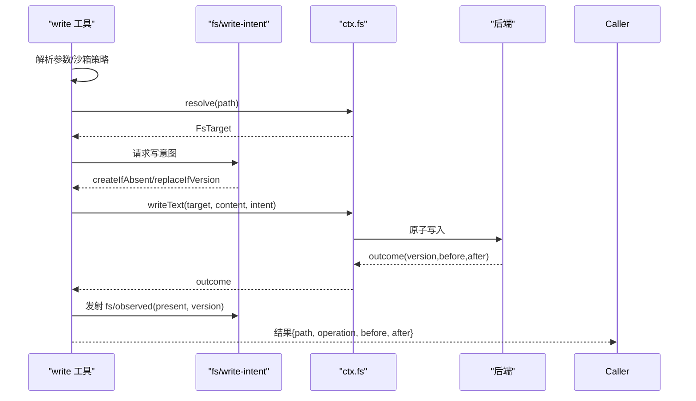
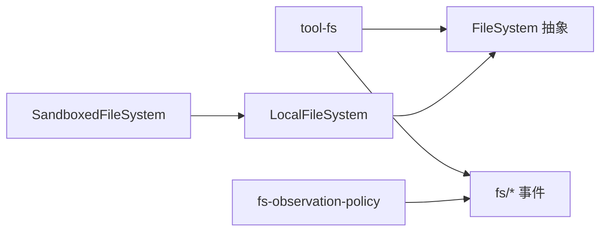

# 文件系统扩展

<cite>
**本文引用的文件**
- [filesystem.md](file://docs/subsystems/filesystem.md)
- [index.ts（抽象服务）](file://packages/fs/fs/src/index.ts)
- [index.ts（本地实现）](file://packages/fs/fs-local/src/index.ts)
- [index.ts（观察策略插件）](file://packages/fs/fs-observation-policy/src/index.ts)
- [index.ts（工具集入口）](file://packages/fs/tool-fs/src/index.ts)
- [write.ts（写工具）](file://packages/fs/tool-fs/src/write.ts)
- [edit.ts（编辑工具）](file://packages/fs/tool-fs/src/edit.ts)
- [index.ts（沙箱实现）](file://packages/fs/fs-sandbox/src/index.ts)
- [fs.cordis.yml（示例覆盖）](file://examples/acp-agent/fs.cordis.yml)
</cite>

## 目录
1. [简介](#简介)
2. [项目结构](#项目结构)
3. [核心组件](#核心组件)
4. [架构总览](#架构总览)
5. [详细组件分析](#详细组件分析)
6. [依赖关系分析](#依赖关系分析)
7. [性能与限制](#性能与限制)
8. [故障排查指南](#故障排查指南)
9. [结论](#结论)
10. [附录：扩展新存储后端指南](#附录：扩展新存储后端指南)

## 简介
本文件面向 DeepSeek Harness 的文件系统扩展机制，聚焦以下目标：
- 文件系统访问控制：路径限制、权限检查、操作审计。
- 虚拟文件系统原理：抽象服务定义、本地/沙箱/远程后端可插拔。
- 安全策略配置：读写权限控制、路径白名单、文件大小限制。
- 扩展开发示例：如何实现受控的文件操作与远程文件访问。

## 项目结构
文件系统能力由多个包协作构成，职责清晰、边界明确：
- 抽象服务定义：提供统一的 FileSystem 接口与 fs/* 事件契约。
- 本地实现：基于宿主文件系统的具体实现。
- 沙箱实现：在本地实现之上增加每调用策略的写入围栏。
- 观察策略插件：通过事件门控实现“读前写/改”和版本守卫。
- 模型侧工具：read/write/edit/read_image 等工具注册与执行编排。
- 搜索工具：glob/grep 等发现能力（非 provider 方法）。



图表来源
- [index.ts（抽象服务）:86-250](file://packages/fs/fs/src/index.ts#L86-L250)
- [index.ts（本地实现）:64-262](file://packages/fs/fs-local/src/index.ts#L64-L262)
- [index.ts（沙箱实现）:59-148](file://packages/fs/fs-sandbox/src/index.ts#L59-L148)
- [index.ts（工具集入口）:54-79](file://packages/fs/tool-fs/src/index.ts#L54-L79)
- [index.ts（观察策略插件）:106-130](file://packages/fs/fs-observation-policy/src/index.ts#L106-L130)

章节来源
- [README（fs 家族）:1-24](file://packages/fs/README.md#L1-L24)
- [filesystem.md:1-496](file://docs/subsystems/filesystem.md#L1-L496)

## 核心组件
- FileSystem 抽象服务：定义 resolve/processPath/fileUrl/contains/stat/lstat/readText/streamText/readBytes/listDir/writeText/editText 以及 fs/* 事件契约。
- LocalFileSystem：基于真实文件系统实现上述接口，提供原子写入、行尾归一化、并发锁、diff 基线大小限制等。
- SandboxedFileSystem：继承本地实现，对 write/edit 增加 per-call 策略围栏（只读/工作区写入/危险全开），拒绝非法路径并抛出 FS_SANDBOX_DENIED。
- fs-observation-policy：通过 fs/write-intent、fs/edit-intent、fs/observed 三个事件实现“读前写/改”和版本守卫；维护按会话隔离的观察状态。
- tool-fs：注册 read/write/edit/read_image 工具，负责参数校验、读取窗口、结果渲染、策略事件派发与错误修复。

章节来源
- [index.ts（抽象服务）:86-250](file://packages/fs/fs/src/index.ts#L86-L250)
- [index.ts（本地实现）:64-262](file://packages/fs/fs-local/src/index.ts#L64-L262)
- [index.ts（沙箱实现）:59-148](file://packages/fs/fs-sandbox/src/index.ts#L59-L148)
- [index.ts（观察策略插件）:106-130](file://packages/fs/fs-observation-policy/src/index.ts#L106-L130)
- [index.ts（工具集入口）:54-79](file://packages/fs/tool-fs/src/index.ts#L54-L79)

## 架构总览
文件系统以“抽象服务 + 可插拔后端 + 事件策略 + 工具编排”的方式解耦：
- 工具层不关心后端细节，仅通过 ctx.fs 与 fs/* 事件交互。
- 策略插件无服务注入，仅监听事件，决定写/改意图并记录观察。
- 后端可替换为本地、沙箱或远程实现，不影响工具与策略。



图表来源
- [write.ts:102-128](file://packages/fs/tool-fs/src/write.ts#L102-L128)
- [edit.ts:112-146](file://packages/fs/tool-fs/src/edit.ts#L112-L146)
- [index.ts（抽象服务）:86-250](file://packages/fs/fs/src/index.ts#L86-L250)
- [index.ts（观察策略插件）:106-130](file://packages/fs/fs-observation-policy/src/index.ts#L106-L130)

## 详细组件分析

### 抽象服务与事件契约
- 统一目标标识：FsTarget/FsTargetKey/FsVersion 由后端拥有，消费者不得解析 targetKey。
- 元数据与列表：stat/lstat/listDir 提供类型、大小、版本等元信息，listDir 不读取内容。
- 文本与字节：readText/streamText/readBytes 提供文本与原始字节读取，带取消信号与上限。
- 原子写入与编辑：writeText/editText 支持可选意图守卫，保证一致性。
- 事件门控：fs/write-intent、fs/edit-intent 为单槽决策瀑布；fs/observed 为同步记录事件。

章节来源
- [filesystem.md:11-279](file://docs/subsystems/filesystem.md#L11-L279)
- [index.ts（抽象服务）:86-250](file://packages/fs/fs/src/index.ts#L86-L250)

### 本地文件系统实现
- 路径解析与包含性：resolve 基于 realpath 稳定标识；contains 判断子目录归属。
- 元数据与读取：stat/lstat/readText/streamText/readBytes/listDir 均支持 AbortSignal。
- 并发与原子：每个 targetKey 串行化写/改；原子写入、行尾归一化、diff 基线大小限制。
- 版本守卫：writeText/editText 内部校验 createIfAbsent/replaceIfVersion 与缺失情况。



图表来源
- [index.ts（本地实现）:166-218](file://packages/fs/fs-local/src/index.ts#L166-L218)

章节来源
- [index.ts（本地实现）:64-262](file://packages/fs/fs-local/src/index.ts#L64-L262)

### 沙箱实现（路径限制与权限）
- 模式围栏：read-only 拒绝所有写/改；workspace-write 要求目标规范化后位于可写根；danger-full-access 放行。
- 防 TOCTOU：在写/改前重新 resolve 最新目标，确保被修改的是经过检查的目标。
- 错误语义：拒绝时抛出 FS_SANDBOX_DENIED，工具层映射为模型友好的提示。



图表来源
- [index.ts（沙箱实现）:126-148](file://packages/fs/fs-sandbox/src/index.ts#L126-L148)

章节来源
- [index.ts（沙箱实现）:59-148](file://packages/fs/fs-sandbox/src/index.ts#L59-L148)

### 观察策略插件（读前写/改与版本守卫）
- 观察状态：WeakMap<owner, Map<targetKey, observation>>，按会话隔离。
- 写意图：未观测或确认不存在 → createIfAbsent；已观测且存在 → replaceIfVersion。
- 编辑意图：未观测 → 拒绝 FS_NOT_OBSERVED；确认不存在 → 拒绝 FS_NOT_FOUND；已观测 → 返回观测版本。
- 记录观察：fs/observed 同步记录 present/absent，HMR 安全清理。

```mermaid
classDiagram
class ObservedStateGate {
- observed : WeakMap<object, Map<string, FsObservation>>
+ owner(actor) object|undefined
+ get(owner, targetKey) FsObservation|undefined
+ set(owner, targetKey, observation) void
+ clear() void
+ writeIntent(target, actor) FsWriteIntent
+ editIntent(target, actor) {version}
+ observe(target, observation, actor) void
}
```

图表来源
- [index.ts（观察策略插件）:21-95](file://packages/fs/fs-observation-policy/src/index.ts#L21-L95)

章节来源
- [index.ts（观察策略插件）:106-130](file://packages/fs/fs-observation-policy/src/index.ts#L106-L130)

### 模型侧工具（read/write/edit）
- read：窗口化读取、字节上限、流式读取大文件；命中上限时仍保持 totalLines 准确。
- write：解析参数、沙箱策略、resolve、触发 fs/write-intent、调用 ctx.fs.writeText、发射 fs/observed。
- edit：解析参数、沙箱策略、resolve、触发 fs/edit-intent、调用 ctx.fs.editText、发射 fs/observed。
- 输出渲染：差异展示、路径与操作结果呈现。



图表来源
- [write.ts:102-128](file://packages/fs/tool-fs/src/write.ts#L102-L128)
- [index.ts（抽象服务）:86-250](file://packages/fs/fs/src/index.ts#L86-L250)

章节来源
- [index.ts（工具集入口）:54-79](file://packages/fs/tool-fs/src/index.ts#L54-L79)
- [write.ts:1-151](file://packages/fs/tool-fs/src/write.ts#L1-L151)
- [edit.ts:1-169](file://packages/fs/tool-fs/src/edit.ts#L1-L169)

## 依赖关系分析
- tool-fs 依赖 FileSystem 抽象与 fs/* 事件；不感知具体后端。
- fs-observation-policy 仅依赖事件与类型，不注入服务，低耦合。
- SandboxedFileSystem 依赖 LocalFileSystem 与沙箱策略，仅拦截写/改。
- 本地实现依赖 Node 文件系统 API，封装原子写入与并发控制。



图表来源
- [index.ts（工具集入口）:54-79](file://packages/fs/tool-fs/src/index.ts#L54-L79)
- [index.ts（抽象服务）:86-250](file://packages/fs/fs/src/index.ts#L86-L250)
- [index.ts（观察策略插件）:106-130](file://packages/fs/fs-observation-policy/src/index.ts#L106-L130)
- [index.ts（沙箱实现）:59-148](file://packages/fs/fs-sandbox/src/index.ts#L59-L148)
- [index.ts（本地实现）:64-262](file://packages/fs/fs-local/src/index.ts#L64-L262)

章节来源
- [filesystem.md:1-496](file://docs/subsystems/filesystem.md#L1-L496)

## 性能与限制
- 无超时：read/write/edit 不提供 timeoutMs，取消通过信号进行尽力而为中止。
- 大文件读取：streamText 用于大文件，readBytes 有 maxBytes 上限，避免无界缓冲。
- 并发写/改：LocalFileSystem 按 targetKey 串行化，避免竞态。
- Diff 基线：本地实现限制 diff 基线最大字节数，超出则 before 为空，回退到全文差异。

章节来源
- [filesystem.md:272-275](file://docs/subsystems/filesystem.md#L272-L275)
- [index.ts（本地实现）:40-56](file://packages/fs/fs-local/src/index.ts#L40-L56)
- [index.ts（本地实现）:166-218](file://packages/fs/fs-local/src/index.ts#L166-L218)

## 故障排查指南
- FS_NOT_FOUND：目标不存在（stat/lstat 返回 undefined）。
- FS_NOT_DIRECTORY / FS_NOT_REGULAR_FILE：类型不符，无法执行目录/文件操作。
- FS_PERMISSION_DENIED：宿主内核拒绝（如权限不足）。
- FS_SANDBOX_DENIED：沙箱策略拒绝（read-only/workspace-write 越界）。
- FS_IO_ERROR：后端 I/O 异常。
- FS_STALE_VERSION：版本守卫失败（文件已被外部修改或缺失）。
- FS_NOT_OBSERVED：未先读取就尝试写/改（策略拒绝）。
- FS_AMBIGUOUS_EDIT / FS_EDIT_NOT_FOUND：编辑匹配失败。
- FS_ABORTED：操作被取消。

建议定位步骤：
- 查看工具层抛出的错误码与消息，优先区分策略拒绝（sandbox）与后端错误。
- 对于 FS_STALE_VERSION，确认是否存在并发写或外部修改。
- 对于 FS_NOT_OBSERVED，确保先执行 read 或 view。
- 对于 FS_SANDBOX_DENIED，检查当前沙箱模式与工作区根。

章节来源
- [filesystem.md:244-271](file://docs/subsystems/filesystem.md#L244-L271)
- [index.ts（沙箱实现）:126-148](file://packages/fs/fs-sandbox/src/index.ts#L126-L148)
- [index.ts（本地实现）:166-218](file://packages/fs/fs-local/src/index.ts#L166-L218)

## 结论
DeepSeek Harness 的文件系统通过抽象服务、可插拔后端、事件策略与工具编排实现了高内聚、低耦合的可扩展设计。路径限制、权限检查与操作审计分别由沙箱围栏、策略插件与事件机制承担；同时提供本地与沙箱两种开箱即用实现，便于快速集成与测试。

## 附录：扩展新存储后端指南
目标：在不改动工具与策略的前提下，新增一个远程存储后端（例如云存储或数据库）。

步骤概览：
1. 实现 FileSystem 抽象服务
   - 实现 resolve/processPath/fileUrl/contains/stat/lstat/readText/streamText/readBytes/listDir/writeText/editText。
   - 遵守目标标识不可解析、元数据不含内容、原子写入与版本守卫约定。
   - 参考路径：[index.ts（抽象服务）:86-250](file://packages/fs/fs/src/index.ts#L86-L250)

2. 注册为 ctx.fs
   - 将你的后端作为 Service 注册到上下文，替代默认本地实现。
   - 若需要沙箱围栏，可考虑继承 LocalFileSystem 并在写/改处加策略检查，或直接实现完整围栏逻辑。
   - 参考路径：[index.ts（沙箱实现）:59-148](file://packages/fs/fs-sandbox/src/index.ts#L59-L148)

3. 适配策略事件
   - 无需修改策略插件；只需确保 write/edit 返回的 version 稳定且可比较。
   - 工具会在成功后发射 fs/observed(present, version)，策略据此决定是否允许后续写/改。
   - 参考路径：[write.ts:102-128](file://packages/fs/tool-fs/src/write.ts#L102-L128)、[edit.ts:112-146](file://packages/fs/tool-fs/src/edit.ts#L112-L146)

4. 安全策略与路径限制
   - 使用 SandboxedFileSystem 或在你的后端中实现 per-call 策略检查（只读/工作区写入/危险全开）。
   - 对 workspace-write 模式，确保目标规范化后位于可写根（可复用 writableRoots）。
   - 参考路径：[index.ts（沙箱实现）:126-148](file://packages/fs/fs-sandbox/src/index.ts#L126-L148)

5. 配置与部署
   - 在 Cordis 配置中加载你的后端服务，替换默认的 fs-local。
   - 如需沙箱行为，确保挂载 ctx.sandboxPolicy 并提供默认模式。
   - 示例覆盖方式可参考：[fs.cordis.yml:1-18](file://examples/acp-agent/fs.cordis.yml#L1-L18)

6. 验证与测试
   - 单元测试覆盖：resolve/contains/stat/read/list/write/edit 的基本路径与异常分支。
   - 策略验证：未读先写应被拒绝；版本冲突应返回 FS_STALE_VERSION。
   - 沙箱验证：read-only 拒绝写；workspace-write 越界拒绝；danger-full-access 放行。

最佳实践：
- 保持 targetKey 稳定且不可解析，避免跨别名导致版本不一致。
- 对大文件优先使用 streamText/readBytes 并设置合理上限。
- 在写/改前后尽量获取 before/after 以便生成差异视图。
- 严格遵循错误码语义，便于上层重试与用户提示。

章节来源
- [index.ts（抽象服务）:86-250](file://packages/fs/fs/src/index.ts#L86-L250)
- [index.ts（沙箱实现）:59-148](file://packages/fs/fs-sandbox/src/index.ts#L59-L148)
- [write.ts:102-128](file://packages/fs/tool-fs/src/write.ts#L102-L128)
- [edit.ts:112-146](file://packages/fs/tool-fs/src/edit.ts#L112-L146)
- [fs.cordis.yml:1-18](file://examples/acp-agent/fs.cordis.yml#L1-L18)