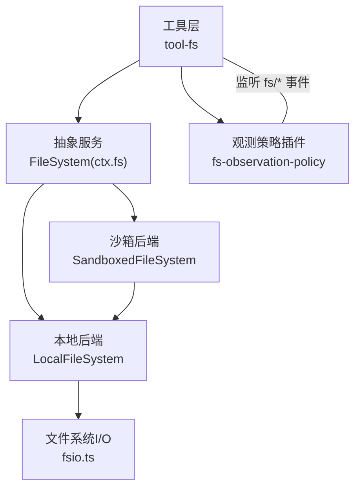
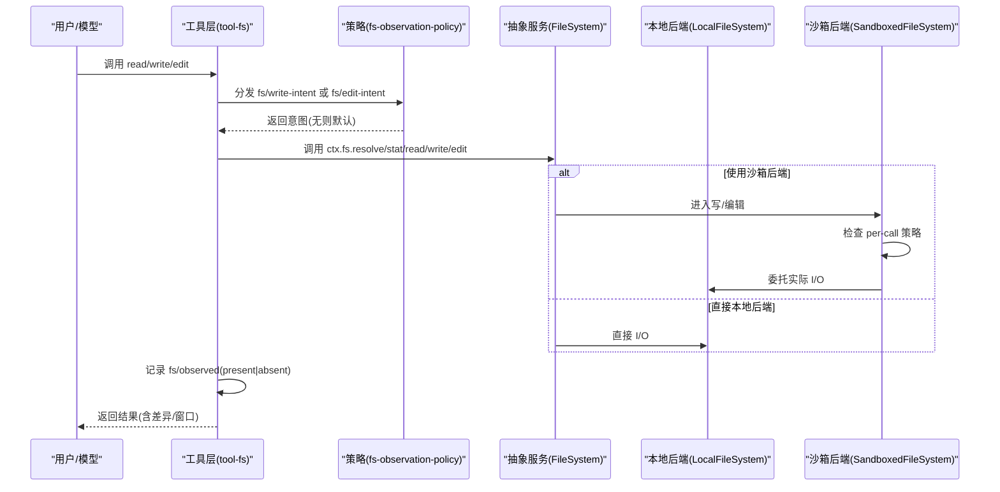
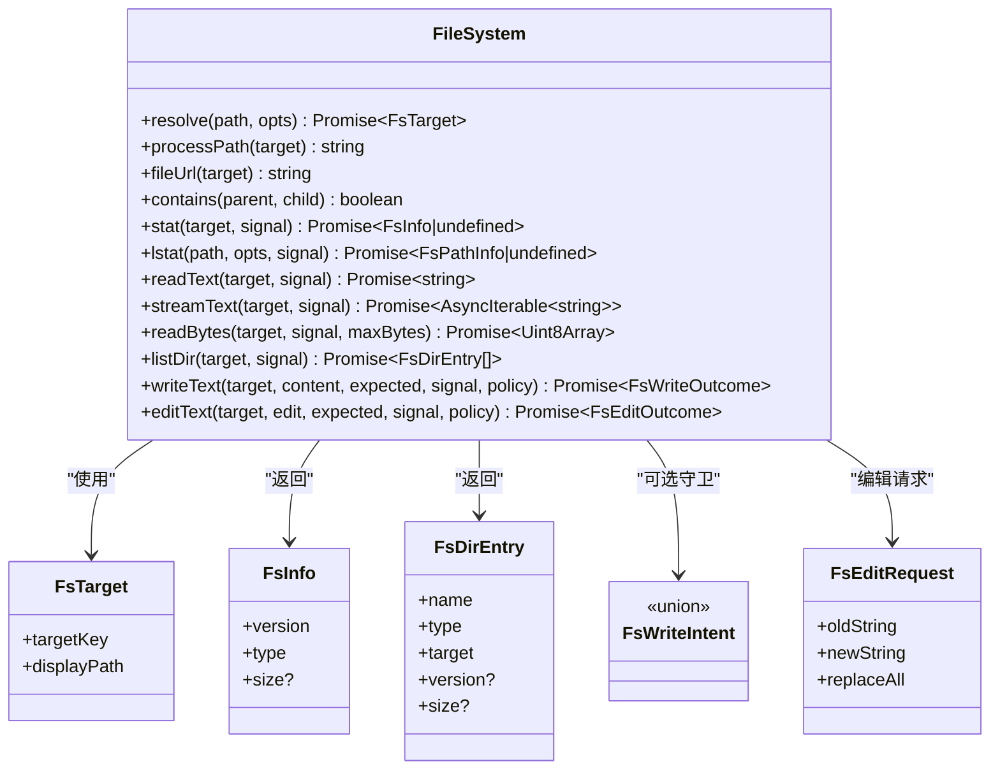
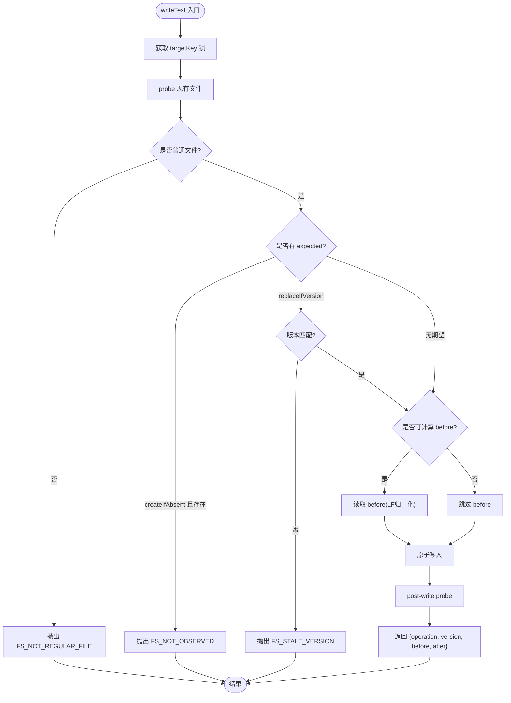
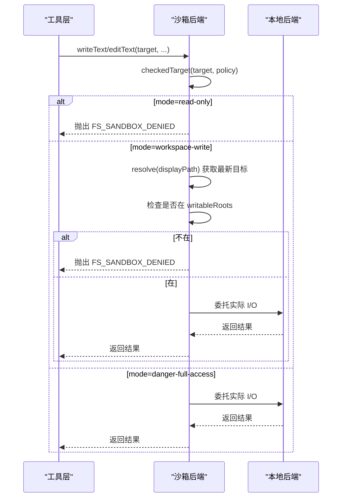
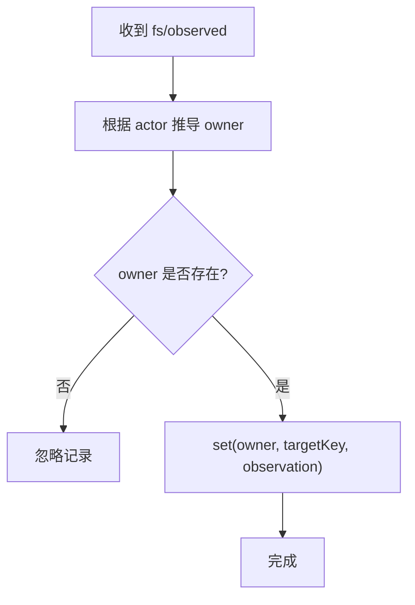
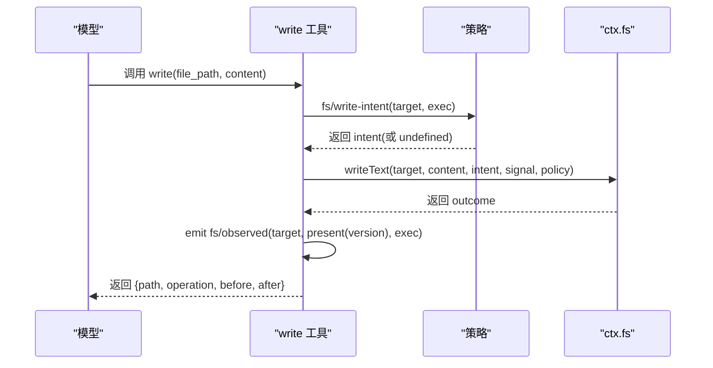
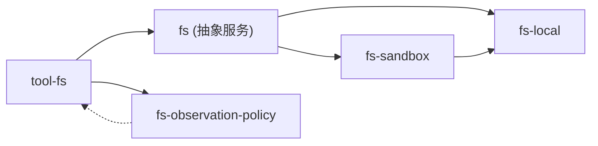

# 文件系统提供者

<cite>
**本文引用的文件**
- [packages/fs/fs/src/types.ts](file://packages/fs/fs/src/types.ts)
- [packages/fs/fs/src/index.ts](file://packages/fs/fs/src/index.ts)
- [packages/fs/fs-local/src/index.ts](file://packages/fs/fs-local/src/index.ts)
- [packages/fs/fs-sandbox/src/index.ts](file://packages/fs/fs-sandbox/src/index.ts)
- [packages/fs/fs-observation-policy/src/index.ts](file://packages/fs/fs-observation-policy/src/index.ts)
- [packages/fs/fs-observation-policy/src/types.ts](file://packages/fs/fs-observation-policy/src/types.ts)
- [packages/fs/tool-fs/src/index.ts](file://packages/fs/tool-fs/src/index.ts)
- [packages/fs/tool-fs/src/write.ts](file://packages/fs/tool-fs/src/write.ts)
- [packages/fs/tool-fs/src/edit.ts](file://packages/fs/tool-fs/src/edit.ts)
- [packages/fs/tool-fs/src/read.ts](file://packages/fs/tool-fs/src/read.ts)
- [packages/fs/tool-fs/src/sandbox.ts](file://packages/fs/tool-fs/src/sandbox.ts)
- [docs/subsystems/filesystem.md](file://docs/subsystems/filesystem.md)
- [docs/subsystems/filesystem.zh.md](file://docs/subsystems/filesystem.zh.md)
</cite>

## 目录
1. [简介](#简介)
2. [项目结构](#项目结构)
3. [核心组件](#核心组件)
4. [架构总览](#架构总览)
5. [详细组件分析](#详细组件分析)
6. [依赖关系分析](#依赖关系分析)
7. [性能与缓存策略](#性能与缓存策略)
8. [故障排查指南](#故障排查指南)
9. [结论](#结论)
10. [附录：开发指南与最佳实践](#附录开发指南与最佳实践)

## 简介
本文件系统能力由四层组成：抽象服务定义、本地实现、可选的观测策略插件，以及面向模型的工具层。抽象服务定义提供稳定目标标识、元数据、读写/编辑原语与事件契约；本地实现提供高性能磁盘后端；观测策略通过事件决定写/编辑意图并记录“已观测”状态；工具层负责参数校验、窗口化读取、差异渲染与沙箱升级提示。该设计将“提供方契约”“策略决策”“工具呈现”解耦，便于替换后端（如远程存储或虚拟文件系统）而不影响上层工具与策略。

## 项目结构
- 抽象服务与类型：`fs/*` 能力接口、错误码、目标/版本标识、写入/编辑请求与结果等
- 本地后端：基于 realpath 的稳定目标、原子写入、行尾归一化、并发锁
- 沙箱后端：在本地后端之上增加每调用策略围栏（只读/工作区写入/危险全访问）
- 观测策略：通过 `fs/*` 事件维护“已观测”状态，决定写/编辑意图
- 工具层：read/write/edit 工具注册、窗口化读取、差异展示、沙箱升级控制器

图表来源
- [packages/fs/tool-fs/src/index.ts:54-79](file://packages/fs/tool-fs/src/index.ts#L54-L79)
- [packages/fs/fs/src/index.ts:86-250](file://packages/fs/fs/src/index.ts#L86-L250)
- [packages/fs/fs-local/src/index.ts:64-266](file://packages/fs/fs-local/src/index.ts#L64-L266)
- [packages/fs/fs-sandbox/src/index.ts:59-149](file://packages/fs/fs-sandbox/src/index.ts#L59-L149)
- [packages/fs/fs-observation-policy/src/index.ts:106-130](file://packages/fs/fs-observation-policy/src/index.ts#L106-L130)

章节来源
- [docs/subsystems/filesystem.md:1-10](file://docs/subsystems/filesystem.md#L1-L10)
- [docs/subsystems/filesystem.zh.md:1-10](file://docs/subsystems/filesystem.zh.md#L1-L10)

## 核心组件
- FileSystem 抽象服务：定义 resolve/stat/lstat/read/stream/list/write/edit 等原语，以及 fs/* 事件契约
- LocalFileSystem：本地磁盘实现，包含原子写入、行尾处理、并发锁、路径解析与包含性检查
- SandboxedFileSystem：继承本地后端，对 write/edit 增加 per-call 策略围栏
- 观测策略插件：维护 WeakMap<owner, Map<targetKey, observation>>，决定写/编辑意图并记录观测
- 工具层：read/write/edit 工具注册、窗口化读取、差异渲染、沙箱升级控制器

章节来源
- [packages/fs/fs/src/index.ts:86-250](file://packages/fs/fs/src/index.ts#L86-L250)
- [packages/fs/fs-local/src/index.ts:64-266](file://packages/fs/fs-local/src/index.ts#L64-L266)
- [packages/fs/fs-sandbox/src/index.ts:59-149](file://packages/fs/fs-sandbox/src/index.ts#L59-L149)
- [packages/fs/fs-observation-policy/src/index.ts:21-130](file://packages/fs/fs-observation-policy/src/index.ts#L21-L130)
- [packages/fs/tool-fs/src/index.ts:54-79](file://packages/fs/tool-fs/src/index.ts#L54-L79)

## 架构总览
文件系统以“抽象服务 + 可插拔后端 + 事件策略 + 工具层”的方式组织。工具层不关心后端细节，仅通过 ctx.fs 调用；策略插件通过单槽 waterfall 决定写/编辑意图；沙箱后端在写/编辑前进行权限围栏。

图表来源
- [packages/fs/tool-fs/src/write.ts:102-129](file://packages/fs/tool-fs/src/write.ts#L102-L129)
- [packages/fs/tool-fs/src/edit.ts:112-146](file://packages/fs/tool-fs/src/edit.ts#L112-L146)
- [packages/fs/fs-observation-policy/src/index.ts:116-129](file://packages/fs/fs-observation-policy/src/index.ts#L116-L129)
- [packages/fs/fs-sandbox/src/index.ts:84-149](file://packages/fs/fs-sandbox/src/index.ts#L84-L149)
- [packages/fs/fs-local/src/index.ts:166-255](file://packages/fs/fs-local/src/index.ts#L166-L255)

## 详细组件分析

### 抽象服务与类型（FileSystem 与 FsTarget/FsVersion）
- 目标标识：FsTarget(targetKey/displayPath)，禁止消费方解析 targetKey
- 版本令牌：FsVersion，用于写/编辑的新鲜度守卫
- 元数据：FsInfo/FsPathInfo，type/size/version，lstat 不跟随最终链接
- 列表：FsDirEntry，稳定顺序，不含内容
- 写/编辑：FsWriteIntent(createIfAbsent/replaceIfVersion)、FsEditRequest(oldString/newString/replaceAll)
- 错误：FsErrorCode 统一分类，FsError 携带 code

图表来源
- [packages/fs/fs/src/index.ts:86-250](file://packages/fs/fs/src/index.ts#L86-L250)
- [packages/fs/fs/src/types.ts:11-168](file://packages/fs/fs/src/types.ts#L11-L168)

章节来源
- [packages/fs/fs/src/types.ts:11-168](file://packages/fs/fs/src/types.ts#L11-L168)
- [packages/fs/fs/src/index.ts:86-250](file://packages/fs/fs/src/index.ts#L86-L250)

### 本地后端（LocalFileSystem）
- 目标解析：相对路径按 cwd 解析，生成稳定 targetKey
- 包含性检查：relative + isAbsolute 判断子目录
- 元数据：stat/lstat 返回 type/version/size
- 文本读取：readText/streamText/readBytes，支持流式与大文件
- 目录遍历：listDir 返回稳定顺序的子项与轻量元数据
- 原子写：withLock 串行化同一 targetKey 的写/编辑，避免竞态
- 行尾处理：写入前 LF 归一化，编辑后恢复原始行尾
- 版本守卫：createIfAbsent/replaceIfVersion 严格校验

图表来源
- [packages/fs/fs-local/src/index.ts:90-104](file://packages/fs/fs-local/src/index.ts#L90-L104)
- [packages/fs/fs-local/src/index.ts:166-218](file://packages/fs/fs-local/src/index.ts#L166-L218)

章节来源
- [packages/fs/fs-local/src/index.ts:64-266](file://packages/fs/fs-local/src/index.ts#L64-L266)

### 沙箱后端（SandboxedFileSystem）
- 继承本地后端，重写 writeText/editText 在进入前执行 per-call 策略围栏
- 模式：read-only（拒绝所有写）、workspace-write（限制到可写根）、danger-full-access（放行）
- 防 TOCTOU：在围栏内重新 resolve 最新目标，再判定包含性
- 拒绝时抛出 FS_SANDBOX_DENIED，工具层将其映射为模型友好的提示

图表来源
- [packages/fs/fs-sandbox/src/index.ts:59-149](file://packages/fs/fs-sandbox/src/index.ts#L59-L149)

章节来源
- [packages/fs/fs-sandbox/src/index.ts:59-149](file://packages/fs/fs-sandbox/src/index.ts#L59-L149)

### 观测策略插件（fs-observation-policy）
- 维护 WeakMap<owner, Map<targetKey, observation>>，owner 来自 exec.agent.session
- 写意图：未见/缺失 → createIfAbsent；已存在 → replaceIfVersion(带 observed version)
- 编辑意图：未见 → FS_NOT_OBSERVED；缺失 → FS_NOT_FOUND；存在 → 返回 observed version
- 记录观测：fs/observed 同步记录 present/absent，不执行 I/O

图表来源
- [packages/fs/fs-observation-policy/src/index.ts:21-95](file://packages/fs/fs-observation-policy/src/index.ts#L21-L95)
- [packages/fs/fs-observation-policy/src/index.ts:116-129](file://packages/fs/fs-observation-policy/src/index.ts#L116-L129)

章节来源
- [packages/fs/fs-observation-policy/src/index.ts:21-130](file://packages/fs/fs-observation-policy/src/index.ts#L21-L130)
- [packages/fs/fs-observation-policy/src/types.ts:13-29](file://packages/fs/fs-observation-policy/src/types.ts#L13-L29)

### 工具层（read/write/edit）
- read：一次 stat，选择 stream/read，构建窗口化结果，emit fs/observed(present|absent)
- write：waterfall 获取写意图，调用 ctx.fs.writeText，emit fs/observed(present)
- edit：waterfall 获取编辑意图，调用 ctx.fs.editText，emit fs/observed(present)
- 沙箱控制器：广告升级字段、解析 per-call 策略、错误映射为模型友好提示

图表来源
- [packages/fs/tool-fs/src/write.ts:102-129](file://packages/fs/tool-fs/src/write.ts#L102-L129)
- [packages/fs/tool-fs/src/edit.ts:112-146](file://packages/fs/tool-fs/src/edit.ts#L112-L146)
- [packages/fs/tool-fs/src/read.ts:136-163](file://packages/fs/tool-fs/src/read.ts#L136-L163)
- [packages/fs/tool-fs/src/sandbox.ts:87-130](file://packages/fs/tool-fs/src/sandbox.ts#L87-L130)

章节来源
- [packages/fs/tool-fs/src/index.ts:54-79](file://packages/fs/tool-fs/src/index.ts#L54-L79)
- [packages/fs/tool-fs/src/write.ts:102-129](file://packages/fs/tool-fs/src/write.ts#L102-L129)
- [packages/fs/tool-fs/src/edit.ts:112-146](file://packages/fs/tool-fs/src/edit.ts#L112-L146)
- [packages/fs/tool-fs/src/read.ts:136-163](file://packages/fs/tool-fs/src/read.ts#L136-L163)
- [packages/fs/tool-fs/src/sandbox.ts:87-130](file://packages/fs/tool-fs/src/sandbox.ts#L87-L130)

## 依赖关系分析
- 工具层依赖抽象服务与策略事件，不依赖具体后端
- 本地后端依赖 Node path/buffer/url 与内部 fsio
- 沙箱后端依赖本地后端与 sandbox 策略服务
- 观测策略仅依赖事件与类型，不持有 I/O

图表来源
- [packages/fs/tool-fs/src/index.ts:54-79](file://packages/fs/tool-fs/src/index.ts#L54-L79)
- [packages/fs/fs/src/index.ts:86-250](file://packages/fs/fs/src/index.ts#L86-L250)
- [packages/fs/fs-local/src/index.ts:64-266](file://packages/fs/fs-local/src/index.ts#L64-L266)
- [packages/fs/fs-sandbox/src/index.ts:59-149](file://packages/fs/fs-sandbox/src/index.ts#L59-L149)
- [packages/fs/fs-observation-policy/src/index.ts:106-130](file://packages/fs/fs-observation-policy/src/index.ts#L106-L130)

章节来源
- [packages/fs/tool-fs/src/index.ts:54-79](file://packages/fs/tool-fs/src/index.ts#L54-L79)
- [packages/fs/fs/src/index.ts:86-250](file://packages/fs/fs/src/index.ts#L86-L250)

## 性能与缓存策略
- 本地后端并发控制：按 targetKey 串行化写/编辑，避免竞态，提升一致性
- 大文件读取：当 size 未知或大于阈值时走 streamText，避免内存峰值
- 差异基线：before 读取受 diffBasisMaxBytes 限制，超限回退为整文件差异
- 行尾处理：LF 归一化作为存储与差异基准，减少无关变更
- 目录遍历：仅返回轻量元数据，不读取内容，保证稳定性
- 无超时：IO 操作不接受 timeoutMs，取消通过 AbortSignal 尽力中止

章节来源
- [packages/fs/fs-local/src/index.ts:74-104](file://packages/fs/fs-local/src/index.ts#L74-L104)
- [packages/fs/fs-local/src/index.ts:143-153](file://packages/fs/fs-local/src/index.ts#L143-L153)
- [packages/fs/fs-local/src/index.ts:190-218](file://packages/fs/fs-local/src/index.ts#L190-L218)
- [packages/fs/tool-fs/src/read.ts:144-151](file://packages/fs/tool-fs/src/read.ts#L144-L151)
- [docs/subsystems/filesystem.md:272-275](file://docs/subsystems/filesystem.md#L272-L275)

## 故障排查指南
- 常见错误码
  - FS_NOT_FOUND：目标不存在（编辑确认缺失时）
  - FS_NOT_DIRECTORY：目标不是目录（列出失败）
  - FS_NOT_TEXT / FS_NOT_REGULAR_FILE：非文本或非普通文件
  - FS_TOO_LARGE：超过 readBytes 上限
  - FS_PERMISSION_DENIED：宿主内核拒绝
  - FS_SANDBOX_DENIED：沙箱策略拒绝（read-only/workspace-write）
  - FS_IO_ERROR：后端 I/O 异常
  - FS_STALE_VERSION：版本不匹配或缺失目标编辑
  - FS_NOT_OBSERVED：未先读取就尝试创建/编辑
  - FS_AMBIGUOUS_EDIT / FS_EDIT_NOT_FOUND：字面编辑匹配问题
  - FS_ABORTED：被信号中止
- 定位步骤
  - 检查工具输出中的 error.code
  - 若为 FS_SANDBOX_DENIED，查看沙箱模式与 workspace-root
  - 若为 FS_STALE_VERSION，重新读取后重试
  - 若为 FS_NOT_OBSERVED，确保先 read 再 write/edit
  - 若为 FS_TOO_LARGE，降低 maxBytes 或改用流式处理

章节来源
- [packages/fs/fs/src/types.ts:170-203](file://packages/fs/fs/src/types.ts#L170-L203)
- [packages/fs/fs-sandbox/src/index.ts:126-149](file://packages/fs/fs-sandbox/src/index.ts#L126-L149)
- [packages/fs/tool-fs/src/write.ts:113-120](file://packages/fs/tool-fs/src/write.ts#L113-L120)
- [packages/fs/tool-fs/src/edit.ts:124-139](file://packages/fs/tool-fs/src/edit.ts#L124-L139)

## 结论
本文件系统提供者通过清晰的抽象服务、稳定的目标/版本标识、原子写/编辑、事件驱动的策略与沙箱围栏，提供了可扩展、安全且高性能的文件系统能力。工具层与后端解耦，策略与呈现分离，便于集成远程存储、虚拟文件系统或更严格的沙箱策略。

## 附录：开发指南与最佳实践

### 如何注册自定义文件系统后端
- 实现 FileSystem 抽象类，提供 resolve/stat/lstat/read/stream/list/write/edit
- 保持目标稳定：同一文件在不同别名下应返回相同 targetKey
- 正确处理错误：使用 FsError 与 FsErrorCode
- 如需沙箱：继承 LocalFileSystem 或 SandboxedFileSystem，并在 write/edit 前做围栏
- 如需远程/虚拟：在 resolve 中映射到后端 ID，在 processPath/fileUrl/contains 中提供跨能力坐标

章节来源
- [packages/fs/fs/src/index.ts:86-250](file://packages/fs/fs/src/index.ts#L86-L250)
- [packages/fs/fs-local/src/index.ts:64-266](file://packages/fs/fs-local/src/index.ts#L64-L266)
- [packages/fs/fs-sandbox/src/index.ts:59-149](file://packages/fs/fs-sandbox/src/index.ts#L59-L149)

### 权限控制、路径验证与安全沙箱集成
- 路径验证：resolve 规范化路径；lstat 可用于信任边界检查（拒绝 symlink）
- 权限控制：沙箱后端依据 per-call 策略限制写/编辑范围
- 安全集成：工具层在调用前解析策略，拒绝时给出模型友好的升级提示

章节来源
- [packages/fs/fs-local/src/index.ts:134-141](file://packages/fs/fs-local/src/index.ts#L134-L141)
- [packages/fs/fs-sandbox/src/index.ts:126-149](file://packages/fs/fs-sandbox/src/index.ts#L126-L149)
- [packages/fs/tool-fs/src/sandbox.ts:87-130](file://packages/fs/tool-fs/src/sandbox.ts#L87-L130)

### CRUD、目录遍历、监控与变更通知
- 读：readText/streamText/readBytes，窗口化读取，emit fs/observed(present|absent)
- 写：writeText 原子创建/覆盖，支持 createIfAbsent/replaceIfVersion
- 编辑：editText 原子字面替换，支持 replaceAll，版本守卫优先于匹配
- 目录遍历：listDir 稳定顺序，不含内容
- 监控：通过 fs/observed 事件记录 presence/absence；策略插件据此决定后续写/编辑意图

章节来源
- [packages/fs/tool-fs/src/read.ts:136-163](file://packages/fs/tool-fs/src/read.ts#L136-L163)
- [packages/fs/tool-fs/src/write.ts:102-129](file://packages/fs/tool-fs/src/write.ts#L102-L129)
- [packages/fs/tool-fs/src/edit.ts:112-146](file://packages/fs/tool-fs/src/edit.ts#L112-L146)
- [packages/fs/fs-observation-policy/src/index.ts:116-129](file://packages/fs/fs-observation-policy/src/index.ts#L116-L129)

### 缓存策略与性能优化
- 本地后端按 targetKey 串行化写/编辑，避免竞态
- 大文件走流式读取，避免内存峰值
- before 读取受 diffBasisMaxBytes 限制，超限回退整文件差异
- 目录遍历不读取内容，保证稳定与高效

章节来源
- [packages/fs/fs-local/src/index.ts:74-104](file://packages/fs/fs-local/src/index.ts#L74-L104)
- [packages/fs/fs-local/src/index.ts:190-218](file://packages/fs/fs-local/src/index.ts#L190-L218)
- [packages/fs/tool-fs/src/read.ts:144-151](file://packages/fs/tool-fs/src/read.ts#L144-L151)

### 与现有工具系统的集成与数据一致性
- 工具层通过 ctx.fs 调用，不感知后端细节
- 策略通过 fs/* 事件注入，不影响工具 schema
- 一致性：原子写/编辑 + 版本守卫 + 并发锁，确保并发安全

章节来源
- [packages/fs/tool-fs/src/index.ts:54-79](file://packages/fs/tool-fs/src/index.ts#L54-L79)
- [packages/fs/fs/src/index.ts:86-250](file://packages/fs/fs/src/index.ts#L86-L250)
- [packages/fs/fs-local/src/index.ts:90-104](file://packages/fs/fs-local/src/index.ts#L90-L104)

### 事件驱动的变更通知机制
- fs/write-intent 与 fs/edit-intent：单槽 waterfall，第一个返回意图者拥有决策权
- fs/observed：即发即弃的记录事件，监听器必须同步且不抛错
- 策略插件维护“已观测”状态，决定后续写/编辑意图

章节来源
- [packages/fs/fs/src/index.ts:44-78](file://packages/fs/fs/src/index.ts#L44-L78)
- [packages/fs/fs-observation-policy/src/index.ts:116-129](file://packages/fs/fs-observation-policy/src/index.ts#L116-L129)