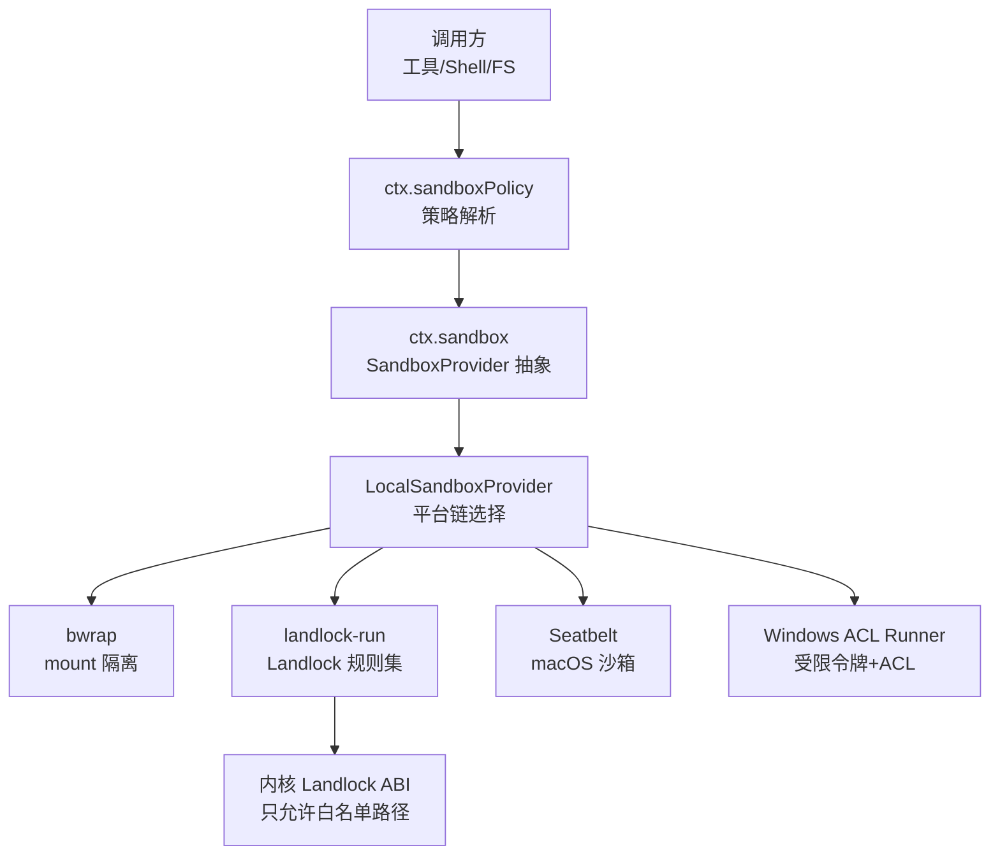
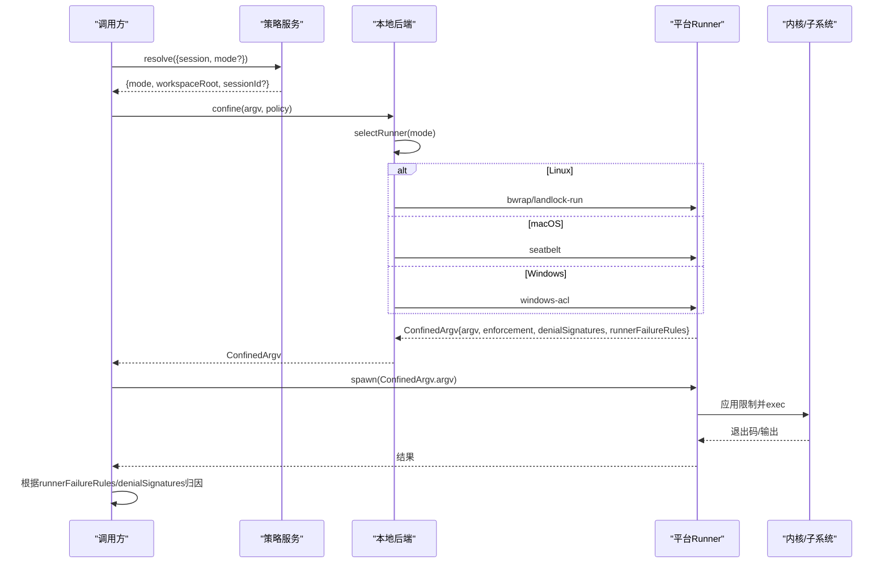
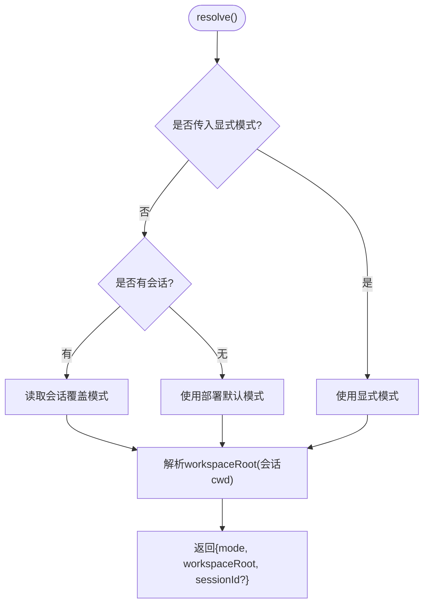
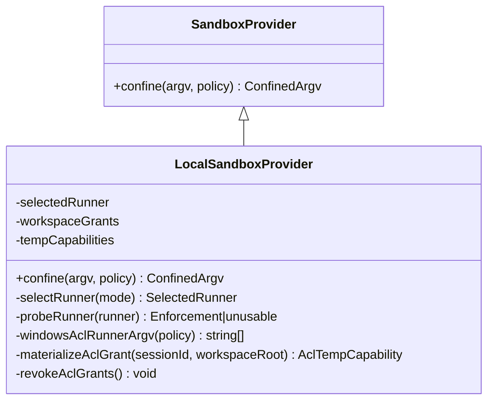
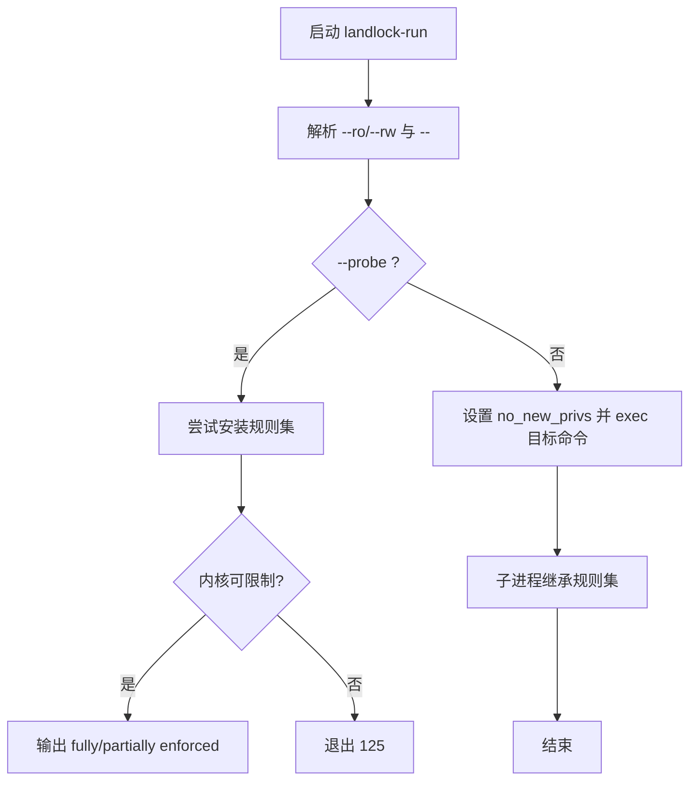
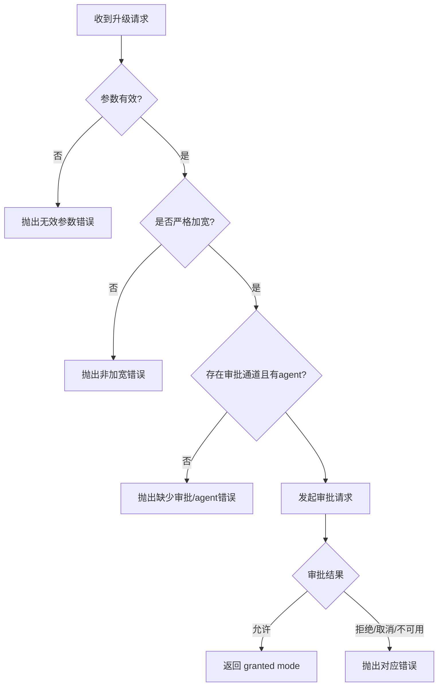
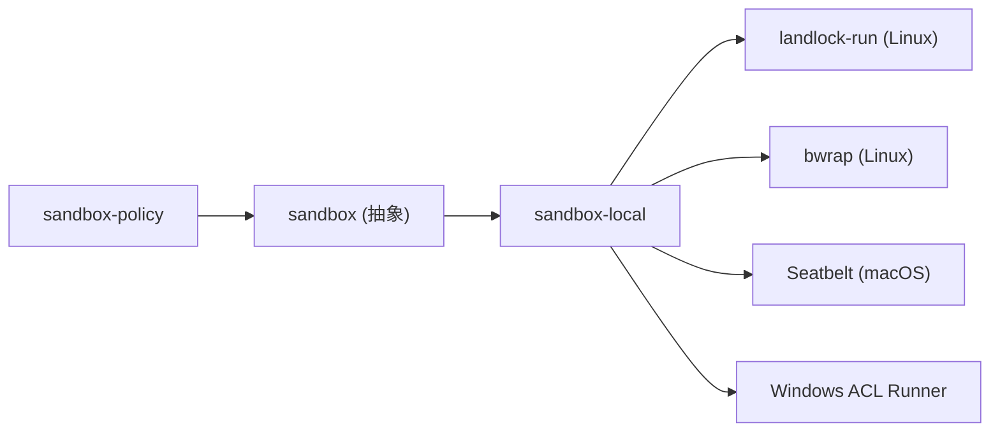
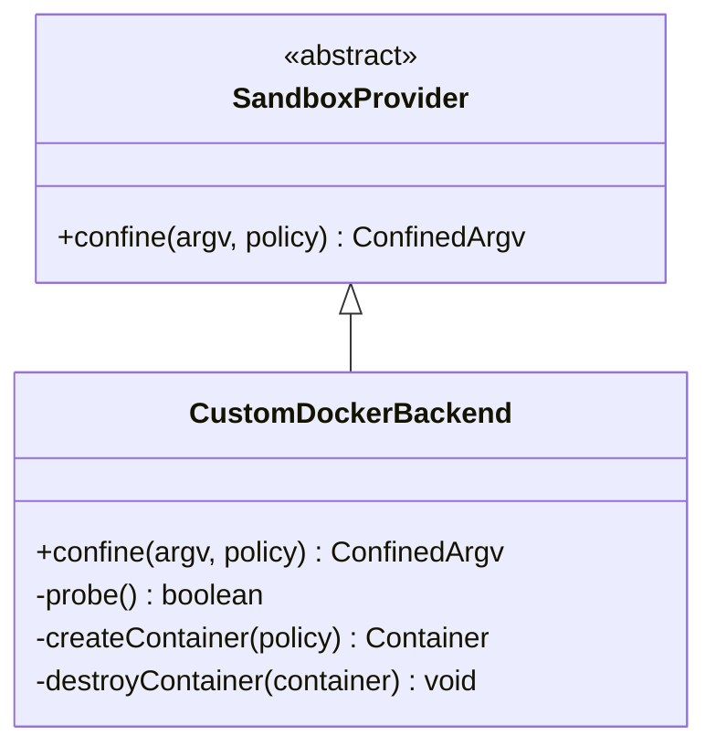

# 沙箱扩展

<cite>
**本文引用的文件**
- [packages/sandbox/sandbox/src/index.ts](file://packages/sandbox/sandbox/src/index.ts)
- [packages/sandbox/sandbox-local/src/index.ts](file://packages/sandbox/sandbox-local/src/index.ts)
- [packages/sandbox/sandbox-policy/src/index.ts](file://packages/sandbox/sandbox-policy/src/index.ts)
- [native/landlock-run/README.md](file://native/landlock-run/README.md)
- [native/landlock-run/docs/cli-contract.md](file://native/landlock-run/docs/cli-contract.md)
- [docs/subsystems/sandbox.md](file://docs/subsystems/sandbox.md)
- [packages/sandbox/README.md](file://packages/sandbox/README.md)
- [packages/sandbox/sandbox/src/escalation.ts](file://packages/sandbox/sandbox/src/escalation.ts)
</cite>

## 目录
1. [简介](#简介)
2. [项目结构](#项目结构)
3. [核心组件](#核心组件)
4. [架构总览](#架构总览)
5. [详细组件分析](#详细组件分析)
6. [依赖关系分析](#依赖关系分析)
7. [性能与资源限制](#性能与资源限制)
8. [故障恢复与排障指南](#故障恢复与排障指南)
9. [结论](#结论)
10. [附录：自定义沙箱后端开发指南](#附录自定义沙箱后端开发指南)

## 简介
本文件系统化说明 DeepSeek Harness 的进程级沙箱扩展机制，覆盖隔离策略（进程、内存、网络、文件系统）、生命周期管理、资源回收、安全策略配置、性能调优与故障恢复实践，并提供实现自定义沙箱后端的扩展指南。沙箱以“同进程子进程 + 主机内核能力”的方式提供细粒度文件访问控制；容器化、微虚拟机或远程执行属于“整体能力替换”，不在 ctx.sandbox 范围内。

## 项目结构
沙箱相关代码按职责拆分为多个包：
- sandbox：定义抽象服务、模式、策略类型与升级词汇
- sandbox-local：本地平台后端选择与封装（Linux bwrap/Landlock、macOS Seatbelt、Windows ACL）
- sandbox-policy：统一解析每次执行的策略（模式与工作区根）
- native/landlock-run：Landlock 自限制启动器（仅 Linux）

图示来源
- [packages/sandbox/sandbox/src/index.ts:158-176](file://packages/sandbox/sandbox/src/index.ts#L158-L176)
- [packages/sandbox/sandbox-local/src/index.ts:159-166](file://packages/sandbox/sandbox-local/src/index.ts#L159-L166)
- [native/landlock-run/README.md:1-49](file://native/landlock-run/README.md#L1-L49)

章节来源
- [packages/sandbox/README.md:1-16](file://packages/sandbox/README.md#L1-L16)
- [docs/subsystems/sandbox.md:1-219](file://docs/subsystems/sandbox.md#L1-L219)

## 核心组件
- SandboxProvider（抽象）：定义 confine(argv, policy) 契约，要求返回受约束的 argv 或失败关闭，禁止静默放行。
- LocalSandboxProvider（本地后端）：按平台选择 runner 链（Linux 优先 bwrap，其次 Landlock；macOS Seatbelt；Windows ACL），功能探测并缓存结果，报告 enforcement 完整度与诊断签名。
- SandboxPolicyService（策略服务）：解析每次执行的 mode 与 workspaceRoot，注入系统提示上下文，供所有 enforcing 消费者读取一致策略。
- landlock-run（Linux 启动器）：自限制后 exec 子进程，基于 Landlock 白名单控制文件系统访问，支持 probe 报告 full/partial/unusable。

章节来源
- [packages/sandbox/sandbox/src/index.ts:23-72](file://packages/sandbox/sandbox/src/index.ts#L23-L72)
- [packages/sandbox/sandbox/src/index.ts:158-176](file://packages/sandbox/sandbox/src/index.ts#L158-L176)
- [packages/sandbox/sandbox-local/src/index.ts:250-333](file://packages/sandbox/sandbox-local/src/index.ts#L250-L333)
- [packages/sandbox/sandbox-policy/src/index.ts:91-151](file://packages/sandbox/sandbox-policy/src/index.ts#L91-L151)
- [native/landlock-run/README.md:1-49](file://native/landlock-run/README.md#L1-L49)

## 架构总览
下图展示一次受限执行的端到端流程：策略解析 → 后端选择 → 生成受限 argv → 子进程执行 → 错误归因（runner 失败 vs 被拒绝）。

图示来源
- [packages/sandbox/sandbox/src/index.ts:158-176](file://packages/sandbox/sandbox/src/index.ts#L158-L176)
- [packages/sandbox/sandbox-local/src/index.ts:316-333](file://packages/sandbox/sandbox-local/src/index.ts#L316-L333)
- [native/landlock-run/docs/cli-contract.md:5-35](file://native/landlock-run/docs/cli-contract.md#L5-L35)

## 详细组件分析

### 策略解析与服务（SandboxPolicyService）
- 职责：维护部署默认模式、工作区根、会话覆盖；为每次能力调用解析最终策略。
- 优先级：显式批准的模式 > 会话最近记录的模式 > 部署默认。
- 工作区根：使用会话不可变 cwd 作为 workspace-write 边界；无会话时回退到配置根。
- 上下文注入：将当前策略渲染为系统提示上下文片段，便于模型理解限制。

图示来源
- [packages/sandbox/sandbox-policy/src/index.ts:126-151](file://packages/sandbox/sandbox-policy/src/index.ts#L126-L151)

章节来源
- [packages/sandbox/sandbox-policy/src/index.ts:60-151](file://packages/sandbox/sandbox-policy/src/index.ts#L60-L151)

### 本地后端选择与封装（LocalSandboxProvider）
- 平台链：Linux[bwrap, landlock]、Darwin[seatbelt]、Win32[windows-acl]。
- 功能探测：对多候选进行一次性探测，缓存选择结果；单候选直接选择并在执行期失败关闭。
- 报告字段：
  - enforcement：full/partial（例如 Windows ACL 因 Everyone/hard-link 边界为 partial）。
  - denialSignatures：后端特定的拒绝诊断（如 EROFS/EACCES/EPERM 文本）。
  - runnerFailureRules：结构化 runner 失败证据（exit code + stderr 匹配）。
- Windows ACL 写权限：每工作区一次 standing grant；每会话私有临时目录与独立 SID，provider 销毁时撤销。

图示来源
- [packages/sandbox/sandbox/src/index.ts:158-176](file://packages/sandbox/sandbox/src/index.ts#L158-L176)
- [packages/sandbox/sandbox-local/src/index.ts:250-565](file://packages/sandbox/sandbox-local/src/index.ts#L250-L565)

章节来源
- [packages/sandbox/sandbox-local/src/index.ts:150-187](file://packages/sandbox/sandbox-local/src/index.ts#L150-L187)
- [packages/sandbox/sandbox-local/src/index.ts:316-333](file://packages/sandbox/sandbox-local/src/index.ts#L316-L333)
- [packages/sandbox/sandbox-local/src/index.ts:358-477](file://packages/sandbox/sandbox-local/src/index.ts#L358-L477)

### Linux Landlock 启动器（landlock-run）
- 行为：自限制后 exec 子进程，继承规则集；未授予的路径一律拒绝。
- CLI：--ro/--rw 授权路径，-- 分隔命令；--probe 检测可用性。
- 退出码：125 表示 launcher 失败（未运行命令）；成功 exec 后透传子进程状态。
- 报告：probe 成功输出 fully/partially enforced；部分 ABI 会打印提示行。

图示来源
- [native/landlock-run/docs/cli-contract.md:5-35](file://native/landlock-run/docs/cli-contract.md#L5-L35)
- [native/landlock-run/README.md:25-49](file://native/landlock-run/README.md#L25-L49)

章节来源
- [native/landlock-run/docs/cli-contract.md:5-35](file://native/landlock-run/docs/cli-contract.md#L5-L35)
- [native/landlock-run/README.md:1-49](file://native/landlock-run/README.md#L1-L49)

### 权限升级与失败关闭（Escalation & Fail-Closed）
- 升级阶梯：read-only → workspace-write → danger-full-access；严格加宽校验。
- 升级审批：通过 EscalationApprover 请求用户批准；未配置或无 agent 则失败关闭。
- 失败关闭：当无可用的后端或 runner 拒绝，抛出 SANDBOX_UNAVAILABLE；禁止静默放行。
- 归因：先检查 runnerFailureRules（runner 未执行），再检查 denialSignatures（被沙箱拒绝）。

图示来源
- [packages/sandbox/sandbox/src/escalation.ts:22-41](file://packages/sandbox/sandbox/src/escalation.ts#L22-L41)
- [packages/sandbox/sandbox/src/escalation.ts:143-189](file://packages/sandbox/sandbox/src/escalation.ts#L143-L189)
- [packages/sandbox/sandbox/src/index.ts:118-144](file://packages/sandbox/sandbox/src/index.ts#L118-L144)

章节来源
- [packages/sandbox/sandbox/src/escalation.ts:22-189](file://packages/sandbox/sandbox/src/escalation.ts#L22-L189)
- [packages/sandbox/sandbox/src/index.ts:118-144](file://packages/sandbox/sandbox/src/index.ts#L118-L144)

## 依赖关系分析
- 策略层与执行层解耦：策略服务不感知具体后端；后端消费策略对象。
- 后端链按平台固定顺序，探测结果缓存，避免重复开销。
- Windows ACL 写权限跨会话复用工作区 grant，会话私有临时目录在 provider 销毁时清理。
- Landlock 启动器通过 CLI 契约与上层解耦，支持 probe 与受限执行。

图示来源
- [packages/sandbox/sandbox-policy/src/index.ts:91-151](file://packages/sandbox/sandbox-policy/src/index.ts#L91-L151)
- [packages/sandbox/sandbox-local/src/index.ts:159-166](file://packages/sandbox/sandbox-local/src/index.ts#L159-L166)
- [native/landlock-run/README.md:1-49](file://native/landlock-run/README.md#L1-L49)

章节来源
- [packages/sandbox/README.md:1-16](file://packages/sandbox/README.md#L1-L16)

## 性能与资源限制
- 进程隔离：通过 bwrap mount profile、Landlock 规则集、Seatbelt 配置文件或 Windows 受限令牌实现；每个受限子进程拥有独立的文件系统视图/规则集。
- 内存保护：由宿主内核与运行时共同保障；Landlock 启动器通过 no_new_privs 降低提权风险。
- 网络访问控制：当前模式词汇聚焦文件系统效果；网络与进程可见性不在该词汇内，需结合外部能力替换（容器/微VM/远程执行）实现。
- 文件系统限制：
  - read-only：仅允许必要写入点（如 /dev/null）；bwrap 额外提供 shell 所需 sink。
  - workspace-write：允许工作区根与后端定义的临时区域写入。
  - danger-full-access：绕过限制（不经过 ctx.sandbox）。
- 探测与缓存：后端链仅进行一次功能探测，结果缓存于 provider 生命周期；减少启动与首次执行开销。
- 资源回收：Windows ACL 的临时目录与 SID 在 provider dispose 时撤销与清理；失败路径确保半完成状态的回滚。

章节来源
- [docs/subsystems/sandbox.md:9-39](file://docs/subsystems/sandbox.md#L9-L39)
- [packages/sandbox/sandbox-local/src/index.ts:445-477](file://packages/sandbox/sandbox-local/src/index.ts#L445-L477)
- [native/landlock-run/docs/cli-contract.md:32-35](file://native/landlock-run/docs/cli-contract.md#L32-L35)

## 故障恢复与排障指南
- 失败关闭原则：当无可用的后端或 runner 拒绝执行，抛出 SANDBOX_UNAVAILABLE；绝不允许静默降级为无限制执行。
- 归因顺序：
  1) 先检查 runnerFailureRules（exit code + stderr 匹配），判定 runner 基础设施失败。
  2) 再检查 denialSignatures（后端特定拒绝文本），判定被沙箱拒绝。
- 常见错误定位：
  - Linux bwrap：stderr 包含 “bwrap: ” 且 exit 非预期，视为 runner 失败。
  - Landlock：exit 125 且 stderr 含 “landlock-run: ” 前缀，视为 launcher 失败；若出现 “partial enforcement” 提示，仍属受限但 ABI 能力有限。
  - macOS Seatbelt：stderr 含 “sandbox-exec: ” 视为 runner 失败。
  - Windows ACL：exit 127 且 stderr 含 “windows-acl-run: ” 视为 runner 失败；拒绝文本包含 “access is denied” 等。
- 恢复建议：
  - 确认平台 runner 可用（bwrap/sandbox-exec/landlock-run/windows-acl-runner）。
  - 调整策略模式（从 read-only 升级到 workspace-write 或经审批的 danger-full-access）。
  - 检查工作区根与临时目录权限；Windows 下确保 standing/temp SID 正确创建。
  - 对于部分 ABI 的 Landlock，接受 partial 并配合工具层的拒绝提示重试。

章节来源
- [packages/sandbox/sandbox/src/index.ts:118-144](file://packages/sandbox/sandbox/src/index.ts#L118-L144)
- [packages/sandbox/sandbox-local/src/index.ts:200-240](file://packages/sandbox/sandbox-local/src/index.ts#L200-L240)
- [native/landlock-run/docs/cli-contract.md:20-30](file://native/landlock-run/docs/cli-contract.md#L20-L30)

## 结论
DeepSeek Harness 的沙箱以“策略先行、后端可选、失败关闭”为核心设计，通过统一的策略解析与平台后端链，实现对子进程的文件系统访问控制。Landlock、bwrap、Seatbelt 与 Windows ACL 分别在不同平台上提供接近完整的限制能力，并通过严格的归因与升级审批机制保证安全性与可操作性的平衡。对于需要更强隔离的场景，可通过容器/微VM/远程执行替换整体能力实现。

## 附录：自定义沙箱后端开发指南
- 目标：实现一个符合 SandboxProvider 契约的后端，用于 Docker/容器化环境或其他隔离方案。
- 关键步骤：
  1) 继承 SandboxProvider，实现 confine(argv, policy)：
     - 接收 argv 与策略，返回 ConfinedArgv（wrapped argv、enforcement、denialSignatures、runnerFailureRules）。
     - 必须失败关闭：无法限制时抛出 SANDBOX_UNAVAILABLE，不得静默放行。
  2) 定义 denialSignatures：
     - 列出后端产生的拒绝诊断片段（大小写不敏感匹配），避免跨后端误判。
  3) 定义 runnerFailureRules：
     - 明确 runner 基础设施失败的 exit code 与 stderr 特征，使调用方可区分“未执行”和“被拒绝”。
  4) 策略适配：
     - 将 read-only/workspace-write/danger-full-access 映射到容器的只读根、挂载卷、特权开关等。
     - 对 workspace-write，确保工作区根与临时目录可写；必要时为每个会话分配隔离命名空间或卷。
  5) 生命周期与资源回收：
     - 为每个受限实例创建隔离环境（容器/命名空间/沙箱），并在结束时彻底销毁资源。
     - 处理异常路径下的回滚（删除卷、停止容器、释放句柄）。
  6) 探测与选择：
     - 提供功能探测（如 docker run hello-world 或最小受限命令），缓存结果以减少开销。
  7) 集成注册：
     - 在插件中注册为 ctx.sandbox 的实现；或通过组合方式接入现有链。
  8) 测试与验证：
     - 覆盖 read-only/workspace-write/danger-full-access 三种模式。
     - 验证拒绝场景的 stderr 与退出码匹配。
     - 验证资源回收与泄漏防护。

图示来源
- [packages/sandbox/sandbox/src/index.ts:158-176](file://packages/sandbox/sandbox/src/index.ts#L158-L176)

章节来源
- [packages/sandbox/sandbox/src/index.ts:118-176](file://packages/sandbox/sandbox/src/index.ts#L118-L176)
- [docs/subsystems/sandbox.md:96-156](file://docs/subsystems/sandbox.md#L96-L156)