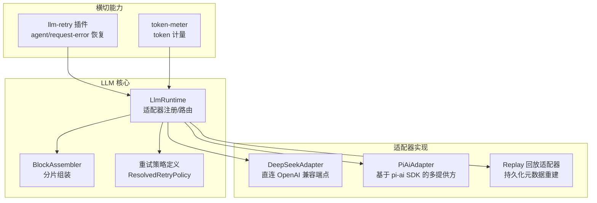
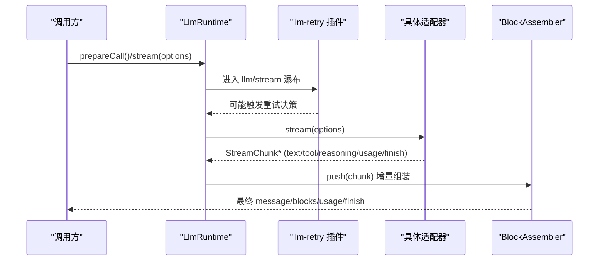
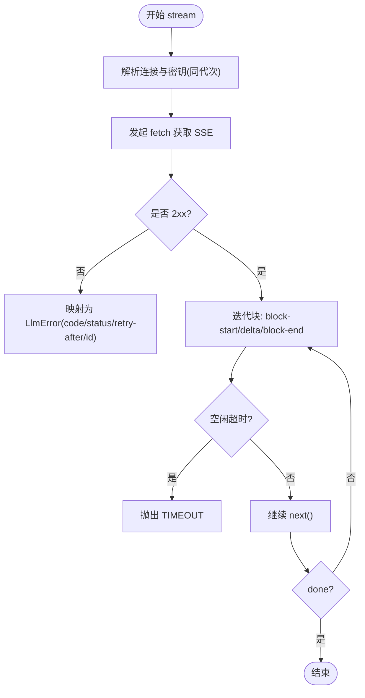
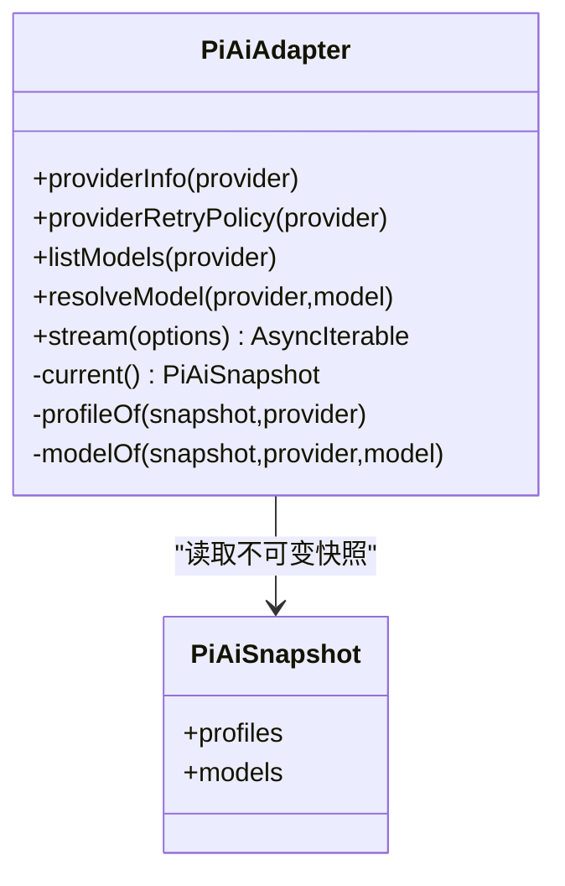
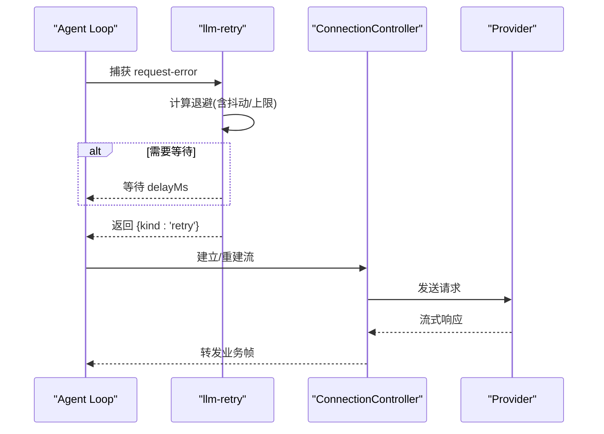
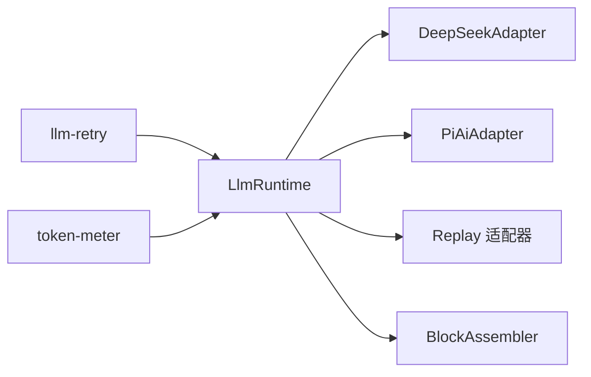

# LLM 适配器接缝

<cite>
**本文引用的文件**
- [packages/llm/llm/src/index.ts](file://packages/llm/llm/src/index.ts)
- [packages/llm/llm-deepseek/src/adapter.ts](file://packages/llm/llm-deepseek/src/adapter.ts)
- [packages/llm/llm-pi-ai/src/adapter.ts](file://packages/llm/llm-pi-ai/src/adapter.ts)
- [packages/llm/llm-pi-ai/src/config.ts](file://packages/llm/llm-pi-ai/src/config.ts)
- [packages/llm/llm-retry/src/index.ts](file://packages/llm/llm-retry/src/index.ts)
- [packages/llm/llm/src/retry-policy.ts](file://packages/llm/llm/src/retry-policy.ts)
- [packages/llm/llm/src/assembler.ts](file://packages/llm/llm/src/assembler.ts)
- [docs/subsystems/llm-streaming.md](file://docs/subsystems/llm-streaming.md)
- [packages/client/connection/src/client/connection.ts](file://packages/client/connection/src/client/connection.ts)
- [packages/llm/token-meter/src/index.ts](file://packages/llm/token-meter/src/index.ts)
</cite>

## 目录
1. [简介](#简介)
2. [项目结构](#项目结构)
3. [核心组件](#核心组件)
4. [架构总览](#架构总览)
5. [详细组件分析](#详细组件分析)
6. [依赖关系分析](#依赖关系分析)
7. [性能与调优](#性能与调优)
8. [故障排查指南](#故障排查指南)
9. [结论](#结论)
10. [附录：配置与使用要点](#附录配置与使用要点)

## 简介
本文件系统性阐述 LLM 适配器接缝（ctx.llm）的设计理念与实现，覆盖适配器模式、流式响应处理、错误重试、连接池与超时控制、多模型切换、负载均衡与故障转移策略，以及性能调优、缓存策略与监控指标。重点解析 DeepSeek 直连适配器、PI AI 多提供方适配器与 Replay 回放适配器的特性与配置方法。

## 项目结构
LLM 能力由“抽象服务 + 提供方适配器”组成，注册到 ctx.llm，统一暴露流式调用接口与模型发现能力；重试与 token 计量作为独立消费方接入。

图表来源
- [packages/llm/llm/src/index.ts:284-800](file://packages/llm/llm/src/index.ts#L284-L800)
- [packages/llm/llm-deepseek/src/adapter.ts:158-347](file://packages/llm/llm-deepseek/src/adapter.ts#L158-L347)
- [packages/llm/llm-pi-ai/src/adapter.ts:186-359](file://packages/llm/llm-pi-ai/src/adapter.ts#L186-L359)
- [packages/llm/llm-retry/src/index.ts:99-227](file://packages/llm/llm-retry/src/index.ts#L99-L227)
- [packages/llm/llm/src/retry-policy.ts:145-192](file://packages/llm/llm/src/retry-policy.ts#L145-L192)
- [packages/llm/llm/src/assembler.ts:36-165](file://packages/llm/llm/src/assembler.ts#L36-L165)

章节来源
- [packages/llm/llm/src/index.ts:284-800](file://packages/llm/llm/src/index.ts#L284-L800)
- [docs/subsystems/llm-streaming.md:154-216](file://docs/subsystems/llm-streaming.md#L154-L216)

## 核心组件
- LlmRuntime：适配器注册表与流式调用入口，提供 llm/stream 瀑布拦截点、可配置的 provider 目录、模型发现与精确模型元数据解析。
- LlmAdapter：抽象适配器契约，要求实现 stream()，可选提供 providerInfo、listModels、resolveModel、providerRetryPolicy。
- BlockAssembler：将 StreamChunk 增量组装为 ContentBlock 与最终 assistant Message，并记录 usage/finish/replayState。
- ResolvedRetryPolicy：按 provider 维度捕获的不可变重试策略，支持 normal 与 always 两种模式及退避参数。
- llm-retry 插件：在 agent/request-error 扩展点执行重试，支持抖动、最大延迟、provider 建议等待时间等。

章节来源
- [packages/llm/llm/src/index.ts:174-233](file://packages/llm/llm/src/index.ts#L174-L233)
- [packages/llm/llm/src/index.ts:284-800](file://packages/llm/llm/src/index.ts#L284-L800)
- [packages/llm/llm/src/assembler.ts:36-165](file://packages/llm/llm/src/assembler.ts#L36-L165)
- [packages/llm/llm/src/retry-policy.ts:145-192](file://packages/llm/llm/src/retry-policy.ts#L145-L192)
- [packages/llm/llm-retry/src/index.ts:99-227](file://packages/llm/llm-retry/src/index.ts#L99-L227)

## 架构总览
下图展示一次模型请求从高层调用到具体适配器的完整流程，包括重试与流式组装。

图表来源
- [packages/llm/llm/src/index.ts:779-800](file://packages/llm/llm/src/index.ts#L779-L800)
- [packages/llm/llm-retry/src/index.ts:156-208](file://packages/llm/llm-retry/src/index.ts#L156-L208)
- [packages/llm/llm/src/assembler.ts:47-93](file://packages/llm/llm/src/assembler.ts#L47-L93)

## 详细组件分析

### LlmRuntime 与适配器注册
- 注册与替换：registerAdapter 返回可释放且可原子替换的路由句柄；replace 全量校验后同步提交，避免中间态。
- 可配置提供者目录：registerConfigurableProviders 声明可由设置激活的提供者，支持 replace 原子替换。
- 模型发现：registerModelDiscovery/discoverModels 允许对未存储的端点进行一次性探测，返回去重后的候选模型。
- 精确模型元数据：resolveModelInfo 验证并剥离出 contextWindow、defaultMaxTokens、reasoning efforts 等关键信息。
- 准备调用：prepareCall 冻结配置与上下文，绑定当前注册的 retryPolicy，确保后续分发不漂移。

章节来源
- [packages/llm/llm/src/index.ts:330-413](file://packages/llm/llm/src/index.ts#L330-L413)
- [packages/llm/llm/src/index.ts:431-484](file://packages/llm/llm/src/index.ts#L431-L484)
- [packages/llm/llm/src/index.ts:504-559](file://packages/llm/llm/src/index.ts#L504-L559)
- [packages/llm/llm/src/index.ts:619-718](file://packages/llm/llm/src/index.ts#L619-L718)
- [packages/llm/llm/src/index.ts:779-800](file://packages/llm/llm/src/index.ts#L779-L800)

### DeepSeek 适配器（直连 OpenAI 兼容端点）
- 连接快照：每次流调用前解析 connection 与 apiKey，保证 endpoint 与密钥来自同一配置代次。
- 流式读取：SSE 解析 + translate 映射为 StreamChunk；idle watchdog 保护空闲超时，统一映射为 TIMEOUT。
- 错误归一化：HTTP 非 2xx 时根据状态码与错误体映射为稳定 code（AUTH/RATE_LIMIT/CONTEXT_WINDOW_EXCEEDED/SERVER 等），携带 providerRetryAfterMs 与 requestId。
- 模型能力：listModels/resolveModel 输出 inputModalities、contextWindow、defaultMaxTokens 与 reasoning efforts。

图表来源
- [packages/llm/llm-deepseek/src/adapter.ts:214-269](file://packages/llm/llm-deepseek/src/adapter.ts#L214-L269)
- [packages/llm/llm-deepseek/src/adapter.ts:271-347](file://packages/llm/llm-deepseek/src/adapter.ts#L271-L347)

章节来源
- [packages/llm/llm-deepseek/src/adapter.ts:158-347](file://packages/llm/llm-deepseek/src/adapter.ts#L158-L347)

### PI AI 适配器（多提供方）
- 快照隔离：profiles -> Models 集合构建为不可变快照，操作期间不随配置变更而改变，避免跨代次混用。
- 能力与默认值：resolveModel 输出 inputModalities、contextWindow、defaultMaxTokens、reasoning efforts；profile 层可配置 thinkingBudgets、cacheRetention、transport、timeout 等。
- 流式调用：通过 models.streamSimple 获取事件流，toStreamChunks 转换为 StreamChunk；image 输入需 AttachmentStore。
- 超时与中止：idle watchdog 保护空闲超时；AbortSignal 组合 caller 与内部控制器。

图表来源
- [packages/llm/llm-pi-ai/src/adapter.ts:186-359](file://packages/llm/llm-pi-ai/src/adapter.ts#L186-L359)
- [packages/llm/llm-pi-ai/src/config.ts:143-169](file://packages/llm/llm-pi-ai/src/config.ts#L143-L169)

章节来源
- [packages/llm/llm-pi-ai/src/adapter.ts:186-359](file://packages/llm/llm-pi-ai/src/adapter.ts#L186-L359)
- [packages/llm/llm-pi-ai/src/config.ts:64-179](file://packages/llm/llm-pi-ai/src/config.ts#L64-L179)
- [packages/llm/llm-pi-ai/src/config.ts:301-373](file://packages/llm/llm-pi-ai/src/config.ts#L301-L373)

### Replay 回放适配器（持久化重建）
- 目标：以持久化的 pi-ai 助手消息元数据为基础，在回放场景重建原生响应，保持内容一致性与可重现性。
- 状态结构：包含 kind/version/api/provider/model/responseModel/responseId/stopReason/blocks 等字段，并在写入前进行严格校验。
- 工具调用容错：解析 tool-call 参数 JSON，失败回退为空对象，增强鲁棒性。

章节来源
- [packages/llm/llm-pi-ai/src/replay.ts:1-114](file://packages/llm/llm-pi-ai/src/replay.ts#L1-L114)

### 流式响应与分片组装
- StreamChunk 协议：block-start/text-delta/reasoning-delta/tool-call-delta/block-end/usage/finish，index 关联交错块，block-end 携带已组装块。
- BlockAssembler：增量维护 partials 与 order，忽略已关闭块的尾随 delta，max-tokens 截断时丢弃无法安全执行的 tool-call。
- 使用方式：循环消费适配器流，push 每个 chunk，结束后读取 blocks/message/usage/finish/replayState。

章节来源
- [docs/subsystems/llm-streaming.md:154-216](file://docs/subsystems/llm-streaming.md#L154-L216)
- [packages/llm/llm/src/assembler.ts:36-165](file://packages/llm/llm/src/assembler.ts#L36-L165)

### 错误重试与连接恢复
- 重试策略：ResolvedRetryPolicy 支持 normal（有限次数+白名单）与 always（无限重试），含 initialDelayMs/maxDelayMs/jitterRatio。
- 执行器：llm-retry 监听 agent/request-error，计算退避（尊重 providerRetryAfterMs），记录 llm/retry 事件，必要时返回 retry 动作。
- 连接层：ConnectionController 管理双流生命周期，指数退避重连，收敛 stream/error 帧为重连，sink 异常隔离。

图表来源
- [packages/llm/llm-retry/src/index.ts:156-208](file://packages/llm/llm-retry/src/index.ts#L156-L208)
- [packages/client/connection/src/client/connection.ts:54-95](file://packages/client/connection/src/client/connection.ts#L54-L95)

章节来源
- [packages/llm/llm/src/retry-policy.ts:145-192](file://packages/llm/llm/src/retry-policy.ts#L145-L192)
- [packages/llm/llm-retry/src/index.ts:99-227](file://packages/llm/llm-retry/src/index.ts#L99-L227)
- [packages/client/connection/src/client/connection.ts:54-95](file://packages/client/connection/src/client/connection.ts#L54-L95)

## 依赖关系分析
- LlmRuntime 依赖 LlmAdapter 抽象，具体实现由 DeepSeek/PiAi/Replay 提供。
- llm-retry 通过 agent/request-error 扩展点与 LlmRuntime 协作，读取 provider 维度的 ResolvedRetryPolicy。
- BlockAssembler 被上层消费以组装最终消息，与适配器解耦。
- Token meter 作为独立消费方统计 token 用量。

图表来源
- [packages/llm/llm/src/index.ts:284-800](file://packages/llm/llm/src/index.ts#L284-L800)
- [packages/llm/llm-retry/src/index.ts:99-227](file://packages/llm/llm-retry/src/index.ts#L99-L227)
- [packages/llm/token-meter/src/index.ts:1-200](file://packages/llm/token-meter/src/index.ts#L1-L200)

章节来源
- [packages/llm/llm/src/index.ts:284-800](file://packages/llm/llm/src/index.ts#L284-L800)
- [packages/llm/llm-retry/src/index.ts:99-227](file://packages/llm/llm-retry/src/index.ts#L99-L227)

## 性能与调优
- 流式空闲超时：两个远程适配器均暴露 streamIdleTimeoutMs（默认约 5 分钟），仅在读 next() 时计时，避免假死。
- 退避与抖动：重试策略支持指数退避与对称抖动，限制最大延迟，避免雪崩。
- 连接池/重连：ConnectionController 负责双流管理与指数退避重连，收敛错误帧为重连，隔离 sink 异常。
- 模型能力与默认值：通过 resolveModelInfo 获取 contextWindow/defaultMaxTokens/reasoning efforts，减少无效请求。
- 缓存策略：pi-ai profile 支持 cacheRetention；token-meter 提供 token 用量度量以便评估缓存收益。
- 监控指标：
  - 重试：llm/retry、llm/retry-started 事件（turn/step/provider/retry/delay）。
  - 超时：TIMEOUT 错误码与 idle watchdog 触发。
  - 配额/限流：RATE_LIMIT/QUOTA_EXCEEDED 错误码。
  - 传输：TRANSPORT/EMPTY_RESPONSE 错误码。
  - 用量：TokenUsage 字段（input/output/cacheRead/cacheWrite/reasoning）。

章节来源
- [packages/llm/llm-deepseek/src/adapter.ts:214-269](file://packages/llm/llm-deepseek/src/adapter.ts#L214-L269)
- [packages/llm/llm-pi-ai/src/adapter.ts:276-359](file://packages/llm/llm-pi-ai/src/adapter.ts#L276-L359)
- [packages/llm/llm/src/retry-policy.ts:145-192](file://packages/llm/llm/src/retry-policy.ts#L145-L192)
- [packages/llm/llm-retry/src/index.ts:111-208](file://packages/llm/llm-retry/src/index.ts#L111-L208)
- [packages/client/connection/src/client/connection.ts:54-95](file://packages/client/connection/src/client/connection.ts#L54-L95)
- [docs/subsystems/llm-streaming.md:244-264](file://docs/subsystems/llm-streaming.md#L244-L264)

## 故障排查指南
- 认证失败：AUTH（401/403），检查 API Key 来源与格式，确保 attributionHeaders 正确附加。
- 配额/限流：QUOTA_EXCEEDED/RATE_LIMIT，结合 providerRetryAfterMs 调整重试间隔或降级。
- 上下文溢出：CONTEXT_WINDOW_EXCEEDED，降低 prompt 长度或启用压缩。
- 空响应：EMPTY_RESPONSE，视为可重试错误，确认适配器是否返回有效 content。
- 传输错误：TRANSPORT，网络/DNS/TLS/代理问题，检查 ConnectionController 重连日志。
- 超时：TIMEOUT，增大 streamIdleTimeoutMs 或优化下游处理速度。
- 中止：ABORTED，上游调用取消导致，检查 AbortSignal 传播。

章节来源
- [packages/llm/llm-deepseek/src/adapter.ts:138-149](file://packages/llm/llm-deepseek/src/adapter.ts#L138-L149)
- [packages/llm/llm-deepseek/src/adapter.ts:321-347](file://packages/llm/llm-deepseek/src/adapter.ts#L321-L347)
- [docs/subsystems/llm-streaming.md:184-216](file://docs/subsystems/llm-streaming.md#L184-L216)

## 结论
LLM 适配器接缝通过 LlmRuntime 统一抽象与注册机制，配合 DeepSeek 直连与 PI AI 多提供方适配器，实现了稳定的流式调用、健壮的重试与连接恢复、清晰的模型能力描述与回放能力。借助 BlockAssembler、token-meter 与完善的错误码体系，系统在高并发与不稳定网络环境下仍能提供一致体验。生产部署应合理配置 streamIdleTimeoutMs、重试策略与缓存保留策略，并通过事件与指标持续观测运行状况。

## 附录：配置与使用要点
- 多模型切换：通过 LlmCallConfig.provider/model/reasoningEffort 切换；prepareCall 冻结配置与上下文，确保一次调用内一致性。
- 负载均衡：在同一 provider 下配置多个模型条目，结合 listModels 与 UI 选择；或在不同 provider 间做路由（如按地域/成本）。
- 故障转移：当某 provider 频繁失败时，切换到备用 provider；利用 llm-retry 的 always 模式保障关键路径。
- 连接池与超时：ConnectionController 自动重连；各适配器 streamIdleTimeoutMs 控制空闲超时。
- 缓存策略：pi-ai profile 中设置 cacheRetention；观察 token-meter 的 cacheRead/cacheWrite 提升。
- 监控指标：关注 llm/retry 系列事件、TIMEOUT/RATE_LIMIT/QUOTA_EXCEEDED/EMPTY_RESPONSE/TRANSPORT 错误码、TokenUsage 字段。

章节来源
- [packages/llm/llm/src/index.ts:730-800](file://packages/llm/llm/src/index.ts#L730-L800)
- [packages/llm/llm-pi-ai/src/config.ts:123-141](file://packages/llm/llm-pi-ai/src/config.ts#L123-L141)
- [packages/llm/llm-retry/src/index.ts:156-208](file://packages/llm/llm-retry/src/index.ts#L156-L208)
- [docs/subsystems/llm-streaming.md:244-264](file://docs/subsystems/llm-streaming.md#L244-L264)