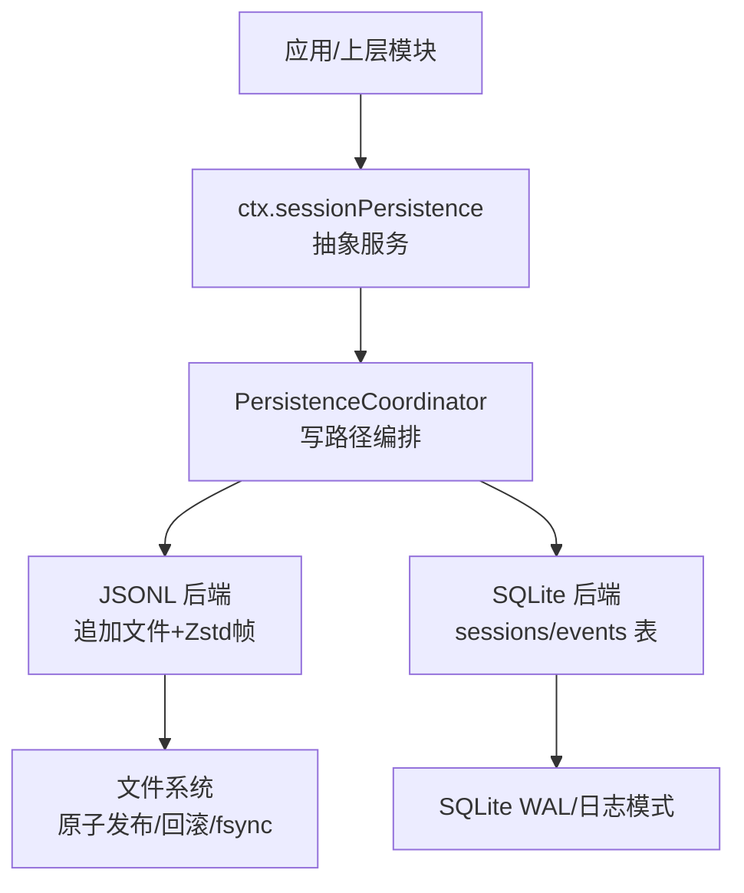
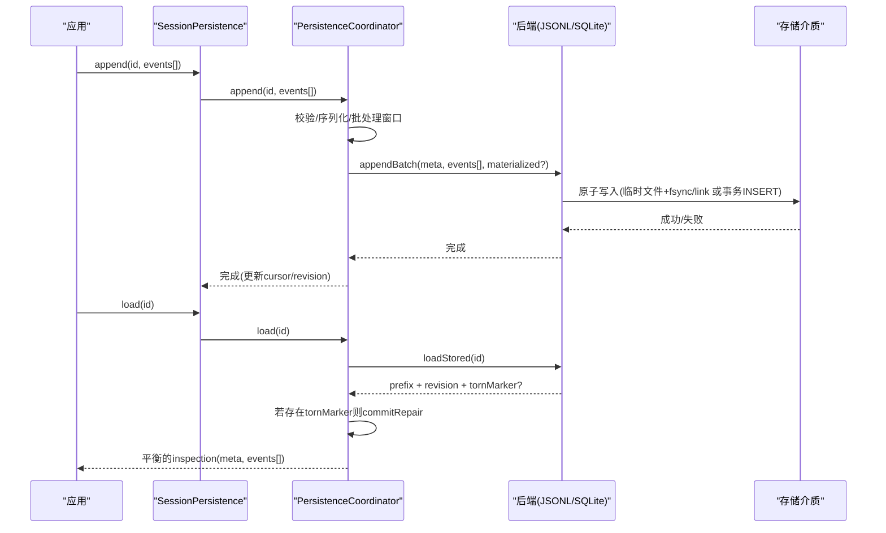
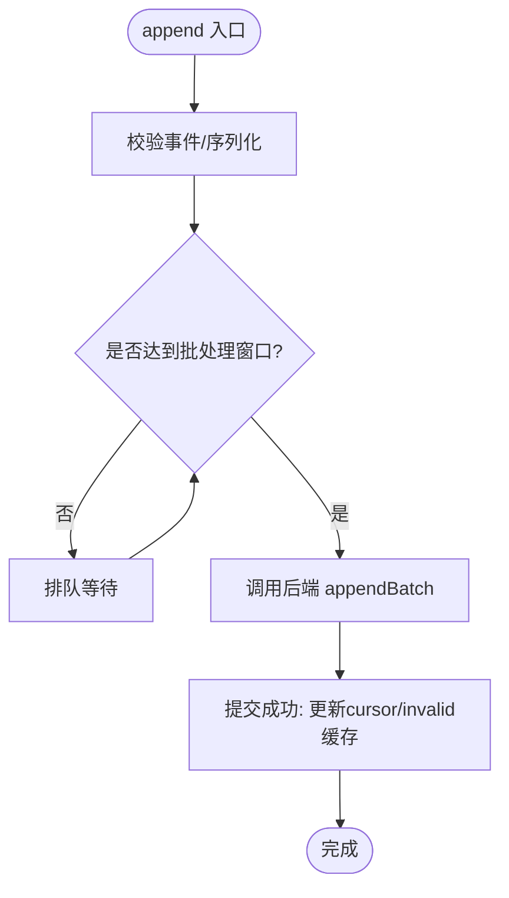
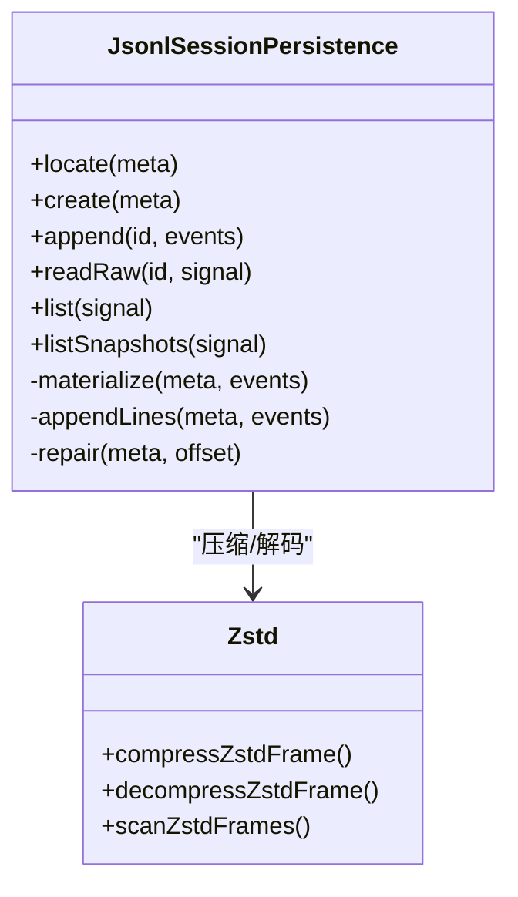
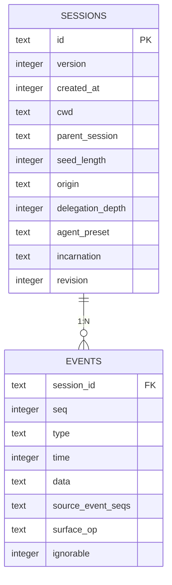
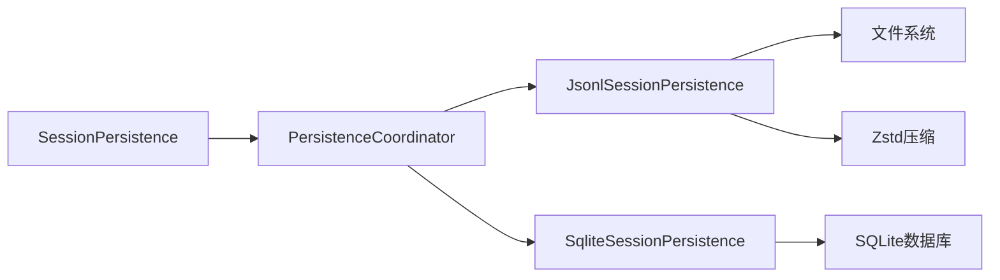

# 会话持久化接缝

<cite>
**本文引用的文件**
- [packages/session/session-persistence/src/index.ts](file://packages/session/session-persistence/src/index.ts)
- [packages/session/session-persistence/src/coordinator.ts](file://packages/session/session-persistence/src/coordinator.ts)
- [packages/session/session-persistence-jsonl/src/index.ts](file://packages/session/session-persistence-jsonl/src/index.ts)
- [packages/session/session-persistence-jsonl/src/zstd.ts](file://packages/session/session-persistence-jsonl/src/zstd.ts)
- [packages/session/session-persistence-sqlite/src/index.ts](file://packages/session/session-persistence-sqlite/src/index.ts)
- [packages/session/session-persistence-sqlite/src/schema.ts](file://packages/session/session-persistence-sqlite/src/schema.ts)
- [docs/subsystems/persistence.md](file://docs/subsystems/persistence.md)
- [.agents/notes/implemented/architecture/2026-08-08-bounded-session-persistence-write-batching.md](file://.agents/notes/implemented/architecture/2026-08-08-bounded-session-persistence-write-batching.md)
</cite>

## 目录
1. [简介](#简介)
2. [项目结构](#项目结构)
3. [核心组件](#核心组件)
4. [架构总览](#架构总览)
5. [详细组件分析](#详细组件分析)
6. [依赖关系分析](#依赖关系分析)
7. [性能考量](#性能考量)
8. [故障排查指南](#故障排查指南)
9. [结论](#结论)
10. [附录](#附录)

## 简介
本文件围绕 ctx.sessionPersistence 这一“能力接缝”展开，系统性说明其设计目标、数据模型、JSONL 与 SQLite 两种持久化实现的特点、性能对比与选型建议；并解释会话事件序列的存储格式、查询接口与压缩策略；最后给出会话恢复、备份与迁移的操作指南，以及数据一致性保证、并发控制与故障恢复机制。

## 项目结构
会话持久化由“抽象服务定义 + 共享协调器 + 两个第一方后端”构成：
- 抽象服务定义：SessionPersistence（位于 session-persistence 包），暴露 locate/create/append/prepare/load/inspect/readFrom/list/listSnapshots 等 API。
- 共享协调器：PersistenceCoordinator，负责写路径编排、批处理窗口、冷读准备复用、崩溃修复、按 id 串行化、HMR 种子注入与 dispose 排空。
- JSONL 后端：每个会话一个追加型日志文件，默认使用 Zstandard 帧压缩，支持打包连续增量事件为单行以减少体积。
- SQLite 后端：每事件一行，元数据在 sessions 表，事件在 events 表，通过 schema version 与 application id 保护数据库所有权。

图表来源
- [packages/session/session-persistence/src/index.ts:84-241](file://packages/session/session-persistence/src/index.ts#L84-L241)
- [packages/session/session-persistence/src/coordinator.ts:588-625](file://packages/session/session-persistence/src/coordinator.ts#L588-L625)
- [packages/session/session-persistence-jsonl/src/index.ts:121-164](file://packages/session/session-persistence-jsonl/src/index.ts#L121-L164)
- [packages/session/session-persistence-sqlite/src/index.ts:99-138](file://packages/session/session-persistence-sqlite/src/index.ts#L99-L138)

章节来源
- [packages/session/session-persistence/src/index.ts:84-241](file://packages/session/session-persistence/src/index.ts#L84-L241)
- [docs/subsystems/persistence.md:1-20](file://docs/subsystems/persistence.md#L1-L20)

## 核心组件
- SessionPersistence（抽象服务）
  - 职责：定义跨后端的会话持久化契约，包括定位、创建、追加、准备、加载、检查、后缀读取、轻量列举与快照。
  - 关键语义：仅追加、连续 seq、崩溃时关闭中断轮次但不重写已提交事件；提供 raw artifact 能力（JSONL 支持，SQLite 不支持）。
- PersistenceCoordinator（协调器）
  - 职责：统一写路径编排（批处理窗口、惰性物化、按 id 串行）、冷读准备缓存与复用、崩溃修复（合成收尾事件）、dispose 排空、HMR 种子注入。
  - 并发与一致性：per-id promise chain 避免同一会话写入交错；revision 用于稳定观察；torn marker 对协调器不透明，交由后端决定如何修复。
- JSONL 后端
  - 存储：每会话一个追加文件，默认以 Zstandard 帧串联；头帧独立可解码，事件帧可打包连续增量事件为单行。
  - 原子性：临时文件写入→fsync→link 或 Win32 发布；失败时回滚到之前大小，避免部分写入导致重复 seq。
  - 崩溃恢复：扫描完整帧与不完整尾帧，保留完整事件，标记 tornMarker（截断偏移与从尾帧恢复的事件）。
- SQLite 后端
  - 存储：sessions 表存元数据，events 表一事件一行；schema version 与 application id 确保数据库所有权与兼容性。
  - 崩溃恢复：scanRows 识别最后一个 turn/end 后的损坏尾部，返回 tornFrom（删除起始 seq），commitRepair 删除该尾部并可选追加合成收尾事件。

章节来源
- [packages/session/session-persistence/src/index.ts:84-241](file://packages/session/session-persistence/src/index.ts#L84-L241)
- [packages/session/session-persistence/src/coordinator.ts:588-800](file://packages/session/session-persistence/src/coordinator.ts#L588-L800)
- [packages/session/session-persistence-jsonl/src/index.ts:121-164](file://packages/session/session-persistence-jsonl/src/index.ts#L121-L164)
- [packages/session/session-persistence-jsonl/src/index.ts:606-632](file://packages/session/session-persistence-jsonl/src/index.ts#L606-L632)
- [packages/session/session-persistence-sqlite/src/schema.ts:15-271](file://packages/session/session-persistence-sqlite/src/schema.ts#L15-L271)

## 架构总览
下图展示从调用方到后端的整体流程，包括写路径批处理、冷读准备与崩溃修复。

图表来源
- [packages/session/session-persistence/src/coordinator.ts:669-710](file://packages/session/session-persistence/src/coordinator.ts#L669-L710)
- [packages/session/session-persistence/src/coordinator.ts:756-775](file://packages/session/session-persistence/src/coordinator.ts#L756-L775)
- [packages/session/session-persistence-jsonl/src/index.ts:421-444](file://packages/session/session-persistence-jsonl/src/index.ts#L421-L444)
- [packages/session/session-persistence-sqlite/src/schema.ts:220-271](file://packages/session/session-persistence-sqlite/src/schema.ts#L220-L271)

## 详细组件分析

### 抽象服务 SessionPersistence
- 设计目标
  - 以事件溯源方式持久化会话，保持事件无损且可回放。
  - 提供统一的 create/append/prepare/load/inspect/readFrom/list/listSnapshots 接口，屏蔽后端差异。
  - 支持 raw artifact 导出（JSONL 支持，SQLite 不支持），便于备份与审计。
- 关键语义
  - 仅追加：append 成功后才推进 cursor，永不重写已提交事件。
  - 崩溃恢复：load/prepare 会闭合中断轮次，但只丢弃不完整尾记录，不改动已提交事件。
  - 版本拒绝：未知或更高版本的会话日志会被拒绝，提示升级或降级方向。

章节来源
- [packages/session/session-persistence/src/index.ts:84-241](file://packages/session/session-persistence/src/index.ts#L84-L241)
- [docs/subsystems/persistence.md:9-20](file://docs/subsystems/persistence.md#L9-L20)

### 协调器 PersistenceCoordinator
- 写路径编排
  - 固定批处理窗口：首个待写事件启动窗口，后续事件加入而不重置截止时间；过期后才开始一次持久化批次。
  - 惰性物化：首次 append 时才创建物理工件（JSONL 文件头+首批事件；SQLite 插入首行）。
  - per-id 串行：同一会话的所有操作进入一条 promise chain，避免并发写入交错。
- 冷读准备与复用
  - prepare 与 inspect 共享 LRU 缓存的未发布 Session，减少重复解析、解压、验证与构造成本。
  - revision 用于稳定观察：当底层存储未变化时，多次观察返回相同 revision。
- 崩溃修复
  - 协调器将 torn marker 视为不透明值，仅判断是否存在并原样传回后端进行修复。
  - 合成收尾事件：为中断轮次补充缺失边界与错误结果，保证恢复后的逻辑视图平衡。

图表来源
- [packages/session/session-persistence/src/coordinator.ts:669-710](file://packages/session/session-persistence/src/coordinator.ts#L669-L710)
- [packages/session/session-persistence/src/coordinator.ts:588-625](file://packages/session/session-persistence/src/coordinator.ts#L588-L625)

章节来源
- [packages/session/session-persistence/src/coordinator.ts:588-800](file://packages/session/session-persistence/src/coordinator.ts#L588-L800)
- [docs/subsystems/persistence.md:9-20](file://docs/subsystems/persistence.md#L9-L20)

### JSONL 后端
- 存储格式
  - 每会话一个追加文件，默认 .jsonl.zstd；头帧独立可解码，事件帧可打包连续增量事件为单行以降低体积。
  - 编码：encodeMaterialization 将头与首批事件分别编码为帧；encodeEventBatch 将后续批次编码为帧。
- 压缩策略
  - 默认 zstd 压缩；支持 none 模式用于诊断或兼容场景。
  - 大文件读取时按帧迭代解码，必要时 yield 以避免阻塞事件循环。
- 原子性与回滚
  - 临时文件写入→fsync→link（POSIX）或 publishNewFileWin32（Windows）；失败时回滚到之前大小，避免部分写入导致重复 seq。
- 崩溃恢复
  - 扫描完整帧与不完整尾帧，保留完整事件；tornMarker 携带截断偏移与从尾帧恢复的事件；commitRepair 执行截断并追加合成收尾事件。

图表来源
- [packages/session/session-persistence-jsonl/src/index.ts:121-164](file://packages/session/session-persistence-jsonl/src/index.ts#L121-L164)
- [packages/session/session-persistence-jsonl/src/index.ts:606-632](file://packages/session/session-persistence-jsonl/src/index.ts#L606-L632)
- [packages/session/session-persistence-jsonl/src/zstd.ts:15-104](file://packages/session/session-persistence-jsonl/src/zstd.ts#L15-L104)

章节来源
- [packages/session/session-persistence-jsonl/src/index.ts:121-164](file://packages/session/session-persistence-jsonl/src/index.ts#L121-L164)
- [packages/session/session-persistence-jsonl/src/index.ts:606-632](file://packages/session/session-persistence-jsonl/src/index.ts#L606-L632)
- [packages/session/session-persistence-jsonl/src/zstd.ts:15-104](file://packages/session/session-persistence-jsonl/src/zstd.ts#L15-L104)

### SQLite 后端
- 存储格式
  - sessions 表：存储 SessionHeader 字段（id/version/createdAt/cwd/parent_session/seed_length/origin/delegation_depth/agent_preset/incarnation/revision）。
  - events 表：一事件一行（session_id/seq/type/time/data/source_event_seqs/surface_op/ignorable），主键 (session_id, seq)。
- 版本与所有权
  - SCHEMA_VERSION 与 SESSION_PERSISTENCE_SQLITE_APPLICATION_ID 保护数据库不被误用或混用。
- 崩溃恢复
  - scanRows 识别最后一个 turn/end 之后的损坏尾部，返回 preserved 与 tornFrom；commitRepair 删除从 tornFrom 开始的尾部并可选追加合成收尾事件。

图表来源
- [packages/session/session-persistence-sqlite/src/schema.ts:25-60](file://packages/session/session-persistence-sqlite/src/schema.ts#L25-L60)
- [packages/session/session-persistence-sqlite/src/schema.ts:116-147](file://packages/session/session-persistence-sqlite/src/schema.ts#L116-L147)

章节来源
- [packages/session/session-persistence-sqlite/src/schema.ts:15-271](file://packages/session/session-persistence-sqlite/src/schema.ts#L15-L271)
- [packages/session/session-persistence-sqlite/src/index.ts:99-138](file://packages/session/session-persistence-sqlite/src/index.ts#L99-L138)

## 依赖关系分析
- 抽象服务依赖协调器提供的通用编排能力；后端实现具体存储原语。
- JSONL 后端依赖文件系统原子操作与 Zstandard 压缩；SQLite 后端依赖 node:sqlite 与 schema 版本管理。
- 协调器依赖 dsh-session 的事件类型与版本机制，确保兼容性与拒绝策略。

图表来源
- [packages/session/session-persistence/src/index.ts:84-241](file://packages/session/session-persistence/src/index.ts#L84-L241)
- [packages/session/session-persistence/src/coordinator.ts:588-625](file://packages/session/session-persistence/src/coordinator.ts#L588-L625)
- [packages/session/session-persistence-jsonl/src/index.ts:121-164](file://packages/session/session-persistence-jsonl/src/index.ts#L121-L164)
- [packages/session/session-persistence-sqlite/src/index.ts:99-138](file://packages/session/session-persistence-sqlite/src/index.ts#L99-L138)

章节来源
- [packages/session/session-persistence/src/coordinator.ts:588-625](file://packages/session/session-persistence/src/coordinator.ts#L588-L625)

## 性能考量
- JSONL
  - 优点：高吞吐追加；Zstd 压缩显著降低体积；打包连续增量事件可减少行数与 I/O。
  - 缺点：顺序介质，readFrom 需解析整个工件再跳过至 fromSeq；大文件读取可能耗时。
- SQLite
  - 优点：可按 seq 直接读取后缀，适合增量投影与水印恢复；事务与索引优化查询。
  - 缺点：每事件一行，存储行数较多；WAL 模式在特定网络挂载上可能不适用，需切换为 rollback-journal 模式。
- 批处理窗口
  - 固定窗口合并事件，减少 fsync/事务次数；默认最大延迟受 Node 定时器上限约束。
- 基准参考
  - 仓库 fixtures 显示 packed rows 可将逻辑事件大幅压缩；JSONL 与 SQLite 在相同逻辑日志下的存储形态不同，但均满足一致性与恢复语义。

章节来源
- [docs/subsystems/persistence.md:231-237](file://docs/subsystems/persistence.md#L231-L237)
- [.agents/notes/implemented/architecture/2026-08-08-bounded-session-persistence-write-batching.md:13-17](file://.agents/notes/implemented/architecture/2026-08-08-bounded-session-persistence-write-batching.md#L13-L17)

## 故障排查指南
- 常见错误
  - 版本拒绝：会话日志版本高于或低于当前构建支持的版本，需升级或降级 harness。
  - 数据损坏：committed 区域出现解析错误或 seq 间隙，导致会话不可加载。
  - 并发冲突：同一 id 被重复创建或已有持久化工件，应 load/resume 而非 create。
- 调试步骤
  - 使用 readRaw（JSONL）获取原始工件文本，检查头帧与事件行。
  - 检查 SQLite 的 schema version 与 application id，确认数据库所有权。
  - 查看协调器的 revision 与 prepared 缓存，确认冷读是否命中。
- 恢复策略
  - JSONL：commitRepair 截断不完整尾帧并追加合成收尾事件。
  - SQLite：scanRows 识别 tornFrom，删除尾部并可选追加收尾事件。

章节来源
- [packages/session/session-persistence/src/coordinator.ts:35-81](file://packages/session/session-persistence/src/coordinator.ts#L35-L81)
- [packages/session/session-persistence-jsonl/src/index.ts:421-444](file://packages/session/session-persistence-jsonl/src/index.ts#L421-L444)
- [packages/session/session-persistence-sqlite/src/schema.ts:220-271](file://packages/session/session-persistence-sqlite/src/schema.ts#L220-L271)

## 结论
ctx.sessionPersistence 通过抽象服务与协调器实现了跨后端的会话持久化统一语义，JSONL 与 SQLite 在后端层分别发挥文件与数据库的优势。JSONL 适合高吞吐追加与压缩存储，SQLite 适合高效后缀读取与事务一致性。两者均遵循仅追加、崩溃恢复与版本拒绝原则，确保会话的可恢复性与一致性。

## 附录

### 数据模型与存储格式
- SessionHeader：包含版本、id、createdAt、cwd、parentSession、seedLength、origin、delegationDepth、agentPreset。
- SessionEvent：事件类型与数据，JSONL 可打包连续增量事件为单行；SQLite 一事件一行。
- JSONL 物理编码：头帧与事件帧串联，默认 zstd 压缩；支持 none 模式。
- SQLite 表结构：sessions 与 events 表，严格列类型与主键约束。

章节来源
- [docs/subsystems/persistence.md:39-90](file://docs/subsystems/persistence.md#L39-L90)
- [packages/session/session-persistence-jsonl/src/index.ts:618-632](file://packages/session/session-persistence-jsonl/src/index.ts#L618-L632)
- [packages/session/session-persistence-sqlite/src/schema.ts:25-60](file://packages/session/session-persistence-sqlite/src/schema.ts#L25-L60)

### 查询接口与压缩策略
- readFrom：从指定 seq 起读取后缀事件；SQLite 可直接 seek，JSONL 需解析并跳过。
- list/listSnapshots：轻量列举，返回 header 与 revision，不加载完整日志。
- 压缩：JSONL 默认 zstd，支持打包连续增量事件；SQLite 无压缩，依赖数据库引擎优化。

章节来源
- [packages/session/session-persistence/src/index.ts:202-228](file://packages/session/session-persistence/src/index.ts#L202-L228)
- [packages/session/session-persistence-jsonl/src/index.ts:618-632](file://packages/session/session-persistence-jsonl/src/index.ts#L618-L632)

### 会话恢复、备份与迁移
- 恢复
  - prepare/load：冷读准备并修复中断轮次，返回平衡的 inspection；prepare 可用于 resume。
  - 协调器确保 live 会话不被 crash-repair，避免破坏活跃状态。
- 备份
  - JSONL：readRaw 获取原始工件文本，便于离线归档与审计。
  - SQLite：直接复制数据库文件或使用 WAL 模式下的备份工具。
- 迁移
  - JSONL：向后兼容读取，未知版本拒绝；向前升级需升级 harness。
  - SQLite：SCHEMA_VERSION 与 application id 保护，非当前版本拒绝迁移。

章节来源
- [packages/session/session-persistence/src/coordinator.ts:720-775](file://packages/session/session-persistence/src/coordinator.ts#L720-L775)
- [packages/session/session-persistence-jsonl/src/index.ts:252-282](file://packages/session/session-persistence-jsonl/src/index.ts#L252-L282)
- [packages/session/session-persistence-sqlite/src/schema.ts:92-172](file://packages/session/session-persistence-sqlite/src/schema.ts#L92-L172)

### 数据一致性、并发控制与故障恢复
- 一致性
  - 仅追加与连续 seq 保证事件顺序；commit 后不可变。
  - 版本拒绝与损坏检测防止不一致状态被消费。
- 并发控制
  - per-id promise chain 串行化同一会话操作；批处理窗口合并写入。
  - revision 用于稳定观察，避免竞态导致的重复加载。
- 故障恢复
  - JSONL：截断不完整尾帧，保留完整事件，追加合成收尾事件。
  - SQLite：删除 tornFrom 之后尾部，追加收尾事件，保证逻辑视图平衡。

章节来源
- [packages/session/session-persistence/src/coordinator.ts:588-800](file://packages/session/session-persistence/src/coordinator.ts#L588-L800)
- [packages/session/session-persistence-jsonl/src/index.ts:421-444](file://packages/session/session-persistence-jsonl/src/index.ts#L421-L444)
- [packages/session/session-persistence-sqlite/src/schema.ts:220-271](file://packages/session/session-persistence-sqlite/src/schema.ts#L220-L271)