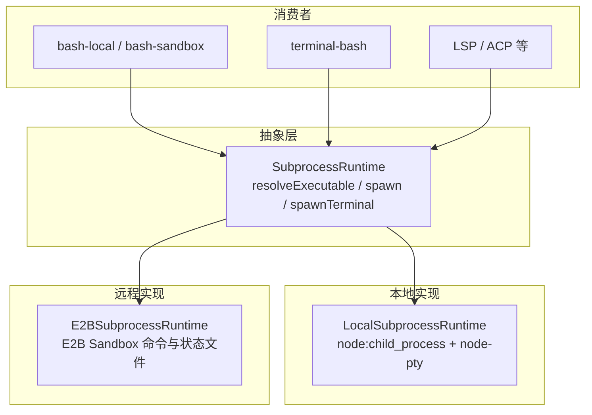
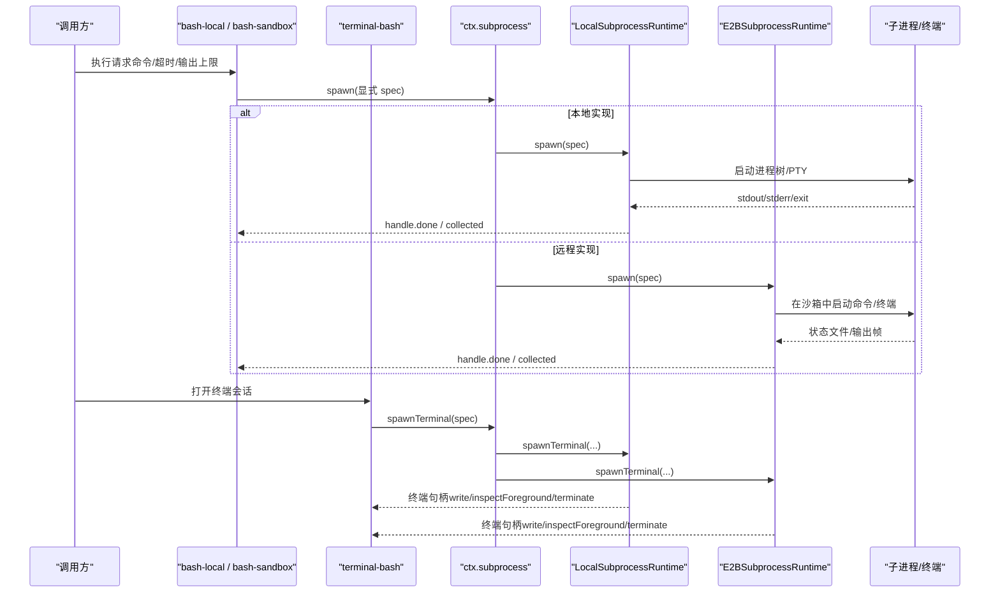
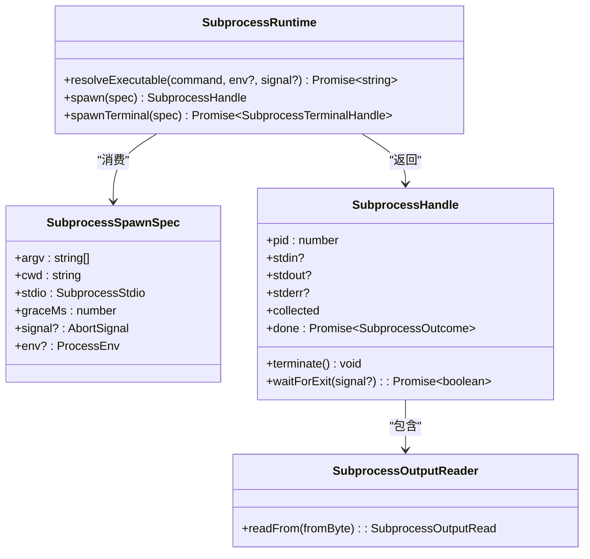
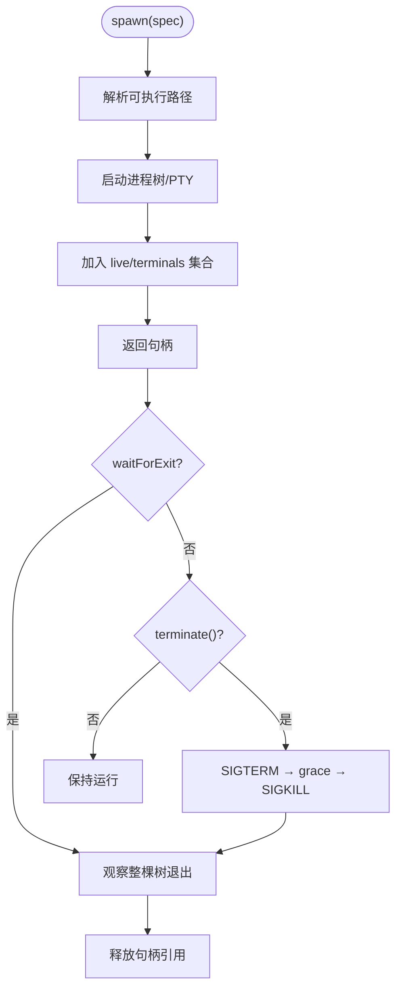
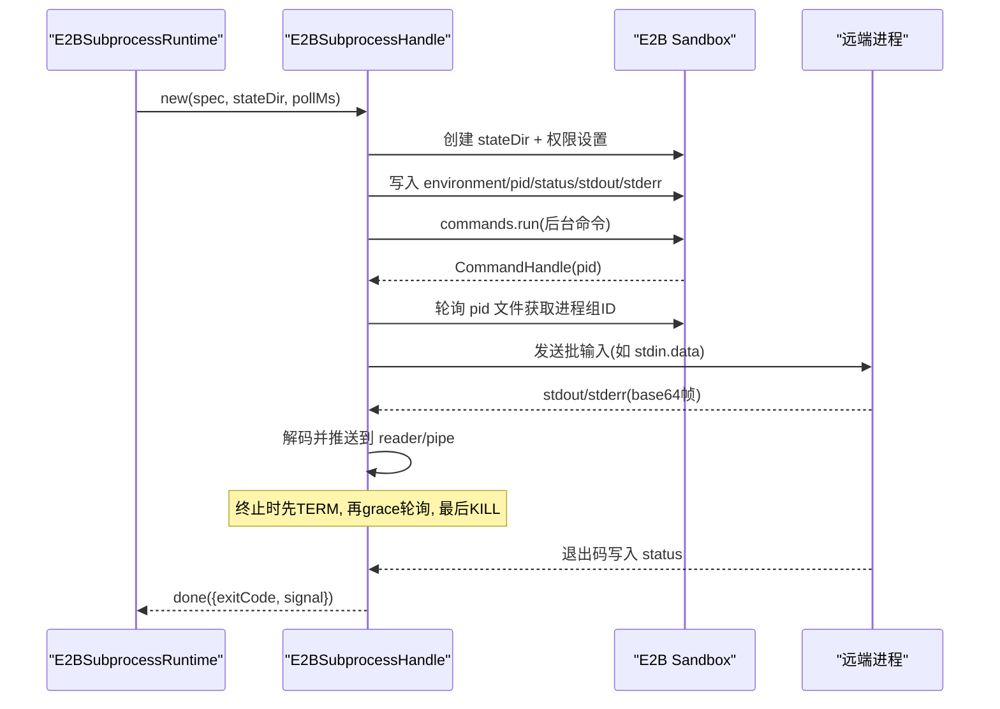
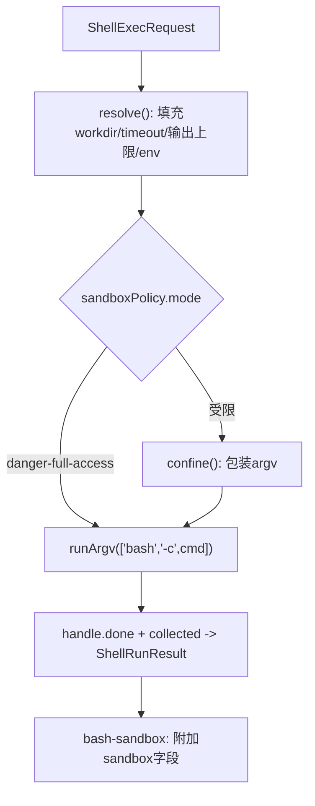
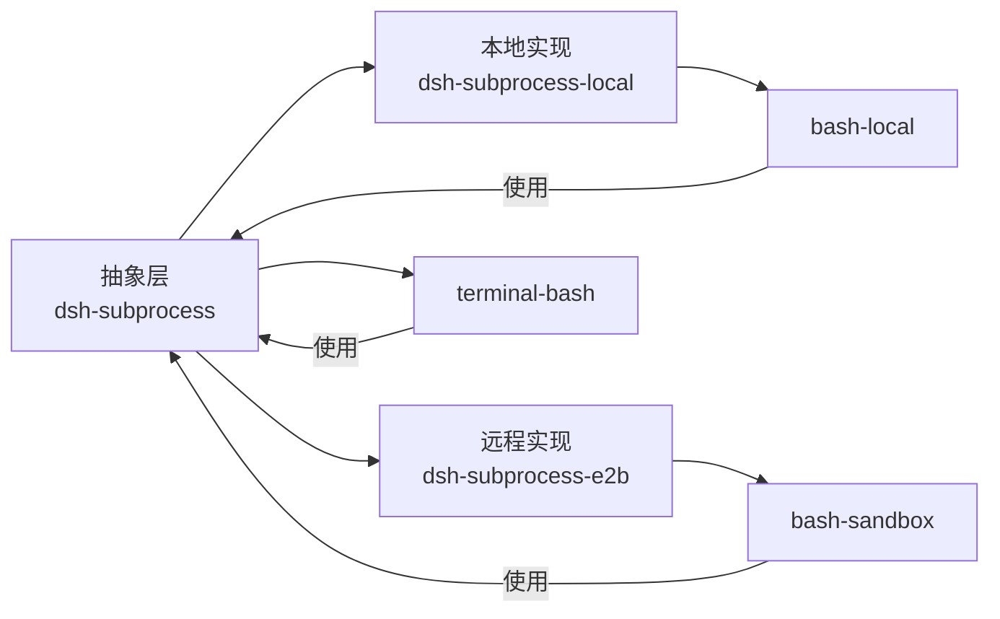

# 子进程接缝

<cite>
**本文引用的文件**
- [subprocess.md](file://docs/subsystems/subprocess.md)
- [index.ts（抽象服务定义）](file://packages/subprocess/subprocess/src/index.ts)
- [types.ts（类型与契约）](file://packages/subprocess/subprocess/src/types.ts)
- [index.ts（本地实现）](file://packages/subprocess/subprocess-local/src/index.ts)
- [spawn.ts（本地启动细节）](file://packages/subprocess/subprocess-local/src/spawn.ts)
- [terminal.ts（本地终端）](file://packages/subprocess/subprocess-local/src/terminal.ts)
- [process-inspector.ts（本地进程检查）](file://packages/subprocess/subprocess-local/src/process-inspector.ts)
- [index.ts（E2B 实现）](file://packages/e2b/subprocess-e2b/src/index.ts)
- [process.ts（E2B 进程句柄）](file://packages/e2b/subprocess-e2b/src/process.ts)
- [remote.ts（E2B 远程工具）](file://packages/e2b/subprocess-e2b/src/remote.ts)
- [environment.ts（E2B 环境引导）](file://packages/e2b/subprocess-e2b/src/environment.ts)
- [output.ts（E2B 输出解码）](file://packages/e2b/subprocess-e2b/src/output.ts)
- [index.ts（bash-local 执行器）](file://packages/shell/bash-local/src/index.ts)
- [index.ts（bash-sandbox 执行器）](file://packages/shell/bash-sandbox/src/index.ts)
- [index.ts（terminal-bash 后端）](file://packages/terminal/terminal-bash/src/index.ts)
</cite>

## 目录
1. [简介](#简介)
2. [项目结构](#项目结构)
3. [核心组件](#核心组件)
4. [架构总览](#架构总览)
5. [详细组件分析](#详细组件分析)
6. [依赖关系分析](#依赖关系分析)
7. [性能考量](#性能考量)
8. [故障排查指南](#故障排查指南)
9. [结论](#结论)
10. [附录：使用指南](#附录使用指南)

## 简介
本文件系统性梳理“子进程接缝”的设计与实现，覆盖抽象接口、本地实现（subprocess-local）、远程实现（subprocess-e2b），以及与 Bash 执行器（bash-local、bash-sandbox）和终端后端（terminal-bash）的协作方式。重点说明：
- 设计理念：无默认、全显式配置；受管环境变量命名空间；可恢复的输出收集；树级终止与等待。
- 生命周期管理：立即返回句柄、退出事实分离、grace 期升级终止、完整进程组观察。
- 资源监控：内存尾缓冲 + 可选溢出文件；远程侧通过状态目录与轮询保证一致性。
- 信号处理与异常恢复：SIGTERM→grace→SIGKILL；失败回滚；沙箱不可用时的明确错误分类。
- 安全隔离：凭据清洗、DSH_* 命名空间、路径解析限制、远程进程组校验。

## 项目结构
子进程能力由“抽象服务定义 + 多实现 + 消费者”构成：
- 抽象层：SubprocessRuntime 暴露 resolveExecutable、spawn、spawnTerminal 三个方法，并定义句柄、规格、输出收集等类型。
- 本地实现：LocalSubprocessRuntime 基于 Node 子进程与 node-pty，提供进程树管理、stdio 分流、凭据清洗、grace 期终止。
- E2B 实现：E2BSubprocessRuntime 在远端沙箱中启动命令，通过状态文件与轮询协调进程组、输出与清理。
- 消费者：bash-local/bash-sandbox 作为 Bash 执行器；terminal-bash 作为交互式终端后端；LSP/ACP 等通过原始管道或 ndjson 集成。

图表来源
- [index.ts（抽象服务定义）:102-140](file://packages/subprocess/subprocess/src/index.ts#L102-L140)
- [index.ts（本地实现）:37-184](file://packages/subprocess/subprocess-local/src/index.ts#L37-L184)
- [index.ts（E2B 实现）:52-205](file://packages/e2b/subprocess-e2b/src/index.ts#L52-L205)

章节来源
- [subprocess.md:1-325](file://docs/subsystems/subprocess.md#L1-L325)
- [index.ts（抽象服务定义）:1-143](file://packages/subprocess/subprocess/src/index.ts#L1-L143)

## 核心组件
- 抽象服务 SubprocessRuntime
  - 职责：定义执行世界坐标、可执行解析、普通进程与终端进程原语；不注入默认行为，所有处置由调用方显式指定。
  - 关键语义：
    - 可执行路径属于与文件系统提供者共享的执行世界。
    - spawn 立即返回句柄；done 仅在进程关闭时解析退出事实，拒绝仅发生在 spawn 级别失败。
    - collect 模式为偏移读取、非消耗型；pipe 模式直通给调用方；inherit 透传到父进程。
    - terminate 唯一终止动词，SIGTERM→grace→SIGKILL，跨平台树级作用域。
    - dispose 时终止所有受管进程并等待退出。
    - spawnTerminal 拥有终端分配、文本传输、前台进程组、信号与整会话清理。
- 本地实现 LocalSubprocessRuntime
  - 职责：以 detached 进程树运行，按每流处置连接 stdio，凭据清洗环境，grace 期升级终止，主机退出时强制收尾。
  - 特性：
    - resolveExecutable 支持绝对路径验证与 PATH 查找，拒绝相对路径。
    - spawn 将句柄加入 live set，直到整个进程树退出才释放所有权。
    - spawnTerminal 基于 node-pty 分配真实终端，维护 terminals 集合并在完成时清理。
- E2B 实现 E2BSubprocessRuntime
  - 职责：在远端沙箱中启动命令，维护状态目录（pid/status/environment/stdout/stderr），通过轮询与信号协调生命周期。
  - 特性：
    - resolveExecutable 在沙箱内校验绝对路径或使用 command -v 解析 PATH。
    - spawn 创建随机 stateDir，构造 E2BSubprocessHandle，记录 live 集合。
    - spawnTerminal 异步分配终端，支持服务销毁期间的中断与重试。
    - 终止流程：先 TERM，再 grace 期内轮询，最后 KILL 并二次确认。

章节来源
- [index.ts（抽象服务定义）:74-140](file://packages/subprocess/subprocess/src/index.ts#L74-L140)
- [index.ts（本地实现）:37-184](file://packages/subprocess/subprocess-local/src/index.ts#L37-L184)
- [index.ts（E2B 实现）:52-205](file://packages/e2b/subprocess-e2b/src/index.ts#L52-L205)

## 架构总览
下图展示从调用方到具体实现的端到端流程，包括 Bash 执行器与终端后端的接入点。

图表来源
- [index.ts（本地实现）:146-184](file://packages/subprocess/subprocess-local/src/index.ts#L146-L184)
- [index.ts（E2B 实现）:140-205](file://packages/e2b/subprocess-e2b/src/index.ts#L140-L205)
- [index.ts（bash-local 执行器）:173-240](file://packages/shell/bash-local/src/index.ts#L173-L240)
- [index.ts（terminal-bash 后端）](file://packages/terminal/terminal-bash/src/index.ts)

## 详细组件分析

### 抽象服务与类型契约
- 设计要点
  - 无默认：所有处置（stdin/stdout/stderr/grace/cwd/env/signal）必须显式传入。
  - 环境变量：DSH_* 命名空间受 Harness 管理；scrubbedParentEnv 过滤敏感键名。
  - 输出收集：collect 模式提供 maxBytes 内存尾与可选 spill 文件；reader 基于字节偏移，互不干扰。
  - 句柄：handle.stdin/stdout/stderr 按需存在；collected 用于 collect 模式；done 仅携带 exitCode/signal。
  - 终止：terminate 是唯一切口，SIGTERM→grace→SIGKILL；waitForExit 观察整棵进程树。
- 复杂度与约束
  - 输出 reader 的 readFrom 为 O(1) 增量读取；spill 文件用于恢复丢失头部。
  - graceMs 需为正有限值且不超过系统定时器上限，避免无法到达强制终止。

图表来源
- [index.ts（抽象服务定义）:102-140](file://packages/subprocess/subprocess/src/index.ts#L102-L140)
- [types.ts（类型与契约）](file://packages/subprocess/subprocess/src/types.ts)

章节来源
- [subprocess.md:13-245](file://docs/subsystems/subprocess.md#L13-L245)
- [index.ts（抽象服务定义）:37-140](file://packages/subprocess/subprocess/src/index.ts#L37-L140)

### 本地实现（subprocess-local）
- 可执行解析
  - 绝对路径：stat + X_OK 验证。
  - 裸名：基于 scrubbed PATH 与 PATHEXT（Windows）候选列表逐一尝试。
  - 相对路径：直接拒绝，防止隐式工作目录猜测。
- 进程生命周期
  - spawn 立即返回句柄；将句柄加入 live set，直到 waitForExit 证明整棵树退出才释放。
  - 主机退出钩子：遍历 live 与 terminals 调用 terminateForHostExit，确保最终终止。
- 终端进程
  - 使用 node-pty 分配 PTY；记录 terminals 集合；done/terminate 完成后移除。
- 信号与终止
  - 统一 SIGTERM→grace→SIGKILL；waitForExit 观察整棵树，便于上层构建 teardown ladder。

图表来源
- [index.ts（本地实现）:104-184](file://packages/subprocess/subprocess-local/src/index.ts#L104-L184)
- [spawn.ts（本地启动细节）](file://packages/subprocess/subprocess-local/src/spawn.ts)
- [terminal.ts（本地终端）](file://packages/subprocess/subprocess-local/src/terminal.ts)

章节来源
- [index.ts（本地实现）:37-196](file://packages/subprocess/subprocess-local/src/index.ts#L37-L196)

### 远程实现（subprocess-e2b）
- 可执行解析
  - 绝对路径：在沙箱内 test -f -x 验证。
  - 裸名：通过 PATH 执行 command -v 解析，必要时结合 cwd 归一化。
- 进程生命周期
  - 创建私有 stateDir 存放 pid/status/environment/stdout/stderr。
  - 启动后台命令，延迟获取远程 PID；写入状态文件后发布进程组 ID。
  - 轮询 groupAlive 直至退出；grace 期内等待输出排空，否则断开并标记 drain 过期。
- 输出与恢复
  - 输出经 base64 帧传输；collect 模式同时写内存尾与 spill 文件；结束时根据 size 与阈值决定是否保留 spill。
- 终止与回滚
  - terminateRemoteInSandbox 先 TERM，再 KILL；若未发布进程组则回滚到 SDK PID 并 kill。
  - 失败路径会尝试清理私有状态目录与环境文件。

图表来源
- [process.ts（E2B 进程句柄）:158-699](file://packages/e2b/subprocess-e2b/src/process.ts#L158-L699)
- [index.ts（E2B 实现）:140-205](file://packages/e2b/subprocess-e2b/src/index.ts#L140-L205)
- [remote.ts（E2B 远程工具）](file://packages/e2b/subprocess-e2b/src/remote.ts)
- [environment.ts（E2B 环境引导）](file://packages/e2b/subprocess-e2b/src/environment.ts)
- [output.ts（E2B 输出解码）](file://packages/e2b/subprocess-e2b/src/output.ts)

章节来源
- [index.ts（E2B 实现）:24-205](file://packages/e2b/subprocess-e2b/src/index.ts#L24-L205)
- [process.ts（E2B 进程句柄）:158-699](file://packages/e2b/subprocess-e2b/src/process.ts#L158-L699)

### Bash 执行器（bash-local, bash-sandbox）
- bash-local
  - 职责：将 ShellExecRequest 映射为 SubprocessSpawnSpec；设置 collect 模式的输出上限与 spill 上限；合并模型友好环境变量（NO_COLOR、TERM=dumb、PAGER=cat）。
  - 前台 run：使用 deadline 组合超时与取消；根据 timeoutOf 区分 timedOut 与 aborted；返回 CollectedOutput。
  - 后台 start：返回 ShellProcess，聚合 stdout/stderr 增量输出；kill 调用 terminate；done 时标注 completed/killed。
- bash-sandbox
  - 职责：在 resolve/run/start 中注入 per-call sandboxPolicy；对危险模式放行，其他模式通过 ctx.sandbox.confine 包装 argv。
  - 结果增强：result.sandbox 报告 mode/enforcement/denied；runnerFailed 优先于 denial。
  - 错误分类：将 runner 启动失败转换为 SandboxUnavailableError。

图表来源
- [index.ts（bash-local 执行器）:146-240](file://packages/shell/bash-local/src/index.ts#L146-L240)
- [index.ts（bash-sandbox 执行器）:84-167](file://packages/shell/bash-sandbox/src/index.ts#L84-L167)

章节来源
- [index.ts（bash-local 执行器）:20-334](file://packages/shell/bash-local/src/index.ts#L20-L334)
- [index.ts（bash-sandbox 执行器）:1-183](file://packages/shell/bash-sandbox/src/index.ts#L1-L183)

### 终端后端（terminal-bash）
- 职责：通过 ctx.subprocess.spawnTerminal 分配真实终端，负责 UTF-8 文本传输、前台进程组检测与信号、以及会话级终止。
- 与子进程接缝的关系：
  - 普通 spawn 不适合重建控制终端语义；terminal-bash 依赖 spawnTerminal 提供的会话级能力。
  - 就绪性推断、滚动历史、持久会话策略位于 terminal-bash 自身；子进程实现只关注底层 I/O 与生命周期。

章节来源
- [subprocess.md:241-249](file://docs/subsystems/subprocess.md#L241-L249)
- [index.ts（terminal-bash 后端）](file://packages/terminal/terminal-bash/src/index.ts)

## 依赖关系分析
- 耦合与内聚
  - 抽象层与实现解耦：通过 SubprocessRuntime 抽象，本地与 E2B 实现可替换。
  - 执行器与实现解耦：bash-local/bash-sandbox 仅依赖抽象接口，不感知本地或远程差异。
  - 终端后端与实现解耦：terminal-bash 通过 spawnTerminal 获得一致语义。
- 外部依赖
  - 本地：node:child_process、node:path、node-pty。
  - 远程：@deepseek-ai/dsh-e2b（Sandbox/CommandHandle）、状态文件与 shell 工具链。
- 循环依赖
  - 未见循环导入；各包职责清晰，依赖方向单向。

图表来源
- [index.ts（抽象服务定义）:102-140](file://packages/subprocess/subprocess/src/index.ts#L102-L140)
- [index.ts（本地实现）:37-184](file://packages/subprocess/subprocess-local/src/index.ts#L37-L184)
- [index.ts（E2B 实现）:52-205](file://packages/e2b/subprocess-e2b/src/index.ts#L52-L205)
- [index.ts（bash-local 执行器）:102-170](file://packages/shell/bash-local/src/index.ts#L102-L170)
- [index.ts（bash-sandbox 执行器）:44-86](file://packages/shell/bash-sandbox/src/index.ts#L44-L86)

章节来源
- [index.ts（抽象服务定义）:102-140](file://packages/subprocess/subprocess/src/index.ts#L102-L140)
- [index.ts（本地实现）:37-184](file://packages/subprocess/subprocess-local/src/index.ts#L37-L184)
- [index.ts（E2B 实现）:52-205](file://packages/e2b/subprocess-e2b/src/index.ts#L52-L205)

## 性能考量
- 输出收集
  - 内存尾缓冲减少 I/O 开销；spill 文件仅在超限或需要完整恢复时使用。
  - 远程侧通过 head/tee 管道限制 spill 大小，避免大输出拖垮网络与存储。
- 轮询与超时
  - E2B 实现使用 pollMs 轮询状态文件与进程组存活；graceMs 控制输出排空与强制终止窗口。
- 资源限制
  - 建议为每个调用设置合理的 maxOutputBytes/maxSpillBytes/graceMs，避免内存与磁盘压力。
- 并发与背压
  - pipe 模式直通给调用方，注意下游消费速度；collect 模式内部缓冲，避免阻塞上游。

[本节为通用指导，无需特定文件来源]

## 故障排查指南
- 常见错误与定位
  - 可执行未找到：检查 resolveExecutable 是否接受绝对路径或 PATH 中是否存在；E2B 侧确认 command -v 结果。
  - 进程未退出：确认 terminate 已调用；检查 graceMs 是否合理；E2B 侧查看 groupAlive 轮询与 forceKillGroup 日志。
  - 输出截断：collect 模式 lossy=true 表示头部丢失；通过 spillPath 恢复完整输出。
  - 沙箱不可用：bash-sandbox 将 runner 启动失败转换为 SandboxUnavailableError；检查 policy 与 runner 程序可用性。
- 调试技巧
  - 启用 collect 模式并设置 spill，以便事后分析完整输出。
  - 在 E2B 环境中打印进程组信息（ps -o pgid=）辅助诊断僵尸进程。
  - 使用 AbortSignal 追踪取消路径，区分 timedOut 与 aborted。
- 恢复策略
  - 服务 dispose 时会终止所有受管进程并等待退出；若仍有残留，检查 host-exit 钩子与同步终止路径。
  - E2B 失败路径会尝试清理私有状态目录与环境文件，避免泄漏。

章节来源
- [index.ts（本地实现）:79-102](file://packages/subprocess/subprocess-local/src/index.ts#L79-L102)
- [process.ts（E2B 进程句柄）:584-699](file://packages/e2b/subprocess-e2b/src/process.ts#L584-L699)
- [index.ts（bash-sandbox 执行器）:88-167](file://packages/shell/bash-sandbox/src/index.ts#L88-L167)

## 结论
子进程接缝通过“抽象 + 多实现”的方式，将执行世界的差异隐藏在后端，向上游提供一致的进程与终端原语。其核心价值在于：
- 明确的边界与契约：无默认、全显式配置，降低隐式行为带来的风险。
- 健壮的生命周期管理：树级终止与等待，确保资源回收与可观测性。
- 可恢复的输出机制：内存尾 + spill 文件，兼顾性能与完整性。
- 安全隔离：凭据清洗、路径解析限制、远程进程组校验，有效防止泄露与越权。
- 可扩展性：本地与远程实现可互换，执行器与终端后端无需感知差异。

[本节为总结，无需特定文件来源]

## 附录：使用指南
- Bash 执行器（bash-local）
  - 适用场景：本地开发、CI 中的批量命令执行；需要可控输出与超时。
  - 关键配置：timeoutMs、maxTimeoutMs、maxOutputBytes、maxSpillBytes、graceMs。
  - 最佳实践：为长输出设置 spill；合理设置 graceMs 避免僵尸进程。
- Bash 执行器（bash-sandbox）
  - 适用场景：需要沙箱隔离的命令执行；自动注入 per-call policy。
  - 关键行为：danger-full-access 模式绕过封装；其他模式通过 confine 包装 argv。
  - 最佳实践：为高风险命令启用受限模式；关注 result.sandbox 的 denied/runnerFailed。
- 终端后端（terminal-bash）
  - 适用场景：交互式会话、需要控制终端语义的场景。
  - 关键能力：UTF-8 文本传输、前台进程组检测、会话级终止。
  - 最佳实践：合理设置 rows/cols；利用 inspectForeground 与 signalForeground 进行交互。
- 进程安全隔离与资源限制
  - 环境变量：依赖 scrubbedParentEnv 过滤敏感键；显式 dshEnv 覆盖需谨慎。
  - 路径解析：始终使用绝对路径或裸名；避免相对路径导致的工作目录歧义。
  - 资源上限：为每个调用设置合理的输出与 spill 上限；graceMs 不超过系统定时器上限。
- 调试技巧
  - 使用 collect 模式 + spill 捕获完整输出；通过 lossy 判断是否截断。
  - 在 E2B 环境中检查状态文件（pid/status/environment）与进程组存活情况。
  - 结合 AbortSignal 与 timeoutOf 区分超时与取消原因。

章节来源
- [index.ts（bash-local 执行器）:146-240](file://packages/shell/bash-local/src/index.ts#L146-L240)
- [index.ts（bash-sandbox 执行器）:84-167](file://packages/shell/bash-sandbox/src/index.ts#L84-L167)
- [subprocess.md:241-249](file://docs/subsystems/subprocess.md#L241-L249)