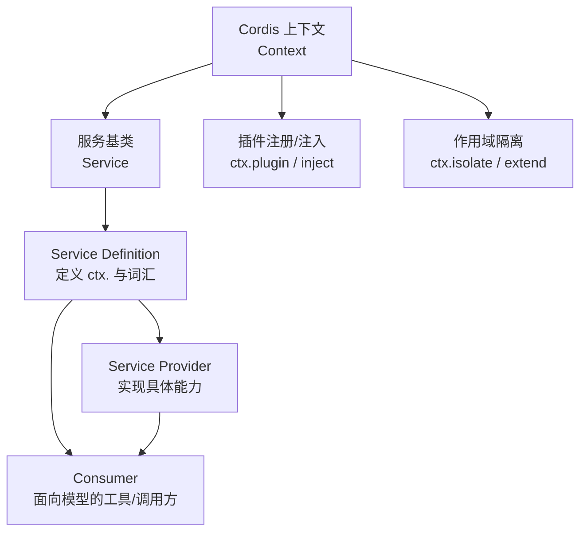
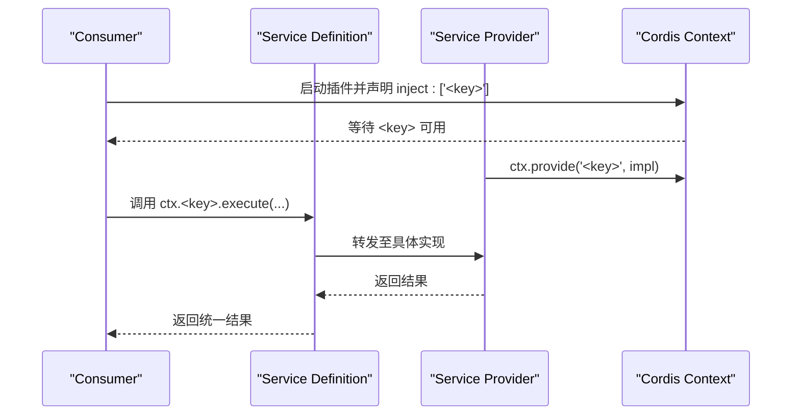
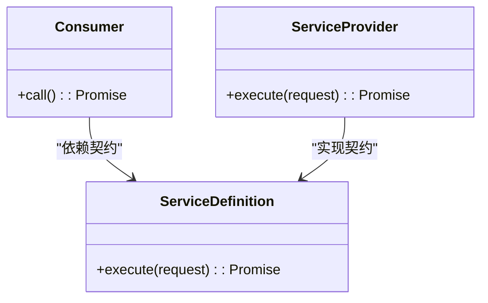
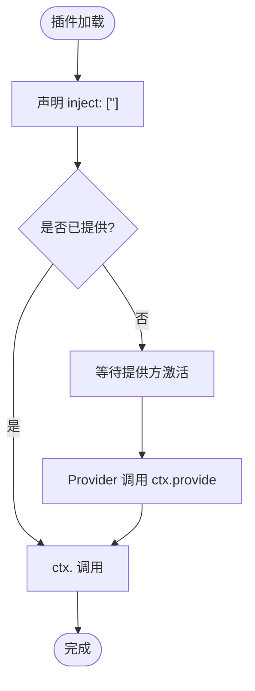
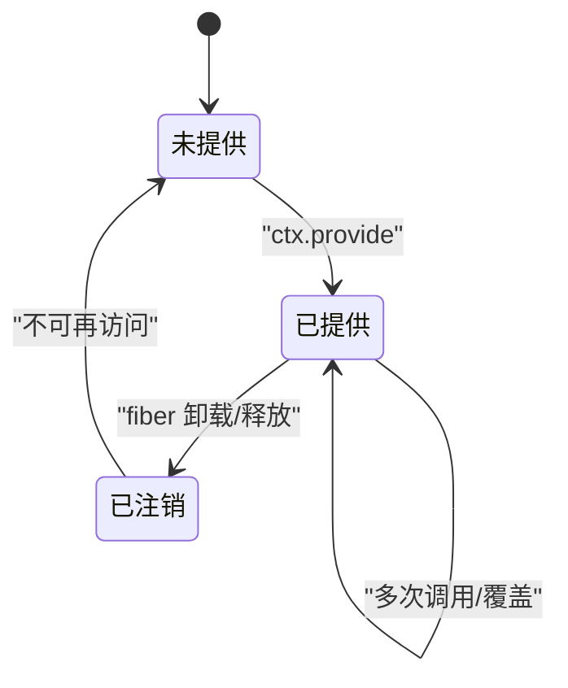
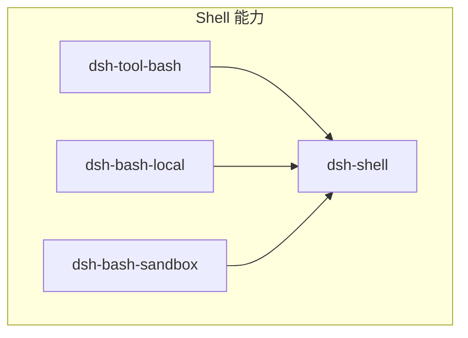

# 接缝架构原理

<cite>
**本文引用的文件**
- [docs/capability-seams.md](file://docs/capability-seams.md)
- [docs/capability-seams.zh.md](file://docs/capability-seams.zh.md)
- [docs/cordis-api/service.md](file://docs/cordis-api/service.md)
- [docs/cordis-api/context.md](file://docs/cordis-api/context.md)
- [docs/user/develop/practice/index.md](file://docs/user/develop/practice/index.md)
- [docs/user/develop/practice/index.zh.md](file://docs/user/develop/practice/index.zh.md)
- [docs/testing.md](file://docs/testing.md)
- [.agents/notes/implemented/architecture/2026-06-13-capability-seams.md](file://.agents/notes/implemented/architecture/2026-06-13-capability-seams.md)
</cite>

## 目录
1. [引言](#引言)
2. [项目结构](#项目结构)
3. [核心组件](#核心组件)
4. [架构总览](#架构总览)
5. [详细组件分析](#详细组件分析)
6. [依赖关系分析](#依赖关系分析)
7. [性能考量](#性能考量)
8. [故障排查指南](#故障排查指南)
9. [结论](#结论)
10. [附录：接缝开发指南](#附录：接缝开发指南)

## 引言
本文件系统性阐述 Harness 的“能力接缝（Capability Seams）”架构原理。围绕 Service Definition、Service Provider 与 Consumer 三角色分离，解释 ctx 键值对如何实现服务发现与解耦，并说明该设计如何支撑模块化与可替换性。同时覆盖接缝的生命周期管理、依赖注入与作用域隔离，并提供完整的开发指南、测试策略以及版本兼容与向后迁移策略。

## 项目结构
- 能力接缝的全景由文档自动生成图与表格维护，涵盖每个 ctx key 的角色、拥有者、实现包与直接消费方。
- Cordis 框架提供 Context、Service、事件、插件注册等基础能力，是接缝机制的运行基座。
- 用户实践文档给出“三种角色能力模式”的概念参考与示例，便于从零构建一个可替换的能力。



图表来源
- [docs/cordis-api/context.md:14-66](file://docs/cordis-api/context.md#L14-L66)
- [docs/cordis-api/service.md:4-12](file://docs/cordis-api/service.md#L4-L12)

章节来源
- [docs/capability-seams.md:1-472](file://docs/capability-seams.md#L1-L472)
- [docs/capability-seams.zh.md:1-474](file://docs/capability-seams.zh.md#L1-L474)
- [docs/cordis-api/context.md:1-365](file://docs/cordis-api/context.md#L1-L365)
- [docs/cordis-api/service.md:1-103](file://docs/cordis-api/service.md#L1-L103)

## 核心组件
- 能力接缝（Seam）：一项可替换能力的完整集合，包含 Service Definition、Service Provider、Consumer。seam 不是单一接口，而是三者构成的能力边界。
- Service Definition：以 Cordis Service 形式声明 ctx.<key> 与领域词汇（请求/结果类型），不依赖具体实现。
- Service Provider：实现或注册到 Service Definition 的具体提供方，如本地执行器、远程执行器、不同 LLM 适配器。
- Consumer：面向模型或上层插件的消费端，通过 inject 声明依赖，仅依赖 Service Definition 暴露的契约。

关键要点
- 角色职责清晰：Definition 稳定契约；Provider 独立演进；Consumer 专注呈现与编排。
- 通过 ctx 键值对进行服务发现与解耦：消费者通过 ctx.<key> 访问能力，无需感知具体实现。
- 可替换性：同一 Definition 下可存在多个 Provider，组合时选择其一。

章节来源
- [.agents/notes/implemented/architecture/2026-06-13-capability-seams.md:7-34](file://.agents/notes/implemented/architecture/2026-06-13-capability-seams.md#L7-L34)
- [docs/user/develop/practice/index.md:7-56](file://docs/user/develop/practice/index.md#L7-L56)
- [docs/user/develop/practice/index.zh.md:7-56](file://docs/user/develop/practice/index.zh.md#L7-L56)

## 架构总览
下图展示典型能力接缝在运行时的交互：Consumer 通过 inject 声明对 Service Definition 的依赖；Provider 在运行时将实现注册到 ctx；调用路径始终经过稳定的契约层，屏蔽实现差异。



图表来源
- [docs/cordis-api/context.md:237-314](file://docs/cordis-api/context.md#L237-L314)
- [docs/cordis-api/service.md:4-12](file://docs/cordis-api/service.md#L4-L12)
- [docs/user/develop/practice/index.zh.md:111-145](file://docs/user/develop/practice/index.zh.md#L111-L145)

## 详细组件分析

### 角色与职责分离
- Service Definition：定义 ctx.<key> 与领域类型，作为稳定契约。
- Service Provider：实现具体行为，关注性能、安全与平台适配。
- Consumer：面向模型的工具或上层逻辑，关注编排与呈现。



图表来源
- [docs/user/develop/practice/index.zh.md:60-138](file://docs/user/develop/practice/index.zh.md#L60-L138)

章节来源
- [docs/user/develop/practice/index.md:7-56](file://docs/user/develop/practice/index.md#L7-L56)
- [docs/user/develop/practice/index.zh.md:7-56](file://docs/user/develop/practice/index.zh.md#L7-L56)

### 基于 ctx 的服务发现与解耦
- 使用 ctx.get(name, strict?) 读取服务，支持严格模式确保提供方 fiber 活跃。
- 使用 ctx.provide(name, value) 注册服务实现，生命周期绑定到当前 fiber。
- 通过 inject 声明硬依赖，Cordis 会在提供方就绪前挂起消费者。



图表来源
- [docs/cordis-api/context.md:237-314](file://docs/cordis-api/context.md#L237-L314)

章节来源
- [docs/cordis-api/context.md:237-314](file://docs/cordis-api/context.md#L237-L314)

### 生命周期管理与作用域隔离
- 服务随 fiber 生命周期自动注册与注销，避免资源泄漏。
- ctx.extend 创建子上下文并叠加元数据；ctx.isolate 为指定服务创建独立作用域，允许在同一进程内切换实现而不影响父作用域。
- ctx.intercept 可为特定服务注入拦截配置，用于测试或环境差异化。



图表来源
- [docs/cordis-api/context.md:14-66](file://docs/cordis-api/context.md#L14-L66)
- [docs/cordis-api/context.md:286-314](file://docs/cordis-api/context.md#L286-L314)

章节来源
- [docs/cordis-api/context.md:14-66](file://docs/cordis-api/context.md#L14-L66)
- [docs/cordis-api/context.md:286-314](file://docs/cordis-api/context.md#L286-L314)

### 能力接缝全景与实例
- 全量 ctx key 列表、角色分类、拥有者与实现包、直接消费方均在能力接缝文档中维护，可作为权威参考。
- 例如 shell 能力：dsh-shell（Definition）、dsh-bash-local（Provider）、dsh-tool-bash（Consumer）。

```mermaid
graph LR
Def["dsh-shell<br/>Service Definition"] --> Prov["dsh-bash-local<br/>Service Provider"]
Def --> Cons["dsh-tool-bash<br/>Consumer"]
Cons --> |inject: ['shell']| Def
```

图表来源
- [docs/user/develop/practice/index.zh.md:11-27](file://docs/user/develop/practice/index.zh.md#L11-L27)
- [docs/capability-seams.zh.md:414-474](file://docs/capability-seams.zh.md#L414-L474)

章节来源
- [docs/capability-seams.md:1-472](file://docs/capability-seams.md#L1-L472)
- [docs/capability-seams.zh.md:1-474](file://docs/capability-seams.zh.md#L1-L474)

## 依赖关系分析
- 低耦合：Provider 与 Consumer 互不依赖，均只依赖 Definition。
- 可替换：通过 cordis.yml 选择 Provider，不影响 Consumer 与 Definition。
- 可观测：能力接缝文档中的图与表明确每个服务的拥有者、实现与消费方，便于定位依赖链。



图表来源
- [docs/user/develop/practice/index.zh.md:11-27](file://docs/user/develop/practice/index.zh.md#L11-L27)

章节来源
- [docs/user/develop/practice/index.md:29-56](file://docs/user/develop/practice/index.md#L29-L56)

## 性能考量
- 服务解析与注入在 fiber 激活时完成，避免不必要的初始化开销。
- 通过 isolate 隔离作用域，可在同一进程中并行运行不同实现而互不干扰。
- 建议仅在必要时拆分角色，避免过度抽象带来的间接调用成本。

[本节为通用指导，不直接分析具体文件]

## 故障排查指南
- 服务未找到：检查是否正确声明 inject，并确保 Provider 已在相同作用域内通过 ctx.provide 注册。
- 作用域冲突：确认是否误用 isolate 或未共享 label，导致不同作用域下的服务解析不一致。
- 生命周期问题：确保 Provider 所在 fiber 保持活跃；fiber 卸载后服务将被注销。
- 配置拦截：如需测试或差异化，使用 ctx.intercept 为特定服务注入配置。

章节来源
- [docs/cordis-api/context.md:237-314](file://docs/cordis-api/context.md#L237-L314)
- [docs/cordis-api/context.md:68-96](file://docs/cordis-api/context.md#L68-L96)

## 结论
Harness 的能力接缝通过 Service Definition、Service Provider、Consumer 三角色分离，结合 Cordis 的 ctx 服务发现与生命周期管理，实现了高内聚、低耦合、可替换的模块化架构。借助作用域隔离与拦截机制，系统能够在复杂部署中灵活组合不同实现，同时保持稳定的模型可见契约。

[本节为总结性内容，不直接分析具体文件]

## 附录：接缝开发指南

### 接口设计规范
- 以 Service 子类定义 ctx.<key> 与领域类型，避免使用裸 TypeScript interface 作为契约。
- 保持 Definition 稳定，变更需评估对 Consumer 的影响。
- 明确 Request/Result 类型，并在 Definition 中集中维护。

章节来源
- [docs/user/develop/practice/index.zh.md:60-88](file://docs/user/develop/practice/index.zh.md#L60-L88)
- [docs/cordis-api/service.md:4-12](file://docs/cordis-api/service.md#L4-L12)

### 实现模式
- Provider 继承或实现 Definition，并通过插件 apply(ctx) 注册到 ctx。
- Consumer 通过 inject 声明依赖，调用 ctx.<key> 提供的 API。
- 在 cordis.yml 中组合 Definition 与 Provider，按需选择实现。

章节来源
- [docs/user/develop/practice/index.zh.md:90-145](file://docs/user/develop/practice/index.zh.md#L90-L145)

### 测试策略
- 优先使用真实实现而非 mock，仅对昂贵或非确定性边界做模拟。
- 单元测试覆盖契约回归、事件顺序、并发竞态与清理。
- e2e 与快照测试验证端到端行为与持久化日志。
- 使用 ctx.isolate 与 ctx.intercept 构造隔离测试场景。

章节来源
- [docs/testing.md:7-50](file://docs/testing.md#L7-L50)

### 版本兼容性与向后迁移
- 保持 Definition 的向后兼容：新增字段默认化、废弃字段保留过渡期。
- 通过 Provider 渐进替换：先引入新实现，逐步迁移 Consumer，最后下线旧实现。
- 利用 cordis.yml 的组合能力进行灰度发布与回滚。
- 在测试套件中增加契约测试与快照测试，确保迁移过程行为一致。

[本节为通用指导，不直接分析具体文件]