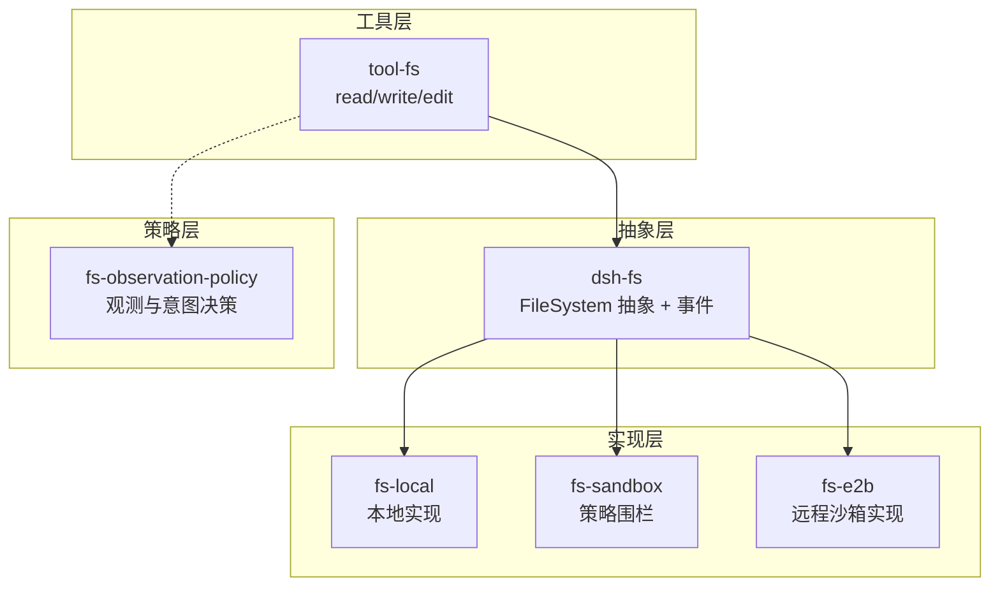
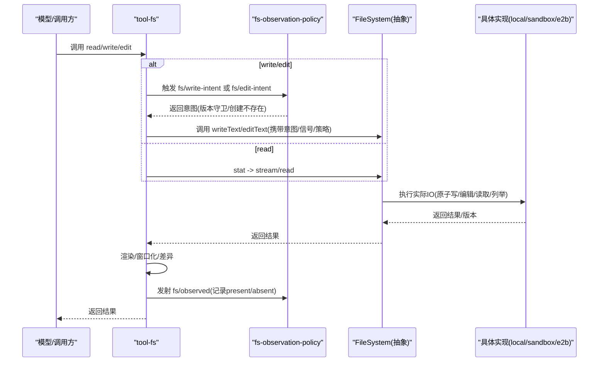
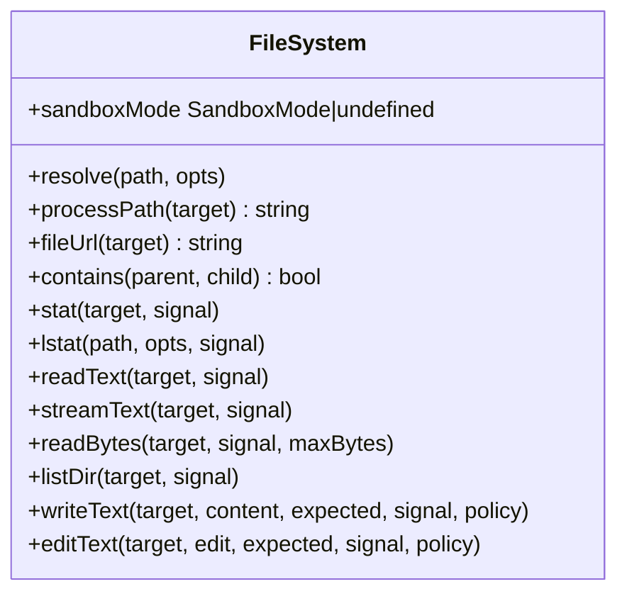
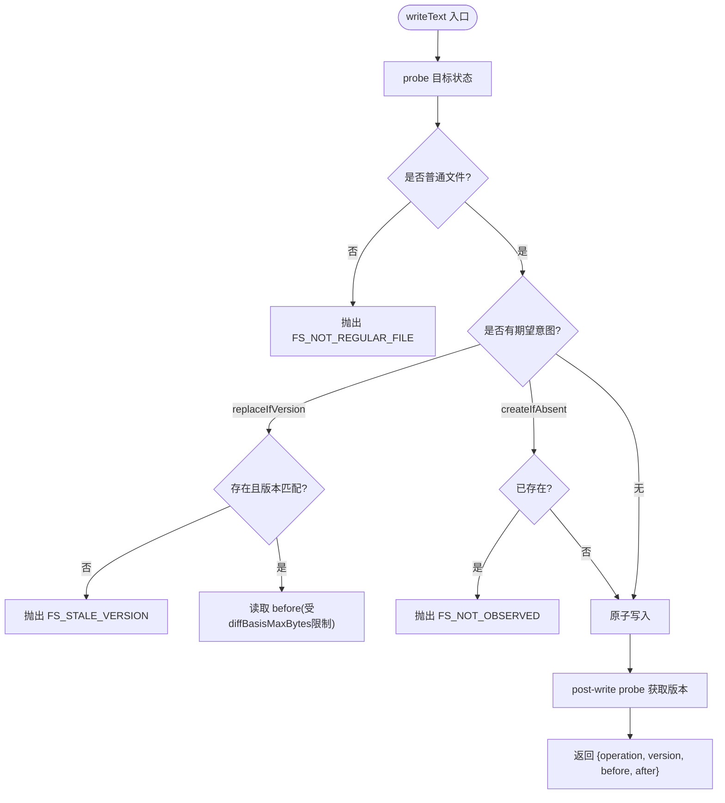
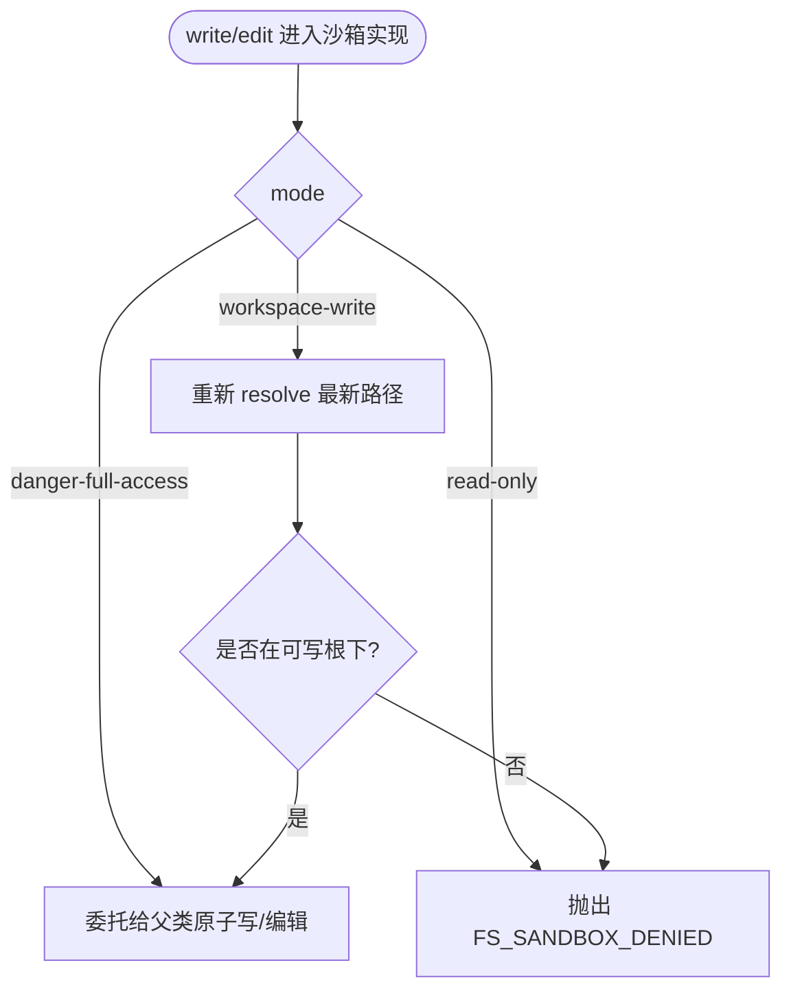
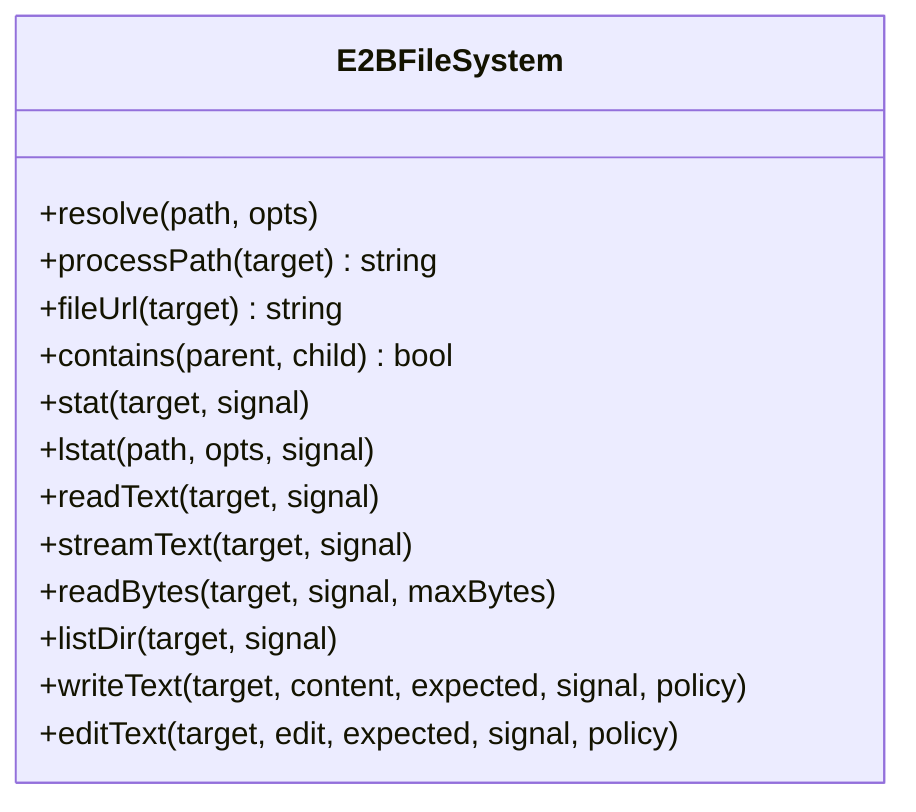
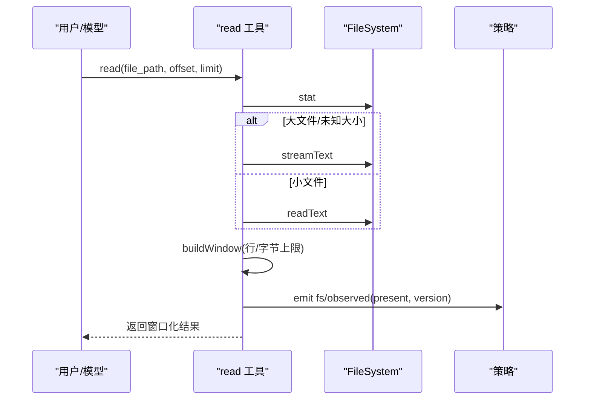
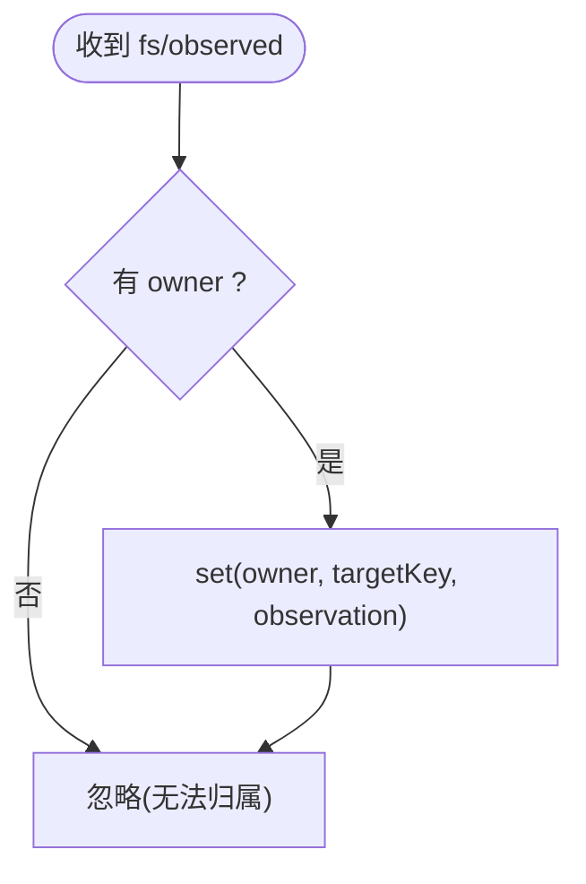
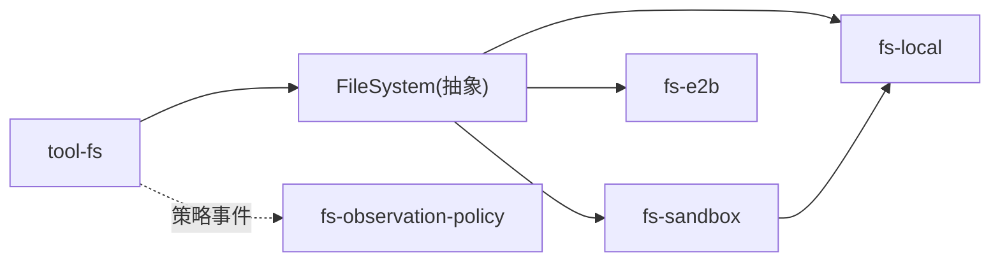

# 文件系统接缝

<cite>
**本文引用的文件**
- [packages/fs/fs/src/index.ts](file://packages/fs/fs/src/index.ts)
- [packages/fs/fs-local/src/index.ts](file://packages/fs/fs-local/src/index.ts)
- [packages/fs/fs-sandbox/src/index.ts](file://packages/fs/fs-sandbox/src/index.ts)
- [packages/e2b/fs-e2b/src/index.ts](file://packages/e2b/fs-e2b/src/index.ts)
- [packages/fs/tool-fs/src/index.ts](file://packages/fs/tool-fs/src/index.ts)
- [packages/fs/tool-fs/src/read.ts](file://packages/fs/tool-fs/src/read.ts)
- [packages/fs/tool-fs/src/write.ts](file://packages/fs/tool-fs/src/write.ts)
- [packages/fs/tool-fs/src/edit.ts](file://packages/fs/tool-fs/src/edit.ts)
- [packages/fs/tool-fs/src/sandbox.ts](file://packages/fs/tool-fs/src/sandbox.ts)
- [packages/fs/tool-fs/src/read-render.ts](file://packages/fs/tool-fs/src/read-render.ts)
- [packages/fs/fs-observation-policy/src/index.ts](file://packages/fs/fs-observation-policy/src/index.ts)
- [docs/subsystems/filesystem.md](file://docs/subsystems/filesystem.md)
</cite>

## 目录
1. [简介](#简介)
2. [项目结构](#项目结构)
3. [核心组件](#核心组件)
4. [架构总览](#架构总览)
5. [详细组件分析](#详细组件分析)
6. [依赖关系分析](#依赖关系分析)
7. [性能考量](#性能考量)
8. [故障排查指南](#故障排查指南)
9. [结论](#结论)
10. [附录](#附录)

## 简介
本文件围绕“文件系统接缝”展开，系统性说明 ctx.fs 的设计目标、抽象契约与实现机制，覆盖本地文件系统（fs-local）、沙箱文件系统（fs-sandbox）与 E2B 远程文件系统（fs-e2b）的特点与适用场景；阐述读写/编辑操作的安全控制、权限管理与访问限制；提供工具层 tool-fs 的完整使用指南（读、写、编辑、搜索/浏览、错误处理），并给出性能优化建议与最佳实践。

## 项目结构
文件系统能力由四个主要部分组成：
- dsh-fs：定义 ctx.fs 抽象服务与事件协议（resolve/stat/lstat/read/stream/list/write/edit 等）。
- dsh-fs-local：本地磁盘实现，基于 realpath 的稳定目标标识与原子写入。
- dsh-fs-sandbox：在本地实现之上增加每调用策略围栏（read-only/workspace-write/danger-full-access）。
- dsh-fs-e2b：E2B 远程沙箱中的文件系统后端，路径与内容均位于共享远程沙箱内。
- dsh-tool-fs：面向模型的工具集合（read/write/edit/read_image），负责参数校验、窗口化读取、结果渲染与观察事件发射。
- dsh-fs-observation-policy：可选的策略插件，通过 fs/* 事件决定写/编辑意图并记录观测状态。

图表来源
- [packages/fs/fs/src/index.ts:86-250](file://packages/fs/fs/src/index.ts#L86-L250)
- [packages/fs/fs-local/src/index.ts:64-266](file://packages/fs/fs-local/src/index.ts#L64-L266)
- [packages/fs/fs-sandbox/src/index.ts:59-152](file://packages/fs/fs-sandbox/src/index.ts#L59-L152)
- [packages/e2b/fs-e2b/src/index.ts:171-203](file://packages/e2b/fs-e2b/src/index.ts#L171-L203)
- [packages/fs/tool-fs/src/index.ts:54-80](file://packages/fs/tool-fs/src/index.ts#L54-L80)
- [packages/fs/fs-observation-policy/src/index.ts:106-131](file://packages/fs/fs-observation-policy/src/index.ts#L106-L131)

章节来源
- [docs/subsystems/filesystem.md:1-10](file://docs/subsystems/filesystem.md#L1-L10)

## 核心组件
- FileSystem 抽象（ctx.fs）：定义稳定目标标识、进程路径/URI 转换、包含性检查、元数据、文本/流式/字节读取、目录列举、原子写与原子编辑，以及 fs/* 事件（write-intent/edit-intent/observed）。
- 本地实现 LocalFileSystem：基于 realpath 的目标稳定性、原子写入、行尾归一化、并发锁（按 targetKey 序列化写/编辑）。
- 沙箱实现 SandboxedFileSystem：继承本地实现，仅对写/编辑施加 per-call 策略围栏（read-only/workspace-write/danger-full-access），读操作不受限。
- E2B 实现 E2BFileSystem：远程沙箱内的文件系统，路径解析、符号链接、列表顺序、二进制检测、编辑匹配等均适配远程环境。
- 工具层 tool-fs：注册 read/write/edit/read_image 工具，负责参数校验、窗口化读取、差异展示、沙箱升级字段广告与错误映射。
- 观测策略 fs-observation-policy：通过 WeakMap 维护每个会话的“已观测”状态，将 write-intent 映射为 createIfAbsent/replaceIfVersion，edit-intent 映射为版本守卫或拒绝。

章节来源
- [packages/fs/fs/src/index.ts:86-250](file://packages/fs/fs/src/index.ts#L86-L250)
- [packages/fs/fs-local/src/index.ts:64-266](file://packages/fs/fs-local/src/index.ts#L64-L266)
- [packages/fs/fs-sandbox/src/index.ts:59-152](file://packages/fs/fs-sandbox/src/index.ts#L59-L152)
- [packages/e2b/fs-e2b/src/index.ts:171-203](file://packages/e2b/fs-e2b/src/index.ts#L171-L203)
- [packages/fs/tool-fs/src/index.ts:54-80](file://packages/fs/tool-fs/src/index.ts#L54-L80)
- [packages/fs/fs-observation-policy/src/index.ts:17-95](file://packages/fs/fs-observation-policy/src/index.ts#L17-L95)

## 架构总览
下图展示了从工具到抽象再到具体实现的调用链，以及策略事件如何影响写/编辑行为。

图表来源
- [packages/fs/tool-fs/src/write.ts:102-129](file://packages/fs/tool-fs/src/write.ts#L102-L129)
- [packages/fs/tool-fs/src/edit.ts:112-147](file://packages/fs/tool-fs/src/edit.ts#L112-L147)
- [packages/fs/tool-fs/src/read.ts:136-163](file://packages/fs/tool-fs/src/read.ts#L136-L163)
- [packages/fs/fs-observation-policy/src/index.ts:106-131](file://packages/fs/fs-observation-policy/src/index.ts#L106-L131)
- [packages/fs/fs/src/index.ts:86-250](file://packages/fs/fs/src/index.ts#L86-L250)

## 详细组件分析

### 抽象契约：FileSystem 与事件
- 目标与元数据：resolve/targetKey/displayPath、processPath/fileUrl/contains、stat/lstat、listDir。
- 读取：readText/streamText/readBytes（带 maxBytes 上限，避免无界缓冲）。
- 写入：writeText（支持 createIfAbsent/replaceIfVersion 守卫）、editText（原子 literal 替换，版本守卫先于匹配）。
- 事件：fs/write-intent、fs/edit-intent（单槽水闸，首个返回者决定）、fs/observed（同步记录 present/absent）。

图表来源
- [packages/fs/fs/src/index.ts:86-250](file://packages/fs/fs/src/index.ts#L86-L250)

章节来源
- [packages/fs/fs/src/index.ts:86-250](file://packages/fs/fs/src/index.ts#L86-L250)
- [docs/subsystems/filesystem.md:11-279](file://docs/subsystems/filesystem.md#L11-L279)

### 本地文件系统实现（fs-local）
- 目标稳定性：基于 realpath，别名共享同一目标键，便于失效守卫。
- 并发安全：按 targetKey 的尾部 Promise 队列串行化写/编辑，避免竞态。
- 原子写：先捕获 before（受 diffBasisMaxBytes 限制），再原子写入，after 用于生成新版本。
- 行尾处理：存储 LF 归一化，编辑时恢复原始行尾，保证 diff 一致性。
- 错误语义：非正则文件拒绝写/编辑；createIfAbsent 遇到已有文件报 FS_NOT_OBSERVED；版本不匹配报 FS_STALE_VERSION。

图表来源
- [packages/fs/fs-local/src/index.ts:166-219](file://packages/fs/fs-local/src/index.ts#L166-L219)

章节来源
- [packages/fs/fs-local/src/index.ts:64-266](file://packages/fs/fs-local/src/index.ts#L64-L266)

### 沙箱文件系统实现（fs-sandbox）
- 继承本地实现：复用所有 IO 与原子写/编辑逻辑。
- 策略围栏：仅拦截 write/edit，读操作放行。
- 模式：
  - read-only：拒绝一切写/编辑，抛 FS_SANDBOX_DENIED。
  - workspace-write：重新 resolve 最新路径，要求落入可写根（workspace/temp），否则拒绝。
  - danger-full-access：直接放行。
- 提升流程：工具层通过 FsSandboxController 进行参数校验、审批与错误映射，统一提示与重试。

图表来源
- [packages/fs/fs-sandbox/src/index.ts:84-148](file://packages/fs/fs-sandbox/src/index.ts#L84-L148)
- [packages/fs/tool-fs/src/sandbox.ts:87-108](file://packages/fs/tool-fs/src/sandbox.ts#L87-L108)

章节来源
- [packages/fs/fs-sandbox/src/index.ts:1-152](file://packages/fs/fs-sandbox/src/index.ts#L1-L152)
- [packages/fs/tool-fs/src/sandbox.ts:1-132](file://packages/fs/tool-fs/src/sandbox.ts#L1-L132)

### E2B 文件系统实现（fs-e2b）
- 运行环境：路径、内容与原子暂存文件均在共享远程沙箱中。
- 特性：
  - 路径解析：相对路径基于 e2b.cwd，返回 displayPath 与 targetKey。
  - 符号链接：支持列出与识别。
  - 列表顺序：稳定排序。
  - 二进制检测：采样前若干字节判断是否为文本。
  - 编辑匹配：LF 归一化后精确匹配，支持 replaceAll。
- 错误映射：将底层命令错误转换为 FsError 并携带稳定 code。

图表来源
- [packages/e2b/fs-e2b/src/index.ts:171-203](file://packages/e2b/fs-e2b/src/index.ts#L171-L203)

章节来源
- [packages/e2b/fs-e2b/src/index.ts:1-174](file://packages/e2b/fs-e2b/src/index.ts#L1-L174)

### 工具层（tool-fs）使用指南
- read：
  - 参数：file_path、offset（默认1）、limit（默认2000）。
  - 行为：一次 stat 决定类型与路由；大文件或未知大小走 stream；构建窗口（行/字节上限）；输出结构化 meta 供 UI 渲染；发射 fs/observed(present)。
  - 错误：偏移越界报 FS_NOT_FOUND；二进制/非文本由后端返回 FS_NOT_TEXT。
- write：
  - 参数：file_path、content；在沙箱模式下附带 sandbox_permissions 与 justification。
  - 行为：解析 per-call 策略；触发 fs/write-intent 得到意图；调用 ctx.fs.writeText；记录 fs/observed(present with version)。
  - 错误：沙箱拒绝映射为统一标记；未观测/过期分别报 FS_NOT_OBSERVED/FS_STALE_VERSION。
- edit：
  - 参数：file_path、old_string（非空）、new_string（与 old_string 不同）、replace_all（默认 false）。
  - 行为：解析策略；触发 fs/edit-intent 得到版本守卫；调用 ctx.fs.editText；记录 fs/observed(present with version)。
  - 错误：未观测报 FS_NOT_OBSERVED；不存在报 FS_NOT_FOUND；模糊匹配报 FS_AMBIGUOUS_EDIT；找不到旧串报 FS_EDIT_NOT_FOUND。
- read_image：
  - 条件挂载：仅在 attachments 可用时注册；用于读取图片资源。
- 搜索/浏览：
  - 通过 listDir 遍历目录；结合 read 逐文件查看；grep/glob 不在本包内，通常由 shell 工具完成。

图表来源
- [packages/fs/tool-fs/src/read.ts:69-163](file://packages/fs/tool-fs/src/read.ts#L69-L163)
- [packages/fs/tool-fs/src/read-render.ts:111-170](file://packages/fs/tool-fs/src/read-render.ts#L111-L170)

章节来源
- [packages/fs/tool-fs/src/index.ts:54-80](file://packages/fs/tool-fs/src/index.ts#L54-L80)
- [packages/fs/tool-fs/src/read.ts:1-210](file://packages/fs/tool-fs/src/read.ts#L1-L210)
- [packages/fs/tool-fs/src/write.ts:1-151](file://packages/fs/tool-fs/src/write.ts#L1-L151)
- [packages/fs/tool-fs/src/edit.ts:1-169](file://packages/fs/tool-fs/src/edit.ts#L1-L169)
- [packages/fs/tool-fs/src/read-render.ts:1-273](file://packages/fs/tool-fs/src/read-render.ts#L1-L273)

### 观测策略（fs-observation-policy）
- 状态模型：WeakMap<owner, Map<targetKey, observation>>，owner 来自 exec.agent.session。
- 写意图：unseen/absent → createIfAbsent；present → replaceIfVersion(observed version)。
- 编辑意图：unseen → 抛 FS_NOT_OBSERVED；absent → 抛 FS_NOT_FOUND；present → 返回 observed version。
- 记录：fs/observed 同步记录 present/absent，不阻塞成功后的写/编辑。

图表来源
- [packages/fs/fs-observation-policy/src/index.ts:17-95](file://packages/fs/fs-observation-policy/src/index.ts#L17-L95)
- [packages/fs/fs-observation-policy/src/index.ts:106-131](file://packages/fs/fs-observation-policy/src/index.ts#L106-L131)

章节来源
- [packages/fs/fs-observation-policy/src/index.ts:1-131](file://packages/fs/fs-observation-policy/src/index.ts#L1-L131)

## 依赖关系分析
- tool-fs 依赖 FileSystem 抽象与系统提示注入；根据 ctx.fs.sandboxMode 决定是否暴露沙箱升级字段。
- fs-sandbox 依赖 dsh-fs-local 与 dsh-sandbox 的可写根计算。
- fs-e2b 依赖 dsh-e2b 运行时与远程沙箱 API。
- 策略插件仅依赖事件与类型，不引入具体实现。

图表来源
- [packages/fs/tool-fs/src/index.ts:21-79](file://packages/fs/tool-fs/src/index.ts#L21-L79)
- [packages/fs/fs-sandbox/src/index.ts:33-41](file://packages/fs/fs-sandbox/src/index.ts#L33-L41)
- [packages/e2b/fs-e2b/src/index.ts:7-28](file://packages/e2b/fs-e2b/src/index.ts#L7-L28)
- [packages/fs/fs-observation-policy/src/index.ts:10-13](file://packages/fs/fs-observation-policy/src/index.ts#L10-L13)

章节来源
- [packages/fs/tool-fs/src/index.ts:21-79](file://packages/fs/tool-fs/src/index.ts#L21-L79)
- [packages/fs/fs-sandbox/src/index.ts:33-41](file://packages/fs/fs-sandbox/src/index.ts#L33-L41)
- [packages/e2b/fs-e2b/src/index.ts:7-28](file://packages/e2b/fs-e2b/src/index.ts#L7-L28)
- [packages/fs/fs-observation-policy/src/index.ts:10-13](file://packages/fs/fs-observation-policy/src/index.ts#L10-L13)

## 性能考量
- 读取窗口化：read 工具以行/字节双上限控制输出，避免大文件内存膨胀；超过阈值自动切换流式读取。
- 流式边界：后端负责跨分片 UTF-8 解码与二进制拒绝，消费端无需关心细节。
- 原子写基线：before 读取受 diffBasisMaxBytes 限制，防止超大文件导致内存压力；超出则回退为全量差异。
- 并发控制：本地实现按 targetKey 串行化写/编辑，确保 CAS 语义与确定性顺序。
- 远程 I/O：E2B 实现通过命令通道与沙箱交互，注意网络往返开销；批量操作应合并以减少 RTT。
- 列表与统计：listDir 仅返回元数据与目标，不读取内容；size 可用于选择 readText/streamText。

[本节为通用指导，不直接分析具体文件]

## 故障排查指南
- 常见错误码与含义：
  - FS_NOT_FOUND：路径不存在或偏移越界。
  - FS_NOT_DIRECTORY：期望目录但目标不是目录。
  - FS_NOT_TEXT：非 UTF-8 文本。
  - FS_NOT_REGULAR_FILE：非普通文件（写/编辑拒绝）。
  - FS_TOO_LARGE：读取超过 maxBytes。
  - FS_PERMISSION_DENIED：内核/宿主拒绝。
  - FS_SANDBOX_DENIED：策略拒绝（read-only/workspace-write 越界）。
  - FS_IO_ERROR：后端 I/O 异常。
  - FS_STALE_VERSION：版本不匹配（写/编辑守卫失败）。
  - FS_NOT_OBSERVED：未先读取就尝试写/编辑（策略要求）。
  - FS_AMBIGUOUS_EDIT：literal 匹配多次但未开启 replaceAll。
  - FS_EDIT_NOT_FOUND：literal 未找到。
  - FS_ABORTED：被 AbortSignal 取消。
- 定位步骤：
  - 确认工具参数合法（路径非空、old_string 非空且不等于 new_string）。
  - 检查策略：是否启用了观测策略；是否先 read 再 write/edit。
  - 检查沙箱模式：read-only 会拒绝写；workspace-write 需落在可写根。
  - 检查版本守卫：若报错 FS_STALE_VERSION，需重新读取后再编辑。
  - 检查远端错误：E2B 命令错误会被映射为 FsError，关注 stderr 与 exitCode。

章节来源
- [docs/subsystems/filesystem.md:244-271](file://docs/subsystems/filesystem.md#L244-L271)
- [packages/fs/tool-fs/src/write.ts:112-120](file://packages/fs/tool-fs/src/write.ts#L112-L120)
- [packages/fs/tool-fs/src/edit.ts:124-139](file://packages/fs/tool-fs/src/edit.ts#L124-L139)
- [packages/fs/fs-local/src/index.ts:172-255](file://packages/fs/fs-local/src/index.ts#L172-L255)
- [packages/fs/fs-sandbox/src/index.ts:126-148](file://packages/fs/fs-sandbox/src/index.ts#L126-L148)

## 结论
文件系统接缝通过稳定的抽象契约、可插拔的后端与事件驱动的策略，实现了安全、可组合的文件操作能力。本地实现提供高性能与原子性；沙箱实现提供细粒度访问控制；E2B 实现支持远程隔离环境。工具层将复杂策略与渲染封装为简洁的 read/write/edit 接口，配合观测策略保障“先读后改”的最佳实践。部署时应根据场景选择合适的后端与策略，并结合窗口化读取、原子写与并发锁获得良好性能与一致性。

[本节为总结性内容，不直接分析具体文件]

## 附录
- 配置要点：
  - local：cwd、diffBasisMaxBytes。
  - tool-fs：readLimit、readMaxLineLength、readMaxBytes、readStreamMinSize。
  - 沙箱：defaultMode 与 session 级覆盖；可写根由 writableRoots 计算。
- 最佳实践：
  - 始终先 read 再 write/edit（启用观测策略时）。
  - 大文件优先使用 read 的 offset/limit 分页与流式读取。
  - 编辑时使用足够具体的 old_string 以避免歧义。
  - 在沙箱环境中明确 mode，必要时申请一次性升级并附理由。
  - 对远程后端（E2B）减少频繁小 IO，尽量批量化。

[本节为补充信息，不直接分析具体文件]