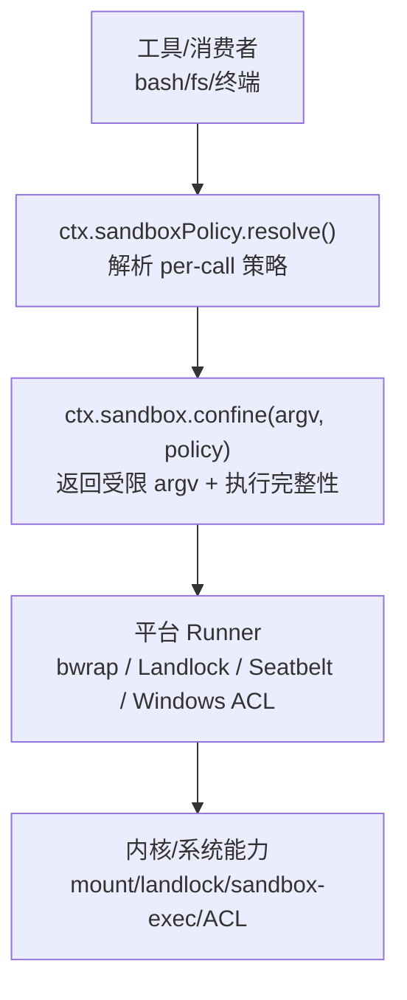
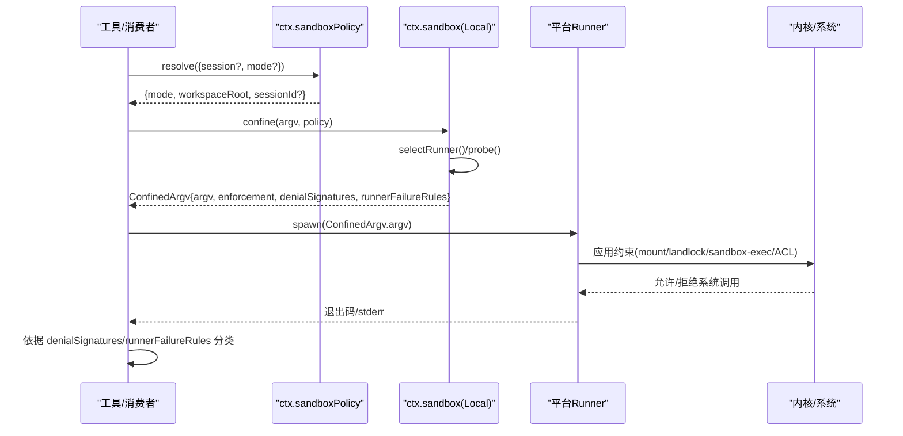
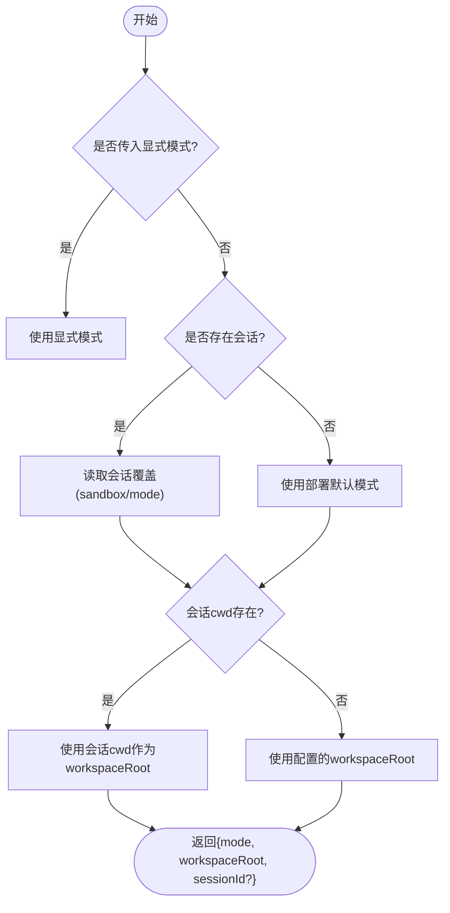
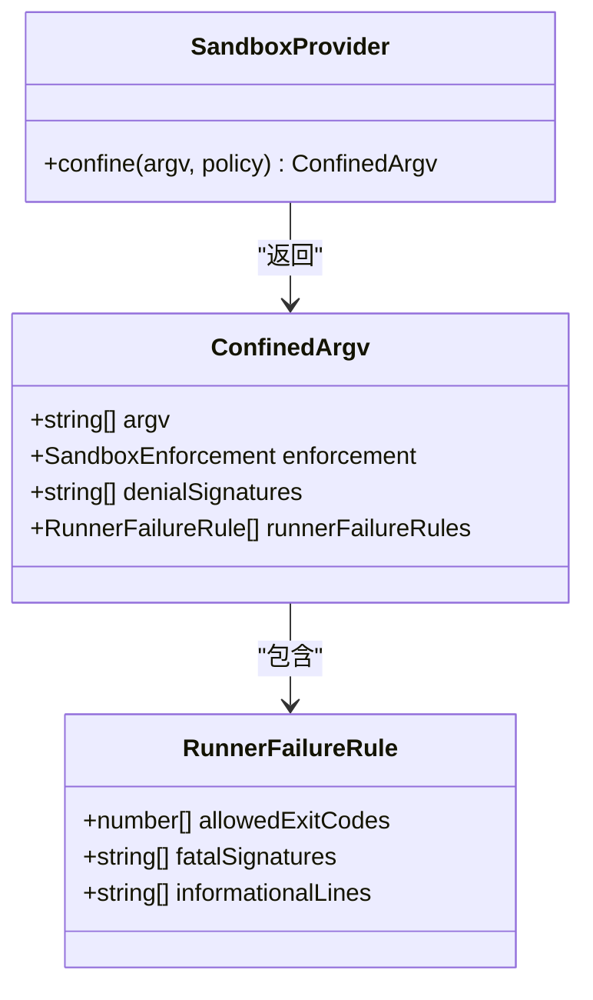
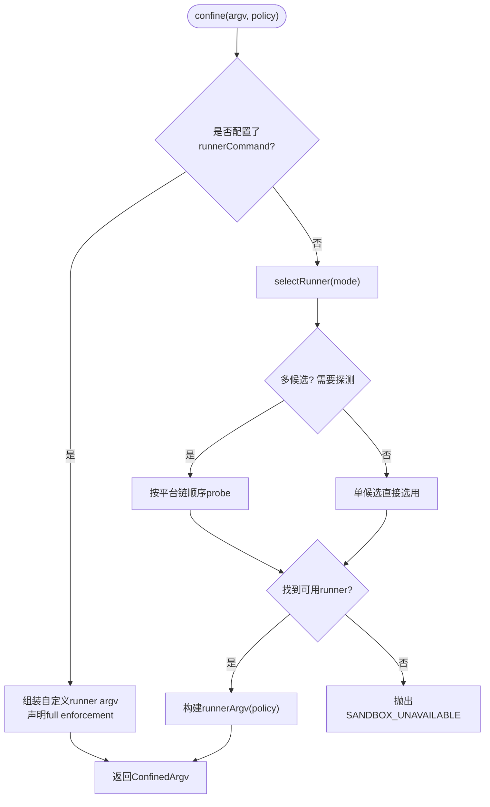
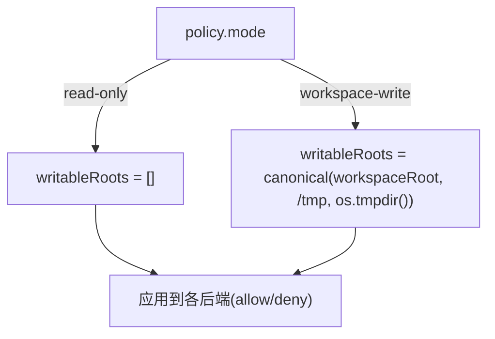
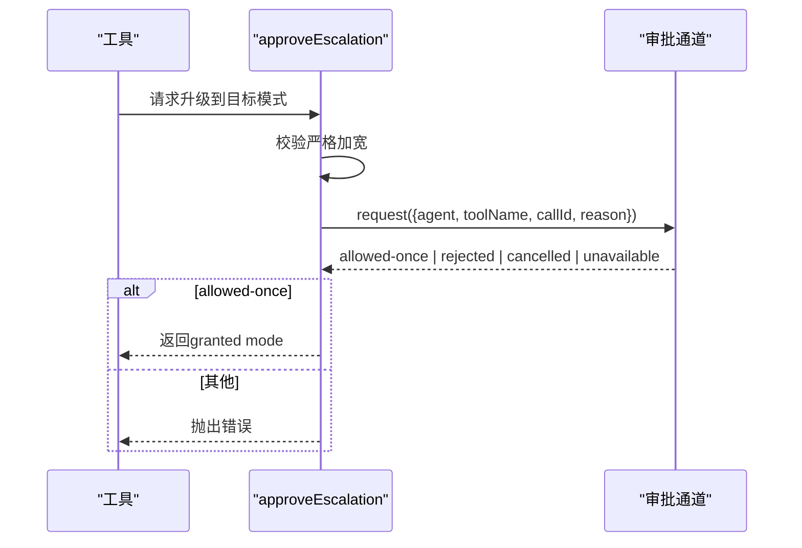
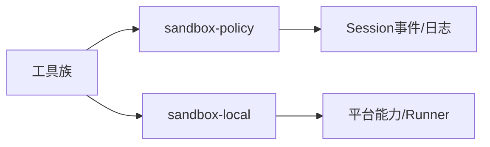
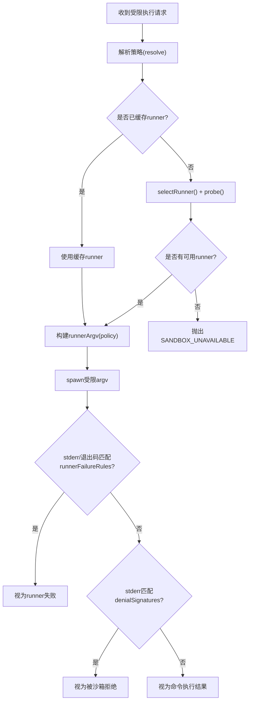

# 沙箱策略接缝

<cite>
**本文引用的文件**
- [packages/sandbox/sandbox/src/index.ts](file://packages/sandbox/sandbox/src/index.ts)
- [packages/sandbox/sandbox/src/escalation.ts](file://packages/sandbox/sandbox/src/escalation.ts)
- [packages/sandbox/sandbox/src/roots.ts](file://packages/sandbox/sandbox/src/roots.ts)
- [packages/sandbox/sandbox-local/src/index.ts](file://packages/sandbox/sandbox-local/src/index.ts)
- [packages/sandbox/sandbox-local/src/profiles.ts](file://packages/sandbox/sandbox-local/src/profiles.ts)
- [packages/sandbox/sandbox-policy/src/index.ts](file://packages/sandbox/sandbox-policy/src/index.ts)
- [packages/sandbox/sandbox-policy/src/session-mode.ts](file://packages/sandbox/sandbox-policy/src/session-mode.ts)
- [docs/subsystems/sandbox.md](file://docs/subsystems/sandbox.md)
</cite>

## 目录
1. [简介](#简介)
2. [项目结构](#项目结构)
3. [核心组件](#核心组件)
4. [架构总览](#架构总览)
5. [详细组件分析](#详细组件分析)
6. [依赖关系分析](#依赖关系分析)
7. [性能考量](#性能考量)
8. [故障排查指南](#故障排查指南)
9. [结论](#结论)
10. [附录](#附录)

## 简介
本文件围绕“沙箱策略接缝”展开，聚焦 ctx.sandbox 与 ctx.sandboxPolicy 的设计目标、安全模型与执行机制。重点解释本地沙箱实现（sandbox-local）的策略配置、平台后端选择、文件系统访问控制、网络与进程可见性边界、系统调用限制以及不同安全级别的配置示例与最佳实践，并给出性能影响分析与调试方法。

## 项目结构
该能力由三个协作包构成：
- dsh-sandbox：定义抽象的进程沙箱服务接口、模式词汇、执行策略与错误约定。
- dsh-sandbox-policy：集中管理部署默认模式、工作区根目录与会话级覆盖，提供 per-call 策略解析。
- dsh-sandbox-local：本地进程约束提供者，按平台选择 runner（bwrap/Landlock/Seatbelt/Windows ACL），生成受限 argv 并报告执行完整性与诊断方言。

图表来源
- [packages/sandbox/sandbox-policy/src/index.ts:126-142](file://packages/sandbox/sandbox-policy/src/index.ts#L126-L142)
- [packages/sandbox/sandbox/src/index.ts:158-176](file://packages/sandbox/sandbox/src/index.ts#L158-L176)
- [packages/sandbox/sandbox-local/src/index.ts:316-343](file://packages/sandbox/sandbox-local/src/index.ts#L316-L343)

章节来源
- [docs/subsystems/sandbox.md:1-219](file://docs/subsystems/sandbox.md#L1-L219)
- [packages/sandbox/sandbox/src/index.ts:1-179](file://packages/sandbox/sandbox/src/index.ts#L1-L179)
- [packages/sandbox/sandbox-policy/src/index.ts:1-155](file://packages/sandbox/sandbox-policy/src/index.ts#L1-L155)
- [packages/sandbox/sandbox-local/src/index.ts:1-568](file://packages/sandbox/sandbox-local/src/index.ts#L1-L568)

## 核心组件
- ctx.sandbox（SandboxProvider）
  - 职责：将原始 argv 包装为在指定策略下受约束执行的 argv；失败时关闭（fail-closed）。
  - 关键输出：ConfinedArgv（argv、enforcement、denialSignatures、runnerFailureRules）。
- ctx.sandboxPolicy（SandboxPolicyService）
  - 职责：维护部署默认模式与工作区根；按会话事件与显式升级结果解析 per-call 策略。
  - 关键方法：resolve(request)、overrideOf(session)。
- 本地提供者 LocalSandboxProvider
  - 职责：按平台选择 runner 链，功能探测候选者，生成受限 argv，报告执行完整性与诊断方言。
  - 特性：支持自定义 runnerCommand 与失败签名；缓存选择结果；Windows ACL 写授权生命周期管理。

章节来源
- [packages/sandbox/sandbox/src/index.ts:23-176](file://packages/sandbox/sandbox/src/index.ts#L23-L176)
- [packages/sandbox/sandbox-policy/src/index.ts:85-152](file://packages/sandbox/sandbox-policy/src/index.ts#L85-L152)
- [packages/sandbox/sandbox-local/src/index.ts:250-343](file://packages/sandbox/sandbox-local/src/index.ts#L250-L343)

## 架构总览
下图展示一次受限执行的完整流程：消费者先解析策略，再请求 provider 包装 argv，最后由平台 runner 以最小权限执行。

图表来源
- [packages/sandbox/sandbox-policy/src/index.ts:126-142](file://packages/sandbox/sandbox-policy/src/index.ts#L126-L142)
- [packages/sandbox/sandbox/src/index.ts:158-176](file://packages/sandbox/sandbox/src/index.ts#L158-L176)
- [packages/sandbox/sandbox-local/src/index.ts:316-343](file://packages/sandbox/sandbox-local/src/index.ts#L316-L343)
- [packages/sandbox/sandbox-local/src/index.ts:492-539](file://packages/sandbox/sandbox-local/src/index.ts#L492-L539)

## 详细组件分析

### 策略与模式（ctx.sandboxPolicy）
- 模式词汇
  - read-only：仅允许必要写入（如 /dev/null）。
  - workspace-write：允许在工作区根与后端承诺的临时区域写入。
  - danger-full-access：不进入沙箱，直接执行。
- 执行完整性
  - full：后端能治理模式承诺的所有文件效果。
  - partial：因内核 ABI 或后端限制，仅能治理部分效果（例如旧版 Landlock、Windows ACL 的 Everyone/hard-link 边界）。
- 策略解析优先级
  - 显式批准的模式 > 会话覆盖（sandbox/mode 事件折叠）> 部署默认模式。
  - 工作区根优先使用会话 cwd，否则回退到配置的 workspaceRoot。
- 会话覆盖
  - 通过 session.append('sandbox/mode', {mode}) 记录，持久化且可回放。
  - effectiveSandboxMode 从事件日志中取最后一次切换。

图表来源
- [packages/sandbox/sandbox-policy/src/index.ts:126-142](file://packages/sandbox/sandbox-policy/src/index.ts#L126-L142)
- [packages/sandbox/sandbox-policy/src/session-mode.ts:52-71](file://packages/sandbox/sandbox-policy/src/session-mode.ts#L52-L71)

章节来源
- [docs/subsystems/sandbox.md:9-94](file://docs/subsystems/sandbox.md#L9-L94)
- [packages/sandbox/sandbox-policy/src/index.ts:60-152](file://packages/sandbox/sandbox-policy/src/index.ts#L60-L152)
- [packages/sandbox/sandbox-policy/src/session-mode.ts:1-72](file://packages/sandbox/sandbox-policy/src/session-mode.ts#L1-L72)

### 进程沙箱接口（ctx.sandbox）
- 抽象服务 SandboxProvider
  - confine(argv, policy)：返回受限 argv 与执行完整性事实；禁止静默放行。
- 结构化错误与分类
  - SANDBOX_UNAVAILABLE：无可用后端时的失败码。
  - denialSignatures：当前后端产生的“被沙箱拒绝”的 stderr 特征。
  - runnerFailureRules：用于识别 runner 自身启动失败的规则（退出码门控+致命行匹配+信息行排除）。

图表来源
- [packages/sandbox/sandbox/src/index.ts:158-176](file://packages/sandbox/sandbox/src/index.ts#L158-L176)
- [packages/sandbox/sandbox/src/index.ts:74-116](file://packages/sandbox/sandbox/src/index.ts#L74-L116)

章节来源
- [packages/sandbox/sandbox/src/index.ts:23-176](file://packages/sandbox/sandbox/src/index.ts#L23-L176)
- [docs/subsystems/sandbox.md:96-156](file://docs/subsystems/sandbox.md#L96-L156)

### 本地沙箱实现（sandbox-local）
- 平台 runner 链
  - Linux：bwrap（首选，挂载隔离最贴近模式词汇）→ Landlock（ABI 差异可能 partial）。
  - macOS：Seatbelt。
  - Windows：ACL restricted-token runner（始终 partial）。
- 功能探测与缓存
  - 首次 confine 时按平台链顺序探测候选者，缓存选择结果。
  - 单候选平台无需仲裁，但执行期拒绝仍 fail-closed。
- 配置文件
  - runnerCommand：自定义 runner argv（跳过内置选择与探测，需同时提供 runnerFailureSignatures）。
  - probeTimeoutMs：功能探测超时。
- 写授权（Windows ACL）
  - 工作区根 SID 与 ACE 跨会话复用（standing grant）。
  - 每会话私有临时目录与独立 SID（revocable grant），provider 销毁时回收。
- 诊断方言
  - 每个 runner 提供 denialSignatures 与 runnerFailureRules，避免跨后端误判。

图表来源
- [packages/sandbox/sandbox-local/src/index.ts:316-343](file://packages/sandbox/sandbox-local/src/index.ts#L316-L343)
- [packages/sandbox/sandbox-local/src/index.ts:492-539](file://packages/sandbox/sandbox-local/src/index.ts#L492-L539)
- [packages/sandbox/sandbox-local/src/index.ts:159-187](file://packages/sandbox/sandbox-local/src/index.ts#L159-L187)

章节来源
- [packages/sandbox/sandbox-local/src/index.ts:1-568](file://packages/sandbox/sandbox-local/src/index.ts#L1-L568)
- [packages/sandbox/sandbox-local/src/profiles.ts:1-59](file://packages/sandbox/sandbox-local/src/profiles.ts#L1-L59)

### 文件系统访问控制
- 可写根推导
  - writableRoots(policy)：read-only 为空；workspace-write 包含工作区根、/tmp 与 os.tmpdir()，路径规范化去重。
- 各后端一致性
  - bwrap：只读根绑定 + 可选 tmpfs 与工作区绑定。
  - Landlock：基于 allow-list 的读写许可。
  - Seatbelt：deny-file-write* 基础 + 显式允许子路径。
  - Windows ACL：通过 SID/ACE 授予工作区与临时目录写入。
- 注意
  - 网络与进程可见性不在本词汇表内；文件系统边界由策略与后端共同保证。

图表来源
- [packages/sandbox/sandbox/src/roots.ts:20-55](file://packages/sandbox/sandbox/src/roots.ts#L20-L55)
- [packages/sandbox/sandbox-local/src/profiles.ts:16-58](file://packages/sandbox/sandbox-local/src/profiles.ts#L16-L58)

章节来源
- [packages/sandbox/sandbox/src/roots.ts:1-56](file://packages/sandbox/sandbox/src/roots.ts#L1-L56)
- [packages/sandbox/sandbox-local/src/profiles.ts:1-59](file://packages/sandbox/sandbox-local/src/profiles.ts#L1-L59)

### 网络权限管理与系统调用限制
- 设计边界
  - 本词汇表仅约束“文件效果”。网络与进程可见性不属于模式语义范围。
  - 若需网络/进程限制，应在更高层（容器/微VM/远程执行）或专用能力层实现，而非通过 ctx.sandbox 模式。
- 实际约束
  - bwrap：通过 mount 命名空间与只读绑定限制文件系统。
  - Landlock：内核级系统调用白名单（ABI 差异可能导致 partial）。
  - Seatbelt：SBPL 规则限制文件写入等。
  - Windows ACL：通过令牌与 DACL 限制文件访问。

章节来源
- [docs/subsystems/sandbox.md:9-39](file://docs/subsystems/sandbox.md#L9-L39)
- [packages/sandbox/sandbox/src/index.ts:23-39](file://packages/sandbox/sandbox/src/index.ts#L23-L39)

### 升级与审批（Escalation）
- 严格加宽原则
  - read-only → workspace-write → danger-full-access（单向加宽）。
- 审批流程
  - approveEscalation：校验请求模式严格加宽 → 检查审批通道可用性 → 发起用户审批 → 根据结果返回 granted mode 或抛出错误。
- 提示与标记
  - sandboxDenialMarker：统一向模型报告“被沙箱拒绝”。
  - escalationHintMarker：提示重试时使用 sandbox_permissions + justification。

图表来源
- [packages/sandbox/sandbox/src/escalation.ts:22-41](file://packages/sandbox/sandbox/src/escalation.ts#L22-L41)
- [packages/sandbox/sandbox/src/escalation.ts:143-189](file://packages/sandbox/sandbox/src/escalation.ts#L143-L189)

章节来源
- [packages/sandbox/sandbox/src/escalation.ts:1-190](file://packages/sandbox/sandbox/src/escalation.ts#L1-L190)

## 依赖关系分析
- 耦合与内聚
  - sandbox-policy 聚合策略与会话状态，保持执行器/provider 无状态。
  - sandbox-local 依赖 platform 能力与外部 runner，内部封装选择与诊断方言。
  - 工具族（bash/fs/终端）消费 ctx.sandboxPolicy 与 ctx.sandbox，不感知具体后端。
- 外部依赖
  - 平台工具：bwrap、Landlock launcher、sandbox-exec、Windows ACL runner。
  - Node API：child_process、fs、os、path。

图表来源
- [packages/sandbox/sandbox-policy/src/index.ts:1-155](file://packages/sandbox/sandbox-policy/src/index.ts#L1-L155)
- [packages/sandbox/sandbox-local/src/index.ts:1-568](file://packages/sandbox/sandbox-local/src/index.ts#L1-L568)

章节来源
- [packages/sandbox/sandbox-policy/src/index.ts:1-155](file://packages/sandbox/sandbox-policy/src/index.ts#L1-L155)
- [packages/sandbox/sandbox-local/src/index.ts:1-568](file://packages/sandbox/sandbox-local/src/index.ts#L1-L568)

## 性能考量
- 策略解析
  - per-call 解析开销极低（读取会话事件折叠与路径规范化）。
- 运行时分派
  - runner 选择与功能探测仅在首次 confine 时发生，后续缓存命中。
  - 自定义 runnerCommand 可跳过探测，适合稳定环境。
- 平台特性
  - bwrap/Seatbelt：构造 profile 与 mount/SBPL 规则，通常快速。
  - Landlock：取决于内核 ABI，可能 partial；launcher 自检会报告。
  - Windows ACL：SID/ACE 分配与临时目录创建有额外开销，但跨会话重用 standing grant。
- 建议
  - 生产环境固定 runnerCommand 并配置 runnerFailureSignatures，减少探测成本。
  - 合理设置 probeTimeoutMs，避免阻塞启动。
  - 对频繁受限执行场景，尽量复用会话与策略，避免重复解析。

[本节为通用指导，不直接分析具体文件]

## 故障排查指南
- 常见错误
  - SANDBOX_UNAVAILABLE：无可用后端或所有候选不可用。检查平台工具是否安装、权限是否足够。
  - Runner 启动失败：依据 runnerFailureRules 判断是否为 runner 自身问题（非命令执行失败）。
  - 被沙箱拒绝：依据 denialSignatures 判断是否来自当前后端。
- 定位步骤
  - 确认 resolve 返回的 mode 与 workspaceRoot 是否符合预期。
  - 查看 confine 返回的 enforcement、denialSignatures、runnerFailureRules。
  - 捕获 stderr 并按规则分类（先移除信息行，再匹配致命行与退出码门控）。
- 调试技巧
  - 使用 internals 注入 fake runner/probe 模拟异常路径。
  - 在 Windows 上检查临时目录与 SID 清理是否成功（provider dispose 时回收）。
  - 对 Landlock 场景关注 ABI 差异导致的 partial 执行完整性。

章节来源
- [packages/sandbox/sandbox/src/index.ts:118-144](file://packages/sandbox/sandbox/src/index.ts#L118-L144)
- [packages/sandbox/sandbox-local/src/index.ts:215-240](file://packages/sandbox/sandbox-local/src/index.ts#L215-L240)
- [packages/sandbox/sandbox-local/src/index.ts:445-483](file://packages/sandbox/sandbox-local/src/index.ts#L445-L483)

## 结论
- ctx.sandbox 与 ctx.sandboxPolicy 将“策略决策”与“执行约束”解耦：策略层负责 per-call 模式与工作区根解析，执行层负责平台适配与 fail-closed 保障。
- 本地实现通过平台 runner 链与功能探测，在不同系统上提供一致的文件效果边界；Windows ACL 因系统限制报告 partial。
- 升级机制确保任何加宽都经过严格校验与用户审批，审计可追溯。
- 实践中应明确安全级别、配置合适的 runner 与探针超时，并结合诊断方言进行排障。

[本节为总结性内容，不直接分析具体文件]

## 附录

### 安全级别配置示例与最佳实践
- 只读模式（read-only）
  - 适用：代码审查、静态分析、文档生成。
  - 配置：部署默认模式设为 read-only；必要时通过会话覆盖切换到 workspace-write。
  - 最佳实践：避免在 read-only 下尝试写操作；如需写入，走升级审批。
- 工作区写入（workspace-write）
  - 适用：编辑代码、生成产物。
  - 配置：确保 workspaceRoot 指向当前会话工作区；临时目录由后端管理。
  - 最佳实践：限制工具仅访问工作区与必要临时目录；避免危险系统调用。
- 完全访问（danger-full-access）
  - 适用：可信脚本、调试环境。
  - 配置：仅在明确需求时启用；配合审批与审计。
  - 最佳实践：最小化使用范围，结合外部容器/隔离进一步加固。

[本节为概念性指导，不直接分析具体文件]

### 关键流程图（算法视角）

图表来源
- [packages/sandbox/sandbox-local/src/index.ts:316-343](file://packages/sandbox/sandbox-local/src/index.ts#L316-L343)
- [packages/sandbox/sandbox-local/src/index.ts:492-539](file://packages/sandbox/sandbox-local/src/index.ts#L492-L539)
- [packages/sandbox/sandbox/src/index.ts:74-116](file://packages/sandbox/sandbox/src/index.ts#L74-L116)