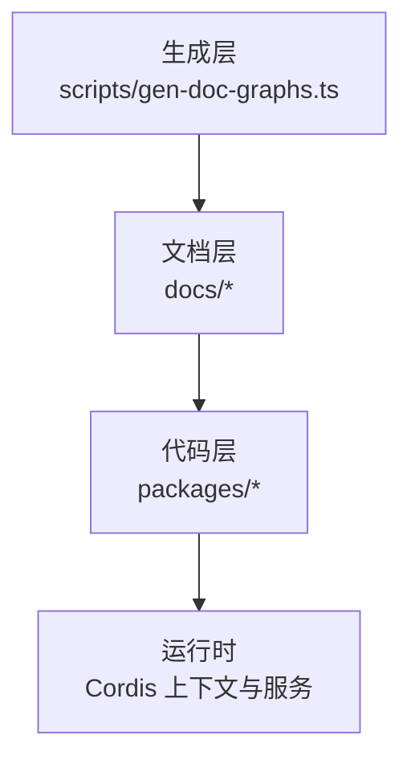
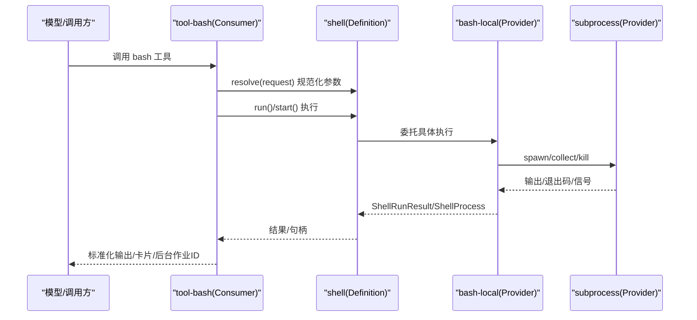
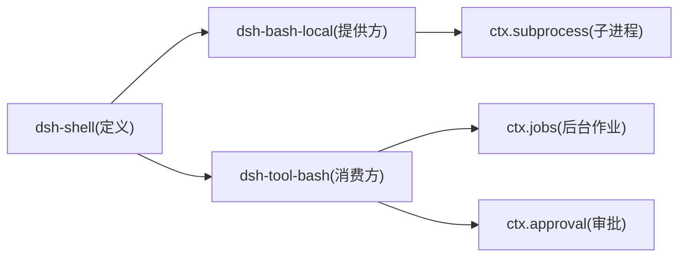

# 能力接缝设计

<cite>
**本文引用的文件**
- [docs/capability-seams.md](file://docs/capability-seams.md)
- [docs/user/develop/practice/index.zh.md](file://docs/user/develop/practice/index.zh.md)
- [docs/glossary.md](file://docs/glossary.md)
- [docs/cordis-api/service.md](file://docs/cordis-api/service.md)
- [docs/cordis-api/registry.md](file://docs/cordis-api/registry.md)
- [packages/shell/shell/src/types.ts](file://packages/shell/shell/src/types.ts)
- [packages/shell/bash-local/src/index.ts](file://packages/shell/bash-local/src/index.ts)
- [packages/shell/tool-bash/src/index.ts](file://packages/shell/tool-bash/src/index.ts)
- [scripts/gen-doc-graphs.ts](file://scripts/gen-doc-graphs.ts)
- [packages/extensions/tool-cordis/src/inspect.ts](file://packages/extensions/tool-cordis/src/inspect.ts)
- [packages/fs/fs/tests/service.spec.ts](file://packages/fs/fs/tests/service.spec.ts)
- [packages/extensions/cordis-host-runner/tests/sandbox-context.spec.ts](file://packages/extensions/cordis-host-runner/tests/sandbox-context.spec.ts)
- [packages/session/session-persistence/src/coordinator.ts](file://packages/session/session-persistence/src/coordinator.ts)
</cite>

## 目录
1. [简介](#简介)
2. [项目结构](#项目结构)
3. [核心组件](#核心组件)
4. [架构总览](#架构总览)
5. [详细组件分析](#详细组件分析)
6. [依赖关系分析](#依赖关系分析)
7. [性能考量](#性能考量)
8. [故障排查指南](#故障排查指南)
9. [结论](#结论)
10. [附录](#附录)

## 简介
本文件系统性阐述 Harness 的“能力接缝（Capability Seams）”设计与实践。能力接缝将“可替换的能力”拆分为三个角色：Service Definition（服务定义）、Service Provider（服务提供方）与 Consumer（消费方）。通过 Cordis 的服务注册、注入与插件机制，系统可在不改动消费者与工具契约的前提下，动态替换底层实现（如文件系统、子进程、终端等），并组合出不同部署形态。

## 项目结构
- 文档层：能力接缝概念、术语、Cordis API 参考、子系统说明。
- 代码层：以 shell 为例，展示 Service Definition（dsh-shell）、Provider（dsh-bash-local）、Consumer（dsh-tool-bash）的协作；同时提供测试与运行时诊断示例。
- 生成层：能力图由脚本从 Cordis 声明中推导，维护接口/实现/消费者角色分类与完整性校验。

图表来源
- [scripts/gen-doc-graphs.ts:628-653](file://scripts/gen-doc-graphs.ts#L628-L653)

章节来源
- [docs/capability-seams.md:1-472](file://docs/capability-seams.md#L1-L472)
- [scripts/gen-doc-graphs.ts:628-653](file://scripts/gen-doc-graphs.ts#L628-L653)

## 核心组件
- 服务基类与生命周期：Service 基类负责在构造时向 ctx 注册自身，随所属 fiber 自动卸载。
- 插件与依赖注入：Registry 提供 inject/plugin，支持声明式依赖与按需加载。
- 能力接缝三角色：
  - Service Definition：抽象或具体服务类，拥有 ctx.key 与领域类型。
  - Service Provider：实现或注册具体实现，遵循定义契约。
  - Consumer：通过 inject 获取服务，面向模型/用户暴露稳定 API。

章节来源
- [docs/cordis-api/service.md:1-103](file://docs/cordis-api/service.md#L1-L103)
- [docs/cordis-api/registry.md:1-153](file://docs/cordis-api/registry.md#L1-L153)
- [docs/user/develop/practice/index.zh.md:1-156](file://docs/user/develop/practice/index.zh.md#L1-L156)

## 架构总览
下图展示了 Bash 执行能力的完整接缝：定义、提供方与消费方的职责边界与交互路径。

图表来源
- [packages/shell/tool-bash/src/index.ts:190-395](file://packages/shell/tool-bash/src/index.ts#L190-L395)
- [packages/shell/bash-local/src/index.ts:102-334](file://packages/shell/bash-local/src/index.ts#L102-L334)
- [packages/shell/shell/src/types.ts:1-184](file://packages/shell/shell/src/types.ts#L1-L184)

章节来源
- [docs/capability-seams.md:1-472](file://docs/capability-seams.md#L1-L472)

## 详细组件分析

### 服务定义（Service Definition）
- 职责：定义 ctx.key 的类型与行为契约，集中领域词汇（请求/结果/句柄等），通常以抽象类或注册表形式存在。
- 示例：ShellExecutor 及其请求/结果/进程句柄类型集中在 dsh-shell/types，屏蔽底层实现差异。
- 关键点：
  - 明确前台 run 与后台 start 的生命周期语义。
  - 输出采用收集模式与溢出 spill 策略，保证大输出可控。
  - 沙箱信息作为可选事实附加到结果/句柄，便于上层呈现与审计。

章节来源
- [packages/shell/shell/src/types.ts:1-184](file://packages/shell/shell/src/types.ts#L1-L184)

### 服务提供方（Service Provider）
- 职责：实现 Service Definition 的抽象方法，管理资源、安全边界与性能特性。
- 示例：LocalBashExecutor 基于 ctx.subprocess 实现本地 bash 执行，处理超时、取消、输出截断与进程组终止。
- 关键点：
  - 配置驱动默认值与上限（超时、输出大小、spill 容量、grace 期）。
  - 环境隔离与凭据清洗，确保受管变量优先级正确。
  - 可扩展点：子类可通过重写 resolve/startArgv 等钩子接入沙箱或远程执行。

章节来源
- [packages/shell/bash-local/src/index.ts:102-334](file://packages/shell/bash-local/src/index.ts#L102-L334)

### 消费方（Consumer）
- 职责：将能力以稳定的模型/用户 API 暴露，封装策略、审批、渲染与错误处理。
- 示例：tool-bash 注册 bash 工具，处理前台/后台分支、工作目录解析、沙箱升级审批、结果渲染与后台作业集成。
- 关键点：
  - 显式声明依赖 inject，避免隐式耦合。
  - 对可选能力（如 jobs）进行守卫，缺失时报错而非静默失败。
  - 将领域 DTO 转换为只读 JSON，避免泄露内部类型。

章节来源
- [packages/shell/tool-bash/src/index.ts:190-395](file://packages/shell/tool-bash/src/index.ts#L190-L395)

### 接缝开发指南（接口设计、实现规范、测试策略）
- 接口设计
  - 将 Request/Result/句柄等类型放在 Service Definition 包中，Provider 与 Consumer 仅依赖该包。
  - 使用抽象类或注册表表达契约，避免裸 TypeScript interface 作为 seam 边界。
- 实现规范
  - Provider 应实现配置验证与默认值归一化，拒绝不可用配置。
  - 所有外部副作用（spawn、文件写入、网络）需具备超时、取消与清理保障。
  - 输出采用收集+spill 策略，避免内存膨胀。
- 测试策略
  - 为 Service Definition 编写最小 fake backend 的单元测试，覆盖注册、重复服务、dispose 与工厂方法。
  - 为 Provider 编写单元与集成测试，覆盖超时、取消、输出截断、进程组 kill。
  - 为 Consumer 编写端到端用例，验证工具 schema、渲染、审批流程与后台作业编排。

章节来源
- [packages/fs/fs/tests/service.spec.ts:1-24](file://packages/fs/fs/tests/service.spec.ts#L1-L24)

### 版本管理与向后兼容
- 事件/协议演进
  - 对持久化事件流进行兼容性检查，拒绝无法重放的旧版事件，避免静默退化。
- 服务发现与目录
  - 通过 Cordis 声明发现服务，结合生成脚本维护接口/实现/消费者角色清单，确保完备性。
- 建议
  - 新增字段优先采用可选字段与默认值；废弃字段保留过渡期并记录弃用提示。
  - 对破坏性变更提供迁移路径与检测逻辑。

章节来源
- [packages/session/session-persistence/src/coordinator.ts:273-297](file://packages/session/session-persistence/src/coordinator.ts#L273-L297)
- [scripts/gen-doc-graphs.ts:628-653](file://scripts/gen-doc-graphs.ts#L628-L653)

### 注册、发现与加载机制
- 注册：Service 基类在构造时向 ctx 注册自身，fiber 结束时自动卸载。
- 发现：Cordis 从插件声明中发现服务；运行时可查询当前存活服务与目录中的可用服务。
- 加载：Consumer 通过 inject 声明依赖，框架保证在 apply 时依赖已就绪；未声明依赖会在调用时提前拦截，避免僵尸工具。

章节来源
- [docs/cordis-api/service.md:1-103](file://docs/cordis-api/service.md#L1-L103)
- [docs/cordis-api/registry.md:1-153](file://docs/cordis-api/registry.md#L1-L153)
- [packages/extensions/tool-cordis/src/inspect.ts:53-80](file://packages/extensions/tool-cordis/src/inspect.ts#L53-L80)
- [packages/extensions/cordis-host-runner/tests/sandbox-context.spec.ts:178-205](file://packages/extensions/cordis-host-runner/tests/sandbox-context.spec.ts#L178-L205)

### 依赖关系与冲突解决
- 依赖方向
  - Provider 与 Consumer 均依赖 Service Definition，彼此解耦。
  - Consumer 可依赖其他核心服务（如 tools、jobs、approval），但必须显式声明。
- 冲突解决
  - 重复注册同一服务名会失败，强制唯一实现。
  - 可选能力缺失时，Consumer 应在入口处抛出明确错误，避免运行时出现“幽灵能力”。

章节来源
- [docs/user/develop/practice/index.zh.md:29-56](file://docs/user/develop/practice/index.zh.md#L29-L56)
- [packages/extensions/cordis-host-runner/tests/sandbox-context.spec.ts:178-205](file://packages/extensions/cordis-host-runner/tests/sandbox-context.spec.ts#L178-L205)

## 依赖关系分析
下图汇总了 Bash 能力相关包的依赖与消费关系，体现“定义—提供方—消费方”的清晰分层。

图表来源
- [packages/shell/shell/src/types.ts:1-184](file://packages/shell/shell/src/types.ts#L1-L184)
- [packages/shell/bash-local/src/index.ts:102-334](file://packages/shell/bash-local/src/index.ts#L102-L334)
- [packages/shell/tool-bash/src/index.ts:190-395](file://packages/shell/tool-bash/src/index.ts#L190-L395)

章节来源
- [docs/capability-seams.md:1-472](file://docs/capability-seams.md#L1-L472)

## 性能考量
- 输出控制：Provider 侧限制内存缓冲与 spill 容量，避免 OOM；Consumer 侧按需渲染，减少 UI 压力。
- 超时与取消：统一 deadline 管理，区分超时与外部取消原因，提升可观测性与稳定性。
- 后台任务：通过 jobs 管理长任务生命周期，支持取消与结果聚合。
- 沙箱开销：仅在必要时启用沙箱，并在 Provider 中复用共享资源（如 E2B 会话）。

[本节为通用指导，无需特定文件引用]

## 故障排查指南
- 未声明依赖导致工具不可用：若 Consumer 未声明 inject，调用时会提前报错，提示缺少服务。
- 重复服务注册：同一 key 被多次注册会失败，检查 cordis.yml 与插件命名空间。
- 旧事件无法重放：持久化协调器会拒绝不支持的旧版事件，需回滚或迁移数据。
- 后台任务无响应：确认 jobs 是否挂载，以及 provider 是否正确返回句柄与 done 事件。

章节来源
- [packages/extensions/cordis-host-runner/tests/sandbox-context.spec.ts:178-205](file://packages/extensions/cordis-host-runner/tests/sandbox-context.spec.ts#L178-L205)
- [packages/session/session-persistence/src/coordinator.ts:273-297](file://packages/session/session-persistence/src/coordinator.ts#L273-L297)

## 结论
能力接缝通过“定义—提供方—消费方”的三层拆分，实现了高内聚、低耦合的可插拔能力体系。借助 Cordis 的注册、注入与插件机制，Harness 能在不改变模型/用户契约的前提下，灵活替换底层实现，满足多部署场景与安全合规需求。配合完善的测试与版本兼容策略，可长期演进并保持系统稳定性。

[本节为总结性内容，无需特定文件引用]

## 附录
- 术语：seam 指完整能力（定义+提供方+消费方），不是单一接口或包。
- 最佳实践：
  - 仅在需要独立演进时才拆分角色；简单工具无需过度拆分。
  - 显式优于隐式：默认值与策略应在 resolve 阶段显式处理。
  - 面向模型的 API 保持稳定，内部实现可自由替换。

章节来源
- [docs/glossary.md:1-9](file://docs/glossary.md#L1-L9)
- [docs/user/develop/practice/index.zh.md:147-156](file://docs/user/develop/practice/index.zh.md#L147-L156)