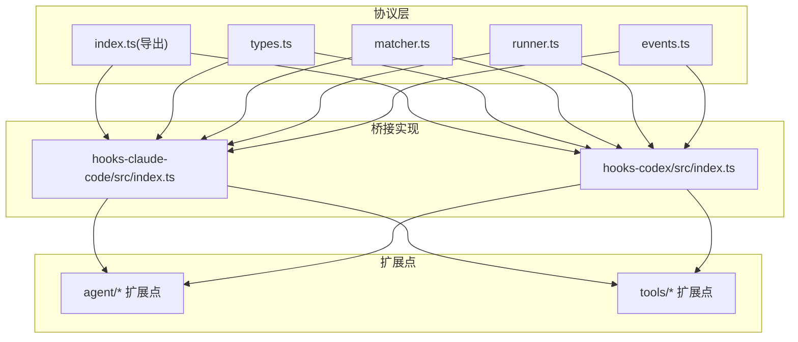
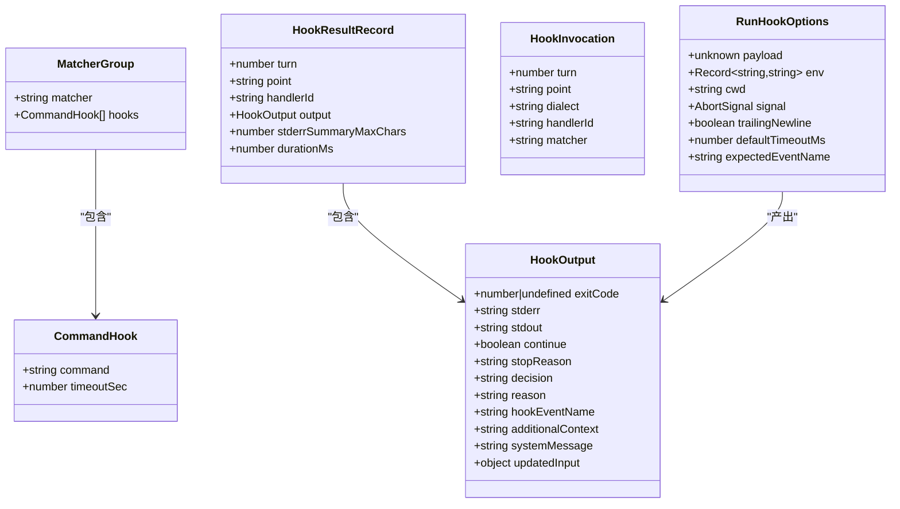
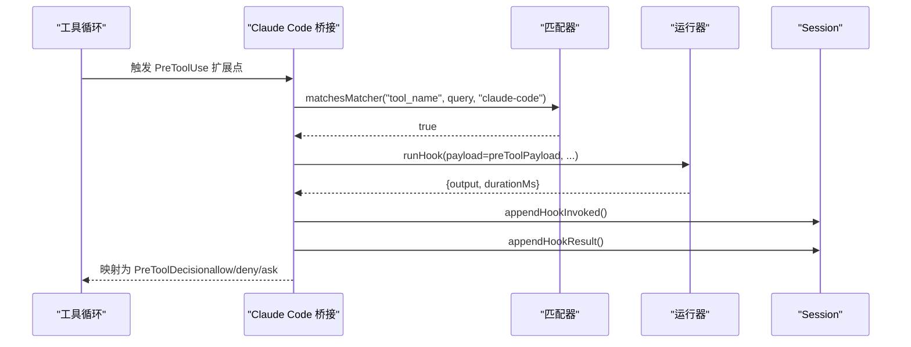
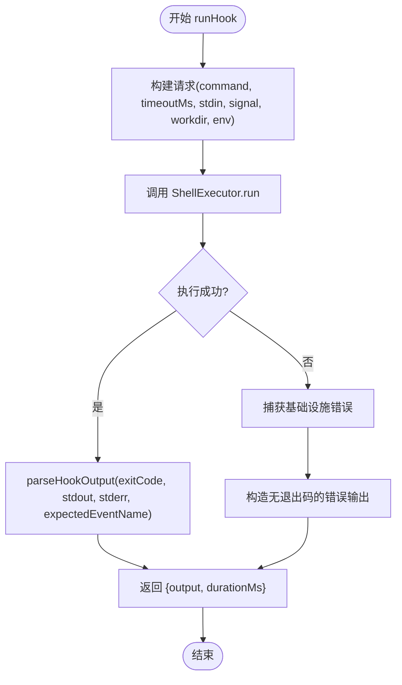
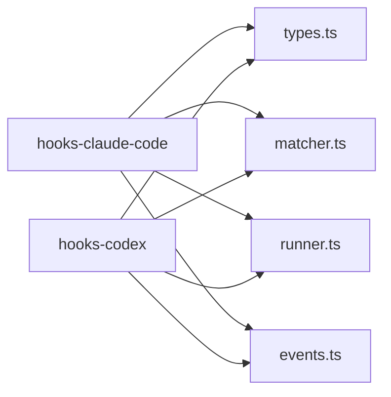

# 钩子系统

<cite>
**本文引用的文件**
- [packages/hooks/hook-protocol/src/index.ts](file://packages/hooks/hook-protocol/src/index.ts)
- [packages/hooks/hook-protocol/src/types.ts](file://packages/hooks/hook-protocol/src/types.ts)
- [packages/hooks/hook-protocol/src/runner.ts](file://packages/hooks/hook-protocol/src/runner.ts)
- [packages/hooks/hook-protocol/src/matcher.ts](file://packages/hooks/hook-protocol/src/matcher.ts)
- [packages/hooks/hook-protocol/src/events.ts](file://packages/hooks/hook-protocol/src/events.ts)
- [packages/hooks/hooks-claude-code/src/index.ts](file://packages/hooks/hooks-claude-code/src/index.ts)
- [packages/hooks/hooks-codex/src/index.ts](file://packages/hooks/hooks-codex/src/index.ts)
- [docs/cordis-api/events.md](file://docs/cordis-api/events.md)
- [docs/subsystems/tools.md](file://docs/subsystems/tools.md)
- [packages/core/agent-loop/tests/loop.spec.ts](file://packages/core/agent-loop/tests/loop.spec.ts)
</cite>

## 目录
1. [简介](#简介)
2. [项目结构](#项目结构)
3. [核心组件](#核心组件)
4. [架构总览](#架构总览)
5. [详细组件分析](#详细组件分析)
6. [依赖关系分析](#依赖关系分析)
7. [性能考虑](#性能考虑)
8. [故障排查指南](#故障排查指南)
9. [结论](#结论)
10. [附录](#附录)

## 简介
本文件系统性说明 DeepSeek Harness 的钩子系统：事件监听器的注册、触发与执行流程；预定义钩子（如 agent/pre-step、agent/request、tools/*）的用途与参数；以及如何开发自定义钩子、处理异步操作、错误处理和性能优化。文档同时给出代码级流程图与时序图，帮助读者在不同阶段注入自定义逻辑，并总结常见使用模式与最佳实践。

## 项目结构
钩子系统由“协议层 + 桥接实现 + 扩展点”三部分构成：
- 协议层：提供跨方言（Claude Code / Codex）共享的类型、匹配器、运行器、结果合并与持久化事件辅助。
- 桥接实现：将协议能力接入具体运行时（Claude Code 或 Codex），负责构造载荷、选择匹配组、调用 runHook、合并结果并映射到各扩展点的决策。
- 扩展点：Agent 生命周期与工具执行流水线中的拦截点，通过 waterfalls 等机制串联多个监听器，形成可组合的策略与控制流。

图表来源
- [packages/hooks/hook-protocol/src/index.ts:1-26](file://packages/hooks/hook-protocol/src/index.ts#L1-L26)
- [packages/hooks/hook-protocol/src/types.ts:1-138](file://packages/hooks/hook-protocol/src/types.ts#L1-L138)
- [packages/hooks/hook-protocol/src/matcher.ts:1-66](file://packages/hooks/hook-protocol/src/matcher.ts#L1-L66)
- [packages/hooks/hook-protocol/src/runner.ts:1-107](file://packages/hooks/hook-protocol/src/runner.ts#L1-L107)
- [packages/hooks/hook-protocol/src/events.ts:1-105](file://packages/hooks/hook-protocol/src/events.ts#L1-L105)
- [packages/hooks/hooks-claude-code/src/index.ts:128-361](file://packages/hooks/hooks-claude-code/src/index.ts#L128-L361)
- [packages/hooks/hooks-codex/src/index.ts:172-196](file://packages/hooks/hooks-codex/src/index.ts#L172-L196)

章节来源
- [packages/hooks/hook-protocol/src/index.ts:1-26](file://packages/hooks/hook-protocol/src/index.ts#L1-L26)
- [packages/hooks/hook-protocol/src/types.ts:1-138](file://packages/hooks/hook-protocol/src/types.ts#L1-L138)
- [packages/hooks/hook-protocol/src/matcher.ts:1-66](file://packages/hooks/hook-protocol/src/matcher.ts#L1-L66)
- [packages/hooks/hook-protocol/src/runner.ts:1-107](file://packages/hooks/hook-protocol/src/runner.ts#L1-L107)
- [packages/hooks/hook-protocol/src/events.ts:1-105](file://packages/hooks/hook-protocol/src/events.ts#L1-L105)
- [packages/hooks/hooks-claude-code/src/index.ts:128-361](file://packages/hooks/hooks-claude-code/src/index.ts#L128-L361)
- [packages/hooks/hooks-codex/src/index.ts:172-196](file://packages/hooks/hooks-codex/src/index.ts#L172-L196)

## 核心组件
- 类型与事件契约（types.ts）：定义命令型钩子、匹配器组、方言标识、以及跨进程的标准输出 HookOutput 与持久化 SessionEvent（hook/invoked、hook/result）。
- 匹配器（matcher.ts）：支持字面量与正则两种模式，提供诊断与匹配函数，屏蔽方言差异。
- 运行器（runner.ts）：通过 ShellExecutor 执行外部命令，统一超时、信号取消、stdin/stdout/stderr 收集与解码，返回标准化 HookOutput 与耗时。
- 持久化事件（events.ts）：为 hook/invoked 与 hook/result 提供追加方法，保证成对记录与 stderr 摘要裁剪。
- 桥接实现（hooks-claude-code、hooks-codex）：在 agent/session-start、prompt-submit、pre/post tool、stop 等扩展点挂载 runPoint，按匹配器筛选并执行命令钩子，合并结果并映射为各扩展点的决策。

章节来源
- [packages/hooks/hook-protocol/src/types.ts:1-138](file://packages/hooks/hook-protocol/src/types.ts#L1-L138)
- [packages/hooks/hook-protocol/src/matcher.ts:1-66](file://packages/hooks/hook-protocol/src/matcher.ts#L1-L66)
- [packages/hooks/hook-protocol/src/runner.ts:1-107](file://packages/hooks/hook-protocol/src/runner.ts#L1-L107)
- [packages/hooks/hook-protocol/src/events.ts:1-105](file://packages/hooks/hook-protocol/src/events.ts#L1-L105)
- [packages/hooks/hooks-claude-code/src/index.ts:128-361](file://packages/hooks/hooks-claude-code/src/index.ts#L128-L361)
- [packages/hooks/hooks-codex/src/index.ts:172-196](file://packages/hooks/hooks-codex/src/index.ts#L172-L196)

## 架构总览
下图展示从扩展点触发到命令钩子执行的端到端流程，包括匹配、运行、结果合并与持久化记录。

```mermaid
sequenceDiagram
participant EP as "扩展点<br/>agent/* 或 tools/*"
participant CC as "Claude Code 桥接"
participant CX as "Codex 桥接"
participant MP as "匹配器 matcher"
participant RH as "运行器 runner"
participant SH as "ShellExecutor"
participant SE as "Session 持久化"
EP->>CC : 触发 runPoint(point, query, payload, opts)
EP->>CX : 触发 runPoint(point, query, payload, opts)
CC->>MP : matchesMatcher(matcher, query, mode)
CX->>MP : matchesMatcher(matcher, query, mode)
MP-->>CC : true/false
MP-->>CX : true/false
CC->>RH : runHook(bash, commandHook, options, now)
CX->>RH : runHook(bash, commandHook, options, now)
RH->>SH : 执行命令(带 stdin/env/cwd/signal/timeout)
SH-->>RH : {stdout, stderr, exitCode}
RH->>RH : parseHookOutput(...)
RH-->>CC : {output, durationMs}
RH-->>CX : {output, durationMs}
CC->>SE : appendHookInvoked()
CX->>SE : appendHookInvoked()
CC->>SE : appendHookResult()
CX->>SE : appendHookResult()
CC-->>EP : 合并后的决策
CX-->>EP : 合并后的决策
```

图表来源
- [packages/hooks/hook-protocol/src/matcher.ts:1-66](file://packages/hooks/hook-protocol/src/matcher.ts#L1-L66)
- [packages/hooks/hook-protocol/src/runner.ts:1-107](file://packages/hooks/hook-protocol/src/runner.ts#L1-L107)
- [packages/hooks/hook-protocol/src/events.ts:1-105](file://packages/hooks/hook-protocol/src/events.ts#L1-L105)
- [packages/hooks/hooks-claude-code/src/index.ts:128-361](file://packages/hooks/hooks-claude-code/src/index.ts#L128-L361)
- [packages/hooks/hooks-codex/src/index.ts:172-196](file://packages/hooks/hooks-codex/src/index.ts#L172-L196)

## 详细组件分析

### 事件系统与分发模式
- 每个上下文混入事件 API，支持多种分发模式：emit（同步忽略返回值）、parallel（并发等待所有监听器）、serial（顺序等待直到提前终止）、bail（遇到第一个同步提前终止值即停）、waterfall（以 next 回调串联监听器）。
- 这些模式是构建水坝式拦截链的基础，用于 agent/* 与 tools/* 扩展点。

章节来源
- [docs/cordis-api/events.md:1-208](file://docs/cordis-api/events.md#L1-L208)

### 工具执行管线与 tools/* 事件
- 工具执行管线包含 pre-execute → 单调守卫 → execute（around-dispatch）→ post-execute → finalizeContent → result 等阶段。
- tools/* 事件覆盖：
  - tools/change：工具集合变更通知（emit）。
  - tools/code-dispatch-log：替换代码调用的日志副本（waterfall）。
  - tools/execute：围绕调用的超时/重试/指标包装（waterfall）。
  - tools/post-execute：接受/替换/增强/阻断结果（waterfall）。
  - tools/pre-execute：允许/拒绝/请求审批（waterfall）。
  - tools/result：观察最终冻结结果（emit）。

章节来源
- [docs/subsystems/tools.md:170-721](file://docs/subsystems/tools.md#L170-L721)

### Agent 扩展点：agent/pre-step 与 agent/session-start
- agent/pre-step：在每个提议步骤前触发，携带 turn、step、signal 等，可用于审计、限流、注入上下文或否决步骤。
- agent/session-start：会话启动时触发，用于注入初始上下文（不阻塞启动）。

章节来源
- [packages/core/agent-loop/tests/loop.spec.ts:867-898](file://packages/core/agent-loop/tests/loop.spec.ts#L867-L898)

### 命令钩子协议与运行
- CommandHook：声明 shell 命令与超时（秒）。
- MatcherGroup：匹配模式与一组命令钩子。
- HookOutput：标准化的进程输出与决策语义（continue、decision、reason、additionalContext、systemMessage 等）。
- runHook：封装超时、信号、工作目录与环境变量，解析 stdout/stderr，返回 HookOutput 与耗时。
- 持久化事件：hook/invoked 与 hook/result 成对记录，stderr 摘要裁剪，durationMs 审计。

章节来源
- [packages/hooks/hook-protocol/src/types.ts:1-138](file://packages/hooks/hook-protocol/src/types.ts#L1-L138)
- [packages/hooks/hook-protocol/src/runner.ts:1-107](file://packages/hooks/hook-protocol/src/runner.ts#L1-L107)
- [packages/hooks/hook-protocol/src/events.ts:1-105](file://packages/hooks/hook-protocol/src/events.ts#L1-L105)

### 匹配器与方言差异
- Claude Code：纯字母数字与下划线加竖线的模式视为字面量（pipe 分隔的精确匹配），其他模式作为正则。
- Codex：非空模式一律作为未锚定正则。
- 提供 matcherDiagnostic 用于配置期诊断非法正则，matchesMatcher 用于运行期匹配。

章节来源
- [packages/hooks/hook-protocol/src/matcher.ts:1-66](file://packages/hooks/hook-protocol/src/matcher.ts#L1-L66)

### 桥接实现：Claude Code 与 Codex
- 两者均实现 runPoint：读取配置的匹配组，过滤匹配项，逐个执行命令钩子，合并结果，并将 merged 映射为对应扩展点的决策。
- Claude Code 桥接：
  - 在 agent/session-start 中异步运行 SessionStart 钩子，将 additionalContext 注入 agent。
  - 在 PreToolUse/PostToolUse/Stop 等点构造载荷并运行命令钩子。
- Codex 桥接：
  - 同样在 agent/session-start 中运行 SessionStart 钩子，并在无 session 场景下直接运行工具相关钩子。

章节来源
- [packages/hooks/hooks-claude-code/src/index.ts:128-361](file://packages/hooks/hooks-claude-code/src/index.ts#L128-L361)
- [packages/hooks/hooks-codex/src/index.ts:172-196](file://packages/hooks/hooks-codex/src/index.ts#L172-L196)

### 类图：关键数据结构

图表来源
- [packages/hooks/hook-protocol/src/types.ts:1-138](file://packages/hooks/hook-protocol/src/types.ts#L1-L138)
- [packages/hooks/hook-protocol/src/runner.ts:1-107](file://packages/hooks/hook-protocol/src/runner.ts#L1-L107)
- [packages/hooks/hook-protocol/src/events.ts:1-105](file://packages/hooks/hook-protocol/src/events.ts#L1-L105)

### 时序图：PreToolUse 钩子执行

图表来源
- [packages/hooks/hooks-claude-code/src/index.ts:339-344](file://packages/hooks/hooks-claude-code/src/index.ts#L339-L344)
- [packages/hooks/hook-protocol/src/matcher.ts:1-66](file://packages/hooks/hook-protocol/src/matcher.ts#L1-L66)
- [packages/hooks/hook-protocol/src/runner.ts:1-107](file://packages/hooks/hook-protocol/src/runner.ts#L1-L107)
- [packages/hooks/hook-protocol/src/events.ts:1-105](file://packages/hooks/hook-protocol/src/events.ts#L1-L105)

### 流程图：runHook 执行与异常路径

图表来源
- [packages/hooks/hook-protocol/src/runner.ts:67-107](file://packages/hooks/hook-protocol/src/runner.ts#L67-L107)

## 依赖关系分析
- 桥接实现依赖协议层的 types、matcher、runner、events。
- 协议层不依赖具体桥接，保持中立。
- 扩展点（agent/*、tools/*）通过桥接实现与命令钩子解耦，便于多方言复用。

图表来源
- [packages/hooks/hook-protocol/src/index.ts:1-26](file://packages/hooks/hook-protocol/src/index.ts#L1-L26)
- [packages/hooks/hooks-claude-code/src/index.ts:128-361](file://packages/hooks/hooks-claude-code/src/index.ts#L128-L361)
- [packages/hooks/hooks-codex/src/index.ts:172-196](file://packages/hooks/hooks-codex/src/index.ts#L172-L196)

章节来源
- [packages/hooks/hook-protocol/src/index.ts:1-26](file://packages/hooks/hook-protocol/src/index.ts#L1-L26)

## 性能考虑
- 超时控制：默认每钩子超时 600 秒，可通过 per-hook timeoutSec 覆盖；避免长时间阻塞主循环。
- 并发与顺序：waterfall 模式适合串行策略（如审批），parallel/serial/bail 适用于不同策略需求。
- 资源管理：通过 AbortSignal 传递取消信号，确保钩子在父操作取消时及时退出。
- I/O 限制：stderr 摘要裁剪避免大输出影响日志体积；stdout 仅保留必要信息。
- 匹配器效率：优先使用字面量匹配（Claude Code）减少正则开销；避免复杂正则。

[本节为通用指导，不直接分析具体文件]

## 故障排查指南
- 钩子无法运行：检查 ShellExecutor 是否可用、工作目录是否存在、环境变量是否正确；runHook 会将基础设施错误转为无退出码的输出，不会崩溃调用方。
- 审批缺失导致失败：当 ask 决策但无审批服务时，会关闭失败；确认审批通道已挂载。
- 匹配器无效：使用 matcherDiagnostic 在配置期校验正则；运行期非法正则视为不匹配。
- 超时问题：调整 per-hook timeoutSec 或 defaultTimeoutMs；确保钩子内部响应取消信号。
- 日志不完整：确认 hook/invoked 与 hook/result 成对写入；检查 stderr 摘要裁剪阈值。

章节来源
- [packages/hooks/hook-protocol/src/runner.ts:86-107](file://packages/hooks/hook-protocol/src/runner.ts#L86-L107)
- [packages/hooks/hook-protocol/src/matcher.ts:31-44](file://packages/hooks/hook-protocol/src/matcher.ts#L31-L44)
- [packages/hooks/hook-protocol/src/events.ts:70-105](file://packages/hooks/hook-protocol/src/events.ts#L70-L105)

## 结论
DeepSeek Harness 钩子系统通过协议层与桥接实现的清晰分层，提供了跨方言的命令钩子能力，并以 waterfalls 和多种分发模式支撑 agent/* 与 tools/* 扩展点。借助匹配器、超时、取消信号与持久化事件，系统在保证稳定性的同时具备高度可扩展性。遵循本文的最佳实践，可在不同阶段安全地注入自定义逻辑，实现审计、审批、限流、上下文注入等目标。

[本节为总结，不直接分析具体文件]

## 附录
- 常用扩展点参考：
  - agent/session-start：会话启动时注入上下文（不阻塞）。
  - agent/pre-step：每个步骤前进行审计/限流/否决。
  - tools/pre-execute：允许/拒绝/请求审批。
  - tools/execute：超时/重试/指标包装。
  - tools/post-execute：结果增强/阻断。
  - tools/result：最终结果观测。
- 开发建议：
  - 使用 ctx.on(ctx.once) 注册监听器，注意资源释放。
  - 在 waterfall 中正确调用 next()，避免意外阻断。
  - 关注 exec.signal，确保异步钩子可被取消。
  - 利用匹配器精准选择钩子，降低误触发风险。

[本节为补充说明，不直接分析具体文件]