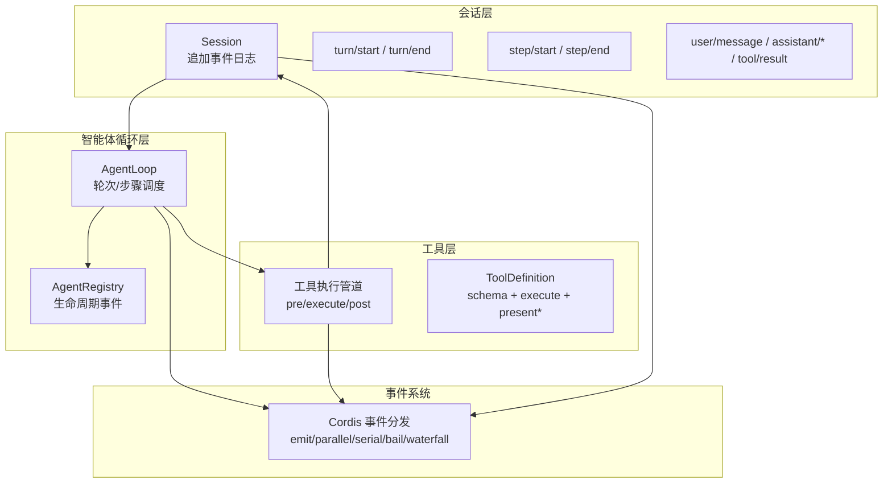
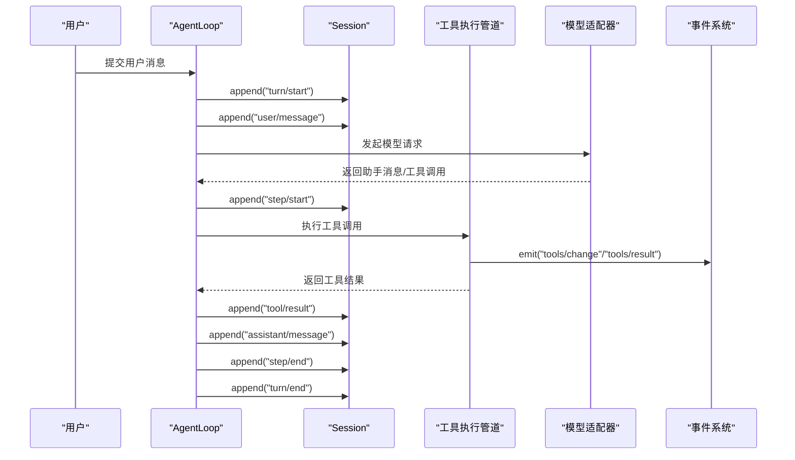
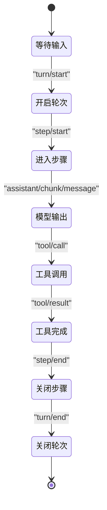
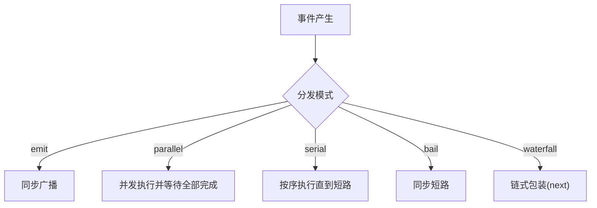
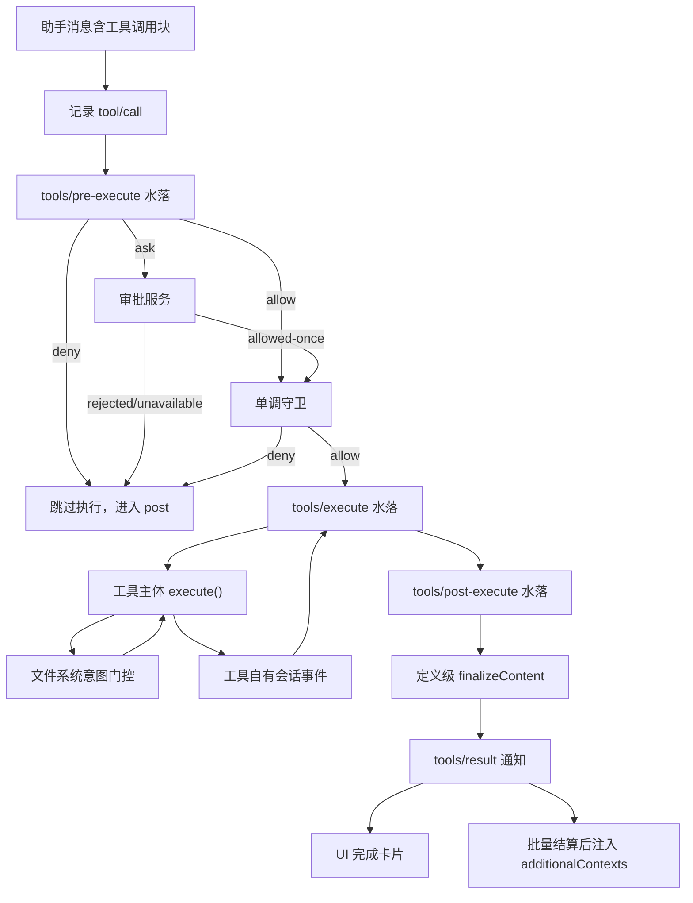
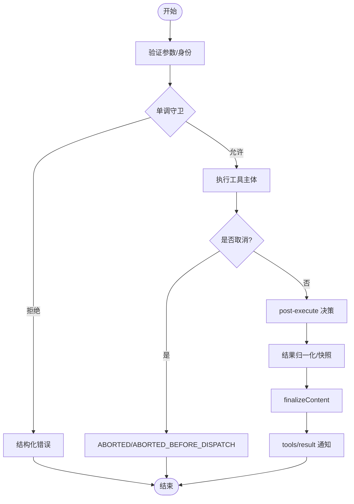
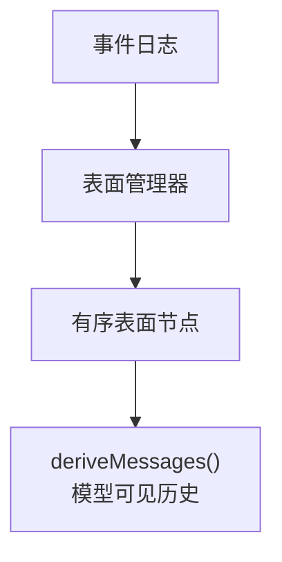
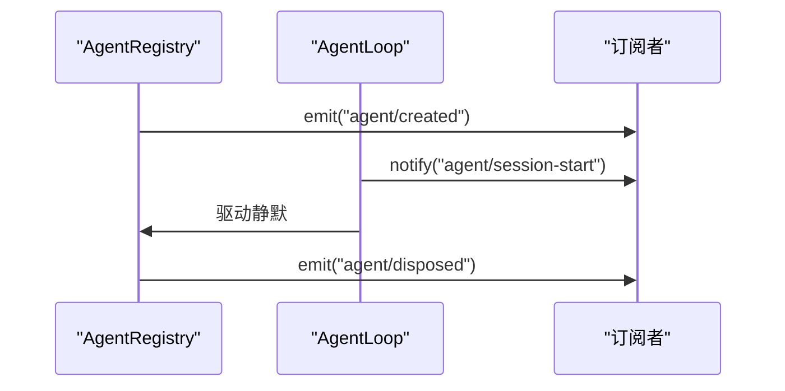
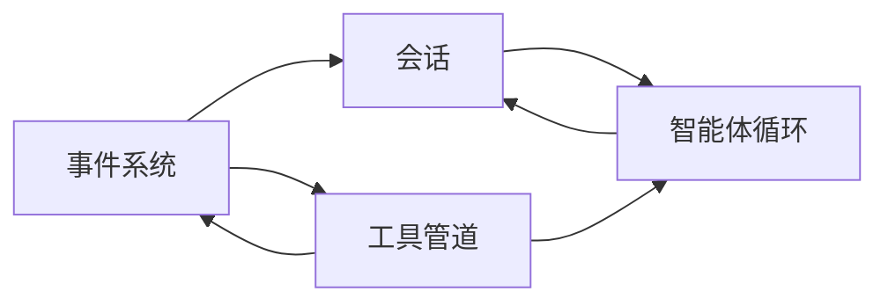

# 数据流与控制流

<cite>
**本文引用的文件**
- [工具执行流水线文档](file://docs/tool-execution-pipeline.md)
- [会话子系统文档](file://docs/subsystems/session.md)
- [工具子系统文档](file://docs/subsystems/tools.md)
- [Cordis 事件 API 文档](file://docs/cordis-api/events.md)
- [Agent 循环与工具调用测试](file://packages/core/agent-loop/tests/resume.spec.ts)
- [工具执行管道不变式测试](file://packages/core/tools/tests/invariant.spec.ts)
- [会话持久化测试](file://packages/session/session-persistence/tests/persistence.spec.ts)
- [会话核心测试](file://packages/core/session/tests/session.spec.ts)
</cite>

## 目录
1. [简介](#简介)
2. [项目结构](#项目结构)
3. [核心组件](#核心组件)
4. [架构总览](#架构总览)
5. [详细组件分析](#详细组件分析)
6. [依赖关系分析](#依赖关系分析)
7. [性能考量](#性能考量)
8. [故障排查指南](#故障排查指南)
9. [结论](#结论)
10. [附录](#附录)

## 简介
本文件聚焦 DeepSeek Harness 的“从用户输入到响应输出”的完整处理路径，围绕 turn（轮次）与 step（步骤）的生命周期、事件驱动的消息传递机制、SessionEvent/AgentEvent/CapabilityEvent 的区别与使用场景，以及工具执行管道 tools/pre-execute → tools/execute → tools/post-execute 的处理流程进行系统化说明。通过时序图与状态转换图，帮助开发者理解系统的运行时行为与关键边界条件。

## 项目结构
DeepSeek Harness 采用插件化与分层设计：
- 会话层：以 Session 为追加型事件日志，作为唯一事实源；turn/step/user/message/assistant/* 等事件构成会话历史。
- 智能体循环层：管理 turn/step 生命周期、调度模型调用与工具执行、维护 Agent 注册表与生命周期事件。
- 工具层：提供统一的工具定义、执行管道与 UI 呈现契约，贯穿 pre/execute/post 三阶段水落。
- 事件系统：基于 Cordis 的 ctx.emit/parallel/serial/bail/waterfall 等分发模式，支撑跨子系统消息传递。

图表来源
- [会话子系统文档:1-125](file://docs/subsystems/session.md#L1-L125)
- [工具子系统文档:170-405](file://docs/subsystems/tools.md#L170-L405)
- [Cordis 事件 API 文档:8-123](file://docs/cordis-api/events.md#L8-L123)

章节来源
- [会话子系统文档:1-125](file://docs/subsystems/session.md#L1-L125)
- [工具子系统文档:170-405](file://docs/subsystems/tools.md#L170-L405)
- [Cordis 事件 API 文档:8-123](file://docs/cordis-api/events.md#L8-L123)

## 核心组件
- 会话（Session）：追加型事件日志，包含 turn/step 边界、用户消息、助手消息、工具调用与结果等；支持表面投影（surface）用于生成模型可见的历史。
- 智能体循环（AgentLoop）：编排 turn/step 生命周期，驱动模型请求与工具执行，发布 agent/created、agent/disposed 等生命周期事件。
- 工具执行管道：三段水落（pre/execute/post）+ 单调守卫 + 最终内容归一化 + 结果通知；保证可审计、可回放、可扩展。
- 事件系统：统一的事件分发模式，支持同步/异步、串行/并行、短路（bail）与链式包装（waterfall）。

章节来源
- [会话子系统文档:194-358](file://docs/subsystems/session.md#L194-L358)
- [工具子系统文档:170-405](file://docs/subsystems/tools.md#L170-L405)
- [Cordis 事件 API 文档:8-123](file://docs/cordis-api/events.md#L8-L123)

## 架构总览
下图展示从用户输入到响应输出的端到端流程，包括 turn/step 生命周期、工具执行管道与事件传播。

图表来源
- [会话子系统文档:27-125](file://docs/subsystems/session.md#L27-L125)
- [工具执行流水线文档:8-58](file://docs/tool-execution-pipeline.md#L8-L58)
- [工具子系统文档:576-721](file://docs/subsystems/tools.md#L576-L721)

## 详细组件分析

### 轮次与步骤的生命周期（turn/step）
- turn：一次完整的交互轮次，包含一个或多个 step。
- step：一次模型调用及其请求的工具执行集合。
- 事件序列：turn/start → user/message → step/start → assistant/chunk → assistant/message → tool/call → tool/result → step/end → turn/end。
- 结束原因：completed、aborted、blocked、error、max-tokens、interrupted 等。

图表来源
- [会话子系统文档:27-125](file://docs/subsystems/session.md#L27-L125)
- [会话子系统文档:540-576](file://docs/subsystems/session.md#L540-L576)

章节来源
- [会话子系统文档:27-125](file://docs/subsystems/session.md#L27-L125)
- [会话子系统文档:540-576](file://docs/subsystems/session.md#L540-L576)

### 事件驱动架构与消息传递
- 事件类型与用途：
  - SessionEvent：会话级事件，描述 turn/step、消息、工具调用与结果等，是持久化的唯一事实源。
  - AgentEvent：智能体生命周期事件（如 agent/created、agent/disposed），用于订阅智能体的创建与销毁。
  - CapabilityEvent：能力相关事件（如工具注册变更 tools/change、Code Mode 子调度日志 tools/code-dispatch-log），用于扩展点与策略钩子。
- 分发模式：
  - emit：同步广播，忽略返回值。
  - parallel：并发执行所有监听器，全部完成后 resolve。
  - serial：按序执行直到某个监听器返回非空值（短路）。
  - bail：同步短路，遇到第一个非空返回值即停止。
  - waterfall：链式包装，每个监听器可选择调用 next() 继续或拦截。

图表来源
- [Cordis 事件 API 文档:8-123](file://docs/cordis-api/events.md#L8-L123)
- [工具子系统文档:576-721](file://docs/subsystems/tools.md#L576-L721)

章节来源
- [Cordis 事件 API 文档:8-123](file://docs/cordis-api/events.md#L8-L123)
- [工具子系统文档:576-721](file://docs/subsystems/tools.md#L576-L721)

### 工具执行管道（tools/pre-execute → tools/execute → tools/post-execute）
- pre-execute：允许/拒绝/询问（ask）；审批服务通过后进入下一步。
- 单调守卫：不可逆的最终策略，只能减少权限。
- execute：around-dispatch 包装（超时、重试、指标）；执行工具主体。
- post-execute：接受/替换/增强/阻断；将结果规范化并注入上下文。
- finalizeContent：定义级最终内容归一化；确保内容不变量。
- result：冻结的权威结果通知；UI 与持久化消费。

图表来源
- [工具执行流水线文档:8-58](file://docs/tool-execution-pipeline.md#L8-L58)
- [工具子系统文档:170-405](file://docs/subsystems/tools.md#L170-L405)

章节来源
- [工具执行流水线文档:8-58](file://docs/tool-execution-pipeline.md#L8-L58)
- [工具子系统文档:170-405](file://docs/subsystems/tools.md#L170-L405)

### 工具执行管道的不变式与错误处理
- 不变式：
  - 参数在政策前被解析并冻结，身份字段只读。
  - 工具主体必须观察取消信号并在退出时达到静默。
  - 结果在最终观察者前被快照并冻结，确保一致性。
- 错误处理：
  - 未知工具、抛出异常均转为结构化错误（如 UNKNOWN_TOOL）。
  - 监听器异常被隔离，不破坏核心生命周期。
  - 审批缺失或不可用视为拒绝。

图表来源
- [工具子系统文档:170-405](file://docs/subsystems/tools.md#L170-L405)
- [工具执行管道不变式测试:40-70](file://packages/core/tools/tests/invariant.spec.ts#L40-L70)

章节来源
- [工具子系统文档:170-405](file://docs/subsystems/tools.md#L170-L405)
- [工具执行管道不变式测试:40-70](file://packages/core/tools/tests/invariant.spec.ts#L40-L70)

### 会话事件与表面投影
- 表面事件：user/message、assistant/message、tool/result 可进入有序表面，其他事件仅入日志。
- 表面操作：append（追加）、replace（替换一段范围）。
- 派生历史：deriveMessages() 基于表面节点生成模型可见消息数组，缓存且冻结。

图表来源
- [会话子系统文档:251-358](file://docs/subsystems/session.md#L251-L358)

章节来源
- [会话子系统文档:251-358](file://docs/subsystems/session.md#L251-L358)

### 智能体生命周期与事件
- agent/created：在作用域设置完成后、会话与智能体注册表条目存在时触发；首个非否决的 agent/session-start 通知是受支持的启动注入点。
- agent/disposed：精确表示智能体已离开注册表；在驱动静默后发出。

图表来源
- [Agent 循环与工具调用测试:127-139](file://packages/core/agent-loop/tests/resume.spec.ts#L127-L139)

章节来源
- [Agent 循环与工具调用测试:127-139](file://packages/core/agent-loop/tests/resume.spec.ts#L127-L139)

## 依赖关系分析
- 会话依赖事件系统：append 事件后通过 store-owned hooks 通知观察者。
- 智能体循环依赖会话与工具：编排 turn/step，驱动模型与工具执行。
- 工具依赖事件系统与策略：pre/execute/post 水落、单调守卫、审批服务。
- 外部集成：Code Mode 子调度、文件系统意图门控、持久化后端。

图表来源
- [会话子系统文档:601-606](file://docs/subsystems/session.md#L601-L606)
- [工具子系统文档:576-721](file://docs/subsystems/tools.md#L576-L721)

章节来源
- [会话子系统文档:601-606](file://docs/subsystems/session.md#L601-L606)
- [工具子系统文档:576-721](file://docs/subsystems/tools.md#L576-L721)

## 性能考量
- 会话追加路径避免阻塞 I/O：持久化插件异步缓冲，flush 由策略控制。
- 工具执行支持并发与独占模式：根据 isConcurrencySafe 分类形成屏障与滚动池。
- 结果快照与冻结：减少重复拷贝，提升回放与 UI 渲染效率。
- 表面投影缓存：每个表面节点仅投影一次，重写时重建。

[本节为通用指导，无需特定文件引用]

## 故障排查指南
- 常见错误：
  - 未知工具：映射为 UNKNOWN_TOOL，不中断 turn。
  - 审批失败：缺少审批服务或不可用时视为拒绝。
  - 监听器异常：被隔离，不影响后续监听器。
- 调试建议：
  - 订阅 tools/result 与 session/event 观察最终结果与会话变化。
  - 检查单调守卫与 pre/post 水落的决策路径。
  - 确认工具主体正确观察取消信号并达到静默。

章节来源
- [工具子系统文档:170-405](file://docs/subsystems/tools.md#L170-L405)
- [会话子系统文档:601-606](file://docs/subsystems/session.md#L601-L606)

## 结论
DeepSeek Harness 通过会话事件日志、智能体循环与工具执行管道实现了高内聚、低耦合的事件驱动架构。turn/step 生命周期清晰，工具管道具备可扩展的策略与呈现能力，事件系统提供灵活的消息传递机制。遵循本文档的流程与约束，开发者可可靠地扩展功能、定位问题并优化性能。

[本节为总结性内容，无需特定文件引用]

## 附录
- 术语表：
  - turn：一轮交互，包含一个或多个 step。
  - step：一次模型调用及工具执行集合。
  - SessionEvent：会话级事件，持久化事实源。
  - AgentEvent：智能体生命周期事件。
  - CapabilityEvent：能力相关事件（工具注册、Code Mode 子调度等）。
- 参考链接：
  - 工具执行流水线文档
  - 会话子系统文档
  - 工具子系统文档
  - Cordis 事件 API 文档

[本节为补充信息，无需特定文件引用]