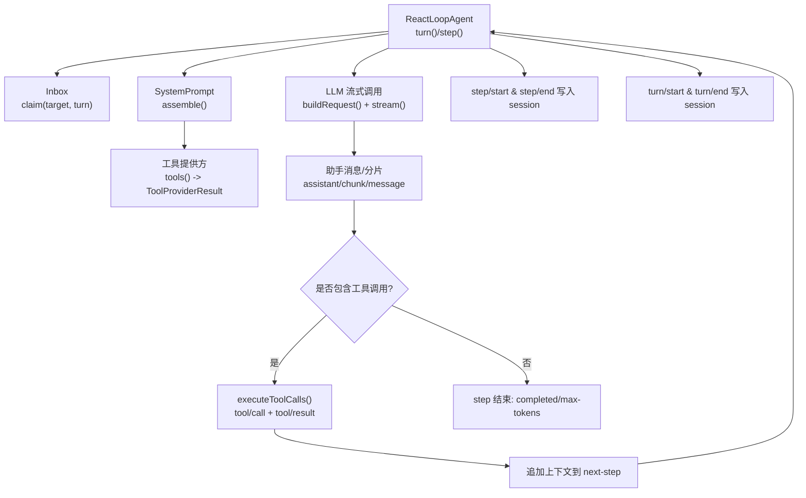
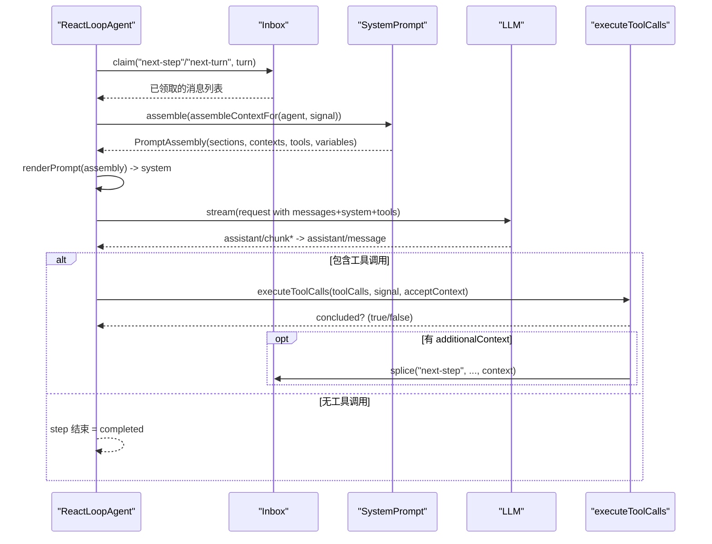
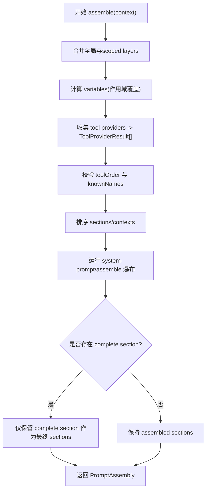
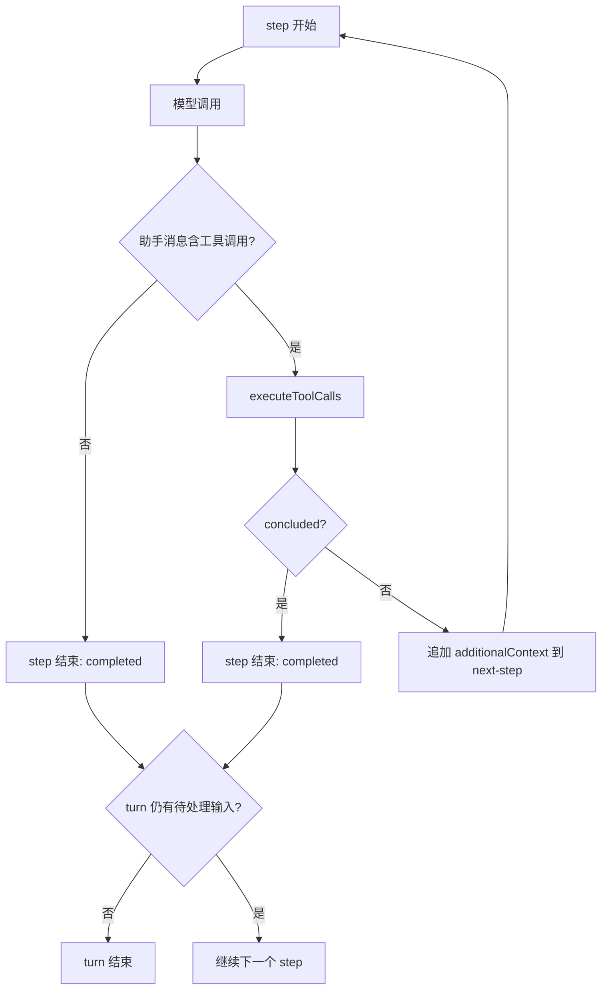
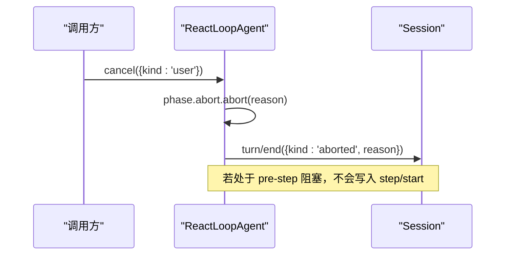
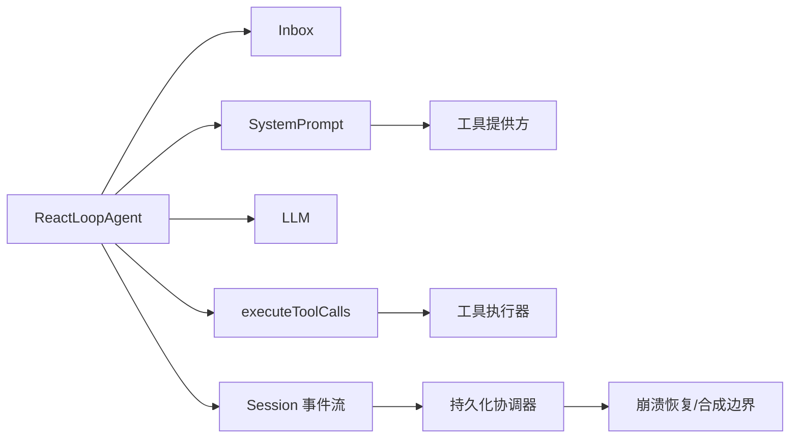

# Turn 流程

<cite>
**本文引用的文件**
- [agent.ts](file://packages/core/agent-loop/src/agent.ts)
- [tool-calls.ts](file://packages/core/agent-loop/src/tool-calls.ts)
- [inbox.ts](file://packages/core/agent/src/inbox.ts)
- [system-prompt/index.ts](file://packages/core/system-prompt/src/index.ts)
- [repair.ts](file://packages/core/session/src/repair.ts)
- [session.spec.ts](file://packages/core/session/tests/session.spec.ts)
- [loop.spec.ts](file://packages/core/agent-loop/tests/loop.spec.ts)
- [contract-regressions.spec.ts](file://packages/core/agent-loop/tests/contract-regressions.spec.ts)
- [consumed-work.ts](file://packages/core/agent/src/consumed-work.ts)
- [core.md](file://docs/subsystems/core.md)
- [system-prompt.zh.md](file://docs/subsystems/system-prompt.zh.md)
</cite>

## 目录
1. [简介](#简介)
2. [项目结构](#项目结构)
3. [核心组件](#核心组件)
4. [架构总览](#架构总览)
5. [详细组件分析](#详细组件分析)
6. [依赖关系分析](#依赖关系分析)
7. [性能考量](#性能考量)
8. [故障排查指南](#故障排查指南)
9. [结论](#结论)
10. [附录](#附录)

## 简介
本文面向 DeepSeek Harness 的 Turn 驱动流程，系统性解释 step 与 turn 的概念差异、turn 的完整生命周期、claim next-step input 机制、prompt 组装与 tool schemas 生成、agent/pre-step 事件拦截、step/start 与 step/end 钩子、工具调用如何触发新 step 以及 turn 何时关闭。文档包含时序图与状态转换图，并提供调试建议与常见问题定位方法。

## 项目结构
Turn 流程的核心位于 agent-loop 层，围绕 ReactLoopAgent 驱动 session 的 turn/step 边界；Inbox 负责 next-turn/next-step 待处理消息的持久化投影与领取；SystemPrompt 负责系统提示、动态上下文与工具 schema 的组装；tool-calls 负责模型返回的工具调度的执行与结果回写；session 修复逻辑保证中断场景下的边界一致性。



图表来源
- [agent.ts:245-330](file://packages/core/agent-loop/src/agent.ts#L245-L330)
- [agent.ts:332-401](file://packages/core/agent-loop/src/agent.ts#L332-L401)
- [agent.ts:407-495](file://packages/core/agent-loop/src/agent.ts#L407-L495)
- [tool-calls.ts:59-101](file://packages/core/agent-loop/src/tool-calls.ts#L59-L101)
- [system-prompt/index.ts:467-542](file://packages/core/system-prompt/src/index.ts#L467-L542)

章节来源
- [agent.ts:245-330](file://packages/core/agent-loop/src/agent.ts#L245-L330)
- [agent.ts:332-401](file://packages/core/agent-loop/src/agent.ts#L332-L401)
- [agent.ts:407-495](file://packages/core/agent-loop/src/agent.ts#L407-L495)
- [tool-calls.ts:59-101](file://packages/core/agent-loop/src/tool-calls.ts#L59-L101)
- [system-prompt/index.ts:467-542](file://packages/core/system-prompt/src/index.ts#L467-L542)

## 核心组件
- ReactLoopAgent：维护 idle/maintenance/running 三态，驱动 turn 循环，管理 step 边界、请求构建、错误与取消、以及 turn 结束原因聚合。
- Inbox：对 next-turn/next-step 进行持久化投影，支持 append/prepend/replace/remove/splice 与 claim（原子领取一批）。
- SystemPrompt：注册系统段落、动态上下文、变量与工具提供方，按顺序合并并运行 assemble 瀑布，输出 PromptAssembly（sections/context/tools/variables）。
- executeToolCalls：将模型返回的工具调用按模式（串行/并行）调度，提交 tool/call 与 tool/result，并将结果中的 additionalContext 注入 next-step。
- Session 修复：在崩溃恢复时合成缺失的 step/end 与 turn/end，保证边界一致。

章节来源
- [agent.ts:64-111](file://packages/core/agent-loop/src/agent.ts#L64-L111)
- [inbox.ts:25-78](file://packages/core/agent/src/inbox.ts#L25-L78)
- [system-prompt/index.ts:337-542](file://packages/core/system-prompt/src/index.ts#L337-L542)
- [tool-calls.ts:59-101](file://packages/core/agent-loop/src/tool-calls.ts#L59-L101)
- [repair.ts:126-133](file://packages/core/session/src/repair.ts#L126-L133)

## 架构总览
Turn 是“一次用户意图”的边界，Step 是“一次模型调用及其后续工具调用”的边界。一个 turn 可包含多个 step；当 step 没有工具调用或工具调用全部完成且未产生新的 next-step 上下文时，step 结束；当 turn 内无更多待处理输入且满足结束条件时，turn 结束。

```mermaid
stateDiagram-v2
[*] --> Idle
Idle --> Running : "wakeDriver()"
Running --> Running : "step 完成但未结束 turn"
Running --> Idle : "turn 结束(无待处理输入)"
Running --> Running : "max-tokens 标记仍继续"
note right of Running : "turn 结束原因 : completed/blocked/aborted/error/interrupted/max-tokens"
```

图表来源
- [agent.ts:172-223](file://packages/core/agent-loop/src/agent.ts#L172-L223)
- [agent.ts:245-330](file://packages/core/agent-loop/src/agent.ts#L245-L330)
- [session.zh.md:551-577](file://docs/subsystems/session.zh.md#L551-L577)

## 详细组件分析

### Turn 与 Step 的概念区别
- Turn：以用户意图为单位的完整交互轮次。turn/start 与 turn/end 包裹整个轮次，记录 turn 结束原因（completed/blocked/aborted/error/interrupted/max-tokens）。
- Step：一次模型调用及随后的工具调用闭环。step/start 与 step/end 包裹一次 step，可能多次出现在同一 turn 中。

关键行为
- preStep 在每次拟议 step 之前执行，先 claim 下一批输入，再组装 prompt 并通过 agent/pre-step 瀑布决策进入 step。
- 若 decision.kind === 'reject'，turn 以 blocked 结束；若首轮即无消息，turn 以 completed 结束且不发起模型调用。
- step 结束时若无工具调用则 completed；若有工具调用则执行并可能追加上下文到 next-step，从而开启下一个 step。

章节来源
- [agent.ts:225-243](file://packages/core/agent-loop/src/agent.ts#L225-L243)
- [agent.ts:245-330](file://packages/core/agent-loop/src/agent.ts#L245-L330)
- [agent.ts:332-401](file://packages/core/agent-loop/src/agent.ts#L332-L401)

### Claim next-step input 机制
- 每个拟议 step 前，Inbox.claim(target, turn) 会原子移除整批 next-step 消息；在 turn 边界还会额外移除一条 next-turn 消息。
- claim 后逐条发出 agent/inbox/claimed { message, turn }，并以该独占批次与 { turn, step, signal } 等待 waterfall。
- 工具执行结果中的 additionalContext 会被追加到 next-step，从而触发下一个 step。



图表来源
- [agent.ts:225-243](file://packages/core/agent-loop/src/agent.ts#L225-L243)
- [agent.ts:332-401](file://packages/core/agent-loop/src/agent.ts#L332-L401)
- [tool-calls.ts:59-101](file://packages/core/agent-loop/src/tool-calls.ts#L59-L101)
- [system-prompt/index.ts:467-542](file://packages/core/system-prompt/src/index.ts#L467-L542)

章节来源
- [inbox.ts:71-78](file://packages/core/agent/src/inbox.ts#L71-L78)
- [agent.ts:225-243](file://packages/core/agent-loop/src/agent.ts#L225-L243)
- [tool-calls.ts:59-101](file://packages/core/agent-loop/src/tool-calls.ts#L59-L101)

### Prompt 组装与 Tool Schemas 生成
- SystemPrompt.assemble 收集全局与 scoped 的 sections、contexts、variables 与 tool providers，按 order 排序，应用 toolOrder 限制与未知名校验，运行 system-prompt/assemble 瀑布，最终输出 PromptAssembly。
- 工具提供方通过 ctx.systemPrompt.tools(provider) 注册，provider(context) 返回 ToolProviderResult{ schemas, knownNames? }。
- 组装后的 tools 作为 GenerateOptions.tools 传入 LLM 请求，使模型可见当前步骤可用的工具集合。



图表来源
- [system-prompt/index.ts:467-542](file://packages/core/system-prompt/src/index.ts#L467-L542)
- [system-prompt.zh.md:26-38](file://docs/subsystems/system-prompt.zh.md#L26-L38)

章节来源
- [system-prompt/index.ts:467-542](file://packages/core/system-prompt/src/index.ts#L467-L542)
- [system-prompt.zh.md:26-38](file://docs/subsystems/system-prompt.zh.md#L26-L38)

### agent/pre-step 事件的作用与拦截机制
- 每个拟议 step 前都会触发 agent/pre-step，携带 claimed 消息、turn/step 序号与 AbortSignal。
- 插件可通过 waterfall 修改消息、拒绝进入 step（reject），或在首轮空消息时直接结束 turn。
- 测试验证了 pre-step 在每个拟议 step 打开前只触发一次，且信号属于 AbortSignal。

```mermaid
sequenceDiagram
participant Loop as "ReactLoopAgent"
participant Inbox as "Inbox"
participant SP as "SystemPrompt"
participant Waterfall as "agent/pre-step 瀑布"
participant Session as "Session"
Loop->>Inbox : claim(target, turn)
Loop->>SP : assemble(...)
Loop->>Waterfall : dispatch('agent/pre-step', {messages,...})
Waterfall-->>Loop : enter|reject
alt reject
Loop->>Session : turn/end({kind : 'blocked'})
else enter
Loop->>Session : step/start
Loop->>Loop : step(assembly)
Loop->>Session : step/end
end
```

图表来源
- [agent.ts:225-243](file://packages/core/agent-loop/src/agent.ts#L225-L243)
- [agent.ts:245-330](file://packages/core/agent-loop/src/agent.ts#L245-L330)
- [loop.spec.ts:867-898](file://packages/core/agent-loop/tests/loop.spec.ts#L867-L898)

章节来源
- [agent.ts:225-243](file://packages/core/agent-loop/src/agent.ts#L225-L243)
- [loop.spec.ts:867-898](file://packages/core/agent-loop/tests/loop.spec.ts#L867-L898)

### step/start 与 step/end 生命周期钩子
- 在 pre-step 决定进入 step 后，立即写入 step/start，随后执行 step 逻辑，最后写入 step/end。
- 即使首轮被改写为空消息，也会拥有初始 turn 边界但不发起模型调用。
- 任何失败都会结构化记录，并在 finally 中确保 step/end 写入。

章节来源
- [agent.ts:263-299](file://packages/core/agent-loop/src/agent.ts#L263-L299)
- [agent.ts:332-401](file://packages/core/agent-loop/src/agent.ts#L332-L401)

### 工具调用如何触发新 step 以及 turn 何时关闭
- 当助手消息包含 tool-call 块时，executeToolCalls 会按模式调度执行，提交 tool/call 与 tool/result。
- 若结果包含 additionalContext，会被追加到 next-step，从而在下一次 preStep 时被 claim 并开启新 step。
- turn 关闭条件：
  - 无待处理输入且满足结束条件（completed/blocked/aborted/error/interrupted/max-tokens）。
  - max-tokens 具有粘性：一旦某 step 达到 token 上限，整个 turn 结束原因升级为 max-tokens。
  - 若 pre-step 拒绝或首轮无消息，turn 直接结束。



图表来源
- [agent.ts:332-401](file://packages/core/agent-loop/src/agent.ts#L332-L401)
- [agent.ts:245-330](file://packages/core/agent-loop/src/agent.ts#L245-L330)
- [tool-calls.ts:59-101](file://packages/core/agent-loop/src/tool-calls.ts#L59-L101)

章节来源
- [agent.ts:332-401](file://packages/core/agent-loop/src/agent.ts#L332-L401)
- [tool-calls.ts:59-101](file://packages/core/agent-loop/src/tool-calls.ts#L59-L101)

### 取消与中断：turn 的生命周期保护
- cancel 会清空 inbox（除非 keepInbox）并中止当前 running 阶段的 abort signal。
- 在 pre-step 阻塞期间取消，turn 会以 aborted 结束，不产出 step/start。
- 会话恢复时若存在 open step，会先合成 step/end，再合成 turn/end（interrupted）。



图表来源
- [agent.ts:134-140](file://packages/core/agent-loop/src/agent.ts#L134-L140)
- [agent.ts:245-330](file://packages/core/agent-loop/src/agent.ts#L245-L330)
- [repair.ts:126-133](file://packages/core/session/src/repair.ts#L126-L133)
- [contract-regressions.spec.ts:1264-1292](file://packages/core/agent-loop/tests/contract-regressions.spec.ts#L1264-L1292)

章节来源
- [agent.ts:134-140](file://packages/core/agent-loop/src/agent.ts#L134-L140)
- [agent.ts:245-330](file://packages/core/agent-loop/src/agent.ts#L245-L330)
- [repair.ts:126-133](file://packages/core/session/src/repair.ts#L126-L133)
- [contract-regressions.spec.ts:1264-1292](file://packages/core/agent-loop/tests/contract-regressions.spec.ts#L1264-L1292)

## 依赖关系分析
- ReactLoopAgent 依赖：
  - Inbox：用于 next-turn/next-step 的持久化投影与 claim。
  - SystemPrompt：用于每步前的 prompt 组装与工具 schema 生成。
  - LLM：用于构建请求与流式调用。
  - executeToolCalls：用于工具调度的并发控制与结果回写。
- 外部事件：
  - agent/pre-step：允许插件拦截/改写消息或拒绝进入 step。
  - agent/request：允许调整 provider/model/配置。
  - agent/request-error：允许重试策略。
- 持久化与恢复：
  - session/event 流被持久化协调器消费，崩溃恢复时由 repair 合成缺失边界。



图表来源
- [agent.ts:245-495](file://packages/core/agent-loop/src/agent.ts#L245-L495)
- [system-prompt/index.ts:467-542](file://packages/core/system-prompt/src/index.ts#L467-L542)
- [tool-calls.ts:59-101](file://packages/core/agent-loop/src/tool-calls.ts#L59-L101)
- [repair.ts:126-133](file://packages/core/session/src/repair.ts#L126-L133)

章节来源
- [agent.ts:245-495](file://packages/core/agent-loop/src/agent.ts#L245-L495)
- [system-prompt/index.ts:467-542](file://packages/core/system-prompt/src/index.ts#L467-L542)
- [tool-calls.ts:59-101](file://packages/core/agent-loop/src/tool-calls.ts#L59-L101)
- [repair.ts:126-133](file://packages/core/session/src/repair.ts#L126-L133)

## 性能考量
- 预组装与缓存：SystemPrompt.assemble 在每步前执行，应避免在 provider 中进行昂贵计算；必要时利用 AssembleContext 与变量减少重复工作。
- 工具并发：executeToolCalls 使用有界并行池，避免过多并发导致资源争用；注意串行屏障（exclusive）会限制吞吐。
- 流式处理：LLM 响应以 chunk 形式追加，降低首字节延迟；注意在高频 chunk 下合理控制 UI 刷新。
- 最大令牌：max-tokens 具有粘性，应在上游配置合理的 maxTokens 以避免频繁截断。

[本节提供通用指导，无需特定文件引用]

## 故障排查指南
- 问题：pre-step 抛出异常导致下游 hook 失败
  - 现象：goal-round-driver 监听器抛错会传播至 next() await，丢弃整个 step 提议。
  - 定位：检查 agent/pre-step 监听器实现，确保异常可控。
  - 参考：[goal-round-driver.spec.ts:576-594](file://packages/goal/goal-round-driver/tests/goal-round-driver.spec.ts#L576-L594)

- 问题：取消发生在 pre-step 阻塞期间
  - 现象：turn 以 aborted 结束，未产生 step/start 与 assistant/chunk。
  - 定位：确认 cancel 时机与 pre-step 阻塞点；观察 session 事件序列。
  - 参考：[contract-regressions.spec.ts:1264-1292](file://packages/core/agent-loop/tests/contract-regressions.spec.ts#L1264-L1292)

- 问题：会话恢复后缺少 step/end 或 turn/end
  - 现象：回放或加载后边界不一致。
  - 定位：检查 repair 逻辑是否正确合成缺失边界。
  - 参考：[repair.ts:126-133](file://packages/core/session/src/repair.ts#L126-L133)

- 问题：工具调用未正确关联结果
  - 现象：tool/call 无对应 result 或顺序错乱。
  - 定位：检查 executeToolCalls 的有序提交与 additionalContext 注入。
  - 参考：[tool-calls.ts:248-289](file://packages/core/agent-loop/src/tool-calls.ts#L248-L289)

- 问题：turn 结束原因不符合预期
  - 现象：completed 与 max-tokens 混淆。
  - 定位：确认 step 结束原因与 turn 结束原因聚合逻辑。
  - 参考：[agent.ts:285-291](file://packages/core/agent-loop/src/agent.ts#L285-L291)

章节来源
- [goal-round-driver.spec.ts:576-594](file://packages/goal/goal-round-driver/tests/goal-round-driver.spec.ts#L576-L594)
- [contract-regressions.spec.ts:1264-1292](file://packages/core/agent-loop/tests/contract-regressions.spec.ts#L1264-L1292)
- [repair.ts:126-133](file://packages/core/session/src/repair.ts#L126-L133)
- [tool-calls.ts:248-289](file://packages/core/agent-loop/src/tool-calls.ts#L248-L289)
- [agent.ts:285-291](file://packages/core/agent-loop/src/agent.ts#L285-L291)

## 结论
Turn 流程以 turn 为单位组织用户意图，以 step 为单位组织模型调用与工具执行。通过 Inbox 的 claim 机制与 SystemPrompt 的组装能力，系统在每一步前都能精确控制输入与工具可见性。agent/pre-step 提供了强大的拦截点，step/start/end 保证了边界的可观测性与可恢复性。工具调用通过 additionalContext 驱动新 step，形成多轮协作；turn 在满足结束条件或遇到取消/错误时关闭。理解这些机制有助于调试复杂交互、优化性能并确保可靠性。

[本节总结性内容，无需特定文件引用]

## 附录
- 术语对照
  - Turn：一轮用户意图的完整边界
  - Step：一次模型调用及后续工具调用的闭环
  - Pre-step：在进入 step 前的准备与拦截阶段
  - AdditionalContext：工具结果中注入 next-step 的上下文，驱动新 step
  - Max-tokens：输出 token 上限，具有粘性影响 turn 结束原因

[本节为概念补充，无需特定文件引用]