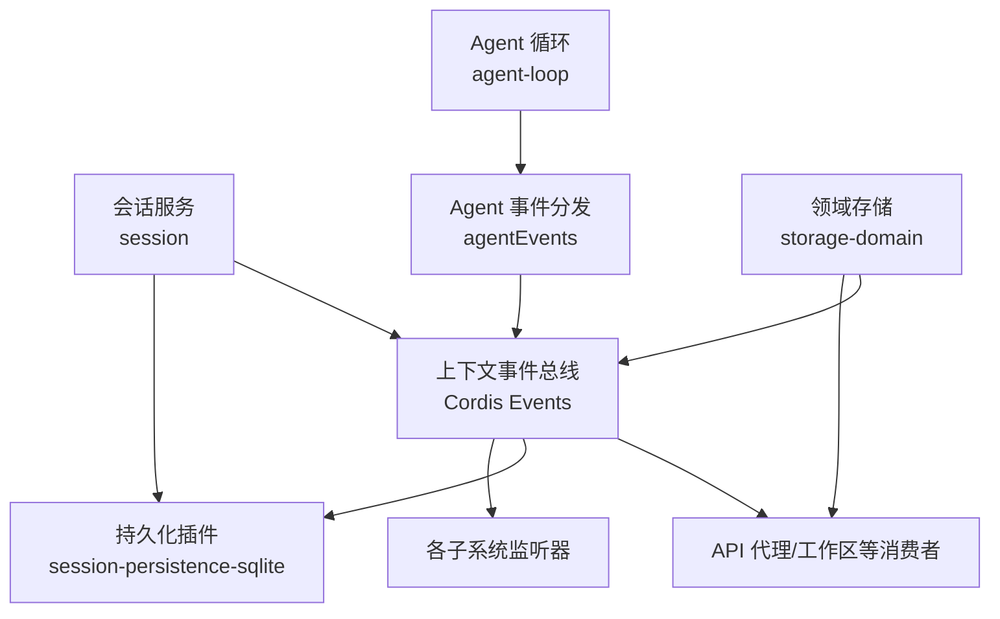
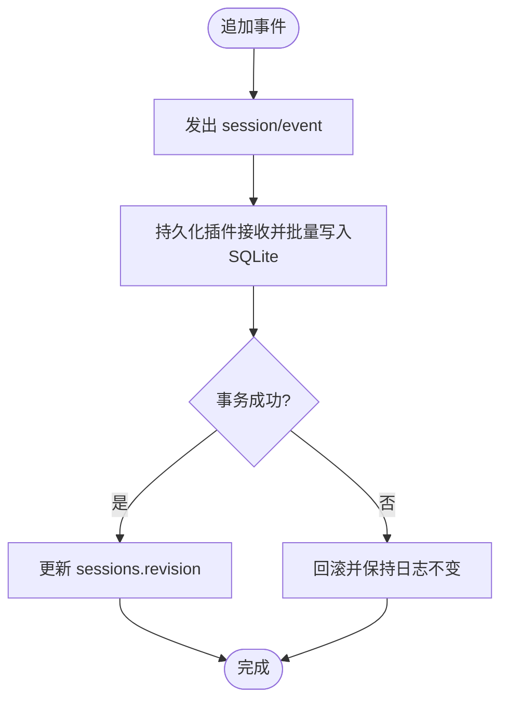
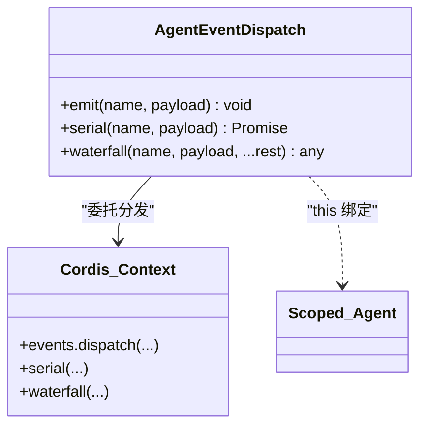
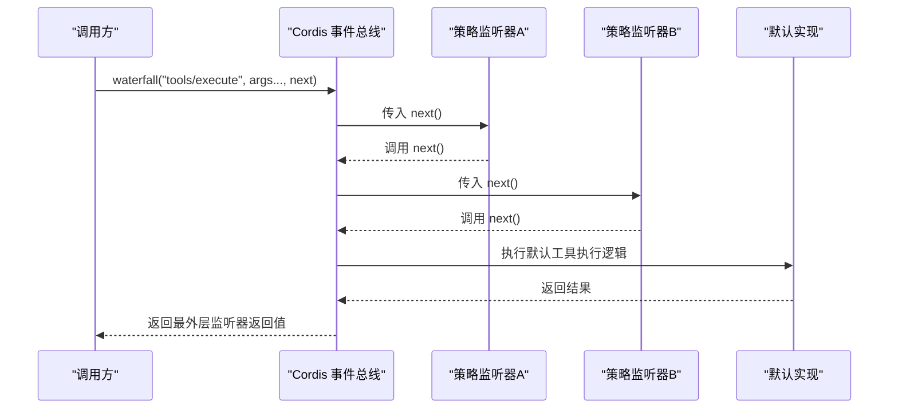
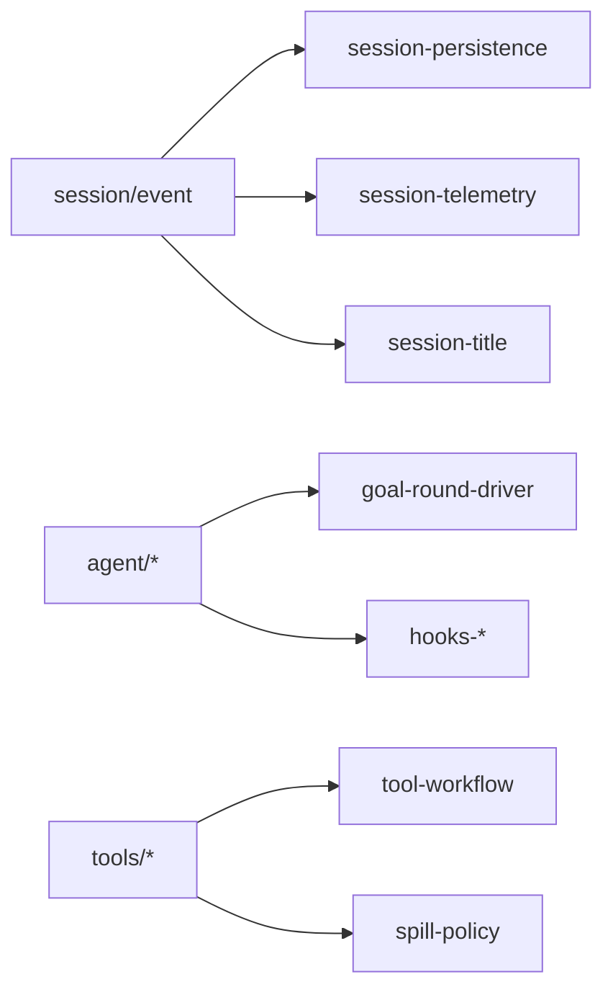
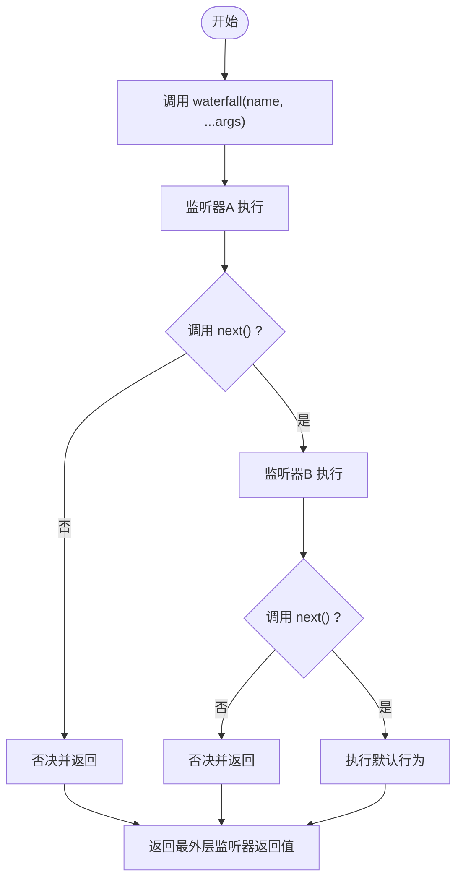

# 事件系统

<cite>
**本文引用的文件**
- [packages/core/session/src/index.ts](file://packages/core/session/src/index.ts)
- [packages/core/agent/src/dispatch.ts](file://packages/core/agent/src/dispatch.ts)
- [packages/storage/storage-domain/src/events.ts](file://packages/storage/storage-domain/src/events.ts)
- [packages/session/session-persistence-sqlite/src/index.ts](file://packages/session/session-persistence-sqlite/src/index.ts)
- [packages/session-query/tool-session-query/src/operations.ts](file://packages/session-query/tool-session-query/src/operations.ts)
- [docs/cordis-api/events.md](file://docs/cordis-api/events.md)
- [docs/event-producer-consumer.md](file://docs/event-producer-consumer.md)
- [packages/extensions/tool-cordis/src/api-catalog.ts](file://packages/extensions/tool-cordis/src/api-catalog.ts)
</cite>

## 目录
1. [简介](#简介)
2. [项目结构](#项目结构)
3. [核心组件](#核心组件)
4. [架构总览](#架构总览)
5. [详细组件分析](#详细组件分析)
6. [依赖关系分析](#依赖关系分析)
7. [性能考量](#性能考量)
8. [故障排查指南](#故障排查指南)
9. [结论](#结论)
10. [附录](#附录)

## 简介
本文件系统性梳理 Harness 的事件系统，聚焦三类事件：Session 事件、Agent 事件、Capability（能力）事件。文档解释它们的区别与使用场景、持久化机制（哪些写入 session log、哪些为临时事件）、发布订阅模式（含 waterfall 处理）、监听器注册与执行顺序、错误处理、类型定义与类型安全保证、调试工具与性能优化建议，并配套流程图与最佳实践。

## 项目结构
事件系统由“事件声明 + 分发器 + 监听器 + 持久化”构成：
- 事件声明：通过模块扩展在 Context.Events 中声明事件名、参数与分发模式（emit/parallel/serial/bail/waterfall）。
- 分发器：Context 提供 ctx.emit、ctx.parallel、ctx.serial、ctx.bail、ctx.waterfall；Agent 提供 agentEvents 封装的 emit/serial/waterfall，自动注入 agent 主体与作用域。
- 监听器：各子系统通过 ctx.on/once 注册，支持 prepend/global 选项与作用域过滤。
- 持久化：Session 事件通过 session/event 通知持久化插件，最终落盘到 SQLite/JSONL；Domain 变更通过 domain/changed 进行跨进程推送。



图表来源
- [packages/core/session/src/index.ts:37-86](file://packages/core/session/src/index.ts#L37-L86)
- [packages/core/agent/src/dispatch.ts:107-149](file://packages/core/agent/src/dispatch.ts#L107-L149)
- [packages/storage/storage-domain/src/events.ts:36-48](file://packages/storage/storage-domain/src/events.ts#L36-L48)
- [docs/cordis-api/events.md:8-147](file://docs/cordis-api/events.md#L8-L147)

章节来源
- [packages/core/session/src/index.ts:37-86](file://packages/core/session/src/index.ts#L37-L86)
- [docs/cordis-api/events.md:8-147](file://docs/cordis-api/events.md#L8-L147)

## 核心组件
- Session 事件：围绕会话生命周期与日志追加，包括 session/created、session/disposed、session/event、session/flush。session/event 是追加后的“已提交”通知，供持久化、遥测、投影等消费。
- Agent 事件：围绕 Agent 生命周期与运行期钩子，如 agent/created、agent/disposed、agent/status、agent/request、agent/pre-step、agent/request-error、agent/turn-stopping 等。Agent 事件通过 agentEvents 注入 agent 主体与作用域，确保主题与作用键一致。
- Capability（能力）事件：以文件系统、审批、工具执行等为代表的“能力层”事件，例如 fs/write-intent、fs/edit-intent、approval/request、tools/execute 等，通常采用 waterfall 模式允许策略或中间件改写行为。

章节来源
- [packages/core/session/src/index.ts:37-86](file://packages/core/session/src/index.ts#L37-L86)
- [packages/core/agent/src/dispatch.ts:107-149](file://packages/core/agent/src/dispatch.ts#L107-L149)
- [docs/event-producer-consumer.md:8-66](file://docs/event-producer-consumer.md#L8-L66)

## 架构总览
下图展示事件从产生到被消费的关键路径，以及 waterfall 的链式调用方式。

```mermaid
sequenceDiagram
participant Loop as "AgentLoop"
participant AE as "agentEvents"
participant Bus as "Cordis 事件总线"
participant L1 as "监听器A"
participant L2 as "监听器B"
participant Next as "默认行为(next)"
Loop->>AE : 调用 waterfall("agent/pre-step", payload, next)
AE->>Bus : 转发(this=Scoped<Agent>, name, payload, ...rest)
Bus->>L1 : 传入 next()
L1-->>Bus : 调用 next() 或否决
Bus->>L2 : 传入 next()
L2-->>Bus : 调用 next() 或否决
Bus->>Next : 执行内置默认逻辑
Next-->>Bus : 返回结果
Bus-->>AE : 返回最外层监听器返回值
AE-->>Loop : 返回决策结果
```

图表来源
- [packages/core/agent/src/dispatch.ts:107-149](file://packages/core/agent/src/dispatch.ts#L107-L149)
- [docs/cordis-api/events.md:97-123](file://docs/cordis-api/events.md#L97-L123)

## 详细组件分析

### Session 事件与持久化
- 事件模型：Session 事件是追加型日志，每个事件包含 seq、type、time、data，以及 envelope 字段（source_event_seqs、surface_op、ignorable）。
- 持久化流程：
  - 会话服务在追加成功后发出 session/event 通知。
  - 持久化插件监听 session/event，批量写入 SQLite（单事务），并在 commit 后更新 revision。
  - 加载时若遇到未知事件类型且未标记 ignorable，将拒绝加载；若标记 ignorable，则保留事件但跳过解析。
- 临时 vs 持久：
  - 进入 session/log 的事件均为持久化内容（JSON 序列化 data）。
  - 仅用于运行时协调的事件（如 agent/status、domain/changed）不写入 session log，属于“临时事件”。



图表来源
- [packages/core/session/src/index.ts:65-86](file://packages/core/session/src/index.ts#L65-L86)
- [packages/session/session-persistence-sqlite/src/index.ts:278-302](file://packages/session/session-persistence-sqlite/src/index.ts#L278-L302)

章节来源
- [packages/core/session/src/index.ts:65-86](file://packages/core/session/src/index.ts#L65-L86)
- [packages/session/session-persistence-sqlite/src/index.ts:278-302](file://packages/session/session-persistence-sqlite/src/index.ts#L278-L302)

### Agent 事件与类型安全
- 作用域与主体注入：agentEvents 将 Scoped<Agent> 作为 this 并注入 payload.agent，防止主题与作用键不一致。
- 分发模式：
  - emit：非否决通知，异常被捕获并记录，不影响后续监听器。
  - serial：按序等待，首个 bail 值终止。
  - waterfall：链式中间件，next() 继续，不调用即否决。
- 类型安全：
  - AgentSubjectEvent 通过类型推导限定只有带 { agent } 且 this 为 Scoped<Agent> 的事件才进入 agentEvents 表面。
  - 调用方只需传递 payload 其余字段，agent 由分发器注入，避免越界覆盖。



图表来源
- [packages/core/agent/src/dispatch.ts:54-82](file://packages/core/agent/src/dispatch.ts#L54-L82)
- [packages/core/agent/src/dispatch.ts:107-149](file://packages/core/agent/src/dispatch.ts#L107-L149)

章节来源
- [packages/core/agent/src/dispatch.ts:20-96](file://packages/core/agent/src/dispatch.ts#L20-L96)
- [packages/core/agent/src/dispatch.ts:107-149](file://packages/core/agent/src/dispatch.ts#L107-L149)

### Capability（能力）事件与 Waterfall 处理
- 典型能力事件：
  - 文件系统：fs/write-intent、fs/edit-intent、fs/observed。
  - 审批：approval/request。
  - 工具执行：tools/pre-execute、tools/execute、tools/post-execute、tools/result。
- Waterfall 语义：
  - 每个监听器包裹后续链，调用 next() 继续，不调用即否决。
  - 默认行为位于链尾，可被前置监听器替换或拦截。
- 使用场景：
  - 权限检查、策略改写、重试/补偿、审计与观测。



图表来源
- [docs/cordis-api/events.md:97-123](file://docs/cordis-api/events.md#L97-L123)
- [docs/event-producer-consumer.md:34-59](file://docs/event-producer-consumer.md#L34-L59)

章节来源
- [docs/event-producer-consumer.md:34-59](file://docs/event-producer-consumer.md#L34-L59)

### 事件类型定义与类型安全保证
- 编译期类型：
  - 通过 declare module '@deepseek-ai/cordis' 扩展 Events 接口，声明事件签名与 @mode。
  - 生成器会校验 mode 与 next 参数的匹配性，确保 waterfall 事件具备 trailing next。
- 运行期约束：
  - Session 事件 data 以 JSON 形式持久化，仅做 isJsonValue 校验（可序列化性），不做结构校验。
  - 未知事件类型在加载时若未标记 ignorable 将被拒绝；标记 ignorable 则可跳过解析但仍保留事件。
- 插件扩展：
  - 插件可通过合并 SessionEventMap 获得编译期类型提示，但无运行期 schema 校验。

章节来源
- [packages/storage/storage-domain/src/events.ts:36-48](file://packages/storage/storage-domain/src/events.ts#L36-L48)
- [packages/session/session-persistence/tests/coordinator-contract.ts:1360-1386](file://packages/session/session-persistence/tests/coordinator-contract.ts#L1360-L1386)

### 事件监听器的注册、执行顺序与错误处理
- 注册：
  - ctx.on(name, listener, options?)：支持 prepend（前置）与 global（绕过作用域过滤）。
  - ctx.once(name, listener, options?)：首次触发后自动移除。
- 执行顺序：
  - emit：同步遍历所有监听器，异常被捕获并记录，不会中断其他监听器。
  - parallel：并发执行所有监听器，全部 settle 后返回。
  - serial：按序 await，首个 bail 值终止。
  - bail：同步短路，首个非空返回值终止。
  - waterfall：链式组合，next() 控制是否继续。
- 错误处理：
  - Agent 事件 emit 模式下，单个监听器抛错或 promise reject 会被捕获并记录，不影响其他监听器与后续流程。
  - 持久化失败会在事务内回滚，保持日志一致性。

章节来源
- [docs/cordis-api/events.md:8-147](file://docs/cordis-api/events.md#L8-L147)
- [packages/core/agent/src/dispatch.ts:120-149](file://packages/core/agent/src/dispatch.ts#L120-L149)
- [packages/session/session-persistence-sqlite/src/index.ts:278-302](file://packages/session/session-persistence-sqlite/src/index.ts#L278-L302)

### 事件调试工具
- 事件追踪：
  - 通过 session_query 提供的 traceEvent 工具，可按 seq 获取某事件的完整轨迹信息，便于定位问题。
- 事件清单：
  - 通过 EVENT_API 枚举所有 Harness 事件及其签名、模式与说明，辅助开发与联调。

章节来源
- [packages/session-query/tool-session-query/src/operations.ts:200-214](file://packages/session-query/tool-session-query/src/operations.ts#L200-L214)
- [packages/extensions/tool-cordis/src/api-catalog.ts:2158-2349](file://packages/extensions/tool-cordis/src/api-catalog.ts#L2158-L2349)

## 依赖关系分析
- 生产者/消费者矩阵显示各事件在系统中的传播路径，帮助理解耦合与职责边界。
- 关键依赖：
  - Session 事件驱动持久化、遥测、标题计算、压缩等。
  - Agent 事件驱动目标规划、调度、Hook、重试等。
  - Capability 事件驱动权限、审计、工具执行策略等。



图表来源
- [docs/event-producer-consumer.md:8-66](file://docs/event-producer-consumer.md#L8-L66)

章节来源
- [docs/event-producer-consumer.md:8-66](file://docs/event-producer-consumer.md#L8-L66)

## 性能考量
- 批量持久化：session-persistence 使用单事务批量插入 events，减少 IO 次数并保证原子性。
- 快照复用：Session 内部维护不可变事件快照，避免重复拷贝。
- 热路径优化：agentEvents 可在 Agent 构造时创建 carrier 并复用，减少热点分发分配。
- 并发与串行：
  - 对独立副作用使用 parallel 提升吞吐。
  - 对需要顺序控制的场景使用 serial 或 waterfall。
- 忽略未知事件：对于未来兼容或插件事件，使用 ignorable 标记避免加载失败。

[本节为通用指导，无需具体文件引用]

## 故障排查指南
- 未知事件类型导致加载失败：
  - 现象：加载 session 时报格式不支持错误。
  - 原因：存在未在本地声明的事件类型且未标记 ignorable。
  - 解决：升级代码以识别该事件，或在写入时标记 ignorable。
- 监听器异常影响：
  - 现象：某个监听器抛错导致后续逻辑异常。
  - 解决：确认事件模式（emit/serial/waterfall）是否符合预期；在 emit 模式下异常会被捕获记录，不影响其他监听器。
- 事务失败：
  - 现象：批量写入部分失败。
  - 解决：检查唯一约束冲突（如 seq 重复），事务会自动回滚，确保数据一致性。

章节来源
- [packages/session/session-persistence/tests/coordinator-contract.ts:1360-1386](file://packages/session/session-persistence/tests/coordinator-contract.ts#L1360-L1386)
- [packages/session/session-persistence-sqlite/src/index.ts:278-302](file://packages/session/session-persistence-sqlite/src/index.ts#L278-L302)

## 结论
Harness 的事件系统以“声明 + 分发 + 监听 + 持久化”为核心，提供灵活的运行时编排能力。Session 事件负责可重放的历史记录，Agent 事件驱动智能体生命周期与运行期策略，Capability 事件实现跨能力的策略与中间件机制。通过严格的类型声明与有限运行期校验，系统在可扩展性与安全性之间取得平衡。结合调试工具与性能优化建议，可有效提升开发效率与系统稳定性。

[本节为总结性内容，无需具体文件引用]

## 附录

### 三种事件类型的区别与使用场景
- Session 事件：
  - 用途：记录会话历史、驱动持久化与投影。
  - 特点：可序列化、可重放、强一致性。
  - 示例：user/message、assistant/message、tool/result。
- Agent 事件：
  - 用途：Agent 生命周期与运行期钩子（请求配置、步骤前处理、错误处理、轮次结束等）。
  - 特点：作用域隔离、可否决（waterfall）、可串行控制。
  - 示例：agent/request、agent/pre-step、agent/request-error、agent/turn-stopping。
- Capability 事件：
  - 用途：能力层策略与中间件（文件系统、审批、工具执行）。
  - 特点：多监听器协作、可改写默认行为。
  - 示例：fs/write-intent、approval/request、tools/execute。

章节来源
- [docs/event-producer-consumer.md:8-66](file://docs/event-producer-consumer.md#L8-L66)

### 事件流程图（Waterfall）


图表来源
- [docs/cordis-api/events.md:97-123](file://docs/cordis-api/events.md#L97-L123)

### 最佳实践指南
- 明确事件模式：
  - 通知类使用 emit；需要顺序控制使用 serial；需要中间件改写使用 waterfall。
- 谨慎否决：
  - waterfall 中不调用 next 会否决后续逻辑，需确保业务正确性。
- 错误隔离：
  - 在 emit 模式下确保监听器健壮，避免抛错扩散。
- 持久化设计：
  - 对新增事件考虑向后兼容，必要时标记 ignorable。
- 性能优化：
  - 批量写入、避免热点分配、合理使用并发与串行。

[本节为通用指导，无需具体文件引用]