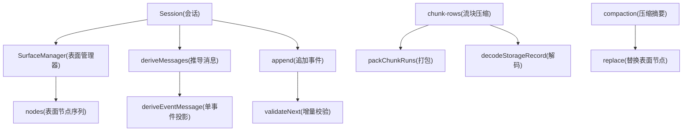
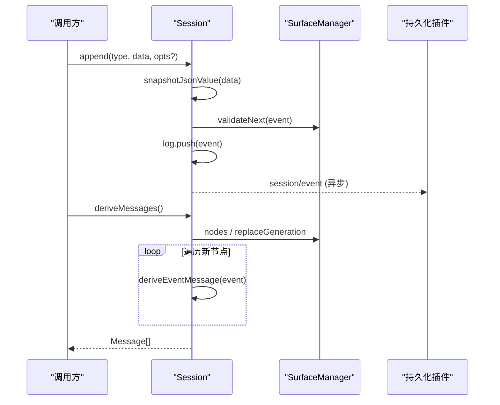
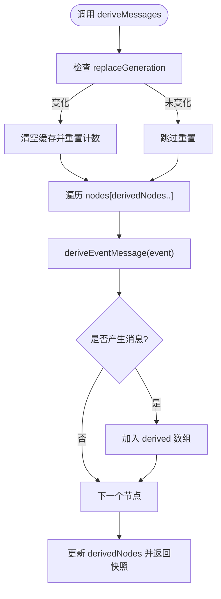
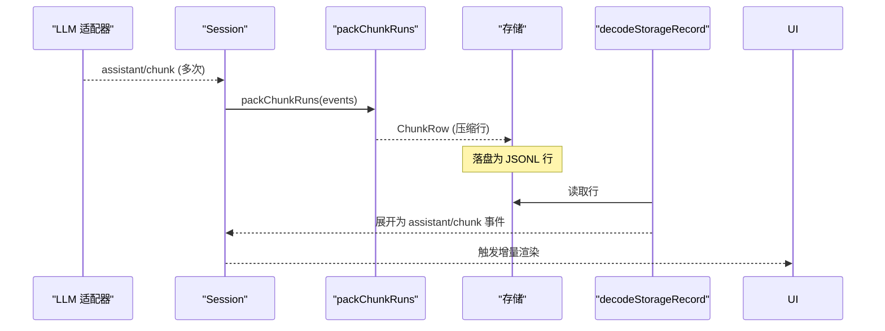
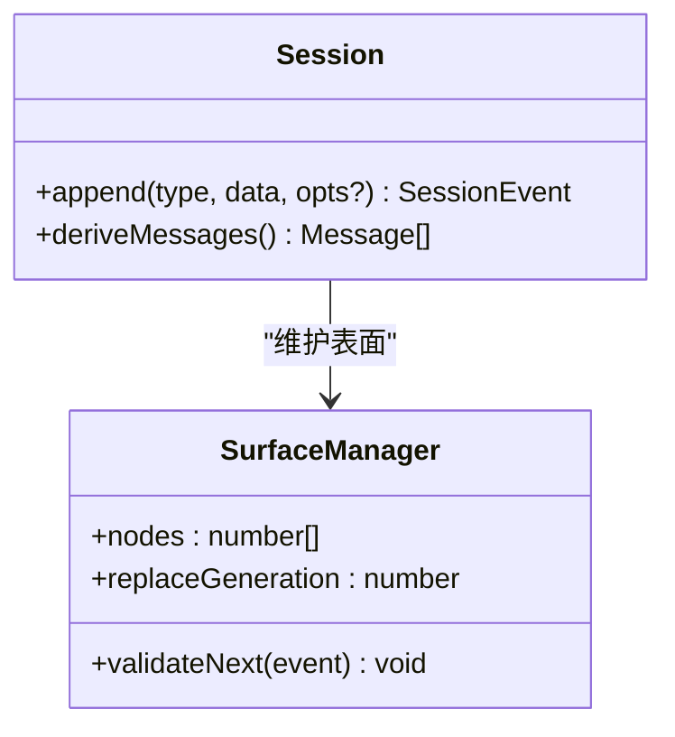
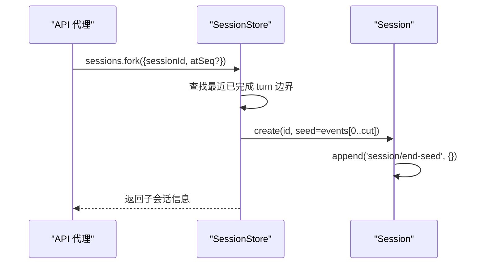
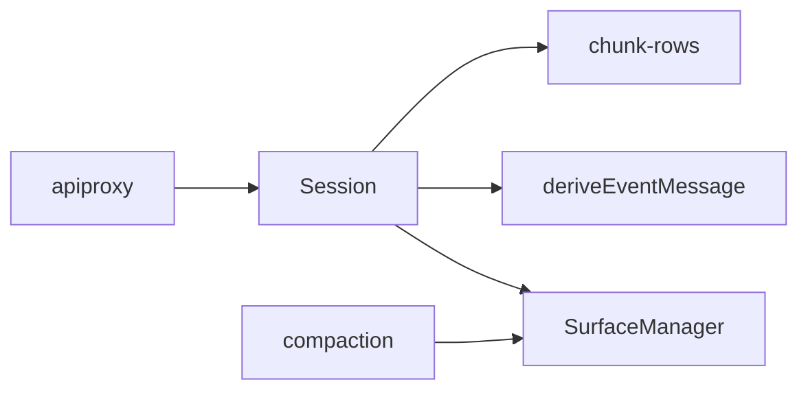
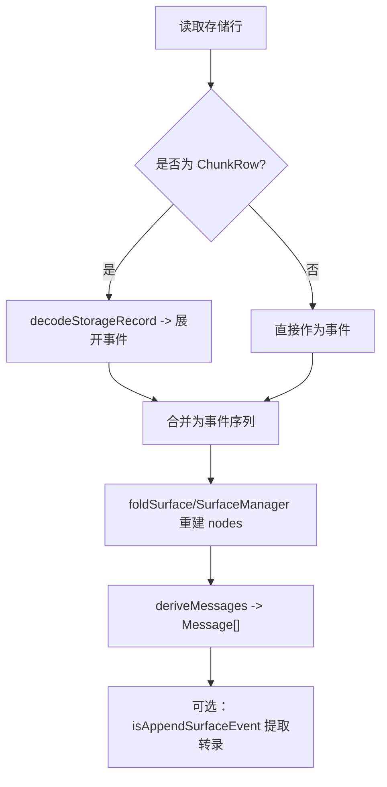

# 会话日志

<cite>
**本文引用的文件**
- [packages/core/session/src/types.ts](file://packages/core/session/src/types.ts)
- [packages/core/session/src/index.ts](file://packages/core/session/src/index.ts)
- [packages/core/session/src/surface.ts](file://packages/core/session/src/surface.ts)
- [packages/core/session/src/chunk-rows.ts](file://packages/core/session/src/chunk-rows.ts)
- [packages/compaction/compaction-basic/src/region.ts](file://packages/compaction/compaction-basic/src/region.ts)
- [packages/host/apiproxy/src/api-proxy.ts](file://packages/host/apiproxy/src/api-proxy.ts)
</cite>

## 目录
1. [简介](#简介)
2. [项目结构](#项目结构)
3. [核心组件](#核心组件)
4. [架构总览](#架构总览)
5. [详细组件分析](#详细组件分析)
6. [依赖关系分析](#依赖关系分析)
7. [性能与压缩优化](#性能与压缩优化)
8. [故障排查指南](#故障排查指南)
9. [结论](#结论)
10. [附录：格式规范与重建示例](#附录格式规范与重建示例)

## 简介
本文件系统化说明会话日志系统的设计与实现，重点包括：
- SessionEvent 的数据结构与 append-only 日志的优势
- deriveMessages() 如何将日志转换为模型可见的消息历史
- assistant/chunk 事件的作用、流式消息的持久化与回放机制
- fork、resume、transcripts 等能力如何基于日志实现
- 日志压缩策略与性能优化
- 日志格式规范与版本兼容性说明
- 日志结构图与重建示例

## 项目结构
会话日志的核心位于 core/session 包，围绕“事件源”思想构建：所有状态变更以不可变事件追加到日志中；对外暴露的“表面（surface）”是仅包含可投影为模型消息的事件有序视图。压缩与持久化通过独立的编码模块完成，不改变事件语义。

图表来源
- [packages/core/session/src/index.ts:425-758](file://packages/core/session/src/index.ts#L425-L758)
- [packages/core/session/src/surface.ts:398-461](file://packages/core/session/src/surface.ts#L398-L461)
- [packages/core/session/src/chunk-rows.ts:182-221](file://packages/core/session/src/chunk-rows.ts#L182-L221)
- [packages/compaction/compaction-basic/src/region.ts:464-478](file://packages/compaction/compaction-basic/src/region.ts#L464-L478)

章节来源
- [packages/core/session/src/index.ts:425-758](file://packages/core/session/src/index.ts#L425-L758)
- [packages/core/session/src/surface.ts:1-115](file://packages/core/session/src/surface.ts#L1-L115)
- [packages/core/session/src/chunk-rows.ts:1-78](file://packages/core/session/src/chunk-rows.ts#L1-L78)

## 核心组件
- Session：维护 append-only 日志、表面视图、请求头折叠、消息推导缓存。提供 append、events、seq、deriveMessages、requestHeader/requestContext 等接口。
- SurfaceManager：对日志进行增量折叠，维护 surface.nodes 与 replaceGeneration，确保替换操作的原子性与一致性。
- deriveEventMessage：将单个事件投影为模型消息（user/message、assistant/message、tool/result），非表面事件返回 null。
- chunk-rows：对流式 assistant/chunk 事件进行无损压缩存储与还原，保持逐 token 的重放保真度。
- compaction：通过 replace 操作将一段旧表面节点替换为摘要节点，减少上下文体积并保留可追溯性。

章节来源
- [packages/core/session/src/index.ts:425-758](file://packages/core/session/src/index.ts#L425-L758)
- [packages/core/session/src/surface.ts:398-461](file://packages/core/session/src/surface.ts#L398-L461)
- [packages/core/session/src/surface.ts:83-114](file://packages/core/session/src/surface.ts#L83-L114)
- [packages/core/session/src/chunk-rows.ts:182-221](file://packages/core/session/src/chunk-rows.ts#L182-L221)
- [packages/compaction/compaction-basic/src/region.ts:464-478](file://packages/compaction/compaction-basic/src/region.ts#L464-L478)

## 架构总览
会话日志采用“事件源 + 表面投影”的架构：
- 事件源：SessionEvent 是不可变的追加记录，保证可重放、可审计、可回滚（通过 replace）。
- 表面：仅包含能投影为模型消息的事件序列，支持 append 与 replace 两种操作。
- 推导：deriveMessages 按表面顺序投影得到模型可见的历史消息数组。
- 压缩：assistant/chunk 在持久化层被打包为 ChunkRow，读取时再展开为原始事件，不影响内存中的事件语义。
- 版本兼容：通过 SESSION_FORMAT_VERSION 与 per-event ignorable 标记控制向前/向后兼容。

图表来源
- [packages/core/session/src/index.ts:604-658](file://packages/core/session/src/index.ts#L604-L658)
- [packages/core/session/src/index.ts:726-758](file://packages/core/session/src/index.ts#L726-L758)
- [packages/core/session/src/surface.ts:421-459](file://packages/core/session/src/surface.ts#L421-L459)

## 详细组件分析

### SessionEvent 设计与数据结构
- 通用字段：type、seq（单调递增）、time（毫秒时间戳）、data（JSON-serializable）。
- 可选字段：
  - ignorable：允许未知类型安全跳过，默认 required，避免静默丢弃关键事件。
  - sourceEventSeqs：引用更早事件的 seq，用于溯源或 replace 覆盖范围。
  - surfaceOp：限定于 SurfaceEventType（user/message、assistant/message、tool/result），决定进入表面的方式（append 或 replace）。
- 版本兼容：SESSION_FORMAT_VERSION 固定当前格式版本；新增事件类型可通过 ignorable 扩展，无需升级版本。

章节来源
- [packages/core/session/src/types.ts:338-436](file://packages/core/session/src/types.ts#L338-L436)
- [packages/core/session/src/types.ts:21-56](file://packages/core/session/src/types.ts#L21-L56)

### deriveMessages()：从日志到模型消息
- 依据 surface.nodes 顺序，逐个调用 deriveEventMessage 投影为 Message。
- 空内容的 assistant/message（仅承载 usage）会被过滤，不进入转录。
- 结果数组每次调用返回新快照，内部 Message 对象共享且深冻结，避免重复拷贝与意外修改。
- 缓存策略：仅在 replaceGeneration 变化时重建；新增节点增量投影，复杂度 O(新节点数)。

图表来源
- [packages/core/session/src/index.ts:726-758](file://packages/core/session/src/index.ts#L726-L758)
- [packages/core/session/src/surface.ts:83-114](file://packages/core/session/src/surface.ts#L83-L114)

章节来源
- [packages/core/session/src/index.ts:701-758](file://packages/core/session/src/index.ts#L701-L758)
- [packages/core/session/src/surface.ts:83-114](file://packages/core/session/src/surface.ts#L83-L114)

### assistant/chunk：流式消息的持久化与回放
- 作用：记录模型输出的细粒度增量（文本、推理、工具调用参数等），保证 token 级回放保真。
- 持久化：packChunkRuns 将连续同块的同类型 delta 打包为 ChunkRow（text-chunks/reasoning-chunks/tool-call-chunks），显著降低 JSON 开销。
- 回放：decodeStorageRecord 将行展开为原始 assistant/chunk 事件，严格校验并抛出错误以防静默丢失。
- UI 消费：客户端通过 PartialAccumulator 将 chunk 聚合为 AssistantBlock[]，仅当可见变化时通知渲染。

图表来源
- [packages/core/session/src/chunk-rows.ts:182-221](file://packages/core/session/src/chunk-rows.ts#L182-L221)
- [packages/core/session/src/chunk-rows.ts:339-346](file://packages/core/session/src/chunk-rows.ts#L339-L346)

章节来源
- [packages/core/session/src/chunk-rows.ts:1-78](file://packages/core/session/src/chunk-rows.ts#L1-L78)
- [packages/core/session/src/chunk-rows.ts:182-221](file://packages/core/session/src/chunk-rows.ts#L182-L221)
- [packages/core/session/src/chunk-rows.ts:339-346](file://packages/core/session/src/chunk-rows.ts#L339-L346)

### 表面（Surface）与 replace：压缩与重写
- 表面由三类事件组成：user/message、assistant/message、tool/result。
- 操作：
  - append：追加到尾部，正常路径。
  - replace：用单一节点替换一段表面区间 [start, end]，需声明 sourceEventSeqs 包含所有被遮蔽节点。
- 压缩：compaction 产出 summary 事件并以 replace 形式落地，shadowedSeqs 记录被遮蔽的节点序列，便于审计与重建。

图表来源
- [packages/core/session/src/surface.ts:398-461](file://packages/core/session/src/surface.ts#L398-L461)
- [packages/core/session/src/index.ts:425-433](file://packages/core/session/src/index.ts#L425-L433)

章节来源
- [packages/core/session/src/surface.ts:116-142](file://packages/core/session/src/surface.ts#L116-L142)
- [packages/compaction/compaction-basic/src/region.ts:464-478](file://packages/compaction/compaction-basic/src/region.ts#L464-L478)

### fork、resume、transcripts：基于日志的能力
- fork：选择已完成的 turn 边界作为切点，截取前缀事件创建子会话，设置 parentSession、cwd、seedLength 等元数据。
- resume：从持久化恢复时，将完整存储日志作为 seed 传入 Session，构造 firstLiveSeq 并在末尾追加 session/end-seed 标记。
- transcripts：使用 isAppendSurfaceEvent 获取“追加来源”事件，作为人类可读的原始对话转录；replace 产生的副本仅用于模型上下文，不进入用户转录。

图表来源
- [packages/host/apiproxy/src/api-proxy.ts:2363-2418](file://packages/host/apiproxy/src/api-proxy.ts#L2363-L2418)
- [packages/core/session/src/index.ts:499-548](file://packages/core/session/src/index.ts#L499-L548)

章节来源
- [packages/host/apiproxy/src/api-proxy.ts:2363-2418](file://packages/host/apiproxy/src/api-proxy.ts#L2363-L2418)
- [packages/core/session/src/index.ts:499-548](file://packages/core/session/src/index.ts#L499-L548)
- [packages/core/session/src/surface.ts:40-55](file://packages/core/session/src/surface.ts#L40-L55)

## 依赖关系分析
- Session 依赖 SurfaceManager 管理表面；deriveMessages 依赖 deriveEventMessage 做单事件投影。
- chunk-rows 独立于事件语义，仅负责存储层的压缩/解压，不污染 Session 公共面。
- compaction 通过 replace 操作影响表面，但依然基于同一套 surface 规则与校验。
- API 层通过 SessionStore 暴露 fork/resume 等能力，底层仍基于事件前缀与 header 元数据。

图表来源
- [packages/core/session/src/index.ts:425-758](file://packages/core/session/src/index.ts#L425-L758)
- [packages/core/session/src/surface.ts:398-461](file://packages/core/session/src/surface.ts#L398-L461)
- [packages/core/session/src/chunk-rows.ts:182-221](file://packages/core/session/src/chunk-rows.ts#L182-L221)
- [packages/host/apiproxy/src/api-proxy.ts:2363-2418](file://packages/host/apiproxy/src/api-proxy.ts#L2363-L2418)

章节来源
- [packages/core/session/src/index.ts:425-758](file://packages/core/session/src/index.ts#L425-L758)
- [packages/core/session/src/surface.ts:398-461](file://packages/core/session/src/surface.ts#L398-L461)
- [packages/core/session/src/chunk-rows.ts:182-221](file://packages/core/session/src/chunk-rows.ts#L182-L221)
- [packages/host/apiproxy/src/api-proxy.ts:2363-2418](file://packages/host/apiproxy/src/api-proxy.ts#L2363-L2418)

## 性能与压缩优化
- append-only 日志：
  - 追加即提交，观察者回调失败隔离，不阻塞主路径。
  - events 返回浅拷贝快照，避免后续追加影响已有引用。
- 表面增量折叠：
  - SurfaceManager.validateNext 预校验，commit 时应用计划，避免部分写入导致的不一致。
  - nodes 与 replaceGeneration 惰性计算，仅处理新增事件。
- 消息推导缓存：
  - 按 replaceGeneration 失效，增量追加新节点，O(新节点) 复杂度。
- 流块压缩：
  - packChunkRuns 将连续同块 delta 打包为 ChunkRow，显著减少 JSON 开销与 I/O。
  - decodeStorageRecord 严格校验，异常即抛，防止静默数据丢失。
- 压缩摘要：
  - replace 将长段历史替换为摘要，减少上下文长度；shadowedSeqs 保留可追溯性。

章节来源
- [packages/core/session/src/index.ts:604-658](file://packages/core/session/src/index.ts#L604-L658)
- [packages/core/session/src/index.ts:726-758](file://packages/core/session/src/index.ts#L726-L758)
- [packages/core/session/src/surface.ts:421-459](file://packages/core/session/src/surface.ts#L421-L459)
- [packages/core/session/src/chunk-rows.ts:182-221](file://packages/core/session/src/chunk-rows.ts#L182-L221)
- [packages/compaction/compaction-basic/src/region.ts:464-478](file://packages/compaction/compaction-basic/src/region.ts#L464-L478)

## 故障排查指南
- 事件序列化失败：
  - 现象：append 抛出非 JSON 可序列化错误。
  - 原因：data 或 surface metadata 包含函数、Symbol、BigInt、循环引用等。
  - 处理：确保 payload 为纯 JSON 值。
- 表面元数据非法：
  - 现象：validateNext 抛出 surfaceOp/sourceEventSeqs 相关错误。
  - 原因：非表面事件携带 surfaceOp，或 replace 未包含全部遮蔽节点。
  - 处理：修正 surfaceIntent，确保 sourceEventSeqs 完整。
- 流块行损坏：
  - 现象：decodeStorageRecord 抛出 malformed row。
  - 原因：存储行字段缺失或类型不符。
  - 处理：修复存储文件或上游编码器逻辑。
- fork 边界非法：
  - 现象：fork 抛出 INVALID_BOUNDARY 或 OPEN_TURN。
  - 原因：边界不在连续 seq，或处于打开的 turn 内。
  - 处理：选择已完成 turn 的边界。

章节来源
- [packages/core/session/src/index.ts:604-658](file://packages/core/session/src/index.ts#L604-L658)
- [packages/core/session/src/surface.ts:184-243](file://packages/core/session/src/surface.ts#L184-L243)
- [packages/core/session/src/chunk-rows.ts:223-290](file://packages/core/session/src/chunk-rows.ts#L223-L290)
- [packages/host/apiproxy/src/api-proxy.ts:2363-2418](file://packages/host/apiproxy/src/api-proxy.ts#L2363-L2418)

## 结论
该会话日志系统以 append-only 事件为核心，结合表面投影与流块压缩，实现了高可靠、可重放、可扩展的会话状态管理。deriveMessages 提供稳定的模型消息历史；assistant/chunk 保障流式输出的高保真回放；compaction 通过 replace 有效缩减上下文；fork/resume/transcripts 等能力均建立在统一的日志契约之上。严格的版本兼容与校验机制确保了跨进程、跨版本的稳健运行。

## 附录：格式规范与重建示例

### 日志格式规范
- 事件信封：
  - type：字符串，事件类型键。
  - seq：非负安全整数，单调递增。
  - time：非负安全整数（毫秒）。
  - data：JSON 可序列化值。
  - ignorable：可选布尔，表示可安全忽略。
  - 表面事件额外字段：
    - surfaceOp：'append' | { op:'replace', start:number, end:number }。
    - sourceEventSeqs：number[]，引用更早事件。
- 版本：
  - SESSION_FORMAT_VERSION：当前为 0，写端与读端必须一致；新增事件类型通过 ignorable 扩展，不强制升级版本。

章节来源
- [packages/core/session/src/types.ts:338-436](file://packages/core/session/src/types.ts#L338-L436)
- [packages/core/session/src/types.ts:21-56](file://packages/core/session/src/types.ts#L21-L56)

### 重建示例（概念流程）
- 输入：存储中的 JSONL 行（可能包含普通事件或 ChunkRow）。
- 步骤：
  1) 解析每行，若为 ChunkRow 则 decodeStorageRecord 展开为 assistant/chunk 事件序列。
  2) 组装为 SessionEvent[]，验证 seq 连续性。
  3) 通过 foldSurface 或 SurfaceManager 重建 surface.nodes。
  4) 调用 deriveMessages 生成模型可见消息历史。
  5) 如需用户转录，筛选 isAppendSurfaceEvent 事件。

图表来源
- [packages/core/session/src/chunk-rows.ts:339-346](file://packages/core/session/src/chunk-rows.ts#L339-L346)
- [packages/core/session/src/surface.ts:387-395](file://packages/core/session/src/surface.ts#L387-L395)
- [packages/core/session/src/index.ts:726-758](file://packages/core/session/src/index.ts#L726-L758)
- [packages/core/session/src/surface.ts:40-55](file://packages/core/session/src/surface.ts#L40-L55)