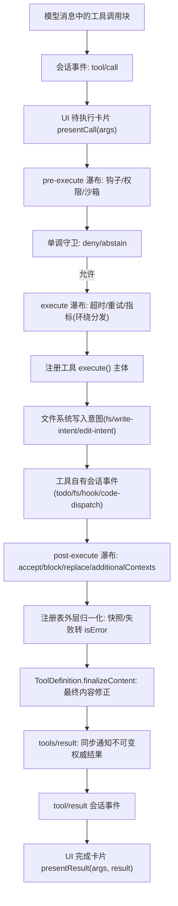
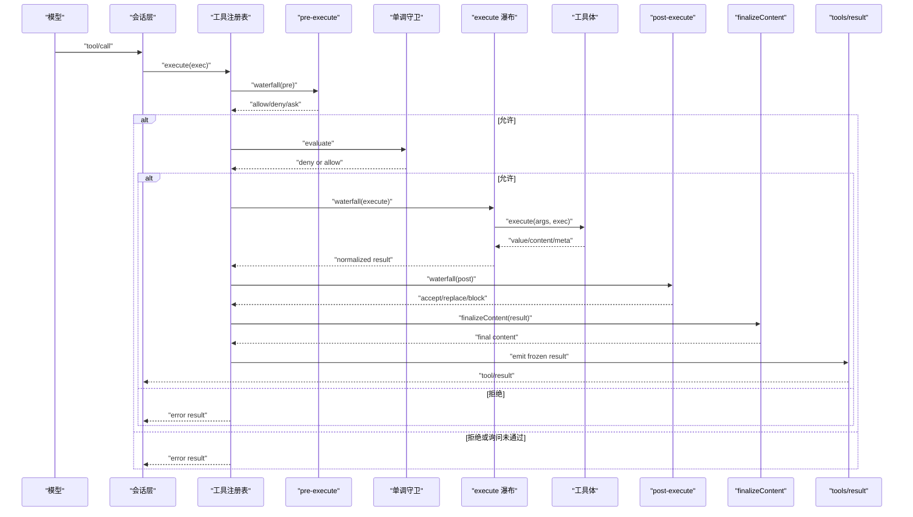
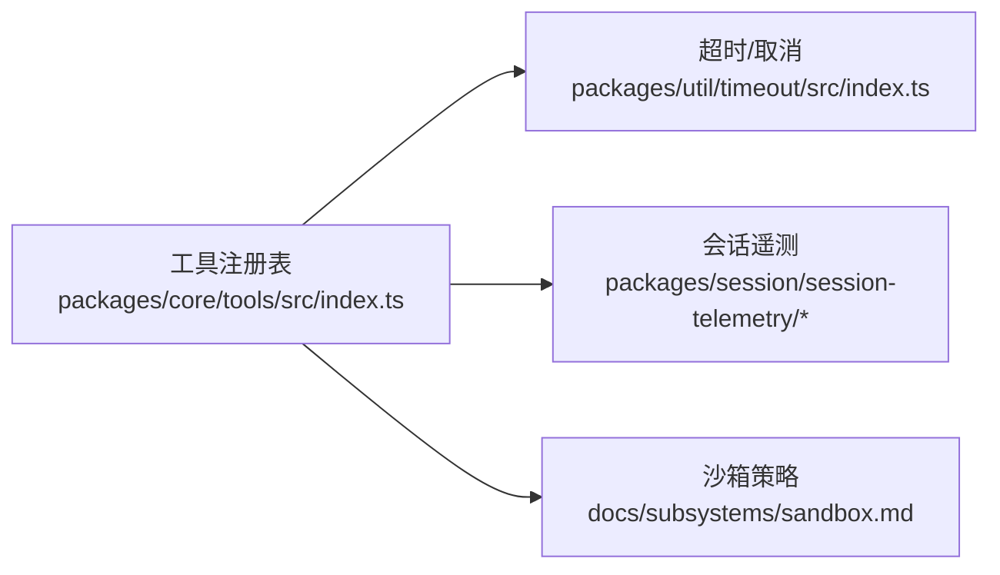
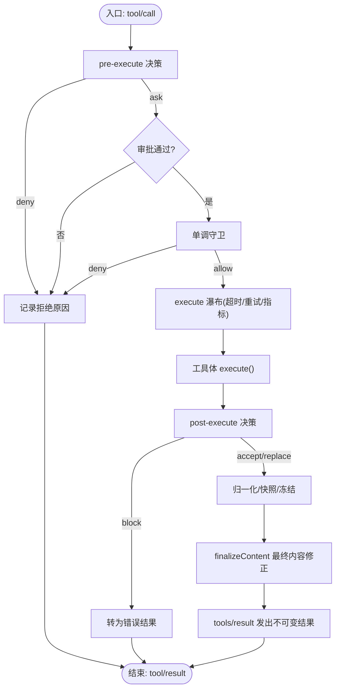

# 工具执行管道

<cite>
**本文引用的文件**
- [packages/core/tools/src/index.ts](file://packages/core/tools/src/index.ts)
- [packages/core/tools/tests/tools.spec.ts](file://packages/core/tools/tests/tools.spec.ts)
- [packages/core/tools/tests/invariant.spec.ts](file://packages/core/tools/tests/invariant.spec.ts)
- [packages/core/tools/tests/execution-mode.spec.ts](file://packages/core/tools/tests/execution-mode.spec.ts)
- [packages/util/timeout/src/index.ts](file://packages/util/timeout/src/index.ts)
- [packages/session/session-telemetry/src/index.ts](file://packages/session/session-telemetry/src/index.ts)
- [packages/session/session-telemetry/src/coordinator.ts](file://packages/session/session-telemetry/src/coordinator.ts)
- [docs/tool-execution-pipeline.md](file://docs/tool-execution-pipeline.md)
- [docs/subsystems/tools.md](file://docs/subsystems/tools.md)
- [docs/subsystems/tools.zh.md](file://docs/subsystems/tools.zh.md)
- [docs/subsystems/sandbox.md](file://docs/subsystems/sandbox.md)
</cite>

## 目录
1. [简介](#简介)
2. [项目结构](#项目结构)
3. [核心组件](#核心组件)
4. [架构总览](#架构总览)
5. [详细组件分析](#详细组件分析)
6. [依赖关系分析](#依赖关系分析)
7. [性能考量](#性能考量)
8. [故障排查指南](#故障排查指南)
9. [结论](#结论)
10. [附录](#附录)

## 简介
本文件系统性说明“工具执行管道”的完整流程与扩展点，覆盖从 tool/call 事件到 tool/result 返回的全过程；解释 tools/pre-execute、tools/execute、tools/post-execute 三阶段的职责与可插拔能力；阐述权限检查、资源限制、并发控制、错误处理、结果序列化与传输、超时与取消机制；并提供工具开发指南、调试技巧、执行流程图与性能监控方法。

## 项目结构
围绕工具执行管道的关键代码与文档集中在以下位置：
- 核心实现与类型定义：packages/core/tools/src/index.ts
- 行为与不变式测试：packages/core/tools/tests/*.spec.ts
- 超时与取消工具：packages/util/timeout/src/index.ts
- 会话遥测（监控）：packages/session/session-telemetry/*
- 官方流程文档：docs/tool-execution-pipeline.md
- 子系统文档：docs/subsystems/tools.md / tools.zh.md / sandbox.md

图表来源
- [docs/tool-execution-pipeline.md:8-58](file://docs/tool-execution-pipeline.md#L8-L58)

章节来源
- [docs/tool-execution-pipeline.md:1-63](file://docs/tool-execution-pipeline.md#L1-L63)
- [docs/subsystems/tools.md:1-12](file://docs/subsystems/tools.md#L1-L12)

## 核心组件
- ToolDefinition：一个已注册工具的完整描述，包含面向模型的 schema、输出规范、execute 函数、可选 finalizeContent、timeoutMs、isConcurrencySafe、presentCall/presentResult。
- ToolExecution/ToolDispatchExecution：执行上下文与可调度的分发视图，携带 callId、name、arguments、agent、parent、signal 等，并在策略前冻结参数。
- 三类瀑布与事件：
  - tools/pre-execute：允许/拒绝/询问（ask），支持审批服务。
  - tools/execute：环绕分发，用于超时、重试、指标等。
  - tools/post-execute：接受/替换/阻止/附加上下文。
- 单调守卫（monotonic guards）：在 pre-execute 之后、工具体之前评估，只能减少权限。
- 结果与展示：成功时校验并冻结 value，渲染 content/meta；失败时转为 JSON 安全的 isError；finalizeContent 作为最后的内容修正；tools/result 发出不可变快照。

章节来源
- [docs/subsystems/tools.md:9-96](file://docs/subsystems/tools.md#L9-L96)
- [docs/subsystems/tools.md:170-405](file://docs/subsystems/tools.md#L170-L405)
- [packages/core/tools/src/index.ts:221-394](file://packages/core/tools/src/index.ts#L221-L394)

## 架构总览
下图展示了从 tool/call 到 tool/result 的端到端流程，包括 UI 呈现、策略、守卫、执行、结果归一化与最终通知。

图表来源
- [docs/tool-execution-pipeline.md:8-58](file://docs/tool-execution-pipeline.md#L8-L58)
- [packages/core/tools/src/index.ts:1562-1599](file://packages/core/tools/src/index.ts#L1562-L1599)

章节来源
- [docs/tool-execution-pipeline.md:1-63](file://docs/tool-execution-pipeline.md#L1-L63)
- [packages/core/tools/src/index.ts:1562-1599](file://packages/core/tools/src/index.ts#L1562-L1599)

## 详细组件分析

### 阶段一：tools/pre-execute（前置策略与权限）
- 职责：对即将执行的调用进行允许/拒绝/询问决策；可集成审批服务；异步监听器需观察 exec.signal。
- 扩展点：
  - 自定义权限策略（如基于角色、资源、上下文）。
  - 审批流（ask → allowed-once → 继续；否则拒绝）。
  - 沙箱模式选择（结合 sandboxPolicy.resolve）。
- 约束：
  - 参数已在策略前物化并冻结，不允许改写。
  - 未知工具会映射为 UNKNOWN_TOOL 错误。
  - 抛出异常的监听器会被捕获并转为结构化错误。

章节来源
- [docs/subsystems/tools.md:677-698](file://docs/subsystems/tools.md#L677-L698)
- [docs/subsystems/tools.md:170-212](file://docs/subsystems/tools.md#L170-L212)
- [docs/subsystems/sandbox.md:67-94](file://docs/subsystems/sandbox.md#L67-L94)
- [packages/core/tools/tests/tools.spec.ts:1872-1917](file://packages/core/tools/tests/tools.spec.ts#L1872-L1917)

### 阶段二：tools/execute（环绕分发）
- 职责：提供超时、重试、指标采集等横切关注点；仅允许替换 signal，不能移除；注册表会在调用工具体前重新融合调用方信号。
- 扩展点：
  - 超时控制：使用 timeoutMs + deadline 工具，将上游取消与超时合并。
  - 重试策略：按错误类别与退避策略重试。
  - 指标埋点：记录耗时、错误率、资源使用等。
- 约束：
  - 必须恢复 signal 并达到静默状态。
  - 工具体需协作响应取消信号。

章节来源
- [docs/subsystems/tools.md:628-650](file://docs/subsystems/tools.md#L628-L650)
- [packages/util/timeout/src/index.ts:33-113](file://packages/util/timeout/src/index.ts#L33-L113)
- [packages/core/tools/src/index.ts:386-394](file://packages/core/tools/src/index.ts#L386-L394)

### 阶段三：tools/post-execute（后置策略）
- 职责：接受、替换内容或值、附加 additionalContexts、或将纠正反馈转为 block（错误结果）。
- 扩展点：
  - 内容脱敏/裁剪（例如大文本预览）。
  - 业务规则校验后阻断。
  - 注入后续请求所需的上下文。
- 约束：
  - 不能同时替换内容与值。
  - 观察者失败被隔离，不影响主流程。

章节来源
- [docs/subsystems/tools.md:652-675](file://docs/subsystems/tools.md#L652-L675)
- [docs/subsystems/tools.md:391-405](file://docs/subsystems/tools.md#L391-L405)

### 权限检查与资源限制
- 权限检查：
  - pre-execute 中实现细粒度策略（角色、资源、上下文）。
  - 单调守卫在 pre-execute 之后做最终裁决，且只能减少权限。
- 资源限制：
  - 沙箱模式由 sandboxPolicy.resolve 决定，支持不同边界与并发场景。
  - 文件系统变更通过 fs/write-intent 或 fs/edit-intent 限定在 tool-fs 范围内。
- 作用域与可见性：
  - ToolRestriction 可对全局工具进行 allow/deny 过滤，作用域内注册不受限。

章节来源
- [docs/subsystems/tools.md:153-168](file://docs/subsystems/tools.md#L153-L168)
- [docs/subsystems/tools.md:170-212](file://docs/subsystems/tools.md#L170-L212)
- [docs/subsystems/sandbox.md:67-94](file://docs/subsystems/sandbox.md#L67-L94)

### 并发控制与调度
- 执行模式：
  - exclusive：独占执行，形成排序屏障。
  - parallel：可与兄弟调用重叠执行。
- 分类依据：
  - isConcurrencySafe(args) 精确 true 才并行；未知、隐藏、未声明、无效或抛出的分类器均视为独占。
- 调度上限：
  - AgentLoop 维护 maxParallelToolCalls 部署级上限，默认 10；设为 1 则串行。
- 安全约定：
  - 并行执行不得修改父级状态；共享状态需容忍并发；记录器竞态需交换或失败关闭。

章节来源
- [docs/subsystems/tools.md:243-253](file://docs/subsystems/tools.md#L243-L253)
- [packages/core/tools/tests/execution-mode.spec.ts:40-67](file://packages/core/tools/tests/execution-mode.spec.ts#L40-L67)
- [.agents/notes/implemented/feature/2026-07-10-parallel-tool-call-execution.zh.md:57-69](file://.agents/notes/implemented/feature/2026-07-10-parallel-tool-call-execution.zh.md#L57-L69)

### 错误处理策略
- 统一错误路径：
  - 未知工具映射为 UNKNOWN_TOOL。
  - 监听器抛出异常会被捕获并转为结构化错误（保留 name/code）。
- 结果归一化：
  - 前置/后置/渲染/投影失败会转为 JSON 安全的 isError，但仍可达 finalizeContent。
- 取消与中止：
  - 进入后、最终结果物化前的取消会跳过尚未开始的工具体（ABORTED_BEFORE_DISPATCH）或替换已成功开始的结果为 ABORTED。
  - 已开始的工作仍会排空，可能保留工具自有的结构化错误。

章节来源
- [docs/subsystems/tools.md:376-405](file://docs/subsystems/tools.md#L376-L405)
- [packages/core/tools/tests/tools.spec.ts:1864-1902](file://packages/core/tools/tests/tools.spec.ts#L1864-L1902)
- [packages/core/tools/tests/tools.spec.ts:1904-1917](file://packages/core/tools/tests/tools.spec.ts#L1904-L1917)

### 结果序列化与传输
- 值与内容：
  - 成功时校验并冻结 value，渲染 content/meta；顶层调用可计算 presentationMeta。
  - 持久化只保存 content、error、meta；value 是执行期本地值。
- 最终快照：
  - finalizeContent 恰好调用一次；随后立即物化并冻结结果，再触发 tools/result。
- 传输：
  - tool/call 与 tool/result 为会话事件；Code Mode 还会暴露 tools/code-dispatch-log 以调整持久日志副本。

章节来源
- [docs/subsystems/tools.md:370-375](file://docs/subsystems/tools.md#L370-L375)
- [docs/subsystems/tools.md:459-468](file://docs/subsystems/tools.md#L459-L468)
- [docs/subsystems/tools.md:601-626](file://docs/subsystems/tools.md#L601-L626)

### 超时处理与取消机制
- 超时预算：
  - ToolDefinition.timeoutMs 声明协作超时；由 dsh-tool-call-timeout-policy（tools/execute 包装）强制执行，不会发送到模型。
- 信号融合：
  - packages/util/timeout.deadline 将上游取消与超时合并为单一 AbortSignal，区分超时原因。
- 取消传播：
  - tools/execute 包装可替换 signal，但注册表会在调用工具体前重新融合原始调用方信号，确保取消不丢失。

章节来源
- [docs/subsystems/tools.md:53-60](file://docs/subsystems/tools.md#L53-L60)
- [packages/util/timeout/src/index.ts:33-113](file://packages/util/timeout/src/index.ts#L33-L113)
- [packages/core/tools/src/index.ts:386-394](file://packages/core/tools/src/index.ts#L386-L394)

### 工具开发指南与调试技巧
- 开发要点：
  - 使用 defineTool 声明参数与输出 schema，自动推导类型与校验。
  - 在 execute 中遵循协作取消：观察 exec.signal 并及时退出。
  - 如需并行，谨慎实现 isConcurrencySafe，并确保共享状态线程安全。
  - 提供 presentCall/presentResult 以获得更好的 UI 体验。
- 调试技巧：
  - 订阅 tools/result 获取最终不可变结果。
  - 使用 tools/change 监听工具集变化。
  - 在 pre/post/execute 中添加轻量日志，注意不要泄露敏感信息。
  - 利用测试用例验证顺序与不变式（重复/乱序阶段应报错）。

章节来源
- [docs/subsystems/tools.md:98-151](file://docs/subsystems/tools.md#L98-L151)
- [packages/core/tools/tests/invariant.spec.ts:48-70](file://packages/core/tools/tests/invariant.spec.ts#L48-L70)
- [docs/subsystems/tools.md:576-719](file://docs/subsystems/tools.md#L576-L719)

## 依赖关系分析
工具执行管道依赖以下模块：
- 核心注册表与流水线：packages/core/tools/src/index.ts
- 超时与取消：packages/util/timeout/src/index.ts
- 会话遥测：packages/session/session-telemetry/*
- 沙箱策略：docs/subsystems/sandbox.md

图表来源
- [packages/core/tools/src/index.ts:221-394](file://packages/core/tools/src/index.ts#L221-L394)
- [packages/util/timeout/src/index.ts:33-113](file://packages/util/timeout/src/index.ts#L33-L113)
- [packages/session/session-telemetry/src/index.ts:47-178](file://packages/session/session-telemetry/src/index.ts#L47-L178)
- [docs/subsystems/sandbox.md:67-94](file://docs/subsystems/sandbox.md#L67-L94)

章节来源
- [packages/core/tools/src/index.ts:221-394](file://packages/core/tools/src/index.ts#L221-L394)
- [packages/util/timeout/src/index.ts:33-113](file://packages/util/timeout/src/index.ts#L33-L113)
- [packages/session/session-telemetry/src/index.ts:47-178](file://packages/session/session-telemetry/src/index.ts#L47-L178)
- [docs/subsystems/sandbox.md:67-94](file://docs/subsystems/sandbox.md#L67-L94)

## 性能考量
- 并发上限：maxParallelToolCalls 控制全局并行度，默认 10；根据工具特性合理声明 isConcurrencySafe。
- 超时预算：为长耗时工具设置 timeoutMs，避免阻塞调度器。
- 结果大小：避免在 content 中传递超大文本；必要时在 post-execute 中裁剪或使用 tools/code-dispatch-log 替换为摘要。
- 指标采集：在 tools/execute 中记录耗时、错误率、资源使用，便于定位瓶颈。
- 回放友好：presentCall/presentResult 应为纯函数，以便回放与直播一致。

[本节为通用指导，无需特定文件引用]

## 故障排查指南
- 常见错误：
  - 未知工具：UNKNOWN_TOOL，检查名称与作用域可见性。
  - 参数不匹配：INVALID_ARGS，核对 defineTool 的参数 schema。
  - 输出无效：INVALID_TOOL_OUTPUT，核对 output.schema 与 render。
  - 监听器异常：pre/post/execute 抛出异常会被捕获并转为结构化错误。
- 诊断步骤：
  - 订阅 tools/result 查看最终结果与 isError。
  - 检查 pre-execute 是否 ask 但未获批准。
  - 确认 timeoutMs 与工具体是否正确响应取消。
  - 审查 isConcurrencySafe 声明与实际实现是否一致。
- 参考断言：
  - 测试固定了阶段顺序、冻结结果、重复/乱序阶段报错等行为。

章节来源
- [packages/core/tools/tests/tools.spec.ts:1864-1902](file://packages/core/tools/tests/tools.spec.ts#L1864-L1902)
- [packages/core/tools/tests/tools.spec.ts:1904-1917](file://packages/core/tools/tests/tools.spec.ts#L1904-L1917)
- [packages/core/tools/tests/invariant.spec.ts:48-70](file://packages/core/tools/tests/invariant.spec.ts#L48-L70)

## 结论
工具执行管道通过三段式瀑布（pre/execute/post）与单调守卫，提供了可扩展、可观测、可控制的工具执行环境。它严格分离策略与实现，保证结果的可序列化与不可变性，并通过超时、取消、并发控制与沙箱策略保障系统稳定性与安全性。借助 tools/result 与遥测能力，可实现端到端的可观测性与问题定位。

[本节为总结，无需特定文件引用]

## 附录

### 执行流程图（算法视角）

图表来源
- [docs/tool-execution-pipeline.md:8-58](file://docs/tool-execution-pipeline.md#L8-L58)
- [packages/core/tools/src/index.ts:1562-1599](file://packages/core/tools/src/index.ts#L1562-L1599)

### 性能监控方法
- 指标采集点：
  - tools/execute：记录调用耗时、错误分类、重试次数。
  - tools/result：记录最终结果类型（success/error）、content 大小。
- 告警策略：
  - 高错误率、超时比例上升、content 过大。
- 后端接入：
  - 通过 session-telemetry 将工具相关事件上报至后端存储与分析系统。

章节来源
- [packages/session/session-telemetry/src/index.ts:47-178](file://packages/session/session-telemetry/src/index.ts#L47-L178)
- [packages/session/session-telemetry/src/coordinator.ts:228-268](file://packages/session/session-telemetry/src/coordinator.ts#L228-L268)