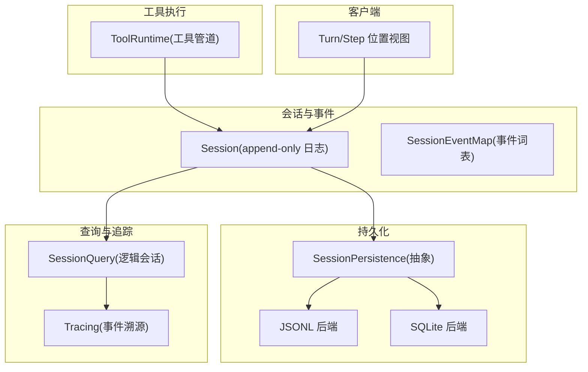
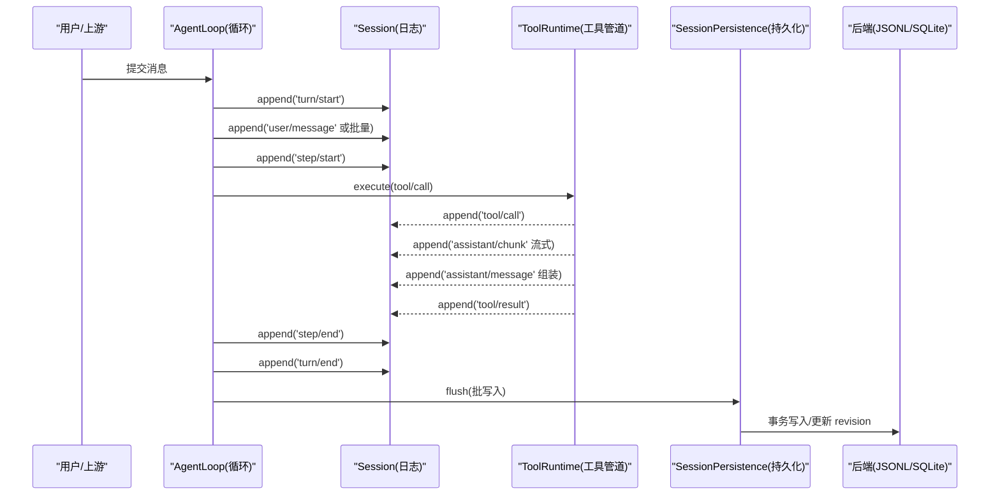
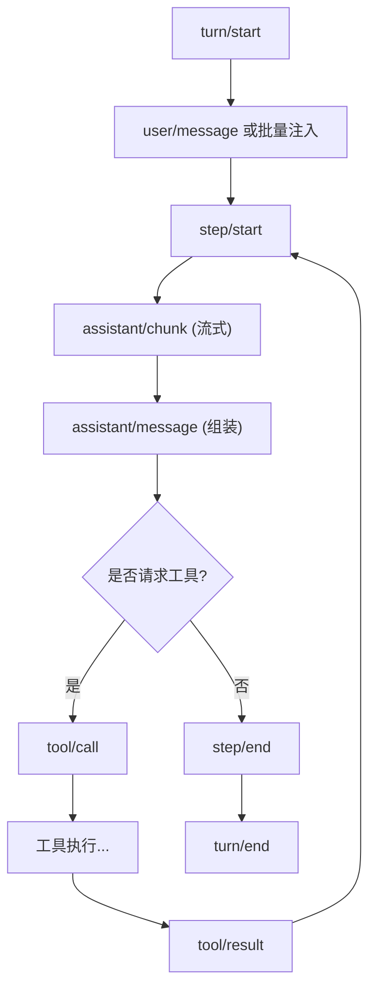
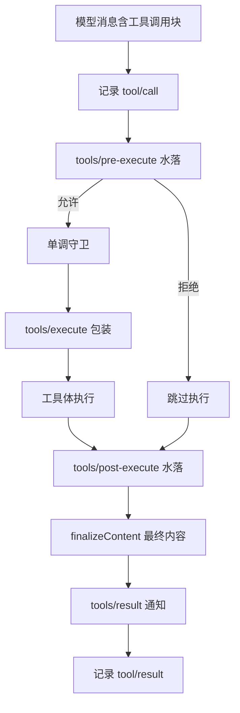
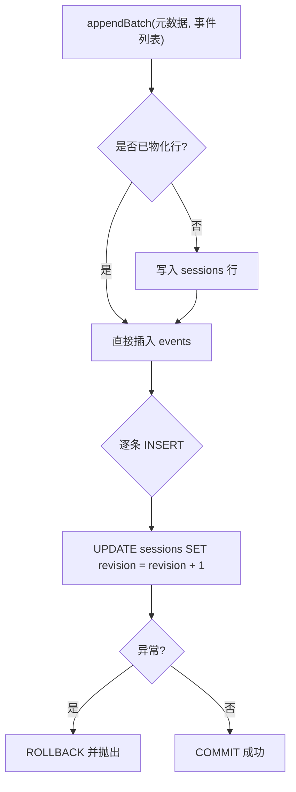
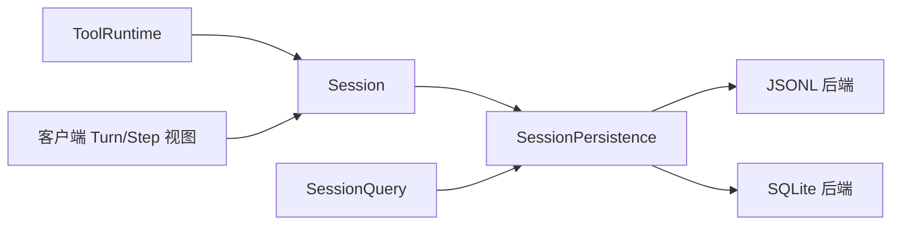

# 数据流设计

<cite>
**本文引用的文件**
- [packages/core/session/src/index.ts](file://packages/core/session/src/index.ts)
- [packages/core/session/src/types.ts](file://packages/core/session/src/types.ts)
- [docs/subsystems/session.md](file://docs/subsystems/session.md)
- [docs/subsystems/persistence.md](file://docs/subsystems/persistence.md)
- [packages/session/session-persistence-sqlite/src/index.ts](file://packages/session/session-persistence-sqlite/src/index.ts)
- [packages/session-query/session-query/src/index.ts](file://packages/session-query/session-query/src/index.ts)
- [packages/session-query/session-query/src/types.ts](file://packages/session-query/session-query/src/types.ts)
- [packages/session-query/session-query/src/tracing.ts](file://packages/session-query/session-query/src/tracing.ts)
- [docs/tool-execution-pipeline.md](file://docs/tool-execution-pipeline.md)
- [docs/subsystems/tools.md](file://docs/subsystems/tools.md)
- [packages/core/tools/tests/invariant.spec.ts](file://packages/core/tools/tests/invariant.spec.ts)
- [packages/core/tools/tests/tools.spec.ts](file://packages/core/tools/tests/tools.spec.ts)
- [packages/client/runtime/src/client/contract/conversation.ts](file://packages/client/runtime/src/client/contract/conversation.ts)
</cite>

## 目录
1. [引言](#引言)
2. [项目结构](#项目结构)
3. [核心组件](#核心组件)
4. [架构总览](#架构总览)
5. [详细组件分析](#详细组件分析)
6. [依赖关系分析](#依赖关系分析)
7. [性能考量](#性能考量)
8. [故障排查指南](#故障排查指南)
9. [结论](#结论)
10. [附录](#附录)

## 引言
本文件围绕 Turn 流程中的数据处理、事件驱动架构、Session Event 日志系统（含持久化与回放）、工具执行管道中的数据流转，以及错误处理、取消机制和数据一致性保证进行系统化说明。目标是为读者提供从“消息进入”到“结果返回”的完整数据流视图，并给出调试与排障建议。

## 项目结构
本仓库采用多包协作：会话与事件模型位于 core/session；持久化抽象与后端在 session-persistence-*；查询与追踪在 session-query；工具执行管道在 core/tools；客户端对 turn/step 的可见位置在 client/runtime。文档子系统提供了面向读者的权威说明。

图表来源
- [docs/subsystems/session.md:20-125](file://docs/subsystems/session.md#L20-L125)
- [docs/subsystems/persistence.md:231-237](file://docs/subsystems/persistence.md#L231-L237)
- [packages/session-query/session-query/src/index.ts:118-151](file://packages/session-query/session-query/src/index.ts#L118-L151)
- [docs/tool-execution-pipeline.md:8-58](file://docs/tool-execution-pipeline.md#L8-L58)

章节来源
- [docs/subsystems/session.md:20-125](file://docs/subsystems/session.md#L20-L125)
- [docs/subsystems/persistence.md:231-237](file://docs/subsystems/persistence.md#L231-L237)

## 核心组件
- Session 与 SessionEventMap：以 append-only 日志为唯一事实源，所有消息历史均由日志推导，不单独存储。事件类型可合并扩展，包含 turn/step 边界、用户/助手消息、工具调用/结果、请求头/上下文等。
- 持久化抽象与后端：通过 SessionPersistence 定义 locate/create/append/load/inspect/readFrom/list 等能力，支持 JSONL 与 SQLite 两种后端，保证事件连续 seq 与 JSON 可序列化约束。
- 工具执行管道：以 waterfalls 形式组织 pre-execute、execute、post-execute 与 result 观察，贯穿权限、沙箱、超时、重试、结果重写与最终不可变结果发布。
- 查询与追踪：提供逻辑会话读取、事件搜索、事件溯源（被替换链、来源引用）等能力，用于回放与调试。
- 客户端视角：将 turn/step 映射为不可变的 ConversationLocation，便于 UI 渲染与交互。

章节来源
- [docs/subsystems/session.md:20-125](file://docs/subsystems/session.md#L20-L125)
- [docs/subsystems/persistence.md:231-237](file://docs/subsystems/persistence.md#L231-L237)
- [docs/subsystems/tools.md:170-405](file://docs/subsystems/tools.md#L170-L405)
- [packages/client/runtime/src/client/contract/conversation.ts:63-96](file://packages/client/runtime/src/client/contract/conversation.ts#L63-L96)

## 架构总览
下图展示一次“用户输入 → Turn/Step → 工具调用 → 结果回写”的关键路径。

图表来源
- [docs/subsystems/session.md:20-125](file://docs/subsystems/session.md#L20-L125)
- [docs/tool-execution-pipeline.md:8-58](file://docs/tool-execution-pipeline.md#L8-L58)
- [packages/session/session-persistence-sqlite/src/index.ts:278-302](file://packages/session/session-persistence-sqlite/src/index.ts#L278-L302)

## 详细组件分析

### Turn/Step 与事件驱动
- Turn：一次 Agent 循环的执行单元，可能包含多个 Step。
- Step：一次模型调用及其请求的工具执行集合。
- 事件：turn/start、turn/end、step/start、step/end、user/message、assistant/chunk、assistant/message、tool/call、tool/result、request/header、request/context、session/end-seed 等。
- 表面投影：仅 user/message、assistant/message、tool/result 会进入有序“表面”，供推导模型历史；其他事件为结构性或日志型。

图表来源
- [docs/subsystems/session.md:20-125](file://docs/subsystems/session.md#L20-L125)

章节来源
- [docs/subsystems/session.md:20-125](file://docs/subsystems/session.md#L20-L125)
- [packages/client/runtime/src/client/contract/conversation.ts:63-96](file://packages/client/runtime/src/client/contract/conversation.ts#L63-L96)

### 工具执行管道数据流
工具执行遵循严格的阶段顺序与不可变契约：
- tools/pre-execute：允许/拒绝/询问（审批），可挂载权限、沙箱策略。
- 单调守卫：最终决策不可被后续监听器撤销。
- tools/execute：around-dispatch（超时、重试、指标）。
- tools/post-execute：接受/替换内容或值、附加上下文、阻断。
- finalizeContent：定义级最后的内容规范化。
- tools/result：发布冻结的最终结果，随后记录 tool/result 事件。

图表来源
- [docs/tool-execution-pipeline.md:8-58](file://docs/tool-execution-pipeline.md#L8-L58)
- [docs/subsystems/tools.md:170-405](file://docs/subsystems/tools.md#L170-L405)

章节来源
- [docs/tool-execution-pipeline.md:8-58](file://docs/tool-execution-pipeline.md#L8-L58)
- [docs/subsystems/tools.md:170-405](file://docs/subsystems/tools.md#L170-L405)
- [packages/core/tools/tests/invariant.spec.ts:40-70](file://packages/core/tools/tests/invariant.spec.ts#L40-L70)

### Session Event 日志系统与持久化
- 日志不变量：每个事件 data 必须可无损 JSON 序列化；seq 严格连续；surface 事件需声明 surfaceOp 与 sourceEventSeqs。
- 持久化契约：append 批次原子写入（SQLite 使用事务），失败回滚；load/inspect 冷启动修复中断的 turn，保持已持久化事件不变。
- 回放：readSession 返回克隆的 header 与完整事件序列，可用于离线重建与验证。

图表来源
- [packages/session/session-persistence-sqlite/src/index.ts:278-302](file://packages/session/session-persistence-sqlite/src/index.ts#L278-L302)

章节来源
- [docs/subsystems/persistence.md:9-19](file://docs/subsystems/persistence.md#L9-L19)
- [packages/session/session-persistence-sqlite/src/index.ts:278-302](file://packages/session/session-persistence-sqlite/src/index.ts#L278-L302)
- [packages/session-query/session-query/src/index.ts:118-151](file://packages/session-query/session-query/src/index.ts#L118-L151)

### 错误处理、取消与一致性
- 错误：工具管道中任何阶段的抛错会被归一化为结构化错误结果，不会破坏整体流程；工具未找到或参数非法均走统一错误路径。
- 取消：工具执行支持 AbortSignal，可在调度前或执行中取消；已开始的异步工作仍会尽力收敛，但不再继续无关工作。
- 一致性：Session.append 在入口校验 JSON 可序列化与表面契约；持久化层以事务保证原子性；冷启动修复确保 turn/step 平衡，避免悬挂边界。

章节来源
- [docs/subsystems/tools.md:170-405](file://docs/subsystems/tools.md#L170-L405)
- [packages/core/tools/tests/tools.spec.ts:1579-1612](file://packages/core/tools/tests/tools.spec.ts#L1579-L1612)
- [docs/subsystems/persistence.md:9-19](file://docs/subsystems/persistence.md#L9-L19)

### 调试数据流的工具与技巧
- 事件溯源：使用 tracing 能力获取当前表面、事件被替换链、来源/派生关系，定位压缩/替换带来的影响。
- 会话快照：readSession 返回完整事件与 header，适合离线回放与比对。
- 工具管道断点：通过 tools/* 水落与 result 监听，捕获执行身份、信号与结果，辅助定位权限、超时、结果重写等问题。
- 查询工具：注册 session_search / session_event_search / session_trace 等工具，快速检索历史会话与事件。

章节来源
- [packages/session-query/session-query/src/tracing.ts:34-218](file://packages/session-query/session-query/src/tracing.ts#L34-L218)
- [packages/session-query/session-query/src/index.ts:118-151](file://packages/session-query/session-query/src/index.ts#L118-L151)
- [packages/session-query/tool-session-query/src/index.ts:66-94](file://packages/session-query/tool-session-query/src/index.ts#L66-L94)

## 依赖关系分析
- Session 依赖持久化抽象，具体实现由 JSONL/SQLite 提供。
- ToolRuntime 依赖 Session 记录 tool/call 与 tool/result，并通过 waterfalls 与守卫组合策略。
- SessionQuery 依赖持久化提供的 load/inspect/readFrom 能力，构建逻辑会话与索引。
- 客户端通过 Turn/Step 位置视图消费 Session 的表面投影。

图表来源
- [docs/subsystems/tools.md:170-405](file://docs/subsystems/tools.md#L170-L405)
- [docs/subsystems/persistence.md:231-237](file://docs/subsystems/persistence.md#L231-L237)
- [packages/client/runtime/src/client/contract/conversation.ts:63-96](file://packages/client/runtime/src/client/contract/conversation.ts#L63-L96)

章节来源
- [docs/subsystems/tools.md:170-405](file://docs/subsystems/tools.md#L170-L405)
- [docs/subsystems/persistence.md:231-237](file://docs/subsystems/persistence.md#L231-L237)
- [packages/client/runtime/src/client/contract/conversation.ts:63-96](file://packages/client/runtime/src/client/contract/conversation.ts#L63-L96)

## 性能考量
- 流式输出：assistant/chunk 提供 token 级回放保真，减少大消息一次性传输压力。
- 批写入与事务：持久化层按批次写入并以事务保障原子性，降低锁竞争与提升吞吐。
- 缓存与增量：Surface 投影缓存节点，replaceGeneration 区分纯追加与重写，增量消费者可高效响应。
- 查询优化：readFrom 支持从指定 seq 起读，利于增量投影与分页。

[本节为通用指导，无需特定文件来源]

## 故障排查指南
- 检查事件连续性：确认 seq 连续且无缺失；若出现非 JSON 可序列化数据，会在 append 时立即拒绝。
- 检查表面契约：surfaceOp 与 sourceEventSeqs 是否正确；替换范围是否有效。
- 检查持久化事务：SQLite 写入失败会回滚；关注 revision 更新是否完成。
- 工具管道问题：查看 tools/pre-execute/guard/execute/post-execute 各阶段决策与结果；必要时启用 tools/result 监听。
- 取消与超时：确认 AbortSignal 传播与工具体是否及时收敛；注意 ABORTED_BEFORE_DISPATCH 与 ABORTED 的区别。
- 回放与溯源：使用 readSession 与 tracing 能力对比期望与真实表面，定位压缩/替换导致的差异。

章节来源
- [docs/subsystems/session.md:20-125](file://docs/subsystems/session.md#L20-L125)
- [packages/session/session-persistence-sqlite/src/index.ts:278-302](file://packages/session/session-persistence-sqlite/src/index.ts#L278-L302)
- [docs/subsystems/tools.md:170-405](file://docs/subsystems/tools.md#L170-L405)
- [packages/core/tools/tests/tools.spec.ts:1579-1612](file://packages/core/tools/tests/tools.spec.ts#L1579-L1612)
- [packages/session-query/session-query/src/tracing.ts:34-218](file://packages/session-query/session-query/src/tracing.ts#L34-L218)

## 结论
本设计以 Session 事件日志为核心，结合工具执行管道与持久化抽象，实现了高内聚、可扩展的数据流体系。通过明确的事件语义、严格的不变量与事务化持久化，系统在可靠性、可回放性与可观测性方面具备良好基础。配合查询与追踪能力，开发者可以高效定位问题、理解复杂交互过程。

[本节为总结，无需特定文件来源]

## 附录
- 关键概念速查
  - Turn：一次 Agent 循环执行单元
  - Step：一次模型调用及其中工具执行集合
  - Surface：有序的消息表面，用于推导模型历史
  - Append-only：只追加日志，禁止就地修改
  - Waterfall：可插拔的阶段式处理链

[本节为补充说明，无需特定文件来源]