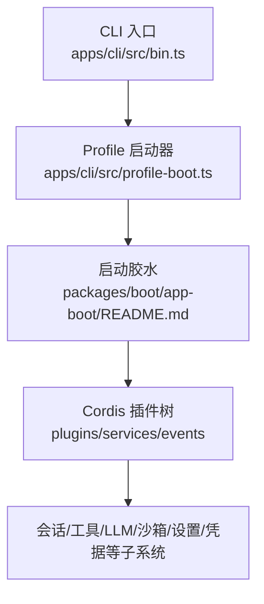
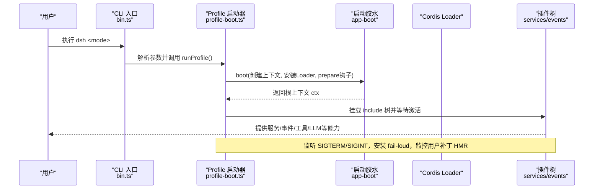
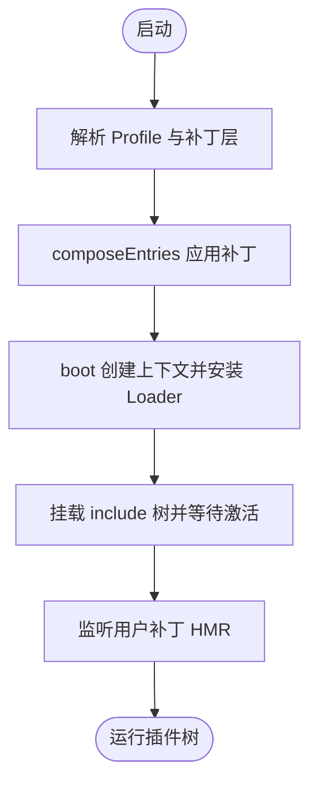
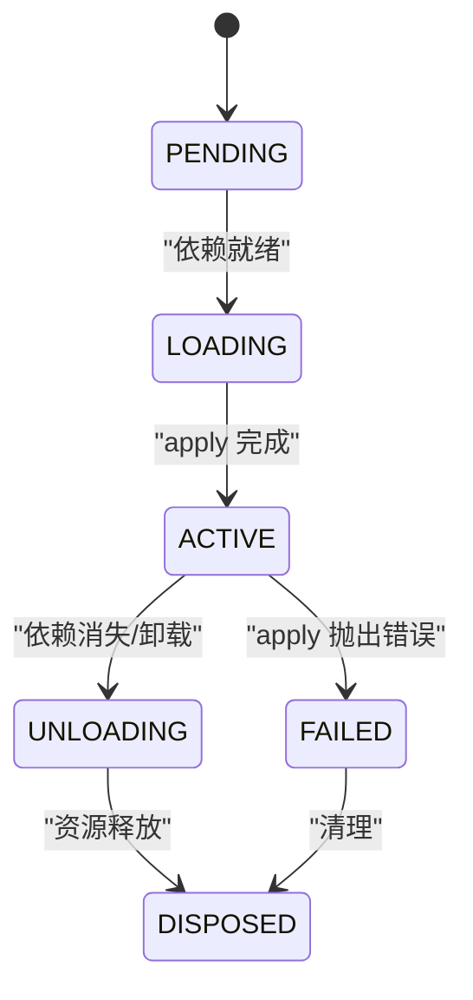
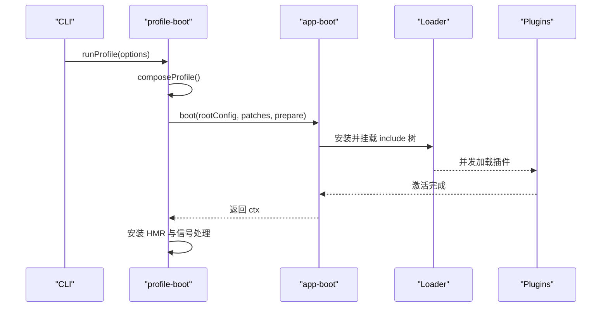

# 整体架构

<cite>
**本文引用的文件**
- [README.md](file://README.md)
- [architecture.md](file://docs/architecture.md)
- [bin.ts](file://apps/cli/src/bin.ts)
- [profile-boot.ts](file://apps/cli/src/profile-boot.ts)
- [app-boot README.md](file://packages/boot/app-boot/README.md)
- [cordis.yml（ACP 示例）](file://examples/acp-agent/cordis.yml)
- [cordis.yml（无头示例）](file://examples/headless-agent/cordis.yml)
- [插件与生命周期教程](file://docs/user/develop/framework/index.md)
- [Cordis 入门](file://docs/cordis-primer.md)
</cite>

## 目录
1. [简介](#简介)
2. [项目结构](#项目结构)
3. [核心组件](#核心组件)
4. [架构总览](#架构总览)
5. [详细组件分析](#详细组件分析)
6. [依赖关系分析](#依赖关系分析)
7. [性能考量](#性能考量)
8. [故障排查指南](#故障排查指南)
9. [结论](#结论)
10. [附录：配置组合示例](#附录：配置组合示例)

## 简介
DeepSeek Harness（dsh）是一个“一切皆插件”的开源智能体运行框架，基于 Cordis 插件框架构建。它通过“配置文件（Profile）—分发格式（Bundle）—补丁机制（Patch）”的组合方式，将模型适配器、工具注册、会话日志、沙箱策略、设置、凭据、遥测等能力以可替换的插件形式装配到运行时。启动时按层叠顺序应用补丁，形成最终的插件树；运行期支持热重载用户补丁，实现动态扩展与替换。

该架构的优势在于：
- 可插拔：任何能力均可被同接口实现替换，无需修改核心代码。
- 可组合：通过有序补丁层叠加功能，便于构建不同场景的 Profile。
- 可观测：事件驱动与持久化会话日志提供调试与回放基础。
- 可扩展：服务注入与依赖声明让加载顺序由依赖决定，降低耦合。

**章节来源**
- [README.md:1-12](file://README.md#L1-L12)
- [architecture.md:9-28](file://docs/architecture.md#L9-L28)

## 项目结构
仓库采用多包工作区组织，CLI 入口位于 apps/cli，共享启动逻辑在 packages/boot/app-boot，示例与文档分布在 examples 与 docs。关键路径：
- CLI 入口：apps/cli/src/bin.ts
- 配置与启动：apps/cli/src/profile-boot.ts
- 启动胶水：packages/boot/app-boot/README.md
- 示例配置：examples/*/cordis.yml
- 架构说明：docs/architecture.md

**图表来源**
- [bin.ts:27-49](file://apps/cli/src/bin.ts#L27-L49)
- [profile-boot.ts:207-259](file://apps/cli/src/profile-boot.ts#L207-L259)
- [app-boot README.md:7-24](file://packages/boot/app-boot/README.md#L7-L24)

**章节来源**
- [bin.ts:1-54](file://apps/cli/src/bin.ts#L1-L54)
- [profile-boot.ts:1-301](file://apps/cli/src/profile-boot.ts#L1-L301)
- [app-boot README.md:1-61](file://packages/boot/app-boot/README.md#L1-L61)

## 核心组件
- Profile（配置文件）：命名化的组合模板，声明要堆叠的 Bundle 列表，并持有用户级 cordis.patch.yml。
- Bundle（分发格式）：包含 Cordis 配置行与对应代码的分发包，通过 dsh.bundle.patch 指向补丁文件，确保上层仍可覆盖。
- Patch（补丁机制）：以 id 为目标替换整行配置或插入新行，支持 !!js 表达式与多层叠加。
- Cordis 插件树：由 Loader 并发挂载，Fiber 状态机管理加载、激活、卸载与清理；依赖通过 inject 声明，加载顺序由依赖决定而非文件顺序。
- 启动环境：分层 .env 快照、命令行参数、进程信号处理、HMR 热重载用户补丁。

这些组件共同构成“从空根配置开始，逐层打补丁”的可组合系统。

**章节来源**
- [architecture.md:15-38](file://docs/architecture.md#L15-L38)
- [app-boot README.md:36-46](file://packages/boot/app-boot/README.md#L36-L46)
- [插件与生命周期教程:7-38](file://docs/user/develop/framework/index.md#L7-L38)

## 架构总览
下图展示了 dsh 启动到运行期的主要流程与组件交互：

**图表来源**
- [bin.ts:27-49](file://apps/cli/src/bin.ts#L27-L49)
- [profile-boot.ts:207-259](file://apps/cli/src/profile-boot.ts#L207-L259)
- [app-boot README.md:7-24](file://packages/boot/app-boot/README.md#L7-L24)

## 详细组件分析

### 启动流程与补丁层叠
- CLI 入口根据模式动态导入 profile-boot 或 plugin/dump-config。
- profile-boot 负责：
  - 准备 Profile 根配置（空 entry list），写入到 profile 目录以便 Loader 锚定 baseUrl。
  - 组装补丁栈：bundle 层 → profile 层 → home 层 → --patch 覆盖层 → 遥测开关层。
  - 调用 boot 创建根上下文，提供启动环境快照与命令行参数。
  - 安装 fail-loud、信号处理、HMR 监听用户补丁，支持热重载。

补丁层的应用顺序保证：
- bundle 层作为基础能力，优先于用户层。
- home 层对每个 profile 生效，优先级高于 profile 自身 patch。
- --patch 覆盖层与遥测开关位于最顶层，可强制禁用或覆盖行为。

**图表来源**
- [profile-boot.ts:142-171](file://apps/cli/src/profile-boot.ts#L142-L171)
- [profile-boot.ts:207-259](file://apps/cli/src/profile-boot.ts#L207-L259)
- [app-boot README.md:15-24](file://packages/boot/app-boot/README.md#L15-L24)

**章节来源**
- [bin.ts:27-49](file://apps/cli/src/bin.ts#L27-L49)
- [profile-boot.ts:85-171](file://apps/cli/src/profile-boot.ts#L85-L171)
- [profile-boot.ts:207-259](file://apps/cli/src/profile-boot.ts#L207-L259)
- [app-boot README.md:15-24](file://packages/boot/app-boot/README.md#L15-L24)

### 插件加载顺序与依赖管理
- 每个插件拥有 Fiber 作用域，状态机为 PENDING→LOADING→ACTIVE→UNLOADING→DISPOSED。
- 通过 inject 声明所需服务，Cordis 会等待依赖就绪后再加载；若依赖在服务期内消失，插件自动卸载并在恢复后重新加载。
- 加载顺序不依赖 cordis.yml 中的文件顺序，而由依赖关系决定。

**图表来源**
- [插件与生命周期教程:7-38](file://docs/user/develop/framework/index.md#L7-L38)

**章节来源**
- [插件与生命周期教程:7-38](file://docs/user/develop/framework/index.md#L7-L38)
- [Cordis 入门:7-13](file://docs/cordis-primer.md#L7-L13)

### 配置层与运行时环境
- 分层环境：继承环境 > 项目 .env > 用户 .env，启动时冻结快照供插件读取。
- 命令行参数通过 ctx.cmdlineArgs 暴露给插件，退出请求通过 ctx.appExit 统一管控。
- 遥测开关：当存在遥测行且环境变量启用时，生成禁用补丁覆盖。
- HMR：监听 $DSH_HOME 与 profile 的 cordis.patch.yml，变更时事务性重组补丁栈并热更新。

**章节来源**
- [app-boot README.md:9-24](file://packages/boot/app-boot/README.md#L9-L24)
- [profile-boot.ts:69-83](file://apps/cli/src/profile-boot.ts#L69-L83)
- [profile-boot.ts:240-298](file://apps/cli/src/profile-boot.ts#L240-L298)

### 核心概念：Profile、Bundle、Patch
- Profile：命名组合模板，列出 bundles，持有用户 patch。
- Bundle：分发包，声明 dsh.bundle.patch，贡献一组配置行与代码，仍允许上层覆盖。
- Patch：id 目标替换或 insert 插入，支持 !!js 表达式，多层叠加。

实际效果：
- 通过 dsh.profile.bundles 的顺序控制基础能力装配。
- 用户可在 profile 或 home 层覆盖任意行，实现细粒度定制。
- 运行时可通过 --patch 临时覆盖，便于测试与调试。

**章节来源**
- [architecture.md:15-38](file://docs/architecture.md#L15-L38)
- [app-boot README.md:36-46](file://packages/boot/app-boot/README.md#L36-L46)

### 系统启动流程与插件加载顺序
- CLI 解析参数后进入 profile 模式，调用 runProfile。
- composeProfile 组装补丁栈，prepareProfile 准备根配置。
- boot 创建根上下文，安装 Loader，执行 prepare 钩子提供宿主信息。
- 挂载 include 树，等待所有 enabled 条目激活，断言无未加载或未激活项。
- 安装 HMR 监听用户补丁，支持热重载。

**图表来源**
- [profile-boot.ts:142-171](file://apps/cli/src/profile-boot.ts#L142-L171)
- [profile-boot.ts:207-259](file://apps/cli/src/profile-boot.ts#L207-L259)
- [app-boot README.md:15-24](file://packages/boot/app-boot/README.md#L15-L24)

**章节来源**
- [profile-boot.ts:142-171](file://apps/cli/src/profile-boot.ts#L142-L171)
- [profile-boot.ts:207-259](file://apps/cli/src/profile-boot.ts#L207-L259)
- [app-boot README.md:15-24](file://packages/boot/app-boot/README.md#L15-L24)

### 为什么选择这种架构模式及优势
- 一切皆插件：通过服务定义、提供者、消费者三角色解耦，能力可替换。
- 补丁层叠：以 id 为目标精确覆盖，保持可组合性与可审计性。
- 依赖驱动加载：避免隐式启动顺序问题，提升稳定性。
- 事件与日志：会话日志为模型可见输入的唯一事实源，支持回放与诊断。
- 热重载：用户补丁变更即时生效，提升开发体验。

**章节来源**
- [architecture.md:9-28](file://docs/architecture.md#L9-L28)
- [architecture.md:98-129](file://docs/architecture.md#L98-L129)

## 依赖关系分析
- CLI 依赖 app-boot 提供的启动胶水与 Profile 工具。
- profile-boot 依赖 Cordis Loader、Include、HMR、Timer 等插件。
- 插件之间通过服务键（ctx.*）与事件通信，避免直接导入。
- Bundle 通过 dsh.bundle.patch 声明补丁，Profile 通过 dsh.profile.bundles 声明组合顺序。

**图表来源**
- [bin.ts:27-49](file://apps/cli/src/bin.ts#L27-L49)
- [profile-boot.ts:207-259](file://apps/cli/src/profile-boot.ts#L207-L259)
- [app-boot README.md:7-24](file://packages/boot/app-boot/README.md#L7-L24)

**章节来源**
- [bin.ts:27-49](file://apps/cli/src/bin.ts#L27-L49)
- [profile-boot.ts:207-259](file://apps/cli/src/profile-boot.ts#L207-L259)
- [app-boot README.md:7-24](file://packages/boot/app-boot/README.md#L7-L24)

## 性能考量
- 并发加载：Loader 并发挂载插件，缩短启动时间。
- 依赖就绪才加载：减少无效初始化，避免阻塞。
- 热重载仅重组用户补丁：bundle 层稳定，变更成本低。
- 失败快速上报：fail-loud 将启动失败集中报告，便于定位。
- 会话日志投影：模型历史从日志推导，避免重复计算。

[本节为通用指导，不直接分析具体文件]

## 故障排查指南
- 启动失败：检查 Loader 是否成功挂载 include 树，确认所有 enabled 条目已加载并激活。
- 插件未激活：查看 inject 依赖是否满足，必要时使用 dump-config 输出最终组合。
- 补丁未生效：确认 id 匹配正确，注意 home 层优先级高于 profile 层。
- 遥测未禁用：检查遥测行是否存在以及环境变量是否设置。
- HMR 不生效：确认已安装 timer 与 hmr 插件，且用户补丁文件路径正确。

**章节来源**
- [app-boot README.md:15-24](file://packages/boot/app-boot/README.md#L15-L24)
- [profile-boot.ts:69-83](file://apps/cli/src/profile-boot.ts#L69-L83)
- [profile-boot.ts:271-298](file://apps/cli/src/profile-boot.ts#L271-L298)

## 结论
DeepSeek Harness 通过 Cordis 插件框架实现了高度可组合、可替换、可观测的智能体运行环境。Profile-Bundle-Patch 的三层设计使得功能模块可按需装配，补丁机制提供细粒度覆盖能力，依赖驱动的加载顺序提升了稳定性。结合事件与持久化日志，系统具备良好的调试与回放能力，适合构建多样化 AI Agent 应用场景。

[本节为总结，不直接分析具体文件]

## 附录：配置组合示例
以下示例展示如何组合不同功能模块，体现 Profile、Bundle、Patch 的实际用法。

- ACP 自动化后端示例：
  - 包含 DeepSeek 适配器、沙箱策略、子进程、Bash、审批、ACP 演示、令牌计量、压缩、会话投影、子代理、工作流、文件系统、钩子等。
  - 通过 id 明确标识各组件，便于覆盖与替换。

- 无头代理示例：
  - 包含设置、凭据、DeepSeek 适配器、子进程、本地 Bash、演示主代理、JSONL 持久化、检查点策略、令牌计量、压缩、会话投影、子代理、工作流、文件系统、观察策略等。
  - 强调一次性运行与纯 stdout 输出。

这些示例体现了如何通过配置组合不同能力，形成面向特定场景的完整 Agent 运行环境。

**章节来源**
- [cordis.yml（ACP 示例）:1-193](file://examples/acp-agent/cordis.yml#L1-L193)
- [cordis.yml（无头示例）:1-166](file://examples/headless-agent/cordis.yml#L1-L166)