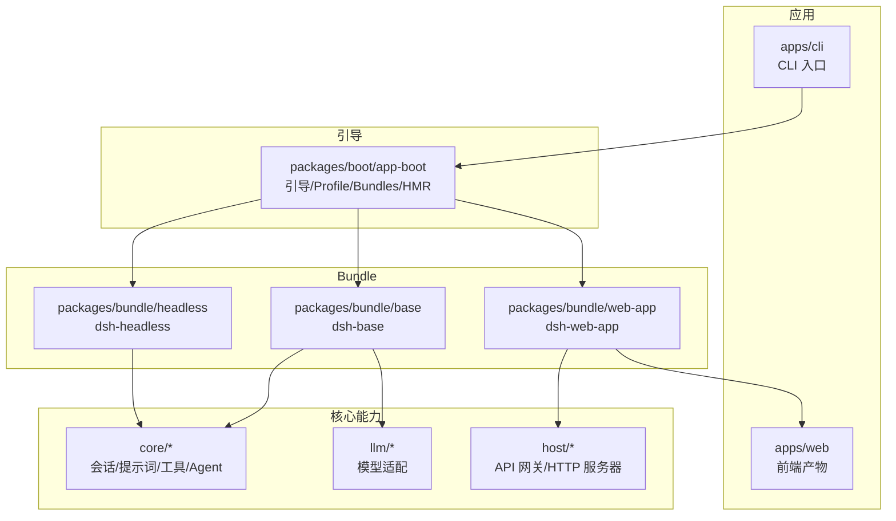
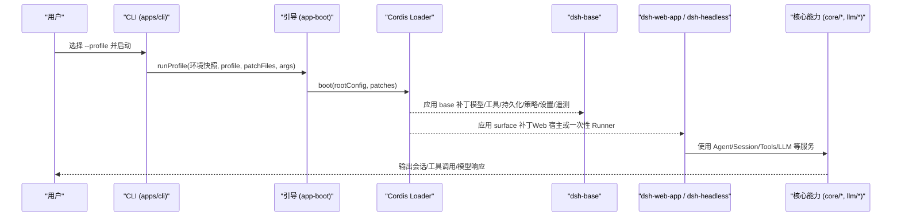
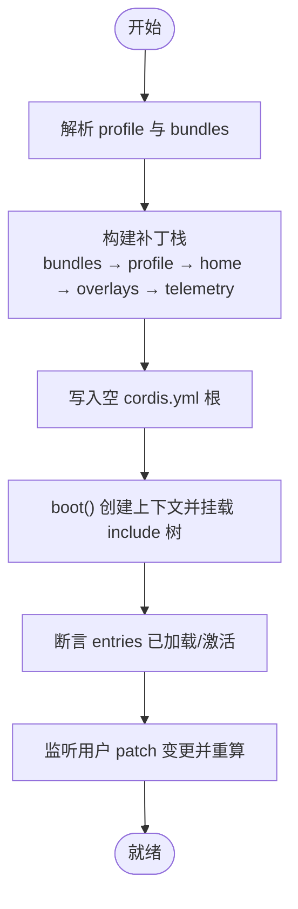
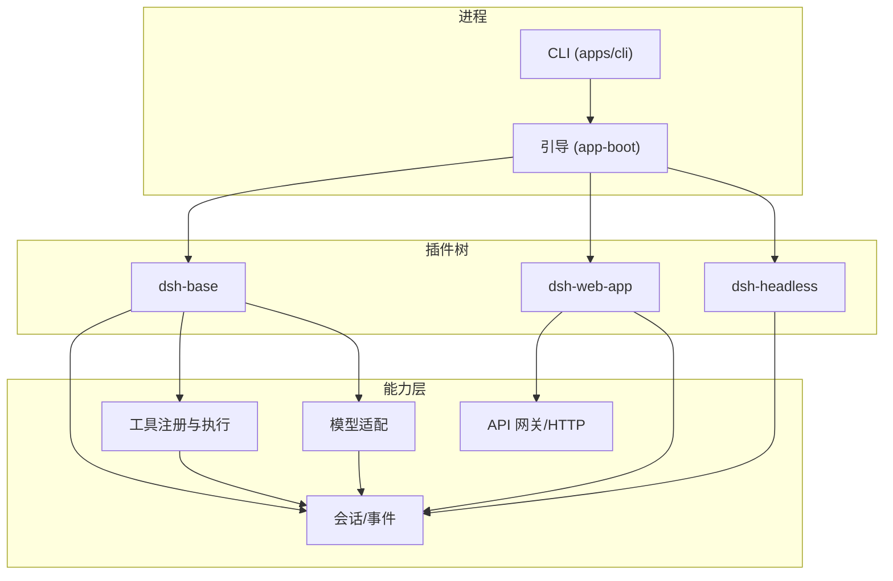
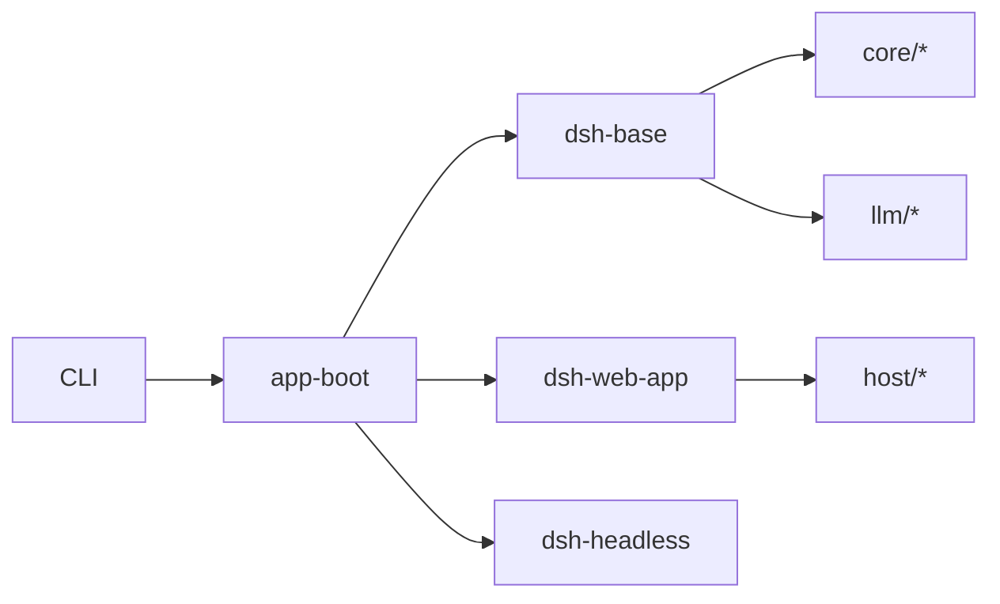

# 整体架构概览

<cite>
**本文引用的文件**
- [README.md](file://README.md)
- [architecture.md](file://docs/architecture.md)
- [profile-boot.ts](file://apps/cli/src/profile-boot.ts)
- [app-boot/README.md](file://packages/boot/app-boot/README.md)
- [base/README.md](file://packages/bundle/base/README.md)
- [web-app/README.md](file://packages/bundle/web-app/README.md)
- [headless/README.md](file://packages/bundle/headless/README.md)
</cite>

## 目录
1. [简介](#简介)
2. [项目结构](#项目结构)
3. [核心组件](#核心组件)
4. [架构总览](#架构总览)
5. [详细组件分析](#详细组件分析)
6. [依赖关系分析](#依赖关系分析)
7. [性能考量](#性能考量)
8. [故障排查指南](#故障排查指南)
9. [结论](#结论)
10. [附录](#附录)

## 简介
DeepSeek Harness（简称 dsh）是一个“一切皆插件”的开源智能体运行框架，基于 Cordis 插件体系构建。通过 profile 与 bundle 的分层组合机制，dsh 在启动时以补丁叠加的方式拼装出完整的插件树：基础能力由 dsh-base 提供，Web 界面由 dsh-web-app 挂载，无头执行由 dsh-headless 提供。配置覆盖通过 cordis.patch.yml 实现，支持按 profile、用户目录以及命令行叠加进行定制。

## 项目结构
- 应用入口与引导
  - apps/cli：CLI 命令与 profile 启动流程
  - packages/boot/app-boot：通用引导与 profile/bundle 解析、HMR 监听、配置转储等
- 核心能力与子系统
  - packages/core、llm、tools、session 等：会话、提示词、工具注册、LLM 适配等
- 分发与组合
  - packages/bundle/{base, web-app, headless}：以 bundle 形式声明 patch 并插入插件行
- 宿主与客户端
  - packages/host：Web GUI 宿主侧 API 网关与静态资源服务
  - packages/client：浏览器端运行时与 HMR 链

图表来源
- [profile-boot.ts:1-301](file://apps/cli/src/profile-boot.ts#L1-L301)
- [app-boot/README.md:1-61](file://packages/boot/app-boot/README.md#L1-L61)
- [base/README.md:1-24](file://packages/bundle/base/README.md#L1-L24)
- [web-app/README.md:1-27](file://packages/bundle/web-app/README.md#L1-L27)
- [headless/README.md:1-21](file://packages/bundle/headless/README.md#L1-L21)

章节来源
- [README.md:1-58](file://README.md#L1-L58)
- [architecture.md:1-130](file://docs/architecture.md#L1-L130)

## 核心组件
- dsh-base：每个 profile 的第一层，注入模型适配器、工具、持久化、沙箱与审批策略、设置与凭据、遥测等；平台相关 shell 栈（bash/pwsh）在此按平台门控。
- dsh-web-app：在 base 之上增加 Web 宿主（HTTP 服务器、API 网关、工作区、存储）、浏览器插件清单、HMR 重载链，以及前端 dist 的静态回退；负责 app 命令行解析与端口绑定策略。
- dsh-headless：在 base 之上提供一次性任务执行器，禁用 HMR，将 Code Mode 作为核心执行能力挂载，提交任务后等待静默并输出结果。
- 引导与 Profile/Bundles：app-boot 提供 profile 解析、bundle 补丁加载、用户 patch 热更新、配置转储与断言；profile-boot 串联 CLI 参数、环境快照、信号处理与 HMR 监听。

章节来源
- [base/README.md:1-24](file://packages/bundle/base/README.md#L1-L24)
- [web-app/README.md:1-27](file://packages/bundle/web-app/README.md#L1-L27)
- [headless/README.md:1-21](file://packages/bundle/headless/README.md#L1-L21)
- [app-boot/README.md:1-61](file://packages/boot/app-boot/README.md#L1-L61)
- [profile-boot.ts:1-301](file://apps/cli/src/profile-boot.ts#L1-L301)

## 架构总览
下图展示了从 CLI 到 Bundle 再到核心能力的装配顺序与数据流向。

图表来源
- [profile-boot.ts:142-171](file://apps/cli/src/profile-boot.ts#L142-L171)
- [profile-boot.ts:207-259](file://apps/cli/src/profile-boot.ts#L207-L259)
- [app-boot/README.md:18-23](file://packages/boot/app-boot/README.md#L18-L23)
- [base/README.md:1-24](file://packages/bundle/base/README.md#L1-L24)
- [web-app/README.md:1-27](file://packages/bundle/web-app/README.md#L1-L27)
- [headless/README.md:1-21](file://packages/bundle/headless/README.md#L1-L21)

## 详细组件分析

### 启动时的插件树构建过程
- 解析 profile：读取 $DSH_HOME/profiles/<name>/package.json 中的 dsh.profile.bundles，确定 bundle 列表。
- 组装补丁栈：按顺序拼接 bundle 补丁、profile 自身 cordis.patch.yml、home 级 cordis.patch.yml、--patch 叠加层与遥测开关补丁。
- 写入空根配置：在每个 profile 目录下写入空的 cordis.yml，所有实际条目均由补丁生成，避免重复写入。
- 启动 Loader：创建根上下文，安装 Loader，挂载 include 树，断言所有已启用条目已加载并激活。
- 热更新：对 profile 与 home 的 cordis.patch.yml 建立 HMR 监听，增量重算补丁栈并事务性重组。

图表来源
- [profile-boot.ts:98-103](file://apps/cli/src/profile-boot.ts#L98-L103)
- [profile-boot.ts:142-171](file://apps/cli/src/profile-boot.ts#L142-L171)
- [profile-boot.ts:207-259](file://apps/cli/src/profile-boot.ts#L207-L259)
- [profile-boot.ts:268-298](file://apps/cli/src/profile-boot.ts#L268-L298)
- [app-boot/README.md:18-23](file://packages/boot/app-boot/README.md#L18-L23)

章节来源
- [profile-boot.ts:1-301](file://apps/cli/src/profile-boot.ts#L1-L301)
- [app-boot/README.md:1-61](file://packages/boot/app-boot/README.md#L1-L61)

### dsh-base：基础能力层
- 作用：注入模型适配器、默认模型选择、工具集、持久化、沙箱与审批策略、设置与凭据、遥测等。
- 平台门控：在同一份补丁中按平台启用 bash 或 pwsh 执行栈，确保权限面一致。
- 可替换性：后续 bundle 与用户 patch 可通过 id 替换整行配置，模式特定值放在上层而非 base。

章节来源
- [base/README.md:1-24](file://packages/bundle/base/README.md#L1-L24)

### dsh-web-app：Web 表面层
- 作用：在 base 之上添加 Web 宿主（HTTP 服务器、API 网关、工作区、存储）、浏览器插件清单、HMR 重载链，以及前端 dist 的静态回退。
- 命令行：解析 --host、--port、--trusted-host，拒绝不安全的 0.0.0.0 绑定；帮助信息不会触发服务器启动。
- 运行时上下文：当 surfaceContext 为真时，向模型暴露 harness 源码信息与 web-surface 全局段落，并在受管 bash 环境中注入 DSH_WEB_URL。

章节来源
- [web-app/README.md:1-27](file://packages/bundle/web-app/README.md#L1-L27)

### dsh-headless：一次性任务层
- 作用：在 base 之上提供一次性任务执行器，禁用 HMR，将 Code Mode 作为核心执行能力挂载。
- 行为：创建持久化 Agent，提交任务为用户消息，等待静默后输出最后非空助手文本并通过宿主钩子退出；无监听端口。

章节来源
- [headless/README.md:1-21](file://packages/bundle/headless/README.md#L1-L21)

### 配置覆盖机制与 cordis.patch.yml
- 覆盖层级（自低到高）：
  1) bundles 的 cordis.patch.yml（按 dsh.profile.bundles 顺序）
  2) profile 自身的 cordis.patch.yml
  3) 用户目录 $DSH_HOME/cordis.patch.yml（机器级偏好，优先级高于 per-profile）
  4) --patch 叠加层（argv 顺序）
  5) 遥测开关补丁（DSH_TELEMETRY_DISABLED）
- 覆盖语义：id 目标匹配会替换整行 config（非深合并），insert 用于新增行；缺失 id 会在转储时告警。
- 热更新：对 profile 与 home 的 patch 文件建立 HMR 监听，增量重算并事务性重组，不影响已运行的 bundle 层。

图表来源
- [profile-boot.ts:121-129](file://apps/cli/src/profile-boot.ts#L121-L129)
- [profile-boot.ts:142-171](file://apps/cli/src/profile-boot.ts#L142-L171)
- [profile-boot.ts:240-245](file://apps/cli/src/profile-boot.ts#L240-L245)
- [app-boot/README.md:40-45](file://packages/boot/app-boot/README.md#L40-L45)

章节来源
- [profile-boot.ts:121-171](file://apps/cli/src/profile-boot.ts#L121-L171)
- [app-boot/README.md:40-45](file://packages/boot/app-boot/README.md#L40-L45)

### 系统架构图（组件关系与数据流）

图表来源
- [profile-boot.ts:207-259](file://apps/cli/src/profile-boot.ts#L207-L259)
- [base/README.md:1-24](file://packages/bundle/base/README.md#L1-L24)
- [web-app/README.md:1-27](file://packages/bundle/web-app/README.md#L1-L27)
- [headless/README.md:1-21](file://packages/bundle/headless/README.md#L1-L21)

## 依赖关系分析
- 启动依赖
  - CLI 依赖 app-boot 提供的 profile/bundle 解析、HMR 与断言能力。
  - 各 bundle 通过 cordis.patch.yml 声明要插入的插件行，被 Loader 按序应用。
- 运行时依赖
  - dsh-web-app 依赖 host 的 HTTP 服务器与 API 网关，以及前端静态资源。
  - dsh-headless 依赖 core 的 Agent/Session/Tools 与持久化。
- 解耦点
  - 通过 Cordis 的服务定义/提供者/消费者三件套，能力可插拔替换（如 LLM 适配器、文件系统、沙箱后端）。

图表来源
- [profile-boot.ts:1-301](file://apps/cli/src/profile-boot.ts#L1-L301)
- [app-boot/README.md:1-61](file://packages/boot/app-boot/README.md#L1-L61)
- [base/README.md:1-24](file://packages/bundle/base/README.md#L1-L24)
- [web-app/README.md:1-27](file://packages/bundle/web-app/README.md#L1-L27)
- [headless/README.md:1-21](file://packages/bundle/headless/README.md#L1-L21)

章节来源
- [architecture.md:39-129](file://docs/architecture.md#L39-L129)

## 性能考量
- 并发装载：Loader 并发挂载条目，有助于缩短启动时间；但需避免启动期副作用竞争。
- 补丁重算：HMR 仅重算用户 patch 层，bundle 层保持稳定，减少不必要的重建。
- 提示词与缓存：web-app 注入的 harness-source 与 web-surface 段落位于系统提示头部且稳定，有利于 KV 缓存命中。
- 端口与网络：web-app 拒绝不安全绑定，避免意外暴露；LAN 地址为启动时快照，避免频繁探测开销。

[本节为通用指导，无需具体文件引用]

## 故障排查指南
- 启动失败定位
  - 使用断言：assertEntriesLoaded/assertEntriesActivated 检查未加载或未激活的条目，快速定位缺失插件或服务。
  - 查看转储：通过 --dump-config 或 renderConfigDump 查看最终组成的配置树与警告。
- 常见错误
  - 未构建前端 dist：web-app 在激活时会因 require.resolve 失败而报错，需先构建前端。
  - 缺少 task：headless 模式未提供任务会直接拒绝启动。
  - 不安全主机：web 模式拒绝 0.0.0.0 绑定，需改用 127.0.0.1。
- 日志与信号
  - 安装 fail-loud 处理器，将未捕获错误转为带标签的 stderr 输出并退出。
  - SIGTERM/SIGINT 统一走 bounded shutdown，保证终端状态恢复与插件清理。

章节来源
- [app-boot/README.md:12-16](file://packages/boot/app-boot/README.md#L12-L16)
- [web-app/README.md:23-27](file://packages/bundle/web-app/README.md#L23-L27)
- [headless/README.md:7-21](file://packages/bundle/headless/README.md#L7-L21)
- [profile-boot.ts:211-225](file://apps/cli/src/profile-boot.ts#L211-L225)

## 结论
DeepSeek Harness 通过“一切皆插件”的 Cordis 理念，结合 profile 与 bundle 的分层补丁机制，实现了高度可组合、可替换的系统架构。dsh-base 提供基础能力，dsh-web-app 与 dsh-headless 分别承载交互与一次性任务场景。配置覆盖通过 cordis.patch.yml 实现细粒度定制，配合 HMR 与断言机制，既便于初学者理解，也为高级开发者提供了深入的扩展点与实现细节。

## 附录
- 术语
  - Profile：命名化的组合模板，列出 bundles 与用户 patch。
  - Bundle：以 npm 包形式分发的补丁集合，声明要插入的插件行。
  - Patch：id 目标替换或 insert 新增，支持 !!js 表达式。
- 参考
  - 架构文档：docs/architecture.md
  - 引导与 Profile/Bundles：packages/boot/app-boot/README.md
  - 各 Bundle 说明：packages/bundle/*/README.md