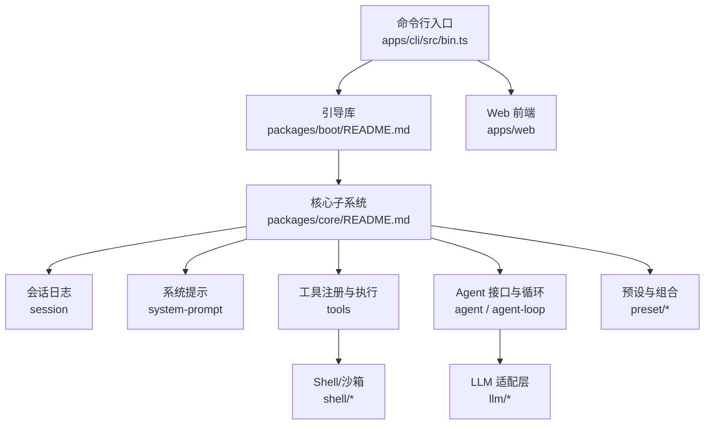
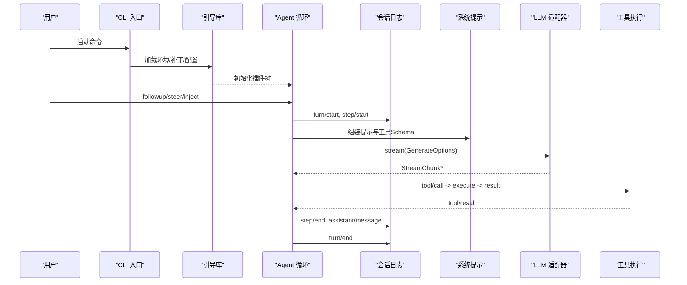
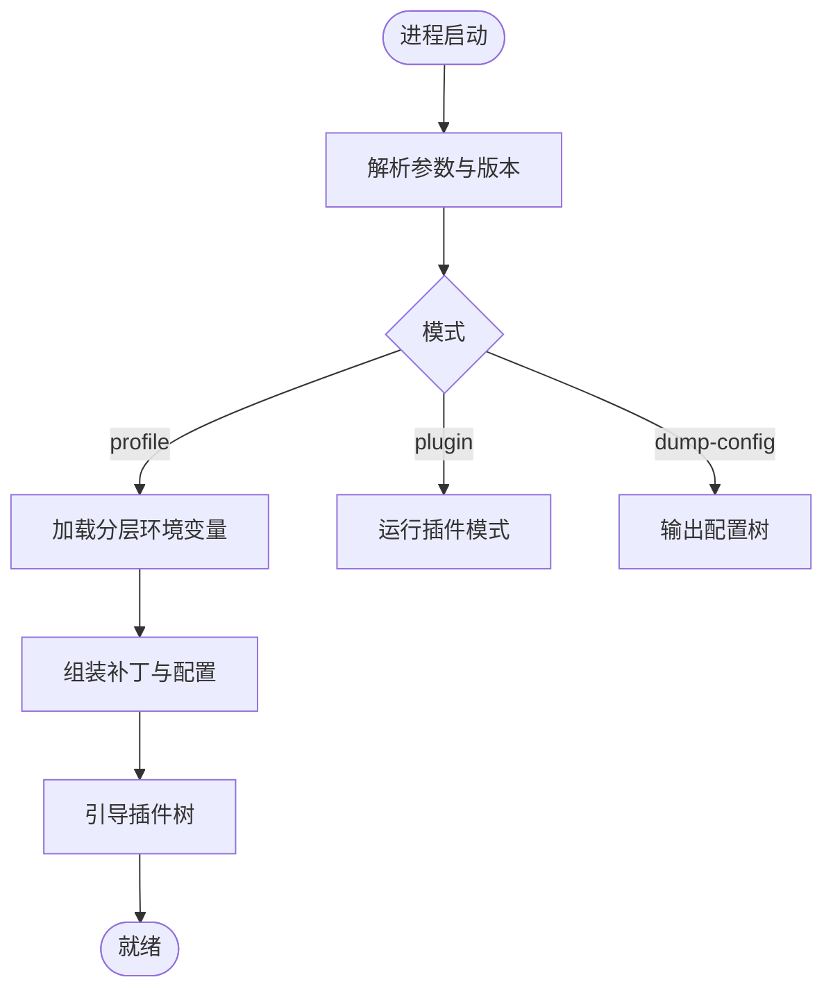
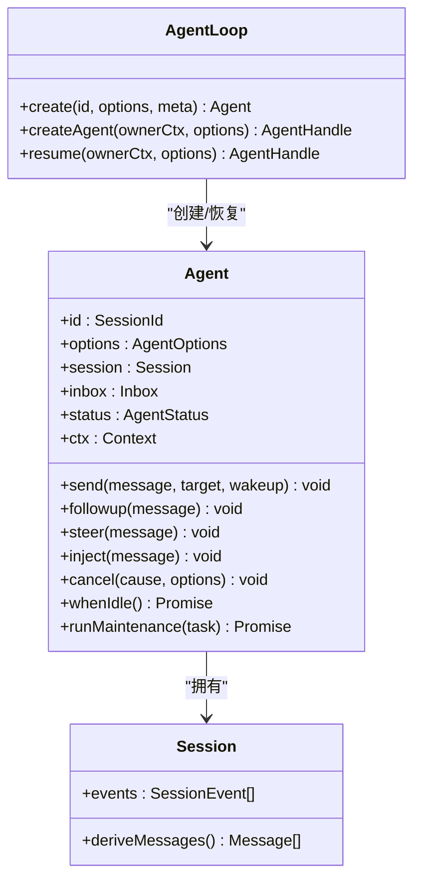
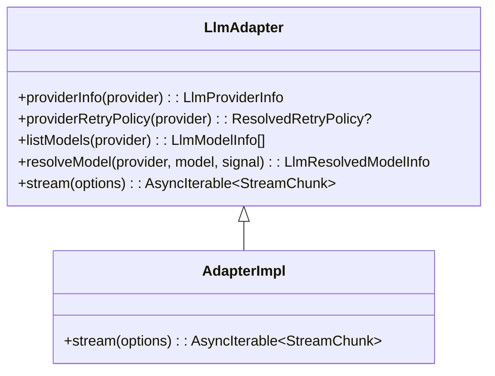
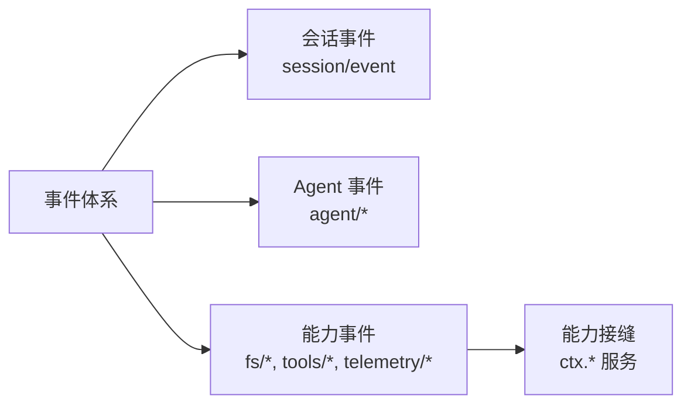
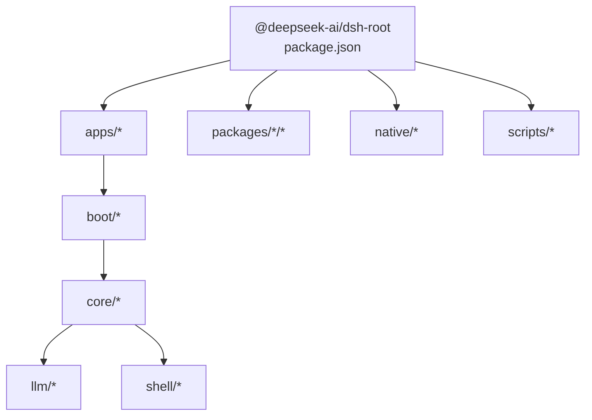

# 架构设计

<cite>
**本文引用的文件**
- [README.md](file://README.md)
- [package.json](file://package.json)
- [apps/cli/src/bin.ts](file://apps/cli/src/bin.ts)
- [packages/boot/README.md](file://packages/boot/README.md)
- [packages/core/README.md](file://packages/core/README.md)
- [docs/architecture.md](file://docs/architecture.md)
- [docs/subsystems/core.md](file://docs/subsystems/core.md)
- [docs/cordis-api/registry.md](file://docs/cordis-api/registry.md)
- [packages/llm/llm/src/index.ts](file://packages/llm/llm/src/index.ts)
- [packages/shell/tool-bash/src/index.ts](file://packages/shell/tool-bash/src/index.ts)
- [packages/shell/bash-sandbox/src/index.ts](file://packages/shell/bash-sandbox/src/index.ts)
- [packages/shell/pwsh-sandbox/src/index.ts](file://packages/shell/pwsh-sandbox/src/index.ts)
</cite>

## 目录
1. [简介](#简介)
2. [项目结构](#项目结构)
3. [核心组件](#核心组件)
4. [架构总览](#架构总览)
5. [详细组件分析](#详细组件分析)
6. [依赖关系分析](#依赖关系分析)
7. [性能考虑](#性能考虑)
8. [故障排查指南](#故障排查指南)
9. [结论](#结论)
10. [附录](#附录)

## 简介
DeepSeek Harness（dsh）是一个以“一切皆插件”为核心理念的开源智能体运行框架，基于 Cordis 运行时构建。它通过可组合的配置层、事件驱动的工作流与可扩展的能力接缝，将会话日志、系统提示、工具注册、LLM 适配、沙箱执行、持久化等能力解耦为可替换的插件。用户可通过 profile 与 bundle 在启动时按序叠加配置与代码，形成最终运行的插件树；所有行为均可通过补丁或覆盖进行定制。

## 项目结构
仓库采用多包工作区组织：
- apps：应用入口（CLI、Web），负责解析参数、加载环境、组装补丁并引导 Cordis 插件树。
- packages：核心子系统与能力实现（会话、提示、工具、Agent、LLM、沙箱、存储、设置等）。
- docs：架构、子系统、教程与使用文档。
- examples：示例 Agent 与演示配置。
- native：原生安全隔离相关二进制与打包脚本。
- scripts：构建、校验、发布与工程化工具。



**图表来源**
- [apps/cli/src/bin.ts:1-54](file://apps/cli/src/bin.ts#L1-L54)
- [packages/boot/README.md:1-13](file://packages/boot/README.md#L1-L13)
- [packages/core/README.md:1-22](file://packages/core/README.md#L1-L22)

**章节来源**
- [README.md:1-58](file://README.md#L1-L58)
- [package.json:1-183](file://package.json#L1-L183)

## 核心组件
- 引导与装配：CLI 解析参数与环境，动态导入对应模式（profile/plugin/dump-config），加载分层环境变量，组装补丁并引导 Cordis 插件树。
- 核心控制脊柱：会话日志（append-only）、系统提示与工具 Schema 组装、工具注册与执行管线、Agent 接口与默认循环驱动。
- LLM 适配：统一的消息与流式协议，适配器实现具体提供方调用，支持重试、模型元数据与能力发现。
- 沙箱与执行：Shell 工具与 Bash/PowerShell 沙箱后端，提供进程级隔离策略与执行上下文。
- 预设与组合：Profile/Bundles 定义启动层顺序，允许以补丁方式替换或插入行，形成最终运行态。

**章节来源**
- [docs/architecture.md:1-130](file://docs/architecture.md#L1-L130)
- [docs/subsystems/core.md:1-800](file://docs/subsystems/core.md#L1-L800)
- [packages/core/README.md:1-22](file://packages/core/README.md#L1-L22)
- [packages/boot/README.md:1-13](file://packages/boot/README.md#L1-L13)

## 架构总览
Harness 的架构围绕“插件树 + 事件流 + 能力接缝”展开：
- 启动阶段：CLI 读取环境与补丁，构建模块表与插件图，预取立即需要的工厂，创建上下文与 Loader，完成引导。
- 运行阶段：Agent 循环从会话日志推导历史，组装提示与工具 Schema，发起 LLM 请求，流式接收响应，调度工具执行，并将所有可见事实追加到会话日志。
- 扩展点：通过事件（session/event、agent/*、tools/*）与能力接缝（ctx.*）挂载新能力，保持可替换性与可观测性。



**图表来源**
- [apps/cli/src/bin.ts:1-54](file://apps/cli/src/bin.ts#L1-L54)
- [docs/subsystems/core.md:1-800](file://docs/subsystems/core.md#L1-L800)
- [docs/architecture.md:63-90](file://docs/architecture.md#L63-L90)

## 详细组件分析

### CLI 与引导流程
- CLI 入口根据模式动态导入 profile-boot、plugin、dump-config，避免无关路径参与启动。
- 引导库负责 .env 分层加载、Loader 守卫、快照感知配置解析与插件树结算。
- Web 端镜像该流程，解析启动清单，预取 immediately 层，确保模块表就绪后再创建入口。



**图表来源**
- [apps/cli/src/bin.ts:1-54](file://apps/cli/src/bin.ts#L1-L54)
- [packages/boot/README.md:1-13](file://packages/boot/README.md#L1-L13)

**章节来源**
- [apps/cli/src/bin.ts:1-54](file://apps/cli/src/bin.ts#L1-L54)
- [packages/boot/README.md:1-13](file://packages/boot/README.md#L1-L13)

### Agent 循环与会话日志
- Agent 循环是默认驱动，遵循 Agent 接口契约；创建/恢复 Agent 时建立会话与生命周期。
- 会话日志是单一事实源，所有模型可见输入必须可重放；turn/step/user/assistant/tool 等均为持久事件。
- pre-step 拦截决策、request 错误恢复、turn-stopping 串行收尾构成关键扩展点。



**图表来源**
- [docs/subsystems/core.md:22-248](file://docs/subsystems/core.md#L22-L248)

**章节来源**
- [docs/subsystems/core.md:1-800](file://docs/subsystems/core.md#L1-L800)

### 工具执行管线与沙箱
- 工具注册于 ctx.tools，执行前/后钩子与结果回调构成受保护的执行管线。
- Shell 工具与 Bash/PowerShell 沙箱后端提供进程级隔离策略，支持每调用策略注入与默认模式声明。

```mermaid
sequenceDiagram
participant Loop as "Agent 循环"
participant Tools as "工具注册"
participant Bash as "Bash 沙箱"
participant Pwsh as "PowerShell 沙箱"
Loop->>Tools : tool/call
Tools->>Tools : tools/pre-execute
alt 选择 Bash 后端
Tools->>Bash : resolve(request) -> ShellExecSpec
Bash-->>Tools : 执行上下文与策略
else 选择 PowerShell 后端
Tools->>Pwsh : resolve(request) -> ShellExecSpec
Pwsh-->>Tools : 执行上下文与策略
end
Tools->>Tools : tools/execute
Tools->>Tools : tools/post-execute
Tools-->>Loop : tool/result
```

**图表来源**
- [packages/shell/tool-bash/src/index.ts:190-200](file://packages/shell/tool-bash/src/index.ts#L190-L200)
- [packages/shell/bash-sandbox/src/index.ts:51-86](file://packages/shell/bash-sandbox/src/index.ts#L51-L86)
- [packages/shell/pwsh-sandbox/src/index.ts:59-94](file://packages/shell/pwsh-sandbox/src/index.ts#L59-L94)

**章节来源**
- [docs/subsystems/core.md:250-254](file://docs/subsystems/core.md#L250-L254)
- [packages/shell/tool-bash/src/index.ts:190-200](file://packages/shell/tool-bash/src/index.ts#L190-L200)
- [packages/shell/bash-sandbox/src/index.ts:51-86](file://packages/shell/bash-sandbox/src/index.ts#L51-L86)
- [packages/shell/pwsh-sandbox/src/index.ts:59-94](file://packages/shell/pwsh-sandbox/src/index.ts#L59-L94)

### LLM 适配层
- 统一抽象 LlmAdapter，要求实现 stream 方法，返回 StreamChunk 序列；支持 providerInfo、listModels、resolveModel、providerRetryPolicy。
- 适配器需包含 attributionHeaders，保证请求溯源；对模型元数据与最大 token 进行校验。



**图表来源**
- [docs/subsystems/llm-streaming.md:653-702](file://docs/subsystems/llm-streaming.md#L653-L702)
- [packages/llm/llm/src/index.ts:657-689](file://packages/llm/llm/src/index.ts#L657-L689)

**章节来源**
- [docs/subsystems/llm-streaming.md:653-702](file://docs/subsystems/llm-streaming.md#L653-L702)
- [packages/llm/llm/src/index.ts:657-689](file://packages/llm/llm/src/index.ts#L657-L689)

### 事件与扩展点
- 事件分类：会话事件（持久）、Agent 事件（实时）、能力事件（接缝）。
- 扩展机制：通过 ctx.* 服务与事件监听器挂载能力，如 llm、tools、fs、sandbox、jobs、commands 等。



**图表来源**
- [docs/architecture.md:53-61](file://docs/architecture.md#L53-L61)
- [docs/architecture.md:98-129](file://docs/architecture.md#L98-L129)

**章节来源**
- [docs/architecture.md:53-61](file://docs/architecture.md#L53-L61)
- [docs/architecture.md:98-129](file://docs/architecture.md#L98-L129)

## 依赖关系分析
- 引导与核心：CLI 依赖引导库，引导库依赖核心子系统；核心子系统之间通过 ctx 键解耦。
- 插件与补丁：Profile/Bundles 按序叠加，补丁可替换或插入行，形成最终插件树。
- 外部依赖：Node.js 引擎约束、pnpm 工作区、第三方库（Vitest、TypeScript、Mermaid 等）。



**图表来源**
- [package.json:11-18](file://package.json#L11-L18)
- [package.json:136-142](file://package.json#L136-L142)

**章节来源**
- [package.json:1-183](file://package.json#L1-L183)

## 性能考虑
- 启动优化：预取 immediately 层，避免模块表未就绪导致的竞态；按需动态导入减少冷启动开销。
- 流式处理：LLM 响应以流式分片传输，降低首字节延迟；工具执行与 UI 渲染并行推进。
- 日志投影：会话日志作为唯一事实源，衍生模型历史，避免重复存储与一致性维护成本。
- 沙箱隔离：进程级隔离带来一定开销，但提升安全性；可根据策略选择最小必要权限。

[本节提供通用指导，不直接分析具体文件]

## 故障排查指南
- 启动失败：检查 CLI 模式与参数、环境变量层级、补丁是否有效；查看引导阶段的错误报告。
- Agent 异常：关注 agent/error、agent/disposed 事件；确认 session 日志中 turn/step 状态。
- 工具执行失败：检查 tools/pre-execute/execute/post-execute 钩子；验证沙箱策略与执行上下文。
- LLM 适配问题：确认适配器已注册、模型元数据合法、attributionHeaders 已添加；观察重试策略与错误码。

**章节来源**
- [docs/subsystems/core.md:725-797](file://docs/subsystems/core.md#L725-L797)
- [packages/llm/llm/src/index.ts:657-689](file://packages/llm/llm/src/index.ts#L657-L689)

## 结论
DeepSeek Harness 通过插件化架构、事件驱动与能力接缝，实现了高度可组合、可替换的智能体运行平台。其核心在于会话日志的事实一致性、Agent 循环的可插拔驱动、LLM 适配的统一抽象以及沙箱执行的策略化隔离。借助 Profile/Bundles 与补丁机制，部署者可灵活裁剪与扩展能力，满足多样化场景需求。

[本节总结整体设计，不直接分析具体文件]

## 附录

### 技术栈与兼容性
- Node.js 引擎：^22.19.0 || >=24.0.0
- 包管理器：pnpm@11.7.0
- 测试与构建：Vitest、TypeScript、tsdown、Mermaid 等

**章节来源**
- [package.json:7-10](file://package.json#L7-L10)
- [package.json:144-181](file://package.json#L144-L181)

### 基础设施要求
- 运行环境：Node.js 指定版本区间
- 文件系统：支持 .env 分层与 DSH_HOME 配置
- 安全隔离：可选沙箱后端（Bash/PowerShell），需具备相应进程管理能力

**章节来源**
- [package.json:7-10](file://package.json#L7-L10)
- [packages/shell/bash-sandbox/src/index.ts:51-86](file://packages/shell/bash-sandbox/src/index.ts#L51-L86)
- [packages/shell/pwsh-sandbox/src/index.ts:59-94](file://packages/shell/pwsh-sandbox/src/index.ts#L59-L94)

### 可扩展性与部署拓扑
- 可扩展性：通过 Cordis 插件与事件扩展点，新增模型提供商、工具、UI 节点、持久化后端等。
- 部署拓扑：CLI 模式用于无头运行与批处理；Web 模式提供浏览器界面；可结合容器化与编排系统进行部署。

**章节来源**
- [docs/architecture.md:15-37](file://docs/architecture.md#L15-L37)
- [docs/architecture.md:104-129](file://docs/architecture.md#L104-L129)

### 安全性、监控与灾难恢复
- 安全性：沙箱策略与进程隔离限制执行范围；工具执行前后钩子可审计与干预。
- 监控：agent/status、agent/error、session/event 提供运行态观测；token 计量与遥测可集成。
- 灾难恢复：会话日志持久化支持崩溃恢复与回放；turn/end 记录终止原因，便于诊断。

**章节来源**
- [docs/subsystems/core.md:244-248](file://docs/subsystems/core.md#L244-L248)
- [docs/subsystems/core.md:775-797](file://docs/subsystems/core.md#L775-L797)

### 模块依赖关系图与组件交互流程图
- 模块依赖：见“依赖关系分析”章节图示。
- 组件交互：见“架构总览”与“详细组件分析”中的时序图。

[本节引用前述图示，不再重复绘制]