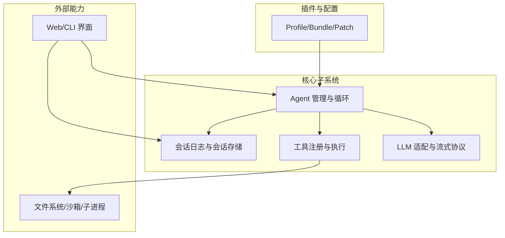
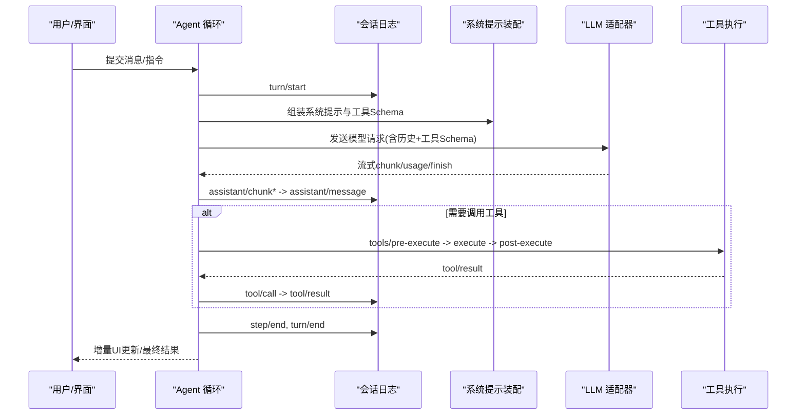
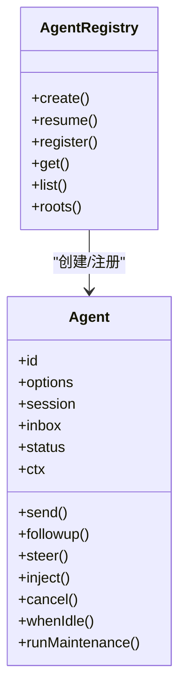
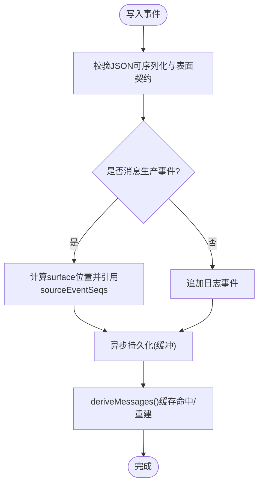
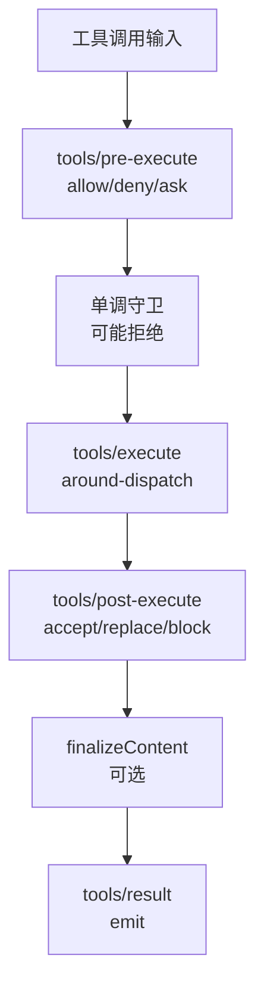
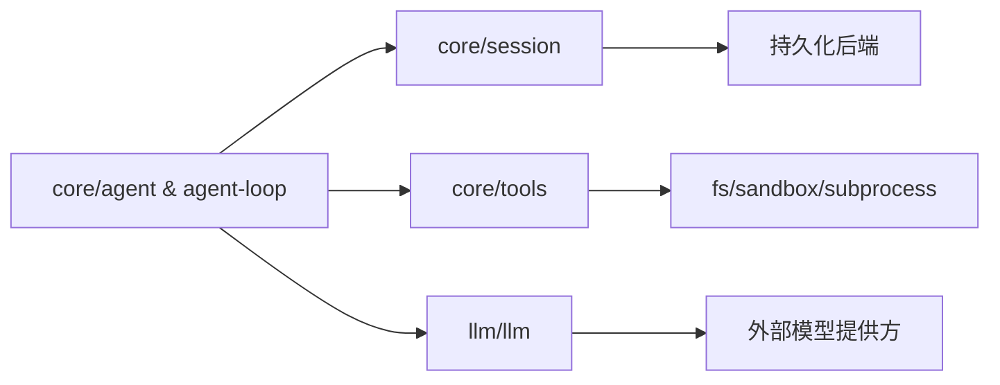

# 架构设计

<cite>
**本文引用的文件**
- [architecture.md](file://docs/architecture.md)
- [cordis-primer.md](file://docs/cordis-primer.md)
- [core.md](file://docs/subsystems/core.md)
- [session.md](file://docs/subsystems/session.md)
- [tools.md](file://docs/subsystems/tools.md)
- [llm-streaming.md](file://docs/subsystems/llm-streaming.md)
- [agent-lifecycle.md](file://docs/agent-lifecycle.md)
- [tool-execution-pipeline.md](file://docs/tool-execution-pipeline.md)
- [event-producer-consumer.md](file://docs/event-producer-consumer.md)
- [capability-seams.md](file://docs/capability-seams.md)
- [persistence.md](file://docs/subsystems/persistence.md)
- [system-prompt.md](file://docs/subsystems/system-prompt.md)
- [scope.md](file://docs/subsystems/scope.md)
- [index.ts (AgentRegistry)](file://packages/core/agent/src/index.ts)
- [types.ts (Agent)](file://packages/core/agent/src/types.ts)
- [index.ts (SessionStore)](file://packages/core/session/src/index.ts)
- [types.ts (SessionEventMap)](file://packages/core/session/src/types.ts)
- [index.ts (ToolRuntime)](file://packages/core/tools/src/index.ts)
- [schema.ts (工具参数与输出 DSL)](file://packages/core/tools/src/schema.ts)
- [presentation.ts (工具呈现类型)](file://packages/core/tools/src/presentation.ts)
- [types.ts (LLM 类型)](file://packages/llm/llm/src/types.ts)
- [message.ts (消息与内容块)](file://packages/llm/llm/src/message.ts)
- [assembler.ts (流式组装器)](file://packages/llm/llm/src/assembler.ts)
</cite>

## 目录
1. [简介](#简介)
2. [项目结构](#项目结构)
3. [核心组件](#核心组件)
4. [架构总览](#架构总览)
5. [详细组件分析](#详细组件分析)
6. [依赖关系分析](#依赖关系分析)
7. [性能考量](#性能考量)
8. [故障排查指南](#故障排查指南)
9. [结论](#结论)
10. [附录](#附录)

## 简介
本设计文档面向 DeepSeek Harness（简称 dsh）的整体架构，围绕“一切皆插件”的 Cordis 理念，系统化阐述 Agent 管理系统、会话管理、工具系统、LLM 集成等模块的职责与交互。文档覆盖数据流与控制流、关键设计模式（服务定位器、事件驱动、工厂模式）、扩展点与第三方集成模式，并提供多幅架构图与流程图，帮助开发者快速理解从用户输入到响应输出的完整处理路径。

## 项目结构
dsh 以 Cordis 插件框架为底座，运行期由多个插件层组合而成：每个插件贡献服务、事件与可逆副作用；通过配置层（profile/bundle/patch）在启动时按序装配。核心子系统分布在 packages/core 与 packages/llm 等包中，分别负责会话日志、工具注册与执行、Agent 生命周期与循环、以及 LLM 适配与流式协议。



图表来源
- [architecture.md:9-37](file://docs/architecture.md#L9-L37)
- [core.md:7-20](file://docs/subsystems/core.md#L7-L20)

章节来源
- [architecture.md:9-37](file://docs/architecture.md#L9-L37)
- [core.md:7-20](file://docs/subsystems/core.md#L7-L20)

## 核心组件
- Agent 管理系统：提供 Agent 接口、注册表、发起者作用域与 agent/* 事件；默认驱动实现位于 agent-loop。
- 会话管理：基于事件溯源的不可变 Session 日志，作为模型可见历史的唯一事实源；支持持久化、分叉、恢复。
- 工具系统：注册工具定义与执行管道，提供 pre-execute/execute/post-execute 拦截点、权限守卫、并行/独占调度与 UI 呈现契约。
- LLM 集成：统一的 Message/ContentBlock/StreamChunk 词汇与适配器契约；提供请求装配、重试策略、上下文窗口与推理能力元数据。

章节来源
- [core.md:7-20](file://docs/subsystems/core.md#L7-L20)
- [session.md:1-12](file://docs/subsystems/session.md#L1-L12)
- [tools.md:1-12](file://docs/subsystems/tools.md#L1-L12)
- [llm-streaming.md:1-15](file://docs/subsystems/llm-streaming.md#L1-L15)

## 架构总览
下图展示了从用户输入到模型调用、工具执行、结果落盘与 UI 渲染的关键路径，体现“一切皆插件”的服务发现与事件驱动特性。



图表来源
- [architecture.md:63-90](file://docs/architecture.md#L63-L90)
- [core.md:7-18](file://docs/subsystems/core.md#L7-L18)
- [llm-streaming.md:154-182](file://docs/subsystems/llm-streaming.md#L154-L182)
- [tools.md:170-173](file://docs/subsystems/tools.md#L170-L173)

章节来源
- [architecture.md:63-90](file://docs/architecture.md#L63-L90)
- [core.md:7-18](file://docs/subsystems/core.md#L7-L18)

## 详细组件分析

### Agent 管理系统
- 职责：创建/恢复 Agent、维护生命周期状态、暴露 send/followup/steer/inject/cancel 等统一入口；通过 agent/* 事件对外暴露可插拔拦截点。
- 关键点：
  - AgentHandle 拥有析构语义，确保资源有序释放。
  - 发起者作用域用于同进程因果归属与审计。
  - 预步骤决策 agent/pre-step 决定进入下一步的消息批。
  - 错误恢复 agent/request-error 允许重试或修复。



图表来源
- [core.md:22-51](file://docs/subsystems/core.md#L22-L51)
- [core.md:53-153](file://docs/subsystems/core.md#L53-L153)
- [index.ts (AgentRegistry):553-723](file://packages/core/agent/src/index.ts#L553-L723)
- [types.ts (Agent):53-153](file://packages/core/agent/src/types.ts#L53-L153)

章节来源
- [core.md:22-51](file://docs/subsystems/core.md#L22-L51)
- [core.md:53-153](file://docs/subsystems/core.md#L53-L153)
- [index.ts (AgentRegistry):553-723](file://packages/core/agent/src/index.ts#L553-L723)
- [types.ts (Agent):53-153](file://packages/core/agent/src/types.ts#L53-L153)

### 会话管理（事件溯源）
- 职责：维护不可变的 Session 日志，派生模型可见历史；提供持久化、分叉、恢复与表面投影（surface）。
- 关键点：
  - SessionEventMap 可扩展，所有消息生产事件必须声明 surfaceOp。
  - deriveMessages() 基于 surface 推导模型历史，保证可重放。
  - request/header 与 request/context 记录请求头与路由容量，使每次请求可重构。
  - 持久化后端订阅 session/event 并在 checkpoint 时落盘。



图表来源
- [session.md:21-125](file://docs/subsystems/session.md#L21-L125)
- [session.md:194-249](file://docs/subsystems/session.md#L194-L249)
- [session.md:359-519](file://docs/subsystems/session.md#L359-L519)
- [session.md:601-605](file://docs/subsystems/session.md#L601-L605)

章节来源
- [session.md:21-125](file://docs/subsystems/session.md#L21-L125)
- [session.md:194-249](file://docs/subsystems/session.md#L194-L249)
- [session.md:359-519](file://docs/subsystems/session.md#L359-L519)
- [session.md:601-605](file://docs/subsystems/session.md#L601-L605)

### 工具系统（注册与执行管道）
- 职责：注册工具定义（Schema + execute + 呈现），提供执行前/后拦截、守卫、超时、并发控制与结果规范化。
- 关键点：
  - ToolDefinition 包含 output 规范、execute 函数、可选 finalizeContent 与 UI 呈现。
  - 执行流水线：tools/pre-execute → 单调守卫 → tools/execute → tools/post-execute → finalizeContent → tools/result。
  - 执行模式：parallel/exclusive 由 isConcurrencySafe 分类。
  - 呈现契约：presentCall/presentResult 返回中性视图意图，供宿主渲染。



图表来源
- [tools.md:9-94](file://docs/subsystems/tools.md#L9-L94)
- [tools.md:170-173](file://docs/subsystems/tools.md#L170-L173)
- [tools.md:243-253](file://docs/subsystems/tools.md#L243-L253)
- [tools.md:376-404](file://docs/subsystems/tools.md#L376-L404)
- [tools.md:459-468](file://docs/subsystems/tools.md#L459-L468)

章节来源
- [tools.md:9-94](file://docs/subsystems/tools.md#L9-L94)
- [tools.md:170-173](file://docs/subsystems/tools.md#L170-L173)
- [tools.md:243-253](file://docs/subsystems/tools.md#L243-L253)
- [tools.md:376-404](file://docs/subsystems/tools.md#L376-L404)
- [tools.md:459-468](file://docs/subsystems/tools.md#L459-L468)

### LLM 集成（适配器与流式协议）
- 职责：统一消息/内容块/流式协议，提供适配器注册、模型发现、重试策略、上下文窗口与推理能力元数据。
- 关键点：
  - StreamChunk 为闭联合，block-start/end 关联索引，usage 在 finish 之前。
  - BlockAssembler 将流式片段组装为 ContentBlock 与 AssistantMessage。
  - 适配器契约：usage 顺序、空响应视为可重试错误、上下文溢出统一码、应用标识头强制。
  - 请求头 EpochHeader 与 RequestContext 记录可重构的请求上下文。

```mermaid
sequenceDiagram
participant Loop as "Agent循环"
participant Asm as "BlockAssembler"
participant Ad as "LLM适配器"
Loop->>Ad : stream(options)
loop 流式片段
Ad-->>Loop : block-start/text-delta/tool-call-delta
Loop->>Asm : push(chunk)
end
Ad-->>Loop : usage / finish
Loop->>Asm : blocks()/message()
Loop-->>Loop : 记录assistant/message与usage
```

图表来源
- [llm-streaming.md:154-182](file://docs/subsystems/llm-streaming.md#L154-L182)
- [llm-streaming.md:266-308](file://docs/subsystems/llm-streaming.md#L266-L308)
- [llm-streaming.md:589-614](file://docs/subsystems/llm-streaming.md#L589-L614)

章节来源
- [llm-streaming.md:154-182](file://docs/subsystems/llm-streaming.md#L154-L182)
- [llm-streaming.md:266-308](file://docs/subsystems/llm-streaming.md#L266-L308)
- [llm-streaming.md:589-614](file://docs/subsystems/llm-streaming.md#L589-L614)

### 系统提示装配与工具Schema
- 职责：聚合系统提示段与工具 Schema，形成模型请求的 system 与 tools 字段。
- 关键点：
  - 工具 Schema 来自工具注册表的白名单投影，不包含执行回调。
  - 系统提示段可由插件贡献，参与每步请求构建。

章节来源
- [core.md:7-18](file://docs/subsystems/core.md#L7-L18)
- [system-prompt.md](file://docs/subsystems/system-prompt.md)
- [tools.md:480-544](file://docs/subsystems/tools.md#L480-L544)

### 作用域与插件隔离
- 职责：提供 per-agent 的作用域注册机制，使插件贡献可在 Agent 级别隔离与继承。
- 关键点：
  - scopeOf/scopeTarget 构建作用域链，Agent 的 ctx 即其作用域载体。
  - 预设（preset）通过作用域键绑定，子 Agent 可加入父作用域共享能力。

章节来源
- [core.md:7-20](file://docs/subsystems/core.md#L7-L20)
- [scope.md](file://docs/subsystems/scope.md)

## 依赖关系分析
- 低耦合高内聚：各子系统通过 Cordis 的 ctx 服务键解耦，避免直接导入具体实现。
- 事件驱动：turn/step/user/assistant/tool 等事件贯穿会话日志，作为跨模块通信与回放基础。
- 能力接缝（seam）：fs/shell/subprocess/llm 等能力以提供者/消费者/定义三件套形式存在，便于替换。



图表来源
- [architecture.md:39-51](file://docs/architecture.md#L39-L51)
- [capability-seams.md](file://docs/capability-seams.md)

章节来源
- [architecture.md:39-51](file://docs/architecture.md#L39-L51)
- [capability-seams.md](file://docs/capability-seams.md)

## 性能考量
- 会话日志缓存：deriveMessages() 对 surface 节点进行一次性投影并缓存，重写时重建，降低重复计算。
- 工具并行执行：isConcurrencySafe 标记的工具可分组并行，减少端到端延迟。
- 流式处理：BlockAssembler 增量组装，避免等待整段响应；usage 在 finish 前上报，便于实时统计。
- 持久化缓冲：session 持久化采用异步缓冲，不阻塞热路径。

[本节为通用指导，无需特定文件来源]

## 故障排查指南
- 模型请求失败：检查 agent/request-error 监听是否返回 retry；确认 LlmFailure.code 与 providerRetryPolicy。
- 工具执行异常：查看 tools/pre-execute/guard 是否拒绝；tools/post-execute 是否 block；确认 finalizeContent 未抛出。
- 会话不一致：核对 surfaceOp 与 sourceEventSeqs；使用 deriveMessages() 对比 UI 展示。
- 上下文溢出：识别 CONTEXT_WINDOW_EXCEEDED 并调整 prompt 或工具 Schema。
- 持久化问题：确认 session/flush 触发时机与后端可用性；检查首条 live 边界 session/end-seed。

章节来源
- [core.md:211-235](file://docs/subsystems/core.md#L211-L235)
- [tools.md:376-404](file://docs/subsystems/tools.md#L376-L404)
- [session.md:583-598](file://docs/subsystems/session.md#L583-L598)
- [llm-streaming.md:184-215](file://docs/subsystems/llm-streaming.md#L184-L215)

## 结论
DeepSeek Harness 以 Cordis 插件框架为基础，通过“一切皆插件”的设计将 Agent、会话、工具与 LLM 能力解耦为可替换的组件。借助事件溯源、作用域隔离与服务定位器模式，系统在保持强一致性与可重放性的同时，提供了丰富的扩展点与第三方集成能力。遵循本文档的架构约定与最佳实践，开发者可以安全地扩展功能、替换实现并构建稳定的智能体产品。

[本节为总结性内容，无需特定文件来源]

## 附录
- 术语与概念：参见 glossary 与 subsystems 文档。
- 扩展指南：参见 extension cookbook 与各 adding-* 指南。
- 事件地图：参见 event-producer-consumer 文档。

[本节为参考指引，无需特定文件来源]