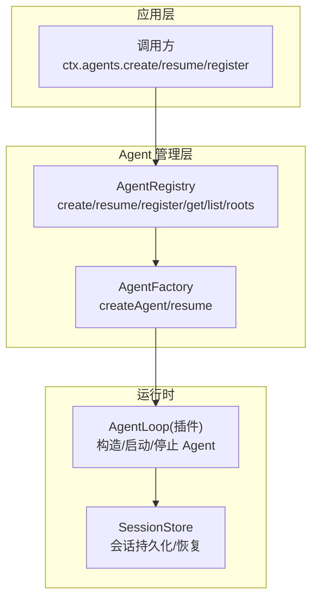
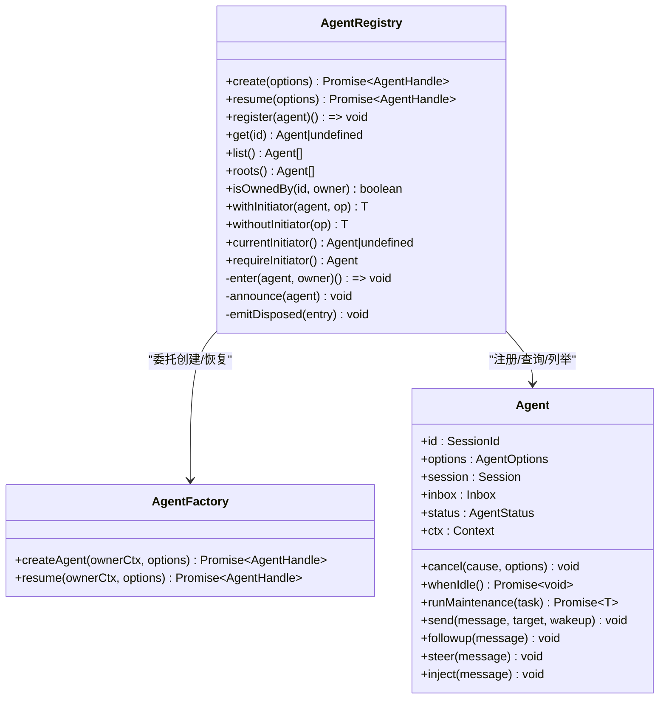
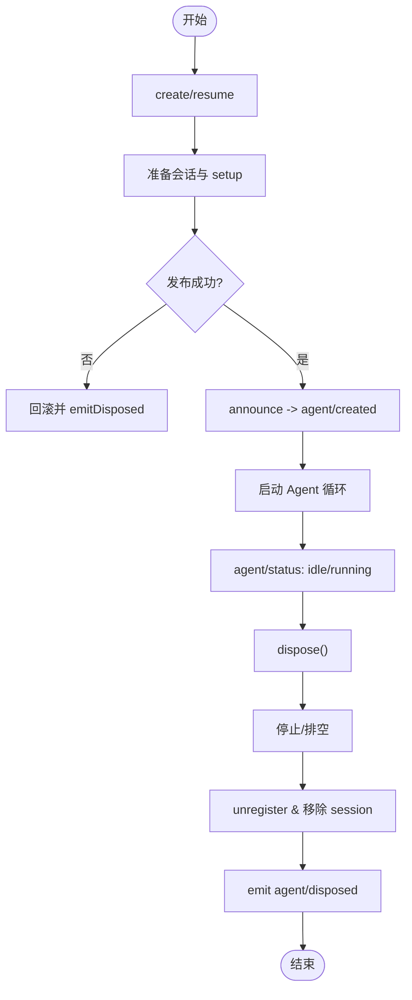
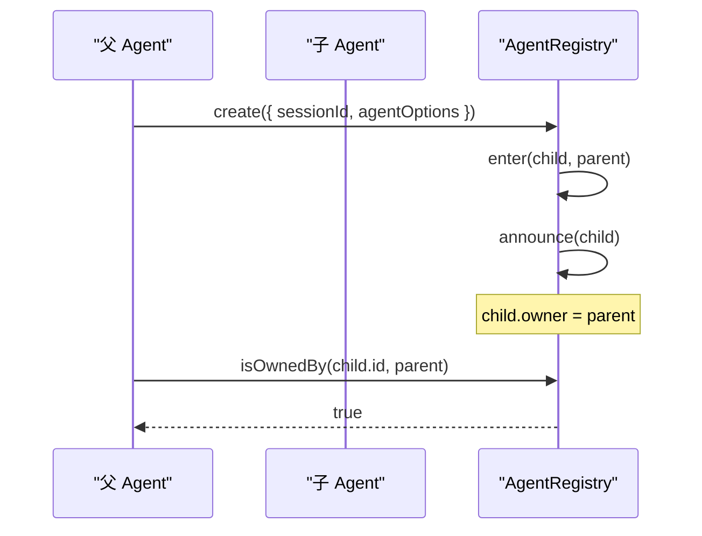
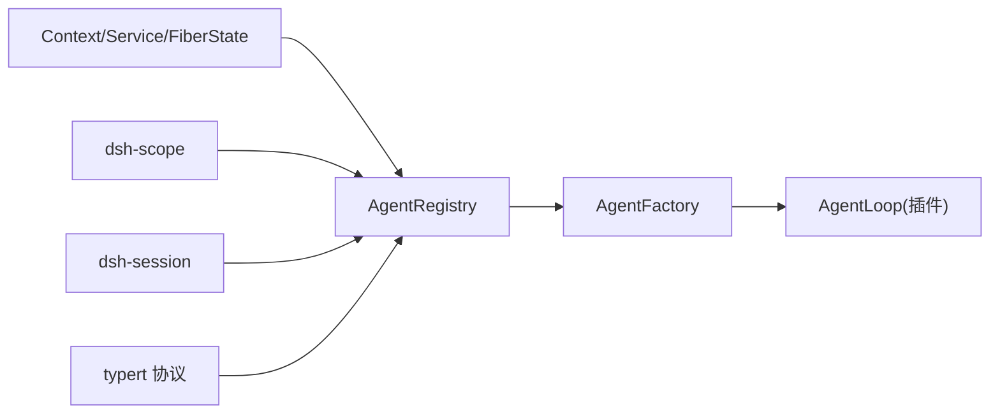

# Agent 管理系统

<cite>
**本文引用的文件**
- [packages/core/agent/src/index.ts](file://packages/core/agent/src/index.ts)
- [packages/core/agent/src/runtime-types.ts](file://packages/core/agent/src/runtime-types.ts)
- [packages/core/agent/src/types.ts](file://packages/core/agent/src/types.ts)
- [packages/core/agent/tests/agent.spec.ts](file://packages/core/agent/tests/agent.spec.ts)
- [packages/core/agent-loop/tests/scope-lifecycle.spec.ts](file://packages/core/agent-loop/tests/scope-lifecycle.spec.ts)
- [examples/headless-agent/tests/fixtures/workspace-context-resume-agent.ts](file://examples/headless-agent/tests/fixtures/workspace-context-resume-agent.ts)
- [packages/host/apiproxy/tests/api-proxy-rename.spec.ts](file://packages/host/apiproxy/tests/api-proxy-rename.spec.ts)
</cite>

## 目录
1. [简介](#简介)
2. [项目结构](#项目结构)
3. [核心组件](#核心组件)
4. [架构总览](#架构总览)
5. [详细组件分析](#详细组件分析)
6. [依赖关系分析](#依赖关系分析)
7. [性能与并发特性](#性能与并发特性)
8. [故障排查指南](#故障排查指南)
9. [结论](#结论)
10. [附录：使用示例与最佳实践](#附录使用示例与最佳实践)

## 简介
本文件系统化梳理 Agent 管理系统的核心设计与实现，重点围绕 AgentRegistry 类的设计模式、Agent 的创建/注册/生命周期管理与销毁流程，以及 ctx.agents 上下文键的使用方式。文档还覆盖关键数据模型（AgentHandle、AgentFactory、CreateAgentOptions、ResumeAgentOptions），解释 Agent 的所有权模型、父子关系与上下文传播机制，并提供可操作的代码示例路径与生命周期事件处理建议。

## 项目结构
Agent 管理系统位于 packages/core/agent 包中，对外暴露 AgentRegistry 服务，并通过 Context 扩展注入 agents 访问点。Agent 的具体驱动由 agent-loop 插件提供，通过工厂接口解耦创建与恢复逻辑。



图表来源
- [packages/core/agent/src/index.ts:256-430](file://packages/core/agent/src/index.ts#L256-L430)
- [packages/core/agent/src/runtime-types.ts:64-144](file://packages/core/agent/src/runtime-types.ts#L64-L144)

章节来源
- [packages/core/agent/src/index.ts:256-430](file://packages/core/agent/src/index.ts#L256-L430)
- [packages/core/agent/src/runtime-types.ts:64-144](file://packages/core/agent/src/runtime-types.ts#L64-L144)

## 核心组件
- AgentRegistry：Agent 的进程内注册表，负责创建委托、注册、查询、列举、根节点筛选、发布与销毁事件派发，以及“发起者”上下文传播。
- AgentFactory：由 agent-loop 插件实现的工厂，封装具体 Agent 的创建与恢复流程。
- Agent：运行时的 Agent 对象，包含 id、options、session、inbox、status、ctx 等属性，以及 cancel、whenIdle、send/followup/steer/inject 等方法。
- AgentHandle：拥有 Agent 的句柄，持有 dispose 能力，用于精确释放资源。
- CreateAgentOptions / ResumeAgentOptions：创建与恢复的参数集合，支持 meta、seed、signal、setup 等。
- AgentSetup：在 Agent 未发布前构建其作用域上下文，并可选择返回 commit 钩子以在发布边界做最终校验。

章节来源
- [packages/core/agent/src/index.ts:256-704](file://packages/core/agent/src/index.ts#L256-L704)
- [packages/core/agent/src/runtime-types.ts:24-31](file://packages/core/agent/src/runtime-types.ts#L24-L31)
- [packages/core/agent/src/runtime-types.ts:64-144](file://packages/core/agent/src/runtime-types.ts#L64-L144)
- [packages/core/agent/src/index.ts:80-156](file://packages/core/agent/src/index.ts#L80-L156)

## 架构总览
AgentRegistry 作为服务挂载到 Context 上，暴露 ctx.agents 访问点。它不直接构造 Agent，而是将 create/resume 委托给已注册的 AgentFactory。注册阶段通过 enter/announce 控制发布顺序，确保所有副作用在发布前完成；销毁阶段通过 effect 自动触发 unregister 与 disposed 事件。

```mermaid
sequenceDiagram
participant Caller as "调用方"
participant Reg as "AgentRegistry"
participant Fac as "AgentFactory"
participant Loop as "AgentLoop"
participant Store as "SessionStore"
Caller->>Reg : create(options)
Reg->>Fac : createAgent(ownerCtx, options)
Fac->>Store : 准备/加载会话
Fac->>Loop : 构造 Agent 并执行 setup
Loop-->>Fac : 返回 AgentHandle
Fac->>Reg : register(agent)
Reg->>Reg : announce(agent)
Reg-->>Caller : AgentHandle
Note over Reg,Loop : 若 setup/commit 失败或 owner 被回收，则回滚并发布 disposed
```

图表来源
- [packages/core/agent/src/index.ts:405-430](file://packages/core/agent/src/index.ts#L405-L430)
- [packages/core/agent/src/index.ts:450-576](file://packages/core/agent/src/index.ts#L450-L576)

## 详细组件分析

### AgentRegistry 设计模式与实现要点
- 职责分离：Registry 仅负责注册表与生命周期编排，具体创建/恢复由 Factory 实现，便于替换与测试。
- 事务式发布：enter 插入条目但不公开，announce 才发布并派发 agent/created；任何同步监听器抛错会回滚并配对 emitDisposed。
- 所有权与父子关系：enter 时记录 owner（创建该 Agent 的父 Agent 或 undefined 表示根）。isOwnedBy 基于运行时所有者判断，独立于持久化 lineage。
- 上下文传播：
  - ctx.agent 默认 undefined，Agent.ctx 上设置 own property 指向当前 Agent，派生上下文继承该关联。
  - withInitiator/withoutInitiator 维护 process-local 的“发起者”链路，用于日志/追踪/归属。
- 并发安全：store 是 Map，enter 对重复 id 拒绝；announce 标记 announced/announcing 防止重入；detachRequested 保证有序卸载。



图表来源
- [packages/core/agent/src/index.ts:256-704](file://packages/core/agent/src/index.ts#L256-L704)
- [packages/core/agent/src/runtime-types.ts:64-144](file://packages/core/agent/src/runtime-types.ts#L64-L144)

章节来源
- [packages/core/agent/src/index.ts:256-704](file://packages/core/agent/src/index.ts#L256-L704)

### ctx.agents 上下文键与核心方法
- create(options)：通过已注册的工厂创建新 Agent，返回拥有 dispose 能力的 AgentHandle。
- resume(options)：从持久化恢复 Agent，同样返回 AgentHandle。
- register(agent)：将已构造的 Agent 注册进注册表，并派发 agent/created；返回 effect 的 disposer，用于按序卸载。
- get(id)：根据共享 id 查找当前活着的 Agent。
- list()：返回所有活着的 Agent（注册顺序）。
- roots()：返回所有根 Agent（owner 为 undefined）。
- isOwnedBy(id, owner)：判断某 Agent 是否由指定父 Agent 在当前运行时创建。

章节来源
- [packages/core/agent/src/index.ts:405-430](file://packages/core/agent/src/index.ts#L405-L430)
- [packages/core/agent/src/index.ts:450-617](file://packages/core/agent/src/index.ts#L450-L617)
- [packages/core/agent/tests/agent.spec.ts:178-232](file://packages/core/agent/tests/agent.spec.ts#L178-L232)

### Agent 生命周期与事件
- 创建流程：
  - 调用 create/resume -> 工厂准备 session/setup -> 调用 register -> enter 插入 -> announce 派发 agent/created -> 启动循环。
  - 若 setup/commit 失败或 owner 被回收，则回滚并配对 emitDisposed。
- 状态流转：idle <-> running，通过 agent/status 事件通知。
- 销毁流程：
  - 调用 handle.dispose -> 停止/排空循环 -> 注销 Agent -> 移除 session -> 解绑作用域 -> 派发 agent/disposed。



图表来源
- [packages/core/agent/src/index.ts:405-576](file://packages/core/agent/src/index.ts#L405-L576)
- [packages/core/agent/src/runtime-types.ts:147-291](file://packages/core/agent/src/runtime-types.ts#L147-L291)

章节来源
- [packages/core/agent/src/index.ts:405-576](file://packages/core/agent/src/index.ts#L405-L576)
- [packages/core/agent/src/runtime-types.ts:147-291](file://packages/core/agent/src/runtime-types.ts#L147-L291)

### 所有权模型、父子关系与上下文传播
- 运行时所有权：enter 时记录 owner（创建该 Agent 的父 Agent 或 undefined）。isOwnedBy 基于此判断，独立于持久化 lineage。
- 根 Agent：owner 为 undefined 的 Agent 被视为根，roots() 返回这些 Agent。
- 上下文传播：
  - Agent.ctx 通过 scopeTarget 绑定 Agent，派生上下文可读取 ctx.agent。
  - withInitiator/withoutInitiator 维护 process-local 的“发起者”链路，用于跨异步边界的归属追踪。



图表来源
- [packages/core/agent/src/index.ts:474-517](file://packages/core/agent/src/index.ts#L474-L517)
- [packages/core/agent/src/index.ts:587-617](file://packages/core/agent/src/index.ts#L587-L617)

章节来源
- [packages/core/agent/src/index.ts:474-617](file://packages/core/agent/src/index.ts#L474-L617)
- [packages/core/agent-loop/tests/scope-lifecycle.spec.ts:143-169](file://packages/core/agent-loop/tests/scope-lifecycle.spec.ts#L143-L169)

### 关键数据模型
- AgentHandle：持有 agent 与 dispose 能力，用于精确释放。
- AgentFactory：定义 createAgent/resume 两个方法，供 Registry 委托。
- CreateAgentOptions：sessionId、meta、seed、agentOptions、signal、setup。
- ResumeAgentOptions：resumeSessionId、agentOptions、signal、setup。
- AgentOptions：provider、model、maxTokens。
- Agent：公共运行时对象，包含 id、options、session、inbox、status、ctx 及一系列操作方法。

章节来源
- [packages/core/agent/src/index.ts:172-214](file://packages/core/agent/src/index.ts#L172-L214)
- [packages/core/agent/src/index.ts:80-156](file://packages/core/agent/src/index.ts#L80-L156)
- [packages/core/agent/src/runtime-types.ts:24-31](file://packages/core/agent/src/runtime-types.ts#L24-L31)
- [packages/core/agent/src/runtime-types.ts:64-144](file://packages/core/agent/src/runtime-types.ts#L64-L144)

## 依赖关系分析
- AgentRegistry 依赖 Cordis 的 Context、Service、FiberState、getTraceable 等基础设施。
- 通过 setFactory 注入 AgentFactory，从而与具体的 agent-loop 实现解耦。
- 通过 dsh-scope 的 scopeTarget 绑定 Agent 到其 ctx，实现作用域隔离与事件过滤。
- 通过 dsh-session 的 SessionId、Session 等类型进行身份与会话管理。



图表来源
- [packages/core/agent/src/index.ts:8-18](file://packages/core/agent/src/index.ts#L8-L18)
- [packages/core/agent/src/index.ts:266-298](file://packages/core/agent/src/index.ts#L266-L298)
- [packages/core/agent/src/index.ts:372-394](file://packages/core/agent/src/index.ts#L372-L394)

章节来源
- [packages/core/agent/src/index.ts:8-18](file://packages/core/agent/src/index.ts#L8-L18)
- [packages/core/agent/src/index.ts:266-394](file://packages/core/agent/src/index.ts#L266-L394)

## 性能与并发特性
- 注册表使用 Map 存储，O(1) 查找与插入。
- announce 使用布尔位标记防止重入与重复发布，降低竞争条件风险。
- 通过 AsyncLocalStorage 维护 initiator 边界，避免全局状态污染。
- 在卸载阶段通过 drain 机制等待异步边界完成，确保资源正确释放。

[本节为通用指导，无需特定文件引用]

## 故障排查指南
- “no agent factory registered”：在调用 create/resume 之前必须通过 setFactory 注册工厂。
- “agent already registered”：重复注册同一 id 的 Agent 会被拒绝。
- “agent not live in this registry”：announce 前需先 enter，且必须是同一 entry。
- “already announced”：重复 announce 同一 Agent 会被拒绝。
- 创建被 veto：如果 agent/created 监听器抛出错误，会回滚并配对 emitDisposed。
- 上下文问题：确保通过 Agent.ctx 访问 agent-scoped 上下文，或使用 withInitiator/withoutInitiator 明确归属。

章节来源
- [packages/core/agent/src/index.ts:390-430](file://packages/core/agent/src/index.ts#L390-L430)
- [packages/core/agent/src/index.ts:474-576](file://packages/core/agent/src/index.ts#L474-L576)
- [packages/core/agent/tests/agent.spec.ts:178-232](file://packages/core/agent/tests/agent.spec.ts#L178-L232)

## 结论
AgentRegistry 提供了健壮、可扩展的 Agent 管理能力，通过工厂解耦、事务式发布、严格的所有权与上下文传播机制，确保了 Agent 的生命周期一致性与可观测性。结合 AgentHandle 的精确释放与丰富的生命周期事件，开发者可以可靠地构建复杂的多 Agent 系统。

[本节为总结，无需特定文件引用]

## 附录：使用示例与最佳实践

### 基本用法：创建与销毁
- 通过 ctx.agents.create 创建新 Agent，并使用返回的 handle.dispose 进行释放。
- 参考示例路径：
  - [packages/host/apiproxy/tests/api-proxy-rename.spec.ts:30-54](file://packages/host/apiproxy/tests/api-proxy-rename.spec.ts#L30-L54)

### 恢复持久化 Agent
- 通过 ctx.agents.resume 恢复已持久化的会话，并在 effect 中绑定 dispose。
- 参考示例路径：
  - [examples/headless-agent/tests/fixtures/workspace-context-resume-agent.ts:19-25](file://examples/headless-agent/tests/fixtures/workspace-context-resume-agent.ts#L19-L25)

### 注册已有 Agent 与事件监听
- 使用 ctx.agents.register 注册已构造的 Agent，并监听 agent/created 与 agent/disposed。
- 参考示例路径：
  - [packages/core/agent/tests/agent.spec.ts:178-232](file://packages/core/agent/tests/agent.spec.ts#L178-L232)

### 父子关系与根节点
- 通过 root.agent.ctx.agents.create 创建子 Agent，验证 roots() 与 isOwnedBy。
- 参考示例路径：
  - [packages/core/agent-loop/tests/scope-lifecycle.spec.ts:143-169](file://packages/core/agent-loop/tests/scope-lifecycle.spec.ts#L143-L169)

### 上下文传播与归属
- 使用 withInitiator/withoutInitiator 控制异步链路的归属。
- 通过 ctx.agent 读取当前作用域的 Agent（Agent.ctx 上设置 own property）。
- 参考示例路径：
  - [packages/core/agent/src/index.ts:300-358](file://packages/core/agent/src/index.ts#L300-L358)
  - [packages/core/agent/src/index.ts:282-288](file://packages/core/agent/src/index.ts#L282-L288)

### 最佳实践
- 始终通过 AgentHandle.dispose 释放资源，避免泄漏。
- 在 setup 中仅做配置与注册，不要驱动 Agent；驱动应在 create/resume 完成后进行。
- 使用 agent/created 与 agent/disposed 进行资源清理与审计。
- 使用 isOwnedBy 与 roots 进行拓扑检查与治理。
- 在跨边界调用中使用 withInitiator/withoutInitiator 明确归属，避免误判。

[本节为实践指导，无需特定文件引用]