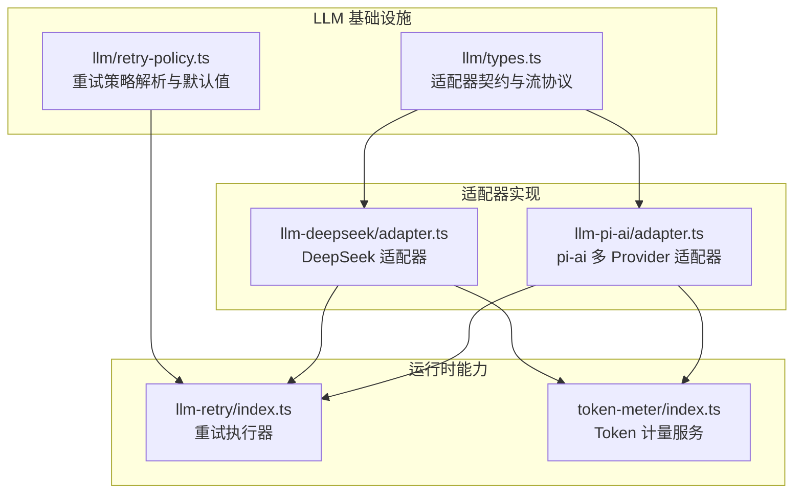
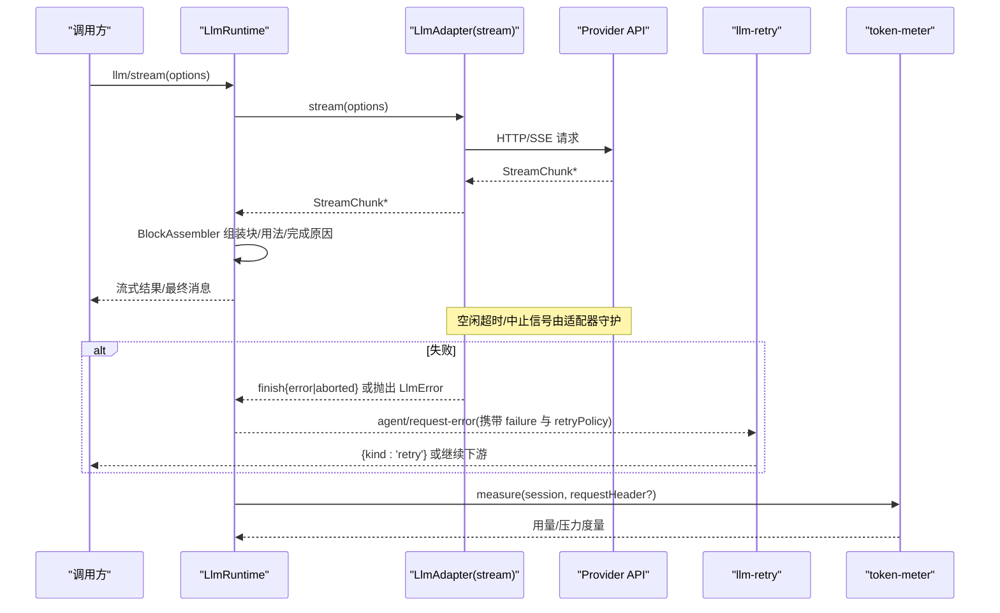
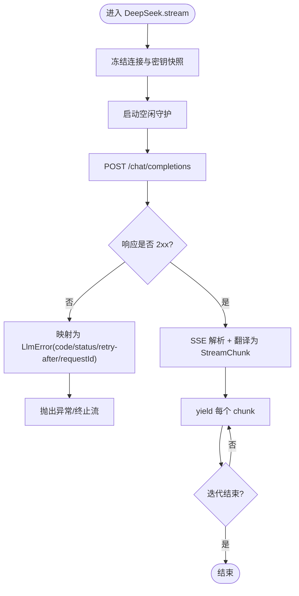
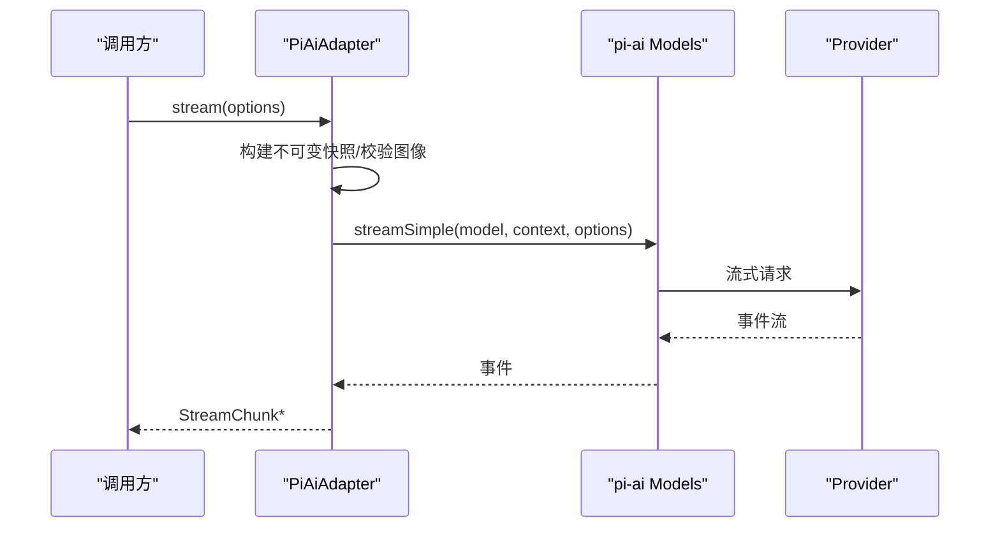
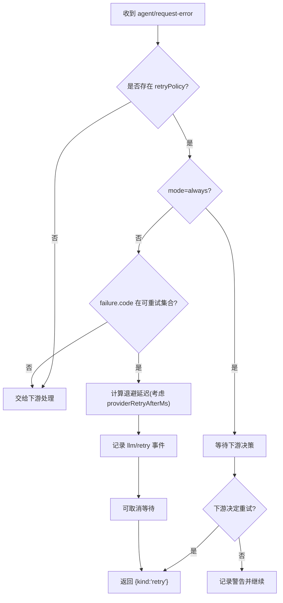
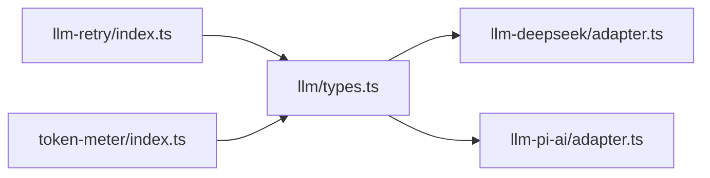

# LLM 集成

<cite>
**本文引用的文件**
- [llm-streaming.md](file://docs/subsystems/llm-streaming.md)
- [providers.md](file://docs/user/guide/providers.md)
- [types.ts](file://packages/llm/llm/src/types.ts)
- [adapter.ts (DeepSeek)](file://packages/llm/llm-deepseek/src/adapter.ts)
- [adapter.ts (pi-ai)](file://packages/llm/llm-pi-ai/src/adapter.ts)
- [retry-policy.ts](file://packages/llm/llm/src/retry-policy.ts)
- [index.ts (llm-retry)](file://packages/llm/llm-retry/src/index.ts)
- [index.ts (token-meter)](file://packages/llm/token-meter/src/index.ts)
</cite>

## 目录
1. [简介](#简介)
2. [项目结构](#项目结构)
3. [核心组件](#核心组件)
4. [架构总览](#架构总览)
5. [详细组件分析](#详细组件分析)
6. [依赖关系分析](#依赖关系分析)
7. [性能考量](#性能考量)
8. [故障排查指南](#故障排查指南)
9. [结论](#结论)
10. [附录](#附录)

## 简介
本技术文档面向需要在系统中接入多种大语言模型（LLM）的开发者与运维人员，系统性说明 LLM 适配器架构、Provider 接口规范、支持的模型提供商、配置选项与连接管理；流式响应处理机制（消息流、错误处理、重试策略）；模型选择算法、负载均衡与故障转移；上下文管理与 Token 计数、成本优化策略。并提供具体代码示例路径，展示如何配置不同 LLM Provider、处理流式响应以及优化模型调用性能。

## 项目结构
LLM 相关能力主要分布在以下包中：
- packages/llm/llm：定义统一的 LLM 类型、适配器契约、流协议、重试策略等基础设施
- packages/llm/llm-deepseek：DeepSeek 适配器的实现（OpenAI 兼容 chat-completions + SSE）
- packages/llm/llm-pi-ai：通用 pi-ai 多 Provider 适配器（支持多后端统一接入）
- packages/llm/llm-retry：基于 Provider 的重试策略执行器（在 Agent 请求错误扩展点落地）
- packages/llm/token-meter：Token 计量服务（会话级压力与用量度量、估算与投影）

图表来源
- [types.ts:283-357](file://packages/llm/llm/src/types.ts#L283-L357)
- [adapter.ts (DeepSeek):151-347](file://packages/llm/llm-deepseek/src/adapter.ts#L151-L347)
- [adapter.ts (pi-ai):181-359](file://packages/llm/llm-pi-ai/src/adapter.ts#L181-L359)
- [retry-policy.ts:14-192](file://packages/llm/llm/src/retry-policy.ts#L14-L192)
- [index.ts (llm-retry):99-227](file://packages/llm/llm-retry/src/index.ts#L99-L227)
- [index.ts (token-meter):74-314](file://packages/llm/token-meter/src/index.ts#L74-L314)

章节来源
- [llm-streaming.md:1-800](file://docs/subsystems/llm-streaming.md#L1-L800)
- [providers.md:1-99](file://docs/user/guide/providers.md#L1-L99)

## 核心组件
- 适配器契约与流协议
  - GenerateOptions：一次完整的模型请求（provider、model、messages、system、tools、temperature、maxTokens、stop、signal、sessionId、purpose）
  - StreamChunk：原始流协议（block-start/text-delta/reasoning-delta/tool-call-delta/block-end/usage/finish），用于跨适配器统一消费
  - LlmAdapter：抽象适配器基类，要求实现 stream()，并可选提供 providerInfo/providerRetryPolicy/listModels/resolveModel
- 重试策略
  - ResolvedRetryPolicy：包含 normal（有限重试+可重试码）与 always（无限重试）两种模式，含退避参数 initialDelayMs/maxDelayMs/jitterRatio
- Token 计量
  - TokenMeter：会话级 Token 用量测量、估算与投影，结合 BlockAssembler 从流片段重建内容以精确统计输出 Token

章节来源
- [types.ts:127-357](file://packages/llm/llm/src/types.ts#L127-L357)
- [retry-policy.ts:14-192](file://packages/llm/llm/src/retry-policy.ts#L14-L192)
- [index.ts (token-meter):74-314](file://packages/llm/token-meter/src/index.ts#L74-L314)

## 架构总览
下图展示了从上层调用到适配器、再到 Provider 的端到端流程，包括流式数据组装、错误归一化与重试策略执行。

图表来源
- [types.ts:283-357](file://packages/llm/llm/src/types.ts#L283-L357)
- [adapter.ts (DeepSeek):214-347](file://packages/llm/llm-deepseek/src/adapter.ts#L214-L347)
- [adapter.ts (pi-ai):276-359](file://packages/llm/llm-pi-ai/src/adapter.ts#L276-L359)
- [index.ts (llm-retry):156-227](file://packages/llm/llm-retry/src/index.ts#L156-L227)
- [index.ts (token-meter):116-147](file://packages/llm/token-meter/src/index.ts#L116-L147)

## 详细组件分析

### 适配器契约与流协议
- 适配器必须遵循：
  - usage 必须在 finish 之前发出，finish 之后不得再发 usage
  - tool-call 的 arguments 始终为原始 JSON 字符串
  - 错误路径二选一：stream() 抛错（传输/协议错误）或在流末尾 finish{error|aborted, failure}
  - 一次适配器调用对应一次 Provider 尝试；库层禁用重试，交由 Agent 层恢复
  - 空闲超时：远程适配器暴露正有限 streamIdleTimeoutMs（默认五分钟），仅当 next() 挂起时计时
  - 上下文溢出：统一使用 CONTEXT_WINDOW_EXCEEDED 编码
  - 空完成视为可重试错误（EMPTY_RESPONSE）
  - 所有 HTTP 请求必须携带应用归属头 attributionHeaders()

- 流协议 StreamChunk：
  - block-start/text-delta/reasoning-delta/tool-call-delta/block-end/usage/finish
  - index 关联交错块，block-end 携带完整 ContentBlock，避免消费者重复拼装

章节来源
- [llm-streaming.md:154-216](file://docs/subsystems/llm-streaming.md#L154-L216)
- [types.ts:283-357](file://packages/llm/llm/src/types.ts#L283-L357)

### DeepSeek 适配器
- 功能要点
  - 通过 OpenAI 兼容 /chat/completions 发起 SSE 请求
  - 每请求冻结连接事实与密钥，保证一致性
  - 空闲守护：idleWatchdog 控制读取超时，映射为 TIMEOUT
  - 错误映射：HTTP 状态与 Provider 错误体映射为稳定 LlmError code（AUTH/RATE_LIMIT/CONTEXT_WINDOW_EXCEEDED/INVALID_REQUEST/SERVER/TRANSPORT/EMPTY_RESPONSE）
  - 推理努力：根据配置暴露 off/high/max 三档

- 关键流程
  - stream() 内创建 AbortController，合并上游 signal，使用 idleWatchdog 包装迭代器
  - request() 构造请求头（含 attributionHeaders、session/purpose 标记），fetch 后解析非 2xx 错误并抛出 LlmError
  - 成功则通过 parseSse -> translate 产出 StreamChunk

图表来源
- [adapter.ts (DeepSeek):214-347](file://packages/llm/llm-deepseek/src/adapter.ts#L214-L347)

章节来源
- [adapter.ts (DeepSeek):151-347](file://packages/llm/llm-deepseek/src/adapter.ts#L151-L347)

### pi-ai 多 Provider 适配器
- 功能要点
  - 基于 @earendil-works/pi-ai 的多 Provider 封装，支持 Anthropic/OpenAI/Azure/Bedrock/Vertex/Codex 等
  - 每次操作构建不可变快照（profiles + Models），避免并发下配置变更影响进行中请求
  - 支持图像输入校验与附件服务注入
  - 推理级别：按模型能力暴露 supported thinking levels，并在 resolveModel 中声明默认值
  - 请求头合并：保留部署自定义头，但覆盖冲突的应用归属头

- 关键流程
  - stream() 捕获快照、解析 reasoning level、获取 apiKey、建立空闲守护
  - 若消息含图像且模型不支持 image，直接拒绝
  - 通过 models.streamSimple 发起流式事件，转换为 StreamChunk

图表来源
- [adapter.ts (pi-ai):276-359](file://packages/llm/llm-pi-ai/src/adapter.ts#L276-L359)

章节来源
- [adapter.ts (pi-ai):181-359](file://packages/llm/llm-pi-ai/src/adapter.ts#L181-L359)

### 重试策略与故障转移
- 策略类型
  - normal：有限次重试，仅对指定可重试码生效（默认包含 EMPTY_RESPONSE/RATE_LIMIT/SERVER/TIMEOUT/TRANSPORT）
  - always：无限重试直到成功、取消或插件生命周期结束
- 退避算法
  - 指数退避 + 对称抖动，上限受 maxDelayMs 限制
  - 尊重 Provider 返回的 retry-after（若有效且不超限）
- 执行点
  - 监听 agent/request-error，依据 provider 注册的 ResolvedRetryPolicy 决策是否重试
  - 记录 llm/retry 与 llm/retry-started 事件，便于追踪

图表来源
- [retry-policy.ts:14-192](file://packages/llm/llm/src/retry-policy.ts#L14-L192)
- [index.ts (llm-retry):99-227](file://packages/llm/llm-retry/src/index.ts#L99-L227)

章节来源
- [retry-policy.ts:14-192](file://packages/llm/llm/src/retry-policy.ts#L14-L192)
- [index.ts (llm-retry):99-227](file://packages/llm/llm-retry/src/index.ts#L99-L227)

### 模型选择、负载均衡与故障转移
- 模型选择
  - 通过 LlmAdapter.resolveModel(provider, model) 获取 exact-route 元信息（contextWindow、defaultMaxTokens、reasoning efforts）
  - 列表能力由 listModels 提供（建议性，不强制白名单）
- 负载均衡
  - 当前仓库未内置跨 Provider 的自动负载均衡；可通过上层路由策略（如按业务/租户选择 provider）实现
- 故障转移
  - 借助重试策略与 Provider 错误码分类，可在同一 Provider 内重试
  - 跨 Provider 故障转移需在上层编排（例如捕获特定错误码后切换 provider 重新发起）

章节来源
- [types.ts:232-281](file://packages/llm/llm/src/types.ts#L232-L281)
- [adapter.ts (DeepSeek):171-212](file://packages/llm/llm-deepseek/src/adapter.ts#L171-L212)
- [adapter.ts (pi-ai):238-274](file://packages/llm/llm-pi-ai/src/adapter.ts#L238-L274)

### 上下文管理与 Token 计数、成本优化
- 上下文容量
  - 通过 resolveModel 返回 contextWindow，供上层进行上下文压缩/截断策略
- Token 计量
  - TokenUsage 字段互斥：inputTokens、cacheReadTokens、cacheWriteTokens、outputTokens、reasoningTokens（不计入总量重复）
  - TokenMeter.measure 结合会话事件与 BlockAssembler，精确统计 baseline/surfaceDeltaTokens/totalTokens
- 成本优化建议
  - 合理设置 maxTokens 与 stop，避免过长生成
  - 利用缓存命中（cacheReadTokens）降低输入成本
  - 对长对话启用 compaction（purpose='compaction'）减少上下文体积
  - 根据模型能力选择合适 reasoningEffort，平衡质量与成本

章节来源
- [types.ts:127-141](file://packages/llm/llm/src/types.ts#L127-L141)
- [index.ts (token-meter):44-49](file://packages/llm/token-meter/src/index.ts#L44-L49)
- [index.ts (token-meter):116-147](file://packages/llm/token-meter/src/index.ts#L116-L147)

## 依赖关系分析
- 适配器依赖
  - DeepSeek 适配器依赖 dsh-timeout（空闲守护）、dsh-llm（类型与工具）、序列化与 SSE 解析
  - pi-ai 适配器依赖 pi-ai SDK、dsh-timeout、dsh-attachment（图像附件）
- 运行时依赖
  - llm-retry 依赖 Cordis 事件与 Agent 扩展点
  - token-meter 依赖 session 事件与 BlockAssembler

图表来源
- [types.ts:283-357](file://packages/llm/llm/src/types.ts#L283-L357)
- [adapter.ts (DeepSeek):1-347](file://packages/llm/llm-deepseek/src/adapter.ts#L1-L347)
- [adapter.ts (pi-ai):1-359](file://packages/llm/llm-pi-ai/src/adapter.ts#L1-L359)
- [index.ts (llm-retry):99-227](file://packages/llm/llm-retry/src/index.ts#L99-L227)
- [index.ts (token-meter):74-314](file://packages/llm/token-meter/src/index.ts#L74-L314)

章节来源
- [adapter.ts (DeepSeek):1-347](file://packages/llm/llm-deepseek/src/adapter.ts#L1-L347)
- [adapter.ts (pi-ai):1-359](file://packages/llm/llm-pi-ai/src/adapter.ts#L1-L359)
- [index.ts (llm-retry):99-227](file://packages/llm/llm-retry/src/index.ts#L99-L227)
- [index.ts (token-meter):74-314](file://packages/llm/token-meter/src/index.ts#L74-L314)

## 性能考量
- 流式处理
  - 使用 BlockAssembler 增量组装，避免全量缓冲
  - 空闲守护防止长时间无进展导致资源占用
- 重试与退避
  - 指数退避 + 抖动降低雪崩风险
  - 尊重 Provider 的 retry-after，避免过快重试
- Token 与上下文
  - 合理使用 maxTokens 与 stop 序列
  - 利用缓存命中与 compaction 降低输入成本
- 并发与隔离
  - 每次流调用冻结配置快照，避免并发下的配置漂移

[本节为通用指导，无需特定文件引用]

## 故障排查指南
- 常见问题与定位
  - 缺少凭据：MISSING_CREDENTIAL（检查 Provider 页面或环境变量）
  - 未知模型：UNKNOWN_MODEL（选择已配置模型或添加至自定义 Provider）
  - 模型发现 401：检查 API Key；某些端点不提供 /models 时需手动填写
  - 图片被拒：模型未声明 image 模态；需在 settings.yaml 中添加 input: [text, image]
  - 流空闲超时：TIMEOUT（检查网络与 Provider 响应）
  - 上下文溢出：CONTEXT_WINDOW_EXCEEDED（压缩上下文或缩短消息）
  - 配额不足：QUOTA_EXCEEDED（联系 Provider 或调整用量）
- 日志与追踪
  - 使用 llm/retry 与 llm/retry-started 事件观察重试过程
  - 通过 TokenMeter.measure 获取 baseline/surfaceDeltaTokens/totalTokens 辅助定位高开销步骤

章节来源
- [providers.md:88-99](file://docs/user/guide/providers.md#L88-L99)
- [index.ts (llm-retry):156-227](file://packages/llm/llm-retry/src/index.ts#L156-L227)
- [index.ts (token-meter):116-147](file://packages/llm/token-meter/src/index.ts#L116-L147)

## 结论
本集成通过统一的适配器契约与流协议，屏蔽了不同 Provider 的差异，提供了健壮的错误归一化、重试策略与 Token 计量能力。DeepSeek 与 pi-ai 适配器分别覆盖了直连与多后端场景。结合上下文容量与 Token 计量，可实现稳定的成本与性能优化。上层可按需实现负载均衡与跨 Provider 故障转移，以满足更高可用需求。

[本节为总结，无需特定文件引用]

## 附录

### 支持的模型提供商与配置方式
- DeepSeek：通过 Settings → Models 配置 API Key，保存至凭据存储
- 目录型 Provider（Anthropic/OpenAI 等）：Add provider，填入 API Key，使用内置目录
- 自定义 Provider：Add a custom provider，填写 Provider ID、base URL、API 协议、凭据与至少一个模型
- 图像输入：为自定义 Provider 的模型添加 input: [text, image]，或在路由级设置 defaultInput

章节来源
- [providers.md:7-81](file://docs/user/guide/providers.md#L7-L81)

### 流式响应处理示例（概念流程）
- 调用 ctx.llm.stream(options)
- 接收 StreamChunk，使用 BlockAssembler 累积 blocks、usage、finish
- 处理 finish.reason 分支（stop/tool-calls/max-tokens/error/aborted）
- 在 error/aborted 时，结合 retryPolicy 决定是否重试

章节来源
- [llm-streaming.md:154-216](file://docs/subsystems/llm-streaming.md#L154-L216)
- [types.ts:283-357](file://packages/llm/llm/src/types.ts#L283-L357)

### 配置不同 LLM Provider 的代码示例路径
- DeepSeek 适配器初始化与流式调用
  - [adapter.ts (DeepSeek):214-347](file://packages/llm/llm-deepseek/src/adapter.ts#L214-L347)
- pi-ai 多 Provider 适配器初始化与流式调用
  - [adapter.ts (pi-ai):276-359](file://packages/llm/llm-pi-ai/src/adapter.ts#L276-L359)
- 重试策略配置与执行
  - [retry-policy.ts:14-192](file://packages/llm/llm/src/retry-policy.ts#L14-L192)
  - [index.ts (llm-retry):99-227](file://packages/llm/llm-retry/src/index.ts#L99-L227)
- Token 计量与成本优化
  - [index.ts (token-meter):74-314](file://packages/llm/token-meter/src/index.ts#L74-L314)