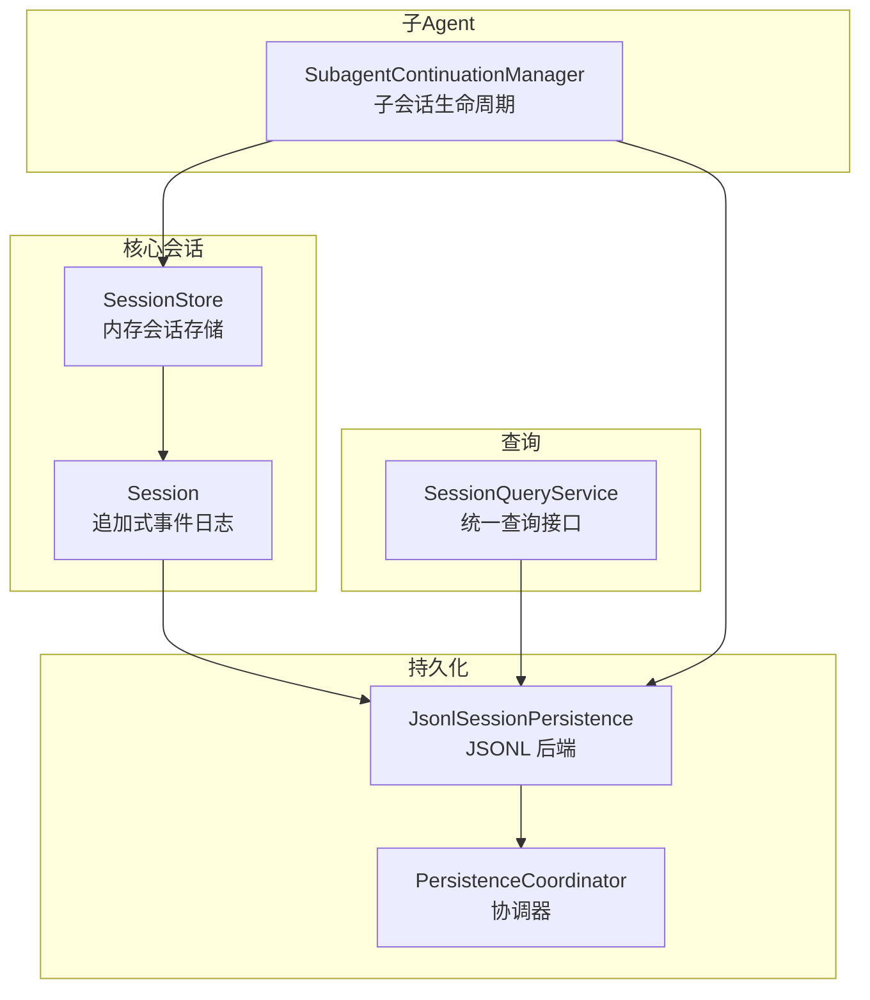
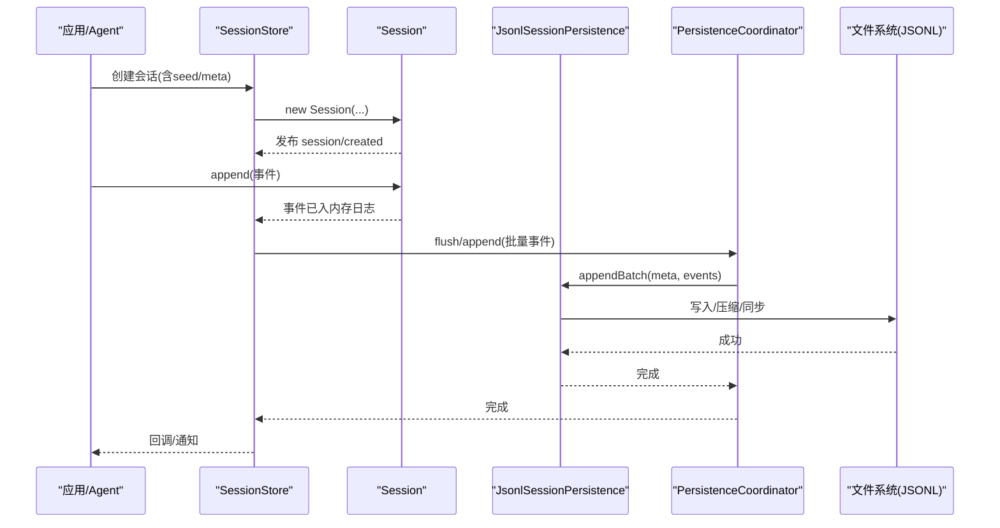
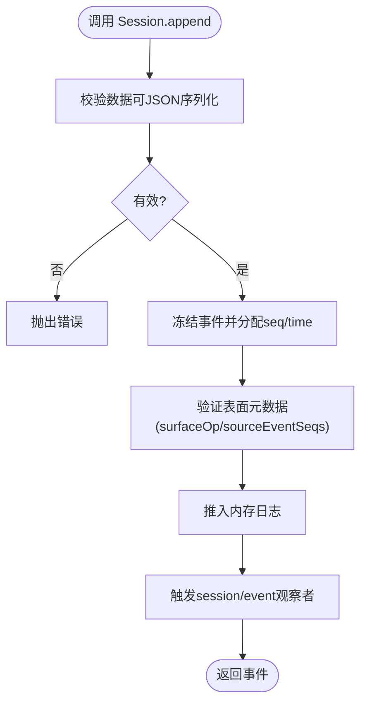
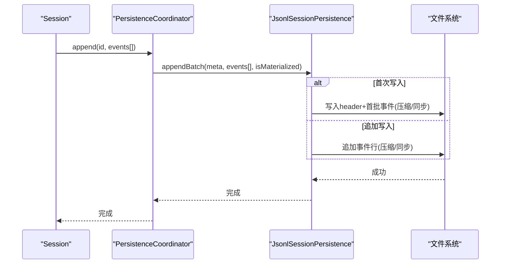
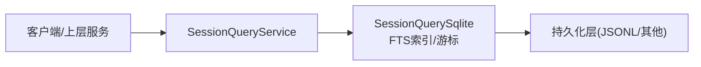
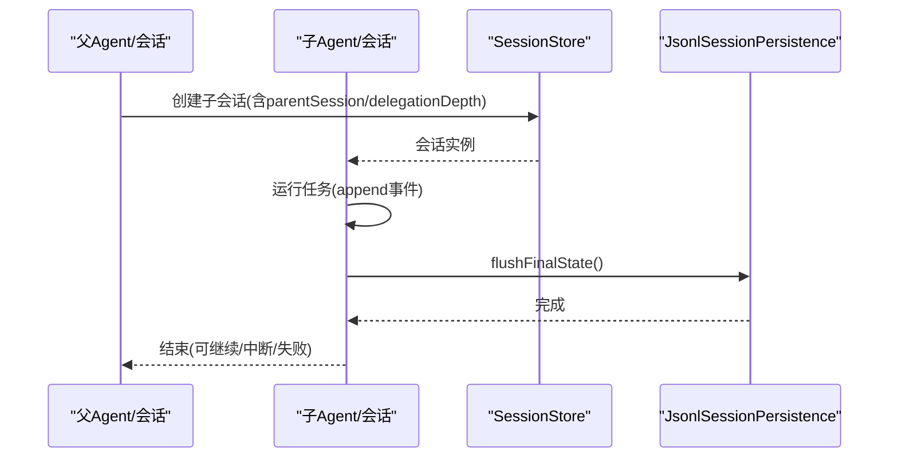
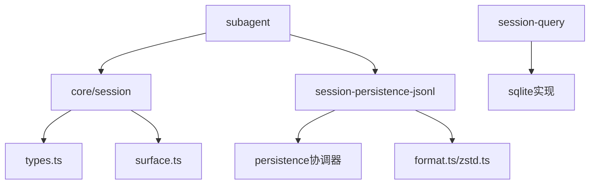

# 会话管理系统

<cite>
**本文引用的文件**
- [packages/core/session/src/index.ts](file://packages/core/session/src/index.ts)
- [packages/core/session/src/types.ts](file://packages/core/session/src/types.ts)
- [packages/session/session-persistence-jsonl/src/index.ts](file://packages/session/session-persistence-jsonl/src/index.ts)
- [packages/session/session-persistence-jsonl/tests/jsonl.spec.ts](file://packages/session/session-persistence-jsonl/tests/jsonl.spec.ts)
- [packages/host/apiproxy/src/api/sessions.ts](file://packages/host/apiproxy/src/api/sessions.ts)
- [packages/host/apiproxy/src/api/sessions.schema.ts](file://packages/host/apiproxy/src/api/sessions.schema.ts)
- [packages/subagent/subagent/src/continuation.ts](file://packages/subagent/subagent/src/continuation.ts)
- [packages/subagent/subagent/tests/list-children.spec.ts](file://packages/subagent/subagent/tests/list-children.spec.ts)
- [docs/subsystems/session-query.md](file://docs/subsystems/session-query.md)
</cite>

## 目录
1. [简介](#简介)
2. [项目结构](#项目结构)
3. [核心组件](#核心组件)
4. [架构总览](#架构总览)
5. [详细组件分析](#详细组件分析)
6. [依赖分析](#依赖分析)
7. [性能考虑](#性能考虑)
8. [故障排查指南](#故障排查指南)
9. [结论](#结论)
10. [附录：使用示例与最佳实践](#附录使用示例与最佳实践)

## 简介
本文件系统性地文档化会话管理子系统，覆盖会话的创建、持久化、查询与恢复机制；解释 SessionId、SessionEvent、SessionMetadata（即 SessionHeader）等核心数据模型的设计与用途；说明 JSONL 事件日志与状态快照的持久化策略；给出会话查询 API 的使用方法与性能优化建议；并阐述会话与 Agent 的关系以及在子 Agent 场景下的继承与隔离机制。文末提供可操作的代码路径指引，帮助读者快速上手创建、保存、查询与恢复会话。

## 项目结构
会话系统由“核心会话”、“JSONL 持久化后端”、“查询服务”以及“子 Agent 协作”四部分组成：
- 核心会话：以事件溯源方式维护追加式事件日志，提供内存中的会话对象、表面投影与消息推导能力。
- JSONL 持久化：将会话头与事件序列写入单文件 JSONL（可选 Zstandard 压缩），支持批量写入、崩溃修复与只读扫描。
- 查询服务：统一抽象的会话查询接口，提供列表、标题、事件读取、过滤与全文检索等能力。
- 子 Agent：通过会话头元数据（parentSession、origin、delegationDepth 等）实现继承与隔离，并在子 Agent 结束时进行最终刷新。



图表来源
- [packages/core/session/src/index.ts:425-758](file://packages/core/session/src/index.ts#L425-L758)
- [packages/session/session-persistence-jsonl/src/index.ts:121-200](file://packages/session/session-persistence-jsonl/src/index.ts#L121-L200)
- [docs/subsystems/session-query.md:492-496](file://docs/subsystems/session-query.md#L492-L496)

章节来源
- [packages/core/session/src/index.ts:425-758](file://packages/core/session/src/index.ts#L425-L758)
- [packages/session/session-persistence-jsonl/src/index.ts:121-200](file://packages/session/session-persistence-jsonl/src/index.ts#L121-L200)
- [docs/subsystems/session-query.md:492-496](file://docs/subsystems/session-query.md#L492-L496)

## 核心组件
- SessionId：带品牌化的会话标识类型，用于唯一标识一个会话及其持久化产物。
- SessionHeader（会话元数据）：不可变的存储元数据，包含版本、创建时间、工作目录、父会话、种子长度、子 Agent 来源、委派深度、Agent 预设等字段。
- SessionEvent（会话事件）：追加式事件记录，包含类型、序列号、时间戳、数据载荷，以及对消息类事件的“表面操作”和“源事件引用”。
- Session：事件溯源会话对象，维护有序事件日志、表面投影、请求头折叠、上下文折叠与派生消息历史。
- SessionStore：内存会话存储与服务入口，负责会话的创建、发布、监听与销毁。
- JsonlSessionPersistence：JSONL 持久化后端，负责会话头与事件批次的落盘、压缩、恢复与列表扫描。
- PersistenceCoordinator：协调器，封装 prepare/load/inspect/readFrom 等重读流程，处理断尾修复与缓存。
- SubagentContinuationManager：子 Agent 生命周期管理，确保子会话在退出时进行最终刷新，并依赖持久化服务。

章节来源
- [packages/core/session/src/types.ts:21-99](file://packages/core/session/src/types.ts#L21-L99)
- [packages/core/session/src/types.ts:231-437](file://packages/core/session/src/types.ts#L231-L437)
- [packages/core/session/src/index.ts:425-758](file://packages/core/session/src/index.ts#L425-L758)
- [packages/session/session-persistence-jsonl/src/index.ts:121-200](file://packages/session/session-persistence-jsonl/src/index.ts#L121-L200)
- [packages/subagent/subagent/src/continuation.ts:1451-1483](file://packages/subagent/subagent/src/continuation.ts#L1451-L1483)

## 架构总览
会话系统采用“事件溯源 + 插件化持久化 + 统一查询”的架构：
- 所有变更以不可变事件追加到 Session 的事件日志中，保证可回放、可分叉、可审计。
- 持久化通过插件实现，JSONL 是默认后端，支持压缩、批量写入、断尾修复与只读扫描。
- 查询服务提供统一的会话访问面，屏蔽底层存储差异，支持精确查找、过滤与全文检索。
- 子 Agent 通过会话头元数据建立父子关系，并在退出时触发最终刷新，确保状态一致性。



图表来源
- [packages/core/session/src/index.ts:425-758](file://packages/core/session/src/index.ts#L425-L758)
- [packages/session/session-persistence-jsonl/src/index.ts:421-444](file://packages/session/session-persistence-jsonl/src/index.ts#L421-L444)

## 详细组件分析

### 数据模型设计
- SessionId：字符串品牌化类型，编译期约束，无运行时开销。
- SessionHeader：不可变元数据，版本控制、创建时间、工作目录、父子关系、种子边界、子 Agent 标记、委派深度、Agent 预设等。
- SessionEvent：追加式事件，包含 type、seq、time、data 及可选 ignorable；对消息类事件强制 surfaceOp 与 sourceEventSeqs，确保有序表面与可追溯性。
- SurfaceOp：'append' 或 'replace(start,end)'，控制消息类事件如何进入有序表面。
- EpochHeader / RequestContext：请求级头部与路由元数据的折叠视图，便于重建下一次请求上下文。

```mermaid
classDiagram
class SessionId {
+string value
}
class SessionHeader {
+number version
+SessionId id
+number createdAt
+string cwd?
+SessionId parentSession?
+number seedLength?
+string origin?
+number delegationDepth?
+string agentPreset?
}
class SessionEvent {
+string type
+number seq
+number time
+object data
+boolean ignorable?
+number[] sourceEventSeqs?
+SurfaceOp surfaceOp?
}
class SurfaceOp {
<<union>>
"append"
"replace(start,end)"
}
class EpochHeader {
+object config
+object adapterDefaults?
+string system?
+ToolSchema[] tools?
}
class RequestContext {
+string provider
+string model
+number contextWindow?
}
SessionEvent --> SurfaceOp : "消息类事件"
SessionHeader --> SessionId : "包含"
```

图表来源
- [packages/core/session/src/types.ts:21-99](file://packages/core/session/src/types.ts#L21-L99)
- [packages/core/session/src/types.ts:231-437](file://packages/core/session/src/types.ts#L231-L437)

章节来源
- [packages/core/session/src/types.ts:21-99](file://packages/core/session/src/types.ts#L21-L99)
- [packages/core/session/src/types.ts:231-437](file://packages/core/session/src/types.ts#L231-L437)

### 会话创建、追加与消息推导
- 创建：通过 SessionStore.create 或 Session.create/fromRestore 构造，支持传入 seed（回放/分叉）与 meta（存储元数据）。
- 追加：Session.append 校验数据可 JSON 序列化、验证表面元数据、冻结事件并推入日志，随后触发观察者。
- 消息推导：基于有序表面节点，按 deriveEventMessage 规则生成 LLM 消息历史，具备缓存与替换生成计数。



图表来源
- [packages/core/session/src/index.ts:604-655](file://packages/core/session/src/index.ts#L604-L655)

章节来源
- [packages/core/session/src/index.ts:425-758](file://packages/core/session/src/index.ts#L425-L758)

### 持久化策略（JSONL、事件日志、状态快照）
- 存储格式：每个会话一个 JSONL 文件，首行为会话头（header line），后续为事件行；可选 Zstandard 压缩。
- 写入策略：批量合并 assistant/chunk 等连续事件为 packed rows，减少体积；写前临时文件+fsync+原子发布。
- 恢复与修复：读取时解析完整帧，若尾部损坏则截断并重放恢复事件；必要时追加合成关闭事件。
- 列表与快照：仅读取首行 header 进行列表扫描，避免全量解析；支持获取物理文件的 revision 用于增量更新。



图表来源
- [packages/session/session-persistence-jsonl/src/index.ts:421-444](file://packages/session/session-persistence-jsonl/src/index.ts#L421-L444)
- [packages/session/session-persistence-jsonl/src/index.ts:513-526](file://packages/session/session-persistence-jsonl/src/index.ts#L513-L526)
- [packages/session/session-persistence-jsonl/src/index.ts:651-701](file://packages/session/session-persistence-jsonl/src/index.ts#L651-L701)

章节来源
- [packages/session/session-persistence-jsonl/src/index.ts:121-200](file://packages/session/session-persistence-jsonl/src/index.ts#L121-L200)
- [packages/session/session-persistence-jsonl/src/index.ts:421-444](file://packages/session/session-persistence-jsonl/src/index.ts#L421-L444)
- [packages/session/session-persistence-jsonl/src/index.ts:513-526](file://packages/session/session-persistence-jsonl/src/index.ts#L513-L526)
- [packages/session/session-persistence-jsonl/src/index.ts:651-701](file://packages/session/session-persistence-jsonl/src/index.ts#L651-L701)

### 会话查询 API
- 统一接口：SessionQueryService 暴露会话列表、标题、事件读取、过滤、关系追踪与全文检索。
- 后端实现：SQLite 是唯一具体后端，负责 FTS 索引与游标生成。
- 使用方式：通过 ctx.sessionQuery 调用，无需关心底层存储细节。



图表来源
- [docs/subsystems/session-query.md:492-496](file://docs/subsystems/session-query.md#L492-L496)

章节来源
- [docs/subsystems/session-query.md:492-496](file://docs/subsystems/session-query.md#L492-L496)

### 会话与 Agent 的关系及子 Agent 继承与隔离
- 关系：会话是 Agent 交互的载体，Agent 通过会话事件驱动模型调用与工具执行；会话头携带 Agent 预设与委派深度等信息。
- 继承：子 Agent 会话通过 parentSession 与 delegationDepth 建立层级关系；origin='subagent' 表示子 Agent 来源。
- 隔离：每个会话拥有独立事件日志与表面投影；子 Agent 的会话在退出时进行最终刷新，确保状态一致且不影响父会话。



图表来源
- [packages/subagent/subagent/src/continuation.ts:1451-1483](file://packages/subagent/subagent/src/continuation.ts#L1451-L1483)
- [packages/core/session/src/types.ts:74-99](file://packages/core/session/src/types.ts#L74-L99)

章节来源
- [packages/subagent/subagent/src/continuation.ts:1451-1483](file://packages/subagent/subagent/src/continuation.ts#L1451-L1483)
- [packages/core/session/src/types.ts:74-99](file://packages/core/session/src/types.ts#L74-L99)
- [packages/subagent/subagent/tests/list-children.spec.ts:1058-1079](file://packages/subagent/subagent/tests/list-children.spec.ts#L1058-L1079)

## 依赖分析
- 核心会话依赖类型定义与表面管理器，导出事件类型、工具函数与常量。
- JSONL 持久化依赖协调器与格式编码/解码模块，提供压缩、扫描、修复与列表能力。
- 查询服务依赖统一抽象与 SQLite 实现，屏蔽存储差异。
- 子 Agent 依赖会话存储与持久化服务，确保子会话的生命周期管理与最终刷新。



图表来源
- [packages/core/session/src/index.ts:1-36](file://packages/core/session/src/index.ts#L1-L36)
- [packages/session/session-persistence-jsonl/src/index.ts:1-35](file://packages/session/session-persistence-jsonl/src/index.ts#L1-L35)
- [docs/subsystems/session-query.md:492-496](file://docs/subsystems/session-query.md#L492-L496)

章节来源
- [packages/core/session/src/index.ts:1-36](file://packages/core/session/src/index.ts#L1-L36)
- [packages/session/session-persistence-jsonl/src/index.ts:1-35](file://packages/session/session-persistence-jsonl/src/index.ts#L1-L35)
- [docs/subsystems/session-query.md:492-496](file://docs/subsystems/session-query.md#L492-L496)

## 性能考虑
- 事件追加路径非阻塞 I/O：持久化插件异步缓冲，flush 时并行持久化，避免阻塞主循环。
- 批量写入与压缩：assistant/chunk 等连续事件打包为 packed rows，显著减小日志体积；Zstandard 压缩提升读写效率。
- 只读扫描优化：list 仅读取首行 header，避免全量解析；readFirstLine/readFirstZstdLine 支持大文件高效读取。
- 消息推导缓存：deriveMessages 基于表面节点缓存，替换生成计数保证增量重建成本 O(new nodes)。
- 稳定性与重试：readStableFile 在并发写入下重试直至 revision 稳定；断尾修复确保一致性。

[本节为通用性能指导，不直接分析具体文件]

## 故障排查指南
- 非 JSON 可序列化数据：Session.append 会拒绝 BigInt、函数、Symbol、Map、undefined、Infinity、循环引用等；JSONL 后端在 append 时也会拒绝并命名违规事件类型。
- 事件信封无效：加载/恢复时校验 event.type、seq、time、data 等字段，非法将被拒绝。
- 请求头兼容：旧版 request/header-delta 与 reason='fallback' 不被支持，会在边界处拒绝。
- 断尾与修复：Zstandard 帧损坏时，协调器通过 tornMarker 截断并恢复部分事件，必要时追加合成关闭事件。
- 重复 ID：跨项目目录发现重复会话 ID 会报错，需确保唯一性。

章节来源
- [packages/session/session-persistence-jsonl/tests/jsonl.spec.ts:1570-1597](file://packages/session/session-persistence-jsonl/tests/jsonl.spec.ts#L1570-L1597)
- [packages/core/session/src/index.ts:212-277](file://packages/core/session/src/index.ts#L212-L277)
- [packages/session/session-persistence-jsonl/src/index.ts:310-345](file://packages/session/session-persistence-jsonl/src/index.ts#L310-L345)
- [packages/session/session-persistence-jsonl/src/index.ts:421-444](file://packages/session/session-persistence-jsonl/src/index.ts#L421-L444)
- [packages/session/session-persistence-jsonl/src/index.ts:773-795](file://packages/session/session-persistence-jsonl/src/index.ts#L773-L795)

## 结论
本会话管理系统以事件溯源为核心，结合 JSONL 持久化与统一查询服务，提供了高可靠、可扩展、易回放的会话能力。通过严格的类型与不变量校验、批量写入与压缩、断尾修复与只读扫描优化，系统在性能与可靠性之间取得平衡。子 Agent 场景下，通过会话头元数据实现清晰的继承与隔离，并在退出时确保最终一致性。整体架构清晰、职责分明，适合复杂 Agent 工作流与多轮对话场景。

[本节为总结性内容，不直接分析具体文件]

## 附录：使用示例与最佳实践
以下示例以“代码片段路径”形式给出，便于读者在仓库中定位实现与测试用例：

- 创建会话（含种子与元数据）
  - 参考：[packages/core/session/src/index.ts:482-497](file://packages/core/session/src/index.ts#L482-L497)
  - 说明：使用 Session.create 或 Session.fromRestore 构造会话，支持传入 seed（回放/分叉）与 meta（存储元数据）。

- 保存会话状态（追加事件）
  - 参考：[packages/core/session/src/index.ts:604-655](file://packages/core/session/src/index.ts#L604-L655)
  - 说明：调用 Session.append 追加事件，数据必须可 JSON 序列化，消息类事件需提供 surfaceOp 与 sourceEventSeqs。

- 查询会话历史（统一查询接口）
  - 参考：[docs/subsystems/session-query.md:492-496](file://docs/subsystems/session-query.md#L492-L496)
  - 说明：通过 ctx.sessionQuery 调用列表、标题、事件读取、过滤与全文检索。

- 恢复已存在的会话（从持久化加载）
  - 参考：[packages/session/session-persistence-jsonl/src/index.ts:184-200](file://packages/session/session-persistence-jsonl/src/index.ts#L184-L200)
  - 说明：使用 prepare/load/inspect/readFrom 从 JSONL 恢复会话头与事件，支持断尾修复与只读扫描。

- 子 Agent 会话的最终刷新
  - 参考：[packages/subagent/subagent/src/continuation.ts:1451-1483](file://packages/subagent/subagent/src/continuation.ts#L1451-L1483)
  - 说明：子 Agent 退出时调用 flushFinalState，确保持久化完成。

- 验证非 JSON 可序列化数据被拒绝
  - 参考：[packages/session/session-persistence-jsonl/tests/jsonl.spec.ts:1570-1597](file://packages/session/session-persistence-jsonl/tests/jsonl.spec.ts#L1570-L1597)
  - 说明：测试覆盖 BigInt、函数、Symbol、Map、undefined、Infinity、循环引用等非法数据。

- 子 Agent 深层嵌套与活动状态
  - 参考：[packages/subagent/subagent/tests/list-children.spec.ts:1058-1079](file://packages/subagent/subagent/tests/list-children.spec.ts#L1058-L1079)
  - 说明：演示深层嵌套子 Agent 链的遍历与活动状态推断。

章节来源
- [packages/core/session/src/index.ts:482-497](file://packages/core/session/src/index.ts#L482-L497)
- [packages/core/session/src/index.ts:604-655](file://packages/core/session/src/index.ts#L604-L655)
- [docs/subsystems/session-query.md:492-496](file://docs/subsystems/session-query.md#L492-L496)
- [packages/session/session-persistence-jsonl/src/index.ts:184-200](file://packages/session/session-persistence-jsonl/src/index.ts#L184-L200)
- [packages/subagent/subagent/src/continuation.ts:1451-1483](file://packages/subagent/subagent/src/continuation.ts#L1451-L1483)
- [packages/session/session-persistence-jsonl/tests/jsonl.spec.ts:1570-1597](file://packages/session/session-persistence-jsonl/tests/jsonl.spec.ts#L1570-L1597)
- [packages/subagent/subagent/tests/list-children.spec.ts:1058-1079](file://packages/subagent/subagent/tests/list-children.spec.ts#L1058-L1079)