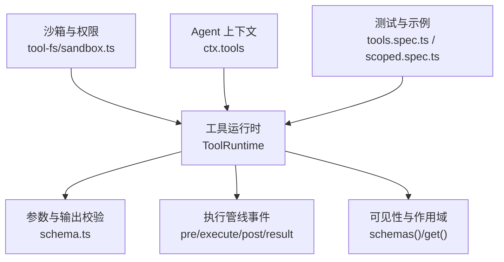
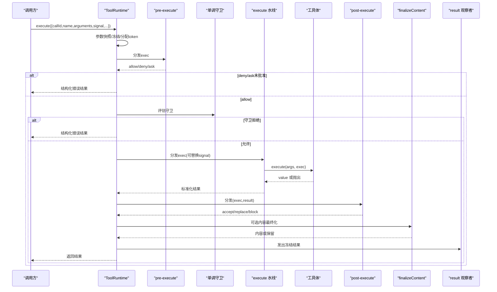
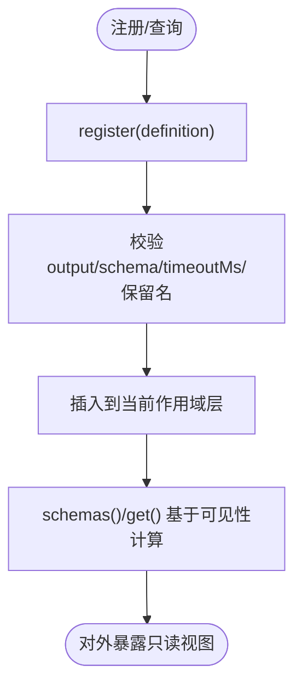
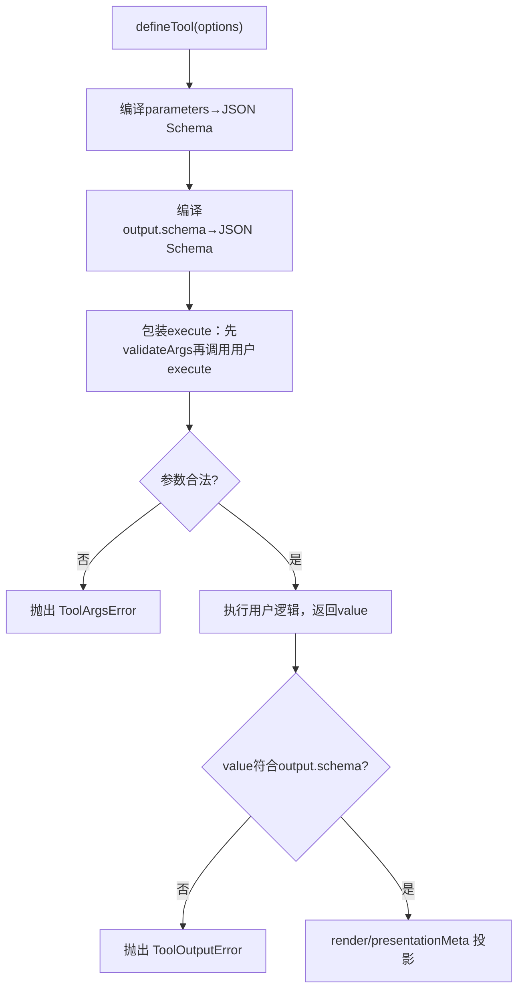
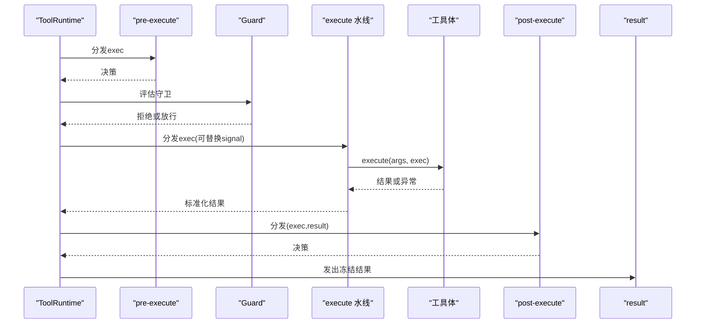
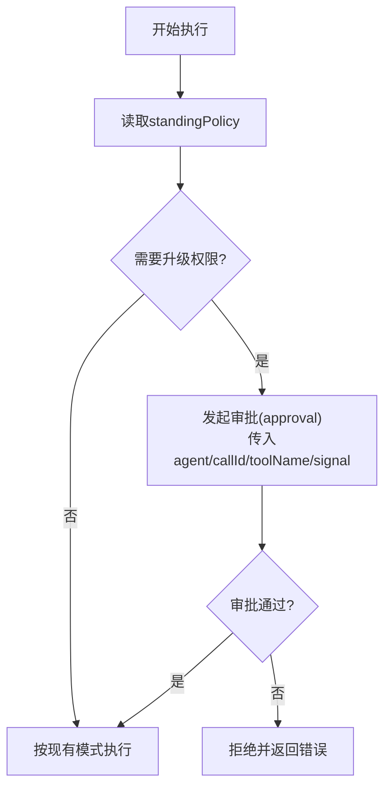
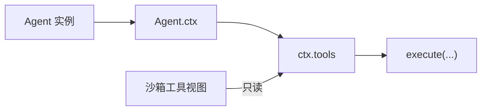
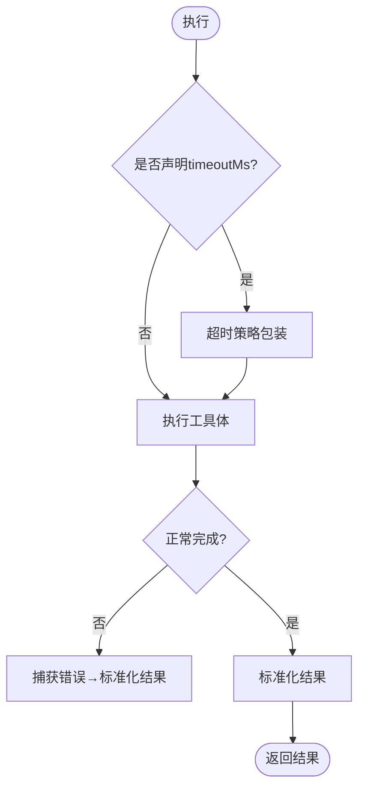
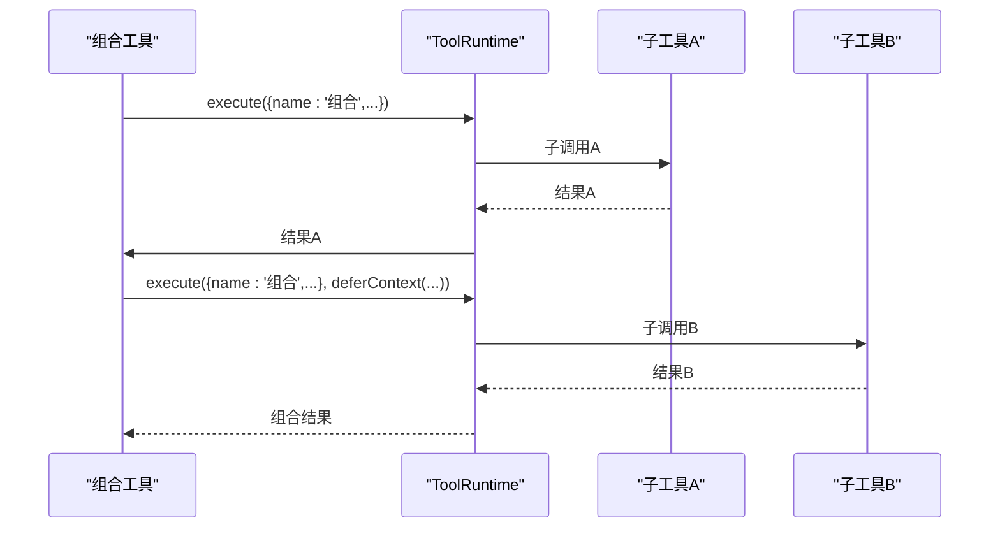
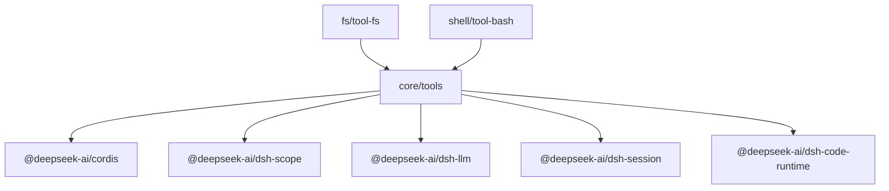

# 工具系统

<cite>
**本文引用的文件**
- [packages/core/tools/src/index.ts](file://packages/core/tools/src/index.ts)
- [packages/core/tools/src/schema.ts](file://packages/core/tools/src/schema.ts)
- [packages/core/tools/tests/tools.spec.ts](file://packages/core/tools/tests/tools.spec.ts)
- [packages/core/tools/tests/scoped.spec.ts](file://packages/core/tools/tests/scoped.spec.ts)
- [packages/extensions/cordis-host-runner/src/guard.ts](file://packages/extensions/cordis-host-runner/src/guard.ts)
- [packages/fs/tool-fs/src/sandbox.ts](file://packages/fs/tool-fs/src/sandbox.ts)
- [packages/shell/tool-bash/tests/tools.spec.ts](file://packages/shell/tool-bash/tests/tools.spec.ts)
- [scripts/gen-tool-catalog.ts](file://scripts/gen-tool-catalog.ts)
- [docs/subsystems/tools.md](file://docs/subsystems/tools.md)
</cite>

## 目录
1. [简介](#简介)
2. [项目结构](#项目结构)
3. [核心组件](#核心组件)
4. [架构总览](#架构总览)
5. [详细组件分析](#详细组件分析)
6. [依赖关系分析](#依赖关系分析)
7. [性能与并发特性](#性能与并发特性)
8. [故障排查指南](#故障排查指南)
9. [结论](#结论)
10. [附录：使用示例与最佳实践](#附录使用示例与最佳实践)

## 简介
本技术文档面向“工具系统”（Tool System），聚焦以下目标：
- 解释工具注册机制、参数验证与执行管道的设计原理
- 详细说明 ToolDefinition、ToolContext（即 ToolRunContext）、ToolResult 等核心接口的定义与用法
- 文档化工具的执行流程：参数解析、权限检查、沙箱执行、结果处理
- 说明工具的依赖注入、错误处理与重试/超时机制
- 说明工具与 Agent 的集成方式，以及如何通过 ctx.tools 访问工具服务
- 提供具体代码路径示例，展示如何注册自定义工具、调用内置工具、实现复杂工具链组合

## 项目结构
工具系统的核心位于 packages/core/tools，围绕 ToolRuntime 提供注册、可见性控制、调度与执行管线；schema.ts 提供统一的 JSON 值类型 DSL 与 defineTool 辅助；测试用例覆盖注册、执行、作用域隔离等关键行为；扩展层在 cordis-host-runner 中为沙箱暴露只读的工具元数据视图；文件系统工具在 sandbox.ts 中演示了权限审批与沙箱策略；shell 工具测试展示了如何在测试环境中构造 Agent 并调用工具。

图表来源
- [packages/core/tools/src/index.ts:787-800](file://packages/core/tools/src/index.ts#L787-L800)
- [packages/core/tools/src/schema.ts:545-618](file://packages/core/tools/src/schema.ts#L545-L618)
- [packages/fs/tool-fs/src/sandbox.ts:95-108](file://packages/fs/tool-fs/src/sandbox.ts#L95-L108)
- [packages/core/tools/tests/tools.spec.ts:2165-2204](file://packages/core/tools/tests/tools.spec.ts#L2165-L2204)

章节来源
- [packages/core/tools/src/index.ts:787-800](file://packages/core/tools/src/index.ts#L787-L800)
- [packages/core/tools/src/schema.ts:545-618](file://packages/core/tools/src/schema.ts#L545-L618)
- [packages/fs/tool-fs/src/sandbox.ts:95-108](file://packages/fs/tool-fs/src/sandbox.ts#L95-L108)
- [packages/core/tools/tests/tools.spec.ts:2165-2204](file://packages/core/tools/tests/tools.spec.ts#L2165-L2204)

## 核心组件
- ToolDefinition：一个已注册的工具，包含模型可见的 schema、强制的输出声明 output、执行函数 execute，以及可选的最终内容转换 finalizeContent、超时预算 timeoutMs、并行安全标记 isConcurrencySafe、UI 呈现 presentCall/presentResult。
- ToolOutputDefinition：工具输出的契约，包含 JSON Schema 与渲染器 render，以及可选的 presentationMeta。
- ToolExecutionInput/ToolExecution/ToolDispatchExecution：描述一次工具调用的输入、执行期不可变视图和 around-dispatch 可替换信号视图。
- ToolRunContext：工具体接收的执行上下文，支持 deferContext 附加上下文、concludeTurn 标记本轮结束。
- ToolExecutionResult：成功或失败的结果联合类型，携带 content、error/value、meta、additionalContexts、concludesTurn 等。
- ToolRuntime：工具注册表与执行管道，提供 register、schemas、get、executionMode、execute 等方法，并通过 Cordis 事件水线 pre-execute、execute、post-execute、result 进行扩展。

章节来源
- [packages/core/tools/src/index.ts:211-288](file://packages/core/tools/src/index.ts#L211-L288)
- [packages/core/tools/src/index.ts:304-460](file://packages/core/tools/src/index.ts#L304-L460)
- [packages/core/tools/src/index.ts:787-800](file://packages/core/tools/src/index.ts#L787-L800)
- [docs/subsystems/tools.md:9-151](file://docs/subsystems/tools.md#L9-L151)

## 架构总览
工具执行遵循严格的流水线：
- 入口：ctx.tools.execute(ToolExecutionInput)
- 阶段：
  - 参数快照与冻结：将 arguments 转换为 lossless JSON 并深冻结
  - 预执行水线 tools/pre-execute：允许/拒绝/询问（ask）
  - 单调守卫 ToolGuard：最终拒绝理由不可被后续监听器撤销
  - 环绕执行水线 tools/execute：用于超时、重试、指标等
  - 工具体执行：validate(args) → execute(args, exec)
  - 后处理水线 tools/post-execute：接受/替换/阻断
  - 定义级 finalizeContent：最后一次内容变换
  - 结果通知 tools/result：观察冻结的最终结果

图表来源
- [packages/core/tools/src/index.ts:137-208](file://packages/core/tools/src/index.ts#L137-L208)
- [packages/core/tools/src/index.ts:372-460](file://packages/core/tools/src/index.ts#L372-L460)
- [docs/subsystems/tools.md:170-404](file://docs/subsystems/tools.md#L170-L404)

## 详细组件分析

### 工具注册与可见性
- 注册：ctx.tools.register(ToolDefinition)，返回精确的卸载处置器；重复名称在同一层会报错；保留名 run_code 不可注册或遮蔽。
- 可见性：ctx.tools.schemas(scope?) 仅暴露模型可见字段（name/description/parameters），不泄露 execute 等回调；ctx.tools.get(name, scope?) 返回当前作用域可见的定义视图。
- 作用域限制：ToolRestriction 可对全局工具进行 allow/deny 过滤，不影响作用域内注册；多层限制取交集。

图表来源
- [packages/core/tools/src/index.ts:1031-1062](file://packages/core/tools/src/index.ts#L1031-L1062)
- [packages/extensions/cordis-host-runner/src/guard.ts:639-655](file://packages/extensions/cordis-host-runner/src/guard.ts#L639-L655)
- [docs/subsystems/tools.md:478-574](file://docs/subsystems/tools.md#L478-L574)

章节来源
- [packages/core/tools/src/index.ts:1031-1062](file://packages/core/tools/src/index.ts#L1031-L1062)
- [packages/extensions/cordis-host-runner/src/guard.ts:639-655](file://packages/extensions/cordis-host-runner/src/guard.ts#L639-L655)
- [docs/subsystems/tools.md:478-574](file://docs/subsystems/tools.md#L478-L574)

### 参数验证与输出约束
- 参数验证：defineTool 内部将 parameters 编译为 JSON Schema，并在 execute 前调用 validateArgs；非法参数抛出 ToolArgsError（INVALID_ARGS）。
- 输出约束：output.schema 对 body 返回值进行严格校验；渲染器 render 与 presentationMeta 必须返回可丢失 JSON 的值，否则转为 ToolOutputError（INVALID_TOOL_OUTPUT）。
- 类型推断：InferValue/InferArgs 提供强类型参数与返回值推断，便于 IDE 提示与静态检查。

图表来源
- [packages/core/tools/src/schema.ts:545-618](file://packages/core/tools/src/schema.ts#L545-L618)
- [packages/core/tools/src/index.ts:512-553](file://packages/core/tools/src/index.ts#L512-L553)

章节来源
- [packages/core/tools/src/schema.ts:545-618](file://packages/core/tools/src/schema.ts#L545-L618)
- [packages/core/tools/src/index.ts:512-553](file://packages/core/tools/src/index.ts#L512-L553)

### 执行管道与事件水线
- pre-execute：允许/拒绝/询问；缺少审批能力时 ask 退化为拒绝。
- 单调守卫：任何守卫均可拒绝，且无法被后续监听器恢复允许。
- execute 水线：用于超时、重试、指标；可替换 exec.signal，但需恢复原信号。
- post-execute：接受/替换 content/value 或阻断为错误；content 替换不改变 canonical value。
- result：最终观察者，接收冻结的执行与结果。

图表来源
- [packages/core/tools/src/index.ts:137-208](file://packages/core/tools/src/index.ts#L137-L208)
- [packages/core/tools/src/index.ts:372-460](file://packages/core/tools/src/index.ts#L372-L460)
- [docs/subsystems/tools.md:170-404](file://docs/subsystems/tools.md#L170-L404)

章节来源
- [packages/core/tools/src/index.ts:137-208](file://packages/core/tools/src/index.ts#L137-L208)
- [packages/core/tools/src/index.ts:372-460](file://packages/core/tools/src/index.ts#L372-L460)
- [docs/subsystems/tools.md:170-404](file://docs/subsystems/tools.md#L170-L404)

### 沙箱与权限检查
- 文件系统工具在执行前会读取当前沙箱策略，必要时发起升级审批（approval），以 agent、callId、toolName、signal 等上下文驱动审批流。
- 沙箱模式由 standingPolicy 与 approvedMode 共同决定，确保操作在受控范围内执行。

图表来源
- [packages/fs/tool-fs/src/sandbox.ts:95-108](file://packages/fs/tool-fs/src/sandbox.ts#L95-L108)

章节来源
- [packages/fs/tool-fs/src/sandbox.ts:95-108](file://packages/fs/tool-fs/src/sandbox.ts#L95-L108)

### 依赖注入与 Agent 集成
- 工具通过 ctx.tools 访问工具服务；在 Cordis 宿主中，沙箱环境仅提供只读的 schemas/get，防止直接绕过 ToolRuntime.execute 调用其他工具。
- 测试中通过构造最小 Agent 并将其注册到 ctx.agents，使工具在执行时可感知所属 Agent 与作用域。

图表来源
- [packages/extensions/cordis-host-runner/src/guard.ts:639-655](file://packages/extensions/cordis-host-runner/src/guard.ts#L639-L655)
- [packages/shell/tool-bash/tests/tools.spec.ts:61-84](file://packages/shell/tool-bash/tests/tools.spec.ts#L61-L84)

章节来源
- [packages/extensions/cordis-host-runner/src/guard.ts:639-655](file://packages/extensions/cordis-host-runner/src/guard.ts#L639-L655)
- [packages/shell/tool-bash/tests/tools.spec.ts:61-84](file://packages/shell/tool-bash/tests/tools.spec.ts#L61-L84)

### 错误处理与重试/超时
- 未知工具：抛出 ToolNotFoundError（UNKNOWN_TOOL），可被上层重试/沙箱/回放逻辑区分。
- 参数/输出错误：ToolArgsError（INVALID_ARGS）、ToolOutputError（INVALID_TOOL_OUTPUT）。
- 超时：工具可声明 timeoutMs；超时策略作为 execute 水线包装，将结果替换为 TOOL_TIMEOUT；该策略为协作式，要求工具体关注 exec.signal 并可达静默。
- 取消：ABORTED_BEFORE_DISPATCH（未进入工具体）与 ABORTED（已进入工具体）。

图表来源
- [packages/core/tools/src/index.ts:468-522](file://packages/core/tools/src/index.ts#L468-L522)
- [docs/subsystems/tools.md:370-404](file://docs/subsystems/tools.md#L370-L404)
- [packages/guard/timeout-policy/tests/timeout-policy.spec.ts:97-129](file://packages/guard/timeout-policy/tests/timeout-policy.spec.ts#L97-L129)

章节来源
- [packages/core/tools/src/index.ts:468-522](file://packages/core/tools/src/index.ts#L468-L522)
- [docs/subsystems/tools.md:370-404](file://docs/subsystems/tools.md#L370-L404)
- [packages/guard/timeout-policy/tests/timeout-policy.spec.ts:97-129](file://packages/guard/timeout-policy/tests/timeout-policy.spec.ts#L97-L129)

### 工具链组合与编排
- 通过 defineTool 组合多个子工具调用，利用 ToolRunContext.deferContext 传递嵌套上下文，或使用 concludeTurn 标记本轮终止。
- 借助 executionMode 与 isConcurrencySafe 控制串行/并行执行，形成有界并发与屏障。

图表来源
- [packages/core/tools/src/index.ts:396-424](file://packages/core/tools/src/index.ts#L396-L424)
- [packages/core/tools/src/index.ts:545-618](file://packages/core/tools/src/index.ts#L545-L618)

章节来源
- [packages/core/tools/src/index.ts:396-424](file://packages/core/tools/src/index.ts#L396-L424)
- [packages/core/tools/src/index.ts:545-618](file://packages/core/tools/src/index.ts#L545-L618)

## 依赖关系分析
- 核心依赖：@deepseek-ai/cordis（Context/Service）、@deepseek-ai/dsh-scope（作用域）、@deepseek-ai/dsh-llm（类型与错误）、@deepseek-ai/dsh-session（序列化/快照）、@deepseek-ai/dsh-code-runtime（code mode 语言映射）。
- 外部集成：审批服务（ApprovalService，可选增强）、Code Mode（run_code 传输）、文件系统/Shell 工具（权限与沙箱）。

图表来源
- [packages/core/tools/src/index.ts:1-28](file://packages/core/tools/src/index.ts#L1-L28)
- [scripts/gen-tool-catalog.ts:135-164](file://scripts/gen-tool-catalog.ts#L135-L164)

章节来源
- [packages/core/tools/src/index.ts:1-28](file://packages/core/tools/src/index.ts#L1-L28)
- [scripts/gen-tool-catalog.ts:135-164](file://scripts/gen-tool-catalog.ts#L135-L164)

## 性能与并发特性
- 并发控制：isConcurrencySafe 可将工具标记为可并行；executionMode 支持 parallel/exclusive 两种模式，exclusive 形成顺序屏障。
- 最大并行度：Code Mode 的子调用可通过 maxParallelSubCalls 配置上限（默认 10），保证资源可控。
- 信号融合：around-dispatch 可替换 exec.signal，但会与原始 caller signal 融合，避免脱离调用方取消语义。

章节来源
- [packages/core/tools/src/index.ts:650-674](file://packages/core/tools/src/index.ts#L650-L674)
- [docs/subsystems/tools.md:243-281](file://docs/subsystems/tools.md#L243-L281)

## 故障排查指南
- 未知工具：检查工具是否已注册且在当前作用域可见；确认未被 restrict 过滤。
- 参数错误：核对 parameters 定义与传入值；查看 ToolArgsError 中的 violations。
- 输出错误：核对 output.schema 与 render/presentationMeta；查看 ToolOutputError 的 violations。
- 超时：若工具声明 timeoutMs，确认其实现能响应 exec.signal 并尽快静默；检查超时策略日志。
- 权限不足：文件系统工具可能触发 approval；检查审批通道与策略。

章节来源
- [packages/core/tools/src/index.ts:468-553](file://packages/core/tools/src/index.ts#L468-L553)
- [packages/fs/tool-fs/src/sandbox.ts:95-108](file://packages/fs/tool-fs/src/sandbox.ts#L95-L108)
- [packages/guard/timeout-policy/tests/timeout-policy.spec.ts:97-129](file://packages/guard/timeout-policy/tests/timeout-policy.spec.ts#L97-L129)

## 结论
工具系统通过严格的注册与可见性控制、强类型的参数与输出校验、可扩展的执行水线、协作式超时与取消、以及沙箱与权限审批，提供了安全、可观测、可编排的工具执行环境。Agent 通过 ctx.tools 统一访问工具服务，结合作用域与限制，可在多租户与多模式下灵活组合工具链。

## 附录：使用示例与最佳实践
- 注册自定义工具
  - 使用 defineTool 定义 name/description/parameters/output/execute，并可添加 finalizeContent/presentCall/presentResult/isConcurrencySafe/timeoutMs。
  - 参考路径：[packages/core/tools/src/schema.ts:545-618](file://packages/core/tools/src/schema.ts#L545-L618)
- 调用内置工具
  - 通过 ctx.tools.execute 传入 callId/name/arguments/signal；测试中展示了完整往返流程。
  - 参考路径：[packages/core/tools/tests/tools.spec.ts:2165-2204](file://packages/core/tools/tests/tools.spec.ts#L2165-L2204)
- 工具链组合
  - 在组合工具中多次调用子工具，使用 deferContext 传递上下文，必要时 concludeTurn 标记本轮结束。
  - 参考路径：[packages/core/tools/src/index.ts:396-424](file://packages/core/tools/src/index.ts#L396-L424)
- 作用域与限制
  - 使用 restrict 对全局工具进行 allow/deny 过滤；通过 schemas/get 获取当前作用域可见的工具视图。
  - 参考路径：[packages/core/tools/tests/scoped.spec.ts:24-59](file://packages/core/tools/tests/scoped.spec.ts#L24-L59)
- 沙箱与权限
  - 文件系统工具在执行前可能触发审批；确保传入 agent/callId/toolName/signal 等上下文。
  - 参考路径：[packages/fs/tool-fs/src/sandbox.ts:95-108](file://packages/fs/tool-fs/src/sandbox.ts#L95-L108)

章节来源
- [packages/core/tools/src/schema.ts:545-618](file://packages/core/tools/src/schema.ts#L545-L618)
- [packages/core/tools/tests/tools.spec.ts:2165-2204](file://packages/core/tools/tests/tools.spec.ts#L2165-L2204)
- [packages/core/tools/tests/scoped.spec.ts:24-59](file://packages/core/tools/tests/scoped.spec.ts#L24-L59)
- [packages/fs/tool-fs/src/sandbox.ts:95-108](file://packages/fs/tool-fs/src/sandbox.ts#L95-L108)