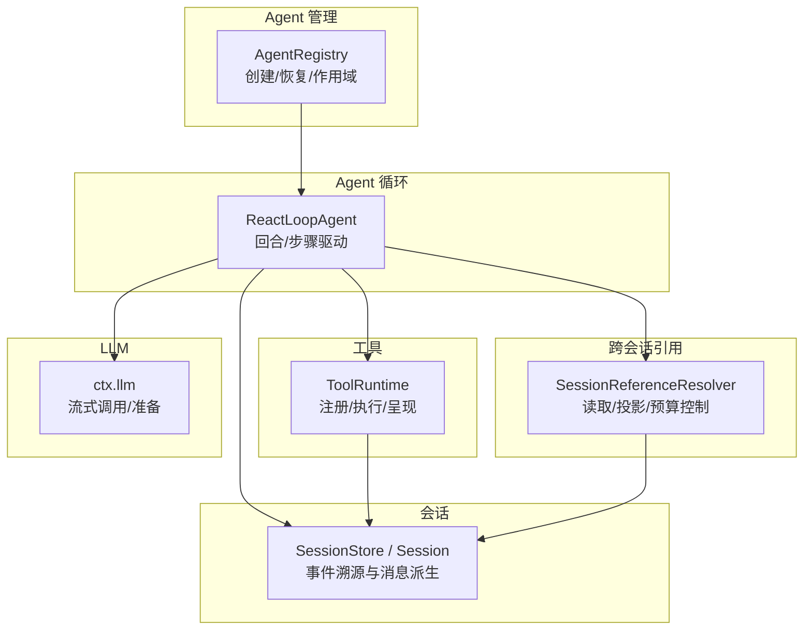
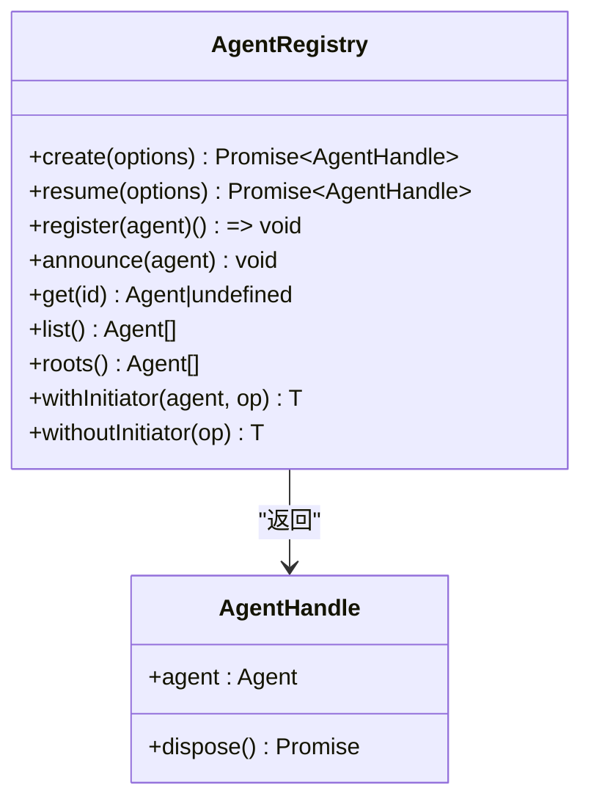
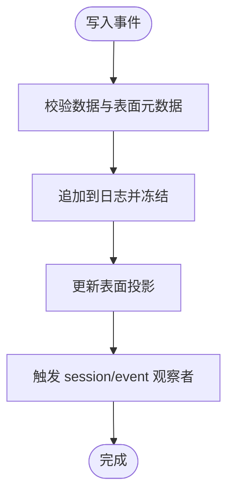
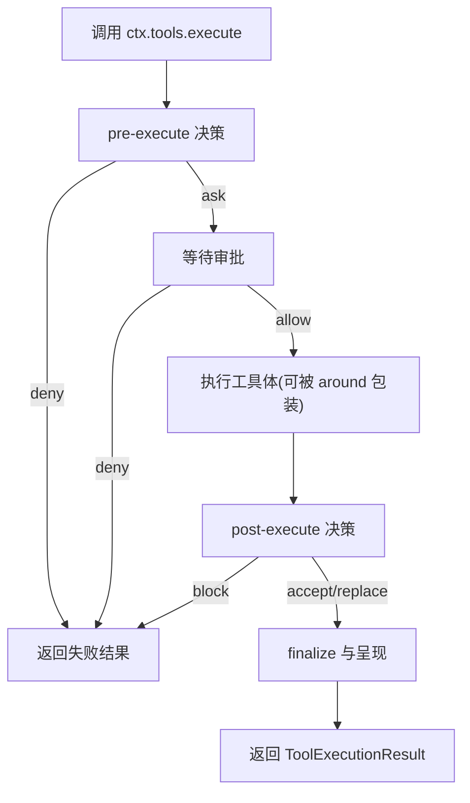
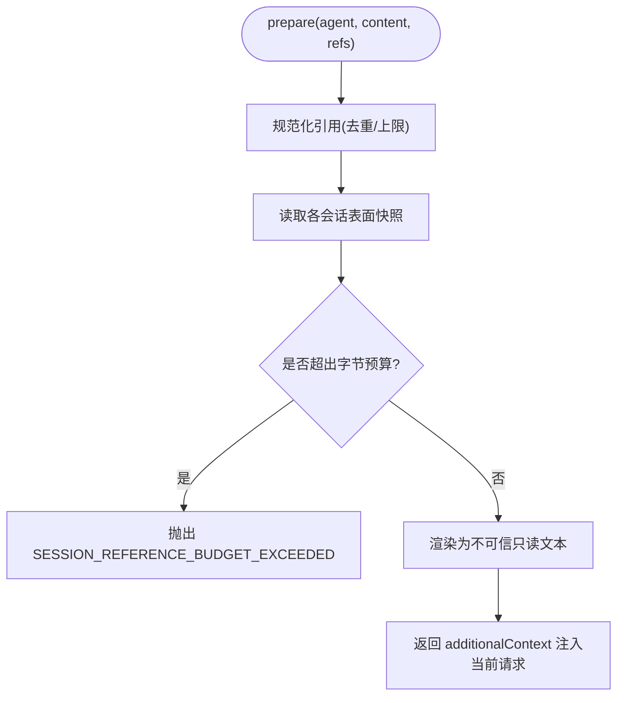
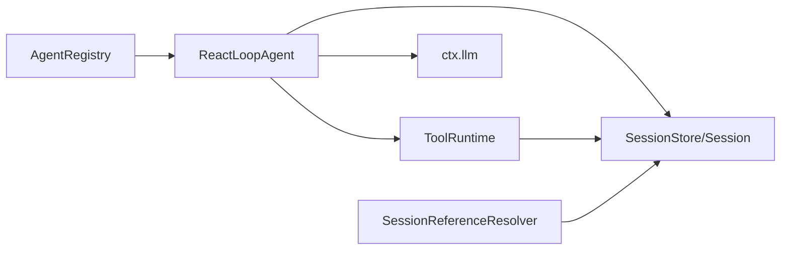

# 核心组件

<cite>
**本文引用的文件**
- [packages/core/agent-loop/src/agent.ts](file://packages/core/agent-loop/src/agent.ts)
- [packages/core/tools/src/index.ts](file://packages/core/tools/src/index.ts)
- [packages/core/session/src/index.ts](file://packages/core/session/src/index.ts)
- [packages/context/session-reference/src/index.ts](file://packages/context/session-reference/src/index.ts)
- [packages/core/agent/src/index.ts](file://packages/core/agent/src/index.ts)
- [packages/core/agent-loop/src/index.ts](file://packages/core/agent-loop/src/index.ts)
- [docs/architecture.md](file://docs/architecture.md)
</cite>

## 目录
1. [简介](#简介)
2. [项目结构](#项目结构)
3. [核心组件](#核心组件)
4. [架构总览](#架构总览)
5. [详细组件分析](#详细组件分析)
6. [依赖关系分析](#依赖关系分析)
7. [性能考虑](#性能考虑)
8. [故障排查指南](#故障排查指南)
9. [结论](#结论)
10. [附录：上下文键与数据模型速查](#附录：上下文键与数据模型速查)

## 简介
本文件聚焦 DeepSeek Harness 的核心组件，围绕 Agent 管理系统、会话管理、工具系统、LLM 集成等关键包进行系统化说明。重点解释各组件的职责边界、接口契约、与其他组件的交互方式，以及 ctx.agents、ctx.sessions、ctx.tools、ctx.llm 等关键上下文键的使用方法与数据模型。文档包含架构图、类图、调用序列图和流程图，并给出具体代码示例路径，帮助读者快速上手和深入理解。

## 项目结构
DeepSeek Harness 采用分层与模块化组织：
- Agent 循环驱动层：负责轮询、回合/步骤边界、消息组装、工具执行编排（agent-loop）。
- 会话事件溯源层：以追加日志为核心，提供消息派生、表面投影、请求头折叠（session）。
- 工具注册与执行管道：定义工具契约、执行管线、权限策略、结果呈现（tools）。
- 跨会话引用：将其他会话内容安全地注入当前会话上下文（session-reference）。
- Agent 注册与生命周期：维护 Agent 实例、创建/恢复、发起者作用域（agent）。
- LLM 集成：通过 ctx.llm 统一接入不同模型提供方（由外部适配器实现，此处不展开）。



图表来源
- [packages/core/agent-loop/src/agent.ts:64-497](file://packages/core/agent-loop/src/agent.ts#L64-L497)
- [packages/core/session/src/index.ts:425-758](file://packages/core/session/src/index.ts#L425-L758)
- [packages/core/tools/src/index.ts:787-800](file://packages/core/tools/src/index.ts#L787-L800)
- [packages/context/session-reference/src/index.ts:70-233](file://packages/context/session-reference/src/index.ts#L70-L233)
- [packages/core/agent/src/index.ts:256-707](file://packages/core/agent/src/index.ts#L256-L707)

章节来源
- [docs/architecture.md:104-127](file://docs/architecture.md#L104-L127)

## 核心组件
- Agent 管理系统（ctx.agents）
  - 职责：注册/创建/恢复 Agent；维护发起者作用域；暴露 Agent 列表与根节点；提供 withInitiator/withoutInitiator 等能力。
  - 关键接口：create/resume/register/announce/get/list/roots；withInitiator/requireInitiator/currentInitiator。
  - 上下文键：ctx.agents；Agent.ctx 上可访问 agent 自身；顶层 ctx.agent 默认 undefined。
- 会话管理（ctx.sessions）
  - 职责：事件溯源存储；追加事件；派生 LLM 消息历史；折叠请求头/上下文；支持 fork 与持久化插件对接。
  - 关键接口：append/deriveMessages/requestHeader/requestContext/foldSurface；事件流 session/event、session/flush。
  - 上下文键：ctx.sessions。
- 工具系统（ctx.tools）
  - 职责：工具注册、可见性过滤、执行管道（pre-execute/guard/execute/post-execute）、结果呈现、并发控制、超时策略。
  - 关键接口：defineTool、execute、presentCall/presentResult、isConcurrencySafe、timeoutMs。
  - 上下文键：ctx.tools。
- LLM 集成（ctx.llm）
  - 职责：统一抽象模型提供方；prepareCall/stream；错误重试与上下文窗口信息。
  - 上下文键：ctx.llm。
- 跨会话引用（ctx.sessionReferenceResolver）
  - 职责：列出候选会话、读取快照、按预算裁剪、生成不可信只读上下文文本，注入到当前请求。
  - 上下文键：ctx.sessionReferenceResolver。

章节来源
- [packages/core/agent/src/index.ts:256-707](file://packages/core/agent/src/index.ts#L256-L707)
- [packages/core/session/src/index.ts:425-758](file://packages/core/session/src/index.ts#L425-L758)
- [packages/core/tools/src/index.ts:787-800](file://packages/core/tools/src/index.ts#L787-L800)
- [packages/context/session-reference/src/index.ts:70-233](file://packages/context/session-reference/src/index.ts#L70-L233)

## 架构总览
下图展示 Agent 循环如何串联会话、工具与 LLM，并通过 AgentRegistry 完成创建与生命周期管理。

```mermaid
sequenceDiagram
participant Host as "宿主/调用方"
participant Agents as "AgentRegistry"
participant Loop as "ReactLoopAgent"
participant Session as "SessionStore/Session"
participant Tools as "ToolRuntime"
participant LLM as "ctx.llm"
Host->>Agents : create/resume(options)
Agents-->>Host : AgentHandle(agent, dispose)
Host->>Loop : followup()/steer()/inject()
Loop->>Session : append('turn/start', 'step/start'...)
Loop->>LLM : prepareCall()/stream(request)
LLM-->>Loop : chunk流/finish
Loop->>Tools : execute(toolCalls)
Tools-->>Loop : ToolExecutionResult
Loop->>Session : append('assistant/chunk','assistant/message','tool/result')
Loop-->>Host : whenIdle()/status
```

图表来源
- [packages/core/agent/src/index.ts:405-430](file://packages/core/agent/src/index.ts#L405-L430)
- [packages/core/agent-loop/src/agent.ts:245-401](file://packages/core/agent-loop/src/agent.ts#L245-L401)
- [packages/core/session/src/index.ts:604-747](file://packages/core/session/src/index.ts#L604-L747)
- [packages/core/tools/src/index.ts:787-800](file://packages/core/tools/src/index.ts#L787-L800)

## 详细组件分析

### Agent 管理系统（ctx.agents）
- 设计要点
  - 工厂模式：通过 setFactory 注入 Agent 创建/恢复逻辑，对外仅暴露 ctx.agents 接口。
  - 作用域与发起者：withInitiator/withoutInitiator 建立进程级异步作用域，用于因果归属与审计。
  - 生命周期：register/announce/enter/detachEntered 保证发布顺序与回滚一致性。
- 关键用法
  - 创建 Agent：ctx.agents.create({ sessionId, agentOptions, seed?, setup? })
  - 恢复 Agent：ctx.agents.resume({ resumeSessionId, agentOptions?, setup? })
  - 获取当前发起者：currentInitiator()/requireInitiator()
  - 列举与归属：list()/roots()/isOwnedBy(id, owner)
- 典型场景
  - 在宿主侧创建 Agent 后，通过 handle.dispose() 停止并清理。
  - 子 Agent 通过父 Agent 的 ctx.agents 创建，形成运行时父子关系。



图表来源
- [packages/core/agent/src/index.ts:256-707](file://packages/core/agent/src/index.ts#L256-L707)

章节来源
- [packages/core/agent/src/index.ts:256-707](file://packages/core/agent/src/index.ts#L256-L707)

### 会话管理（ctx.sessions）
- 设计要点
  - 事件溯源：所有状态变更以追加事件记录，deriveMessages 从事件派生 LLM 消息历史。
  - 表面投影：surfaceOp/sourceEventSeqs 控制消息如何进入有序表面，支持替换与覆盖。
  - 请求头折叠：requestHeader/requestContext 增量折叠，避免重复计算。
- 关键用法
  - 追加事件：session.append(type, data, surfaceIntent?)
  - 派生消息：session.deriveMessages()
  - 读取头部：session.requestHeader()/requestContext()
  - 监听事件：订阅 session/event、session/flush
- 典型场景
  - 持久化插件订阅 session/event 并在 session/flush 时落盘。
  - UI 消费 deriveMessages 渲染对话历史。



图表来源
- [packages/core/session/src/index.ts:604-747](file://packages/core/session/src/index.ts#L604-L747)

章节来源
- [packages/core/session/src/index.ts:425-758](file://packages/core/session/src/index.ts#L425-L758)

### 工具系统（ctx.tools）
- 设计要点
  - 工具契约：ToolDefinition 包含 schema、execute、output.render/presentationMeta、可选 finalizeContent、timeoutMs、isConcurrencySafe、presentCall/presentResult。
  - 执行管道：pre-execute（允许/拒绝/询问）→ guard → execute（around 包装）→ post-execute（接受/替换/阻断）→ finalize 与结果呈现。
  - 可见性与限制：支持全局与 scoped 层的 allow/deny 限制；code/native/both 三种呈现模式。
- 关键用法
  - 注册工具：defineTool(...)
  - 执行工具：ctx.tools.execute({ callId, name, arguments, signal, agent? })
  - 自定义呈现：implement presentCall/presentResult
  - 并发与超时：isConcurrencySafe、timeoutMs、maxParallelSubCalls
- 典型场景
  - 在 pre-execute 中实施审批策略；在 post-execute 中附加额外上下文或阻断结果。



图表来源
- [packages/core/tools/src/index.ts:137-208](file://packages/core/tools/src/index.ts#L137-L208)
- [packages/core/tools/src/index.ts:787-800](file://packages/core/tools/src/index.ts#L787-L800)

章节来源
- [packages/core/tools/src/index.ts:211-800](file://packages/core/tools/src/index.ts#L211-L800)

### LLM 集成（ctx.llm）
- 设计要点
  - 统一抽象：prepareCall 解析路由与默认值，stream 提供流式输出；错误分类为 LlmError。
  - 上下文窗口：preparedCall.context.contextWindow 可用于提示词长度控制。
  - 重试策略：通过 agent/request-error 事件与 retryPolicy 决定重试。
- 关键用法
  - 构建请求：buildRequest 组合 provider/model/system/tools/messages，标记会话 ID。
  - 流式消费：for await (chunk of stream) 累积块并写入 assistant/chunk。
  - 错误处理：根据 finish.kind 决定重试或抛出结构化错误。
- 典型场景
  - 在 agent/request 水线中动态调整 model/reasoningEffort/maxTokens。

```mermaid
sequenceDiagram
participant Loop as "ReactLoopAgent"
participant LLM as "ctx.llm"
participant Session as "Session"
Loop->>LLM : prepareCall(config, signal)
LLM-->>Loop : preparedCall.config
Loop->>LLM : stream(request)
loop 流式分片
LLM-->>Loop : chunk
Loop->>Session : append('assistant/chunk', chunk)
end
alt 完成
Loop->>Session : append('assistant/message', message)
else 错误
Loop->>Loop : 触发 agent/request-error 决策
end
```

图表来源
- [packages/core/agent-loop/src/agent.ts:332-401](file://packages/core/agent-loop/src/agent.ts#L332-L401)
- [packages/core/agent-loop/src/agent.ts:407-495](file://packages/core/agent-loop/src/agent.ts#L407-L495)

章节来源
- [packages/core/agent-loop/src/agent.ts:332-495](file://packages/core/agent-loop/src/agent.ts#L332-L495)

### 跨会话引用（ctx.sessionReferenceResolver）
- 设计要点
  - 候选列表：基于工作目录亲和度排序，支持查询与限制数量。
  - 快照读取：读取目标会话的表面快照，按字节预算裁剪。
  - 安全注入：生成不可信只读 JSON 片段，包裹在固定前缀/后缀内，作为用户消息注入当前请求。
- 关键用法
  - listCandidates(agent, query?, limit?, signal?)
  - prepare(agent, content, references, signal?)
- 典型场景
  - 在用户输入中包含对其他会话的引用，自动拉取相关上下文供模型参考。



图表来源
- [packages/context/session-reference/src/index.ts:169-233](file://packages/context/session-reference/src/index.ts#L169-L233)

章节来源
- [packages/context/session-reference/src/index.ts:70-233](file://packages/context/session-reference/src/index.ts#L70-L233)

## 依赖关系分析
- Agent 循环依赖
  - 依赖 Session 追加 turn/step 边界与消息；依赖 ToolRuntime 执行工具；依赖 ctx.llm 进行流式推理；依赖 SystemPrompt 组装系统提示。
- 工具系统依赖
  - 依赖 Session 记录 tool/call、tool/result；依赖 Code Runtime（当 mode=code）；依赖 Scope 做作用域限制。
- 会话依赖
  - 依赖 SurfaceManager 维护有序表面；依赖 JSON 序列化/冻结确保不可变；依赖 Typert 注册查找。
- Agent 管理依赖
  - 依赖 Cordis Fiber/Effect 管理生命周期；依赖 AgentFactory 委托创建/恢复；维护 AsyncLocalStorage 追踪发起者。



图表来源
- [packages/core/agent-loop/src/agent.ts:64-497](file://packages/core/agent-loop/src/agent.ts#L64-L497)
- [packages/core/session/src/index.ts:425-758](file://packages/core/session/src/index.ts#L425-L758)
- [packages/core/tools/src/index.ts:787-800](file://packages/core/tools/src/index.ts#L787-L800)
- [packages/core/agent/src/index.ts:256-707](file://packages/core/agent/src/index.ts#L256-L707)
- [packages/context/session-reference/src/index.ts:70-233](file://packages/context/session-reference/src/index.ts#L70-L233)

章节来源
- [packages/core/agent-loop/src/agent.ts:64-497](file://packages/core/agent-loop/src/agent.ts#L64-L497)
- [packages/core/session/src/index.ts:425-758](file://packages/core/session/src/index.ts#L425-L758)
- [packages/core/tools/src/index.ts:787-800](file://packages/core/tools/src/index.ts#L787-L800)
- [packages/core/agent/src/index.ts:256-707](file://packages/core/agent/src/index.ts#L256-L707)
- [packages/context/session-reference/src/index.ts:70-233](file://packages/context/session-reference/src/index.ts#L70-L233)

## 性能考虑
- 会话派生缓存：deriveMessages 对新增节点增量投影，避免全量重建；表面替换会重建缓存。
- 请求头折叠：requestHeader/requestContext 增量折叠，O(新事件) 读取成本。
- 工具并发：isConcurrencySafe 允许并行分组；maxParallelSubCalls 控制 code 模式下的子调用并发。
- 流式处理：助手消息以 chunk 形式追加，减少内存峰值；BlockAssembler 聚合块后再写完整消息。
- 预算控制：跨会话引用按字节预算裁剪，防止上下文过大。

[本节为通用指导，无需特定文件来源]

## 故障排查指南
- 常见错误与定位
  - 未知工具：ToolNotFoundError（UNKNOWN_TOOL），检查工具注册与可见性限制。
  - 无效输出：ToolOutputError（INVALID_TOOL_OUTPUT），核对 output.schema 与 render/presentationMeta。
  - 会话格式版本：Session header 版本不匹配或字段非法，检查持久化加载与种子事件。
  - 无适配器：LlmError NO_ADAPTER，确认 ctx.llm.prepareCall 已正确注册路由。
  - 取消与中止：工具或 LLM 调用需响应 AbortSignal，确保在信号触发时及时退出。
- 调试建议
  - 订阅 session/event 观察事件流；使用 deriveMessages 验证消息历史。
  - 在 tools/pre-execute/tools/execute/tools/post-execute 添加日志，定位策略拦截点。
  - 使用 ctx.agents.currentInitiator() 追踪调用链归属。

章节来源
- [packages/core/tools/src/index.ts:494-522](file://packages/core/tools/src/index.ts#L494-L522)
- [packages/core/session/src/index.ts:96-157](file://packages/core/session/src/index.ts#L96-L157)
- [packages/core/agent-loop/src/agent.ts:354-370](file://packages/core/agent-loop/src/agent.ts#L354-L370)

## 结论
DeepSeek Harness 通过 Agent 循环驱动、事件溯源会话、可扩展工具管道与统一 LLM 抽象，构建了高内聚、低耦合的核心能力。AgentRegistry 提供安全的创建与生命周期管理；Session 保证一致性与可回放；ToolRuntime 提供强大的策略与呈现能力；SessionReferenceResolver 增强跨会话知识复用。结合 ctx.agents、ctx.sessions、ctx.tools、ctx.llm 等上下文键，开发者可以灵活扩展系统行为，同时保持清晰的职责边界与稳定的接口契约。

[本节为总结，无需特定文件来源]

## 附录：上下文键与数据模型速查
- ctx.agents
  - 类型：AgentRegistry
  - 主要方法：create/resume/register/announce/get/list/roots；withInitiator/withoutInitiator
  - 用途：创建/恢复 Agent，管理生命周期与作用域
  - 参考路径
    - [packages/core/agent/src/index.ts:256-707](file://packages/core/agent/src/index.ts#L256-L707)
- ctx.sessions
  - 类型：SessionStore
  - 主要方法：append/deriveMessages/requestHeader/requestContext
  - 事件：session/event、session/flush
  - 参考路径
    - [packages/core/session/src/index.ts:425-758](file://packages/core/session/src/index.ts#L425-L758)
- ctx.tools
  - 类型：ToolRuntime
  - 主要方法：execute；defineTool（DSL）
  - 事件：tools/pre-execute、tools/execute、tools/post-execute、tools/result、tools/change
  - 参考路径
    - [packages/core/tools/src/index.ts:137-208](file://packages/core/tools/src/index.ts#L137-L208)
    - [packages/core/tools/src/index.ts:787-800](file://packages/core/tools/src/index.ts#L787-L800)
- ctx.llm
  - 类型：LLM 适配器集合
  - 主要方法：prepareCall/stream
  - 用途：统一模型调用、错误分类、上下文窗口信息
  - 参考路径
    - [packages/core/agent-loop/src/agent.ts:407-495](file://packages/core/agent-loop/src/agent.ts#L407-L495)
- ctx.sessionReferenceResolver
  - 类型：SessionReferenceResolver
  - 主要方法：listCandidates/prepare
  - 用途：跨会话引用读取与注入
  - 参考路径
    - [packages/context/session-reference/src/index.ts:70-233](file://packages/context/session-reference/src/index.ts#L70-L233)

章节来源
- [packages/core/agent/src/index.ts:256-707](file://packages/core/agent/src/index.ts#L256-L707)
- [packages/core/session/src/index.ts:425-758](file://packages/core/session/src/index.ts#L425-L758)
- [packages/core/tools/src/index.ts:137-208](file://packages/core/tools/src/index.ts#L137-L208)
- [packages/core/agent-loop/src/agent.ts:407-495](file://packages/core/agent-loop/src/agent.ts#L407-L495)
- [packages/context/session-reference/src/index.ts:70-233](file://packages/context/session-reference/src/index.ts#L70-L233)