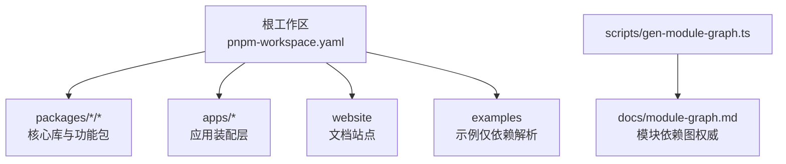
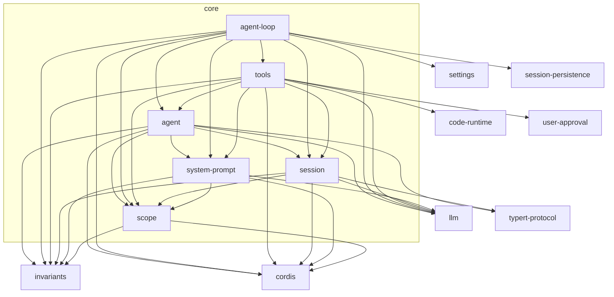
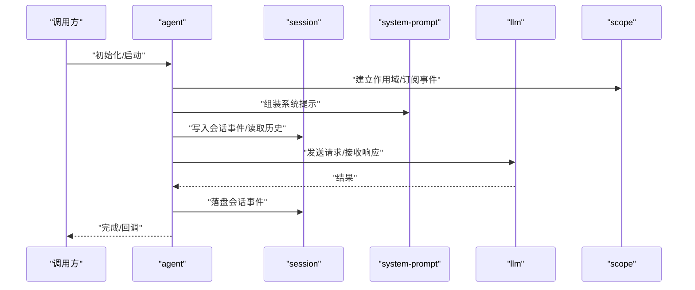
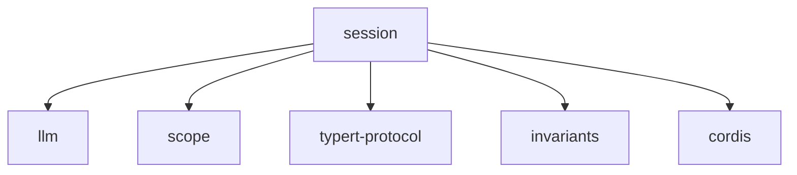
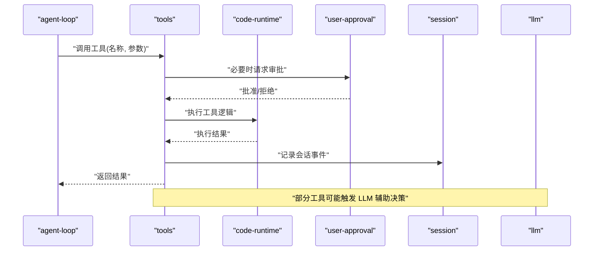
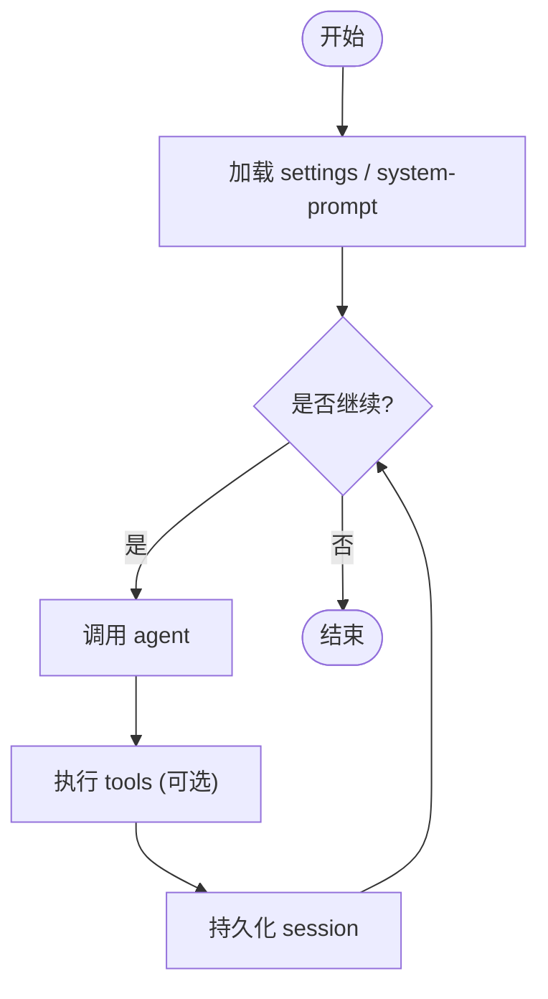
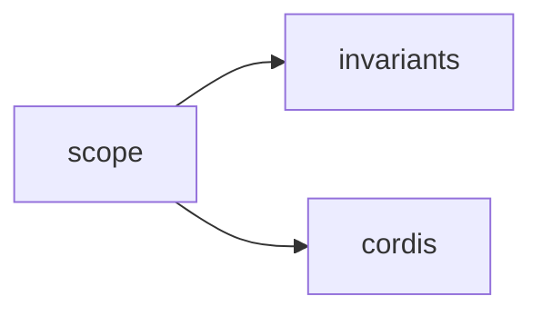
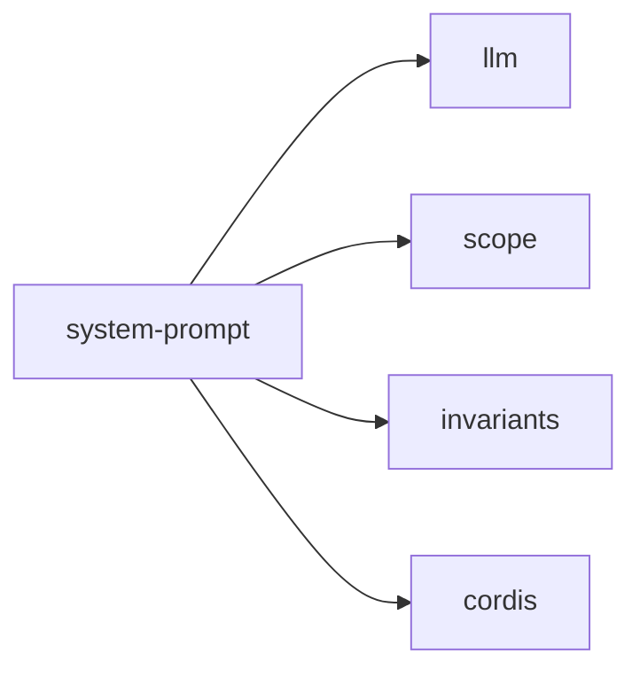
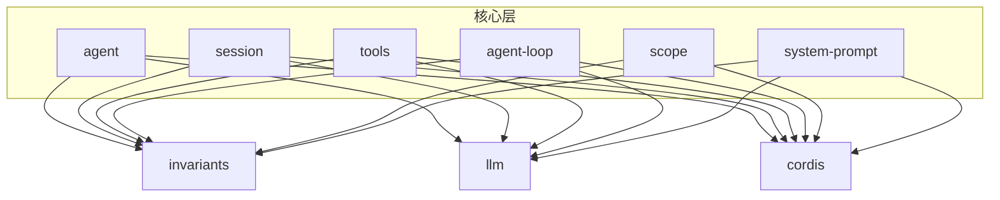

# 模块依赖关系

<cite>
**本文引用的文件**
- [根 package.json](file://package.json)
- [pnpm-workspace.yaml](file://pnpm-workspace.yaml)
- [scripts/gen-module-graph.ts](file://scripts/gen-module-graph.ts)
- [docs/module-graph.md](file://docs/module-graph.md)
- [packages/core/agent/package.json](file://packages/core/agent/package.json)
- [packages/core/session/package.json](file://packages/core/session/package.json)
- [packages/core/tools/package.json](file://packages/core/tools/package.json)
- [packages/core/agent-loop/package.json](file://packages/core/agent-loop/package.json)
- [packages/core/scope/package.json](file://packages/core/scope/package.json)
- [packages/core/system-prompt/package.json](file://packages/core/system-prompt/package.json)
</cite>

## 目录
1. [简介](#简介)
2. [项目结构](#项目结构)
3. [核心组件](#核心组件)
4. [架构总览](#架构总览)
5. [详细组件分析](#详细组件分析)
6. [依赖分析](#依赖分析)
7. [性能考虑](#性能考虑)
8. [故障排查指南](#故障排查指南)
9. [结论](#结论)
10. [附录](#附录)

## 简介
本文件聚焦于 DeepSeek Harness 的模块依赖关系，基于仓库内生成的“模块图”与核心包的 peerDependencies，系统性梳理包之间的依赖层次、交互模式与扩展点。重点解释 core/session、core/tools、core/agent、core/agent-loop、core/scope、core/system-prompt 等核心包的作用与依赖边界，帮助开发者在不破坏现有依赖关系的前提下安全地添加新功能，并提供循环依赖处理与冲突诊断的实践建议。

## 项目结构
- 工作区组织：通过 pnpm workspace 将 vendor、packages/*/*、apps/*、website 等纳入统一依赖解析；examples 仅用于依赖解析（不参与构建目标）。
- 生成式文档：docs/module-graph.md 由 scripts/gen-module-graph.ts 根据各包的 peerDependencies 自动生成，是运行时依赖关系的权威来源。
- 分组策略：模块图按 util、llm、core、goal、fs、skill、subagent、web、spill、todo、plan、hooks、session-*、acp、ui 等组进行聚合，便于分层理解。

图表来源
- [pnpm-workspace.yaml:1-22](file://pnpm-workspace.yaml#L1-L22)
- [scripts/gen-module-graph.ts:1-120](file://scripts/gen-module-graph.ts#L1-L120)

章节来源
- [pnpm-workspace.yaml:1-22](file://pnpm-workspace.yaml#L1-L22)
- [scripts/gen-module-graph.ts:1-120](file://scripts/gen-module-graph.ts#L1-L120)

## 核心组件
- core/session：事件溯源会话存储，提供会话状态、事件流、持久化抽象与查询能力。依赖 llm、scope、brand、invariants、typert-protocol、cordis。
- core/tools：工具注册与执行管线，协调 agent、session、system-prompt、code-runtime、user-approval 等完成工具调用生命周期。
- core/agent：Agent 接口、注册表、启动作用域与事件词汇，依赖 session、llm、scope、system-prompt、typert-protocol、invariants、cordis。
- core/agent-loop：具体 Agent 循环插件，编排 session、tools、system-prompt、settings、session-persistence 等，驱动一轮轮对话与工具调用。
- core/scope：作用域上下文与事件分发原语，为跨包隔离与过滤提供基础。
- core/system-prompt：系统提示词组装注册表，结合 llm、scope 动态拼装提示。

章节来源
- [packages/core/session/package.json:1-61](file://packages/core/session/package.json#L1-L61)
- [packages/core/tools/package.json:1-69](file://packages/core/tools/package.json#L1-L69)
- [packages/core/agent/package.json:1-59](file://packages/core/agent/package.json#L1-L59)
- [packages/core/agent-loop/package.json:1-62](file://packages/core/agent-loop/package.json#L1-L62)
- [packages/core/scope/package.json:1-43](file://packages/core/scope/package.json#L1-L43)
- [packages/core/system-prompt/package.json:1-50](file://packages/core/system-prompt/package.json#L1-L50)

## 架构总览
下图展示了核心包之间的依赖方向与关键交互。箭头表示“被依赖”，即上层依赖下层。

图表来源
- [packages/core/agent/package.json:39-47](file://packages/core/agent/package.json#L39-L47)
- [packages/core/agent-loop/package.json:33-44](file://packages/core/agent-loop/package.json#L33-L44)
- [packages/core/tools/package.json:43-53](file://packages/core/tools/package.json#L43-L53)
- [packages/core/session/package.json:43-50](file://packages/core/session/package.json#L43-L50)
- [packages/core/scope/package.json:34-37](file://packages/core/scope/package.json#L34-L37)
- [packages/core/system-prompt/package.json:34-39](file://packages/core/system-prompt/package.json#L34-L39)

## 详细组件分析

### core/agent：Agent 抽象与生命周期
- 职责：定义 Agent 接口、注册表、启动作用域、事件词汇；作为上层业务（如 goal、workflow、tool-*）与底层会话/LLM 的桥梁。
- 关键依赖：session、llm、scope、system-prompt、typert-protocol、invariants、cordis。
- 交互模式：通过 scope 隔离事件与上下文；借助 session 读写会话事件；使用 system-prompt 拼装系统提示；通过 llm 发起模型调用。

图表来源
- [packages/core/agent/package.json:39-47](file://packages/core/agent/package.json#L39-L47)

章节来源
- [packages/core/agent/package.json:1-59](file://packages/core/agent/package.json#L1-L59)

### core/session：事件溯源会话存储
- 职责：以事件为核心建模会话，提供追加、回放、投影、查询、持久化适配等能力。
- 关键依赖：llm、scope、brand、invariants、typert-protocol、cordis。
- 设计要点：通过 scope 实现事件过滤与隔离；通过 typert-protocol 保证类型契约；通过 cordis 接入插件体系。

图表来源
- [packages/core/session/package.json:43-50](file://packages/core/session/package.json#L43-L50)

章节来源
- [packages/core/session/package.json:1-61](file://packages/core/session/package.json#L1-L61)

### core/tools：工具注册与执行管线
- 职责：统一管理工具的声明、注册、参数校验、执行与结果呈现；协调用户审批、代码运行环境、系统提示等。
- 关键依赖：agent、code-runtime、invariants、llm、scope、session、system-prompt、user-approval、cordis。
- 典型流程：从 agent 或 loop 触发 -> 选择工具 -> 校验参数 -> 在 code-runtime 中执行 -> 必要时走 user-approval -> 产出结果并回写 session。

图表来源
- [packages/core/tools/package.json:43-53](file://packages/core/tools/package.json#L43-L53)

章节来源
- [packages/core/tools/package.json:1-69](file://packages/core/tools/package.json#L1-L69)

### core/agent-loop：Agent 循环编排
- 职责：驱动一轮轮对话与工具调用，管理设置、系统提示、会话持久化、工具执行等。
- 关键依赖：agent、invariants、llm、scope、session、session-persistence、system-prompt、tools、cordis、settings。
- 控制流：读取设置与系统提示 -> 进入循环 -> 调用 agent -> 根据结果决定继续/结束 -> 持久化会话。

图表来源
- [packages/core/agent-loop/package.json:33-44](file://packages/core/agent-loop/package.json#L33-L44)

章节来源
- [packages/core/agent-loop/package.json:1-62](file://packages/core/agent-loop/package.json#L1-L62)

### core/scope：作用域与事件分发
- 职责：提供作用域标签、事件过滤与分发原语，确保多插件/多任务间的隔离。
- 关键依赖：invariants、cordis。
- 使用方式：在 agent、session、tools 等组件中创建/传递作用域，限制事件传播范围。

图表来源
- [packages/core/scope/package.json:34-37](file://packages/core/scope/package.json#L34-L37)

章节来源
- [packages/core/scope/package.json:1-43](file://packages/core/scope/package.json#L1-L43)

### core/system-prompt：系统提示词组装
- 职责：集中管理系统提示词的拼装与注册，结合 llm 与 scope 实现上下文感知。
- 关键依赖：invariants、llm、scope、cordis。

图表来源
- [packages/core/system-prompt/package.json:34-39](file://packages/core/system-prompt/package.json#L34-L39)

章节来源
- [packages/core/system-prompt/package.json:1-50](file://packages/core/system-prompt/package.json#L1-L50)

## 依赖分析
- 权威来源：docs/module-graph.md 由脚本根据 peerDependencies 生成，反映运行时真实依赖边。
- 分组解读：
  - util：基础设施（invariants、timeout、home-paths 等），被广泛依赖。
  - llm：模型适配与重试、计量等，被 core 与多个业务包依赖。
  - core：核心能力（agent、session、tools、loop、scope、system-prompt）。
  - goal/fs/skill/subagent/web/spill/todo/plan/hooks/session-*：围绕核心能力的领域扩展。
  - acp/ui/client/host/boot/bundle：装配与客户端相关。
- 依赖层次：
  - 核心依赖：invariants、llm、scope、session、tools、agent、system-prompt。
  - 可选依赖：settings、session-persistence、user-approval、code-runtime 等按需引入。
- 环检测：模块图由脚本生成，若存在环会在图中显式体现；当前核心层未出现环。

图表来源
- [docs/module-graph.md:26-35](file://docs/module-graph.md#L26-L35)
- [docs/module-graph.md:327-446](file://docs/module-graph.md#L327-L446)

章节来源
- [docs/module-graph.md:1-120](file://docs/module-graph.md#L1-L120)
- [scripts/gen-module-graph.ts:1-120](file://scripts/gen-module-graph.ts#L1-L120)

## 性能考虑
- 避免不必要的 LLM 调用：在 tools 与 agent-loop 中缓存/复用结果，减少重复请求。
- 会话持久化节流：批量写入或异步落盘，降低 IO 抖动。
- 作用域最小化：scope 尽量细粒度，减少事件广播范围。
- 工具执行隔离：code-runtime 沙箱化执行，避免长任务阻塞主循环。

[本节为通用指导，不直接分析具体文件]

## 故障排查指南
- 新增依赖导致构建失败：检查新增包的 peerDependencies 是否与现有版本兼容；优先使用 workspace:^ 保持内部一致。
- 循环依赖报错：定位到 docs/module-graph.md 中的环，拆分职责或将共享逻辑下沉至更底层的 util/invariants。
- 运行时找不到模块：确认 pnpm-workspace.yaml 已将新包纳入工作区；必要时在根 package.json 的 scripts 中添加验证命令。
- 事件未到达预期作用域：检查 scope 的创建与传递路径，确保订阅者处于正确作用域内。
- 工具执行超时/卡死：检查 tools 与 code-runtime 的超时配置与资源释放；必要时增加日志与断点。

章节来源
- [pnpm-workspace.yaml:1-22](file://pnpm-workspace.yaml#L1-L22)
- [scripts/gen-module-graph.ts:101-119](file://scripts/gen-module-graph.ts#L101-L119)

## 结论
DeepSeek Harness 的核心依赖以 invariants、llm、scope、session、tools、agent、system-prompt 为中心，形成清晰的分层与单向依赖。通过 peerDependencies 约束与生成式模块图，可确保依赖稳定、可演进。遵循“低耦合、高内聚、作用域隔离”的原则，可在不破坏现有关系的前提下扩展新功能。

[本节为总结性内容，不直接分析具体文件]

## 附录

### 如何解读模块图
- 节点：每个包为一个节点，名称已去除 @deepseek-ai/dsh- 前缀。
- 边：a --> b 表示 a 依赖 b。
- 分组：按 packages/<group>/<pkg> 目录分组，便于定位。
- 更新：修改 peerDependencies 后，运行脚本重新生成 docs/module-graph.md 以同步视图。

章节来源
- [scripts/gen-module-graph.ts:1-120](file://scripts/gen-module-graph.ts#L1-L120)
- [docs/module-graph.md:1-10](file://docs/module-graph.md#L1-L10)

### 添加新功能时的依赖最佳实践
- 明确职责边界：新功能应归属到合适的 group/pkg，避免侵入 core。
- 优先依赖已有抽象：如 session、tools、scope、system-prompt，而非直接耦合具体实现。
- 使用 peerDependencies 声明运行时依赖，并在 devDependencies 中补齐测试所需依赖。
- 通过 cordis 插件机制暴露能力，保持可扩展性。
- 新增依赖后，运行 gen-module-graph 并审查模块图变化。

章节来源
- [packages/core/agent/package.json:39-47](file://packages/core/agent/package.json#L39-L47)
- [packages/core/tools/package.json:43-53](file://packages/core/tools/package.json#L43-L53)
- [packages/core/agent-loop/package.json:33-44](file://packages/core/agent-loop/package.json#L33-L44)

### 循环依赖的处理方式
- 识别：通过模块图查找环；若无环则无需干预。
- 解耦：将共享逻辑下沉到 util/invariants；或将双向依赖改为事件/接口解耦。
- 重构：拆分包职责，使依赖方向自顶向下。
- 验证：运行 gen-module-graph --check 确保无回归。

章节来源
- [scripts/gen-module-graph.ts:101-119](file://scripts/gen-module-graph.ts#L101-L119)

### 依赖冲突的诊断与解决
- 症状：安装/构建时报 peerDependency 不匹配或版本冲突。
- 诊断：核对各包 peerDependencies 的版本范围；检查 pnpm overrides/peerDependencyRules。
- 解决：统一升级至兼容版本；必要时在工作区层面锁定版本；避免混用不同 major 版本。
- 预防：在 CI 中加入依赖一致性检查脚本。

章节来源
- [pnpm-workspace.yaml:27-42](file://pnpm-workspace.yaml#L27-L42)
- [package.json:144-181](file://package.json#L144-L181)