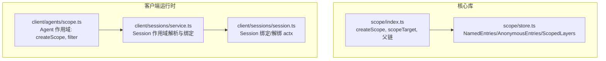
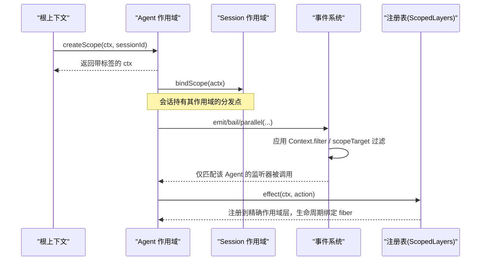
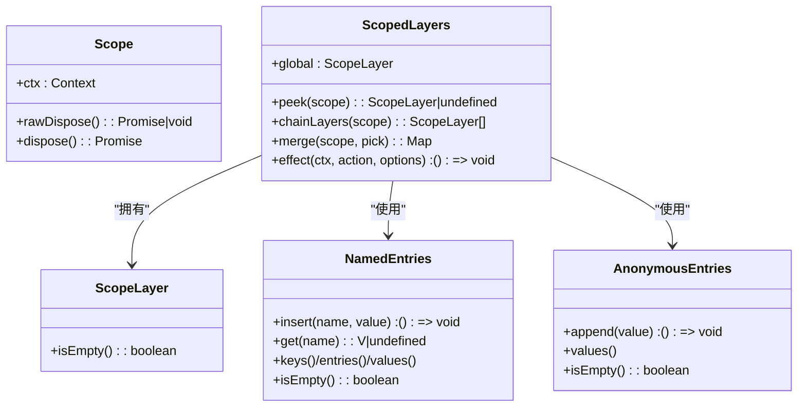
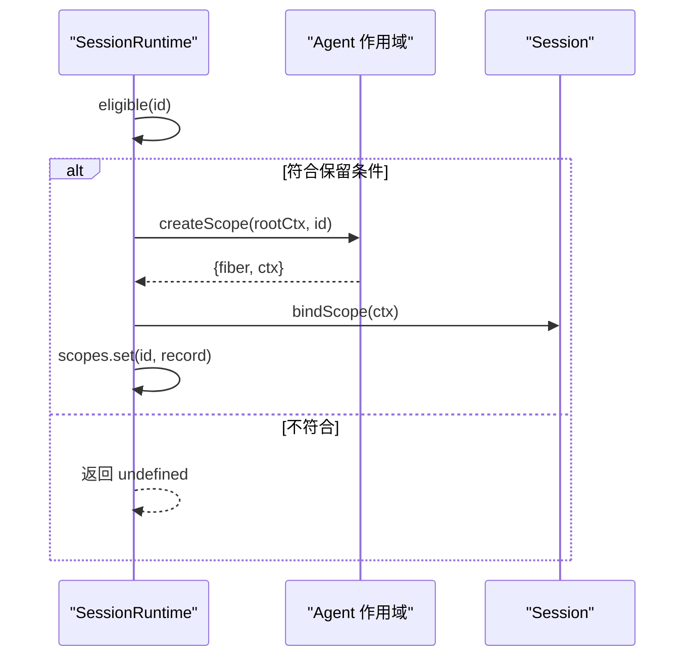
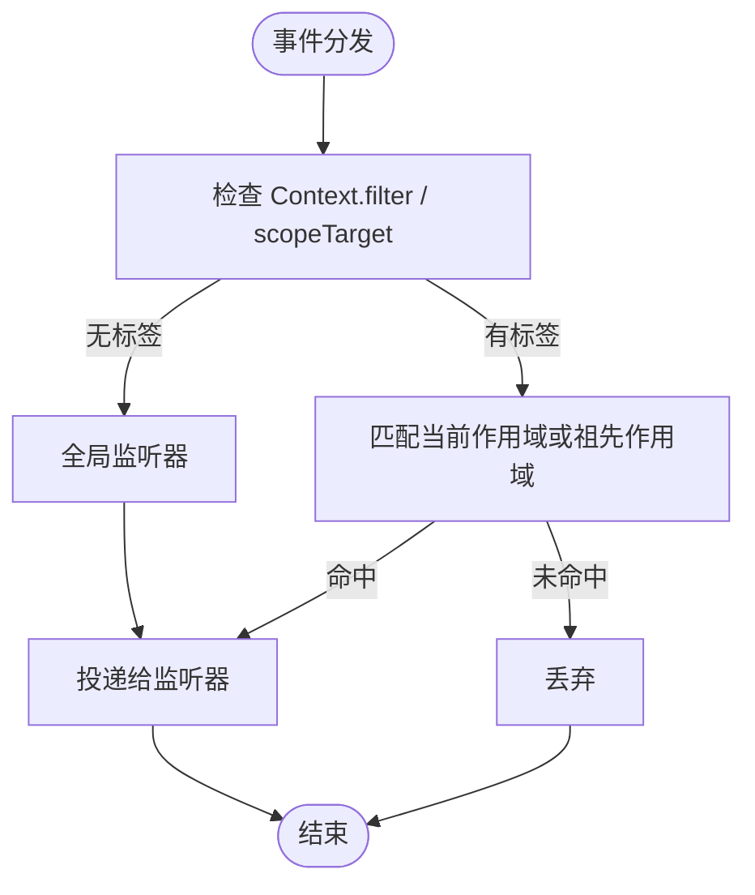
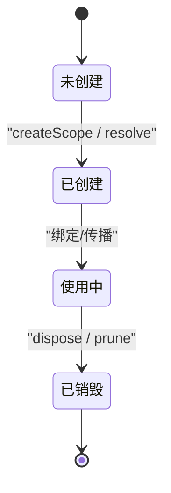
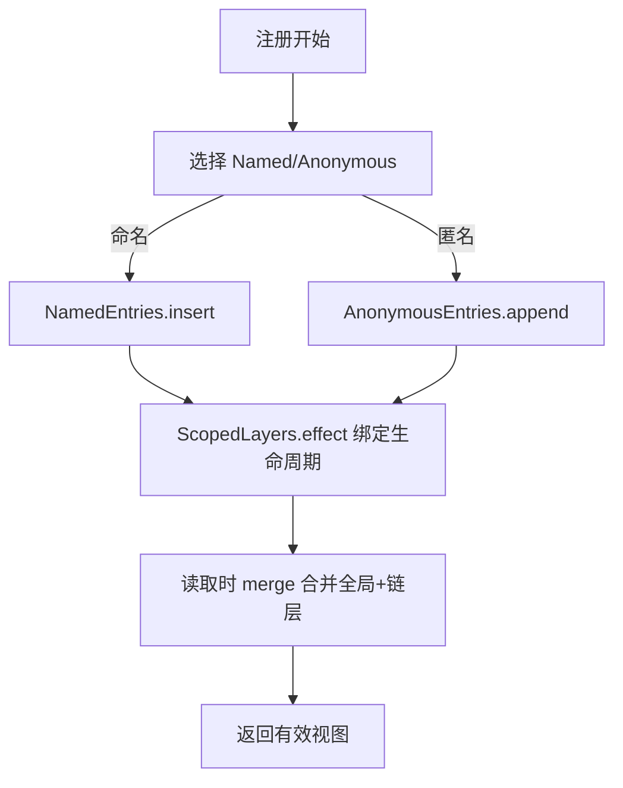
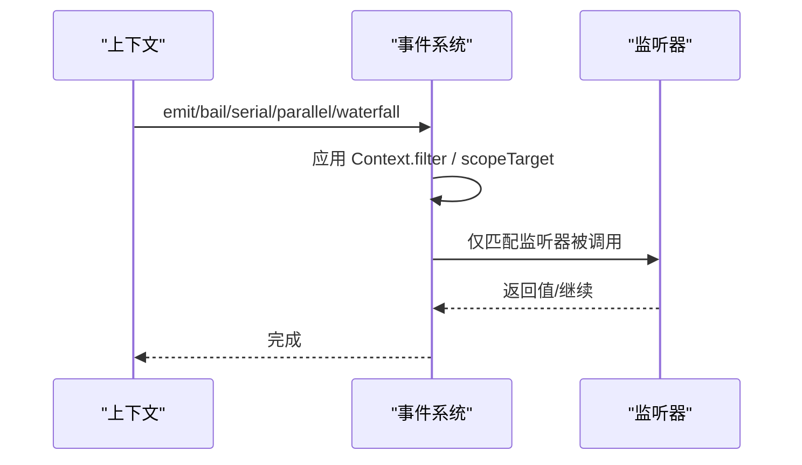
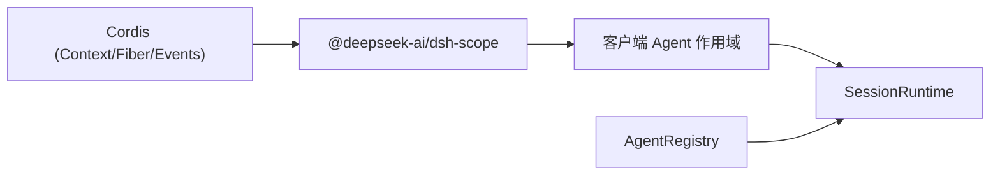

# 作用域隔离

<cite>
**本文引用的文件**
- [packages/core/scope/src/index.ts](file://packages/core/scope/src/index.ts)
- [packages/core/scope/src/store.ts](file://packages/core/scope/src/store.ts)
- [packages/client/runtime/src/client/agents/scope.ts](file://packages/client/runtime/src/client/agents/scope.ts)
- [packages/client/runtime/src/client/sessions/service.ts](file://packages/client/runtime/src/client/sessions/service.ts)
- [packages/client/runtime/src/client/sessions/session.ts](file://packages/client/runtime/src/client/sessions/session.ts)
- [packages/core/agent/src/index.ts](file://packages/core/agent/src/index.ts)
- [packages/core/scope/tests/scope.spec.ts](file://packages/core/scope/tests/scope.spec.ts)
- [packages/core/agent-loop/tests/scope-lifecycle.spec.ts](file://packages/core/agent-loop/tests/scope-lifecycle.spec.ts)
- [docs/subsystems/scope.md](file://docs/subsystems/scope.md)
- [docs/cordis-api/events.md](file://docs/cordis-api/events.md)
- [docs/cordis-api/registry.md](file://docs/cordis-api/registry.md)
- [docs/cordis-api/service.md](file://docs/cordis-api/service.md)
</cite>

## 目录
1. [简介](#简介)
2. [项目结构](#项目结构)
3. [核心组件](#核心组件)
4. [架构总览](#架构总览)
5. [详细组件分析](#详细组件分析)
6. [依赖关系分析](#依赖关系分析)
7. [性能考量](#性能考量)
8. [故障排除指南](#故障排除指南)
9. [结论](#结论)
10. [附录：最佳实践与示例路径](#附录最佳实践与示例路径)

## 简介
本文件系统化阐述 DeepSeek Harness 的作用域（Scope）隔离机制，聚焦以下目标：
- 解释 Scope 的核心概念、工作原理与作用域层次（根作用域、Agent 作用域、会话作用域）。
- 说明如何通过作用域实现按 Agent 隔离的注册表与服务实例。
- 文档化作用域的生命周期管理：创建、传播、销毁。
- 说明作用域内的服务注册与发现机制，以及跨作用域的可见性与继承规则。
- 结合事件系统与上下文传递，说明作用域如何参与事件路由与过滤。
- 提供最佳实践、性能优化建议与常见问题排查方法。

## 项目结构
作用域机制由“核心库”和“客户端运行时”两部分组成：
- 核心库（@deepseek-ai/dsh-scope）：提供通用的作用域原语、层级存储与事件路由载体。
- 客户端运行时：为每个 Agent 建立独立的 Agent 作用域，并与 Session 绑定，用于事件与服务的按会话隔离。

图表来源
- [packages/core/scope/src/index.ts:137-147](file://packages/core/scope/src/index.ts#L137-L147)
- [packages/core/scope/src/store.ts:159-267](file://packages/core/scope/src/store.ts#L159-L267)
- [packages/client/runtime/src/client/agents/scope.ts:55-68](file://packages/client/runtime/src/client/agents/scope.ts#L55-L68)
- [packages/client/runtime/src/client/sessions/service.ts:625-657](file://packages/client/runtime/src/client/sessions/service.ts#L625-L657)
- [packages/client/runtime/src/client/sessions/session.ts:164-182](file://packages/client/runtime/src/client/sessions/session.ts#L164-L182)

章节来源
- [docs/subsystems/scope.md:1-60](file://docs/subsystems/scope.md#L1-L60)

## 核心组件
- ScopeKey 与 Scoped<T>：不透明的作用域键与仅用于路由的事件载体类型。
- createScope：在给定 Context 下创建一个带标签的子 Fiber 与扩展后的 Context，并返回可处置的作用域句柄。
- scopeTarget：为事件分发构建带作用域过滤的载体，使监听器可按祖先/后代关系接收事件。
- ScopedLayers：维护全局层与精确作用域层的注册表聚合，支持合并、链式覆盖与惰性创建。
- Agent 作用域：客户端侧基于 SessionId 的轻量作用域，通过 Context.filter 将事件限制到当前 Agent。
- Session 作用域绑定：SessionRuntime 负责按需创建并绑定 Agent 作用域，随会话存活期管理。

章节来源
- [packages/core/scope/src/index.ts:14-27](file://packages/core/scope/src/index.ts#L14-L27)
- [packages/core/scope/src/index.ts:137-147](file://packages/core/scope/src/index.ts#L137-L147)
- [packages/core/scope/src/index.ts:170-185](file://packages/core/scope/src/index.ts#L170-L185)
- [packages/core/scope/src/store.ts:159-267](file://packages/core/scope/src/store.ts#L159-L267)
- [packages/client/runtime/src/client/agents/scope.ts:23-41](file://packages/client/runtime/src/client/agents/scope.ts#L23-L41)
- [packages/client/runtime/src/client/agents/scope.ts:55-68](file://packages/client/runtime/src/client/agents/scope.ts#L55-L68)
- [packages/client/runtime/src/client/sessions/service.ts:625-657](file://packages/client/runtime/src/client/sessions/service.ts#L625-L657)
- [packages/client/runtime/src/client/sessions/session.ts:164-182](file://packages/client/runtime/src/client/sessions/session.ts#L164-L182)

## 架构总览
作用域隔离围绕“上下文标签 + 事件过滤器 + 注册表分层”三要素展开：
- 上下文标签：每个作用域通过 Context 扩展写入一个不可见的 key，标识当前作用域。
- 事件过滤器：通过 CordisContext.filter 或 scopeTarget 的 carrier，决定哪些监听器能收到事件。
- 注册表分层：ScopedLayers 将全局与精确作用域层组合，实现“近者优先”的覆盖语义。

图表来源
- [packages/client/runtime/src/client/agents/scope.ts:55-68](file://packages/client/runtime/src/client/agents/scope.ts#L55-L68)
- [packages/client/runtime/src/client/sessions/session.ts:164-182](file://packages/client/runtime/src/client/sessions/session.ts#L164-L182)
- [docs/cordis-api/events.md:125-187](file://docs/cordis-api/events.md#L125-L187)
- [packages/core/scope/src/store.ts:226-267](file://packages/core/scope/src/store.ts#L226-L267)

## 详细组件分析

### 作用域原语与层级存储
- createScope：以无操作插件 Fiber 作为作用域边界，扩展 Context 写入作用域标记；dispose 会等待 fiber 完成异步清理。
- scopeParentOf/scopeChainOf：维护作用域键之间的父子关系，形成从子到根的链，用于事件向上继承与注册表向下继承。
- scopeTarget：构造仅用于路由的载体，保留基础过滤条件，并在分发时允许“祖先监听器接收后代事件”。
- ScopedLayers：
  - global：全局层，始终存在。
  - scoped：按作用域键懒创建的精确层。
  - chainLayers：沿父链收集已有层，远祖先在前，精确作用域在后。
  - merge：将全局与链上层合并为有效映射，近者优先。
  - effect：将同步变更绑定到当前作用域的 fiber 生命周期，自动清理空层。

图表来源
- [packages/core/scope/src/index.ts:105-112](file://packages/core/scope/src/index.ts#L105-L112)
- [packages/core/scope/src/store.ts:11-15](file://packages/core/scope/src/store.ts#L11-L15)
- [packages/core/scope/src/store.ts:30-105](file://packages/core/scope/src/store.ts#L30-L105)
- [packages/core/scope/src/store.ts:114-150](file://packages/core/scope/src/store.ts#L114-L150)
- [packages/core/scope/src/store.ts:159-267](file://packages/core/scope/src/store.ts#L159-L267)

章节来源
- [packages/core/scope/src/index.ts:137-147](file://packages/core/scope/src/index.ts#L137-L147)
- [packages/core/scope/src/index.ts:170-185](file://packages/core/scope/src/index.ts#L170-L185)
- [packages/core/scope/src/store.ts:159-267](file://packages/core/scope/src/store.ts#L159-L267)

### 客户端 Agent 作用域与会话绑定
- Agent 作用域：基于 SessionId 的轻量作用域，通过 Context.filter 将事件限制到当前 Agent。
- SessionRuntime：
  - resolve(id)：若会话符合条件（主机列表或当前地址），则创建并绑定 Agent 作用域，缓存记录。
  - eligible(id)：判断是否应保留作用域（当前会话或已列入宿主列表）。
- Session：持有 actx 绑定，支持 bindScope/unbindScope，确保作用域与实例生命周期一致。

图表来源
- [packages/client/runtime/src/client/sessions/service.ts:625-657](file://packages/client/runtime/src/client/sessions/service.ts#L625-L657)
- [packages/client/runtime/src/client/agents/scope.ts:55-68](file://packages/client/runtime/src/client/agents/scope.ts#L55-L68)
- [packages/client/runtime/src/client/sessions/session.ts:164-182](file://packages/client/runtime/src/client/sessions/session.ts#L164-L182)

章节来源
- [packages/client/runtime/src/client/sessions/service.ts:534-568](file://packages/client/runtime/src/client/sessions/service.ts#L534-L568)
- [packages/client/runtime/src/client/sessions/service.ts:625-657](file://packages/client/runtime/src/client/sessions/service.ts#L625-L657)
- [packages/client/runtime/src/client/sessions/session.ts:164-182](file://packages/client/runtime/src/client/sessions/session.ts#L164-L182)

### 作用域层次结构与继承关系
- 根作用域：未携带任何作用域标记的上下文，默认接收所有事件（除非被显式过滤）。
- Agent 作用域：以 SessionId 为键，事件仅路由到同 Agent 的监听器与全局监听器。
- 会话作用域：与 Agent 作用域一一对应，通过 SessionRuntime 管理其创建与销毁。
- 父链与事件继承：scopeTarget 允许“祖先监听器接收后代事件”，即事件向上传播至祖先作用域；注册表合并时“近者优先”。

图表来源
- [packages/core/scope/src/index.ts:170-185](file://packages/core/scope/src/index.ts#L170-L185)
- [packages/client/runtime/src/client/agents/scope.ts:55-68](file://packages/client/runtime/src/client/agents/scope.ts#L55-L68)

章节来源
- [packages/core/scope/src/index.ts:32-59](file://packages/core/scope/src/index.ts#L32-L59)
- [packages/core/scope/src/index.ts:98-102](file://packages/core/scope/src/index.ts#L98-L102)

### 生命周期管理：创建、传播与销毁
- 创建：
  - 核心库：createScope 创建无操作 Fiber，扩展 Context 写入作用域标记。
  - 客户端：SessionRuntime.resolve 根据 eligibility 创建并绑定 Agent 作用域。
- 传播：
  - 通过 Context.extend 继承最近的作用域标记。
  - 事件分发通过 filter/carrier 进行作用域判定。
- 销毁：
  - dispose 等待 fiber 完成异步清理，ScopedLayers 在层为空时回收。
  - SessionRuntime 在会话不在列表或不再被引用时释放作用域。

图表来源
- [packages/core/scope/src/index.ts:137-147](file://packages/core/scope/src/index.ts#L137-L147)
- [packages/client/runtime/src/client/sessions/service.ts:625-657](file://packages/client/runtime/src/client/sessions/service.ts#L625-L657)
- [packages/core/scope/src/store.ts:226-267](file://packages/core/scope/src/store.ts#L226-L267)

章节来源
- [packages/core/scope/src/index.ts:115-118](file://packages/core/scope/src/index.ts#L115-L118)
- [packages/core/scope/src/store.ts:226-267](file://packages/core/scope/src/store.ts#L226-L267)

### 服务注册与发现机制
- 注册：
  - 通过 ScopedLayers.effect 将变更绑定到当前作用域的 fiber 生命周期。
  - NamedEntries/AnonymousEntries 分别处理命名与匿名条目，支持插入顺序与独立身份。
- 发现：
  - merge 将全局与链上层合并，近者优先。
  - peek 仅读取精确作用域层，避免意外继承。
- 隔离：
  - 不同 Agent 的作用域层相互独立，互不影响。
  - 事件分发通过 filter/carrier 限制到对应 Agent。

图表来源
- [packages/core/scope/src/store.ts:30-105](file://packages/core/scope/src/store.ts#L30-L105)
- [packages/core/scope/src/store.ts:114-150](file://packages/core/scope/src/store.ts#L114-L150)
- [packages/core/scope/src/store.ts:208-217](file://packages/core/scope/src/store.ts#L208-L217)
- [packages/core/scope/src/store.ts:226-267](file://packages/core/scope/src/store.ts#L226-L267)

章节来源
- [packages/core/scope/src/store.ts:159-267](file://packages/core/scope/src/store.ts#L159-L267)

### 与事件系统和上下文传递的集成
- 事件分发模式：emit、bail、serial、parallel、waterfall，均受 Context.filter 与 scopeTarget 影响。
- 上下文传播：通过 Context.extend 继承最近的作用域标记；事件监听器通过 scopeOf 获取自身作用域。
- 安全校验：invariant 安装器会在内部分发钩子中检查 scope-filtered 事件是否正确使用了 carrier。

图表来源
- [docs/cordis-api/events.md:8-187](file://docs/cordis-api/events.md#L8-L187)
- [packages/core/scope/src/index.ts:170-185](file://packages/core/scope/src/index.ts#L170-L185)

章节来源
- [docs/cordis-api/events.md:125-187](file://docs/cordis-api/events.md#L125-L187)
- [packages/core/scope/src/invariant.ts:15-41](file://packages/core/scope/src/invariant.ts#L15-L41)

## 依赖关系分析
- 核心库依赖 Cordis 的 Context/Fiber/Events，提供通用作用域能力。
- 客户端运行时依赖核心库，封装 Agent 作用域与会话绑定逻辑。
- AgentRegistry 与 SessionRuntime 协作，确保 Agent 与 Session 的生命周期与作用域一致。

图表来源
- [packages/core/scope/src/index.ts:8-10](file://packages/core/scope/src/index.ts#L8-L10)
- [packages/client/runtime/src/client/agents/scope.ts:18-21](file://packages/client/runtime/src/client/agents/scope.ts#L18-L21)
- [packages/client/runtime/src/client/sessions/service.ts:625-657](file://packages/client/runtime/src/client/sessions/service.ts#L625-L657)
- [packages/core/agent/src/index.ts:158-171](file://packages/core/agent/src/index.ts#L158-L171)

章节来源
- [packages/core/agent/src/index.ts:578-617](file://packages/core/agent/src/index.ts#L578-L617)

## 性能考量
- 惰性创建：ScopedLayers 仅在需要时创建精确作用域层，减少内存占用。
- 快速路径：scopeTarget 的 filter 优先检查基础过滤与无标签情况，降低开销。
- 迭代稳定性：Named/AnonymousEntries 的迭代器在单次生成期间稳定，避免重复分配。
- 作用域粒度：尽量使用最小必要的作用域范围，避免过细粒度的作用域导致过多层合并。

[本节为通用指导，无需具体文件来源]

## 故障排除指南
- 事件未触发：
  - 确认使用了 scopeTarget 或正确的 Context.filter。
  - 检查监听器所在上下文的作用域是否与事件目标匹配或为其祖先。
- 作用域泄漏：
  - 确保 dispose 被调用，且 ScopedLayers 层为空时会被回收。
  - 检查 SessionRuntime 的 eligible 条件，避免不必要的保留。
- 循环父链：
  - bindScopeParent/rebind 会检测并拒绝形成环的父链接。
- 重复注册：
  - NamedEntries 对同名条目抛出错误，需确保名称唯一。

章节来源
- [packages/core/scope/src/index.ts:54-59](file://packages/core/scope/src/index.ts#L54-L59)
- [packages/core/scope/src/store.ts:43-53](file://packages/core/scope/src/store.ts#L43-L53)
- [packages/core/scope/src/store.ts:226-267](file://packages/core/scope/src/store.ts#L226-L267)

## 结论
DeepSeek Harness 的作用域隔离机制通过“上下文标签 + 事件过滤器 + 注册表分层”实现了按 Agent 隔离的服务与事件路由。其设计兼顾了灵活性（祖先继承）、安全性（严格过滤）与性能（惰性创建与快速路径）。通过 SessionRuntime 的绑定与生命周期管理，确保了作用域与会话的一致性。遵循本文的最佳实践可有效避免常见陷阱并提升系统稳定性。

[本节为总结性内容，无需具体文件来源]

## 附录：最佳实践与示例路径
- 设计原则
  - 明确作用域边界：每个 Agent 应有独立作用域，避免跨 Agent 共享状态。
  - 使用最小作用域：仅在必要时创建作用域，减少层合并成本。
  - 利用祖先继承：在需要跨层级观察时使用 scopeTarget 的向上继承特性。
- 性能优化
  - 批量注册：在同一作用域内集中注册，减少多次 effect 调用。
  - 避免过度嵌套：保持作用域层级扁平，便于调试与维护。
- 故障排除
  - 使用 invariant 安装器捕获错误的事件分发方式。
  - 通过测试用例验证作用域行为与生命周期。

示例路径（不含代码内容）
- 创建与作用域传播：
  - [packages/core/scope/tests/scope.spec.ts:24-39](file://packages/core/scope/tests/scope.spec.ts#L24-L39)
- 作用域生命周期与重入场景：
  - [packages/core/agent-loop/tests/scope-lifecycle.spec.ts:623-693](file://packages/core/agent-loop/tests/scope-lifecycle.spec.ts#L623-L693)
- 服务注册与发现：
  - [packages/core/scope/src/store.ts:208-217](file://packages/core/scope/src/store.ts#L208-L217)
  - [packages/core/scope/src/store.ts:226-267](file://packages/core/scope/src/store.ts#L226-L267)
- 事件系统与上下文传递：
  - [docs/cordis-api/events.md:125-187](file://docs/cordis-api/events.md#L125-L187)
  - [packages/core/scope/src/index.ts:170-185](file://packages/core/scope/src/index.ts#L170-L185)

章节来源
- [packages/core/scope/tests/scope.spec.ts:24-39](file://packages/core/scope/tests/scope.spec.ts#L24-L39)
- [packages/core/agent-loop/tests/scope-lifecycle.spec.ts:623-693](file://packages/core/agent-loop/tests/scope-lifecycle.spec.ts#L623-L693)
- [packages/core/scope/src/store.ts:208-217](file://packages/core/scope/src/store.ts#L208-L217)
- [packages/core/scope/src/store.ts:226-267](file://packages/core/scope/src/store.ts#L226-L267)
- [docs/cordis-api/events.md:125-187](file://docs/cordis-api/events.md#L125-L187)
- [packages/core/scope/src/index.ts:170-185](file://packages/core/scope/src/index.ts#L170-L185)