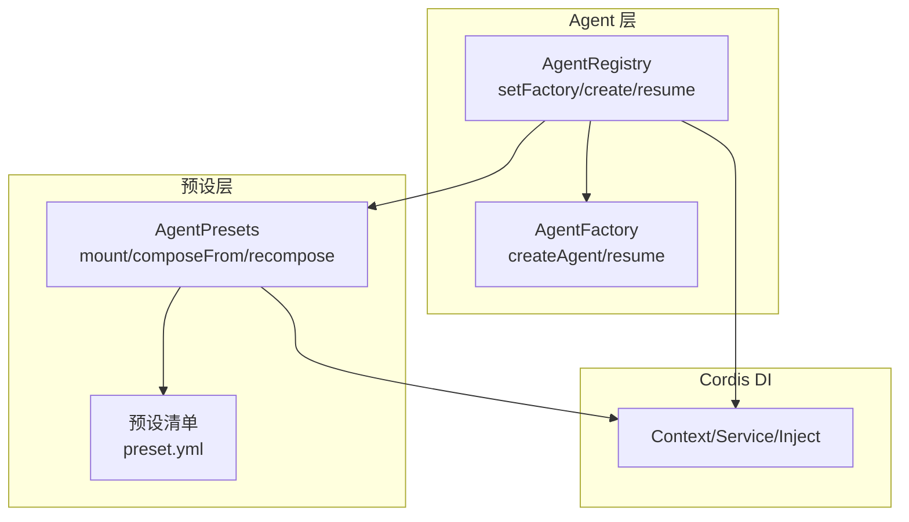
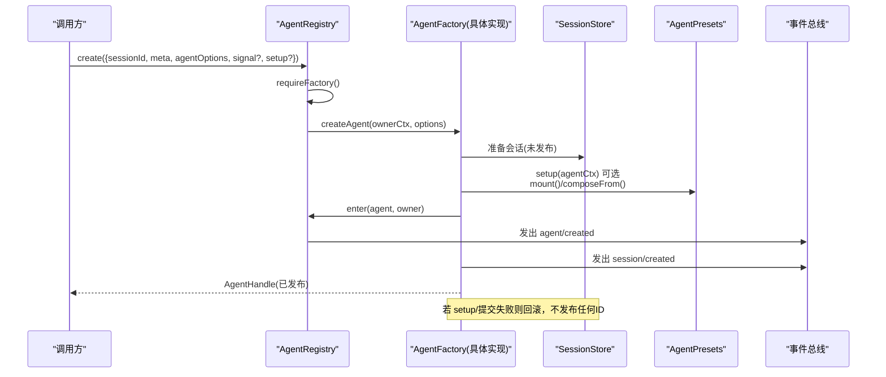
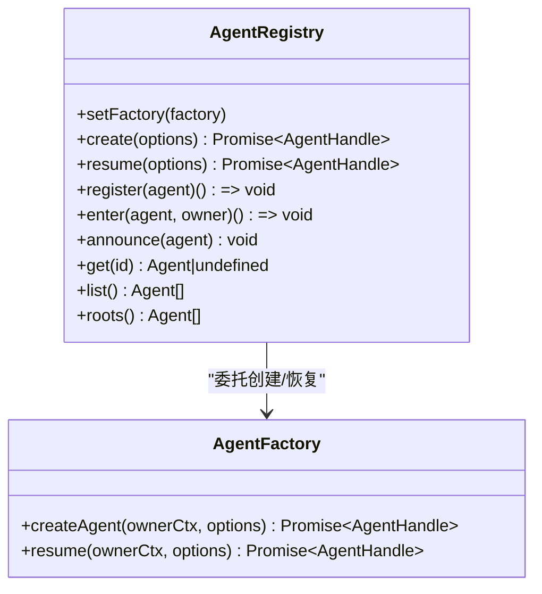
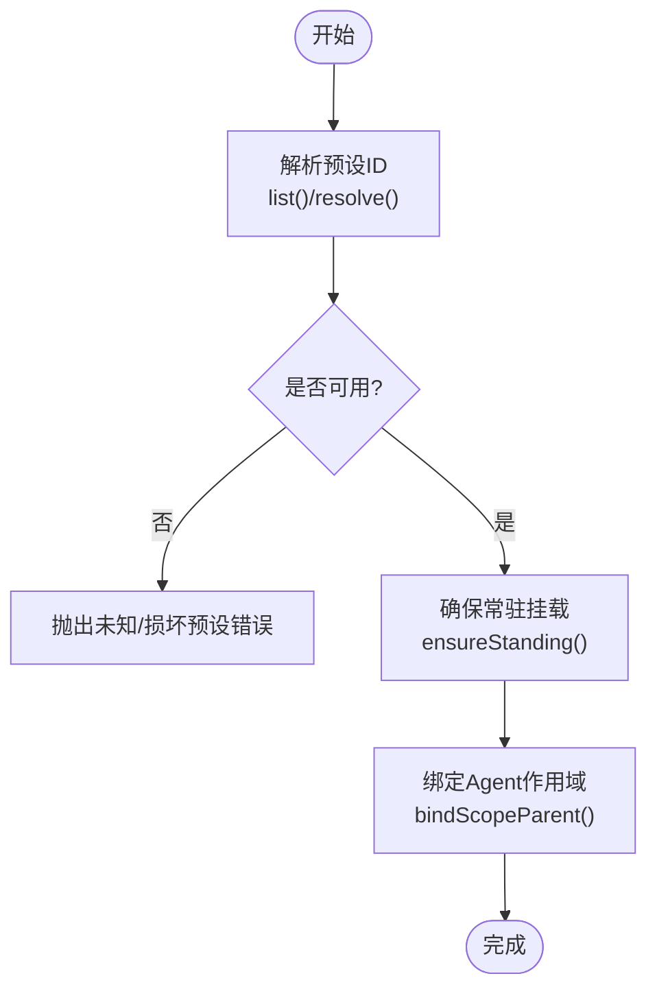
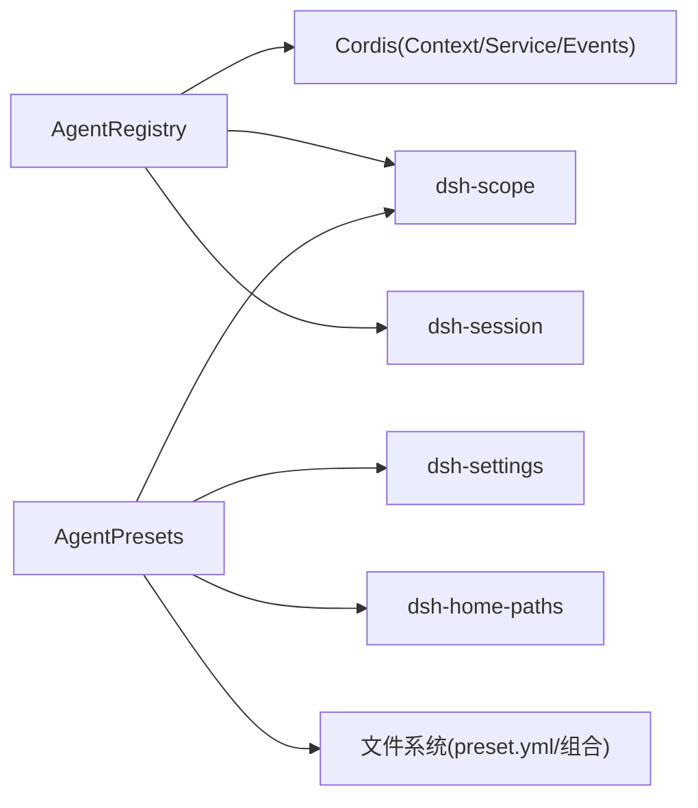
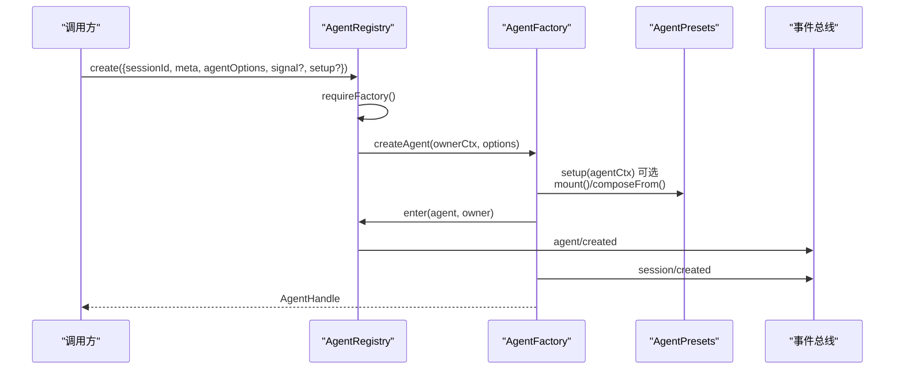

# 工厂模式

<cite>
**本文引用的文件**
- [packages/core/agent/src/index.ts](file://packages/core/agent/src/index.ts)
- [packages/core/agent/tests/agent.spec.ts](file://packages/core/agent/tests/agent.spec.ts)
- [packages/preset/agent-presets/src/index.ts](file://packages/preset/agent-presets/src/index.ts)
- [apps/cli/config/agent-presets/standard/preset.yml](file://apps/cli/config/agent-presets/standard/preset.yml)
- [apps/cli/config/agent-presets/minimal/preset.yml](file://apps/cli/config/agent-presets/minimal/preset.yml)
- [apps/cli/config/agent-presets/code/preset.yml](file://apps/cli/config/agent-presets/code/preset.yml)
- [apps/cli/config/agent-presets/cordis/preset.yml](file://apps/cli/config/agent-presets/cordis/preset.yml)
- [docs/cordis-api/registry.md](file://docs/cordis-api/registry.md)
- [docs/cordis-api/context.md](file://docs/cordis-api/context.md)
</cite>

## 目录
1. [简介](#简介)
2. [项目结构](#项目结构)
3. [核心组件](#核心组件)
4. [架构总览](#架构总览)
5. [详细组件分析](#详细组件分析)
6. [依赖关系分析](#依赖关系分析)
7. [性能考量](#性能考量)
8. [故障排查指南](#故障排查指南)
9. [结论](#结论)
10. [附录](#附录)

## 简介
本文件系统性梳理 DeepSeek Harness 中“工厂模式”在 Agent 创建中的应用。重点说明：
- 抽象工厂接口如何解耦 Agent 的具体实现，使上层仅依赖稳定契约；
- AgentRegistry 如何通过 setFactory/create/resume 完成参数校验、配置解析、依赖注入与初始化发布；
- 预设配置系统（Agent Presets）如何在工厂的 setup 阶段参与组合，快速生成标准化 Agent；
- 插件式扩展机制如何基于 Cordis 服务注册表实现可插拔的 Agent 类型；
- 工厂模式与依赖注入容器的集成方式，以及延迟初始化与资源管理策略；
- 最佳实践：设计原则、错误处理与性能优化建议。

## 项目结构
围绕工厂模式的关键代码分布在以下位置：
- 工厂抽象与注册中心：packages/core/agent/src/index.ts
- 工厂测试用例：packages/core/agent/tests/agent.spec.ts
- 预设配置与挂载：packages/preset/agent-presets/src/index.ts
- 内置预设元数据：apps/cli/config/agent-presets/*
- 依赖注入与上下文：docs/cordis-api/registry.md, docs/cordis-api/context.md

图表来源
- [packages/core/agent/src/index.ts:360-430](file://packages/core/agent/src/index.ts#L360-L430)
- [packages/preset/agent-presets/src/index.ts:275-325](file://packages/preset/agent-presets/src/index.ts#L275-L325)
- [docs/cordis-api/registry.md:1-153](file://docs/cordis-api/registry.md#L1-L153)

章节来源
- [packages/core/agent/src/index.ts:177-430](file://packages/core/agent/src/index.ts#L177-L430)
- [packages/preset/agent-presets/src/index.ts:75-182](file://packages/preset/agent-presets/src/index.ts#L75-L182)
- [docs/cordis-api/registry.md:1-153](file://docs/cordis-api/registry.md#L1-L153)

## 核心组件
- AgentFactory（抽象工厂）
  - createAgent(ownerCtx, options): 创建新 Agent 并返回拥有者句柄；
  - resume(ownerCtx, options): 从持久化会话恢复 Agent。
- AgentRegistry（工厂注册中心）
  - setFactory(factory): 注册唯一工厂，受 effect 作用域保护，支持 HMR 清理；
  - create(options)/resume(options): 通过 ownerCtx 将调用方上下文传递给工厂，保证所有权与追踪；
  - register/enter/announce: 控制 Agent 的生命周期发布与事件分发。
- AgentPresets（预设组合器）
  - mount(agentCtx, id?): 将 Agent 加入某预设的“常驻挂载”，使其工具、提示段、技能目录等可见；
  - composeFrom(agentCtx, parentCtx): 子 Agent 继承父 Agent 的预设组合；
  - recompose(agentCtx, id): 在安全边界内切换预设组合。

章节来源
- [packages/core/agent/src/index.ts:177-214](file://packages/core/agent/src/index.ts#L177-L214)
- [packages/core/agent/src/index.ts:360-430](file://packages/core/agent/src/index.ts#L360-L430)
- [packages/preset/agent-presets/src/index.ts:275-325](file://packages/preset/agent-presets/src/index.ts#L275-L325)

## 架构总览
下图展示从调用方到工厂再到预设组合的完整流程，强调上下文传递、事务性发布与回滚保障。

图表来源
- [packages/core/agent/src/index.ts:405-430](file://packages/core/agent/src/index.ts#L405-L430)
- [packages/preset/agent-presets/src/index.ts:275-325](file://packages/preset/agent-presets/src/index.ts#L275-L325)

章节来源
- [packages/core/agent/src/index.ts:405-430](file://packages/core/agent/src/index.ts#L405-L430)
- [packages/preset/agent-presets/src/index.ts:275-325](file://packages/preset/agent-presets/src/index.ts#L275-L325)

## 详细组件分析

### AgentRegistry：工厂注册与生命周期
- 工厂槽位与单例约束
  - setFactory 使用 effect 作用域注册，重复注册抛错；dispose 时清空槽位，支持热重载。
- 上下文追踪与所有权
  - create/resume 通过 getTraceable 将调用方 Context 绑定到工厂方法，确保 ownerCtx 携带 fiber/scope。
- 发布顺序与回滚
  - 先 enter（插入未发布条目），再 announce（发出 agent/created），最后由工厂发出 session/created；任一失败均回滚且不发布 ID。
- 启动器边界
  - withInitiator/withoutInitiator 提供进程级因果归属能力，便于日志、追踪与度量。

图表来源
- [packages/core/agent/src/index.ts:360-430](file://packages/core/agent/src/index.ts#L360-L430)
- [packages/core/agent/src/index.ts:177-214](file://packages/core/agent/src/index.ts#L177-L214)

章节来源
- [packages/core/agent/src/index.ts:360-430](file://packages/core/agent/src/index.ts#L360-L430)
- [packages/core/agent/src/index.ts:177-214](file://packages/core/agent/src/index.ts#L177-L214)

### AgentFactory：抽象工厂契约
- 职责边界
  - 负责会话准备、Agent 实例构造、setup 执行、发布顺序与回滚；
  - 接收 ownerCtx 以绑定调用方上下文，避免从工厂对象自身推断所有权。
- 典型实现要点（由 dsh-agent-loop 提供）
  - 创建未发布的 Agent 作用域；
  - 调用 AgentPresets.mount/composeFrom 完成预设组合；
  - 调用 AgentRegistry.enter/announce 完成发布；
  - 发出 session/created 与 agent/session-start；
  - 返回拥有者句柄，持有 dispose 能力。

章节来源
- [packages/core/agent/src/index.ts:177-214](file://packages/core/agent/src/index.ts#L177-L214)

### 预设配置系统：快速标准化 Agent
- 预设发现与默认值
  - 通过 roots 列表扫描 preset.yml，支持 system/user 信任级别；
  - defaultId 来自设置层，支持热更新。
- 挂载与继承
  - mount：将 Agent 的 scope key 绑定到预设的“常驻挂载”，使其可见工具、提示段、技能目录等；
  - composeFrom：子 Agent 直接继承父 Agent 的组合，避免重复装载；
  - recompose：在未产生历史的前提下切换预设组合。
- 内置预设示例
  - 标准模式、极简模式、PTC 模式、创造模式等，位于 apps/cli/config/agent-presets/*。

图表来源
- [packages/preset/agent-presets/src/index.ts:199-239](file://packages/preset/agent-presets/src/index.ts#L199-L239)
- [packages/preset/agent-presets/src/index.ts:275-325](file://packages/preset/agent-presets/src/index.ts#L275-L325)
- [packages/preset/agent-presets/src/index.ts:490-534](file://packages/preset/agent-presets/src/index.ts#L490-L534)

章节来源
- [packages/preset/agent-presets/src/index.ts:75-182](file://packages/preset/agent-presets/src/index.ts#L75-L182)
- [packages/preset/agent-presets/src/index.ts:199-239](file://packages/preset/agent-presets/src/index.ts#L199-L239)
- [packages/preset/agent-presets/src/index.ts:275-325](file://packages/preset/agent-presets/src/index.ts#L275-L325)
- [apps/cli/config/agent-presets/standard/preset.yml:1-4](file://apps/cli/config/agent-presets/standard/preset.yml#L1-L4)
- [apps/cli/config/agent-presets/minimal/preset.yml:1-4](file://apps/cli/config/agent-presets/minimal/preset.yml#L1-L4)
- [apps/cli/config/agent-presets/code/preset.yml:1-4](file://apps/cli/config/agent-presets/code/preset.yml#L1-L4)
- [apps/cli/config/agent-presets/cordis/preset.yml:1-4](file://apps/cli/config/agent-presets/cordis/preset.yml#L1-L4)

### 工厂模式与依赖注入容器集成
- 通过 Cordis 的 Service/Inject/Context 机制，工厂可在其作用域内声明依赖；
- AgentRegistry.create/resume 将 ownerCtx 传入工厂，使工厂能读取调用方的依赖树；
- 预设挂载通过 dsh-scope 的作用域键将 Agent 与预设组合关联，形成“按会话隔离”的服务视图；
- 插件可通过 ctx.provide/inject 暴露/消费服务，工厂与预设共同决定最终装配。

章节来源
- [docs/cordis-api/registry.md:1-153](file://docs/cordis-api/registry.md#L1-L153)
- [docs/cordis-api/context.md:235-284](file://docs/cordis-api/context.md#L235-L284)
- [packages/preset/agent-presets/src/index.ts:120-152](file://packages/preset/agent-presets/src/index.ts#L120-L152)

### 扩展与自定义：插件式 Agent
- 替换工厂：通过 setFactory 注入自定义 AgentFactory，实现不同驱动或协议（如 ACP、JSON-RPC、Headless）；
- 扩展预设：新增 preset.yml 与组合文件，通过 mount 接入；
- 扩展服务：在插件中 ctx.provide 新服务，工厂/setup 中按需注入；
- 测试与验证：参考 tests 中的 stubFactory 与断言，确保工厂行为符合预期。

章节来源
- [packages/core/agent/tests/agent.spec.ts:358-404](file://packages/core/agent/tests/agent.spec.ts#L358-L404)
- [packages/preset/agent-presets/src/index.ts:380-416](file://packages/preset/agent-presets/src/index.ts#L380-L416)

## 依赖关系分析
- AgentRegistry 依赖：
  - Cordis Context/Service/Events（生命周期、事件分发、作用域）；
  - dsh-scope（作用域键绑定，用于预设挂载）；
  - dsh-session（会话 ID、事件类型等）。
- AgentPresets 依赖：
  - dsh-settings（默认预设设置）；
  - dsh-home-paths（用户目录路径）；
  - dsh-scope（作用域绑定与常驻挂载）。
- 外部依赖：
  - 文件系统（读取 preset.yml、组合文件）；
  - 事件总线（session/created、agent/created、agent/disposed）。

图表来源
- [packages/core/agent/src/index.ts:8-24](file://packages/core/agent/src/index.ts#L8-L24)
- [packages/preset/agent-presets/src/index.ts:24-37](file://packages/preset/agent-presets/src/index.ts#L24-L37)

章节来源
- [packages/core/agent/src/index.ts:8-24](file://packages/core/agent/src/index.ts#L8-L24)
- [packages/preset/agent-presets/src/index.ts:24-37](file://packages/preset/agent-presets/src/index.ts#L24-L37)

## 性能考量
- 常驻挂载缓存：AgentPresets.ensureStanding 对同一预设的挂载进行单次飞行与缓存，避免重复装载；
- 文件变更检测：通过 compositionStamp（mtimeMs/size）感知组合文件变化，触发重新装载；
- 作用域绑定开销：bindScopeParent 为轻量操作，但应避免频繁 recompose；
- 事件派发：announce 同步派发 agent/created，需避免在监听器中进行昂贵计算；
- 并发创建：同一 ID 的并发创建不被支持，需在调用侧去重或排队。

[本节为通用指导，无需特定文件引用]

## 故障排查指南
- 未注册工厂
  - 现象：调用 create/resume 时报“no agent factory registered”；
  - 排查：确认已加载包含 AgentFactory 实现的插件，并在 effect 作用域内调用 setFactory。
- 重复注册工厂
  - 现象：setFactory 抛错“already registered”；
  - 排查：确保每个作用域只注册一次；HMR 场景下注意 dispose 清理。
- 未加入预设
  - 现象：Agent 发布后无工具/技能；
  - 排查：在工厂 setup 中调用 AgentPresets.mount/composeFrom；检查作用域键是否存在。
- 预设不可用
  - 现象：resolveMountable 抛错“unknown/broken preset”；
  - 排查：检查 preset.yml 与组合文件是否可读、语法正确。
- 发布失败回滚
  - 现象：setup 或提交失败导致未发布；
  - 排查：查看 setup 与 commit 逻辑，确保无异常；确认 enter/announce 顺序。

章节来源
- [packages/core/agent/src/index.ts:372-394](file://packages/core/agent/src/index.ts#L372-L394)
- [packages/core/agent/src/index.ts:405-430](file://packages/core/agent/src/index.ts#L405-L430)
- [packages/preset/agent-presets/src/index.ts:233-239](file://packages/preset/agent-presets/src/index.ts#L233-L239)

## 结论
DeepSeek Harness 通过 AgentFactory 抽象与 AgentRegistry 注册中心，将 Agent 的创建、恢复与发布流程标准化，并与 Cordis 依赖注入和 dsh-scope 作用域体系深度集成。预设配置系统在工厂 setup 阶段介入，使得通过少量配置即可快速生成具备一致能力的 Agent。结合插件机制，系统实现了高度可扩展的 Agent 生态。遵循本文的最佳实践，可以在保证稳定性与可维护性的同时，高效扩展新的 Agent 类型与能力。

[本节为总结，无需特定文件引用]

## 附录

### 工厂工作流时序（含参数校验与发布）

图表来源
- [packages/core/agent/src/index.ts:405-430](file://packages/core/agent/src/index.ts#L405-L430)
- [packages/preset/agent-presets/src/index.ts:275-325](file://packages/preset/agent-presets/src/index.ts#L275-L325)

### 自定义工厂与复杂创建逻辑示例（路径指引）
- 参考测试中的 stubFactory 实现，了解最小可用的 createAgent/resume 实现；
- 在工厂中调用 AgentPresets.mount/composeFrom 完成预设组合；
- 在工厂中调用 AgentRegistry.enter/announce 完成发布；
- 在 setup 中实现复杂初始化逻辑（如工具注册、提示段组装、权限策略注入）。

章节来源
- [packages/core/agent/tests/agent.spec.ts:358-404](file://packages/core/agent/tests/agent.spec.ts#L358-L404)
- [packages/preset/agent-presets/src/index.ts:275-325](file://packages/preset/agent-presets/src/index.ts#L275-L325)

### 预设模板速查
- 标准模式：功能完整的编码 Agent，支持文件编辑、Shell、检索、Skills、计划、目标、子代理与工作流；
- 极简模式：仅提供持久 bash 与 str_replace_editor 的双工具编码 Agent；
- PTC 模式：在标准能力基础上，通过 Code Mode SDK 呈现工具，让模型用 TypeScript 程序组合多步操作；
- 创造模式：用于创建自定义 Agent preset，具备标准模式全部能力并提供运行时检查、插件实验与创作指导。

章节来源
- [apps/cli/config/agent-presets/standard/preset.yml:1-4](file://apps/cli/config/agent-presets/standard/preset.yml#L1-L4)
- [apps/cli/config/agent-presets/minimal/preset.yml:1-4](file://apps/cli/config/agent-presets/minimal/preset.yml#L1-L4)
- [apps/cli/config/agent-presets/code/preset.yml:1-4](file://apps/cli/config/agent-presets/code/preset.yml#L1-L4)
- [apps/cli/config/agent-presets/cordis/preset.yml:1-4](file://apps/cli/config/agent-presets/cordis/preset.yml#L1-L4)