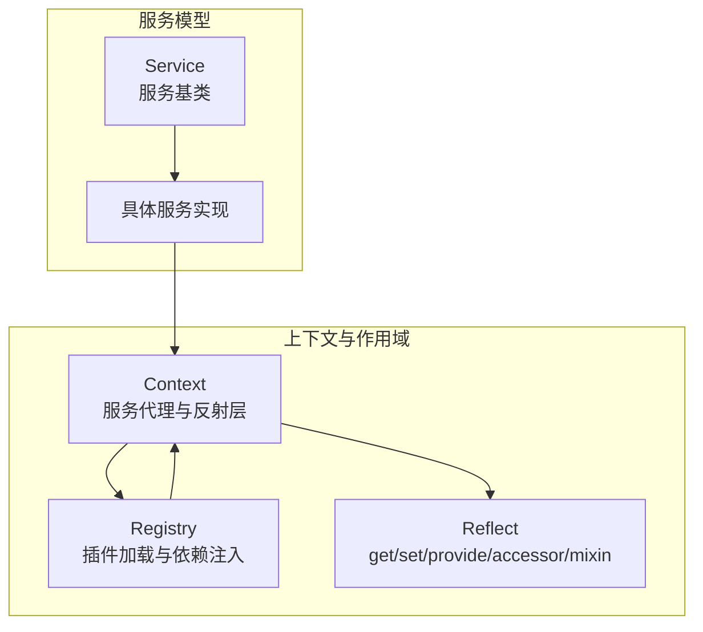
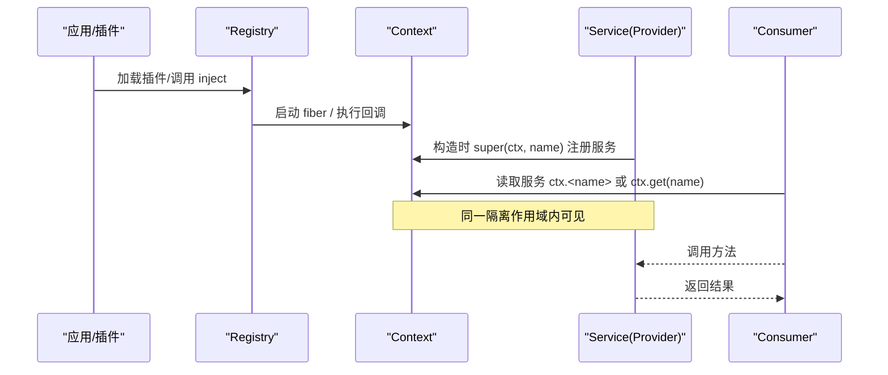
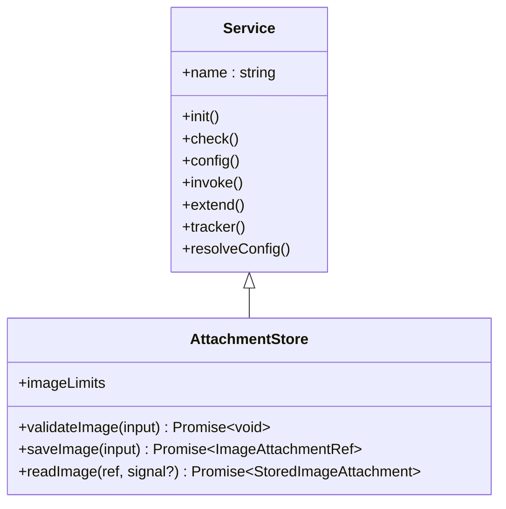
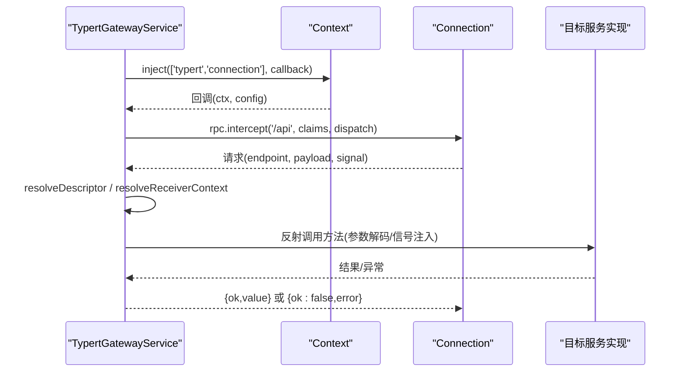
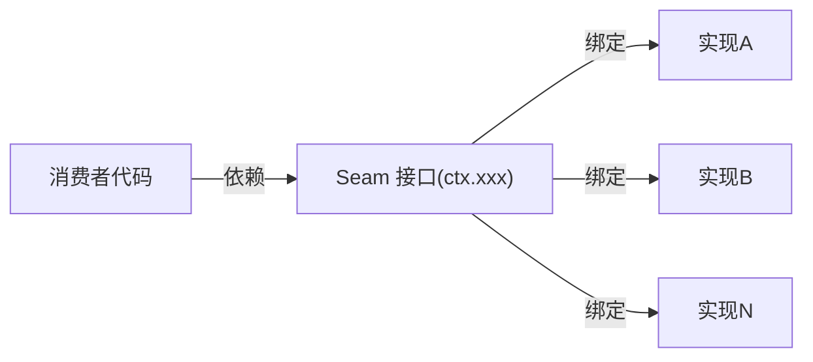
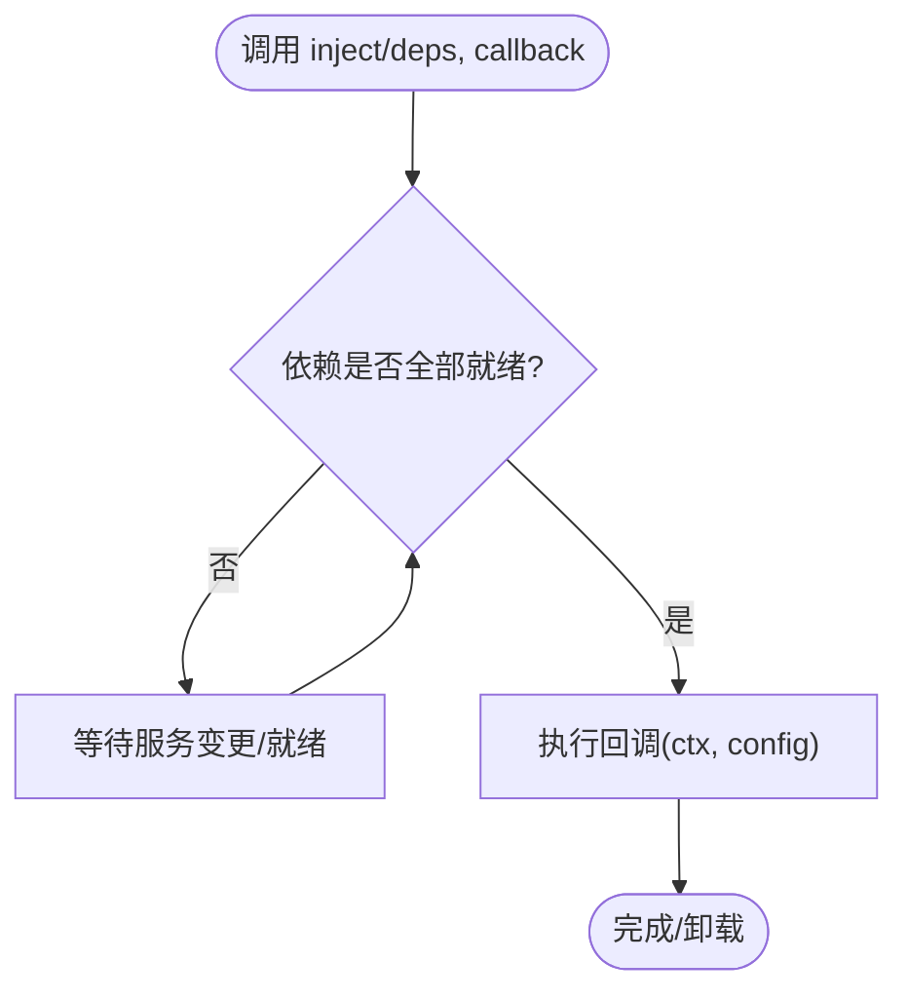
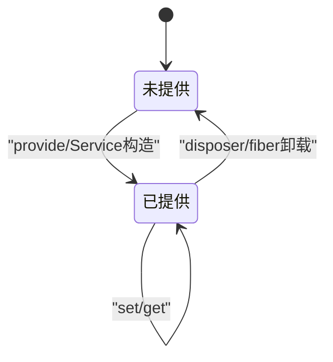
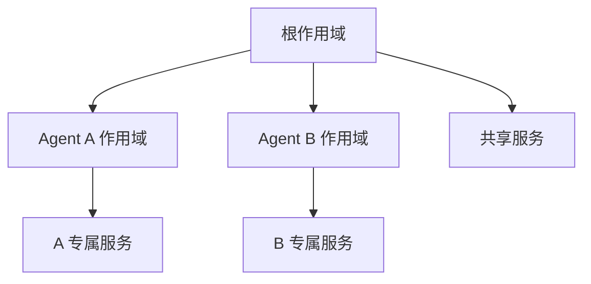
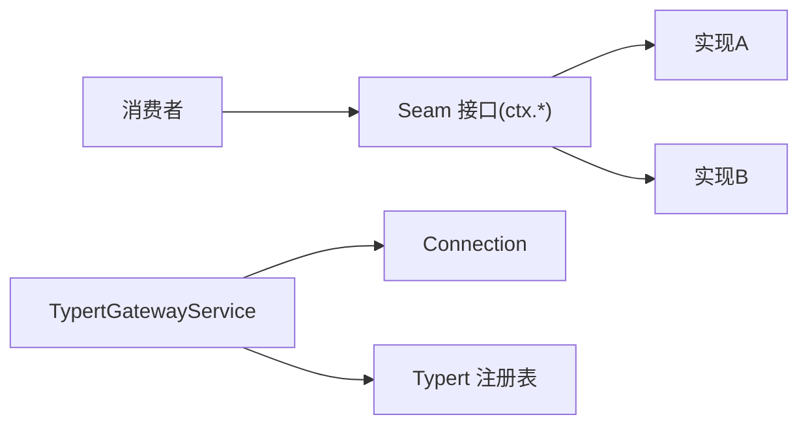

# 服务定位器模式

<cite>
**本文引用的文件**
- [context.md](file://docs/cordis-api/context.md)
- [service.md](file://docs/cordis-api/service.md)
- [registry.md](file://docs/cordis-api/registry.md)
- [capability-seams.md](file://docs/capability-seams.md)
- [scope.md](file://docs/subsystems/scope.md)
- [attachment/index.ts](file://packages/attachment/attachment/src/index.ts)
- [api-gateway/index.ts](file://packages/api/gateway/src/index.ts)
</cite>

## 目录
1. [简介](#简介)
2. [项目结构](#项目结构)
3. [核心组件](#核心组件)
4. [架构总览](#架构总览)
5. [详细组件分析](#详细组件分析)
6. [依赖关系分析](#依赖关系分析)
7. [性能考量](#性能考量)
8. [故障排查指南](#故障排查指南)
9. [结论](#结论)
10. [附录：最佳实践](#附录：最佳实践)

## 简介
本文件系统性阐述 DeepSeek Harness 中基于 Cordis 的服务定位器模式。围绕 Service Definition（服务定义）、Service Provider（服务提供者）与 Consumer（消费者）三角色，解释 ctx 上下文对象如何作为服务注册表，实现键值映射、依赖注入与服务生命周期管理；并通过 Capability Seams（能力接缝）展示如何通过接口抽象实现可插拔架构。同时说明 Scope 机制如何实现按 Agent 隔离的服务注册表，确保不同 Agent 实例之间的服务隔离。文末提供命名约定、依赖管理与错误处理的最佳实践。

## 项目结构
Cordis 将“服务”作为一等公民：服务通过基类声明名称并自动注册到 ctx；插件通过 registry 加载，使用 inject 声明依赖；ctx 提供 get/provide/accessor/mixin 等反射式能力，并以 extend/isolate/intercept 创建子作用域，形成分层、可组合的依赖容器。

**图表来源**
- [context.md:14-96](file://docs/cordis-api/context.md#L14-L96)
- [registry.md:8-56](file://docs/cordis-api/registry.md#L8-L56)
- [service.md:6-12](file://docs/cordis-api/service.md#L6-L12)

**章节来源**
- [context.md:14-96](file://docs/cordis-api/context.md#L14-L96)
- [registry.md:8-56](file://docs/cordis-api/registry.md#L8-L56)
- [service.md:6-12](file://docs/cordis-api/service.md#L6-L12)

## 核心组件
- Context（上下文）：服务代理与反射层，提供 get/set/provide/accessor/mixin，以及 extend/isolate/intercept 构建子作用域。
- Registry（注册表）：插件加载与依赖注入，支持函数/类/对象三种插件形态，inject 声明依赖并在可用时运行。
- Service（服务基类）：子类在构造时以名称注册到 ctx，随所属 fiber 生命周期自动移除。
- Reflect（反射层）：底层服务存储与访问器实现，支撑 ctx.get/provide/accessor/mixin。

这些组件共同构成“服务定位器”：消费者不直接持有实现，而是通过 ctx 按名称解析服务，从而解耦调用方与提供方。

**章节来源**
- [context.md:14-96](file://docs/cordis-api/context.md#L14-L96)
- [registry.md:8-56](file://docs/cordis-api/registry.md#L8-L56)
- [service.md:6-12](file://docs/cordis-api/service.md#L6-L12)
- [context.md:237-365](file://docs/cordis-api/context.md#L237-L365)

## 架构总览
下图展示了服务定位器在 Cordis 中的整体协作：插件通过 registry 加载，服务基类在构造时向 ctx 注册自身；消费者通过 ctx 获取服务，必要时通过 inject 等待依赖就绪；Scope 机制为每个 Agent 提供独立的注册视图。

**图表来源**
- [registry.md:8-56](file://docs/cordis-api/registry.md#L8-L56)
- [service.md:6-12](file://docs/cordis-api/service.md#L6-L12)
- [context.md:237-314](file://docs/cordis-api/context.md#L237-L314)

## 详细组件分析

### 服务定义与提供者：AttachmentStore
- 角色：服务定义（抽象接口）+ 提供者（具体实现）。
- 设计要点：
  - 继承 Service，在构造函数中以固定名称注册到 ctx（例如 attachments）。
  - 暴露稳定的能力边界（如 validateImage/saveImage/readImage），由部署选择具体后端。
  - 类型安全：通过模块扩展 Context 接口，使 ctx.attachments 具备强类型提示。

**图表来源**
- [service.md:14-103](file://docs/cordis-api/service.md#L14-L103)
- [attachment/index.ts:22-60](file://packages/attachment/attachment/src/index.ts#L22-L60)

**章节来源**
- [attachment/index.ts:22-60](file://packages/attachment/attachment/src/index.ts#L22-L60)
- [service.md:14-103](file://docs/cordis-api/service.md#L14-L103)

### 消费服务：TypertGatewayService
- 角色：消费者，通过 ctx.inject 声明依赖（如 typert、connection），并在依赖就绪后注册网关拦截器。
- 行为：
  - 监听内部事件清理状态。
  - 通过 connection.rpc.intercept 挂载 /api 路由，统一转发到 invoke。
  - 根据严格定义或 SRC 标记解析目标服务与方法，校验参数与返回值，调用实现并封装错误。

**图表来源**
- [api-gateway/index.ts:90-112](file://packages/api/gateway/src/index.ts#L90-L112)
- [api-gateway/index.ts:145-184](file://packages/api/gateway/src/index.ts#L145-L184)
- [api-gateway/index.ts:186-222](file://packages/api/gateway/src/index.ts#L186-L222)

**章节来源**
- [api-gateway/index.ts:90-112](file://packages/api/gateway/src/index.ts#L90-L112)
- [api-gateway/index.ts:145-184](file://packages/api/gateway/src/index.ts#L145-L184)
- [api-gateway/index.ts:186-222](file://packages/api/gateway/src/index.ts#L186-L222)

### 能力接缝（Capability Seams）
- 设计理念：将易变或可选的能力（如 LLM 适配器、设置后端、存储后端、Shell 执行器等）抽象为 ctx 上的 seam 服务，部署期选择具体实现，运行时消费者仅依赖稳定接口。
- 组织方式：文档以表格形式列出各 ctx key 的角色（seam/core/bundle）、所有者包、已知实现包与直接消费者，清晰表达“接口-实现-消费者”的解耦关系。

**图表来源**
- [capability-seams.md:412-469](file://docs/capability-seams.md#L412-L469)

**章节来源**
- [capability-seams.md:412-469](file://docs/capability-seams.md#L412-L469)

### 依赖注入与插件加载
- inject：声明所需服务，当所有依赖就绪时执行回调；若依赖变化，回调会卸载并重跑。
- plugin：加载函数/类/对象形式的插件，配置经 Schema 校验后启动，返回 Fiber 用于等待完成。
- 作用域：inject 与 plugin 均在当前 Context 作用域内解析依赖，结合 isolate/intercept 可实现细粒度覆盖。

**图表来源**
- [registry.md:8-33](file://docs/cordis-api/registry.md#L8-L33)
- [registry.md:35-56](file://docs/cordis-api/registry.md#L35-L56)

**章节来源**
- [registry.md:8-56](file://docs/cordis-api/registry.md#L8-L56)

### 服务注册表与生命周期
- 注册：Service 子类构造时立即注册到 ctx；provide 可由任意 fiber 注册服务，归属当前 fiber 生命周期。
- 访问：get 读取服务，strict=true 时仅返回当前活跃 fiber 提供的实现；accessor 定义计算属性；mixin 将服务成员混入 ctx。
- 生命周期：服务随 fiber 卸载自动移除；provide 返回 disposer 可显式注销；accessor/mixin 也随 fiber 卸载移除。

**图表来源**
- [context.md:237-365](file://docs/cordis-api/context.md#L237-L365)
- [service.md:6-12](file://docs/cordis-api/service.md#L6-L12)

**章节来源**
- [context.md:237-365](file://docs/cordis-api/context.md#L237-L365)
- [service.md:6-12](file://docs/cordis-api/service.md#L6-L12)

### Scope 机制：按 Agent 隔离的服务注册表
- 目标：让“一个注册上下文”既表示“对某 Agent 可见”，又表示“共享生命周期所有权”。
- 关键概念：
  - ScopeKey：不透明标识，通常以 Agent 实例本身作为键。
  - Scoped<T>：编译期品牌，限定事件接收者的作用域。
  - Scope：包含 ctx、rawDispose、dispose，负责作用域内注册的收集与有序销毁。
  - ScopedLayers/Layer：按全局层与精确作用域层组织注册表，空层可回收。
- 效果：不同 Agent 拥有独立的服务视图与生命周期边界，避免跨 Agent 污染。

**图表来源**
- [scope.md:9-59](file://docs/subsystems/scope.md#L9-L59)

**章节来源**
- [scope.md:9-59](file://docs/subsystems/scope.md#L9-L59)

## 依赖关系分析
- 耦合度：消费者仅依赖 ctx 与稳定接口（seam），不感知具体实现；实现通过 Service 基类注册，降低耦合。
- 内聚性：每个 seam 聚焦单一职责（如 fs、shell、storage），由对应包维护接口与默认实现。
- 外部依赖：TypertGatewayService 依赖 Connection 进行 RPC 转发；AttachmentStore 依赖部署策略与持久化后端。

**图表来源**
- [capability-seams.md:412-469](file://docs/capability-seams.md#L412-L469)
- [api-gateway/index.ts:90-112](file://packages/api/gateway/src/index.ts#L90-L112)

**章节来源**
- [capability-seams.md:412-469](file://docs/capability-seams.md#L412-L469)
- [api-gateway/index.ts:90-112](file://packages/api/gateway/src/index.ts#L90-L112)

## 性能考量
- 懒加载与按需解析：inject 仅在依赖就绪时执行，减少冷启动开销。
- 作用域隔离：isolate/Scope 避免全局冲突，提升并发安全性。
- 反射与类型检查：gateway 的参数解码与签名校验带来少量开销，但换来强一致性与可诊断性。
- 建议：
  - 将昂贵初始化放入 Service 构造或 effect 中，配合 fiber 生命周期释放。
  - 使用 intercept 合并配置，避免重复解析。
  - 对高频路径尽量复用已解析的 descriptor/上下文。

[本节为通用指导，无需特定文件引用]

## 故障排查指南
- 服务不可用：
  - 检查是否在正确的作用域内 provide/get；strict 模式下需确保提供 fiber 处于活动状态。
  - 确认插件已加载且依赖满足（inject 回调未触发常见于依赖缺失）。
- 重复提供/冲突：
  - 同一作用域内同名服务只能被提供一次；如需覆盖，使用 isolate 创建新作用域。
- 网关错误：
  - 关注 TypertGatewayError 的 code/endpoint/field，快速定位参数、绑定或上下文问题。
  - 检查 strict/SRC 描述符与实际实现是否一致（方法名、参数名、返回值）。
- 资源泄漏：
  - 确保 provide 返回的 disposer 被调用；或依赖 fiber 卸载自动清理。
  - Scope.dispose 应作为作用域退出边界调用。

**章节来源**
- [context.md:237-365](file://docs/cordis-api/context.md#L237-L365)
- [api-gateway/index.ts:43-83](file://packages/api/gateway/src/index.ts#L43-L83)
- [api-gateway/index.ts:145-184](file://packages/api/gateway/src/index.ts#L145-L184)

## 结论
Cordis 在服务定位器模式上提供了清晰的契约与工具链：Service 定义稳定接口，Provider 以插件形式注册，Consumer 通过 ctx 解耦消费；Registry 驱动依赖注入与生命周期；Scope 保证多 Agent 隔离；Capability Seams 将可变能力抽象为可插拔点。该体系兼顾了模块化、可扩展性与可观测性，适合复杂系统的长期演进。

[本节为总结性内容，无需特定文件引用]

## 附录：最佳实践
- 服务命名约定
  - 使用语义化的 ctx key（如 ctx.fs、ctx.shell、ctx.storage），避免缩写。
  - 将易变能力定义为 seam，稳定核心能力标记为 core。
- 依赖管理
  - 优先使用 inject 声明依赖，避免隐式全局查找。
  - 使用 intercept 为下游插件注入服务级配置，保持配置就近原则。
  - 通过 isolate 为需要替换实现的场景创建隔离作用域（如测试、多租户）。
- 生命周期管理
  - 将资源申请放在 Service 构造或 effect 中，释放逻辑集中在 disposer 或 scope.dispose。
  - 避免在长生命周期作用域中持有短生命周期服务的强引用。
- 错误处理
  - 对外抛出领域错误，内部捕获并转换为统一错误码（如网关错误）。
  - 在参数解码、绑定校验、上下文解析失败时，附带 endpoint/field 等诊断信息。
- 可测试性
  - 通过 isolate 注入测试替身；利用 inject 的回调重跑特性验证依赖变更。
  - 使用 Scope 隔离测试用例间的副作用。

[本节为通用指导，无需特定文件引用]