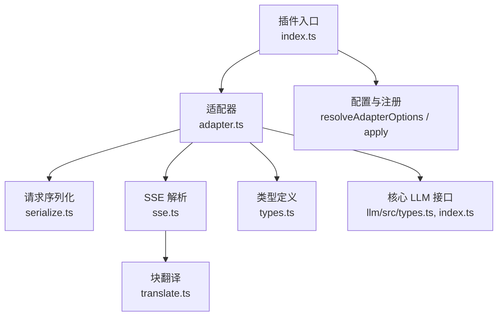
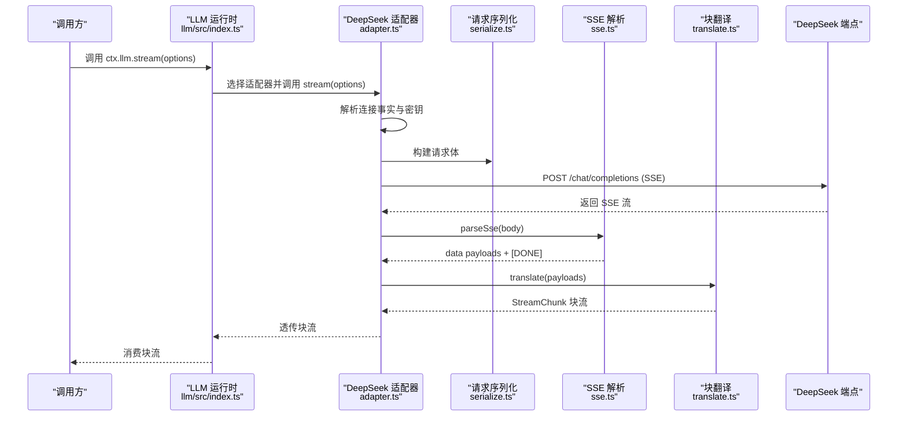
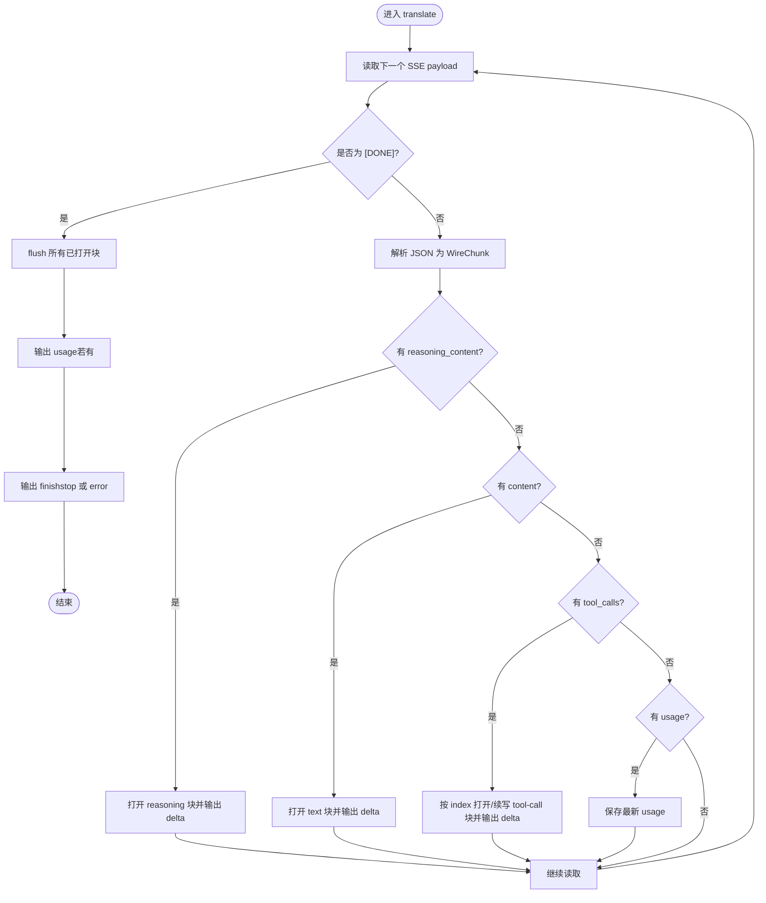
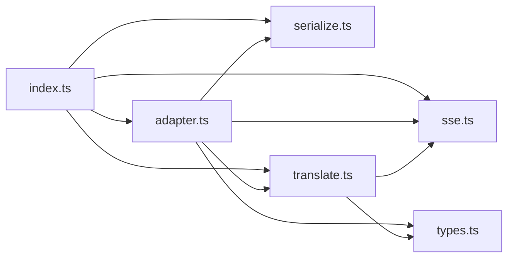
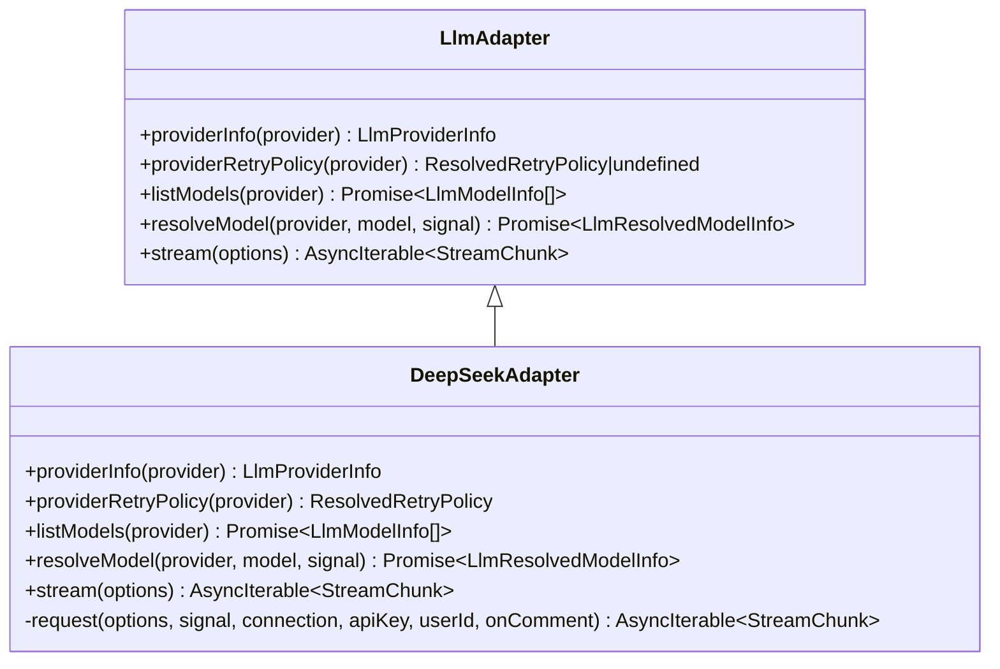

# LLM 适配器实现示例

<cite>
**本文引用的文件**
- [packages/llm/llm-deepseek/src/index.ts](file://packages/llm/llm-deepseek/src/index.ts)
- [packages/llm/llm-deepseek/src/adapter.ts](file://packages/llm/llm-deepseek/src/adapter.ts)
- [packages/llm/llm-deepseek/src/serialize.ts](file://packages/llm/llm-deepseek/src/serialize.ts)
- [packages/llm/llm-deepseek/src/sse.ts](file://packages/llm/llm-deepseek/src/sse.ts)
- [packages/llm/llm-deepseek/src/translate.ts](file://packages/llm/llm-deepseek/src/translate.ts)
- [packages/llm/llm-deepseek/src/types.ts](file://packages/llm/llm-deepseek/src/types.ts)
- [packages/llm/llm/src/types.ts](file://packages/llm/llm/src/types.ts)
- [packages/llm/llm/src/index.ts](file://packages/llm/llm/src/index.ts)
- [packages/llm/llm-deepseek/tests/adapter.spec.ts](file://packages/llm/llm-deepseek/tests/adapter.spec.ts)
- [docs/cookbook/adding-an-llm-adapter.md](file://docs/cookbook/adding-an-llm-adapter.md)
</cite>

## 目录
1. [简介](#简介)
2. [项目结构](#项目结构)
3. [核心组件](#核心组件)
4. [架构总览](#架构总览)
5. [详细组件分析](#详细组件分析)
6. [依赖关系分析](#依赖关系分析)
7. [性能考量](#性能考量)
8. [故障排查指南](#故障排查指南)
9. [结论](#结论)
10. [附录](#附录)

## 简介
本文件以 llm-deepseek 为例，系统讲解如何在 DeepSeek Harness 中实现一个自定义 LLM 适配器。内容覆盖模型注册、请求构建、流式响应处理、错误处理、认证配置、消息格式转换、重试机制、调试与测试方法，以及性能优化建议。通过该示例，你可以将任意支持 OpenAI 兼容接口的后端接入 Harness，并以统一的 StreamChunk 协议向上层暴露能力。

## 项目结构
llm-deepseek 采用“职责分离”的模块化组织：插件入口负责配置与注册；适配器负责连接与流控；序列化器负责将 Harness 消息转为 DeepSeek 请求体；SSE 解析器负责按规范读取事件；翻译器负责将上游事件转换为标准块流。

图表来源
- [packages/llm/llm-deepseek/src/index.ts:1-277](file://packages/llm/llm-deepseek/src/index.ts#L1-L277)
- [packages/llm/llm-deepseek/src/adapter.ts:1-347](file://packages/llm/llm-deepseek/src/adapter.ts#L1-L347)
- [packages/llm/llm-deepseek/src/serialize.ts:1-188](file://packages/llm/llm-deepseek/src/serialize.ts#L1-L188)
- [packages/llm/llm-deepseek/src/sse.ts:1-41](file://packages/llm/llm-deepseek/src/sse.ts#L1-L41)
- [packages/llm/llm-deepseek/src/translate.ts:1-186](file://packages/llm/llm-deepseek/src/translate.ts#L1-L186)
- [packages/llm/llm-deepseek/src/types.ts:1-153](file://packages/llm/llm-deepseek/src/types.ts#L1-L153)
- [packages/llm/llm/src/types.ts:1-357](file://packages/llm/llm/src/types.ts#L1-L357)
- [packages/llm/llm/src/index.ts:1-800](file://packages/llm/llm/src/index.ts#L1-L800)

章节来源
- [packages/llm/llm-deepseek/src/index.ts:1-277](file://packages/llm/llm-deepseek/src/index.ts#L1-L277)
- [packages/llm/llm-deepseek/src/adapter.ts:1-347](file://packages/llm/llm-deepseek/src/adapter.ts#L1-L347)

## 核心组件
- 插件与配置（index.ts）
  - 定义 Config 与校验 Schema，提供 resolveAdapterOptions 将原始配置解析为一次操作所需的连接事实（baseURL、默认 thinking/reasoningEffort、maxTokens、上下文窗口、模型目录、空闲超时、重试策略）。
  - 通过 apply 注册 provider 路由、可配置提供者目录，并注入 settings 与 credentials 动态更新。
  - 每请求解析 API Key，确保密钥与端点来自同一份快照，避免跨代混用。
- 适配器（adapter.ts）
  - 继承 LlmAdapter，实现 providerInfo、listModels、resolveModel、stream。
  - stream 内完成：解析连接事实与密钥、构造 AbortSignal 与空闲看门狗、发起 fetch、处理非 2xx 错误、将 SSE 流交给 translate 输出标准块。
  - 统一 HTTP 状态到稳定错误码（AUTH、RATE_LIMIT、CONTEXT_WINDOW_EXCEEDED、INVALID_REQUEST、SERVER、HTTP_状态等）。
- 请求序列化（serialize.ts）
  - 将 Harness Message 序列化为 DeepSeek chat-completions 请求体，处理 system/user/tool/assistant 消息、工具调用、thinking/reasoning_effort、temperature、stop、max_tokens 等字段。
  - 对不支持的能力（如图片）提前拒绝，保证文本-only 契约。
- SSE 解析（sse.ts）
  - 基于 eventsource-parser 解析字节流，严格遵循规范，遇到 [DONE] 终止；未收到则抛出 STREAM_CLOSED。
- 块翻译（translate.ts）
  - 维护 text/reasoning/tool-call 三类块的索引与拼接，延迟 flush usage 与 finish，确保 usage 在 finish 之前且 finish 之后无数据。
  - 将 finish_reason 映射为标准 FinishReason，未知原因转为 error finish。
- 类型定义（types.ts）
  - 描述 DeepSeek wire 的请求、消息、工具、chunk、usage、error 等结构，作为协议契约。

章节来源
- [packages/llm/llm-deepseek/src/index.ts:44-101](file://packages/llm/llm-deepseek/src/index.ts#L44-L101)
- [packages/llm/llm-deepseek/src/adapter.ts:158-212](file://packages/llm/llm-deepseek/src/adapter.ts#L158-L212)
- [packages/llm/llm-deepseek/src/serialize.ts:151-187](file://packages/llm/llm-deepseek/src/serialize.ts#L151-L187)
- [packages/llm/llm-deepseek/src/sse.ts:20-40](file://packages/llm/llm-deepseek/src/sse.ts#L20-L40)
- [packages/llm/llm-deepseek/src/translate.ts:86-185](file://packages/llm/llm-deepseek/src/translate.ts#L86-L185)
- [packages/llm/llm-deepseek/src/types.ts:12-153](file://packages/llm/llm-deepseek/src/types.ts#L12-L153)

## 架构总览
下图展示从上层调用到下游 DeepSeek 端点的完整流程，包括配置解析、认证、请求构建、SSE 流式解析与块组装。

图表来源
- [packages/llm/llm/src/index.ts:284-800](file://packages/llm/llm/src/index.ts#L284-L800)
- [packages/llm/llm-deepseek/src/adapter.ts:214-345](file://packages/llm/llm-deepseek/src/adapter.ts#L214-L345)
- [packages/llm/llm-deepseek/src/serialize.ts:151-187](file://packages/llm/llm-deepseek/src/serialize.ts#L151-L187)
- [packages/llm/llm-deepseek/src/sse.ts:20-40](file://packages/llm/llm-deepseek/src/sse.ts#L20-L40)
- [packages/llm/llm-deepseek/src/translate.ts:86-185](file://packages/llm/llm-deepseek/src/translate.ts#L86-L185)

## 详细组件分析

### 插件与配置（注册、动态配置、认证）
- 配置项
  - apiKeyEnv：凭证引用名，默认 DEEPSEEK_API_KEY。
  - baseURL：端点基址，优先使用受信任环境层变量，否则公共 API。
  - thinking/reasoningEffort：思考模式开关与默认推理强度。
  - maxTokens/defaultContextWindow：默认输出上限与上下文容量。
  - models：广告模型目录（仅提示作用，不限制请求）。
  - streamIdleTimeoutMs：单次流读取的空闲超时。
  - retryPolicy：提供商级重试策略。
- 动态配置
  - 通过 installSettingsSection 监听设置变更，重新解析连接事实并在必要时替换注册（例如重试策略变化）。
  - 每次请求前重新解析连接事实，保证热更新生效；进行中的流保持启动时的快照。
- 认证
  - 通过 credentials 服务或环境变量解析密钥，并进行可用性校验；缺失时抛出 MISSING_CREDENTIAL。
  - 密钥与端点来自同一份快照，防止跨代混用。

章节来源
- [packages/llm/llm-deepseek/src/index.ts:44-101](file://packages/llm/llm-deepseek/src/index.ts#L44-L101)
- [packages/llm/llm-deepseek/src/index.ts:161-198](file://packages/llm/llm-deepseek/src/index.ts#L161-L198)
- [packages/llm/llm-deepseek/src/index.ts:200-277](file://packages/llm/llm-deepseek/src/index.ts#L200-L277)

### 适配器（流式调用、错误映射、重试策略）
- 关键方法
  - providerInfo/listModels/resolveModel：提供提供商元数据、模型目录与精确模型能力（含 reasoning efforts、contextWindow、defaultMaxTokens）。
  - stream：封装一次完整的流式调用，包含信号合并、空闲看门狗、fetch 请求、错误映射、SSE 解析与翻译。
- 错误映射
  - 将 HTTP 状态与错误体映射为稳定代码：AUTH、QUOTA、RATE_LIMIT、CONTEXT_WINDOW_EXCEEDED、INVALID_REQUEST、SERVER、HTTP_状态。
  - 保留 providerRetryAfterMs 与 requestId 等结构化诊断信息。
- 重试策略
  - 通过 providerRetryPolicy 暴露提供商级重试策略；具体重试执行由 dsh-llm-retry 在步骤边界触发。

章节来源
- [packages/llm/llm-deepseek/src/adapter.ts:158-212](file://packages/llm/llm-deepseek/src/adapter.ts#L158-L212)
- [packages/llm/llm-deepseek/src/adapter.ts:214-345](file://packages/llm/llm-deepseek/src/adapter.ts#L214-L345)
- [packages/llm/llm/src/index.ts:174-233](file://packages/llm/llm/src/index.ts#L174-L233)

### 请求序列化（消息与参数转换）
- 将 Harness 消息转换为 DeepSeek 请求体：
  - system/user/tool/assistant 角色映射；tool-result 展开为独立 tool 消息。
  - assistant 的 reasoning_content 仅在携带 tool_calls 的回传时附加，节省 token。
  - tools 参数以 JSON Schema 形式传递。
  - 根据 thinking/reasoningEffort 决定 thinking.type 与 reasoning_effort。
  - 显式支持 temperature、stop、max_tokens。
- 能力约束
  - 检测到图像内容直接拒绝（UNSUPPORTED_CONTENT），因为当前适配路线为文本专用。

章节来源
- [packages/llm/llm-deepseek/src/serialize.ts:151-187](file://packages/llm/llm-deepseek/src/serialize.ts#L151-L187)
- [packages/llm/llm-deepseek/src/serialize.ts:55-141](file://packages/llm/llm-deepseek/src/serialize.ts#L55-L141)

### SSE 解析与块翻译（流式输出处理）
- SSE 解析
  - 严格遵循规范，逐条产出 data payload，遇到 [DONE] 结束；若流提前关闭则抛出 STREAM_CLOSED。
- 块翻译
  - 维护三类块（text、reasoning、tool-call）的索引与拼接；首次出现非空 reasoning 才开启 reasoning 块。
  - 延迟 flush usage 与 finish，确保 usage 先于 finish，finish 后无数据。
  - finish_reason 映射为标准 FinishReason；未知原因转为 error finish。
  - 空响应（无内容块）视为 EMPTY_RESPONSE 错误。

图表来源
- [packages/llm/llm-deepseek/src/sse.ts:20-40](file://packages/llm/llm-deepseek/src/sse.ts#L20-L40)
- [packages/llm/llm-deepseek/src/translate.ts:86-185](file://packages/llm/llm-deepseek/src/translate.ts#L86-L185)

章节来源
- [packages/llm/llm-deepseek/src/sse.ts:20-40](file://packages/llm/llm-deepseek/src/sse.ts#L20-L40)
- [packages/llm/llm-deepseek/src/translate.ts:86-185](file://packages/llm/llm-deepseek/src/translate.ts#L86-L185)

### 与核心 LLM 服务的交互
- 适配器继承 LlmAdapter，实现抽象方法 stream，并通过 ctx.llm.registerAdapter 注册到 provider 路由。
- 核心运行时提供：
  - 适配器注册与目录管理（registerAdapter/registerConfigurableProviders）。
  - 模型能力查询（listModels/resolveModelInfo）。
  - 重试策略解析与暴露（providerRetryPolicy）。
  - 标准化错误与调用拦截（llm/stream 瀑布）。

章节来源
- [packages/llm/llm/src/index.ts:174-233](file://packages/llm/llm/src/index.ts#L174-L233)
- [packages/llm/llm/src/index.ts:284-800](file://packages/llm/llm/src/index.ts#L284-L800)

## 依赖关系分析
- 模块耦合
  - index.ts 依赖 adapter.ts、serialize.ts、sse.ts、translate.ts、types.ts。
  - adapter.ts 依赖 serialize.ts、sse.ts、translate.ts、types.ts 及核心 LLM 类型。
  - translate.ts 依赖 sse.ts 的 DONE 哨兵与 types.ts 的 Wire 类型。
- 外部依赖
  - eventsource-parser：SSE 帧解析。
  - @deepseek-ai/dsh-timeout：空闲看门狗与超时控制。
  - @deepseek-ai/dsh-credentials：凭证解析。
  - @deepseek-ai/dsh-settings：动态设置。
  - @deepseek-ai/dsh-anonymous-user-id：匿名用户 ID。
- 循环依赖
  - 各模块职责清晰，未见循环导入迹象。

图表来源
- [packages/llm/llm-deepseek/src/index.ts:1-277](file://packages/llm/llm-deepseek/src/index.ts#L1-L277)
- [packages/llm/llm-deepseek/src/adapter.ts:1-347](file://packages/llm/llm-deepseek/src/adapter.ts#L1-L347)
- [packages/llm/llm-deepseek/src/serialize.ts:1-188](file://packages/llm/llm-deepseek/src/serialize.ts#L1-L188)
- [packages/llm/llm-deepseek/src/sse.ts:1-41](file://packages/llm/llm-deepseek/src/sse.ts#L1-L41)
- [packages/llm/llm-deepseek/src/translate.ts:1-186](file://packages/llm/llm-deepseek/src/translate.ts#L1-L186)
- [packages/llm/llm-deepseek/src/types.ts:1-153](file://packages/llm/llm-deepseek/src/types.ts#L1-L153)

章节来源
- [packages/llm/llm-deepseek/src/index.ts:1-277](file://packages/llm/llm-deepseek/src/index.ts#L1-L277)
- [packages/llm/llm-deepseek/src/adapter.ts:1-347](file://packages/llm/llm-deepseek/src/adapter.ts#L1-L347)

## 性能考量
- 流式传输
  - 使用 SSE 增量输出，减少首字延迟；空闲看门狗保障长时间无数据的连接及时释放。
- 资源复用
  - 会话前缀不变时可利用 KV Cache 提升吞吐；避免不必要的 prompt 变更。
- 请求大小
  - 合理设置 maxTokens 与 contextWindow，避免过大导致缓存失效或超时。
- 并发与背压
  - 消费者消费速率影响整体吞吐；UI 渲染应异步且不阻塞流。
- 重试与退避
  - 结合 providerRetryPolicy 与业务重试策略，避免雪崩。

[本节为通用指导，无需特定文件来源]

## 故障排查指南
- 常见问题定位
  - 认证失败：检查 apiKeyEnv 与凭证服务是否可用；确认密钥格式合法。
  - 速率限制/配额耗尽：关注 RATE_LIMIT 与 QUOTA 错误码；依据 providerRetryAfterMs 退避。
  - 上下文溢出：CONTEXT_WINDOW_EXCEEDED 表示输入超出模型上下文；需压缩历史或降低 maxTokens。
  - 传输错误：TRANSPORT 通常由网络/DNS/TLS/代理问题引起；查看 cause 链。
  - 协议违规：STREAM_CLOSED/MALFORMED_RESPONSE 表示 SSE 异常；检查服务端行为。
- 调试技巧
  - 启用日志记录 request/header 与 response 头部（如 x-request-id）。
  - 使用 mock 服务器模拟不同事件序列与错误场景。
  - 通过单元测试验证不同 thinking/reasoningEffort/maxTokens 组合的行为。

章节来源
- [packages/llm/llm-deepseek/tests/adapter.spec.ts:268-420](file://packages/llm/llm-deepseek/tests/adapter.spec.ts#L268-L420)
- [packages/llm/llm-deepseek/src/adapter.ts:132-149](file://packages/llm/llm-deepseek/src/adapter.ts#L132-L149)
- [packages/llm/llm-deepseek/src/translate.ts:120-125](file://packages/llm/llm-deepseek/src/translate.ts#L120-L125)

## 结论
llm-deepseek 提供了一个高内聚、低耦合的适配器实现范式：通过清晰的模块划分、严格的协议契约与完善的错误处理，将 DeepSeek 的 OpenAI 兼容接口无缝接入 Harness。按照本文的步骤，你可以快速实现并集成新的 LLM 适配器，同时获得流式输出、重试、动态配置与可观测性能力。

[本节为总结性内容，无需特定文件来源]

## 附录

### 适配器类图（代码级）

图表来源
- [packages/llm/llm/src/index.ts:174-233](file://packages/llm/llm/src/index.ts#L174-L233)
- [packages/llm/llm-deepseek/src/adapter.ts:158-212](file://packages/llm/llm-deepseek/src/adapter.ts#L158-L212)

### 使用示例（路径指引）
- 插件注册与配置
  - 参考：[packages/llm/llm-deepseek/src/index.ts:200-277](file://packages/llm/llm-deepseek/src/index.ts#L200-L277)
- 直接调用适配器
  - 参考：[packages/llm/llm-deepseek/tests/adapter.spec.ts:49-57](file://packages/llm/llm-deepseek/tests/adapter.spec.ts#L49-L57)
- 端到端流式调用
  - 参考：[packages/llm/llm-deepseek/tests/adapter.spec.ts:93-109](file://packages/llm/llm-deepseek/tests/adapter.spec.ts#L93-L109)

### 最佳实践清单
- 始终在适配器中遵守 StreamChunk 协议：usage 在 finish 之前，finish 之后无数据。
- 工具调用参数以原始 JSON 字符串透传，分片以 argumentsDelta 发送。
- 尊重 options.signal，并在不支持的能力上抛出 UNSUPPORTED 错误。
- 使用 providerRetryPolicy 暴露重试策略，交由上层重试框架执行。
- 通过 resolveModel 暴露 reasoning efforts 与默认值，避免在请求中硬编码。

章节来源
- [docs/cookbook/adding-an-llm-adapter.md:25-39](file://docs/cookbook/adding-an-llm-adapter.md#L25-L39)
- [packages/llm/llm-deepseek/src/adapter.ts:158-212](file://packages/llm/llm-deepseek/src/adapter.ts#L158-L212)
- [packages/llm/llm-deepseek/src/translate.ts:86-185](file://packages/llm/llm-deepseek/src/translate.ts#L86-L185)