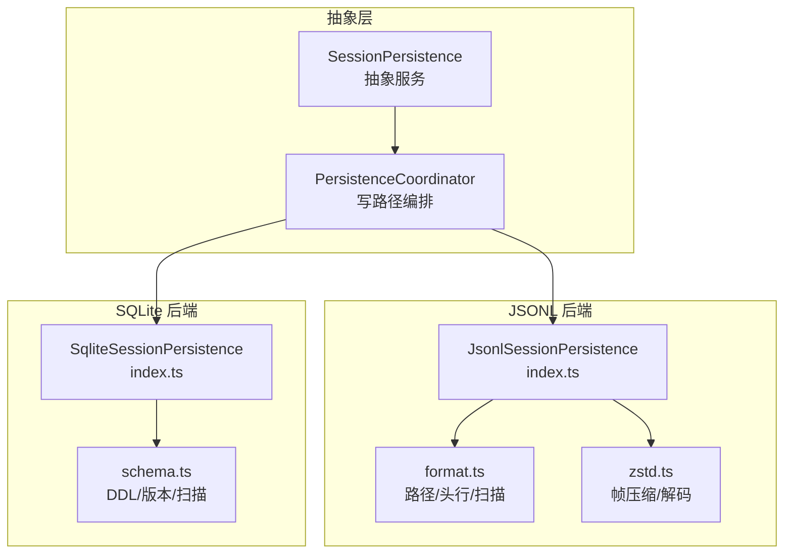
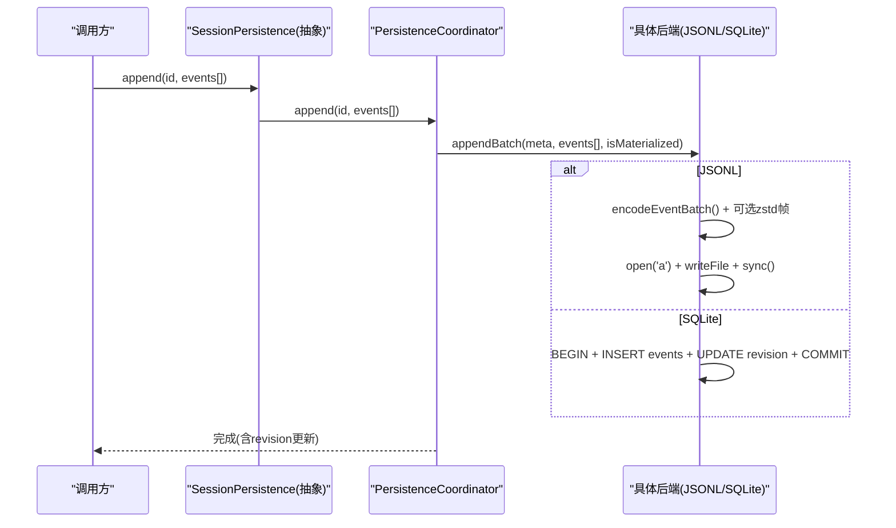
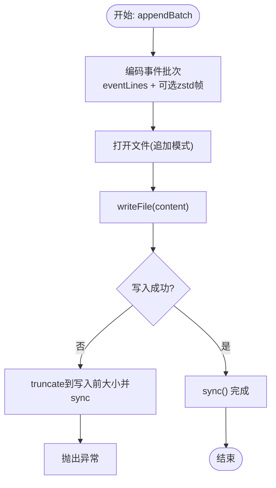
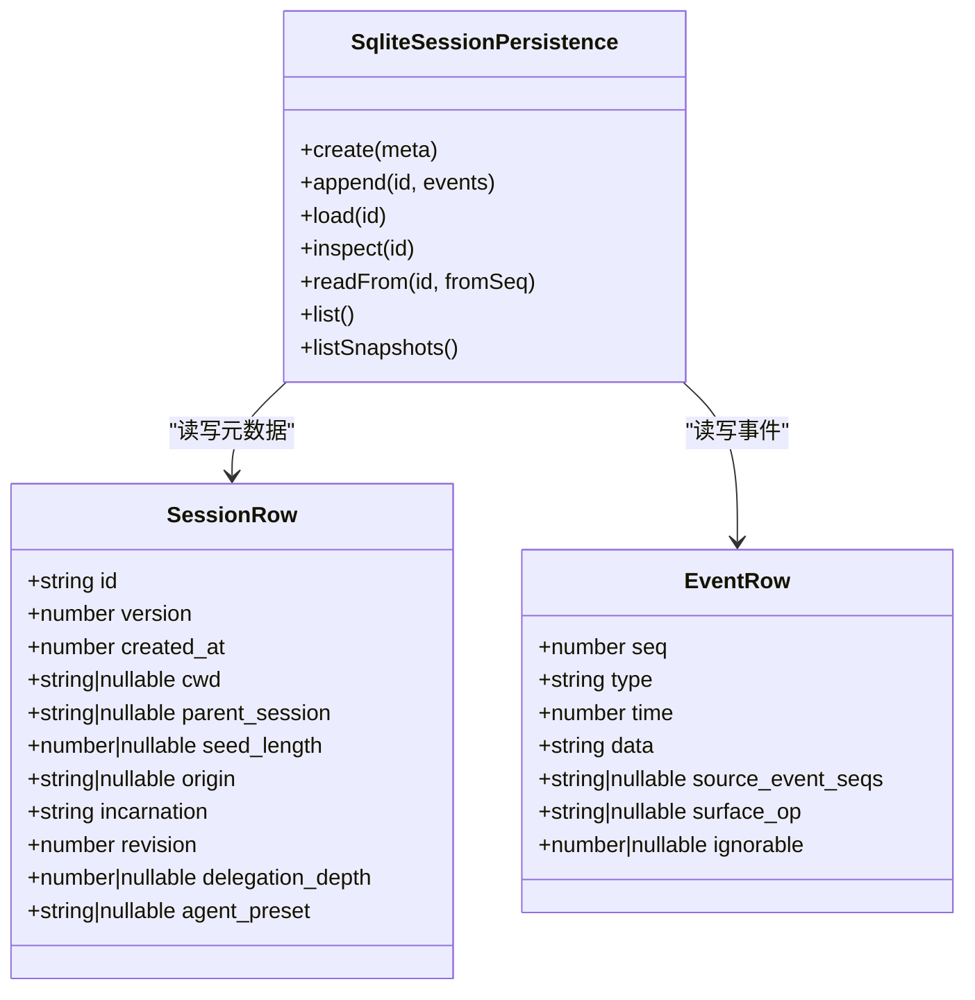
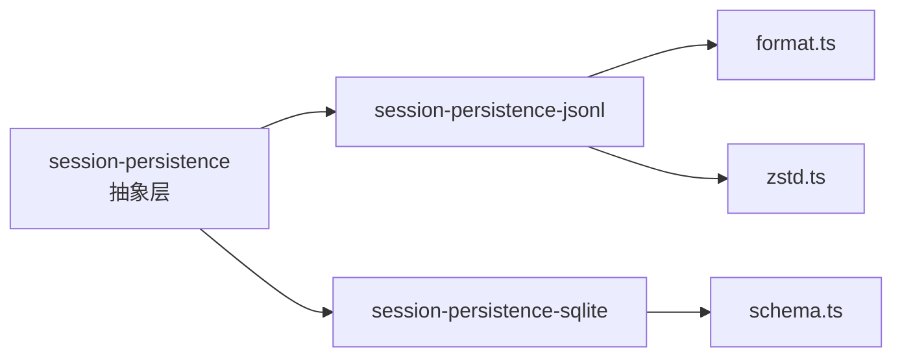

# 会话持久化实现示例

<cite>
**本文引用的文件**
- [packages/session/session-persistence/src/index.ts](file://packages/session/session-persistence/src/index.ts)
- [packages/session/session-persistence-jsonl/src/index.ts](file://packages/session/session-persistence-jsonl/src/index.ts)
- [packages/session/session-persistence-jsonl/src/format.ts](file://packages/session/session-persistence-jsonl/src/format.ts)
- [packages/session/session-persistence-jsonl/src/zstd.ts](file://packages/session/session-persistence-jsonl/src/zstd.ts)
- [packages/session/session-persistence-sqlite/src/index.ts](file://packages/session/session-persistence-sqlite/src/index.ts)
- [packages/session/session-persistence-sqlite/src/schema.ts](file://packages/session/session-persistence-sqlite/src/schema.ts)
</cite>

## 目录
1. [简介](#简介)
2. [项目结构](#项目结构)
3. [核心组件](#核心组件)
4. [架构总览](#架构总览)
5. [详细组件分析](#详细组件分析)
6. [依赖关系分析](#依赖关系分析)
7. [性能考量](#性能考量)
8. [故障排查指南](#故障排查指南)
9. [结论](#结论)
10. [附录](#附录)

## 简介
本文件面向 DeepSeek Harness 的“会话持久化”能力，提供两种后端实现的完整示例与最佳实践：基于 JSONL 文件的追加日志存储（session-persistence-jsonl）和基于 SQLite 的关系型存储（session-persistence-sqlite）。文档从系统架构、数据流、处理逻辑、并发控制、错误恢复、版本兼容与迁移策略、大数据量优化等方面展开，并给出可操作的切换机制与选择标准。

## 项目结构
- 抽象服务定义位于 session-persistence 包，统一了 create/append/load/inspect/readFrom/list/listSnapshots 等接口，以及协调器 PersistenceCoordinator 提供的批写入、冷准备缓存、崩溃恢复等通用编排。
- JSONL 后端以“每会话一个追加日志文件”为物理形态，支持可选的 Zstandard 帧压缩与增量写入；通过 format.ts 管理路径布局、头行序列化、事件扫描与修复偏移计算；zstd.ts 提供帧级压缩/解码与不完整帧前缀恢复。
- SQLite 后端将每个会话元数据与事件映射到关系表，使用事务保证原子性与一致性，并通过 schema.ts 维护数据库版本与应用标识，确保跨进程安全。

**图示来源**
- [packages/session/session-persistence/src/index.ts:84-241](file://packages/session/session-persistence/src/index.ts#L84-L241)
- [packages/session/session-persistence-jsonl/src/index.ts:121-200](file://packages/session/session-persistence-jsonl/src/index.ts#L121-L200)
- [packages/session/session-persistence-jsonl/src/format.ts:21-208](file://packages/session/session-persistence-jsonl/src/format.ts#L21-L208)
- [packages/session/session-persistence-jsonl/src/zstd.ts:48-157](file://packages/session/session-persistence-jsonl/src/zstd.ts#L48-L157)
- [packages/session/session-persistence-sqlite/src/index.ts:99-200](file://packages/session/session-persistence-sqlite/src/index.ts#L99-L200)
- [packages/session/session-persistence-sqlite/src/schema.ts:81-172](file://packages/session/session-persistence-sqlite/src/schema.ts#L81-L172)

**章节来源**
- [packages/session/session-persistence/src/index.ts:84-241](file://packages/session/session-persistence/src/index.ts#L84-L241)

## 核心组件
- SessionPersistence：定义统一的会话持久化接口，包括 locate/create/append/load/inspect/readFrom/list/listSnapshots 等，并提供 readRaw 的默认拒绝行为（由具体后端决定是否暴露原始工件）。
- PersistenceCoordinator：封装写路径编排，负责批写入合并、冷准备缓存复用、崩溃恢复（截断损坏尾部并补全边界事件）、revision 一致性检查等。
- JsonlSessionPersistence：实现 JSONL 追加日志后端，支持 zstd 压缩、打包连续 chunk、增量 append、POSIX/Win32 原子发布、编码冲突检测、raw artifact 读取。
- SqliteSessionPersistence：实现 SQLite 后端，使用单库多会话模型，事务内批量插入事件，支持 WAL/rollback journal 模式、应用标识校验、torn tail 识别与修复。

**章节来源**
- [packages/session/session-persistence/src/index.ts:84-241](file://packages/session/session-persistence/src/index.ts#L84-L241)
- [packages/session/session-persistence-jsonl/src/index.ts:121-200](file://packages/session/session-persistence-jsonl/src/index.ts#L121-L200)
- [packages/session/session-persistence-sqlite/src/index.ts:99-200](file://packages/session/session-persistence-sqlite/src/index.ts#L99-L200)

## 架构总览
JSONL 与 SQLite 后端均通过 PersistenceCoordinator 接入统一 API，屏蔽底层介质差异。JSONL 以“每会话独立文件”组织，适合简单部署与可移植性；SQLite 以“单库多会话”组织，适合强一致查询与复杂检索场景。两者都遵循追加语义、序列连续性、崩溃恢复与 revision 一致性。

**图示来源**
- [packages/session/session-persistence/src/index.ts:135-143](file://packages/session/session-persistence/src/index.ts#L135-L143)
- [packages/session/session-persistence-jsonl/src/index.ts:628-679](file://packages/session/session-persistence-jsonl/src/index.ts#L628-L679)
- [packages/session/session-persistence-sqlite/src/index.ts:284-302](file://packages/session/session-persistence-sqlite/src/index.ts#L284-L302)

## 详细组件分析

### JSONL 后端：事件序列格式、压缩与增量写入
- 事件序列格式
  - 首行是 session 头记录（type='session'），包含 version/id/createdAt/cwd/parentSession/seedLength/origin/delegationDepth/agentPreset 等字段。
  - 后续每一行是一个 StorageRecord，支持打包连续 delta-chunk 为 text-chunks/reasoning-chunks/tool-call-chunks 以降低体积。
  - 解析器按行扫描，维护 committedBytes，遇到不完整的最终行视为 torn tail，仅保留已提交前缀。
- 压缩策略
  - 可选 zstd 帧压缩：首行与事件体分别作为独立帧，支持只读头部快速读取与完整性校验。
  - 对不完整帧进行前缀恢复，提取可用明文后继续解析，避免丢失已提交事件。
- 增量写入
  - 首次写入采用临时文件+原子发布（POSIX link/unlink 或 Win32 publishNewFile），确保幂等与幂失败安全。
  - 后续追加以 append 模式打开文件，写入后 fsync；失败时回滚到写入前大小，避免重复 seq。
- 并发与一致性
  - 通过 Coordinator 管理 preparedSessionCache 与 writeBatchMaxDelayMs，合并短时事件批次。
  - 读取时使用稳定文件修订（stat 前后对比）避免读到被并发写入的中间态。
- 原始工件
  - supportsRawArtifacts=true，readRaw 返回未重构的 JSONL 文本（含打包行、键序、换行），便于离线工具直接消费。

**图示来源**
- [packages/session/session-persistence-jsonl/src/index.ts:628-679](file://packages/session/session-persistence-jsonl/src/index.ts#L628-L679)

**章节来源**
- [packages/session/session-persistence-jsonl/src/format.ts:21-208](file://packages/session/session-persistence-jsonl/src/format.ts#L21-L208)
- [packages/session/session-persistence-jsonl/src/format.ts:221-394](file://packages/session/session-persistence-jsonl/src/format.ts#L221-L394)
- [packages/session/session-persistence-jsonl/src/index.ts:252-304](file://packages/session/session-persistence-jsonl/src/index.ts#L252-L304)
- [packages/session/session-persistence-jsonl/src/index.ts:310-419](file://packages/session/session-persistence-jsonl/src/index.ts#L310-L419)
- [packages/session/session-persistence-jsonl/src/index.ts:513-592](file://packages/session/session-persistence-jsonl/src/index.ts#L513-L592)
- [packages/session/session-persistence-jsonl/src/zstd.ts:48-157](file://packages/session/session-persistence-jsonl/src/zstd.ts#L48-L157)

### SQLite 后端：表结构、索引与查询性能
- 表结构设计
  - persistence_state：单例状态，存储 store_id，用于应用标识与所有权校验。
  - sessions：会话元数据（id/version/created_at/cwd/parent_session/seed_length/origin/delegation_depth/agent_preset/incarnation/revision）。
  - events：事件行（session_id/seq/type/time/data/source_event_seqs/surface_op/ignorable），主键 (session_id, seq)。
- 索引与查询
  - 通过主键 (session_id, seq) 保证有序追加与高效范围查询。
  - loadStoredFrom 使用 WHERE session_id=? AND seq>=? ORDER BY seq 直接定位后缀，避免全表扫描。
- 事务与一致性
  - appendBatch 在单个事务中插入所有事件并递增 revision，失败则 ROLLBACK，保证原子性。
  - commitRepair 在同一事务中删除损坏尾部并插入合成关闭事件，保持平衡日志。
- 版本与迁移
  - SCHEMA_VERSION 与 application_id 共同保护数据库不被误用或跨版本混用；非当前版本直接拒绝，避免隐式迁移风险。
  - 通过 user_version 与 application_id 在初始化阶段校验，确保唯一拥有者。

**图示来源**
- [packages/session/session-persistence-sqlite/src/schema.ts:32-60](file://packages/session/session-persistence-sqlite/src/schema.ts#L32-L60)
- [packages/session/session-persistence-sqlite/src/index.ts:99-200](file://packages/session/session-persistence-sqlite/src/index.ts#L99-L200)

**章节来源**
- [packages/session/session-persistence-sqlite/src/schema.ts:81-172](file://packages/session/session-persistence-sqlite/src/schema.ts#L81-L172)
- [packages/session/session-persistence-sqlite/src/schema.ts:179-271](file://packages/session/session-persistence-sqlite/src/schema.ts#L179-L271)
- [packages/session/session-persistence-sqlite/src/index.ts:206-338](file://packages/session/session-persistence-sqlite/src/index.ts#L206-L338)

### 版本兼容性与迁移策略
- JSONL 前端版本
  - 头记录的 version 必须等于当前 SESSION_FORMAT_VERSION；否则拒绝加载并提示升级 harness。
  - 解析器在读取头行之前即进行版本检查，避免对未知格式执行结构校验导致误导性的“损坏日志”错误。
- SQLite 后端版本
  - SCHEMA_VERSION 与 application_id 共同约束数据库版本与归属；非当前版本或应用标识不匹配直接拒绝。
  - 不支持隐式迁移：任何破坏性变更需通过外部流程重建数据库，确保数据一致性。

**章节来源**
- [packages/session/session-persistence-jsonl/src/format.ts:232-264](file://packages/session/session-persistence-jsonl/src/format.ts#L232-L264)
- [packages/session/session-persistence-sqlite/src/schema.ts:100-115](file://packages/session/session-persistence-sqlite/src/schema.ts#L100-L115)

### 并发访问控制、错误恢复与性能监控
- 并发控制
  - JSONL：POSIX 使用 link()+unlink() 原子发布新文件，防止覆盖；Win32 使用专用发布函数；追加失败时回滚文件大小，避免重复 seq。
  - SQLite：所有写操作在事务中进行，利用数据库锁与 WAL/rollback journal 保证并发安全。
- 错误恢复
  - JSONL：scanLog/scanZstdFrames 识别 torn tail，commitRepair 截断损坏尾部并补全边界事件；readStableFile 通过 stat 前后一致性避免读到中间态。
  - SQLite：scanRows 识别 last turn/end 之后的损坏区域，commitRepair 删除损坏尾部并插入合成关闭事件。
- 性能监控
  - 可通过 Coordinator 的 preparedSessionCacheSize 与 writeBatchMaxDelayMs 调节冷准备缓存与批合并窗口。
  - JSONL 的 ZSTD 解码分片 yield 避免长阻塞事件循环；SQLite 的 loadStoredFrom 支持按 seq 范围读取，减少不必要的数据传输。

**章节来源**
- [packages/session/session-persistence-jsonl/src/index.ts:292-304](file://packages/session/session-persistence-jsonl/src/index.ts#L292-L304)
- [packages/session/session-persistence-jsonl/src/index.ts:310-419](file://packages/session/session-persistence-jsonl/src/index.ts#L310-L419)
- [packages/session/session-persistence-jsonl/src/index.ts:513-592](file://packages/session/session-persistence-jsonl/src/index.ts#L513-L592)
- [packages/session/session-persistence-sqlite/src/index.ts:284-338](file://packages/session/session-persistence-sqlite/src/index.ts#L284-L338)
- [packages/session/session-persistence-sqlite/src/schema.ts:220-271](file://packages/session/session-persistence-sqlite/src/schema.ts#L220-L271)

### 持久化后端的选择标准与切换机制
- 选择标准
  - JSONL：适合简单部署、可移植性强、需要原始工件直读的场景；天然追加日志，易于离线分析与压缩。
  - SQLite：适合需要强一致查询、复杂过滤与聚合、跨会话关联分析的场景；事务保障与索引优化提升查询性能。
- 切换机制
  - 通过替换 ctx.sessionPersistence 的实现即可切换后端；上层业务代码无需改动（API 统一）。
  - JSONL 与 SQLite 的 locate 行为不同：JSONL 返回 per-session 文件路径，SQLite 返回 undefined（单库多会话）。
  - 配置项差异：JSONL 配置 root/compression/packChunks；SQLite 配置 path/journalMode。

**章节来源**
- [packages/session/session-persistence/src/index.ts:89-124](file://packages/session/session-persistence/src/index.ts#L89-L124)
- [packages/session/session-persistence-jsonl/src/index.ts:171-178](file://packages/session/session-persistence-jsonl/src/index.ts#L171-L178)
- [packages/session/session-persistence-sqlite/src/index.ts:172-179](file://packages/session/session-persistence-sqlite/src/index.ts#L172-L179)

### 大数据量场景下的优化建议
- JSONL
  - 启用 packChunks 将连续 delta-chunk 打包，显著降低日志体积。
  - 使用 zstd 压缩减少磁盘占用与 I/O；列表操作仅读取首行头记录，避免全量解析。
  - 合理设置 preparedSessionCacheSize 与 writeBatchMaxDelayMs，平衡内存与延迟。
- SQLite
  - 使用 WAL 模式提高并发读性能；在网络挂载等不支持共享内存的文件系统上切换到 rollback-journal 模式。
  - 利用 loadStoredFrom 的 seq 范围查询，避免全表扫描；必要时增加覆盖索引（如按时间或类型）。
  - 定期归档历史会话，控制单库规模，提升查询效率。

**章节来源**
- [packages/session/session-persistence-jsonl/src/format.ts:21-208](file://packages/session/session-persistence-jsonl/src/format.ts#L21-L208)
- [packages/session/session-persistence-jsonl/src/index.ts:446-509](file://packages/session/session-persistence-jsonl/src/index.ts#L446-L509)
- [packages/session/session-persistence-sqlite/src/index.ts:220-238](file://packages/session/session-persistence-sqlite/src/index.ts#L220-L238)
- [packages/session/session-persistence-sqlite/src/schema.ts:62-70](file://packages/session/session-persistence-sqlite/src/schema.ts#L62-L70)

## 依赖关系分析
- JSONL 后端依赖 format.ts 进行路径与头行处理，依赖 zstd.ts 进行帧压缩/解码；通过 Coordinator 集成写路径。
- SQLite 后端依赖 schema.ts 进行 DDL 与版本管理；通过 Coordinator 集成写路径。
- 抽象层提供统一 API 与类型，屏蔽后端差异。

**图示来源**
- [packages/session/session-persistence/src/index.ts:84-241](file://packages/session/session-persistence/src/index.ts#L84-L241)
- [packages/session/session-persistence-jsonl/src/index.ts:121-200](file://packages/session/session-persistence-jsonl/src/index.ts#L121-L200)
- [packages/session/session-persistence-sqlite/src/index.ts:99-200](file://packages/session/session-persistence-sqlite/src/index.ts#L99-L200)

**章节来源**
- [packages/session/session-persistence/src/index.ts:84-241](file://packages/session/session-persistence/src/index.ts#L84-L241)

## 性能考量
- JSONL
  - 打包连续 chunk 可减少行数与 JSON 开销。
  - zstd 压缩降低 I/O 与存储成本；解码时分片 yield 避免阻塞事件循环。
  - 列表与 inspect 仅读取必要部分，避免全量解析。
- SQLite
  - WAL 模式提升并发读性能；rollback-journal 适用于不支持共享内存的文件系统。
  - 使用 seq 范围查询与主键索引，减少扫描范围。
  - 事务内批量插入减少锁竞争与磁盘同步次数。

[本节为通用指导，不直接分析具体文件]

## 故障排查指南
- JSONL
  - 损坏的头帧或不完整帧：readZstdPrefix 会抛出明确错误；commitRepair 可截断损坏尾部并恢复已提交事件。
  - 并发写入导致的中间态：readStableFile 通过 stat 前后一致性重试，避免读到不一致数据。
  - 编码冲突：同时存在 .jsonl 与 .jsonl.zstd 会报错，需清理旧格式文件。
- SQLite
  - 版本不匹配或应用标识错误：openDatabase 会拒绝打开，需确认 SCHEMA_VERSION 与 application_id。
  - 损坏尾部：scanRows 识别 last turn/end 之后的损坏区域；commitRepair 删除损坏尾部并插入合成关闭事件。
  - 事务失败：appendBatch/commitRepair 内部 ROLLBACK，确保不会留下半写状态。

**章节来源**
- [packages/session/session-persistence-jsonl/src/index.ts:310-419](file://packages/session/session-persistence-jsonl/src/index.ts#L310-L419)
- [packages/session/session-persistence-jsonl/src/index.ts:472-509](file://packages/session/session-persistence-jsonl/src/index.ts#L472-L509)
- [packages/session/session-persistence-sqlite/src/schema.ts:100-115](file://packages/session/session-persistence-sqlite/src/schema.ts#L100-L115)
- [packages/session/session-persistence-sqlite/src/schema.ts:220-271](file://packages/session/session-persistence-sqlite/src/schema.ts#L220-L271)
- [packages/session/session-persistence-sqlite/src/index.ts:284-338](file://packages/session/session-persistence-sqlite/src/index.ts#L284-L338)

## 结论
JSONL 与 SQLite 两种后端均以追加日志为核心，遵循一致性、崩溃恢复与版本兼容原则。JSONL 适合轻量部署与可移植性需求，SQLite 适合强一致查询与复杂分析场景。通过统一抽象与协调器，可在不改动上层业务的情况下灵活切换后端。针对大数据量场景，应结合压缩、批合并、索引与事务优化，确保性能与可靠性。

[本节为总结，不直接分析具体文件]

## 附录
- 配置要点
  - JSONL：root、compression(zstd/none)、packChunks、preparedSessionCacheSize、writeBatchMaxDelayMs。
  - SQLite：path、journalMode(wal/delete/truncate/persist)、preparedSessionCacheSize、writeBatchMaxDelayMs。
- 关键路径
  - JSONL 路径布局：projectDir -> sessionDir -> session.jsonl(.zstd)。
  - SQLite 表：persistence_state、sessions、events。

**章节来源**
- [packages/session/session-persistence-jsonl/src/index.ts:126-133](file://packages/session/session-persistence-jsonl/src/index.ts#L126-L133)
- [packages/session/session-persistence-jsonl/src/format.ts:176-208](file://packages/session/session-persistence-jsonl/src/format.ts#L176-L208)
- [packages/session/session-persistence-sqlite/src/index.ts:104-110](file://packages/session/session-persistence-sqlite/src/index.ts#L104-L110)
- [packages/session/session-persistence-sqlite/src/schema.ts:116-147](file://packages/session/session-persistence-sqlite/src/schema.ts#L116-L147)