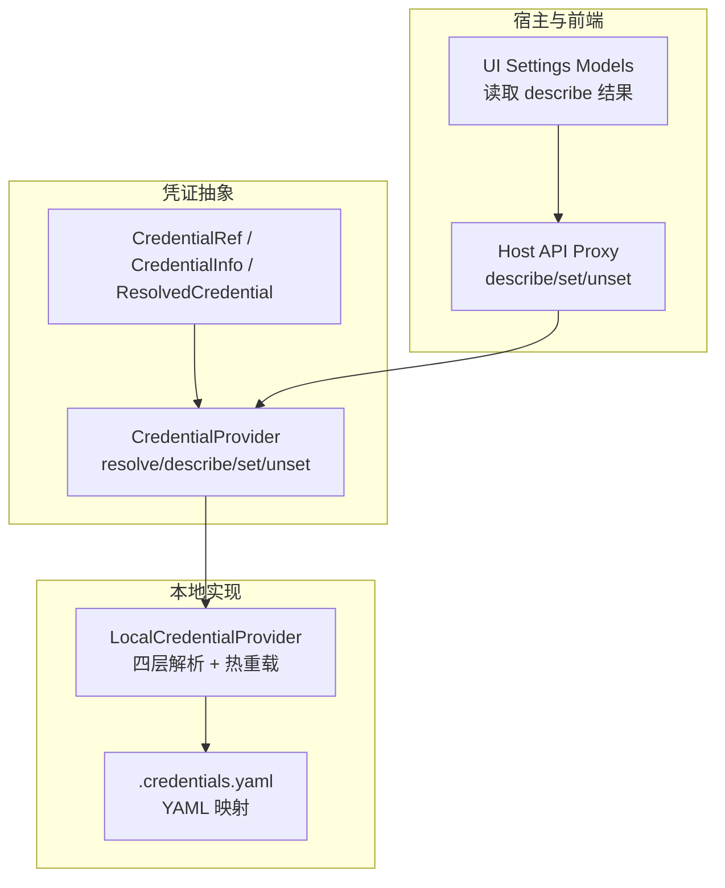
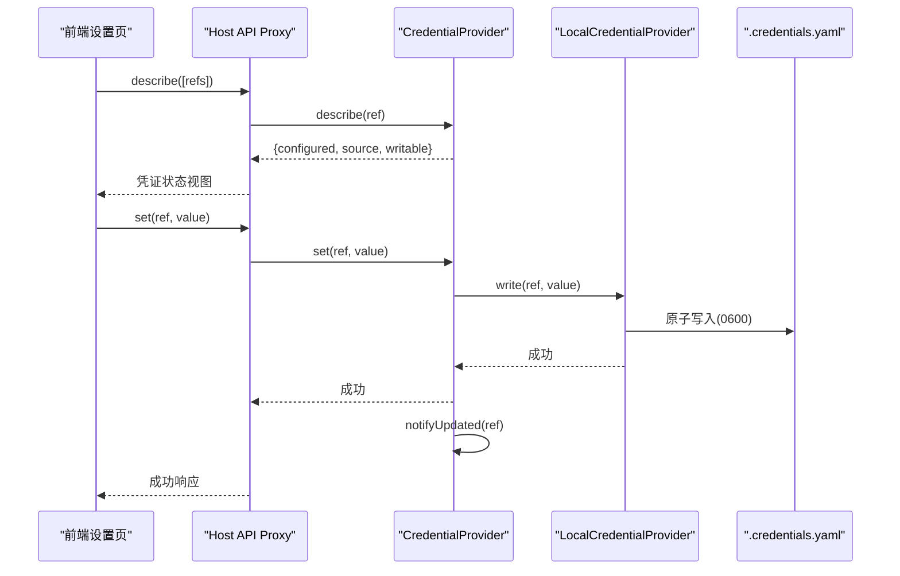
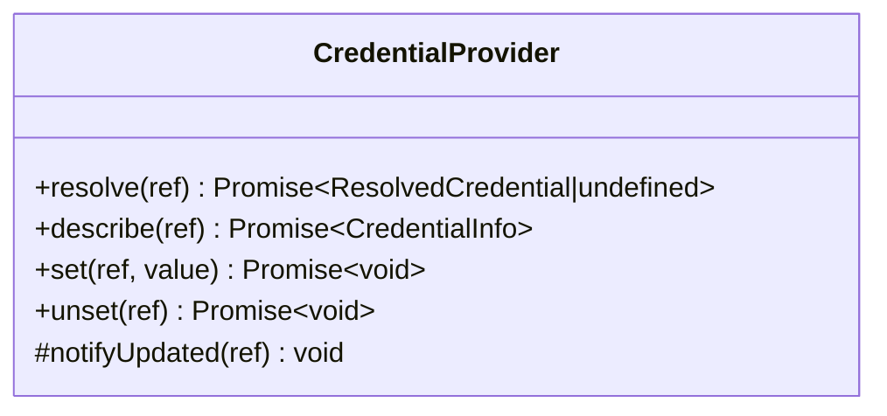
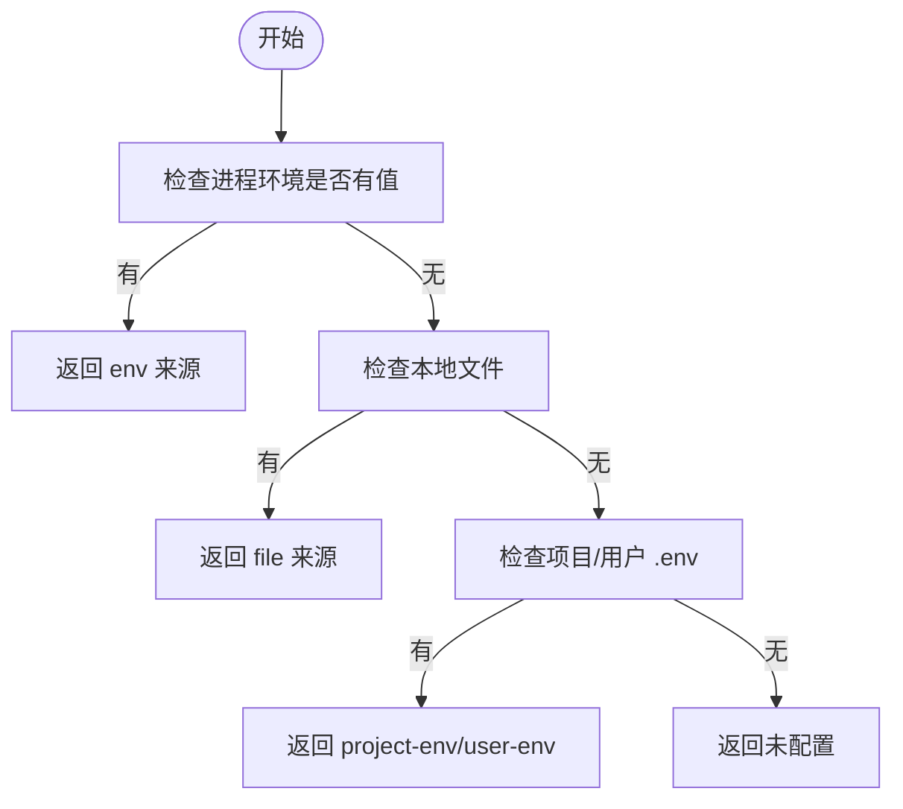
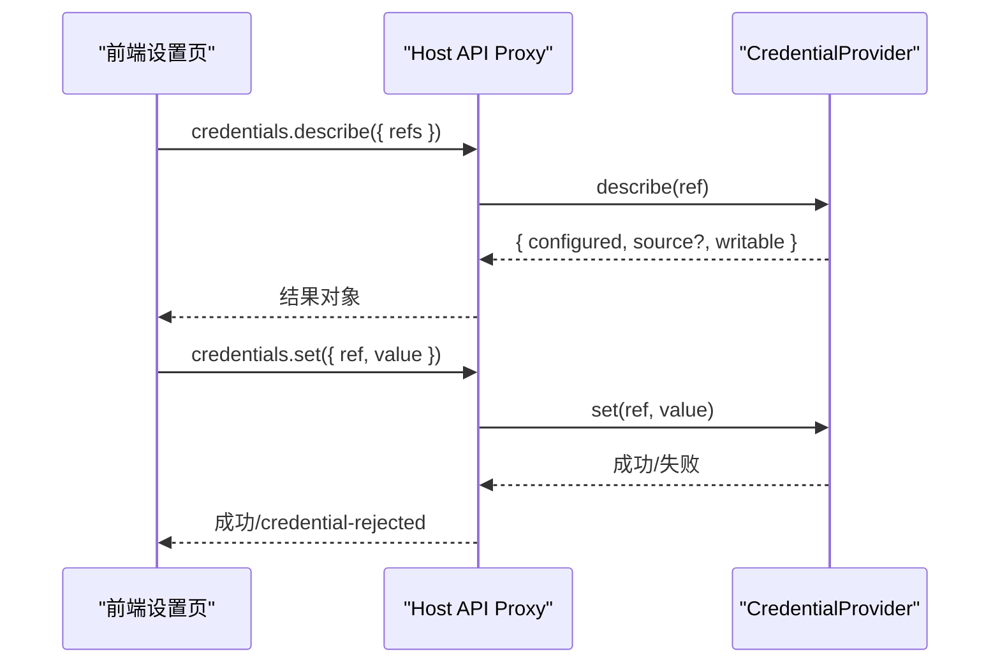
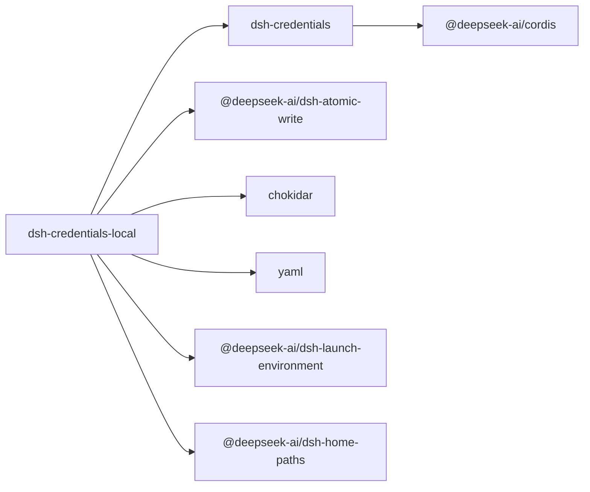

# 凭证提供商实现示例

<cite>
**本文引用的文件**
- [packages/credentials/credentials/src/index.ts](file://packages/credentials/credentials/src/index.ts)
- [packages/credentials/credentials/src/types.ts](file://packages/credentials/credentials/src/types.ts)
- [packages/credentials/credentials/package.json](file://packages/credentials/credentials/package.json)
- [packages/credentials/credentials/README.md](file://packages/credentials/credentials/README.md)
- [packages/credentials/credentials-local/src/index.ts](file://packages/credentials/credentials-local/src/index.ts)
- [packages/credentials/credentials-local/package.json](file://packages/credentials/credentials-local/package.json)
- [packages/credentials/credentials-local/README.md](file://packages/credentials/credentials-local/README.md)
- [packages/credentials/credentials/tests/memory.ts](file://packages/credentials/credentials/tests/memory.ts)
- [packages/credentials/credentials/tests/credentials.spec.ts](file://packages/credentials/credentials/tests/credentials.spec.ts)
- [packages/credentials/credentials-local/tests/local.spec.ts](file://packages/credentials/credentials-local/tests/local.spec.ts)
- [packages/host/apiproxy/src/api-proxy.ts](file://packages/host/apiproxy/src/api-proxy.ts)
- [packages/client/ui-settings-models/src/client/store.ts](file://packages/client/ui-settings-models/src/client/store.ts)
- [docs/subsystems/credentials.md](file://docs/subsystems/credentials.md)
</cite>

## 目录
1. [简介](#简介)
2. [项目结构](#项目结构)
3. [核心组件](#核心组件)
4. [架构总览](#架构总览)
5. [详细组件分析](#详细组件分析)
6. [依赖关系分析](#依赖关系分析)
7. [性能考量](#性能考量)
8. [故障排除指南](#故障排除指南)
9. [结论](#结论)
10. [附录](#附录)

## 简介
本文件面向 DeepSeek Harness 的“凭证提供商”能力，聚焦于如何实现不同类型的凭证存储后端，并以 credentials-local 为例，完整说明本地凭证存储的实现、安全机制与生命周期管理。内容涵盖：
- 凭证抽象接口与事件模型
- 分层解析策略（进程环境、本地文件、项目与环境变量）
- 文件格式设计、权限控制与敏感信息保护
- 注册与获取逻辑（通过 Host API 暴露给前端）
- 解析、验证、缓存与更新机制
- 在应用中的使用模式与避免硬编码最佳实践
- 安全最佳实践与故障排除

## 项目结构
凭证系统由两个主要包组成：
- dsh-credentials：定义抽象凭证服务与类型，提供统一接口与事件契约
- dsh-credentials-local：基于文件的凭证提供者，实现四层优先级与热重载

图表来源
- [packages/credentials/credentials/src/index.ts:60-99](file://packages/credentials/credentials/src/index.ts#L60-L99)
- [packages/credentials/credentials/src/types.ts:12-30](file://packages/credentials/credentials/src/types.ts#L12-L30)
- [packages/credentials/credentials-local/src/index.ts:207-331](file://packages/credentials/credentials-local/src/index.ts#L207-L331)
- [packages/host/apiproxy/src/api-proxy.ts:3321-3368](file://packages/host/apiproxy/src/api-proxy.ts#L3321-L3368)
- [packages/client/ui-settings-models/src/client/store.ts:141-171](file://packages/client/ui-settings-models/src/client/store.ts#L141-L171)

章节来源
- [packages/credentials/credentials/README.md:1-49](file://packages/credentials/credentials/README.md#L1-L49)
- [packages/credentials/credentials-local/README.md:1-72](file://packages/credentials/credentials-local/README.md#L1-L72)

## 核心组件
- 凭证引用与类型
  - 引用采用 POSIX 风格环境变量名，并通过品牌化类型防止误用
  - 描述信息不包含值，仅包含是否已配置、来源层、是否可写
- 抽象服务
  - resolve：每次操作时解析，不跨操作缓存，保证热更新生效
  - describe：为 UI 提供只读元信息
  - set/unset：持久化写入或移除；空值一律视为未配置
  - 事件：credentials/updated 在提交变更后通知监听者
- 本地提供者
  - 四层优先级：进程环境 > 本地文件 > 项目 .env > 用户 .env
  - 文件格式：YAML 键值映射，严格校验，保留注释与格式
  - 权限：目录 0700，文件 0600；POSIX 下拒绝组/其他可读
  - 热重载：基于 chokidar 监听外部编辑，批量替换快照并去抖
  - 并发：队列串行化读写，原子写入，跨进程写锁

章节来源
- [packages/credentials/credentials/src/index.ts:16-146](file://packages/credentials/credentials/src/index.ts#L16-L146)
- [packages/credentials/credentials/src/types.ts:12-30](file://packages/credentials/credentials/src/types.ts#L12-L30)
- [packages/credentials/credentials-local/src/index.ts:51-85](file://packages/credentials/credentials-local/src/index.ts#L51-L85)
- [packages/credentials/credentials-local/src/index.ts:87-140](file://packages/credentials/credentials-local/src/index.ts#L87-L140)
- [packages/credentials/credentials-local/src/index.ts:142-204](file://packages/credentials/credentials-local/src/index.ts#L142-L204)
- [packages/credentials/credentials-local/src/index.ts:207-331](file://packages/credentials/credentials-local/src/index.ts#L207-L331)
- [packages/credentials/credentials-local/src/index.ts:333-493](file://packages/credentials/credentials-local/src/index.ts#L333-L493)

## 架构总览
凭证从配置到使用的端到端流程如下：
- 配置携带引用而非密钥
- 运行时按层解析，返回当前值与来源
- UI 通过 describe 查询状态，不接触密钥
- 变更通过 set/unset 持久化，触发事件刷新 UI
- 本地提供者负责文件 I/O、权限校验、热重载与并发控制

图表来源
- [packages/host/apiproxy/src/api-proxy.ts:3321-3368](file://packages/host/apiproxy/src/api-proxy.ts#L3321-L3368)
- [packages/credentials/credentials/src/index.ts:60-146](file://packages/credentials/credentials/src/index.ts#L60-L146)
- [packages/credentials/credentials-local/src/index.ts:333-403](file://packages/credentials/credentials-local/src/index.ts#L333-L403)

## 详细组件分析

### 抽象凭证服务（CredentialProvider）
- 职责
  - 定义统一的解析、描述、写入、删除接口
  - 统一规则：空值即未配置；每操作解析一次以支持热更新
  - 事件：提交变更后发出 credentials/updated，失败被包容记录
- 关键行为
  - resolve：返回值与来源层
  - describe：返回是否配置、来源、是否可写
  - set/unset：拒绝空值；当存在只读源覆盖时拒绝写入
  - notifyUpdated：广播变更，异常隔离

图表来源
- [packages/credentials/credentials/src/index.ts:60-146](file://packages/credentials/credentials/src/index.ts#L60-L146)

章节来源
- [packages/credentials/credentials/src/index.ts:16-146](file://packages/credentials/credentials/src/index.ts#L16-L146)
- [docs/subsystems/credentials.md:62-134](file://docs/subsystems/credentials.md#L62-L134)

### 本地凭证提供者（LocalCredentialProvider）
- 分层解析
  - 进程环境（只读，最高优先级）
  - $DSH_HOME/.credentials.yaml（可写，覆盖 .env）
  - 项目 .env（低于文件）
  - 用户 .env（最低）
- 文件与权限
  - YAML 映射，严格校验键名与值类型，禁止空值
  - 目录 0700，文件 0600；POSIX 下拒绝非所有者可读
- 热重载与并发
  - chokidar 监听，去抖合并，全量替换内存快照
  - 队列串行化所有操作，原子写入，跨进程写锁
- 错误处理
  - 启动时不可读/无效则失败
  - 运行中无效/不可读则警告并保留上次有效快照
  - 写入前重新检查覆盖层，避免静默失效

图表来源
- [packages/credentials/credentials-local/src/index.ts:249-331](file://packages/credentials/credentials-local/src/index.ts#L249-L331)

章节来源
- [packages/credentials/credentials-local/src/index.ts:51-85](file://packages/credentials/credentials-local/src/index.ts#L51-L85)
- [packages/credentials/credentials-local/src/index.ts:87-140](file://packages/credentials/credentials-local/src/index.ts#L87-L140)
- [packages/credentials/credentials-local/src/index.ts:142-204](file://packages/credentials/credentials-local/src/index.ts#L142-L204)
- [packages/credentials/credentials-local/src/index.ts:207-331](file://packages/credentials/credentials-local/src/index.ts#L207-L331)
- [packages/credentials/credentials-local/src/index.ts:333-493](file://packages/credentials/credentials-local/src/index.ts#L333-L493)

### Host API 与前端集成
- Host API 将 describe/set/unset 转发至具体凭证提供者，并将错误包装为统一错误码
- 前端设置页调用 describe 获取凭证状态，用于显示“已配置/可写”等标识

图表来源
- [packages/host/apiproxy/src/api-proxy.ts:3321-3368](file://packages/host/apiproxy/src/api-proxy.ts#L3321-L3368)
- [packages/client/ui-settings-models/src/client/store.ts:141-171](file://packages/client/ui-settings-models/src/client/store.ts#L141-L171)

章节来源
- [packages/host/apiproxy/src/api-proxy.ts:3321-3368](file://packages/host/apiproxy/src/api-proxy.ts#L3321-L3368)
- [packages/client/ui-settings-models/src/client/store.ts:141-171](file://packages/client/ui-settings-models/src/client/store.ts#L141-L171)

### 测试与内存实现（参考）
- 内存凭证实现用于接口与消费者测试，演示 set/unset 与事件发布
- 本地提供者的测试覆盖了分层解析、权限校验、文档校验、写入与热重载

章节来源
- [packages/credentials/credentials/tests/memory.ts:1-49](file://packages/credentials/credentials/tests/memory.ts#L1-L49)
- [packages/credentials/credentials/tests/credentials.spec.ts:1-72](file://packages/credentials/credentials/tests/credentials.spec.ts#L1-L72)
- [packages/credentials/credentials-local/tests/local.spec.ts:1-428](file://packages/credentials/credentials-local/tests/local.spec.ts#L1-L428)

## 依赖关系分析
- 包依赖
  - dsh-credentials：依赖 Cordis 上下文与品牌化类型
  - dsh-credentials-local：依赖 atomic-write、chokidar、yaml、launch-environment、home-paths 等
- 模块耦合
  - 本地提供者依赖抽象服务与工具库，保持高内聚
  - Host API 与前端通过解耦的 API 契约交互

图表来源
- [packages/credentials/credentials/package.json:1-50](file://packages/credentials/credentials/package.json#L1-L50)
- [packages/credentials/credentials-local/package.json:1-56](file://packages/credentials/credentials-local/package.json#L1-L56)

章节来源
- [packages/credentials/credentials/package.json:1-50](file://packages/credentials/credentials/package.json#L1-L50)
- [packages/credentials/credentials-local/package.json:1-56](file://packages/credentials/credentials-local/package.json#L1-L56)

## 性能考量
- 解析与缓存
  - 每次操作解析一次，不跨操作缓存，确保热更新即时生效
  - 本地提供者维护内存快照，减少重复 I/O
- 并发与一致性
  - 队列串行化所有写操作，避免竞态
  - 原子写入与跨进程写锁保证并发安全
- 热重载
  - 去抖合并频繁写入，降低重负载下的抖动
  - 全量替换快照，避免旧数据残留

[本节为通用指导，无需特定文件来源]

## 故障排除指南
- 启动失败
  - 文件不存在：视为空存储
  - 文件不可读/无效：启动时报错，需修复权限或修正 YAML
- 运行时问题
  - 外部编辑导致无效文档：警告并保留上次有效快照
  - 权限不足：POSIX 下若文件对组/其他可读，会拒绝加载
- 写入失败
  - 空值：拒绝写入，应使用 unset 删除
  - 被进程环境覆盖：拒绝写入并提示需在启动环境中修改
- 常见错误定位
  - 查看 Host API 返回的错误码 credential-rejected 及消息
  - 检查本地文件权限与 YAML 语法
  - 关注 credentials/updated 事件是否触发

章节来源
- [packages/credentials/credentials-local/src/index.ts:87-140](file://packages/credentials/credentials-local/src/index.ts#L87-L140)
- [packages/credentials/credentials-local/src/index.ts:419-483](file://packages/credentials/credentials-local/src/index.ts#L419-L483)
- [packages/host/apiproxy/src/api-proxy.ts:3321-3368](file://packages/host/apiproxy/src/api-proxy.ts#L3321-L3368)

## 结论
DeepSeek Harness 的凭证系统通过抽象接口与本地实现分离，实现了安全的密钥管理与灵活的分层解析。credentials-local 提供了严格的权限控制、可靠的并发与热重载机制，配合 Host API 与前端集成，形成完整的凭证生命周期管理。遵循“配置仅含引用、运行时解析、空值即未配置”的原则，可有效避免硬编码敏感信息，提升安全性与可维护性。

[本节为总结，无需特定文件来源]

## 附录

### 安全最佳实践
- 始终使用引用而非明文密钥
- 限制本地文件权限（目录 0700，文件 0600），POSIX 下拒绝组/其他可读
- 避免在日志或诊断中输出密钥值
- 使用 set/unset 管理密钥，勿直接编辑进程环境
- 对无效/不可读文档采取保守策略（启动失败或保留上次快照）

章节来源
- [packages/credentials/credentials/README.md:1-49](file://packages/credentials/credentials/README.md#L1-L49)
- [packages/credentials/credentials-local/README.md:29-57](file://packages/credentials/credentials-local/README.md#L29-L57)

### 使用模式与避免硬编码
- 配置中仅声明引用名称（如 DEEPSEEK_API_KEY）
- 运行时通过 ctx.credentials.resolve 获取值
- UI 通过 describe 展示状态，不暴露值
- 通过 Host API 的 set/unset 进行密钥轮换与管理

章节来源
- [packages/credentials/credentials/src/index.ts:16-146](file://packages/credentials/credentials/src/index.ts#L16-L146)
- [packages/host/apiproxy/src/api-proxy.ts:3321-3368](file://packages/host/apiproxy/src/api-proxy.ts#L3321-L3368)
- [packages/client/ui-settings-models/src/client/store.ts:141-171](file://packages/client/ui-settings-models/src/client/store.ts#L141-L171)