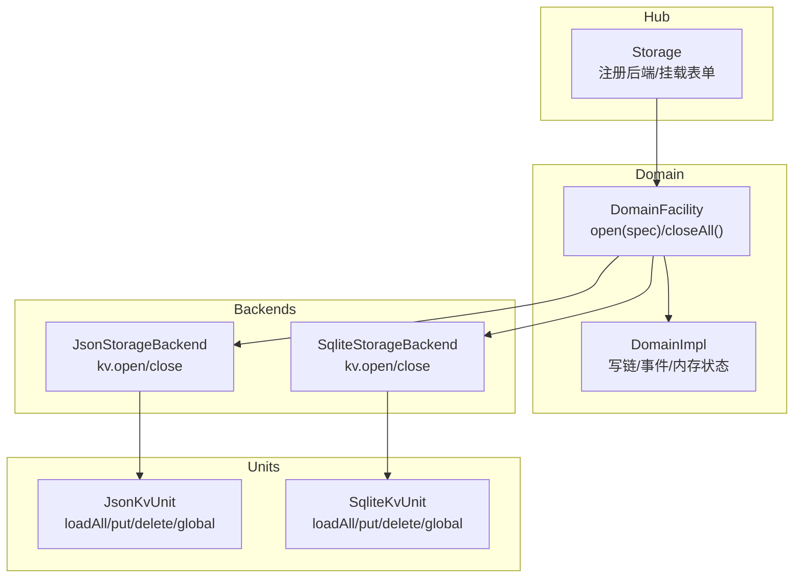
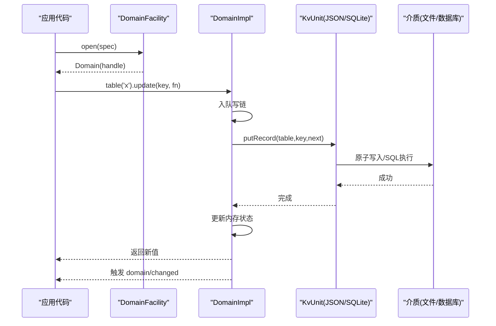
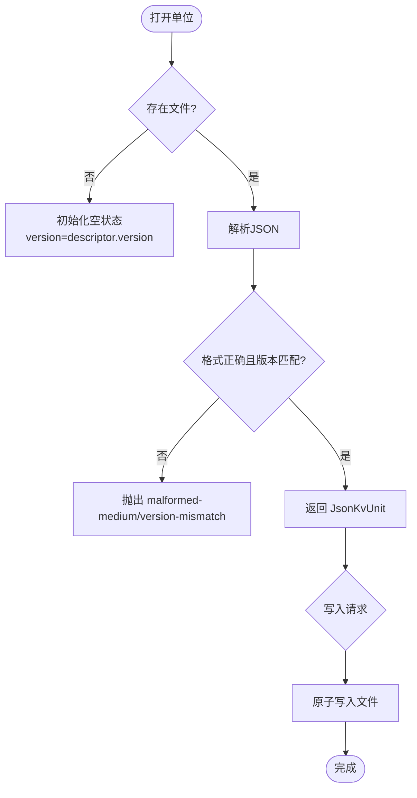
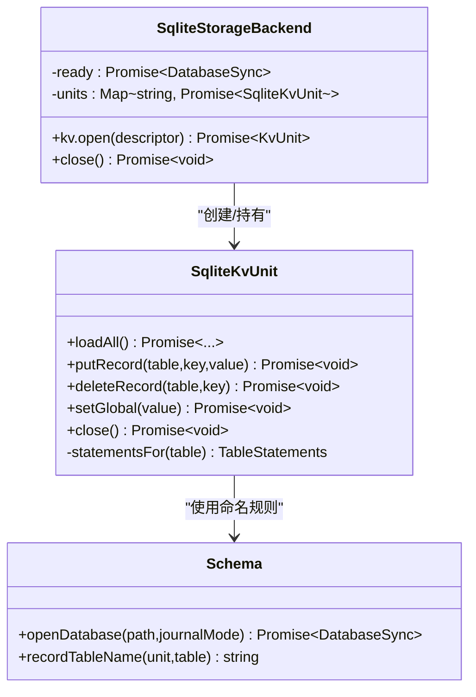
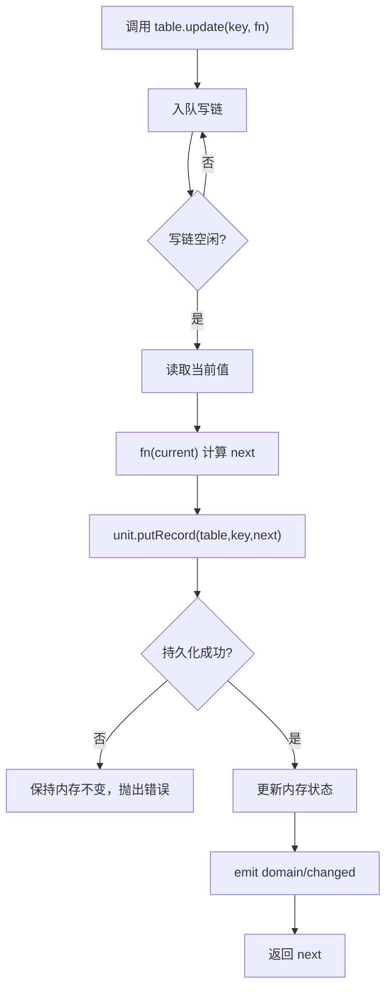
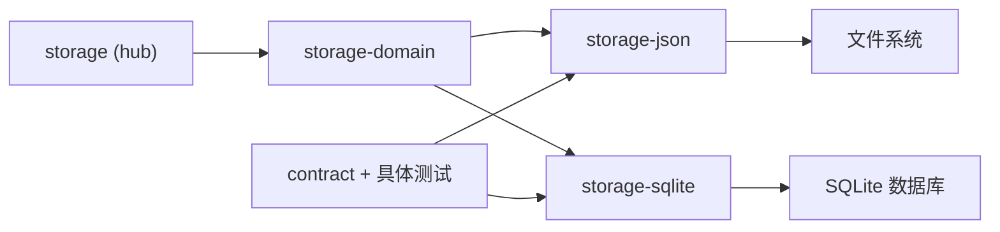

# 存储后端实现示例

<cite>
**本文引用的文件**
- [packages/storage/storage/src/backend.ts](file://packages/storage/storage/src/backend.ts)
- [packages/storage/storage-domain/src/domain.ts](file://packages/storage/storage-domain/src/domain.ts)
- [packages/storage/storage-domain/src/spec.ts](file://packages/storage/storage-domain/src/spec.ts)
- [packages/storage/storage-json/src/index.ts](file://packages/storage/storage-json/src/index.ts)
- [packages/storage/storage-json/src/unit.ts](file://packages/storage/storage-json/src/unit.ts)
- [packages/storage/storage-sqlite/src/index.ts](file://packages/storage/storage-sqlite/src/index.ts)
- [packages/storage/storage-sqlite/src/schema.ts](file://packages/storage/storage-sqlite/src/schema.ts)
- [packages/storage/storage-sqlite/src/unit.ts](file://packages/storage/storage-sqlite/src/unit.ts)
- [packages/storage/storage/tests/contract.ts](file://packages/storage/storage/tests/contract.ts)
- [packages/storage/storage-json/tests/json-backend.spec.ts](file://packages/storage/storage-json/tests/json-backend.spec.ts)
- [packages/storage/storage-sqlite/tests/sqlite-backend.spec.ts](file://packages/storage/storage-sqlite/tests/sqlite-backend.spec.ts)
- [packages/storage/storage-domain/tests/domain.spec.ts](file://packages/storage/storage-domain/tests/domain.spec.ts)
</cite>

## 目录
1. [简介](#简介)
2. [项目结构](#项目结构)
3. [核心组件](#核心组件)
4. [架构总览](#架构总览)
5. [详细组件分析](#详细组件分析)
6. [依赖关系分析](#依赖关系分析)
7. [性能考量](#性能考量)
8. [故障排查指南](#故障排查指南)
9. [结论](#结论)
10. [附录](#附录)

## 简介
本文件面向 DeepSeek Harness 的“存储子系统”，以“如何实现不同类型的存储后端”为目标，系统讲解基于文件的 JSON 存储与基于 SQLite 的关系型存储两种实现。文档围绕以下要点展开：
- 域模型设计：通过 domain 层提供类型安全的 API（定义、校验、路由、事件）。
- 后端契约：统一的 StorageBackend/KvFacet/KvUnit 接口，保证可插拔与一致性。
- JSON 后端：单文件原子写入、序列化格式、并发控制与错误恢复。
- SQLite 后端：表结构设计、查询优化、事务与版本管理。
- 选择策略与切换机制：按域路由到不同后端，支持运行时配置与插件注册。
- 迁移、备份与恢复：从测试与实现中提炼的实践建议。
- 性能调优：读写路径、原子性、WAL、快照迭代等。

## 项目结构
存储子系统由四层组成：
- Hub（storage）：注册后端、挂载数据形式（domain facility），不直接做 IO。
- Domain（storage-domain）：声明域（spec）、打开域（facility）、维护内存权威状态、串行化写链、发出变更事件。
- Backends（storage-json / storage-sqlite）：实现 KvFacet/KvUnit，负责介质持久化。
- Tests（contract + 各后端测试）：共享契约测试与具体行为验证。

图表来源
- [packages/storage/storage/src/backend.ts:17-43](file://packages/storage/storage/src/backend.ts#L17-L43)
- [packages/storage/storage-domain/src/domain.ts:96-119](file://packages/storage/storage-domain/src/domain.ts#L96-L119)
- [packages/storage/storage-json/src/index.ts:37-86](file://packages/storage/storage-json/src/index.ts#L37-L86)
- [packages/storage/storage-sqlite/src/index.ts:55-133](file://packages/storage/storage-sqlite/src/index.ts#L55-L133)

章节来源
- [packages/storage/storage/src/backend.ts:1-105](file://packages/storage/storage/src/backend.ts#L1-L105)
- [packages/storage/storage-domain/src/domain.ts:1-358](file://packages/storage/storage-domain/src/domain.ts#L1-L358)
- [packages/storage/storage-json/src/index.ts:1-115](file://packages/storage/storage-json/src/index.ts#L1-L115)
- [packages/storage/storage-sqlite/src/index.ts:1-169](file://packages/storage/storage-sqlite/src/index.ts#L1-L169)

## 核心组件
- 后端契约（StorageBackend/KvFacet/KvUnit）：统一抽象，要求每个 KV 单元具备 loadAll、putRecord、deleteRecord、setGlobal、close 能力；open 时进行名称与版本校验。
- 域声明（DomainSpec/defineDomain/descriptorOf）：集中描述域身份、版本、全局槽与表结构，并在模块加载期严格校验。
- 域运行时（Domain/DomainImpl）：维护内存权威状态、单写链、事件 emit；读同步、写先落盘再改内存再发事件。
- JSON 后端：每单位一文件，原子重写；延迟物化；失败回滚内存。
- SQLite 后端：单库多单位；STRICT 表；WAL 默认；版本戳与元数据表；逐表预编译语句。

章节来源
- [packages/storage/storage/src/backend.ts:17-104](file://packages/storage/storage/src/backend.ts#L17-L104)
- [packages/storage/storage-domain/src/spec.ts:14-113](file://packages/storage/storage-domain/src/spec.ts#L14-L113)
- [packages/storage/storage-domain/src/domain.ts:18-119](file://packages/storage/storage-domain/src/domain.ts#L18-L119)
- [packages/storage/storage-json/src/unit.ts:24-141](file://packages/storage/storage-json/src/unit.ts#L24-L141)
- [packages/storage/storage-sqlite/src/schema.ts:14-121](file://packages/storage/storage-sqlite/src/schema.ts#L14-L121)
- [packages/storage/storage-sqlite/src/unit.ts:15-157](file://packages/storage/storage-sqlite/src/unit.ts#L15-L157)

## 架构总览
下图展示一次“更新记录”的端到端流程：调用方通过域表 update → 进入写链 → 持久化（JSON 原子文件或 SQLite 语句）→ 成功后更新内存 → 发出 domain/changed 事件。

图表来源
- [packages/storage/storage-domain/src/domain.ts:307-345](file://packages/storage/storage-domain/src/domain.ts#L307-L345)
- [packages/storage/storage-json/src/unit.ts:69-82](file://packages/storage/storage-json/src/unit.ts#L69-L82)
- [packages/storage/storage-sqlite/src/unit.ts:99-118](file://packages/storage/storage-sqlite/src/unit.ts#L99-L118)

## 详细组件分析

### JSON 文件存储后端（storage-json）
- 数据结构与序列化
  - 每单位一个 JSON 文件，包含 unit（name/version）、global、tables（表名→键值对象）。
  - 首次写入才创建文件（延迟物化），避免空介质开销。
  - 使用原子写入确保崩溃后介质一致。
- 并发访问控制
  - 后端维护 open 与 opening 集合，防止重复打开同一单位。
  - 单元内不排队写操作，写序由上层 Domain 写链保证；单个调用在介质上原子。
- 错误处理与恢复
  - 解析失败或版本不符抛出 malformed-medium/version-mismatch。
  - 写入失败时回滚内存，保证内存与介质一致。
- 生命周期
  - apply 注册为 backend 'json'，effect 中提供生命周期服务键，dispose 时注销并关闭。

图表来源
- [packages/storage/storage-json/src/unit.ts:24-45](file://packages/storage/storage-json/src/unit.ts#L24-L45)
- [packages/storage/storage-json/src/unit.ts:69-107](file://packages/storage/storage-json/src/unit.ts#L69-L107)
- [packages/storage/storage-json/src/index.ts:50-75](file://packages/storage/storage-json/src/index.ts#L50-L75)

章节来源
- [packages/storage/storage-json/src/index.ts:17-115](file://packages/storage/storage-json/src/index.ts#L17-L115)
- [packages/storage/storage-json/src/unit.ts:1-142](file://packages/storage/storage-json/src/unit.ts#L1-L142)
- [packages/storage/storage-json/tests/json-backend.spec.ts:24-229](file://packages/storage/storage-json/tests/json-backend.spec.ts#L24-L229)

### SQLite 关系型存储后端（storage-sqlite）
- 表结构与元数据
  - units：记录每个单位的 name/version。
  - unit_globals：记录单位的全局槽值。
  - 每单位每表一张 STRICT 表 u_<unit>_<table>，列 key TEXT PRIMARY KEY, value TEXT NOT NULL。
- 查询优化
  - 每张表预编译 upsert/remove/selectAll 语句，减少重复解析。
  - 读取时使用 Object.create(null) 构建记录对象，避免原型污染。
- 事务与版本管理
  - 数据库级 PRAGMA user_version 标记物理布局版本，不兼容则拒绝打开。
  - 默认 WAL 模式提升并发写入性能；可选 rollback-journal 模式适配网络文件系统。
  - 材料化过程失败不会提前打戳，便于修复后重试。
- 生命周期
  - apply 注册为 backend 'sqlite'，effect 中提供生命周期服务键，dispose 时注销并关闭。

图表来源
- [packages/storage/storage-sqlite/src/index.ts:55-133](file://packages/storage/storage-sqlite/src/index.ts#L55-L133)
- [packages/storage/storage-sqlite/src/unit.ts:27-63](file://packages/storage/storage-sqlite/src/unit.ts#L27-L63)
- [packages/storage/storage-sqlite/src/schema.ts:61-108](file://packages/storage/storage-sqlite/src/schema.ts#L61-L108)

章节来源
- [packages/storage/storage-sqlite/src/index.ts:1-169](file://packages/storage/storage-sqlite/src/index.ts#L1-L169)
- [packages/storage/storage-sqlite/src/schema.ts:1-121](file://packages/storage/storage-sqlite/src/schema.ts#L1-L121)
- [packages/storage/storage-sqlite/src/unit.ts:1-157](file://packages/storage/storage-sqlite/src/unit.ts#L1-L157)
- [packages/storage/storage-sqlite/tests/sqlite-backend.spec.ts:29-273](file://packages/storage/storage-sqlite/tests/sqlite-backend.spec.ts#L29-L273)

### 域模型与类型安全 API（storage-domain）
- 声明式域（DomainSpec）
  - 名称必须匹配 UNIT_NAME_RE；版本为非负整数；表名同样受约束。
  - global 若存在，schema 不得接受 null（避免与“从未写入”哨兵冲突）。
  - defineDomain 在模块加载期即校验，尽早暴露配置错误。
- 打开域（DomainFacility）
  - 根据配置将域名路由到指定后端；要求后端提供 kv facet。
  - 打开流程：检查重复打开 → 解析路由 → 打开单位 → 校验所有记录 → 构造域。
- 运行时（DomainImpl）
  - 读：同步从内存权威状态获取；entries/keys 返回稳定快照。
  - 写：全部入队到单写链；先持久化，成功后再改内存并发出 domain/changed。
  - 关闭：拒绝新写，排空队列，释放单位，允许后续重新打开。

图表来源
- [packages/storage/storage-domain/src/domain.ts:263-345](file://packages/storage/storage-domain/src/domain.ts#L263-L345)

章节来源
- [packages/storage/storage-domain/src/spec.ts:14-113](file://packages/storage/storage-domain/src/spec.ts#L14-L113)
- [packages/storage/storage-domain/src/domain.ts:18-358](file://packages/storage/storage-domain/src/domain.ts#L18-L358)
- [packages/storage/storage-domain/tests/domain.spec.ts:43-359](file://packages/storage/storage-domain/tests/domain.spec.ts#L43-L359)

### 共享契约测试（contract）
- 覆盖关键语义：空单位立即返回空快照、跨重启持久化、覆盖与删除幂等、版本不匹配、关闭后拒绝操作、关闭幂等。
- 两个后端均通过同一套用例，确保行为一致。

章节来源
- [packages/storage/storage/tests/contract.ts:1-103](file://packages/storage/storage/tests/contract.ts#L1-L103)

## 依赖关系分析
- Hub 仅负责注册与挂载，不感知介质细节。
- Domain 依赖 KvUnit 抽象，屏蔽 JSON/SQLite 差异。
- JSON 后端依赖文件系统原子写入；SQLite 后端依赖 node:sqlite 与 schema 管理。
- 测试通过契约与具体用例双重保障。

图表来源
- [packages/storage/storage/src/backend.ts:17-43](file://packages/storage/storage/src/backend.ts#L17-L43)
- [packages/storage/storage-json/src/index.ts:104-115](file://packages/storage/storage-json/src/index.ts#L104-L115)
- [packages/storage/storage-sqlite/src/index.ts:158-169](file://packages/storage/storage-sqlite/src/index.ts#L158-L169)

章节来源
- [packages/storage/storage/src/backend.ts:1-105](file://packages/storage/storage/src/backend.ts#L1-L105)
- [packages/storage/storage-json/src/index.ts:1-115](file://packages/storage/storage-json/src/index.ts#L1-L115)
- [packages/storage/storage-sqlite/src/index.ts:1-169](file://packages/storage/storage-sqlite/src/index.ts#L1-L169)

## 性能考量
- JSON 后端
  - 优点：人类可读、调试友好；适合小体量、低频更新的数据。
  - 注意：每次写整文件原子替换，大对象写入有 I/O 成本；通过延迟物化减少空介质开销。
- SQLite 后端
  - 优点：高并发写入、索引/查询能力强；STRICT 表保障类型；WAL 默认提升吞吐。
  - 注意：网络文件系统可能不支持 WAL，可切换为 delete/truncate/persist；避免对大对象频繁全量替换。
- Domain 写链
  - 单写链保证顺序与一致性；update 在同一键上串行，避免竞态。
  - 读为内存快照，迭代器稳定，适合高频读取场景。

[本节为通用指导，无需特定文件引用]

## 故障排查指南
- 版本不匹配
  - JSON：medium 版本与 descriptor 不一致 → version-mismatch。
  - SQLite：PRAGMA user_version 不匹配 → version-mismatch。
- 介质损坏
  - JSON：无法解析 JSON → malformed-medium。
  - SQLite：value 列非合法 JSON → malformed-medium。
- 重复打开
  - 同一单位重复 open → 抛出 caller error（已打开）。
- 关闭后操作
  - 任何操作在 close 后 → closed。
- 非法名称
  - 单位/表名不符合 UNIT_NAME_RE → malformed-medium 或名称违规错误。
- 监听器异常
  - domain/changed 监听器抛错不会回滚已提交写，仅记录警告。

章节来源
- [packages/storage/storage/tests/contract.ts:74-100](file://packages/storage/storage/tests/contract.ts#L74-L100)
- [packages/storage/storage-json/tests/json-backend.spec.ts:57-184](file://packages/storage/storage-json/tests/json-backend.spec.ts#L57-L184)
- [packages/storage/storage-sqlite/tests/sqlite-backend.spec.ts:75-192](file://packages/storage/storage-sqlite/tests/sqlite-backend.spec.ts#L75-L192)
- [packages/storage/storage-domain/tests/domain.spec.ts:341-359](file://packages/storage/storage-domain/tests/domain.spec.ts#L341-L359)

## 结论
DeepSeek Harness 存储子系统通过清晰的契约与分层设计，实现了可插拔、类型安全、强一致的键值存储。JSON 后端适合轻量、可读性优先的场景；SQLite 后端适合高并发、复杂查询与大规模数据。域层统一管理路由、校验与事件，使业务代码无需关心底层介质细节。结合共享契约测试与丰富的具体用例，可在保证一致性的同时获得良好的性能与可维护性。

[本节为总结，无需特定文件引用]

## 附录

### 数据迁移、备份与恢复
- 迁移策略
  - JSON：通过 descriptor.version 控制兼容性；升级时需确保新版本能解析旧格式或显式拒绝。
  - SQLite：通过 STORAGE_SQLITE_SCHEMA_VERSION 控制物理布局；不兼容时拒绝打开，需外部迁移工具。
- 备份与恢复
  - JSON：直接复制 .json 文件；原子写入保证副本一致性。
  - SQLite：关闭后端或使用只读连接拷贝；WAL 模式下注意共享内存文件。
- 恢复校验
  - 打开后 loadAll 会校验每条记录与全局槽，非法数据将报 malformed-medium。

章节来源
- [packages/storage/storage-json/src/unit.ts:24-45](file://packages/storage/storage-json/src/unit.ts#L24-L45)
- [packages/storage/storage-sqlite/src/schema.ts:14-108](file://packages/storage/storage-sqlite/src/schema.ts#L14-L108)
- [packages/storage/storage-sqlite/src/unit.ts:65-84](file://packages/storage/storage-sqlite/src/unit.ts#L65-L84)

### 存储后端的选择与切换
- 选择策略
  - 小规模/可读性优先 → JSON。
  - 高并发/复杂查询 → SQLite。
- 切换机制
  - 通过 DomainFacility 配置 routes 将不同域名路由到不同后端；默认后端可配置。
  - 插件 apply 中注册后端，生命周期内可用；卸载时自动注销与关闭。

章节来源
- [packages/storage/storage-domain/src/domain.ts:96-119](file://packages/storage/storage-domain/src/domain.ts#L96-L119)
- [packages/storage/storage-json/src/index.ts:104-115](file://packages/storage/storage-json/src/index.ts#L104-L115)
- [packages/storage/storage-sqlite/src/index.ts:158-169](file://packages/storage/storage-sqlite/src/index.ts#L158-L169)