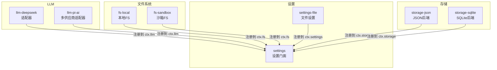
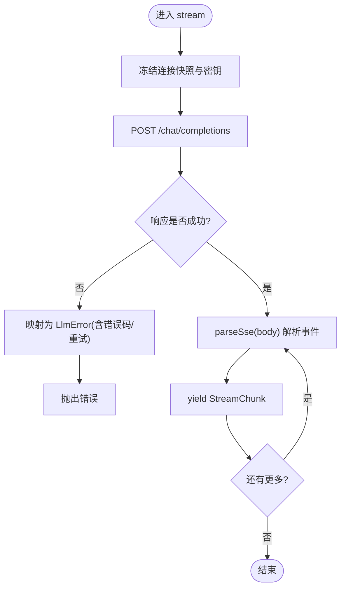
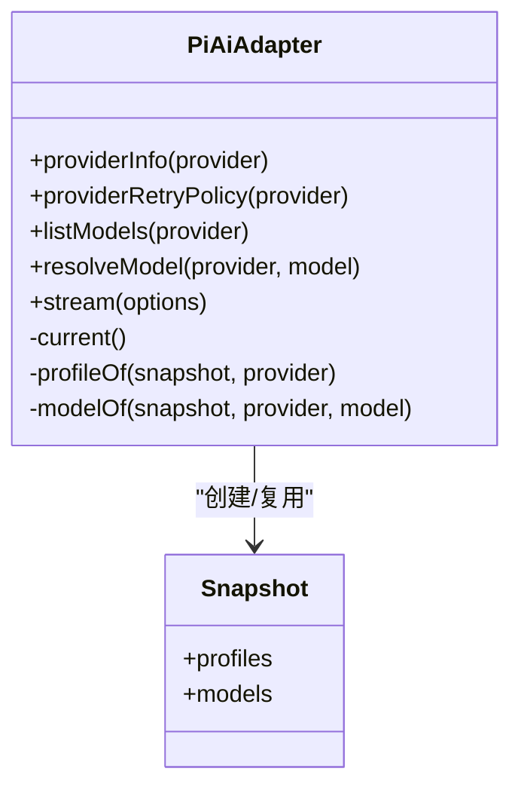
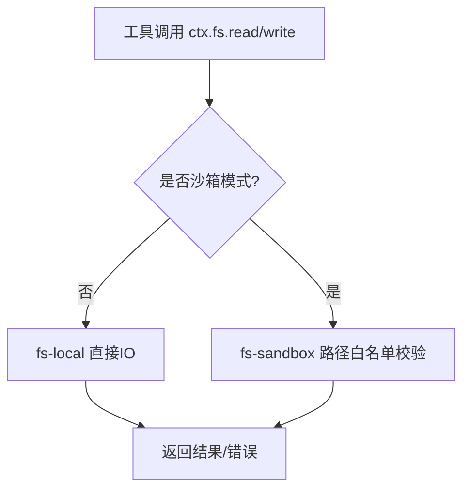
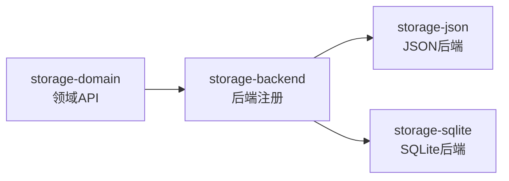
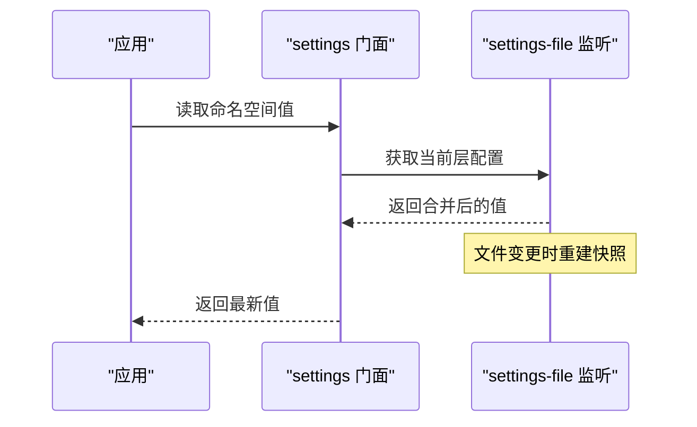
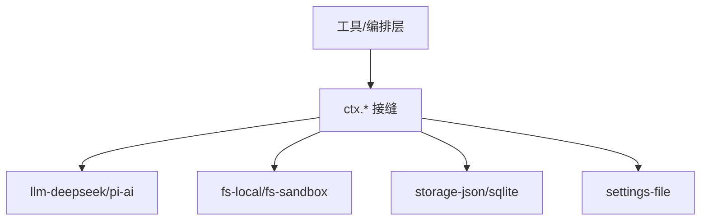

# 实现示例

<cite>
**本文引用的文件**
- [packages/llm/llm-deepseek/src/adapter.ts](file://packages/llm/llm-deepseek/src/adapter.ts)
- [packages/llm/llm-pi-ai/src/adapter.ts](file://packages/llm/llm-pi-ai/src/adapter.ts)
- [packages/fs/fs-local/src/index.ts](file://packages/fs/fs-local/src/index.ts)
- [packages/fs/fs-sandbox/src/index.ts](file://packages/fs/fs-sandbox/src/index.ts)
- [packages/storage/storage/src/backend.ts](file://packages/storage/storage/src/backend.ts)
- [packages/storage/storage-json/src/index.ts](file://packages/storage/storage-json/src/index.ts)
- [packages/storage/storage-sqlite/src/index.ts](file://packages/storage/storage-sqlite/src/index.ts)
- [packages/settings/settings/src/index.ts](file://packages/settings/settings/src/index.ts)
- [packages/settings/settings-file/src/index.ts](file://packages/settings/settings-file/src/index.ts)
- [docs/capability-seams.md](file://docs/capability-seams.md)
</cite>

## 目录
1. [简介](#简介)
2. [项目结构](#项目结构)
3. [核心组件](#核心组件)
4. [架构总览](#架构总览)
5. [详细组件分析](#详细组件分析)
6. [依赖关系分析](#依赖关系分析)
7. [性能考虑](#性能考虑)
8. [故障排查指南](#故障排查指南)
9. [结论](#结论)
10. [附录](#附录)

## 简介
本文件面向需要在 DeepSeek Harness 中扩展“能力接缝”的开发者，提供可直接参考的实现示例与最佳实践。内容覆盖：
- LLM 适配器：注册模型提供商、处理流式响应、错误与重试策略
- 文件系统提供商：本地文件系统与沙箱文件系统
- 存储后端：JSON 存储与 SQLite 存储
- 设置管理器：文件设置与内存设置
每个示例均包含代码路径、配置要点、使用方法、关键设计决策、调试与测试建议，以及正确性与性能的验证方式。

## 项目结构
DeepSeek Harness 通过“服务接缝（seam）”将可插拔能力解耦为独立包，消费方仅依赖接口，具体实现按需装配。下图展示了与本实现示例相关的核心包与职责边界。



图表来源
- [docs/capability-seams.md:412-470](file://docs/capability-seams.md#L412-L470)

章节来源
- [docs/capability-seams.md:412-470](file://docs/capability-seams.md#L412-L470)

## 核心组件
- LLM 适配器
  - 统一抽象：所有适配器继承统一的 LlmAdapter，暴露 providerInfo、listModels、resolveModel、stream 等能力。
  - 流式处理：通过异步迭代器产出 StreamChunk，支持超时、中止、空闲看门狗等。
  - 错误归一化：将 HTTP/协议错误映射为稳定的 LlmError 代码，便于上层重试与诊断。
- 文件系统提供商
  - 统一抽象：通过 ctx.fs 暴露读/写/编辑等操作，工具层不感知底层实现。
  - 沙箱隔离：fs-sandbox 基于共享的沙箱模式限制写入范围，确保安全性。
- 存储后端
  - 统一抽象：storage 包提供后端注册机制，domain 层以领域对象屏蔽 KV 细节。
  - 多后端并存：JSON 与 SQLite 可同时注册，由 domain 选择或按会话/域挂载。
- 设置管理器
  - 分层合并：settings 门面负责 schema、命名空间与值合并；具体实现（如 settings-file）负责持久化。
  - 热更新：每步调用前重新解析配置，保证变更即时生效而不影响进行中请求。

章节来源
- [packages/llm/llm-deepseek/src/adapter.ts:158-347](file://packages/llm/llm-deepseek/src/adapter.ts#L158-L347)
- [packages/llm/llm-pi-ai/src/adapter.ts:186-359](file://packages/llm/llm-pi-ai/src/adapter.ts#L186-L359)
- [packages/fs/fs-local/src/index.ts](file://packages/fs/fs-local/src/index.ts)
- [packages/fs/fs-sandbox/src/index.ts](file://packages/fs/fs-sandbox/src/index.ts)
- [packages/storage/storage/src/backend.ts](file://packages/storage/storage/src/backend.ts)
- [packages/storage/storage-json/src/index.ts](file://packages/storage/storage-json/src/index.ts)
- [packages/storage/storage-sqlite/src/index.ts](file://packages/storage/storage-sqlite/src/index.ts)
- [packages/settings/settings/src/index.ts](file://packages/settings/settings/src/index.ts)
- [packages/settings/settings-file/src/index.ts](file://packages/settings/settings-file/src/index.ts)

## 架构总览
以下序列图展示一次 LLM 流式调用的端到端流程，涵盖适配器选择、凭证解析、网络请求、SSE 解析与异常处理。

```mermaid
sequenceDiagram
participant Caller as "调用方(Agent/工具)"
participant Seam as "ctx.llm 接缝"
participant Adapter as "适配器(DeepSeek/pi-ai)"
participant Net as "HTTP/SSE"
participant Parser as "SSE解析/翻译"
Caller->>Seam : 生成请求(消息/模型/选项)
Seam->>Adapter : stream(options)
Adapter->>Adapter : 读取连接快照/解析密钥
Adapter->>Net : POST /chat/completions (携带鉴权头)
Net-->>Adapter : 200 + SSE body
Adapter->>Parser : parseSse(body, onComment)
Parser-->>Adapter : 事件流
Adapter-->>Caller : yield StreamChunk(增量文本/元数据)
Note over Adapter,Net : 空闲看门狗检测超时; 中止信号传播
alt 非2xx或网络错误
Net-->>Adapter : 错误状态/异常
Adapter-->>Caller : 抛出标准化 LlmError(含错误码/重试信息)
end
```

图表来源
- [packages/llm/llm-deepseek/src/adapter.ts:214-347](file://packages/llm/llm-deepseek/src/adapter.ts#L214-L347)
- [packages/llm/llm-pi-ai/src/adapter.ts:276-359](file://packages/llm/llm-pi-ai/src/adapter.ts#L276-L359)

## 详细组件分析

### LLM 适配器实现示例（DeepSeek）
- 目标
  - 对接 OpenAI 兼容的 chat-completions 端点，输出 Harness 统一的 StreamChunk。
  - 支持模型目录、推理努力级别、上下文窗口、最大 token 等元信息。
  - 将 HTTP 错误映射为稳定错误码，并携带重试提示。
- 关键设计
  - 操作级快照：每次 stream 调用前冻结连接事实与密钥，避免并发下配置漂移。
  - 空闲看门狗：在流读取期间监控无活动，达到阈值抛出 TIMEOUT。
  - 错误归一化：根据状态码与错误体字段映射为 AUTH/RATE_LIMIT/CONTEXT_WINDOW_EXCEEDED 等。
- 使用要点
  - 注册时提供 options() 钩子与 resolveApiKey() 钩子，插件负责校验与分层。
  - 通过 listModels/resolveModel 暴露模型能力，供 UI/编排层选择。
- 配置与调用
  - 配置项包括 baseURL、apiKeyEnv、defaults、maxTokens、models、streamIdleTimeoutMs、retryPolicy。
  - 调用方传入 GenerateOptions（消息、模型、信号、会话ID、压缩用途等）。
- 调试与测试
  - 使用 mock server 模拟不同状态码与 SSE 片段，断言流式输出与错误码。
  - 注入 AbortSignal 与超时，验证中止与超时分支。
- 正确性与性能验证
  - 正确性：对比期望的 StreamChunk 序列；检查错误码与附加字段（requestId、providerRetryAfterMs）。
  - 性能：测量首字节延迟、吞吐、空闲超时触发率；确认未持有长连接泄漏。



图表来源
- [packages/llm/llm-deepseek/src/adapter.ts:214-347](file://packages/llm/llm-deepseek/src/adapter.ts#L214-L347)

章节来源
- [packages/llm/llm-deepseek/src/adapter.ts:29-106](file://packages/llm/llm-deepseek/src/adapter.ts#L29-L106)
- [packages/llm/llm-deepseek/src/adapter.ts:158-347](file://packages/llm/llm-deepseek/src/adapter.ts#L158-L347)

### LLM 适配器实现示例（pi-ai 多供应商）
- 目标
  - 基于 pi-ai SDK 聚合多个供应商，提供统一的 LLM 能力。
  - 支持图像输入、推理级别、缓存保留、传输与超时等配置。
- 关键设计
  - 不可变快照：每次操作构建新的 Models 集合，避免并发下的配置污染。
  - 能力探测：通过 getSupportedThinkingLevels 精确描述推理能力，避免无效选项。
  - 附件支持：当消息包含图片时，需接入 AttachmentStore 进行持久化引用。
- 使用要点
  - profiles() 返回已解析的供应商配置；resolveApiKey() 提供最高优先级的密钥覆盖。
  - 通过 listModels/resolveModel 暴露模型与能力，UI/编排层据此选择。
- 配置与调用
  - 配置项包括 thinkingBudgets、cacheRetention、transport、timeoutMs、websocketConnectTimeoutMs、headers 等。
  - 调用方传入 GenerateOptions（消息、模型、温度、最大 token、会话ID、信号等）。
- 调试与测试
  - 使用 mock server 模拟不同供应商行为；验证图像输入路径与附件集成。
  - 注入不支持的能力（如 stop），断言抛出 UNSUPPORTED_OPTION。
- 正确性与性能验证
  - 正确性：校验模型能力描述与实际请求一致；验证错误分类与透传。
  - 性能：统计多供应商路由开销、流式吞吐、空闲超时命中率。



图表来源
- [packages/llm/llm-pi-ai/src/adapter.ts:56-79](file://packages/llm/llm-pi-ai/src/adapter.ts#L56-L79)
- [packages/llm/llm-pi-ai/src/adapter.ts:186-359](file://packages/llm/llm-pi-ai/src/adapter.ts#L186-L359)

章节来源
- [packages/llm/llm-pi-ai/src/adapter.ts:186-359](file://packages/llm/llm-pi-ai/src/adapter.ts#L186-L359)

### 文件系统提供商实现示例（本地与沙箱）
- 目标
  - 提供统一的文件系统能力，支持本地读写与沙箱隔离。
- 关键设计
  - fs-local：直接访问宿主文件系统，适合开发环境与受信任场景。
  - fs-sandbox：基于共享的沙箱模式限制写入根目录，防止越界修改。
- 使用要点
  - 工具层通过 ctx.fs 调用，无需关心具体实现。
  - 沙箱模式下，所有写操作会被约束到允许的路径集合。
- 配置与调用
  - 通常由部署装配决定启用哪个实现；沙箱模式由 sandbox-policy 统一管理。
- 调试与测试
  - 使用临时目录与只读夹具验证读写、权限、路径规范化。
  - 在沙箱模式下尝试越界写入，断言被拒绝。
- 正确性与性能验证
  - 正确性：校验路径规范化、符号链接处理、跨平台差异。
  - 性能：批量 IO 与并发访问下的稳定性与吞吐。



图表来源
- [packages/fs/fs-local/src/index.ts](file://packages/fs/fs-local/src/index.ts)
- [packages/fs/fs-sandbox/src/index.ts](file://packages/fs/fs-sandbox/src/index.ts)

章节来源
- [packages/fs/fs-local/src/index.ts](file://packages/fs/fs-local/src/index.ts)
- [packages/fs/fs-sandbox/src/index.ts](file://packages/fs/fs-sandbox/src/index.ts)

### 存储后端实现示例（JSON 与 SQLite）
- 目标
  - 提供可扩展的键值存储后端，支持 JSON 文件与 SQLite 数据库。
- 关键设计
  - storage-backend：定义后端注册与生命周期管理。
  - storage-domain：以领域对象封装 KV 操作，屏蔽后端差异。
  - storage-json：原子写入与格式化，适合小中型数据集。
  - storage-sqlite：结构化查询与事务，适合大规模与复杂检索。
- 使用要点
  - 启动时注册多个后端，domain 层按域/会话挂载。
  - 应用通过 domain API 进行增删改查，无需感知后端类型。
- 配置与调用
  - JSON：指定目录与格式选项；SQLite：指定数据库路径与迁移脚本。
- 调试与测试
  - 使用内存后端或临时文件/数据库进行单元测试。
  - 校验事务一致性、并发安全、迁移兼容性。
- 正确性与性能验证
  - 正确性：对比领域模型与持久化结果的一致性。
  - 性能：对比 JSON 与 SQLite 在不同数据规模下的读写延迟与吞吐。



图表来源
- [packages/storage/storage/src/backend.ts](file://packages/storage/storage/src/backend.ts)
- [packages/storage/storage-json/src/index.ts](file://packages/storage/storage-json/src/index.ts)
- [packages/storage/storage-sqlite/src/index.ts](file://packages/storage/storage-sqlite/src/index.ts)

章节来源
- [packages/storage/storage/src/backend.ts](file://packages/storage/storage/src/backend.ts)
- [packages/storage/storage-json/src/index.ts](file://packages/storage/storage-json/src/index.ts)
- [packages/storage/storage-sqlite/src/index.ts](file://packages/storage/storage-sqlite/src/index.ts)

### 设置管理器实现示例（文件与内存）
- 目标
  - 提供分层、可观察的设置系统，支持文件持久化与内存快速切换。
- 关键设计
  - settings：定义命名空间、schema、合并策略与红脱敏。
  - settings-file：监听文件变化，增量加载并合并多层配置。
  - 内存设置：用于测试与热重载，无需落盘。
- 使用要点
  - 插件注册命名空间 schema；消费者按命名空间读取合并后的值。
  - 文件设置支持热更新，不影响进行中请求（操作级快照）。
- 配置与调用
  - 文件设置：指定配置文件路径、监听策略、锁机制。
  - 内存设置：在进程内维护配置树，常用于测试。
- 调试与测试
  - 使用 fixture 配置文件验证合并顺序与默认值。
  - 模拟文件变更事件，验证热更新与回退策略。
- 正确性与性能验证
  - 正确性：校验 schema 校验、红脱敏、并发安全。
  - 性能：大配置文件的加载与合并耗时；高频变更下的稳定性。



图表来源
- [packages/settings/settings/src/index.ts](file://packages/settings/settings/src/index.ts)
- [packages/settings/settings-file/src/index.ts](file://packages/settings/settings-file/src/index.ts)

章节来源
- [packages/settings/settings/src/index.ts](file://packages/settings/settings/src/index.ts)
- [packages/settings/settings-file/src/index.ts](file://packages/settings/settings-file/src/index.ts)

## 依赖关系分析
- 耦合与内聚
  - LLM 适配器与 llm 包强耦合，但对外仅暴露标准接口，降低上游依赖。
  - 文件系统与存储后端通过 ctx.* 接缝解耦，提升可替换性。
- 外部依赖
  - LLM 适配器依赖 HTTP/SSE 与第三方 SDK（如 pi-ai）。
  - 存储后端依赖文件系统或数据库驱动。
- 循环依赖
  - 通过接缝与服务发现避免循环导入；消费方仅依赖接口。
- 集成点
  - 插件在装配阶段注册实现到对应 ctx 键。
  - 工具层通过 ctx 调用，不感知具体实现。



图表来源
- [docs/capability-seams.md:412-470](file://docs/capability-seams.md#L412-L470)

章节来源
- [docs/capability-seams.md:412-470](file://docs/capability-seams.md#L412-L470)

## 性能考虑
- LLM 流式
  - 使用空闲看门狗避免长时间无活动占用资源。
  - 合理设置 maxTokens 与 contextWindow，减少不必要的大请求。
  - 复用连接与头部，减少握手开销。
- 文件系统
  - 批量 IO 与缓冲写入提升吞吐。
  - 沙箱模式下路径校验应高效且幂等。
- 存储
  - JSON 适合小数据与简单查询；SQLite 适合大数据与复杂检索。
  - 使用事务与索引优化写入与查询性能。
- 设置
  - 文件监听采用增量更新，避免全量重读。
  - 大配置分片加载与懒解析。

[本节为通用指导，不直接分析具体文件]

## 故障排查指南
- LLM 适配器
  - 认证失败：检查 apiKey 解析与授权头；核对错误码 AUTH。
  - 速率限制：关注 RATE_LIMIT 与 providerRetryAfterMs，实施指数退避。
  - 上下文超限：捕获 CONTEXT_WINDOW_EXCEEDED，裁剪历史或分段请求。
  - 超时与中止：区分 TIMEOUT 与 ABORTED，记录堆栈与信号来源。
- 文件系统
  - 权限错误：检查用户权限与沙箱白名单。
  - 路径问题：验证规范化与符号链接解析。
- 存储
  - 迁移失败：回滚并检查 schema 版本。
  - 并发冲突：使用事务与重试策略。
- 设置
  - 合并异常：检查 schema 与层级优先级。
  - 热更新失效：确认文件监听与锁机制。

章节来源
- [packages/llm/llm-deepseek/src/adapter.ts:132-149](file://packages/llm/llm-deepseek/src/adapter.ts#L132-L149)
- [packages/llm/llm-deepseek/src/adapter.ts:246-268](file://packages/llm/llm-deepseek/src/adapter.ts#L246-L268)
- [packages/llm/llm-pi-ai/src/adapter.ts:276-359](file://packages/llm/llm-pi-ai/src/adapter.ts#L276-L359)

## 结论
通过能力接缝，DeepSeek Harness 实现了高度可插拔的架构。LLM 适配器、文件系统、存储与设置均以统一接口暴露，便于按需替换与扩展。遵循本指南中的设计决策与实践，可快速实现稳定、可测试、高性能的自定义能力。

[本节为总结，不直接分析具体文件]

## 附录
- 参考文档
  - 能力接缝与服务总览：[capability-seams.md](file://docs/capability-seams.md)
- 示例位置
  - LLM 适配器：llm-deepseek、llm-pi-ai
  - 文件系统：fs-local、fs-sandbox
  - 存储：storage-json、storage-sqlite
  - 设置：settings-file

[本节为导航，不直接分析具体文件]